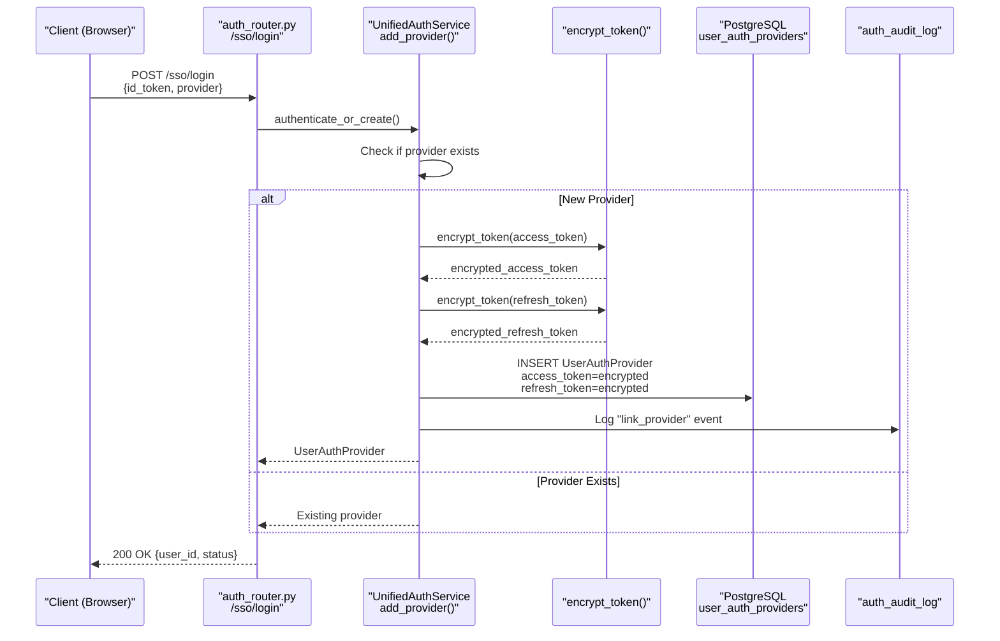
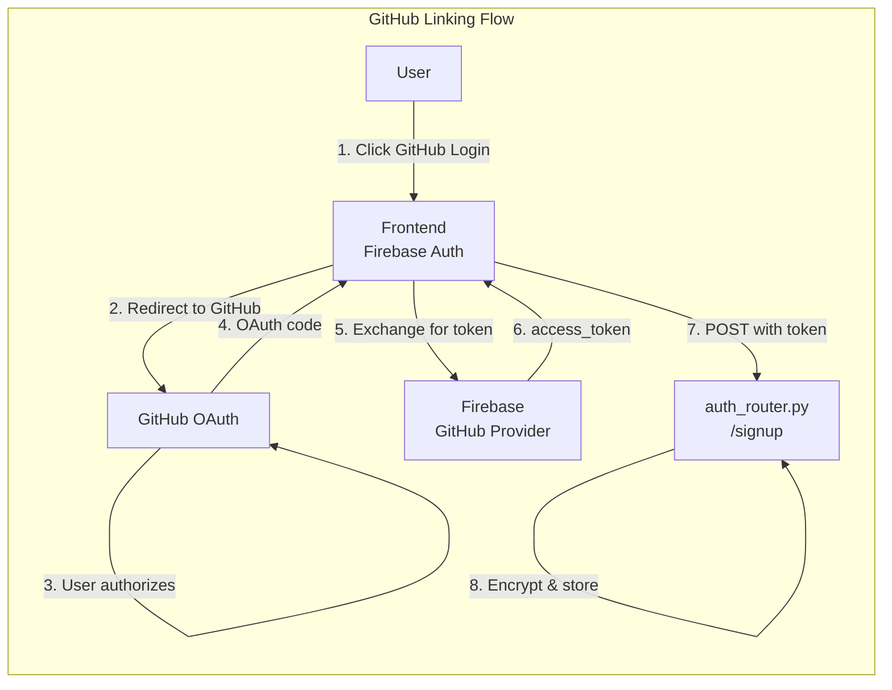
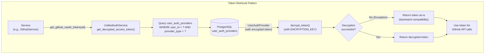
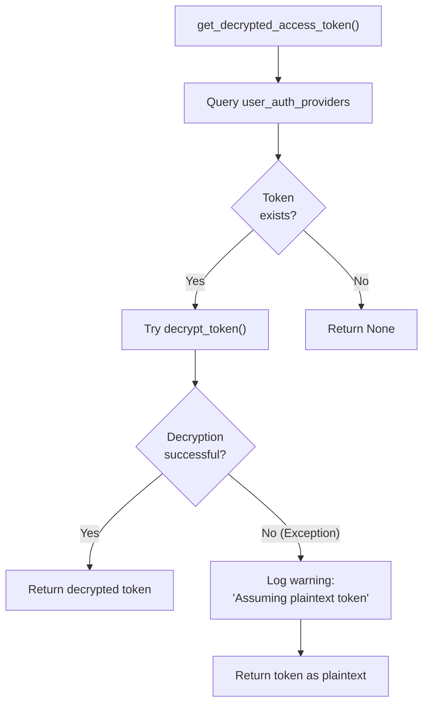
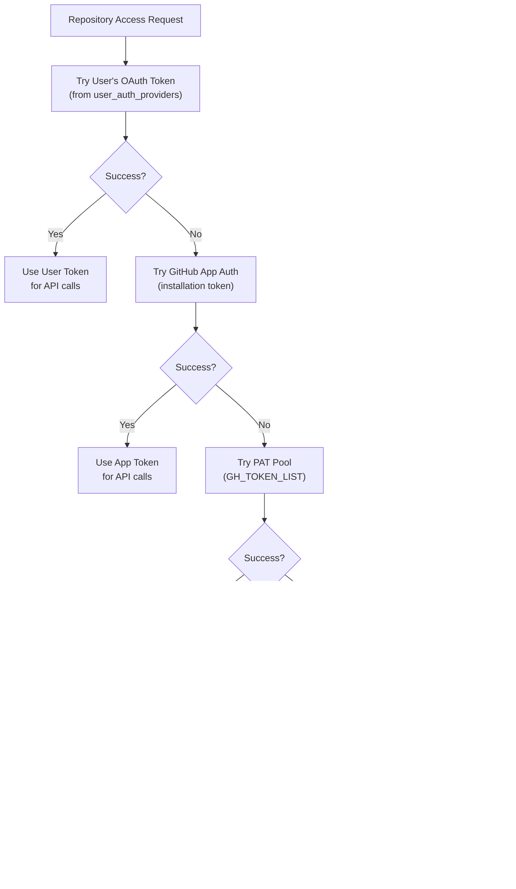
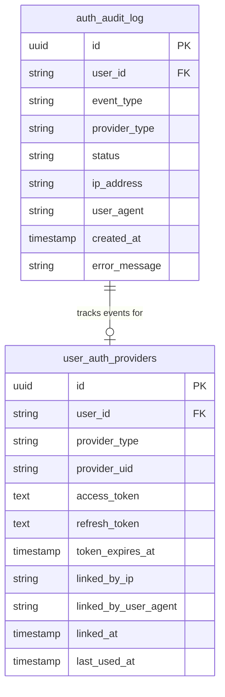

7.4-Token Management and Security

# Page: Token Management and Security

# Token Management and Security

<details>
<summary>Relevant source files</summary>

The following files were used as context for generating this wiki page:

- [app/modules/auth/auth_router.py](app/modules/auth/auth_router.py)
- [app/modules/auth/auth_schema.py](app/modules/auth/auth_schema.py)
- [app/modules/auth/sso_providers/google_provider.py](app/modules/auth/sso_providers/google_provider.py)
- [app/modules/auth/unified_auth_service.py](app/modules/auth/unified_auth_service.py)
- [app/modules/code_provider/github/github_service.py](app/modules/code_provider/github/github_service.py)
- [app/modules/users/user_schema.py](app/modules/users/user_schema.py)

</details>


## Purpose and Scope

This document covers the token management and security infrastructure in Potpie, specifically how OAuth tokens from authentication providers (GitHub, Google, Azure, Okta, SAML) are securely stored, encrypted, and accessed throughout the system.

For information about the broader authentication system and multi-provider authentication, see [Multi-Provider Authentication](#7.1). For details on GitHub linking requirements, see [GitHub Linking Requirement](#7.2). For account consolidation mechanisms, see [Provider Linking and Account Consolidation](#7.3).

## Token Storage Architecture

All OAuth tokens are stored in the `user_auth_providers` table with encrypted values. The system maintains two types of tokens per provider: access tokens (for API authentication) and refresh tokens (for obtaining new access tokens when they expire).

### Database Schema

| Column | Type | Purpose | Encrypted |
|--------|------|---------|-----------|
| `user_id` | string | Foreign key to `users.uid` | No |
| `provider_type` | string | e.g., `firebase_github`, `sso_google` | No |
| `provider_uid` | string | Provider's unique ID for user | No |
| `access_token` | text | Encrypted OAuth access token | Yes |
| `refresh_token` | text | Encrypted OAuth refresh token | Yes |
| `token_expires_at` | timestamp | Token expiration time | No |
| `provider_data` | jsonb | Additional provider metadata | No |
| `is_primary` | boolean | Primary login method flag | No |
| `linked_at` | timestamp | When provider was linked | No |
| `last_used_at` | timestamp | Last authentication timestamp | No |
| `linked_by_ip` | string | IP address during linking | No |
| `linked_by_user_agent` | string | User agent during linking | No |

**Sources:** [app/modules/auth/auth_provider_model.py](), [app/modules/auth/auth_schema.py:26-38]()

## Encryption Implementation

### Fernet Symmetric Encryption

The system uses **Fernet symmetric encryption** (AES-128-CBC with HMAC-SHA256) provided by the Python `cryptography` library. This ensures that tokens stored in the database are encrypted at rest and can only be decrypted with the correct encryption key.

```mermaid
graph TB
    subgraph "Token Encryption Flow"
        PlaintextToken["Plaintext OAuth Token<br/>(from provider)"]
        EncryptFunc["encrypt_token()<br/>app/modules/integrations/token_encryption.py"]
        EncKey["ENCRYPTION_KEY<br/>(environment variable)"]
        Fernet["Fernet Cipher<br/>(AES-128-CBC + HMAC-SHA256)"]
        EncryptedToken["Encrypted Token<br/>(base64-encoded)"]
        DB[("user_auth_providers<br/>access_token column")]
        
        PlaintextToken --> EncryptFunc
        EncKey --> Fernet
        EncryptFunc --> Fernet
        Fernet --> EncryptedToken
        EncryptedToken --> DB
    end
    
    subgraph "Token Decryption Flow"
        DBRead[("user_auth_providers<br/>access_token column")]
        DecryptFunc["decrypt_token()<br/>app/modules/integrations/token_encryption.py"]
        DecKey["ENCRYPTION_KEY<br/>(environment variable)"]
        FernetDec["Fernet Cipher<br/>(AES-128-CBC + HMAC-SHA256)"]
        DecryptedToken["Decrypted Token<br/>(plaintext)"]
        Service["Service<br/>(GithubService, etc.)"]
        
        DBRead --> DecryptFunc
        DecKey --> FernetDec
        DecryptFunc --> FernetDec
        FernetDec --> DecryptedToken
        DecryptedToken --> Service
    end
```



**Sources:** [app/modules/integrations/token_encryption.py]()

### Encryption During Provider Linking

When a new authentication provider is added to a user's account, tokens are encrypted before being stored in the database. This occurs in the `add_provider` method of `UnifiedAuthService`.



**Sources:** [app/modules/auth/unified_auth_service.py:254-264](), [app/modules/auth/auth_router.py:441-570]()

### Key Management

The encryption key is sourced from the `ENCRYPTION_KEY` environment variable. This key must be:
- **Securely generated**: Use `Fernet.generate_key()` to create a valid key
- **Persistently stored**: Must remain constant across deployments to decrypt existing tokens
- **Kept secret**: Never committed to version control or exposed in logs

If the encryption key is lost, all encrypted tokens become permanently inaccessible, requiring users to re-authenticate with their providers.

**Sources:** [app/modules/integrations/token_encryption.py]()

## Token Lifecycle

### 1. Token Acquisition

Tokens are obtained during OAuth authentication flows when users link their accounts with external providers (GitHub, Google, Azure, Okta, SAML).



**Sources:** [app/modules/auth/auth_router.py:72-437]()

### 2. Storage and Encryption

During the signup or SSO login process, the `UnifiedAuthService` encrypts tokens before storage:

[app/modules/auth/unified_auth_service.py:254-264]()
```python
# Encrypt tokens before storing
encrypted_access_token = (
    encrypt_token(provider_create.access_token)
    if provider_create.access_token
    else None
)
encrypted_refresh_token = (
    encrypt_token(provider_create.refresh_token)
    if provider_create.refresh_token
    else None
)

# Create new provider
new_provider = UserAuthProvider(
    user_id=user_id,
    provider_type=provider_create.provider_type,
    provider_uid=provider_create.provider_uid,
    provider_data=provider_create.provider_data,
    access_token=encrypted_access_token,
    refresh_token=encrypted_refresh_token,
    token_expires_at=provider_create.token_expires_at,
    # ... other fields
)
```

### 3. Token Retrieval and Decryption

Services throughout the codebase retrieve and decrypt tokens when they need to access external APIs. The primary use case is GitHub API access.



**Sources:** [app/modules/auth/unified_auth_service.py:176-199](), [app/modules/code_provider/github/github_service.py:184-247]()

### 4. Token Expiration

The system tracks token expiration using the `token_expires_at` column. However, automatic token refresh is not currently implemented. When a token expires:
1. API calls using the expired token will fail
2. Users must re-authenticate with the provider
3. A new token is obtained and encrypted/stored

**Sources:** [app/modules/auth/auth_provider_model.py]()

## Backward Compatibility

### Legacy Plaintext Token Handling

To maintain compatibility with tokens stored before encryption was implemented, the decryption methods include fallback logic that handles plaintext tokens gracefully.

**Decryption Strategy:**



**Implementation Example:**

[app/modules/auth/unified_auth_service.py:176-199]()
```python
def get_decrypted_access_token(
    self, user_id: str, provider_type: str
) -> Optional[str]:
    """
    Get decrypted access token for a user's provider.
    
    Returns None if provider not found or token not available.
    Handles both encrypted and plaintext tokens (backward compatibility).
    """
    provider = self.get_provider(user_id, provider_type)
    if not provider or not provider.access_token:
        return None
    
    try:
        # Try to decrypt (token is encrypted)
        return decrypt_token(provider.access_token)
    except Exception:
        # Token might be plaintext (from before encryption was added)
        # Return as-is for backward compatibility
        logger.warning(
            f"Failed to decrypt token for user {user_id}, provider {provider_type}. "
            "Assuming plaintext token (backward compatibility)."
        )
        return provider.access_token
```

This pattern is also implemented in `GithubService.get_github_oauth_token()`:

[app/modules/code_provider/github/github_service.py:211-225]()
```python
if github_provider and github_provider.access_token:
    logger.info("Found GitHub token in UserAuthProvider for user %s", uid)
    # Decrypt the token before returning
    try:
        decrypted_token = decrypt_token(github_provider.access_token)
        return decrypted_token
    except Exception as e:
        logger.warning(
            "Failed to decrypt GitHub token for user %s: %s. "
            "Assuming plaintext token (backward compatibility).",
            uid,
            str(e),
        )
        # Token might be plaintext (from before encryption was added)
        return github_provider.access_token
```

**Sources:** [app/modules/auth/unified_auth_service.py:176-226](), [app/modules/code_provider/github/github_service.py:211-225]()

## Token Usage in Services

### GitHub API Access

The primary use case for token decryption is accessing the GitHub API on behalf of users. This occurs in several scenarios:

| Operation | Service | Method | Token Usage |
|-----------|---------|--------|-------------|
| List user repositories | `GithubService` | `get_repos_for_user()` | GitHub OAuth token for API calls |
| Fetch file content | `GithubService` | `get_file_content()` | GitHub App or PAT fallback |
| Clone repository | `CodeProviderService` | `clone_or_copy_repository()` | GitHub OAuth for private repos |
| Create GitHub issues/PRs | Integration tools | Various | GitHub OAuth for write operations |

**Token Retrieval Flow:**

[app/modules/code_provider/github/github_service.py:184-247]()
```python
def get_github_oauth_token(self, uid: str) -> Optional[str]:
    """
    Get user's GitHub OAuth token from UserAuthProvider (new system) 
    or provider_info (legacy).
    
    Returns:
        OAuth token if available, None otherwise
    
    Raises:
        HTTPException: If user not found
    """
    user = self.db.query(User).filter(User.uid == uid).first()
    if user is None:
        raise HTTPException(status_code=404, detail="User not found")
    
    # Try new UserAuthProvider system first
    try:
        from app.modules.auth.auth_provider_model import UserAuthProvider
        from app.modules.integrations.token_encryption import decrypt_token
        
        github_provider = (
            self.db.query(UserAuthProvider)
            .filter(
                UserAuthProvider.user_id == uid,
                UserAuthProvider.provider_type == "firebase_github",
            )
            .first()
        )
        if github_provider and github_provider.access_token:
            # Decrypt the token before returning
            try:
                decrypted_token = decrypt_token(github_provider.access_token)
                return decrypted_token
            except Exception as e:
                # Token might be plaintext (backward compatibility)
                return github_provider.access_token
    except Exception as e:
        logger.debug("Error checking UserAuthProvider: %s", str(e))
    
    # Fallback to legacy provider_info system
    # (omitted for brevity)
```

**Sources:** [app/modules/code_provider/github/github_service.py:184-247](), [app/modules/code_provider/github/github_service.py:267-580]()

### Authentication Fallback Chain

When accessing GitHub repositories, the system implements a fallback chain:



**Sources:** [app/modules/code_provider/github/github_service.py:267-363](), [app/modules/code_provider/provider_factory.py]()

## Security Considerations

### Audit Logging

All authentication events that involve tokens are logged to the `auth_audit_log` table, providing a comprehensive audit trail for security monitoring and compliance.

**Logged Events:**

| Event Type | Description | Includes Token Info |
|------------|-------------|---------------------|
| `login` | Successful authentication | Provider type |
| `signup` | New user creation | Provider type |
| `link_provider` | New provider linked | Provider type |
| `unlink_provider` | Provider removed | Provider type |
| `needs_linking` | Account consolidation needed | Provider type |
| `login_blocked_github` | Login blocked (GitHub not linked) | Provider type |

**Audit Log Schema:**



**Implementation:**

[app/modules/auth/unified_auth_service.py:296-304]()
```python
# Audit log
self._log_auth_event(
    user_id=user_id,
    event_type="link_provider",
    provider_type=provider_create.provider_type,
    status="success",
    ip_address=ip_address,
    user_agent=user_agent,
)
```

**Sources:** [app/modules/auth/unified_auth_service.py:296-304](), [app/modules/auth/auth_provider_model.py]()

### IP Address and User Agent Tracking

The system records the IP address and user agent string when providers are linked, enabling detection of suspicious authentication patterns or unauthorized access attempts.

**Tracking Points:**

1. **During Provider Linking** - Recorded in `user_auth_providers.linked_by_ip` and `user_auth_providers.linked_by_user_agent`
2. **During Audit Events** - Recorded in `auth_audit_log.ip_address` and `auth_audit_log.user_agent`

[app/modules/auth/unified_auth_service.py:267-280]()
```python
new_provider = UserAuthProvider(
    user_id=user_id,
    provider_type=provider_create.provider_type,
    provider_uid=provider_create.provider_uid,
    provider_data=provider_create.provider_data,
    access_token=encrypted_access_token,
    refresh_token=encrypted_refresh_token,
    token_expires_at=provider_create.token_expires_at,
    is_primary=is_first or provider_create.is_primary,
    linked_at=utc_now(),
    last_used_at=utc_now(),
    linked_by_ip=ip_address,           # IP tracking
    linked_by_user_agent=user_agent,   # User agent tracking
)
```

**Sources:** [app/modules/auth/unified_auth_service.py:267-280]()

### Token Expiration Management

The system tracks token expiration timestamps but does not currently implement automatic token refresh. Best practices for token expiration:

1. **Short-lived access tokens** - OAuth providers typically issue tokens with 1-hour expiration
2. **Refresh tokens** - Used to obtain new access tokens without re-authentication
3. **Manual re-authentication** - Users must re-authenticate when tokens expire

**Future Enhancement:** Implement automatic token refresh using refresh tokens stored in `user_auth_providers.refresh_token`.

**Sources:** [app/modules/auth/auth_provider_model.py]()

### Error Handling and Logging

The token management system implements comprehensive error handling with appropriate logging levels:

**Logging Strategy:**

| Scenario | Log Level | Message |
|----------|-----------|---------|
| Successful encryption | `DEBUG` | Not logged (normal operation) |
| Successful decryption | `DEBUG` | Not logged (normal operation) |
| Decryption fallback to plaintext | `WARNING` | "Assuming plaintext token (backward compatibility)" |
| Missing token | `INFO`/`WARNING` | "No access_token in provider_info" |
| Token retrieval error | `ERROR` | "Failed to get GitHub client" |

**Error Handling Pattern:**

[app/modules/auth/unified_auth_service.py:188-199]()
```python
try:
    # Try to decrypt (token is encrypted)
    return decrypt_token(provider.access_token)
except Exception:
    # Token might be plaintext (from before encryption was added)
    # Return as-is for backward compatibility
    logger.warning(
        f"Failed to decrypt token for user {user_id}, provider {provider_type}. "
        "Assuming plaintext token (backward compatibility)."
    )
    return provider.access_token
```

**Security Note:** Error messages never include actual token values to prevent accidental exposure in logs or error responses.

**Sources:** [app/modules/auth/unified_auth_service.py:188-199](), [app/modules/code_provider/github/github_service.py:218-225]()

### Token Scope and Permissions

OAuth tokens are obtained with specific scopes that determine what operations they can perform. The system primarily uses tokens for:

1. **GitHub OAuth Scopes:**
   - `repo` - Access to private repositories
   - `user:email` - Read user email addresses
   - `read:org` - Read organization membership

2. **Google OAuth Scopes:**
   - `openid` - OpenID Connect authentication
   - `email` - Read user email
   - `profile` - Read user profile

3. **Azure/Okta/SAML Scopes:**
   - Provider-specific scopes for email and profile access

The system does not currently implement scope validation or restriction beyond what the OAuth provider enforces.

**Sources:** [app/modules/auth/sso_providers/google_provider.py:189-215](), [app/modules/code_provider/github/github_provider.py]()

## Summary

Potpie's token management system provides:

1. **Secure Storage** - Fernet symmetric encryption (AES-128-CBC + HMAC-SHA256) for all OAuth tokens
2. **Backward Compatibility** - Graceful handling of legacy plaintext tokens
3. **Multi-Provider Support** - Unified token management across GitHub, Google, Azure, Okta, and SAML
4. **Comprehensive Auditing** - Full audit trail of token-related events with IP and user agent tracking
5. **Service Integration** - Seamless token retrieval and decryption for GitHub API access and other integrations

The encryption key (`ENCRYPTION_KEY` environment variable) is the single point of security for all stored tokens and must be protected accordingly.

**Sources:** [app/modules/auth/unified_auth_service.py](), [app/modules/integrations/token_encryption.py](), [app/modules/code_provider/github/github_service.py](), [app/modules/auth/auth_provider_model.py]()