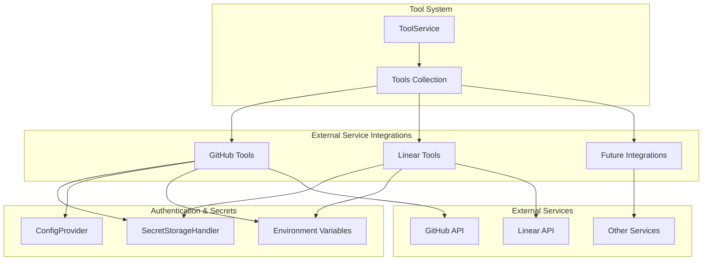
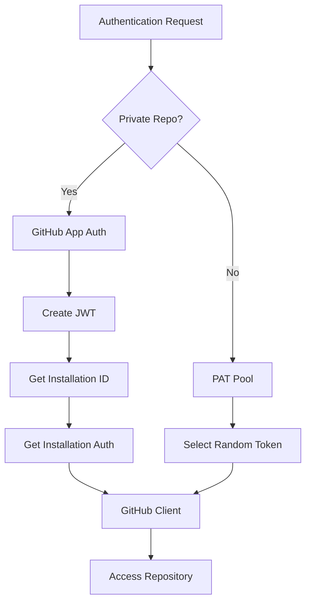
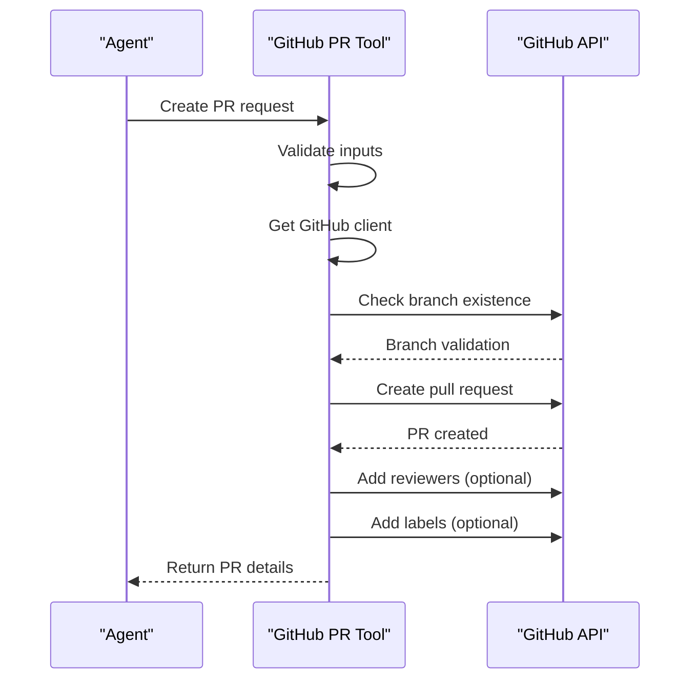
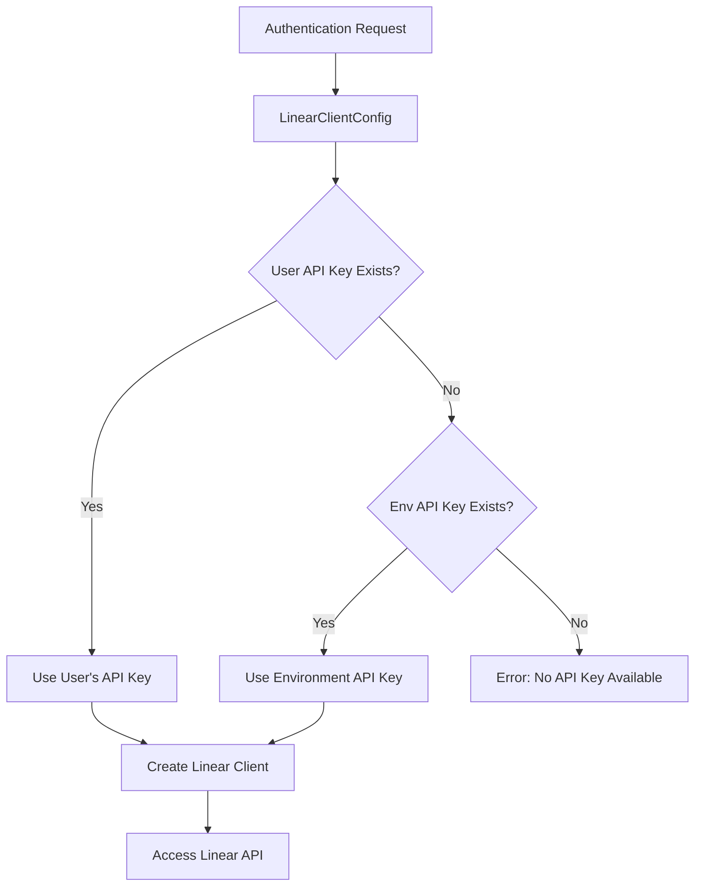
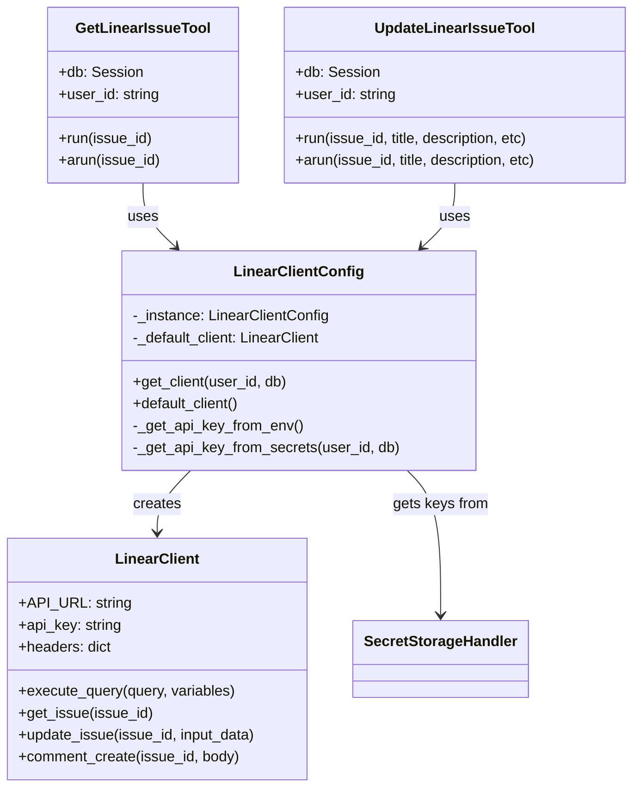
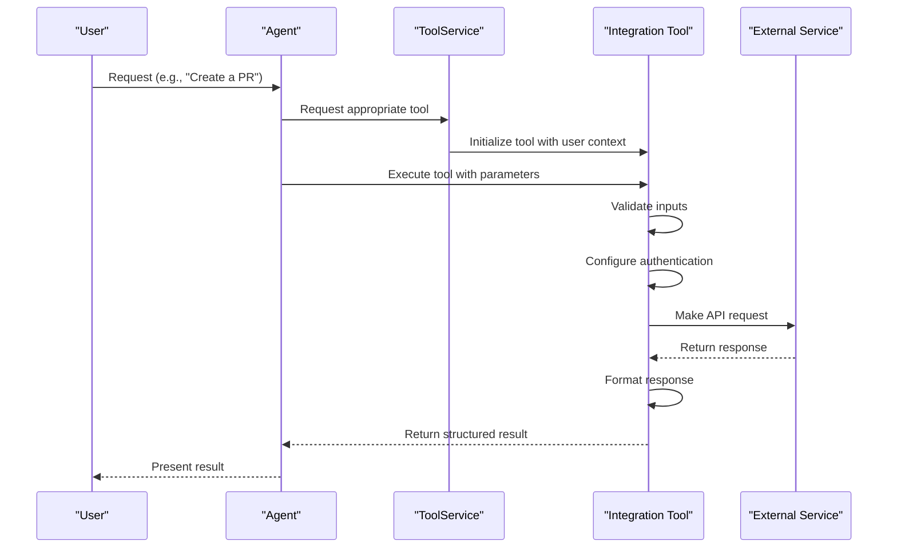

5.7-Tool Helpers and Messaging

# Page: Tool Helpers and Messaging

# External Service Integrations

Relevant source files

The following files were used as context for generating this wiki page:

- [app/modules/intelligence/agents/chat_agents/pydantic_agent.py](app/modules/intelligence/agents/chat_agents/pydantic_agent.py)
- [app/modules/intelligence/agents/chat_agents/tool_helpers.py](app/modules/intelligence/agents/chat_agents/tool_helpers.py)
- [app/modules/intelligence/tools/change_detection/change_detection_tool.py](app/modules/intelligence/tools/change_detection/change_detection_tool.py)
- [app/modules/intelligence/tools/code_query_tools/code_analysis.py](app/modules/intelligence/tools/code_query_tools/code_analysis.py)
- [app/modules/intelligence/tools/code_query_tools/get_file_content_by_path.py](app/modules/intelligence/tools/code_query_tools/get_file_content_by_path.py)
- [app/modules/intelligence/tools/tool_service.py](app/modules/intelligence/tools/tool_service.py)

## Purpose and Scope

This document describes the external service integrations available in Potpie, how they're implemented, and how they can be used by agents. These integrations allow Potpie agents to interact with third-party services, extending their capabilities beyond code analysis. For GitHub-specific integration details, see [GitHub Integration](#5.2).

## Integration Architecture

Potpie's external service integrations follow a consistent architecture pattern, implemented as structured tools that agents can invoke. Each integration provides specialized functionality while maintaining a uniform interface.

Sources: [app/modules/intelligence/tools/web_tools/github_create_branch.py:66-99](), [app/modules/intelligence/tools/linear_tools/linear_client.py:192-237]()

### Common Integration Patterns

External service integrations in Potpie follow these common patterns:

1. **Authentication Flexibility**: Support for both system-wide (environment variables) and user-specific (secret manager) credentials
2. **Structured Tool Interface**: Consistent interface using `StructuredTool` from LangChain
3. **Asynchronous Support**: Both synchronous and asynchronous implementations
4. **Input Validation**: Using Pydantic models to validate inputs
5. **Error Handling**: Detailed error reporting

## GitHub Integration

GitHub integration allows agents to interact with GitHub repositories to perform operations such as creating branches, updating files, creating pull requests, and reviewing code.

### Authentication and Configuration

GitHub tools can authenticate using two methods:

1. **GitHub App Installation**: For private repositories, using a GitHub App with installation-specific access
2. **Personal Access Tokens**: For public repositories, using a pool of tokens

Sources: [app/modules/intelligence/tools/web_tools/github_create_branch.py:64-99](), [app/modules/intelligence/tools/web_tools/github_create_pr.py:77-111]()

### Available GitHub Tools

GitHub integration provides the following tools:

| Tool | Purpose | Functionality |
|------|---------|---------------|
| Create Branch | Create a new branch in a GitHub repository | Creates a branch from an existing base branch |
| Update File | Update or create a file in a branch | Modifies file content with proper commit message |
| Create Pull Request | Create a new PR from changes | Creates PR with title, description, reviewers, and labels |
| Add PR Comments | Add review comments to a PR | Add general or line-specific comments, code suggestions |

#### Example: GitHub PR Creation

The GitHub integration allows creating pull requests with detailed configuration:

Sources: [app/modules/intelligence/tools/web_tools/github_create_pr.py:113-224]()

## Linear Integration

Linear integration enables agents to interact with the Linear project management system, allowing them to get issue details and update issues.

### Authentication Methods

Linear tools support two authentication methods:

1. **User-Specific API Keys**: Stored in the secret manager
2. **Global API Key**: Set through environment variables

This dual approach allows both system-wide configuration and per-user keys.

Sources: [app/modules/intelligence/tools/linear_tools/linear_client.py:192-252]()

### Available Linear Tools

Linear integration provides the following tools:

| Tool | Purpose | Implementation |
|------|---------|----------------|
| Get Linear Issue | Retrieve issue details | Fetches issue by ID with complete metadata |
| Update Linear Issue | Update issue properties | Updates title, description, status, etc. |

#### Linear Client Implementation

The Linear client uses GraphQL to communicate with the Linear API:

Sources: [app/modules/intelligence/tools/linear_tools/linear_client.py:12-283](), [app/modules/intelligence/tools/linear_tools/get_linear_issue_tool.py:17-93](), [app/modules/intelligence/tools/linear_tools/update_linear_issue_tool.py:27-163]()

## Integration Usage Pattern

All external service integrations follow a consistent usage pattern within the agent ecosystem:

Sources: [app/modules/intelligence/tools/web_tools/github_create_pr.py:227-247](), [app/modules/intelligence/tools/linear_tools/get_linear_issue_tool.py:73-93]()

## Setting up Integration Keys

For user-specific integration keys:

1. **GitHub**: Configured via GitHub App installation or tokens in environment
2. **Linear**: Configured via secret manager or environment

### Linear API Key Configuration

Linear integration supports both global and user-specific API keys:

| Method | Configuration | Use Case |
|--------|--------------|----------|
| Environment Variable | `LINEAR_API_KEY=your_api_key` | System-wide default |
| Secret Manager | Stored per-user in database | User-specific access |

The system will check for a user-specific key first, then fall back to the environment variable.

Sources: [app/modules/intelligence/tools/linear_tools/README.md:14-34]()

## Extending with New Integrations

When creating new service integrations, follow these patterns:

1. Create a dedicated directory in `app/modules/intelligence/tools/`
2. Implement API client wrapper with authentication handling
3. Create Pydantic input schemas for validation
4. Implement tool classes with both synchronous and asynchronous methods
5. Register tools in the tool service

New integrations should support both global (environment-based) and user-specific (secret manager-based) authentication when possible.

Sources: [app/modules/intelligence/tools/linear_tools/linear_client.py:192-252](), [app/modules/intelligence/tools/web_tools/github_create_branch.py:65-102]()