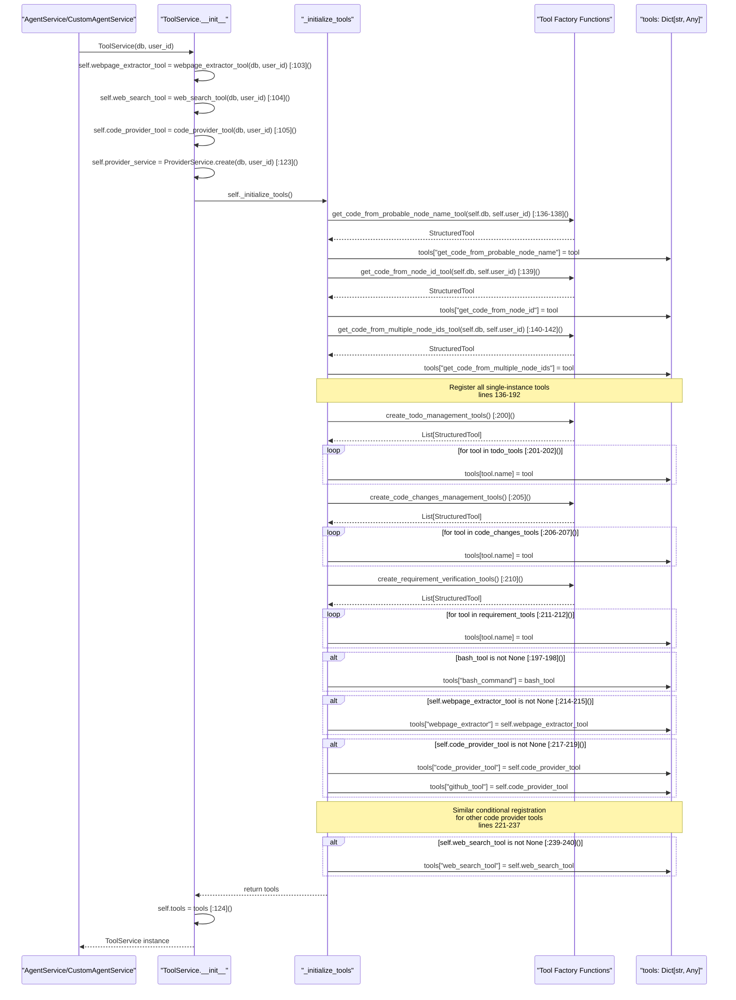
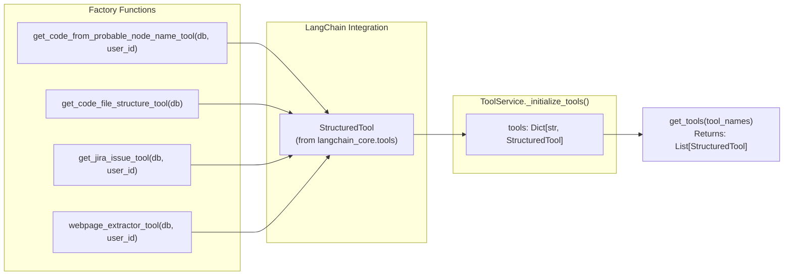
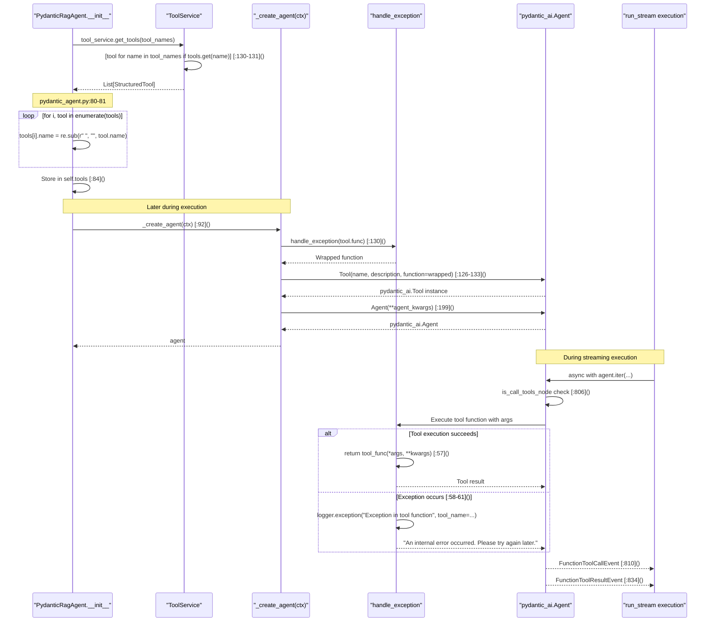
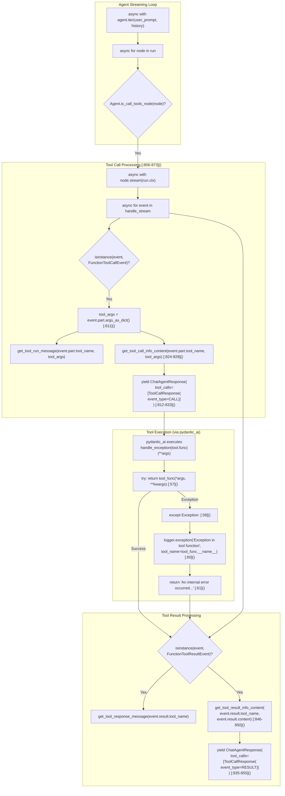

5.1-Tool Service and Management

# Page: Tool Service and Management

# Tool Service and Management

<details>
<summary>Relevant source files</summary>

The following files were used as context for generating this wiki page:

- [app/modules/intelligence/agents/chat_agents/pydantic_agent.py](app/modules/intelligence/agents/chat_agents/pydantic_agent.py)
- [app/modules/intelligence/agents/chat_agents/tool_helpers.py](app/modules/intelligence/agents/chat_agents/tool_helpers.py)
- [app/modules/intelligence/tools/change_detection/change_detection_tool.py](app/modules/intelligence/tools/change_detection/change_detection_tool.py)
- [app/modules/intelligence/tools/code_query_tools/code_analysis.py](app/modules/intelligence/tools/code_query_tools/code_analysis.py)
- [app/modules/intelligence/tools/code_query_tools/get_file_content_by_path.py](app/modules/intelligence/tools/code_query_tools/get_file_content_by_path.py)
- [app/modules/intelligence/tools/tool_service.py](app/modules/intelligence/tools/tool_service.py)

</details>


## Purpose and Scope

This document describes the Tool Service and Management system in Potpie, which provides a centralized registry of 80+ tools that AI agents use to interact with code repositories, knowledge graphs, and external services. The `ToolService` acts as a factory and registry for all available tools, managing their initialization, validation, and retrieval.

For information about how agents execute tools, see [Agent Execution and Streaming](#2.5). For details on specific tool implementations, see [Knowledge Graph Query Tools](#5.2), [Code Analysis Tools](#5.3), and [Integration Tools](#5.4).

## Tool Service Architecture

The `ToolService` class serves as the central hub for tool management, instantiating and registering all available tools for a specific user session.

```mermaid
graph TB
    subgraph "ToolService Class"
        ToolService["ToolService<br/>tool_service.py:99"]
        Init["__init__(db, user_id)<br/>:100-124"]
        ToolsDict["self.tools: Dict[str, Any]<br/>:124"]
        InitTools["_initialize_tools()<br/>:134-243"]
        GetTools["get_tools(tool_names)<br/>:126-132"]
        ListTools["list_tools()<br/>:244-252"]
        ListParams["list_tools_with_parameters()<br/>:254-262"]
    end
    
    subgraph "Tool Categories in _initialize_tools"
        KG["get_code_from_probable_node_name_tool<br/>get_code_from_node_id_tool<br/>ask_knowledge_graph_queries_tool<br/>get_nodes_from_tags_tool<br/>:136-146"]
        Code["get_code_file_structure_tool<br/>fetch_file_tool<br/>analyze_code_structure_tool<br/>get_code_graph_from_node_id_tool<br/>:147-150, 189-192"]
        Jira["get_jira_issue_tool<br/>create_jira_issue_tool<br/>update_jira_issue_tool<br/>+ 7 more<br/>:155-168"]
        Confluence["get_confluence_spaces_tool<br/>create_confluence_page_tool<br/>+ 5 more<br/>:169-185"]
        Linear["get_linear_issue_tool<br/>update_linear_issue_tool<br/>:153-154"]
        Changes["change_detection_tool<br/>:148"]
        Web["webpage_extractor<br/>web_search_tool<br/>:214-240"]
        CodeProvider["code_provider_tool<br/>code_provider_create_branch_tool<br/>code_provider_create_pr_tool<br/>:217-237"]
        Management["create_todo_management_tools<br/>create_code_changes_management_tools<br/>create_requirement_verification_tools<br/>:199-212"]
    end
    
    subgraph "Agent Usage"
        PydanticAgent["PydanticRagAgent<br/>pydantic_agent.py:66"]
        CreateAgent["_create_agent(ctx)<br/>:92-199"]
        ToolsParam["tools: List[StructuredTool]<br/>:71, 84"]
        ToolNormalize["re.sub(r' ', '', tool.name)<br/>:80-81"]
        PydanticTool["pydantic_ai.Tool<br/>:126-133"]
    end
    
    subgraph "Dependencies"
        Session["sqlalchemy.orm.Session<br/>self.db"]
        UserID["str<br/>self.user_id"]
        ProviderSvc["ProviderService<br/>self.provider_service<br/>:123"]
        CodeProviderSvc["CodeProviderService<br/>self.cp_service"]
        Neo4jDriver["Neo4j GraphDatabase.driver"]
    end
    
    Init --> ToolsDict
    Init --> InitTools
    InitTools --> KG
    InitTools --> Code
    InitTools --> Jira
    InitTools --> Confluence
    InitTools --> Linear
    InitTools --> Changes
    InitTools --> Web
    InitTools --> CodeProvider
    InitTools --> Management
    
    ToolsDict --> GetTools
    ToolsDict --> ListTools
    ToolsDict --> ListParams
    
    PydanticAgent --> ToolsParam
    ToolsParam --> ToolNormalize
    ToolNormalize --> CreateAgent
    CreateAgent --> PydanticTool
    
    Session --> Init
    UserID --> Init
    ProviderSvc --> Init
    
    KG -.-> Neo4jDriver
    Code -.-> CodeProviderSvc
```



**Sources:** [app/modules/intelligence/tools/tool_service.py:99-262](), [app/modules/intelligence/agents/chat_agents/pydantic_agent.py:66-199]()

### ToolService Class Structure

The `ToolService` class is instantiated per user session with database and user context:

| Attribute | Type | Initialization | Purpose |
|-----------|------|----------------|---------|
| `self.db` | `sqlalchemy.orm.Session` | Constructor parameter | PostgreSQL database session for data access |
| `self.user_id` | `str` | Constructor parameter | User identifier for authorization and tool filtering |
| `self.webpage_extractor_tool` | `StructuredTool \| None` | `webpage_extractor_tool(db, user_id)` [:103]() | Web page content extraction tool instance |
| `self.web_search_tool` | `StructuredTool \| None` | `web_search_tool(db, user_id)` [:104]() | Web search tool instance |
| `self.code_provider_tool` | `StructuredTool \| None` | `code_provider_tool(db, user_id)` [:105]() | Code provider (GitHub/GitBucket) tool instance |
| `self.code_provider_create_branch_tool` | `StructuredTool \| None` | `code_provider_create_branch_tool(db, user_id)` [:106-108]() | Branch creation tool instance |
| `self.code_provider_create_pr_tool` | `StructuredTool \| None` | `code_provider_create_pull_request_tool(db, user_id)` [:109-111]() | Pull request creation tool instance |
| `self.code_provider_add_pr_comments_tool` | `StructuredTool \| None` | `code_provider_add_pr_comments_tool(db, user_id)` [:112-114]() | PR comment tool instance |
| `self.code_provider_update_file_tool` | `StructuredTool \| None` | `code_provider_update_file_tool(db, user_id)` [:115-117]() | File update tool instance |
| `self.get_code_from_multiple_node_ids_tool` | `GetCodeFromMultipleNodeIdsTool` | `GetCodeFromMultipleNodeIdsTool(db, user_id)` [:118-120]() | Batch node code retrieval tool |
| `self.get_code_graph_from_node_id_tool` | `GetCodeGraphFromNodeIdTool` | `GetCodeGraphFromNodeIdTool(db)` [:121]() | Code graph traversal tool |
| `self.file_structure_tool` | `GetCodeFileStructureTool` | `GetCodeFileStructureTool(db)` [:122]() | Directory structure tool |
| `self.provider_service` | `ProviderService` | `ProviderService.create(db, user_id)` [:123]() | LLM provider for intelligent tools |
| `self.tools` | `Dict[str, Any]` | `self._initialize_tools()` [:124]() | Registry mapping tool names to tool instances |

**Key Methods:**

| Method | Signature | Returns | Purpose |
|--------|-----------|---------|---------|
| `get_tools` | `(tool_names: List[str])` [:126-132]() | `List[StructuredTool]` | Retrieves tool instances by name, filters out non-existent tools |
| `list_tools` | `()` [:244-252]() | `List[ToolInfo]` | Returns list of ToolInfo with id, name, description for all registered tools |
| `list_tools_with_parameters` | `()` [:254-262]() | `Dict[str, ToolInfoWithParameters]` | Returns dict mapping tool IDs to ToolInfoWithParameters including JSON schemas |
| `_initialize_tools` | `()` [:134-243]() | `Dict[str, Any]` | Instantiates and registers all tool instances into a dictionary |

**Sources:** [app/modules/intelligence/tools/tool_service.py:99-262]()

## Tool Initialization and Registration

Tools are initialized lazily when `ToolService` is instantiated, creating all tool instances with user-specific context.



**Conditional Tool Registration:**

1. **`bash_command`** [:196-198](): Added only if `bash_command_tool(self.db, self.user_id)` returns non-None (depends on repo manager configuration and environment settings)
2. **`webpage_extractor`** [:214-215](): Added only if `self.webpage_extractor_tool` is not None (depends on API key configuration)
3. **`web_search_tool`** [:239-240](): Added only if `self.web_search_tool` is not None (depends on API key configuration)
4. **Code provider tools** [:217-237](): Each code provider tool is registered with multiple alias names:
   - `code_provider_tool` and `github_tool` both reference `self.code_provider_tool` [:217-219]()
   - `code_provider_create_branch` and `github_create_branch` both reference `self.code_provider_create_branch_tool` [:221-223]()
   - `code_provider_create_pr` and `github_create_pull_request` both reference `self.code_provider_create_pr_tool` [:225-227]()
   - `code_provider_add_pr_comments` and `github_add_pr_comments` both reference `self.code_provider_add_pr_comments_tool` [:229-233]()
   - `code_provider_update_file` and `github_update_branch` both reference `self.code_provider_update_file_tool` [:235-237]()

**Sources:** [app/modules/intelligence/tools/tool_service.py:196-240]()

## Tool Categories and Registry

Potpie organizes 80+ tools into functional categories with consistent naming patterns:

### Tool Category Matrix

| Category | Tool Count | Primary Dependencies | Example Tools |
|----------|-----------|---------------------|---------------|
| **Knowledge Graph** | 6 | Neo4j, SearchService | `get_code_from_probable_node_name`, `ask_knowledge_graph_queries`, `get_nodes_from_tags` |
| **Code Query** | 6 | CodeProviderService, tree-sitter | `get_code_file_structure`, `fetch_file`, `analyze_code_structure` |
| **Change Detection** | 1 | Git, CodeProviderService | `change_detection` |
| **Jira Integration** | 10 | Jira API | `get_jira_issue`, `create_jira_issue`, `transition_jira_issue` |
| **Confluence Integration** | 7 | Confluence API | `get_confluence_page`, `search_confluence_pages`, `create_confluence_page` |
| **Linear Integration** | 2 | Linear API | `get_linear_issue`, `update_linear_issue` |
| **Code Provider** | 5 | GitHub/GitBucket API | `code_provider_tool`, `code_provider_create_branch`, `code_provider_create_pr` |
| **Web Tools** | 2 | HTTP clients | `webpage_extractor`, `web_search_tool` |
| **Management** | 9 | In-memory state | `create_todo`, `mark_todo_done`, `record_code_change` |
| **Utility** | 3 | Various | `think`, `bash_command`, `intelligent_code_graph` |

**Alias Pattern:** Code provider tools are registered with multiple names for compatibility:
- `code_provider_tool` = `github_tool`
- `code_provider_create_branch` = `github_create_branch`
- `code_provider_create_pr` = `github_create_pull_request`

**Sources:** [app/modules/intelligence/tools/tool_service.py:134-238]()

### Tool Registration Pattern



**Tool Factory Pattern:** Each tool is created via a factory function that:
1. Accepts `db: Session` and optionally `user_id: str`
2. Instantiates tool-specific class (e.g., `GetCodeFromNodeIdTool`)
3. Wraps in `StructuredTool.from_function()` with sync/async support
4. Returns `StructuredTool` instance compatible with LangChain/Pydantic-AI

**Sources:** [app/modules/intelligence/tools/tool_service.py:134-238]()

## Tool Integration with Agents

Agents retrieve and execute tools through a multi-stage pipeline involving tool selection, validation, wrapping, and execution.



**Key Integration Points:**

1. **Tool Name Normalization** [:80-81](): Spaces removed from tool names via `re.sub(r" ", "", tool.name)` because LangGraph/Pydantic-AI do not support spaces in tool identifiers
2. **Exception Wrapping** [:53-63](): `handle_exception(tool_func)` decorator wraps all tool functions:
   - Uses `@functools.wraps(tool_func)` to preserve function metadata [:54]()
   - Catches all exceptions with `except Exception:` [:58]()
   - Logs via `logger.exception("Exception in tool function", tool_name=tool_func.__name__)` [:60]()
   - Returns `"An internal error occurred. Please try again later."` on exception [:61]()
3. **Pydantic-AI Tool Creation** [:126-133](): LangChain `StructuredTool` instances converted to `pydantic_ai.Tool`:
   ```python
   Tool(
       name=tool.name,
       description=tool.description,
       function=handle_exception(tool.func),  # type: ignore
   )
   ```
4. **Streaming Events** [:806-873](): During `is_call_tools_node` processing:
   - `FunctionToolCallEvent` streamed when tool call begins [:810]()
   - Tool arguments extracted via `event.part.args_as_dict()` [:811]()
   - `FunctionToolResultEvent` streamed when tool completes [:834]()

**Sources:** [app/modules/intelligence/agents/chat_agents/pydantic_agent.py:53-63](), [app/modules/intelligence/agents/chat_agents/pydantic_agent.py:80-81](), [app/modules/intelligence/agents/chat_agents/pydantic_agent.py:126-133](), [app/modules/intelligence/agents/chat_agents/pydantic_agent.py:806-873]()

### Custom Agent Tool Validation

Custom agents validate tools during creation to ensure only available tools are used:

```mermaid
graph TB
    subgraph "create_agent flow"
        CreateAgent["create_agent(user_id, agent_data)"]
        ExtractToolIDs["tool_ids = {tool_id for task in tasks for tool_id in task.tools}"]
        FetchTools["tool_service = ToolService(db, user_id)<br/>available_tools = tool_service.list_tools()"]
        ValidateTools["available_tool_ids = {tool.id for tool in available_tools}<br/>invalid_tools = tool_ids - available_tool_ids"]
        CheckInvalid{len(invalid_tools) > 0}
        RaiseError["raise HTTPException(status_code=400,<br/>detail=f'Invalid tool IDs: {invalid_tools}')"]
        EnhanceTasks["enhance_task_descriptions(tasks, agent_data)"]
        PersistAgent["persist_agent(user_id, agent_data, tasks)"]
    end
    
    subgraph "ToolService"
        ListTools["list_tools(): List[ToolInfo]<br/>Returns all tools in self.tools"]
        ToolInfo["ToolInfo(id, name, description)"]
    end
    
    CreateAgent --> ExtractToolIDs
    ExtractToolIDs --> FetchTools
    FetchTools --> ListTools
    ListTools --> ToolInfo
    ToolInfo --> ValidateTools
    ValidateTools --> CheckInvalid
    CheckInvalid -->|Yes| RaiseError
    CheckInvalid -->|No| EnhanceTasks
    EnhanceTasks --> PersistAgent
```

**Validation Logic:**
1. Tool IDs extracted from all tasks: `tool_ids = {tool_id for task in agent_data.tasks for tool_id in task.tools}`
2. Available tools fetched: `available_tools = ToolService(db, user_id).list_tools()`
3. Available tool ID set created: `available_tool_ids = {tool.id for tool in available_tools}`
4. Invalid tools computed: `invalid_tools = tool_ids - available_tool_ids`
5. If invalid tools exist, `HTTPException(status_code=400, detail=f"Invalid tool IDs: {invalid_tools}")` raised
6. If validation passes, flow continues to task enhancement and agent persistence

**Sources:** [app/modules/intelligence/agents/custom_agents/custom_agents_service.py]() (exact line numbers depend on service implementation details not shown in provided files)

## Tool Schema and Metadata

Tools expose metadata through structured schemas enabling agents and UI to understand tool capabilities:

### ToolInfo Schema

```python
# app/modules/intelligence/tools/tool_schema.py
class ToolInfo(BaseModel):
    id: str              # Tool identifier (registry key, e.g., "get_code_from_node_id")
    name: str            # Tool name from StructuredTool.name (e.g., "get_code_from_node_id")
    description: str     # Tool description from StructuredTool.description
```

Generated in `list_tools()` [:244-252]():
```python
return [
    ToolInfo(
        id=tool_id,
        name=tool.name,
        description=tool.description,
    )
    for tool_id, tool in self.tools.items()
]
```

### ToolInfoWithParameters Schema

```python
# app/modules/intelligence/tools/tool_schema.py
class ToolInfoWithParameters(BaseModel):
    name: str                    # Tool name from StructuredTool.name
    description: str             # Tool description from StructuredTool.description
    args_schema: Dict[str, Any]  # JSON schema from tool.args_schema.schema()
```

Generated in `list_tools_with_parameters()` [:254-262]():
```python
return {
    tool_id: ToolInfoWithParameters(
        name=tool.name,
        description=tool.description,
        args_schema=tool.args_schema.schema() if tool.args_schema else {},
    )
    for tool_id, tool in self.tools.items()
}
```

**Example Tool Schema:**

```json
{
  "fetch_file": {
    "name": "fetch_file",
    "description": "Fetch file content from a repository using the project_id and file path...",
    "args_schema": {
      "type": "object",
      "properties": {
        "project_id": {
          "type": "string",
          "description": "Project ID that references the repository"
        },
        "file_path": {
          "type": "string",
          "description": "Path to the file within the repo"
        },
        "start_line": {
          "type": "integer",
          "description": "First line to fetch (1-based, inclusive)"
        },
        "end_line": {
          "type": "integer",
          "description": "Last line to fetch (inclusive)"
        }
      },
      "required": ["project_id", "file_path"]
    }
  }
}
```

**Schema Generation:** Tool schemas are automatically derived from Pydantic `BaseModel` classes defined as `args_schema` on each tool.

**Sources:** [app/modules/intelligence/tools/tool_service.py:240-258](), [app/modules/intelligence/tools/tool_schema.py]()

## Tool Execution Pipeline

Tools execute within a controlled pipeline that handles exceptions, logging, and streaming:



**Execution Flow:**

1. **Tool Call Detection** [:806](): `Agent.is_call_tools_node(node)` check during iteration over `async with agent.iter(...) as run:`
2. **Event Streaming Start** [:807-809](): `async with node.stream(run.ctx) as handle_stream:` opens streaming context
3. **Tool Call Event** [:810-833](): When `isinstance(event, FunctionToolCallEvent)`:
   - Extract arguments: `tool_args = event.part.args_as_dict()` [:811]()
   - Generate user-friendly message: `get_tool_run_message(event.part.tool_name, tool_args)` [:819-821]()
   - Generate detailed info: `get_tool_call_info_content(event.part.tool_name, tool_args)` [:824-828]()
   - Yield `ChatAgentResponse` with `ToolCallResponse(event_type=ToolCallEventType.CALL)` [:812-833]()
4. **Exception Handling** [:53-63](): `handle_exception` wrapper:
   - Catches all exceptions: `except Exception:` [:58]()
   - Logs via Loguru: `logger.exception("Exception in tool function", tool_name=tool_func.__name__)` [:60]()
   - Returns: `"An internal error occurred. Please try again later."` [:61]()
5. **Tool Result Event** [:834-855](): When `isinstance(event, FunctionToolResultEvent)`:
   - Generate response message: `get_tool_response_message(event.result.tool_name or "unknown tool")` [:841-843]()
   - Generate result info: `get_tool_result_info_content(event.result.tool_name or "unknown tool", event.result.content)` [:846-850]()
   - Yield `ChatAgentResponse` with `ToolCallResponse(event_type=ToolCallEventType.RESULT)` [:835-855]()

**Error Handling Strategy:**
- Tools never crash agent execution due to `handle_exception` wrapper
- All exceptions logged with full traceback via `logger.exception()` [:60]()
- Generic error message prevents leaking sensitive implementation details to LLM
- Error message returned as normal tool result, allowing agent to continue execution

**Sources:** [app/modules/intelligence/agents/chat_agents/pydantic_agent.py:53-63](), [app/modules/intelligence/agents/chat_agents/pydantic_agent.py:806-873]()

## Tool Instance Management

Several tools are instantiated as instance variables for reuse across multiple calls:

### Pre-instantiated Tool Instances

| Instance Variable | Type | Initialized At | Purpose | Registry Keys |
|------------------|------|----------------|---------|---------------|
| `self.webpage_extractor_tool` | `StructuredTool \| None` | [:103]() | Web page content extraction | `"webpage_extractor"` [:214-215]() |
| `self.web_search_tool` | `StructuredTool \| None` | [:104]() | Web search functionality | `"web_search_tool"` [:239-240]() |
| `self.code_provider_tool` | `StructuredTool \| None` | [:105]() | GitHub/GitBucket API operations | `"code_provider_tool"`, `"github_tool"` [:217-219]() |
| `self.code_provider_create_branch_tool` | `StructuredTool \| None` | [:106-108]() | Branch creation | `"code_provider_create_branch"`, `"github_create_branch"` [:221-223]() |
| `self.code_provider_create_pr_tool` | `StructuredTool \| None` | [:109-111]() | Pull request creation | `"code_provider_create_pr"`, `"github_create_pull_request"` [:225-227]() |
| `self.code_provider_add_pr_comments_tool` | `StructuredTool \| None` | [:112-114]() | PR comment management | `"code_provider_add_pr_comments"`, `"github_add_pr_comments"` [:229-233]() |
| `self.code_provider_update_file_tool` | `StructuredTool \| None` | [:115-117]() | File content updates | `"code_provider_update_file"`, `"github_update_branch"` [:235-237]() |
| `self.get_code_from_multiple_node_ids_tool` | `GetCodeFromMultipleNodeIdsTool` | [:118-120]() | Batch node code retrieval | `"get_code_from_multiple_node_ids"` [:140-142]() |
| `self.get_code_graph_from_node_id_tool` | `GetCodeGraphFromNodeIdTool` | [:121]() | Graph traversal | `"get_code_graph_from_node_id"` [:147]() |
| `self.file_structure_tool` | `GetCodeFileStructureTool` | [:122]() | Directory structure | `"get_code_file_structure"` [:149]() |

**Rationale for Pre-instantiation:**
- **Shared expensive initialization**: API clients (webpage extractor, web search) initialized once, reused across invocations
- **Multi-alias registration**: Code provider tools registered under multiple names (`code_provider_*` and `github_*`) pointing to same instance
- **Tool composition**: Other tools can access these instances (e.g., `change_detection_tool` uses `GetCodeFromNodeIdTool` instance [:726-728]())
- **Consistent configuration**: All references to the same tool use identical configuration and state

**Sources:** [app/modules/intelligence/tools/tool_service.py:103-123](), [app/modules/intelligence/tools/change_detection/change_detection_tool.py:726-728]()

## Tool Discovery and Listing

The `ToolService` provides two methods for discovering available tools:

### Basic Tool Listing

```python
tools = tool_service.list_tools()
# Returns: List[ToolInfo]
# [
#   ToolInfo(id="get_code_from_node_id", name="get_code_from_node_id", 
#            description="Retrieves code content for a node..."),
#   ToolInfo(id="fetch_file", name="fetch_file", 
#            description="Fetch file content from a repository..."),
#   ...
# ]
```

### Detailed Tool Listing with Parameters

```python
tools_with_params = tool_service.list_tools_with_parameters()
# Returns: Dict[str, ToolInfoWithParameters]
# {
#   "get_code_from_node_id": ToolInfoWithParameters(
#     name="get_code_from_node_id",
#     description="Retrieves code content for a node...",
#     args_schema={
#       "type": "object",
#       "properties": {
#         "project_id": {"type": "string", ...},
#         "node_id": {"type": "string", ...}
#       },
#       "required": ["project_id", "node_id"]
#     }
#   ),
#   ...
# }
```

**Use Cases:**
- **UI Tool Browser**: Display available tools with descriptions
- **Agent Creation**: Validate tool IDs during custom agent creation
- **Documentation**: Generate API documentation for tools
- **Prompt Engineering**: Include tool capabilities in system prompts

**Sources:** [app/modules/intelligence/tools/tool_service.py:240-258]()

## Adding New Tools

To add a new tool to Potpie, follow this pattern:

### Step 1: Create Tool Implementation

```python
# app/modules/intelligence/tools/my_category/my_new_tool.py
from pydantic import BaseModel, Field
from langchain_core.tools import StructuredTool

class MyNewToolInput(BaseModel):
    param1: str = Field(..., description="First parameter")
    param2: int = Field(..., description="Second parameter")

class MyNewTool:
    name = "my_new_tool"
    description = """Tool description for LLM consumption..."""
    
    def __init__(self, db: Session, user_id: str):
        self.db = db
        self.user_id = user_id
    
    def _run(self, param1: str, param2: int) -> dict:
        # Synchronous implementation
        return {"result": "success"}
    
    async def _arun(self, param1: str, param2: int) -> dict:
        # Asynchronous implementation
        return self._run(param1, param2)

def my_new_tool_factory(db: Session, user_id: str) -> StructuredTool:
    tool_instance = MyNewTool(db, user_id)
    return StructuredTool.from_function(
        func=tool_instance._run,
        coroutine=tool_instance._arun,
        name=tool_instance.name,
        description=tool_instance.description,
        args_schema=MyNewToolInput,
    )
```

### Step 2: Register in ToolService

```python
# app/modules/intelligence/tools/tool_service.py

# Import the factory
from app.modules.intelligence.tools.my_category.my_new_tool import (
    my_new_tool_factory,
)

class ToolService:
    def _initialize_tools(self) -> Dict[str, StructuredTool]:
        tools = {
            # ... existing tools ...
            "my_new_tool": my_new_tool_factory(self.db, self.user_id),
        }
        return tools
```

### Step 3: Add to Agent Tool Lists

Update agent configurations to include the new tool (if applicable):

```python
# app/modules/intelligence/agents/system_agents/agent_configurations.py
# Add to appropriate agent's tool list
```

**Best Practices:**
- Follow naming convention: lowercase with underscores
- Provide comprehensive description for LLM understanding
- Implement both sync (`_run`) and async (`_arun`) methods
- Use Pydantic models for input validation
- Handle errors gracefully within tool implementation
- Add logging for debugging and monitoring
- Cache expensive operations when possible

**Sources:** [app/modules/intelligence/tools/tool_service.py:134-238]()