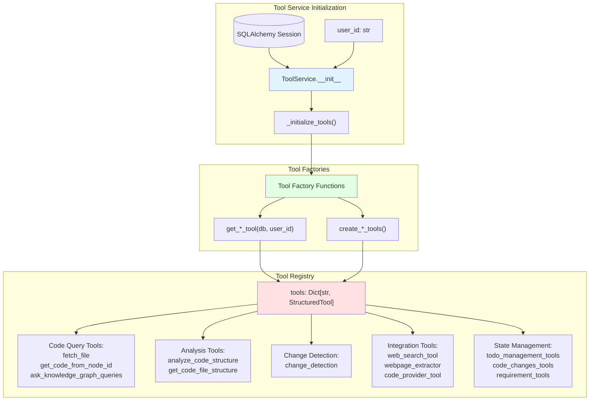
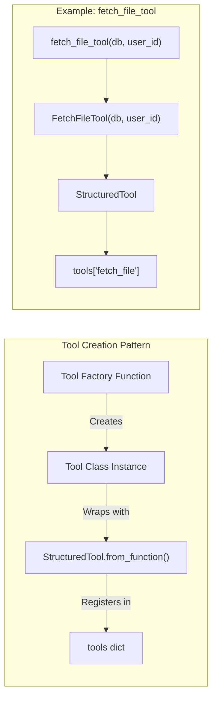
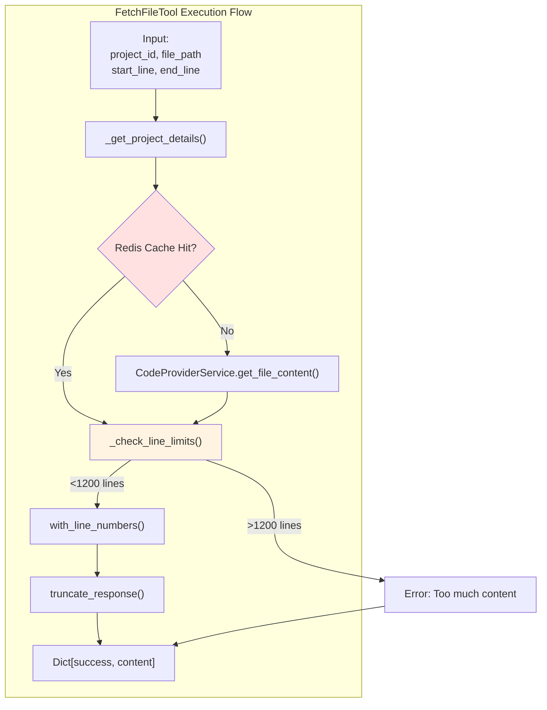
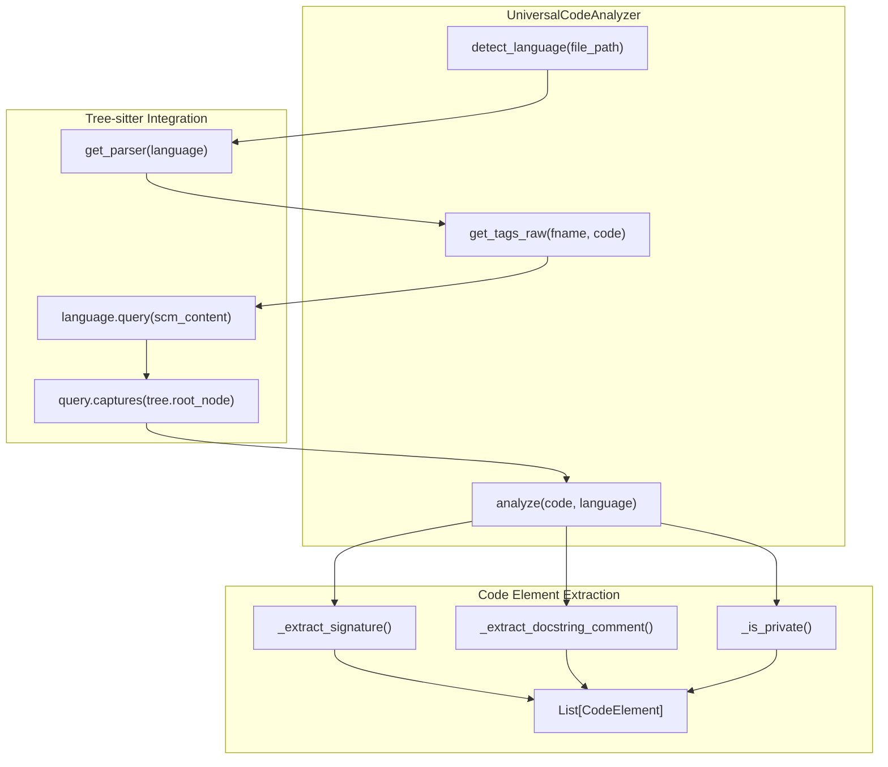
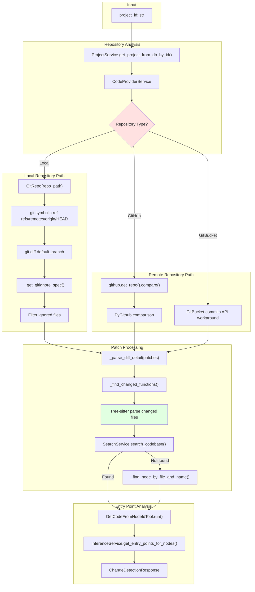
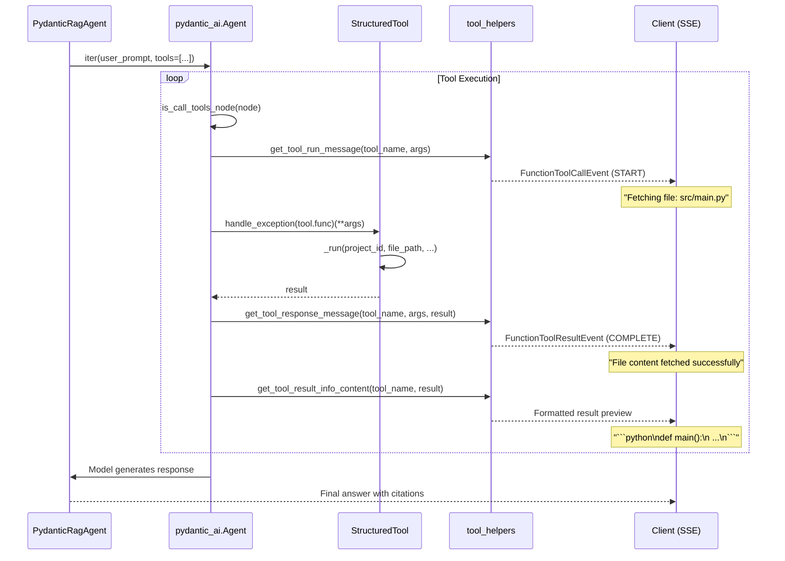
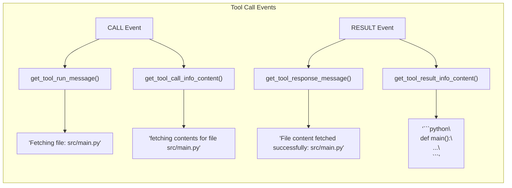

5-Tool System

# Page: Tool System

# Tool System

<details>
<summary>Relevant source files</summary>

The following files were used as context for generating this wiki page:

- [app/modules/intelligence/agents/chat_agents/pydantic_agent.py](app/modules/intelligence/agents/chat_agents/pydantic_agent.py)
- [app/modules/intelligence/agents/chat_agents/tool_helpers.py](app/modules/intelligence/agents/chat_agents/tool_helpers.py)
- [app/modules/intelligence/tools/change_detection/change_detection_tool.py](app/modules/intelligence/tools/change_detection/change_detection_tool.py)
- [app/modules/intelligence/tools/code_query_tools/code_analysis.py](app/modules/intelligence/tools/code_query_tools/code_analysis.py)
- [app/modules/intelligence/tools/code_query_tools/get_file_content_by_path.py](app/modules/intelligence/tools/code_query_tools/get_file_content_by_path.py)
- [app/modules/intelligence/tools/tool_service.py](app/modules/intelligence/tools/tool_service.py)

</details>


The Tool System provides AI agents with structured, validated interfaces for interacting with code repositories, external services, and internal state. It implements a registry-based architecture where tools are initialized with dependency injection, registered by name, and invoked by agents through the PydanticAI framework. The system bridges natural language queries to concrete code operations through 40+ specialized tools organized into code query, analysis, change detection, and integration categories.

For information about how agents use these tools in their execution pipeline, see [Agent Execution Pipeline](#2.5). For details on specific integration tools with external services, see [Integration Tools](#5.6).

---

## Architecture Overview

The tool system implements a service-oriented architecture where `ToolService` acts as the central registry, managing tool instantiation, dependency injection, and lifecycle. Tools are implemented as LangChain `StructuredTool` instances with Pydantic schemas for type-safe parameter validation. The system supports both synchronous and asynchronous execution patterns, with Redis-based caching for expensive operations.

### Tool Service Registration Flow



**Sources:** [app/modules/intelligence/tools/tool_service.py:99-243]()

---

## ToolService Class

The `ToolService` class serves as the central tool registry and factory, managing tool instantiation with proper dependency injection. Initialized with a database session and user ID, it creates instances of all available tools and provides lookup methods for agent execution.

### Core Methods

| Method | Purpose | Return Type |
|--------|---------|-------------|
| `__init__(db, user_id)` | Initialize service with dependencies | None |
| `_initialize_tools()` | Create and register all tool instances | `Dict[str, StructuredTool]` |
| `get_tools(tool_names)` | Retrieve specific tools by name | `List[StructuredTool]` |
| `list_tools()` | Get metadata for all tools | `List[ToolInfo]` |
| `list_tools_with_parameters()` | Get full schemas with parameters | `Dict[str, ToolInfoWithParameters]` |

### Tool Registration Pattern



**Sources:** [app/modules/intelligence/tools/tool_service.py:99-243](), [app/modules/intelligence/tools/code_query_tools/get_file_content_by_path.py:239-249]()

---

## Code Query Tools

Code query tools provide access to the Neo4j knowledge graph and repository files, enabling agents to navigate code structure, retrieve specific nodes, and perform semantic searches.

### Available Code Query Tools

| Tool Name | Function | Description |
|-----------|----------|-------------|
| `fetch_file` | `fetch_file_tool()` | Retrieve file content with optional line ranges (max 1200 lines) |
| `get_code_from_node_id` | `get_code_from_node_id_tool()` | Get code snippet for a specific Neo4j node ID |
| `get_code_from_multiple_node_ids` | `get_code_from_multiple_node_ids_tool()` | Batch retrieve multiple nodes |
| `ask_knowledge_graph_queries` | `get_ask_knowledge_graph_queries_tool()` | Execute semantic search queries against the graph |
| `get_code_from_probable_node_name` | `get_code_from_probable_node_name_tool()` | Fuzzy search for nodes by name |
| `get_nodes_from_tags` | `get_nodes_from_tags_tool()` | Query nodes by metadata tags |
| `get_code_graph_from_node_id` | `get_code_graph_from_node_id_tool()` | Retrieve node with its graph context |
| `get_node_neighbours_from_node_id` | `get_node_neighbours_from_node_id_tool()` | Get connected nodes (CALLS, REFERENCES relationships) |
| `get_code_file_structure` | `get_code_file_structure_tool()` | Get directory tree structure |
| `intelligent_code_graph` | `get_intelligent_code_graph_tool()` | AI-enhanced graph traversal |

### FetchFileTool Implementation

The `FetchFileTool` class implements cached file retrieval with line limits and validation:



**Key Features:**
- **Caching:** Redis cache with 10-minute TTL (`cache_key: file_content:{project_id}:exact_path_{file_path}:start_line_{start_line}:end_line_{end_line}`)
- **Line Limits:** Maximum 1200 lines per request to prevent context overflow
- **Truncation:** Maximum 80,000 characters per response with truncation notice
- **Line Numbers:** Optional line numbering in format `{line_number}:{content}`

**Sources:** [app/modules/intelligence/tools/code_query_tools/get_file_content_by_path.py:26-250]()

---

## Code Analysis Tools

The code analysis subsystem uses Tree-sitter for language-agnostic parsing, extracting structured information about classes, functions, methods, and other code elements across 15+ programming languages.

### UniversalAnalyzeCodeTool Architecture



### CodeElement Schema

The `CodeElement` Pydantic model captures comprehensive metadata for each parsed element:

| Field | Type | Description |
|-------|------|-------------|
| `name` | `str` | Element identifier |
| `type` | `str` | function, class, method, interface, struct, enum, etc. |
| `start_line` | `int` | 1-indexed line number |
| `end_line` | `int` | 1-indexed end line |
| `docstring` | `Optional[str]` | Extracted documentation |
| `parent_class` | `Optional[str]` | For methods, the containing class |
| `signature` | `str` | Full function/method signature |
| `is_private` | `bool` | Private/protected visibility |
| `is_async` | `bool` | Async function detection |
| `is_static` | `bool` | Static method detection |
| `visibility` | `Optional[str]` | public, private, protected, internal |
| `language` | `str` | Detected programming language |
| `parameters` | `List[str]` | Parameter list |
| `return_type` | `Optional[str]` | Return type annotation |

### Language Support

The analyzer uses Tree-sitter query files from `modules/parsing/graph_construction/queries/tree-sitter-{lang}-tags.scm` to support:

- Python, JavaScript, TypeScript
- Java, C, C++, C#
- Go, Rust, Ruby, PHP
- Swift, Kotlin, Scala
- And more via `grep_ast.filename_to_lang()`

**Sources:** [app/modules/intelligence/tools/code_query_tools/code_analysis.py:66-592]()

---

## Change Detection Tool

The `ChangeDetectionTool` performs git diff analysis to identify modified functions and their entry points, enabling blast radius analysis for code changes. It supports GitHub, GitBucket, and local repositories with intelligent branch comparison.

### Change Detection Pipeline



### ChangeDetectionResponse Schema

```python
class ChangeDetectionResponse(BaseModel):
    patches: Dict[str, str]  # filename -> patch content
    changes: List[ChangeDetail]

class ChangeDetail(BaseModel):
    updated_code: str        # Modified function code
    entrypoint_code: str     # Entry point function code
    citations: List[str]     # Referenced file paths
```

### Key Implementation Details

**Git Diff Strategies:**
- **Local Repos:** `git diff <default_branch>` to capture all changes from default branch
- **GitHub:** `repo.compare(default_branch, branch_name)` via PyGithub API
- **GitBucket:** Commits API fallback due to API limitations (iterates up to 50 commits)

**Function Matching:**
- Parse diff hunks to extract changed line ranges
- Use Tree-sitter to find functions containing changed lines
- Match functions to Neo4j nodes via `SearchService.search_codebase()`
- Fallback to direct Neo4j queries with multiple path strategies (ends with, contains, filename, dot-separated)

**Optimization:**
- Files matching `.gitignore` patterns are excluded for local repos
- Patches with >50 files return summary (file count + line count) instead of full diffs
- Results cached to avoid re-parsing unchanged branches

**Sources:** [app/modules/intelligence/tools/change_detection/change_detection_tool.py:50-856]()

---

## Tool Execution Flow with PydanticAgent

Tools are invoked by `PydanticRagAgent` through the PydanticAI framework, which handles streaming execution, error handling, and progressive disclosure of tool calls to users.

### Agent-Tool Integration



**Sources:** [app/modules/intelligence/agents/chat_agents/pydantic_agent.py:656-705](), [app/modules/intelligence/agents/chat_agents/tool_helpers.py:19-565]()

---

## Tool Helpers and Progressive Disclosure

The `tool_helpers` module provides user-friendly messaging that translates technical tool invocations into readable progress updates. This implements progressive disclosure by showing tool execution state without overwhelming users with raw function calls.

### Messaging Functions

| Function | Purpose | Return Type |
|----------|---------|-------------|
| `get_tool_run_message(tool_name, args)` | Generate start message when tool begins | `str` |
| `get_tool_response_message(tool_name, args, result)` | Generate completion message | `str` |
| `get_tool_call_info_content(tool_name, args)` | Format detailed call information | `str` |
| `get_tool_result_info_content(tool_name, content)` | Format result preview (truncated) | `str` |

### Example Messaging Flow

For `fetch_file` tool execution:



### Tool Name Pattern Matching

The helper functions use pattern matching on tool names to provide context-aware messages:

**File Operations:**
```python
case "fetch_file":
    file_path = args.get("file_path")
    return f"Fetching file: {file_path}" if file_path else "Fetching file content"
```

**Command Execution:**
```python
case "bash_command":
    command = args.get("command", "")
    display_cmd = command[:77] + "..." if len(command) > 80 else command
    return f"Running: {display_cmd}"
```

**State Management:**
```python
case "add_file_to_changes":
    file_path = args.get("file_path", "")
    return f"Adding file: {file_path}" if file_path else "Adding file to code changes"
```

**Result Truncation:**
- Code snippets limited to 600 characters with `...` suffix
- Error messages limited to 150 characters
- Full results provided to agent, only previews shown to user

**Sources:** [app/modules/intelligence/agents/chat_agents/tool_helpers.py:1-1105]()

---

## Integration Tools

Integration tools connect agents to external services and web resources, enabling cross-platform workflows and data retrieval.

### External Service Tools

| Category | Tools | Purpose |
|----------|-------|---------|
| **Web** | `web_search_tool`, `webpage_extractor` | Search engines and page extraction |
| **Code Providers** | `code_provider_tool`, `code_provider_create_branch`, `code_provider_create_pr`, `code_provider_add_pr_comments`, `code_provider_update_file` | GitHub/GitBucket operations |
| **Jira** | `get_jira_issue`, `search_jira_issues`, `create_jira_issue`, `update_jira_issue`, `add_jira_comment`, `transition_jira_issue`, `get_jira_projects`, `link_jira_issues` | Jira project management |
| **Linear** | `get_linear_issue`, `update_linear_issue` | Linear issue tracking |
| **Confluence** | `get_confluence_spaces`, `get_confluence_page`, `search_confluence_pages`, `create_confluence_page`, `update_confluence_page`, `add_confluence_comment` | Confluence documentation |

### Tool Initialization Conditions

Tools are conditionally added based on service availability:

```python
# Web tools (conditional on service initialization)
if self.webpage_extractor_tool:
    tools["webpage_extractor"] = self.webpage_extractor_tool

if self.web_search_tool:
    tools["web_search_tool"] = self.web_search_tool

# Code provider tools (with GitHub aliases)
if self.code_provider_tool:
    tools["code_provider_tool"] = self.code_provider_tool
    tools["github_tool"] = self.code_provider_tool  # Legacy alias

# Bash command tool (only if repo manager enabled)
bash_tool = bash_command_tool(self.db, self.user_id)
if bash_tool:
    tools["bash_command"] = bash_tool
```

**Sources:** [app/modules/intelligence/tools/tool_service.py:196-241]()

---

## Internal State Management Tools

State management tools provide agents with persistent memory across conversation turns, enabling multi-step workflows with todo tracking, code change accumulation, and requirement documentation.

### State Management Categories

```mermaid
graph TB
    subgraph "Todo Management"
        TODO["create_todo_management_tools()"]
        CREATE_TODO["create_todo"]
        UPDATE_STATUS["update_todo_status"]
        ADD_NOTE["add_todo_note"]
        GET_TODO["get_todo"]
        LIST_TODOS["list_todos"]
        SUMMARY["get_todo_summary"]
    end
    
    subgraph "Code Changes Management"
        CHANGES["create_code_changes_management_tools()"]
        ADD_FILE["add_file_to_changes"]
        UPDATE_FILE["update_file_in_changes"]
        UPDATE_LINES["update_file_lines"]
        REPLACE["replace_in_file"]
        INSERT["insert_lines"]
        DELETE_LINES["delete_lines"]
        DELETE_FILE["delete_file_in_changes"]
        GET_FILE["get_file_from_changes"]
        LIST_FILES["list_files_in_changes"]
        SEARCH["search_content_in_changes"]
        CLEAR_FILE["clear_file_from_changes"]
        CLEAR_ALL["clear_all_changes"]
        GET_SUMMARY["get_changes_summary"]
        EXPORT["export_changes"]
        SHOW_UPDATED["show_updated_file"]
        SHOW_DIFF["show_diff"]
    end
    
    subgraph "Requirements Verification"
        REQ["create_requirement_verification_tools()"]
        ADD_REQ["add_requirements"]
        DELETE_REQ["delete_requirements"]
        GET_REQ["get_requirements"]
    end
    
    subgraph "Persistence Layer"
        CONVERSATION["conversation_id scope"]
        REDIS_STATE["Redis/In-Memory State"]
    end
    
    TODO --> CREATE_TODO
    TODO --> UPDATE_STATUS
    TODO --> ADD_NOTE
    TODO --> GET_TODO
    TODO --> LIST_TODOS
    TODO --> SUMMARY
    
    CHANGES --> ADD_FILE
    CHANGES --> UPDATE_FILE
    CHANGES --> UPDATE_LINES
    CHANGES --> REPLACE
    CHANGES --> INSERT
    CHANGES --> DELETE_LINES
    CHANGES --> DELETE_FILE
    CHANGES --> GET_FILE
    CHANGES --> LIST_FILES
    CHANGES --> SEARCH
    CHANGES --> CLEAR_FILE
    CHANGES --> CLEAR_ALL
    CHANGES --> GET_SUMMARY
    CHANGES --> EXPORT
    CHANGES --> SHOW_UPDATED
    CHANGES --> SHOW_DIFF
    
    REQ --> ADD_REQ
    REQ --> DELETE_REQ
    REQ --> GET_REQ
    
    CREATE_TODO --> CONVERSATION
    ADD_FILE --> CONVERSATION
    ADD_REQ --> CONVERSATION
    CONVERSATION --> REDIS_STATE
    
    style TODO fill:#e1f5ff
    style CHANGES fill:#ffe1e1
    style REQ fill:#e1ffe1
```



### Code Changes Manager

The code changes manager maintains a conversation-scoped registry of file modifications, allowing agents to accumulate changes across multiple tool calls before exporting them for PR creation or direct application.

**Key Features:**
- **File-level tracking:** Add, update, or delete entire files
- **Line-level editing:** Modify specific line ranges with `update_file_lines`
- **Pattern-based replacement:** `replace_in_file` with regex support
- **Diff generation:** `show_diff` produces unified diff format
- **Export formats:** Dict, JSON, or diff format for different consumers

**Usage Pattern:**
```python
# Agent accumulates changes across multiple steps
add_file_to_changes(file_path="src/new_feature.py", content="...")
update_file_lines(file_path="src/main.py", start_line=10, end_line=15, new_content="...")
replace_in_file(file_path="src/config.py", pattern="OLD_VALUE", replacement="NEW_VALUE")

# Export for PR creation
changes = export_changes(format="diff")
code_provider_create_pr(title="Feature", body=changes)
```

**Sources:** [app/modules/intelligence/tools/tool_service.py:204-212]()

---

## Security Features

The tool system implements security boundaries to prevent malicious or accidental damage from AI-generated commands, particularly for the `bash_command` tool.

### Bash Command Tool Security

The `bash_command_tool` provides controlled shell access with multiple security layers:

**Sandbox Isolation:**
- gVisor sandboxing for production environments (when configured)
- Restricted filesystem access to repository boundaries
- Process isolation to prevent system-wide operations

**Command Validation:**
- Whitelist of approved commands (git, npm, pytest, etc.)
- Blacklist of dangerous operations (rm -rf /, sudo, etc.)
- Working directory validation to prevent path traversal

**Execution Limits:**
- Timeout enforcement to prevent hanging processes
- Output size limits to prevent memory exhaustion
- Exit code validation with detailed error reporting

**Conditional Availability:**
```python
# Tool only created if repo manager is enabled
bash_tool = bash_command_tool(self.db, self.user_id)
if bash_tool:
    tools["bash_command"] = bash_tool
```

**Sources:** [app/modules/intelligence/tools/tool_service.py:196-198]()

---

## Tool Parameter Schemas

All tools use Pydantic models for parameter validation, ensuring type safety and providing automatic documentation for LLMs. The schemas define required fields, optional parameters, and field-level descriptions that appear in tool calls.

### Example: FetchFileToolInput

```python
class FetchFileToolInput(BaseModel):
    project_id: str = Field(
        ..., description="Project ID that references the repository"
    )
    file_path: str = Field(..., description="Path to the file within the repo")
    start_line: Optional[int] = Field(
        None, description="First line to fetch (1-based, inclusive)"
    )
    end_line: Optional[int] = Field(None, description="Last line to fetch (inclusive)")
```

### Schema Registration

Tools register their schemas using `StructuredTool.from_function()`:

```python
return StructuredTool.from_function(
    coroutine=tool_instance._arun,
    func=tool_instance._run,
    name="fetch_file",
    description=tool_instance.description,
    args_schema=FetchFileToolInput,  # Pydantic schema
)
```

This enables:
- Automatic JSON Schema generation for LLM function calling
- Runtime parameter validation before execution
- Type hints for IDE support and static analysis
- Self-documenting APIs via `list_tools_with_parameters()`

**Sources:** [app/modules/intelligence/tools/code_query_tools/get_file_content_by_path.py:15-24](), [app/modules/intelligence/tools/tool_service.py:254-262]()

---

## Error Handling and Exception Wrapping

The tool execution pipeline implements defensive error handling to prevent agent failures from tool exceptions. The `handle_exception` decorator wraps all tool functions invoked by agents.

### Exception Handler Implementation

```python
def handle_exception(tool_func):
    @functools.wraps(tool_func)
    def wrapper(*args, **kwargs):
        try:
            return tool_func(*args, **kwargs)
        except Exception:
            logger.exception("Exception in tool function", tool_name=tool_func.__name__)
            return "An internal error occurred. Please try again later."
    
    return wrapper
```

**Application in Agent:**
```python
agent_kwargs = {
    "tools": [
        Tool(
            name=tool.name,
            description=tool.description,
            function=handle_exception(tool.func),  # Wrapped
        )
        for tool in self.tools
    ],
}
```

This ensures:
- Exceptions are logged with context (tool name, parameters)
- Agent execution continues despite tool failures
- User-friendly error messages replace stack traces
- LLM can attempt alternative approaches on failure

**Sources:** [app/modules/intelligence/agents/chat_agents/pydantic_agent.py:53-63](), [app/modules/intelligence/agents/chat_agents/pydantic_agent.py:126-133]()