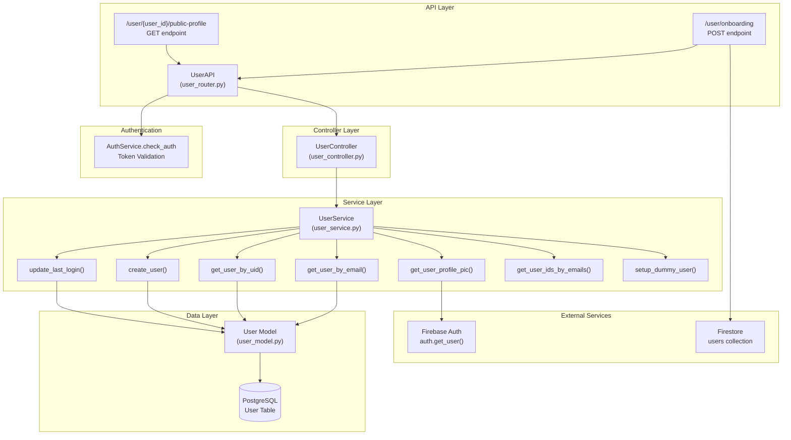
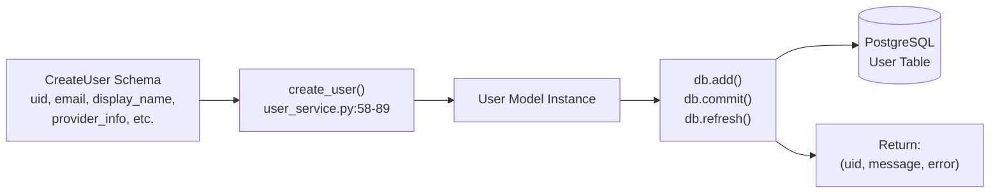
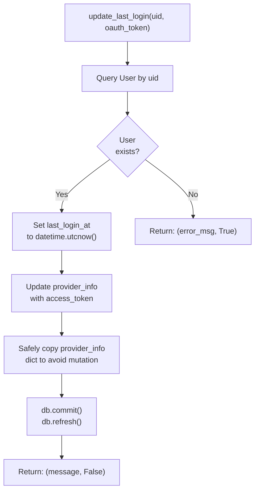
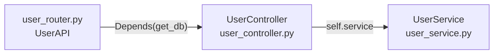
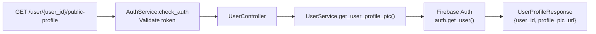
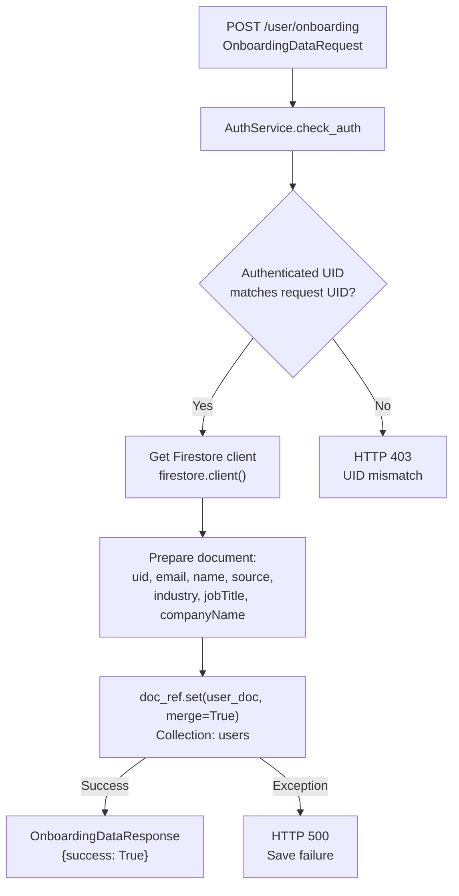

7.5-User Service

# Page: User Service

# User Service

<details>
<summary>Relevant source files</summary>

The following files were used as context for generating this wiki page:

- [app/modules/users/user_controller.py](app/modules/users/user_controller.py)
- [app/modules/users/user_router.py](app/modules/users/user_router.py)
- [app/modules/users/user_service.py](app/modules/users/user_service.py)

</details>


The User Service provides core user management functionality for Potpie, including CRUD operations on user records, profile management, onboarding data storage, and last login tracking. This service acts as the data access layer for user-related operations and integrates with Firebase Auth for profile information.

**Scope**: This document covers user lifecycle management, profile retrieval, and onboarding data storage. For authentication and login flows, see [Multi-Provider Authentication](#7.1). For OAuth token management and provider linking, see [OAuth and Provider Linking](#7.3) and [Token Management and Security](#7.4).

## Architecture Overview

The User Service follows a three-layer architecture pattern with a router, controller, and service layer, all interacting with PostgreSQL for user data persistence and Firebase Auth for profile information.



**Sources**: [app/modules/users/user_router.py:1-91](), [app/modules/users/user_controller.py:1-16](), [app/modules/users/user_service.py:1-177]()

## User Model and Data Structure

The `User` model in PostgreSQL stores core user information. The table schema includes:

| Field | Type | Description |
|-------|------|-------------|
| `uid` | String (Primary Key) | Firebase UID or provider-specific user ID |
| `email` | String | User's email address |
| `display_name` | String | User's display name |
| `email_verified` | Boolean | Email verification status |
| `created_at` | DateTime | Account creation timestamp |
| `last_login_at` | DateTime | Last login timestamp |
| `provider_info` | JSON | OAuth tokens and provider metadata |
| `provider_username` | String | Username from OAuth provider |

The `provider_info` JSON field stores OAuth access tokens and other provider-specific data. This field is updated during login to maintain current authentication credentials.

**Sources**: [app/modules/users/user_service.py:9-10](), [app/modules/users/user_service.py:24-56]()

## UserService Class

The `UserService` class [app/modules/users/user_service.py:20-177]() provides all user data access operations. The service is instantiated with a SQLAlchemy `Session` object for database operations.

### Initialization

```python
UserService(db: Session)
```

The constructor accepts a database session that is used for all subsequent operations. This follows the dependency injection pattern used throughout Potpie.

**Sources**: [app/modules/users/user_service.py:21-22]()

### Core CRUD Operations

#### User Creation



The `create_user()` method [app/modules/users/user_service.py:58-89]() accepts a `CreateUser` schema object and performs the following:

1. Creates a new `User` model instance with provided details
2. Adds the user to the database session
3. Commits the transaction
4. Returns a tuple: `(uid, message, error)` indicating success or failure

**Exception Handling**: The method catches all exceptions during database operations and returns an error tuple rather than propagating exceptions.

**Sources**: [app/modules/users/user_service.py:58-89]()

#### User Retrieval

The service provides multiple methods for retrieving users:

| Method | Parameters | Return Type | Description |
|--------|------------|-------------|-------------|
| `get_user_by_uid()` | `uid: str` | `User` or `None` | Retrieves user by Firebase UID |
| `get_user_by_email()` | `email: str` | `User` or `None` | Async method to retrieve user by email |
| `get_user_id_by_email()` | `email: str` | `str` or `None` | Returns only the UID for a given email |
| `get_user_ids_by_emails()` | `emails: List[str]` | `List[str]` or `None` | Bulk retrieval of UIDs from email list |

**Key Implementation Details**:

- `get_user_by_uid()` [app/modules/users/user_service.py:114-120]() performs a simple query filter on the `uid` field
- `get_user_by_email()` [app/modules/users/user_service.py:138-152]() is async and includes comprehensive error handling for `SQLAlchemyError` and general exceptions
- `get_user_ids_by_emails()` [app/modules/users/user_service.py:154-167]() uses SQL `IN` clause for efficient bulk queries

**Sources**: [app/modules/users/user_service.py:114-167]()

#### Last Login Update

The `update_last_login()` method [app/modules/users/user_service.py:24-56]() updates both the login timestamp and OAuth token:



**Important Implementation Notes**:
- The method safely handles `None` or non-dict `provider_info` values by creating a new dict [app/modules/users/user_service.py:34-42]()
- It creates a copy of the existing provider info before modification to avoid SQLAlchemy mutation issues
- Returns a tuple `(message, error)` for consistent error handling

**Sources**: [app/modules/users/user_service.py:24-56]()

### Development Mode Support

The `setup_dummy_user()` method [app/modules/users/user_service.py:91-112]() creates a default user for development environments:

1. Reads `defaultUsername` from environment variables
2. Checks if dummy user already exists
3. Creates a dummy user with email `defaultuser@potpie.ai` if not present
4. Uses hardcoded values including `access_token: "dummy_token"` and `provider_username: "self"`

This enables testing without requiring Firebase authentication in development mode.

**Sources**: [app/modules/users/user_service.py:91-112]()

### Profile Picture Retrieval

The `get_user_profile_pic()` method [app/modules/users/user_service.py:169-176]() retrieves profile pictures from Firebase Auth:

```python
async def get_user_profile_pic(uid: str) -> UserProfileResponse
```

**Implementation Flow**:
1. Uses `asyncio.to_thread()` to call Firebase Admin SDK's `auth.get_user()` synchronously
2. Extracts `photo_url` from the Firebase user record
3. Returns `UserProfileResponse` with `user_id` and `profile_pic_url`
4. Returns `None` if any error occurs during retrieval

This method demonstrates integration between Potpie's PostgreSQL-based user management and Firebase Auth's profile data.

**Sources**: [app/modules/users/user_service.py:169-176]()

## UserController Layer

The `UserController` class [app/modules/users/user_controller.py:9-15]() provides a thin coordination layer between the API router and service:



The controller is instantiated with a database session and creates a `UserService` instance. Currently, it only exposes one method:

- `get_user_profile_pic(uid: str)` - Delegates to `UserService.get_user_profile_pic()`

This layer exists to support future expansion of business logic that might require coordination between multiple services.

**Sources**: [app/modules/users/user_controller.py:1-16]()

## API Endpoints

The `UserAPI` class [app/modules/users/user_router.py:19-91]() exposes two REST endpoints:

### GET /user/{user_id}/public-profile

Retrieves the user's profile picture URL from Firebase Auth.



**Request Parameters**:
- `user_id` (path): Firebase UID of the user

**Authentication**: Requires valid bearer token via `AuthService.check_auth` dependency

**Response**: `UserProfileResponse` schema with `user_id` and `profile_pic_url` fields

**Sources**: [app/modules/users/user_router.py:20-27]()

### POST /user/onboarding

Saves user onboarding data to Firestore using Firebase Admin SDK.



**Request Body** (`OnboardingDataRequest`):
- `uid`: User's Firebase UID
- `email`: User's email
- `name`: Display name
- `source`: How user discovered Potpie
- `industry`: User's industry
- `jobTitle`: User's job title
- `companyName`: User's company

**Authorization Logic** [app/modules/users/user_router.py:43-53]():
1. Extracts authenticated UID from token (checks both `uid` and `user_id` keys for compatibility)
2. Verifies that authenticated UID matches the request UID
3. Returns HTTP 403 if mismatch detected

**Firestore Integration** [app/modules/users/user_router.py:56-76]():
- Creates/updates document in `users` collection with key as the user's UID
- Uses `merge=True` to update existing documents without overwriting
- Adds `signedUpAt` timestamp in ISO 8601 format with UTC timezone
- Uses Firebase Admin SDK which has full permissions, bypassing client-side restrictions

**Error Handling**:
- HTTP 403: UID mismatch (user attempting to save data for another user)
- HTTP 500: Any error during Firestore operations

**Sources**: [app/modules/users/user_router.py:29-90]()

## Integration Points

### PostgreSQL Integration

The User Service interacts with the PostgreSQL `User` table for all CRUD operations. Key integration patterns:

1. **Session Management**: All operations use SQLAlchemy `Session` passed during service instantiation
2. **Transaction Handling**: Operations use `db.commit()` for persistence and `db.refresh()` to reload updated data
3. **Query Patterns**: Simple filter queries using SQLAlchemy ORM (e.g., `db.query(User).filter(User.uid == uid).first()`)

**Sources**: [app/modules/users/user_service.py:21-22]()

### Firebase Auth Integration

The service integrates with Firebase Auth in two ways:

1. **Profile Pictures** [app/modules/users/user_service.py:169-176](): Uses `firebase_admin.auth.get_user()` to retrieve profile photo URLs
2. **Onboarding Data** [app/modules/users/user_router.py:56-76](): Uses Firestore client to persist onboarding information

**Async Handling**: Profile picture retrieval wraps synchronous Firebase SDK calls with `asyncio.to_thread()` to avoid blocking the event loop.

**Sources**: [app/modules/users/user_service.py:1-6](), [app/modules/users/user_router.py:56-76]()

### Authentication Service Integration

All API endpoints depend on `AuthService.check_auth` middleware [app/modules/users/user_router.py:23-24]() which:
- Validates bearer tokens
- Sets `request.state.user` with authenticated user context
- Returns HTTP 401 if authentication fails

The onboarding endpoint uses the authenticated user context to enforce UID matching [app/modules/users/user_router.py:43-53]().

**Sources**: [app/modules/users/user_router.py:5](), [app/modules/users/user_router.py:23](), [app/modules/users/user_router.py:32]()

## Error Handling and Logging

The User Service implements consistent error handling patterns:

### Service Layer Error Handling

Service methods use a tuple return pattern for errors:
```python
return (uid, message, error)  # For create operations
return (message, error)       # For update operations
```

This allows callers to check the `error` boolean without catching exceptions.

### Exception Catching

- `get_user_by_email()` [app/modules/users/user_service.py:147-152]() differentiates between `SQLAlchemyError` and general exceptions
- All methods catch broad `Exception` as a fallback and log errors using the configured logger
- No exceptions propagate to callers; all errors are logged and returned as error tuples or `None`

### Logging

The service uses `setup_logger(__name__)` [app/modules/users/user_router.py:16]() and [app/modules/users/user_service.py:13]() for consistent logging:

- **Info logs**: User creation, login updates, query operations
- **Warning logs**: User not found scenarios, UID mismatches
- **Error logs**: Database errors, Firebase errors, unexpected exceptions with `exc_info=True` for stack traces

**Debug Prefixes**: Several log messages include `"DEBUG:"` prefix [app/modules/users/user_service.py:123-136]() for development troubleshooting.

**Sources**: [app/modules/users/user_service.py:13](), [app/modules/users/user_router.py:16](), [app/modules/users/user_service.py:117-167]()

## Schema Definitions

The User Service uses Pydantic schemas defined in `user_schema.py` [app/modules/users/user_router.py:7-11]():

| Schema | Purpose | Key Fields |
|--------|---------|------------|
| `CreateUser` | User creation input | `uid`, `email`, `display_name`, `email_verified`, `created_at`, `last_login_at`, `provider_info`, `provider_username` |
| `UserProfileResponse` | Profile picture response | `user_id`, `profile_pic_url` |
| `OnboardingDataRequest` | Onboarding form input | `uid`, `email`, `name`, `source`, `industry`, `jobTitle`, `companyName` |
| `OnboardingDataResponse` | Onboarding save response | `success`, `message` |

These schemas provide request validation, response serialization, and automatic OpenAPI documentation.

**Sources**: [app/modules/users/user_router.py:7-11](), [app/modules/users/user_service.py:10]()

## Usage Examples

### Creating a User

```python
from app.modules.users.user_service import UserService
from app.modules.users.user_schema import CreateUser
from datetime import datetime

user_service = UserService(db_session)

user_data = CreateUser(
    uid="firebase_uid_123",
    email="user@example.com",
    display_name="John Doe",
    email_verified=True,
    created_at=datetime.utcnow(),
    last_login_at=datetime.utcnow(),
    provider_info={"access_token": "oauth_token"},
    provider_username="johndoe"
)

uid, message, error = user_service.create_user(user_data)
if not error:
    print(f"User created: {uid}")
```

### Retrieving User by Email

```python
user = await user_service.get_user_by_email("user@example.com")
if user:
    print(f"Found user: {user.uid}")
```

### Updating Last Login

```python
message, error = user_service.update_last_login(
    uid="firebase_uid_123",
    oauth_token="new_oauth_token"
)
```

**Sources**: [app/modules/users/user_service.py:58-89](), [app/modules/users/user_service.py:138-152](), [app/modules/users/user_service.py:24-56]()