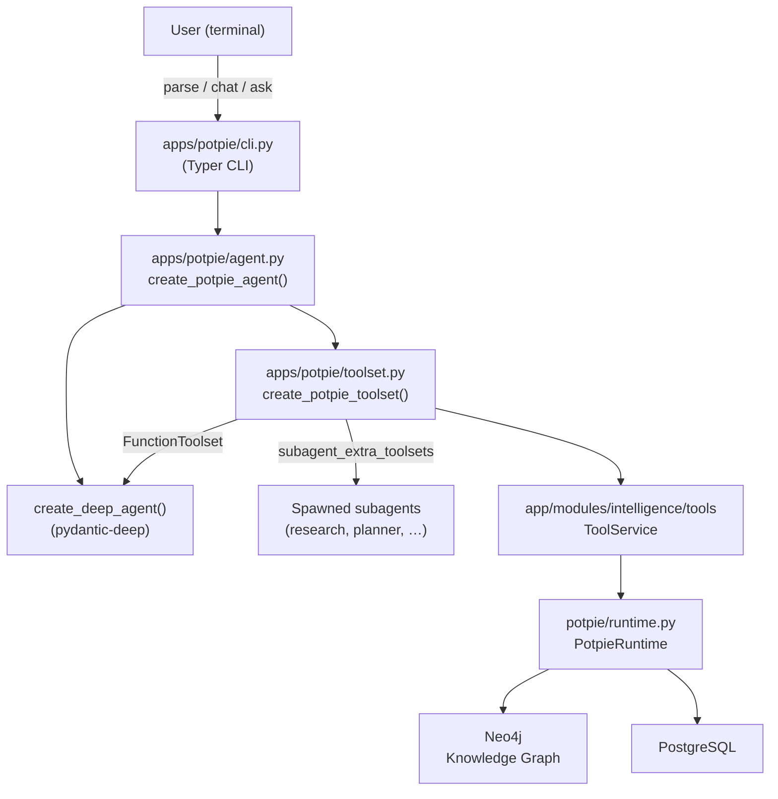
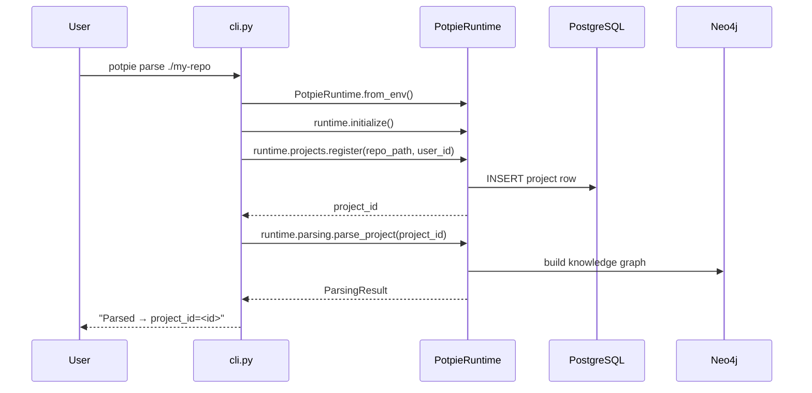
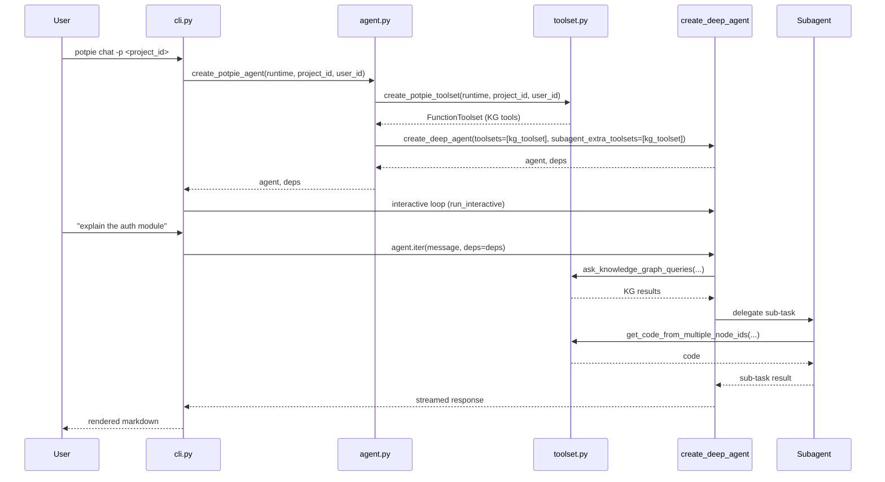

# Design Document: potpie-deep-integration

## Overview

Replace `potpie_cli.py` with `pydantic-deep chat` as the primary user interface for potpie's code intelligence. Potpie's backend (Neo4j knowledge graph, PostgreSQL, parsing pipeline) remains unchanged infrastructure; the pydantic-deep CLI becomes the entry point that wraps those capabilities as a `FunctionToolset` injected into a `create_deep_agent()` call.

The integration lives entirely in a new package at `pydantic-deepagents/apps/potpie/` and is purely additive — no existing files in `app/` or `potpie/` are modified.

## Architecture



## Sequence Diagrams

### `parse` command



### `chat` command



## Components and Interfaces

### `apps/potpie/toolset.py`

**Purpose**: Instantiate `ToolService` from a live `PotpieRuntime` session and wrap the KG tools as a pydantic-ai `FunctionToolset`.

**Interface**:
```python
def create_potpie_toolset(
    runtime: PotpieRuntime,
    project_id: str,
    user_id: str,
    toolset_id: str = "potpie-kg",
) -> FunctionToolset:
    ...
```

**Responsibilities**:
- Open a DB session from `runtime.db`
- Instantiate `ToolService(db_session, user_id)`
- Call `tool_service.get_tools([...KG_TOOL_NAMES...])` to get `StructuredTool` instances
- Call `wrap_structured_tools(langchain_tools)` to convert to pydantic-ai `Tool` objects
- Return a `FunctionToolset(tools=wrapped, id=toolset_id)`

**KG tools included**:
- `ask_knowledge_graph_queries`
- `get_code_from_multiple_node_ids`
- `get_code_from_probable_node_name`
- `get_code_file_structure`
- `fetch_file`
- `fetch_files_batch`
- `get_node_neighbours_from_node_id`
- `analyze_code_structure`

---

### `apps/potpie/agent.py`

**Purpose**: Factory that composes `create_potpie_toolset` with `create_deep_agent`, injecting the toolset into both the main agent and all spawned subagents.

**Interface**:
```python
def create_potpie_agent(
    runtime: PotpieRuntime,
    project_id: str,
    user_id: str,
    model: str | None = None,
    **kwargs: Any,
) -> tuple[Agent[DeepAgentDeps, str], DeepAgentDeps]:
    ...
```

**Responsibilities**:
- Call `create_potpie_toolset(runtime, project_id, user_id)` to get `kg_toolset`
- Call `create_deep_agent(toolsets=[kg_toolset], subagent_extra_toolsets=[kg_toolset], ...)` with sensible defaults (memory, subagents, teams, context_manager)
- Build `DeepAgentDeps(backend=StateBackend())` — in-memory backend since potpie doesn't use the filesystem backend
- Return `(agent, deps)`

---

### `apps/potpie/cli.py`

**Purpose**: Typer CLI with three commands: `parse`, `chat`, `ask`.

**Interface**:
```python
app = typer.Typer(name="potpie-deep", ...)

@app.command()
def parse(repo_path: str, user_id: str = "default") -> None: ...

@app.command()
def chat(project_id: str, model: str | None = None, user_id: str = "default") -> None: ...

@app.command()
def ask(query: str, project_id: str, model: str | None = None, user_id: str = "default") -> None: ...
```

**Responsibilities**:
- `parse`: Initialize `PotpieRuntime.from_env()`, register project, trigger parsing, print `project_id`
- `chat`: Initialize runtime, call `create_potpie_agent`, run the pydantic-deep interactive loop (reuse `apps.cli.interactive.run_interactive` pattern)
- `ask`: Initialize runtime, call `create_potpie_agent`, run a single `agent.run(query, deps=deps)`, print result
- Graceful error handling: catch `PotpieError` / connection errors and print actionable messages

---

## Data Models

### Tool context threading

Every KG tool in `ToolService` is constructed with `(db_session, user_id)` at instantiation time. The `project_id` is passed as a parameter in each tool call's input schema. This means:

```python
# project_id is baked into the tool's closure at toolset creation time
# via partial application or by constructing tools with project_id in scope
toolset = create_potpie_toolset(runtime, project_id="proj-123", user_id="user-456")
```

The `FunctionToolset` returned is stateless from pydantic-ai's perspective — the context is captured in the tool closures.

### `DeepAgentDeps` for potpie

```python
deps = DeepAgentDeps(
    backend=StateBackend(),   # in-memory; no filesystem needed
    # todos, files, subagents all default to empty
)
```

`StateBackend` is used because potpie's tools read from Neo4j/PostgreSQL, not from the local filesystem. The eviction processor (built into `create_deep_agent` via `eviction_token_limit=20_000`) uses its own internal `StateBackend` for evicted tool outputs.

---

## Algorithmic Pseudocode

### `create_potpie_toolset`

```pascal
PROCEDURE create_potpie_toolset(runtime, project_id, user_id, toolset_id)
  INPUT: runtime: PotpieRuntime, project_id: str, user_id: str, toolset_id: str
  OUTPUT: FunctionToolset

  SEQUENCE
    db_session ← runtime.db.get_session()
    tool_service ← ToolService(db_session, user_id)

    KG_TOOL_NAMES ← [
      "ask_knowledge_graph_queries",
      "get_code_from_multiple_node_ids",
      "get_code_from_probable_node_name",
      "get_code_file_structure",
      "fetch_file",
      "fetch_files_batch",
      "get_node_neighbours_from_node_id",
      "analyze_code_structure",
    ]

    langchain_tools ← tool_service.get_tools(KG_TOOL_NAMES)
    pydantic_tools  ← wrap_structured_tools(langchain_tools)
    toolset         ← FunctionToolset(tools=pydantic_tools, id=toolset_id)

    RETURN toolset
  END SEQUENCE
END PROCEDURE
```

**Preconditions**:
- `runtime.is_initialized = true`
- `project_id` is a valid registered project in PostgreSQL
- `user_id` is a valid user

**Postconditions**:
- Returns a `FunctionToolset` with ≥1 tools
- All tools have sanitized names matching `^[a-zA-Z0-9_-]+$`
- Tool closures capture `db_session` and `user_id`

---

### `create_potpie_agent`

```pascal
PROCEDURE create_potpie_agent(runtime, project_id, user_id, model, kwargs)
  INPUT: runtime: PotpieRuntime, project_id: str, user_id: str, model: str | None
  OUTPUT: (Agent, DeepAgentDeps)

  SEQUENCE
    kg_toolset ← create_potpie_toolset(runtime, project_id, user_id)

    agent ← create_deep_agent(
      model                  = model OR DEFAULT_MODEL,
      toolsets               = [kg_toolset],
      subagent_extra_toolsets = [kg_toolset],
      include_subagents      = true,
      include_teams          = true,
      include_memory         = true,
      context_manager        = true,
      eviction_token_limit   = 20_000,
      **kwargs
    )

    deps ← DeepAgentDeps(backend=StateBackend())

    RETURN (agent, deps)
  END SEQUENCE
END PROCEDURE
```

**Preconditions**:
- `create_potpie_toolset` succeeds
- Model string is valid or None (falls back to `DEFAULT_MODEL`)

**Postconditions**:
- `agent` has `kg_toolset` in its toolset list
- Every subagent spawned by `agent` also receives `kg_toolset` via `subagent_extra_toolsets`
- `deps.backend` is a `StateBackend` instance

---

### `parse` CLI command

```pascal
PROCEDURE cli_parse(repo_path, user_id)
  INPUT: repo_path: str, user_id: str
  OUTPUT: prints project_id to stdout

  SEQUENCE
    TRY
      runtime ← PotpieRuntime.from_env()
      AWAIT runtime.initialize()

      project_id ← AWAIT runtime.projects.register(
        repo_name   = repo_path,
        branch_name = "main",
        user_id     = user_id,
      )

      result ← AWAIT runtime.parsing.parse_project(project_id)

      PRINT "Parsed successfully. project_id=" + project_id

    CATCH PotpieError AS e
      PRINT "Backend error: " + e.message
      PRINT "Ensure PostgreSQL and Neo4j are running (see .env)"
      EXIT 1

    CATCH ConnectionError AS e
      PRINT "Cannot connect to backend services: " + e.message
      EXIT 1

    FINALLY
      AWAIT runtime.close()
  END SEQUENCE
END PROCEDURE
```

**Preconditions**:
- `POSTGRES_SERVER`, `NEO4J_URI`, `NEO4J_USERNAME`, `NEO4J_PASSWORD` are set in environment
- `repo_path` points to a valid local git repository

**Postconditions**:
- Project is registered in PostgreSQL
- Knowledge graph is populated in Neo4j
- `project_id` is printed to stdout for use in subsequent `chat`/`ask` commands

---

## Key Functions with Formal Specifications

### `create_potpie_toolset(runtime, project_id, user_id)`

**Preconditions**:
- `runtime.is_initialized == True`
- `project_id` is non-empty string
- `user_id` is non-empty string

**Postconditions**:
- Returns `FunctionToolset` with `len(toolset.tools) >= 1`
- All tool names satisfy `re.match(r'^[a-zA-Z0-9_-]+$', name)`
- Tool functions are wrapped with `handle_exception` (never raise, return error string)
- The same toolset instance can be passed to both `toolsets` and `subagent_extra_toolsets`

**Loop Invariants**: N/A (no loops in this function)

---

### `create_potpie_agent(runtime, project_id, user_id, model, **kwargs)`

**Preconditions**:
- `create_potpie_toolset` preconditions hold
- `model` is None or a valid pydantic-ai model string

**Postconditions**:
- `agent._toolsets` contains `kg_toolset`
- `agent._subagent_extra_toolsets` contains `kg_toolset`
- `deps.backend` is `StateBackend()`
- `agent` has `eviction_token_limit=20_000` configured

---

### `cli_chat(project_id, model, user_id)`

**Preconditions**:
- Backend services reachable (PostgreSQL, Neo4j)
- `project_id` exists in PostgreSQL

**Postconditions**:
- Interactive loop runs until user exits
- On `KeyboardInterrupt` or `/quit`: runtime is closed cleanly
- On backend connection failure: error message printed, exit code 1

---

## Example Usage

```python
# Programmatic usage
import asyncio
from potpie import PotpieRuntime
from apps.potpie.agent import create_potpie_agent
from pydantic_deep.deps import DeepAgentDeps

async def main():
    async with PotpieRuntime.from_env() as runtime:
        agent, deps = create_potpie_agent(
            runtime=runtime,
            project_id="proj-abc123",
            user_id="user-1",
        )
        result = await agent.run(
            "What does the authentication module do?",
            deps=deps,
        )
        print(result.data)

asyncio.run(main())
```

```bash
# CLI usage
# Step 1: parse a repo
potpie-deep parse ./my-repo --user-id user-1
# → Parsed successfully. project_id=proj-abc123

# Step 2: interactive chat
potpie-deep chat --project-id proj-abc123

# Step 3: one-shot query
potpie-deep ask "What does the auth module do?" --project-id proj-abc123
```

---

## Error Handling

### Backend not running

**Condition**: `PotpieRuntime.initialize()` fails because PostgreSQL or Neo4j is unreachable.

**Response**: Catch `PotpieError` / `DatabaseError` / `Neo4jError` at the CLI layer. Print a human-readable message with instructions (check `.env`, run `docker compose up`).

**Recovery**: User fixes the backend and re-runs the command. No partial state is left.

---

### Tool call failure

**Condition**: A KG tool raises an exception (e.g., Neo4j query timeout, malformed node ID).

**Response**: `handle_exception` wrapper in `wrap_structured_tools` catches the exception and returns `"An internal error occurred. Please try again later."` as the tool result. The agent sees this as a tool result, not a crash.

**Recovery**: Agent can retry with different parameters or inform the user.

---

### Context overflow (>20K tokens in a single tool output)

**Condition**: A KG query returns a very large result (e.g., full codebase structure).

**Response**: `create_deep_agent`'s built-in `eviction_token_limit=20_000` evicts the large output to the in-memory `StateBackend` and replaces it with a head/tail preview + `read_file` instruction.

**Recovery**: Agent uses `read_file` to retrieve the full content when needed.

---

### Missing `project_id`

**Condition**: User runs `chat` or `ask` without a valid `project_id`.

**Response**: CLI validates the argument before creating the runtime. If `project_id` is empty, print usage hint and exit 1.

**Recovery**: User runs `parse` first to obtain a `project_id`.

---

## Testing Strategy

### Unit Testing Approach

- `test_toolset.py`: Mock `PotpieRuntime` and `ToolService`; assert `create_potpie_toolset` returns a `FunctionToolset` with the expected tool names and that all names are sanitized.
- `test_agent.py`: Mock `create_potpie_toolset`; assert `create_potpie_agent` passes `kg_toolset` to both `toolsets` and `subagent_extra_toolsets`.
- `test_cli.py`: Use `typer.testing.CliRunner`; mock `PotpieRuntime` to test `parse`, `chat`, `ask` commands including error paths.

### Property-Based Testing Approach

**Property Test Library**: `hypothesis`

- **Toolset name sanitization**: For any tool name string, `sanitize_tool_name_for_api(name)` always returns a string matching `^[a-zA-Z0-9_-]+$`.
- **Subagent toolset propagation**: For any list of toolsets passed to `subagent_extra_toolsets`, every spawned subagent's tool list is a superset of those toolsets' tools.
- **Context threading**: For any `(project_id, user_id)` pair, all tools in the returned toolset have those values captured in their closures (verifiable via tool call inspection).

### Integration Testing Approach

- `test_integration.py` (requires running backend): Parse a small fixture repo, then run `ask` with a known query and assert the response contains expected code references.
- Test that `chat` gracefully exits when backend is unavailable (mock connection failure).

---

## Performance Considerations

- `ToolService` instantiation opens a DB session — this happens once per `create_potpie_toolset` call, not per tool invocation. The session is reused across all tool calls in a single agent run.
- The `eviction_token_limit=20_000` default prevents context bloat from large KG results. This is the same default used by `create_deep_agent` internally.
- `StateBackend` for `DeepAgentDeps` is in-memory and has no I/O overhead. Evicted tool outputs are also stored in a separate `StateBackend` instance inside the eviction processor.
- For long chat sessions, `context_manager=True` (default) triggers LLM-based summarization when approaching the token budget, keeping the session usable indefinitely.

---

## Security Considerations

- The CLI reads credentials from environment variables (`POSTGRES_SERVER`, `NEO4J_URI`, etc.) via `PotpieRuntime.from_env()`. No credentials are hardcoded.
- `user_id` is passed through to `ToolService` for all tool calls, preserving potpie's existing per-user access control.
- The `StateBackend` used for `DeepAgentDeps` is in-memory and process-local — no sensitive data is written to disk by the agent framework.
- `include_execute=False` (default for `StateBackend`-backed agents) means the agent cannot run arbitrary shell commands unless explicitly enabled.

---

## Dependencies

**From `potpie/` (existing)**:
- `potpie.PotpieRuntime`, `potpie.RuntimeConfig`
- `potpie.exceptions.*`

**From `app/` (existing)**:
- `app.modules.intelligence.tools.tool_service.ToolService`
- `app.modules.intelligence.agents.chat_agents.multi_agent.utils.tool_utils.wrap_structured_tools`

**From `pydantic-deepagents/` (existing)**:
- `pydantic_deep.agent.create_deep_agent`
- `pydantic_deep.deps.DeepAgentDeps`
- `pydantic_ai_backends.StateBackend`
- `pydantic_ai.toolsets.FunctionToolset`

**New Python packages** (if not already present):
- `typer` — CLI framework (already used in `potpie_cli.py`)
- `rich` — terminal output (already used in `apps/cli/`)
