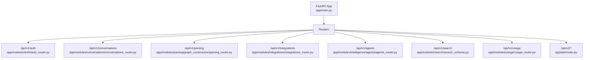
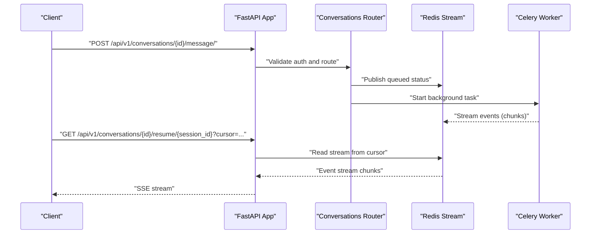
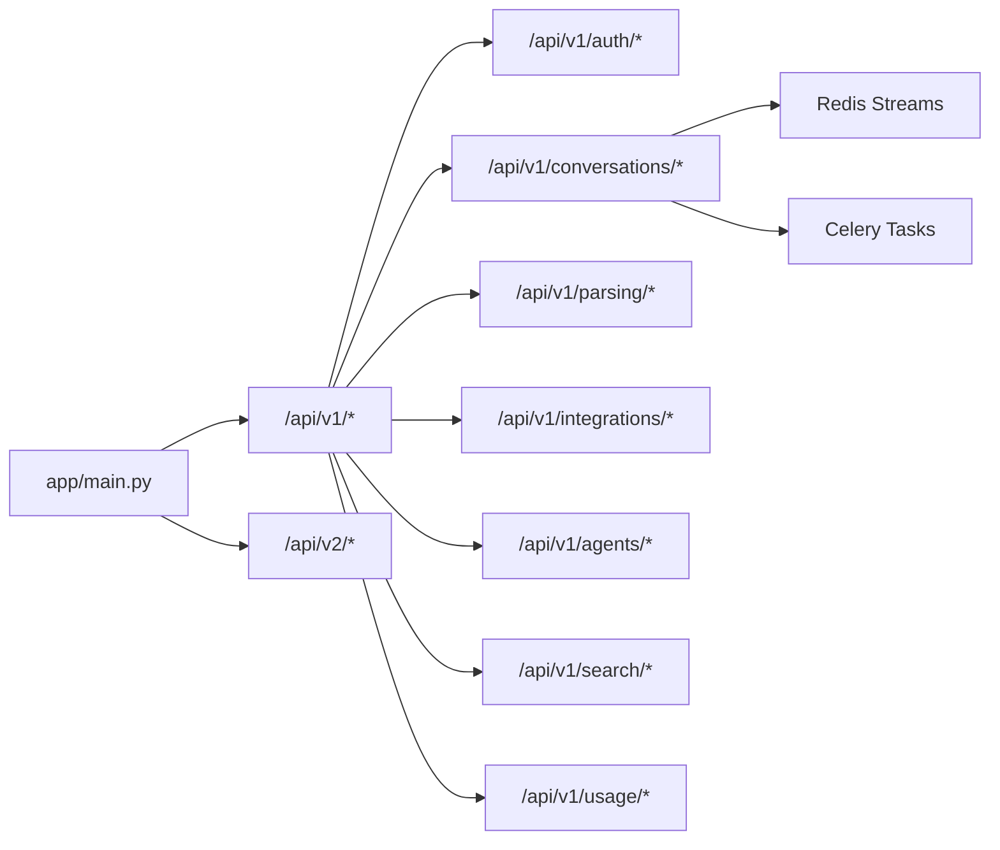
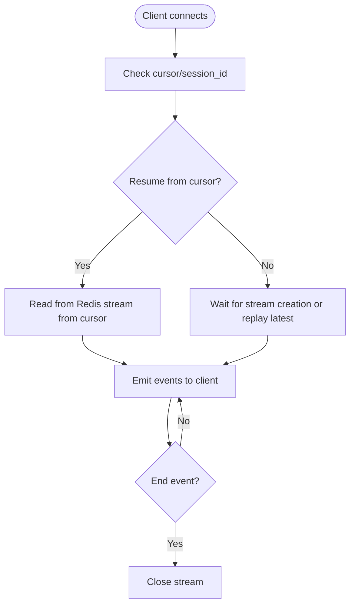

# API Reference

<cite>
**Referenced Files in This Document**
- [app/main.py](file://app/main.py)
- [app/api/router.py](file://app/api/router.py)
- [app/modules/conversations/conversations_router.py](file://app/modules/conversations/conversations_router.py)
- [app/modules/conversations/utils/redis_streaming.py](file://app/modules/conversations/utils/redis_streaming.py)
- [app/modules/parsing/graph_construction/parsing_router.py](file://app/modules/parsing/graph_construction/parsing_router.py)
- [app/modules/parsing/graph_construction/parsing_schema.py](file://app/modules/parsing/graph_construction/parsing_schema.py)
- [app/modules/integrations/integrations_router.py](file://app/modules/integrations/integrations_router.py)
- [app/modules/integrations/integrations_schema.py](file://app/modules/integrations/integrations_schema.py)
- [app/modules/auth/auth_router.py](file://app/modules/auth/auth_router.py)
- [app/modules/auth/auth_schema.py](file://app/modules/auth/auth_schema.py)
- [app/modules/search/search_schema.py](file://app/modules/search/search_schema.py)
- [app/modules/usage/usage_router.py](file://app/modules/usage/usage_router.py)
</cite>

## Table of Contents
1. [Introduction](#introduction)
2. [Project Structure](#project-structure)
3. [Core Components](#core-components)
4. [Architecture Overview](#architecture-overview)
5. [Detailed Component Analysis](#detailed-component-analysis)
6. [Dependency Analysis](#dependency-analysis)
7. [Performance Considerations](#performance-considerations)
8. [Troubleshooting Guide](#troubleshooting-guide)
9. [Conclusion](#conclusion)
10. [Appendices](#appendices)

## Introduction
This document describes Potpie’s complete REST API surface, including HTTP endpoints, request/response schemas, authentication mechanisms, and streaming behavior. It covers authentication, conversations, parsing, agents, integrations, and administrative usage reporting. It also documents the WebSocket-style server-sent event (SSE) streaming used for real-time conversation responses and background task status.

## Project Structure
Potpie exposes multiple API routers under a FastAPI application. Routers are mounted under versioned prefixes:
- /api/v1: Feature-focused endpoints (auth, conversations, parsing, integrations, agents, providers, tools, media, projects, search, usage).
- /api/v2: Potpie API endpoints (e.g., simplified conversation/message endpoints).

**Diagram sources**
- [app/main.py](file://app/main.py#L147-L171)
- [app/modules/auth/auth_router.py](file://app/modules/auth/auth_router.py#L42-L800)
- [app/modules/conversations/conversations_router.py](file://app/modules/conversations/conversations_router.py#L41-L622)
- [app/modules/parsing/graph_construction/parsing_router.py](file://app/modules/parsing/graph_construction/parsing_router.py#L13-L39)
- [app/modules/integrations/integrations_router.py](file://app/modules/integrations/integrations_router.py#L53-L800)
- [app/modules/search/search_schema.py](file://app/modules/search/search_schema.py#L6-L28)
- [app/modules/usage/usage_router.py](file://app/modules/usage/usage_router.py#L9-L22)
- [app/api/router.py](file://app/api/router.py#L48-L318)

**Section sources**
- [app/main.py](file://app/main.py#L147-L171)

## Core Components
- Authentication: Supports SSO login, provider linking/unlinking, and account management. Also supports API key authentication for internal/admin endpoints.
- Conversations: Create, list, retrieve, and manage conversation threads; send messages with streaming SSE; regenerate responses; stop generation; manage sharing and sessions.
- Parsing: Trigger repository parsing and fetch parsing status.
- Agents: List available agents (system and custom).
- Integrations: OAuth flows and status checks for Sentry, Linear, Jira, and Confluence; generic integration save/update.
- Search: Search codebase within a project.
- Usage: Retrieve usage metrics for a date range.
- Streaming: Redis-backed SSE streams for long-running tasks with resume/cursor support.

**Section sources**
- [app/modules/auth/auth_router.py](file://app/modules/auth/auth_router.py#L52-L800)
- [app/modules/conversations/conversations_router.py](file://app/modules/conversations/conversations_router.py#L58-L622)
- [app/modules/parsing/graph_construction/parsing_router.py](file://app/modules/parsing/graph_construction/parsing_router.py#L16-L39)
- [app/modules/integrations/integrations_router.py](file://app/modules/integrations/integrations_router.py#L180-L800)
- [app/modules/search/search_schema.py](file://app/modules/search/search_schema.py#L6-L28)
- [app/modules/usage/usage_router.py](file://app/modules/usage/usage_router.py#L12-L22)
- [app/api/router.py](file://app/api/router.py#L97-L318)

## Architecture Overview
High-level API architecture and streaming:

**Diagram sources**
- [app/modules/conversations/conversations_router.py](file://app/modules/conversations/conversations_router.py#L160-L286)
- [app/modules/conversations/utils/redis_streaming.py](file://app/modules/conversations/utils/redis_streaming.py#L21-L151)

## Detailed Component Analysis

### Authentication Endpoints
- POST /api/v1/auth/login
  - Description: Legacy email/password login.
  - Request: LoginRequest (email, password).
  - Response: Token or error.
  - Status Codes: 200, 401, 400.

- POST /api/v1/auth/signup
  - Description: Simplified signup/login supporting GitHub linking and normal flows.
  - Request: JSON body with uid, email, displayName, emailVerified, linkToUserId, githubFirebaseUid, accessToken, providerUsername, providerData.
  - Response: JSON with uid, exists, needs_github_linking, or error.
  - Status Codes: 200, 201, 400, 403, 409, 500.

- POST /api/v1/auth/sso/login
  - Description: SSO login via Google/Azure/Okta/SAML using id_token.
  - Request: SSOLoginRequest (email, sso_provider, id_token, provider_data).
  - Response: SSOLoginResponse (status, user_id, message, linking_token, needs_github_linking).
  - Status Codes: 200, 202, 400, 401, 403, 500.

- POST /api/v1/auth/providers/confirm-linking
  - Description: Confirm linking a new provider to existing account.
  - Request: ConfirmLinkingRequest (linking_token).
  - Response: Provider info or error.
  - Status Codes: 200, 400, 500.

- DELETE /api/v1/auth/providers/cancel-linking/{linking_token}
  - Description: Cancel pending provider link.
  - Response: Message or error.
  - Status Codes: 200, 404, 400.

- GET /api/v1/auth/providers/me
  - Description: List all providers for current user.
  - Response: UserAuthProvidersResponse.
  - Status Codes: 200, 400, 401.

- POST /api/v1/auth/providers/set-primary
  - Description: Set a provider as primary.
  - Request: SetPrimaryProviderRequest (provider_type).
  - Response: Message or error.
  - Status Codes: 200, 404, 400.

- DELETE /api/v1/auth/providers/unlink
  - Description: Unlink a provider from account.
  - Request: UnlinkProviderRequest (provider_type).
  - Response: Message or error.
  - Status Codes: 200, 404, 400.

- GET /api/v1/auth/account/me
  - Description: Get complete account information including providers.
  - Response: AccountResponse.
  - Status Codes: 200, 401, 400.

Authentication Methods
- Bearer tokens (via AuthService.check_auth) for most endpoints under /api/v1.
- API key headers (X-API-Key, X-User-ID) for /api/v2 endpoints (internal/admin).

**Section sources**
- [app/modules/auth/auth_router.py](file://app/modules/auth/auth_router.py#L52-L800)
- [app/modules/auth/auth_schema.py](file://app/modules/auth/auth_schema.py#L10-L188)
- [app/api/router.py](file://app/api/router.py#L56-L87)

### Conversations Endpoints
- GET /api/v1/conversations/
  - Description: List user conversations with pagination and sorting.
  - Query: start (>=0), limit (>=1), sort ("updated_at","created_at"), order ("asc","desc").
  - Response: List of user conversation summaries.
  - Auth: Bearer.

- POST /api/v1/conversations/
  - Description: Create a new conversation.
  - Request: CreateConversationRequest (user_id, title, status, project_ids, agent_ids).
  - Response: CreateConversationResponse (message, conversation_id).
  - Auth: Bearer.

- GET /api/v1/conversations/{conversation_id}/info/
  - Description: Get conversation metadata and access type.
  - Response: ConversationInfoResponse.
  - Auth: Bearer.

- GET /api/v1/conversations/{conversation_id}/messages/
  - Description: Paginated retrieval of messages.
  - Query: start (>=0), limit (>=1).
  - Response: List of messages.
  - Auth: Bearer.

- POST /api/v1/conversations/{conversation_id}/message/
  - Description: Send a message; supports streaming and non-streaming modes.
  - Form Fields: content (required), node_ids (JSON string), images (multipart files).
  - Query: stream (bool), session_id (string), prev_human_message_id (string), cursor (string).
  - Response: StreamingResponse (SSE) or single chunk.
  - Auth: Bearer.

- POST /api/v1/conversations/{conversation_id}/regenerate/
  - Description: Regenerate last assistant reply; supports streaming and background execution.
  - Request: RegenerateRequest (node_ids).
  - Query: stream (bool), session_id (string), prev_human_message_id (string), cursor (string), background (bool).
  - Response: StreamingResponse (SSE) or single chunk.
  - Auth: Bearer.

- DELETE /api/v1/conversations/{conversation_id}/
  - Description: Delete a conversation.
  - Response: Deletion confirmation.
  - Auth: Bearer.

- POST /api/v1/conversations/{conversation_id}/stop/
  - Description: Stop an ongoing generation.
  - Query: session_id (optional).
  - Response: Stop confirmation.
  - Auth: Bearer.

- PATCH /api/v1/conversations/{conversation_id}/rename/
  - Description: Rename a conversation.
  - Request: RenameConversationRequest (title).
  - Response: Rename confirmation.
  - Auth: Bearer.

- GET /api/v1/conversations/{conversation_id}/active-session
  - Description: Get active session info.
  - Response: ActiveSessionResponse or error.
  - Auth: Bearer.

- GET /api/v1/conversations/{conversation_id}/task-status
  - Description: Get background task status.
  - Response: TaskStatusResponse or error.
  - Auth: Bearer.

- POST /api/v1/conversations/{conversation_id}/resume/{session_id}
  - Description: Resume streaming from an existing session.
  - Query: cursor (string, default "0-0").
  - Response: StreamingResponse (SSE).
  - Auth: Bearer.

- POST /api/v1/conversations/share
  - Description: Share a conversation with emails.
  - Request: ShareChatRequest (conversation_id, recipientEmails, visibility).
  - Response: ShareChatResponse (message, sharedID).
  - Auth: Bearer.

- GET /api/v1/conversations/{conversation_id}/shared-emails
  - Description: List shared emails.
  - Response: List of emails.
  - Auth: Bearer.

- DELETE /api/v1/conversations/{conversation_id}/access
  - Description: Remove access for specified emails.
  - Request: RemoveAccessRequest (emails).
  - Response: Success message.
  - Auth: Bearer.

Streaming and Session Management
- Run IDs are normalized and optionally made unique per request.
- Redis-backed streams publish structured events; clients can resume from a cursor.
- Background tasks publish “queued” and completion/end events.

**Section sources**
- [app/modules/conversations/conversations_router.py](file://app/modules/conversations/conversations_router.py#L58-L622)
- [app/modules/conversations/utils/redis_streaming.py](file://app/modules/conversations/utils/redis_streaming.py#L11-L248)
- [app/modules/conversations/conversation/conversation_schema.py](file://app/modules/conversations/conversation/conversation_schema.py#L13-L93)

### Parsing Endpoints
- POST /api/v1/parse
  - Description: Trigger repository parsing.
  - Request: ParsingRequest (repo_name OR repo_path, branch_name, commit_id).
  - Response: ParsingResponse (message, status, project_id).
  - Auth: Bearer.

- GET /api/v1/parsing-status/{project_id}
  - Description: Fetch parsing status for a project.
  - Response: Status string or object.
  - Auth: Bearer.

- POST /api/v1/parsing-status
  - Description: Fetch parsing status by repo details.
  - Request: ParsingStatusRequest (repo_name, commit_id, branch_name).
  - Response: Status object.
  - Auth: Bearer.

Schemas
- ParsingRequest: repo_name OR repo_path required.
- ParsingStatusRequest: repo_name required; commit_id or branch_name optional.

**Section sources**
- [app/modules/parsing/graph_construction/parsing_router.py](file://app/modules/parsing/graph_construction/parsing_router.py#L16-L39)
- [app/modules/parsing/graph_construction/parsing_schema.py](file://app/modules/parsing/graph_construction/parsing_schema.py#L6-L39)

### Agents Endpoints
- GET /api/v1/list-available-agents/
  - Description: List available agents for the user.
  - Query: list_system_agents (bool, default true).
  - Response: List of AgentInfo.
  - Auth: Bearer.

- GET /api/v2/list-available-agents
  - Description: Same as above under /api/v2.
  - Response: List of AgentInfo.
  - Auth: API key (X-API-Key, X-User-ID).

**Section sources**
- [app/modules/intelligence/agents/agents_router.py](file://app/modules/intelligence/agents/agents_router.py#L25-L46)
- [app/api/router.py](file://app/api/router.py#L272-L283)

### Integrations Endpoints
- OAuth Initiation and Callbacks
  - Sentry: GET /api/v1/integrations/sentry/initiate, GET /api/v1/integrations/sentry/callback, GET /api/v1/integrations/sentry/status/{user_id}, DELETE /api/v1/integrations/sentry/revoke/{user_id}.
  - Linear: GET /api/v1/integrations/linear/redirect, GET /api/v1/integrations/linear/callback, GET /api/v1/integrations/linear/status/{user_id}, DELETE /api/v1/integrations/linear/revoke/{user_id}, POST /api/v1/integrations/linear/save.
  - Jira: GET /api/v1/integrations/jira/initiate, GET /api/v1/integrations/jira/callback, GET /api/v1/integrations/jira/status/{user_id}, DELETE /api/v1/integrations/jira/revoke/{user_id}.
  - Confluence: GET /api/v1/integrations/confluence/status/{user_id}, DELETE /api/v1/integrations/confluence/revoke/{user_id}.

- Generic Integration Management
  - POST /api/v1/integrations/save
    - Description: Save an integration with configurable fields.
    - Request: IntegrationSaveRequest.
    - Response: IntegrationSaveResponse (success, data, error).
    - Auth: Bearer.

Schemas
- OAuthInitiateRequest (redirect_uri, state).
- OAuthStatusResponse (status, message, user_id).
- IntegrationSaveRequest (name, integration_type, optional auth_data, scope_data, metadata, unique_identifier).
- IntegrationSaveResponse (success, data, error).
- Provider-specific status and save schemas (SentryIntegrationStatus, LinearIntegrationStatus, JiraIntegrationStatus, ConfluenceIntegrationStatus; SentrySaveRequest/Response, LinearSaveRequest/Response, JiraSaveRequest/Response, ConfluenceSaveRequest/Response).

**Section sources**
- [app/modules/integrations/integrations_router.py](file://app/modules/integrations/integrations_router.py#L180-L800)
- [app/modules/integrations/integrations_schema.py](file://app/modules/integrations/integrations_schema.py#L7-L428)

### Search Endpoints
- POST /api/v1/search
  - Description: Search codebase within a project.
  - Request: SearchRequest (project_id, query).
  - Response: SearchResponse (results: List[SearchResult]).
  - Auth: Bearer.

Schemas
- SearchRequest: project_id, query (min length 1, stripped).
- SearchResult: node_id, name, file_path, content, match_type, relevance.
- SearchResponse: results.

**Section sources**
- [app/modules/search/search_schema.py](file://app/modules/search/search_schema.py#L6-L28)

### Usage Endpoints
- GET /api/v1/usage
  - Description: Get usage metrics for a date range.
  - Query: start_date (datetime), end_date (datetime).
  - Response: UsageResponse.
  - Auth: Bearer.

**Section sources**
- [app/modules/usage/usage_router.py](file://app/modules/usage/usage_router.py#L12-L22)

### Potpie API v2 Endpoints
- POST /api/v2/conversations/
  - Description: Create a conversation with minimal payload (project_ids, agent_ids).
  - Query: hidden (bool, default true).
  - Request: SimpleConversationRequest (project_ids, agent_ids).
  - Response: CreateConversationResponse.
  - Auth: API key (X-API-Key, optional X-User-ID for admin impersonation).

- POST /api/v2/parse
  - Description: Trigger repository parsing.
  - Request: ParsingRequest.
  - Response: ParsingResponse.
  - Auth: API key.

- GET /api/v2/parsing-status/{project_id}
  - Description: Fetch parsing status for a project.
  - Response: Status object.
  - Auth: API key.

- POST /api/v2/parsing-status
  - Description: Fetch parsing status by repo details.
  - Request: ParsingStatusRequest.
  - Response: Status object.
  - Auth: API key.

- POST /api/v2/conversations/{conversation_id}/message/
  - Description: Send a message; supports streaming and non-streaming modes.
  - Query: stream (bool, default true), session_id (string), prev_human_message_id (string), cursor (string).
  - Request: MessageRequest (content, node_ids, attachment_ids).
  - Response: StreamingResponse (SSE) or single chunk.
  - Auth: API key.

- POST /api/v2/project/{project_id}/message/
  - Description: Create a conversation and send a message in one call.
  - Query: hidden (bool, default true).
  - Request: DirectMessageRequest (content, agent_id optional).
  - Response: Single streamed chunk.
  - Auth: API key.

- GET /api/v2/projects/list
  - Description: List projects for the user.
  - Response: Project list.
  - Auth: API key.

- GET /api/v2/list-available-agents
  - Description: List available agents.
  - Response: List of AgentInfo.
  - Auth: API key.

- POST /api/v2/search
  - Description: Search codebase within a project.
  - Request: SearchRequest.
  - Response: SearchResponse.
  - Auth: API key.

- POST /api/v2/integrations/save
  - Description: Save an integration with configurable fields.
  - Request: IntegrationSaveRequest.
  - Response: IntegrationSaveResponse.
  - Auth: API key.

Authentication
- X-API-Key required on all /api/v2 endpoints.
- X-User-ID optional; when provided with INTERNAL_ADMIN_SECRET, allows admin impersonation.

**Section sources**
- [app/api/router.py](file://app/api/router.py#L97-L318)

## Dependency Analysis
- API routing and mounting are centralized in the main app.
- Conversations rely on Redis for streaming and Celery for background tasks.
- Integrations encapsulate OAuth flows and provider-specific logic.
- Authentication uses Bearer tokens for most endpoints and API keys for v2.

**Diagram sources**
- [app/main.py](file://app/main.py#L147-L171)
- [app/modules/conversations/conversations_router.py](file://app/modules/conversations/conversations_router.py#L58-L622)
- [app/modules/conversations/utils/redis_streaming.py](file://app/modules/conversations/utils/redis_streaming.py#L11-L248)

**Section sources**
- [app/main.py](file://app/main.py#L147-L171)

## Performance Considerations
- Streaming: Use stream=true for long-running tasks to reduce latency and enable resumability.
- Cursor-based resume: Use cursor and session_id to reconnect seamlessly after interruptions.
- Background regeneration: Prefer background execution for regeneration to keep SSE responsive.
- Image uploads: Attachments are stored via MediaService; large images increase latency—compress when possible.
- Rate limits: Enforced via UsageService.check_usage_limit; monitor usage and throttle heavy clients.

[No sources needed since this section provides general guidance]

## Troubleshooting Guide
Common issues and resolutions:
- Empty message content: Validation raises 400.
- Subscription required: UsageService.check_usage_limit returns 402 when subscription is missing.
- Access denied to conversation: 403 when user lacks access.
- Session not found/expired: 404 when resuming a non-existent or expired session.
- OAuth state invalid: 400 when signed state verification fails.
- Stream timeout/expired: SSE emits end events with status and message; clients should reconnect.

**Section sources**
- [app/modules/conversations/conversations_router.py](file://app/modules/conversations/conversations_router.py#L179-L183)
- [app/modules/conversations/conversations_router.py](file://app/modules/conversations/conversations_router.py#L476-L488)
- [app/modules/conversations/conversations_router.py](file://app/modules/conversations/conversations_router.py#L552-L554)
- [app/modules/integrations/integrations_router.py](file://app/modules/integrations/integrations_router.py#L233-L235)
- [app/modules/conversations/utils/redis_streaming.py](file://app/modules/conversations/utils/redis_streaming.py#L94-L106)
- [app/modules/conversations/utils/redis_streaming.py](file://app/modules/conversations/utils/redis_streaming.py#L115-L122)

## Conclusion
Potpie’s API provides a comprehensive, versioned REST interface with robust streaming capabilities for conversational AI, repository parsing, integrations, and administrative controls. Authentication supports both Bearer tokens and API keys, with clear separation between public v1 endpoints and internal v2 endpoints. Streaming leverages Redis for reliable, resumable SSE, enabling responsive real-time experiences.

[No sources needed since this section summarizes without analyzing specific files]

## Appendices

### Authentication Requirements
- Bearer tokens: Used by most /api/v1 endpoints; validated via AuthService.check_auth.
- API key: Required for /api/v2 endpoints; validated via get_api_key_user (X-API-Key, optional X-User-ID for admin impersonation).

**Section sources**
- [app/modules/auth/auth_router.py](file://app/modules/auth/auth_router.py#L646-L690)
- [app/api/router.py](file://app/api/router.py#L56-L87)

### Rate Limiting and Usage
- UsageService.check_usage_limit enforces subscription-based quotas; returns 402 when exceeded.
- GET /api/v1/usage returns usage metrics for a date range.

**Section sources**
- [app/modules/conversations/conversations_router.py](file://app/modules/conversations/conversations_router.py#L94-L99)
- [app/modules/usage/usage_router.py](file://app/modules/usage/usage_router.py#L12-L22)

### API Versioning
- /api/v1: Feature-complete, user-facing endpoints.
- /api/v2: Internal/admin endpoints requiring API key.

**Section sources**
- [app/main.py](file://app/main.py#L147-L171)
- [app/api/router.py](file://app/api/router.py#L161-L171)

### WebSocket/Streaming Details
- Transport: Server-Sent Events (SSE) served via StreamingResponse.
- Storage: Redis streams keyed by conversation_id and run_id.
- Resumption: Clients provide cursor and session_id to resume.
- Cancellation: Redis cancellation key signals stop; manager publishes end event.

**Diagram sources**
- [app/modules/conversations/utils/redis_streaming.py](file://app/modules/conversations/utils/redis_streaming.py#L64-L151)

**Section sources**
- [app/modules/conversations/conversations_router.py](file://app/modules/conversations/conversations_router.py#L520-L566)
- [app/modules/conversations/utils/redis_streaming.py](file://app/modules/conversations/utils/redis_streaming.py#L11-L248)

### Example Workflows

- Repository Parsing
  - Trigger parsing: POST /api/v1/parse with ParsingRequest.
  - Poll status: GET /api/v1/parsing-status/{project_id} or POST /api/v1/parsing-status.

- Conversation Streaming
  - Send message: POST /api/v1/conversations/{id}/message/ with stream=true.
  - Resume: GET /api/v1/conversations/{id}/resume/{session_id}?cursor=...

- Integration Setup
  - Sentry: GET /api/v1/integrations/sentry/initiate, handle callback, GET /api/v1/integrations/sentry/status/{user_id}.
  - Generic: POST /api/v1/integrations/save with IntegrationSaveRequest.

[No sources needed since this section provides general guidance]