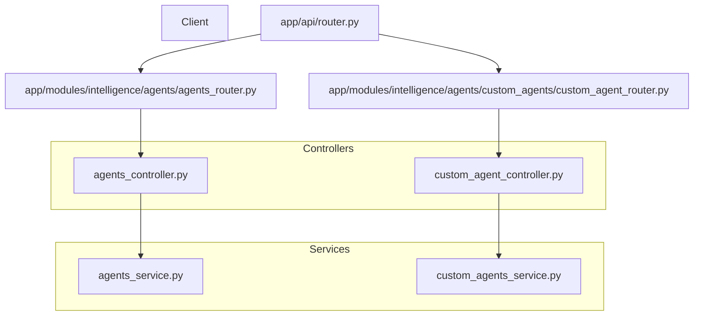
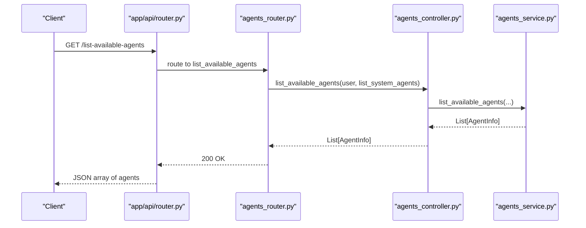
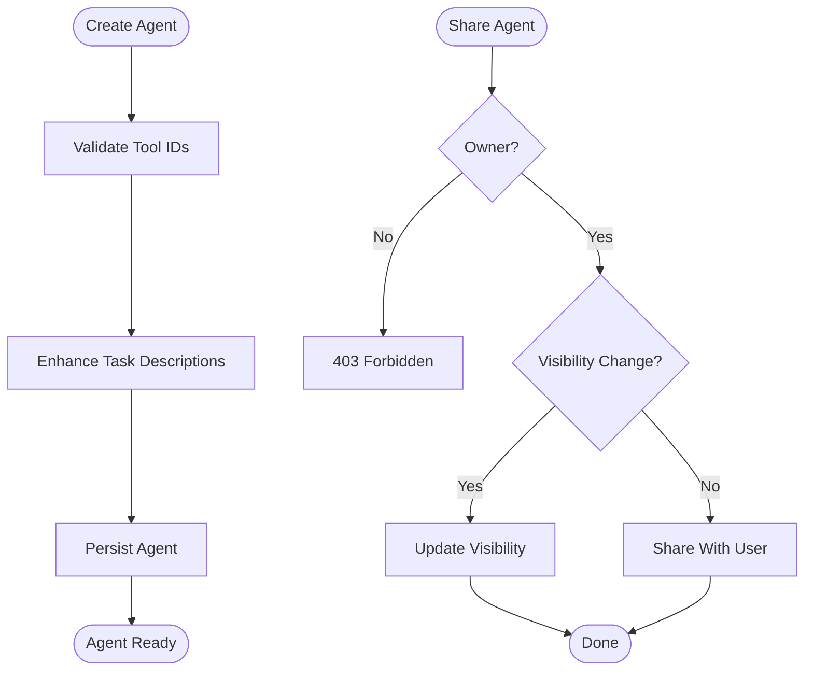
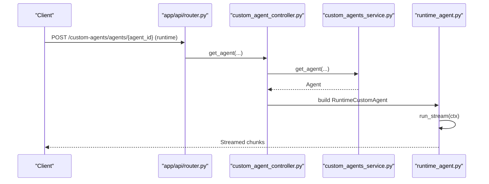
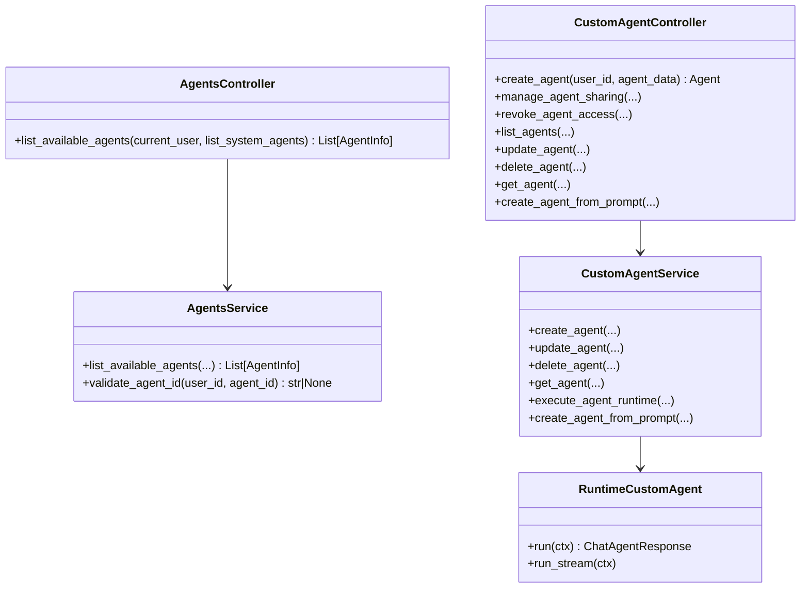

# Agents API

<cite>
**Referenced Files in This Document**
- [router.py](file://app/api/router.py)
- [agents_router.py](file://app/modules/intelligence/agents/agents_router.py)
- [agents_controller.py](file://app/modules/intelligence/agents/agents_controller.py)
- [agents_service.py](file://app/modules/intelligence/agents/agents_service.py)
- [custom_agent_router.py](file://app/modules/intelligence/agents/custom_agents/custom_agent_router.py)
- [custom_agent_controller.py](file://app/modules/intelligence/agents/custom_agents/custom_agent_controller.py)
- [custom_agents_service.py](file://app/modules/intelligence/agents/custom_agents/custom_agents_service.py)
- [custom_agent_schema.py](file://app/modules/intelligence/agents/custom_agents/custom_agent_schema.py)
- [custom_agent_model.py](file://app/modules/intelligence/agents/custom_agents/custom_agent_model.py)
- [runtime_agent.py](file://app/modules/intelligence/agents/custom_agents/runtime_agent.py)
- [qna_agent.py](file://app/modules/intelligence/agents/chat_agents/system_agents/qna_agent.py)
- [code_gen_agent.py](file://app/modules/intelligence/agents/chat_agents/system_agents/code_gen_agent.py)
- [agent_config.py](file://app/modules/intelligence/agents/chat_agents/agent_config.py)
</cite>

## Table of Contents
1. [Introduction](#introduction)
2. [Project Structure](#project-structure)
3. [Core Components](#core-components)
4. [Architecture Overview](#architecture-overview)
5. [Detailed Component Analysis](#detailed-component-analysis)
6. [Dependency Analysis](#dependency-analysis)
7. [Performance Considerations](#performance-considerations)
8. [Troubleshooting Guide](#troubleshooting-guide)
9. [Conclusion](#conclusion)

## Introduction
This document provides comprehensive API documentation for Potpie’s AI agent system. It covers:
- HTTP endpoints for agent discovery and management
- Agent types: system agents and custom agents
- Agent capabilities, tool integration, and prompt management
- Request/response schemas and examples
- Agent lifecycle management, configuration, sharing, and runtime execution
- Execution parameters, selection criteria, and optimization strategies

## Project Structure
The agent system is exposed via FastAPI routers and orchestrated by controllers and services:
- Public API endpoints under the main router
- Dedicated agents router for agent discovery
- Custom agents router for CRUD and sharing operations
- Controllers and services encapsulate business logic and orchestration
- System agents and runtime custom agents implement execution strategies

**Diagram sources**
- [router.py](file://app/api/router.py#L272-L283)
- [agents_router.py](file://app/modules/intelligence/agents/agents_router.py#L31-L46)
- [custom_agent_router.py](file://app/modules/intelligence/agents/custom_agents/custom_agent_router.py#L26-L227)
- [agents_controller.py](file://app/modules/intelligence/agents/agents_controller.py#L13-L35)
- [agents_service.py](file://app/modules/intelligence/agents/agents_service.py#L47-L203)
- [custom_agent_controller.py](file://app/modules/intelligence/agents/custom_agents/custom_agent_controller.py#L24-L338)
- [custom_agents_service.py](file://app/modules/intelligence/agents/custom_agents/custom_agents_service.py#L37-L800)

**Section sources**
- [router.py](file://app/api/router.py#L272-L283)
- [agents_router.py](file://app/modules/intelligence/agents/agents_router.py#L1-L46)
- [custom_agent_router.py](file://app/modules/intelligence/agents/custom_agents/custom_agent_router.py#L1-L227)

## Core Components
- AgentsController and AgentsService: list system and custom agents, validate agent IDs, and coordinate execution
- CustomAgentController and CustomAgentService: manage custom agent lifecycle, sharing, and runtime execution
- RuntimeCustomAgent: executes custom agents at runtime with tool integration and multi-agent support
- System agents: specialized agents (e.g., Q&A, code generation) with tool sets and prompts

Key responsibilities:
- Authentication and authorization via API keys or session-based auth
- Tool availability validation and task enhancement
- Visibility and sharing controls for custom agents
- Streaming and non-streaming execution modes

**Section sources**
- [agents_controller.py](file://app/modules/intelligence/agents/agents_controller.py#L13-L35)
- [agents_service.py](file://app/modules/intelligence/agents/agents_service.py#L47-L203)
- [custom_agent_controller.py](file://app/modules/intelligence/agents/custom_agents/custom_agent_controller.py#L24-L338)
- [custom_agents_service.py](file://app/modules/intelligence/agents/custom_agents/custom_agents_service.py#L37-L800)
- [runtime_agent.py](file://app/modules/intelligence/agents/custom_agents/runtime_agent.py#L44-L172)

## Architecture Overview
High-level flow:
- Clients call public endpoints to discover agents or manage custom agents
- Controllers validate inputs, enforce permissions, and delegate to services
- Services orchestrate providers (LLM, tools, prompts) and instantiate agents
- System agents or runtime custom agents execute tasks and stream responses

**Diagram sources**
- [router.py](file://app/api/router.py#L272-L283)
- [agents_router.py](file://app/modules/intelligence/agents/agents_router.py#L31-L46)
- [agents_controller.py](file://app/modules/intelligence/agents/agents_controller.py#L23-L35)
- [agents_service.py](file://app/modules/intelligence/agents/agents_service.py#L158-L195)

## Detailed Component Analysis

### Endpoint: List Available Agents
- Method: GET
- URL: /list-available-agents
- Description: Returns a list of available agents for the authenticated user. Includes system agents and optionally custom agents.
- Authentication: API key or session-based auth
- Query parameters:
  - list_system_agents: bool, default true
- Response: Array of AgentInfo objects

Response schema (AgentInfo):
- id: string
- name: string
- description: string
- status: string
- visibility: enum "private" | "public" | "shared" (optional)

Example response:
{
  "id": "codebase_qna_agent",
  "name": "Codebase Q&A Agent",
  "description": "An agent specialized in answering questions about the codebase...",
  "status": "SYSTEM"
}

**Section sources**
- [router.py](file://app/api/router.py#L272-L283)
- [agents_router.py](file://app/modules/intelligence/agents/agents_router.py#L31-L46)
- [agents_service.py](file://app/modules/intelligence/agents/agents_service.py#L39-L45)
- [agents_service.py](file://app/modules/intelligence/agents/agents_service.py#L158-L195)

### Custom Agents: Management Endpoints
- Base path: /custom-agents/agents

Endpoints:
- POST /: Create a custom agent
  - Request body: AgentCreate
  - Response: Agent
- POST /share: Share an agent or change visibility
  - Request body: AgentSharingRequest
  - Response: Agent
- POST /revoke-access: Revoke a specific user’s access
  - Request body: RevokeAgentAccessRequest
  - Response: Agent
- GET /: List agents accessible to the user
  - Query: include_public: bool, include_shared: bool
  - Response: Array of Agent
- DELETE /{agent_id}: Delete a custom agent
  - Response: { "success": true, "message": "..." }
- PUT /{agent_id}: Update a custom agent
  - Request body: AgentUpdate
  - Response: Agent
- GET /{agent_id}: Get a specific agent
  - Response: Agent
- GET /{agent_id}/shares: List shared-with emails
  - Response: AgentSharesResponse
- POST /auto/: Create agent from natural language prompt
  - Request body: PromptBasedAgentRequest
  - Response: Agent

Request/response schemas:
- AgentCreate: role, goal, backstory, system_prompt, tasks (up to 5)
- AgentUpdate: optional fields role, goal, backstory, system_prompt, tasks, visibility
- Agent: id, user_id, role, goal, backstory, system_prompt, tasks, deployment_url, created_at, updated_at, deployment_status, visibility
- AgentSharingRequest: agent_id, visibility, shared_with_email
- RevokeAgentAccessRequest: agent_id, user_email
- AgentSharesResponse: agent_id, shared_with (array of emails)
- PromptBasedAgentRequest: prompt

Notes:
- Tasks are validated to ensure at least one and no more than five
- Expected output for tasks must be a JSON object
- Visibility transitions:
  - PRIVATE: no shares; visibility private
  - SHARED: visible to users with whom it is shared
  - PUBLIC: visible to all users (mutually exclusive with per-user sharing)

**Section sources**
- [custom_agent_router.py](file://app/modules/intelligence/agents/custom_agents/custom_agent_router.py#L26-L227)
- [custom_agent_schema.py](file://app/modules/intelligence/agents/custom_agents/custom_agent_schema.py#L49-L159)
- [custom_agent_controller.py](file://app/modules/intelligence/agents/custom_agents/custom_agent_controller.py#L43-L159)
- [custom_agent_controller.py](file://app/modules/intelligence/agents/custom_agents/custom_agent_controller.py#L161-L211)
- [custom_agent_controller.py](file://app/modules/intelligence/agents/custom_agents/custom_agent_controller.py#L213-L243)
- [custom_agent_controller.py](file://app/modules/intelligence/agents/custom_agents/custom_agent_controller.py#L263-L300)
- [custom_agent_controller.py](file://app/modules/intelligence/agents/custom_agents/custom_agent_controller.py#L321-L338)

### Agent Types and Capabilities
- System agents:
  - codebase_qna_agent: Q&A over codebase with extensive tooling
  - debugging_agent: debugging using knowledge graphs
  - unit_test_agent: generate unit tests
  - integration_test_agent: generate integration tests
  - LLD_agent: low-level design planning
  - code_changes_agent: blast radius analysis
  - code_generation_agent: code generation with changes manager
  - general_purpose_agent: general queries
  - sweb_debug_agent: SWEB debugging
- Custom agents:
  - Defined by role, goal, backstory, system_prompt, and tasks
  - Executed at runtime with tool integration and optional multi-agent orchestration

System agent capabilities:
- QnAAgent: uses a broad toolset including knowledge graph queries, file structure, code retrieval, and todo/requirements tracking
- CodeGenAgent: uses a comprehensive toolset for code changes management and implements a structured workflow for multi-file changes

**Section sources**
- [agents_service.py](file://app/modules/intelligence/agents/agents_service.py#L68-L149)
- [qna_agent.py](file://app/modules/intelligence/agents/chat_agents/system_agents/qna_agent.py#L24-L152)
- [code_gen_agent.py](file://app/modules/intelligence/agents/chat_agents/system_agents/code_gen_agent.py#L26-L172)

### Tool Integration and Prompt Management
- ToolService supplies tools to agents; custom agents validate tool IDs against available tools
- PromptService provides prompts and system prompt setup
- RuntimeCustomAgent enriches context with code snippets and file structure when applicable
- System agents embed structured prompts for Q&A and code generation workflows

Execution parameters:
- Multi-agent mode: enabled or disabled based on configuration
- Pydantic support: determines whether to use Pydantic-based agents
- MCP servers: optional per-task configuration for runtime agents

**Section sources**
- [agents_service.py](file://app/modules/intelligence/agents/agents_service.py#L57-L66)
- [custom_agents_service.py](file://app/modules/intelligence/agents/custom_agents/custom_agents_service.py#L367-L412)
- [runtime_agent.py](file://app/modules/intelligence/agents/custom_agents/runtime_agent.py#L55-L134)
- [qna_agent.py](file://app/modules/intelligence/agents/chat_agents/system_agents/qna_agent.py#L126-L142)
- [code_gen_agent.py](file://app/modules/intelligence/agents/chat_agents/system_agents/code_gen_agent.py#L154-L162)

### Agent Lifecycle Management
- Creation: define role/goal/backstory/system_prompt and tasks; tasks validated and persisted
- Sharing: set visibility or share with specific users; visibility transitions handled
- Access control: private, shared, or public; permission checks enforced during runtime execution
- Deletion: remove agent and associated shares
- Updates: modify metadata and tasks; visibility converted to string for persistence

**Diagram sources**
- [custom_agents_service.py](file://app/modules/intelligence/agents/custom_agents/custom_agents_service.py#L367-L412)
- [custom_agent_controller.py](file://app/modules/intelligence/agents/custom_agents/custom_agent_controller.py#L43-L159)

**Section sources**
- [custom_agent_model.py](file://app/modules/intelligence/agents/custom_agents/custom_agent_model.py#L9-L61)
- [custom_agent_schema.py](file://app/modules/intelligence/agents/custom_agents/custom_agent_schema.py#L43-L47)
- [custom_agent_controller.py](file://app/modules/intelligence/agents/custom_agents/custom_agent_controller.py#L43-L159)
- [custom_agents_service.py](file://app/modules/intelligence/agents/custom_agents/custom_agents_service.py#L235-L264)

### Runtime Execution and Streaming
- RuntimeCustomAgent builds agent configurations and selects Pydantic-based agents or multi-agent orchestrator depending on model capabilities and configuration
- Enriched context: adds code snippets and file structure when node IDs are provided
- Execution modes: run or run_stream; streaming yields chunks for real-time responses

**Diagram sources**
- [router.py](file://app/api/router.py#L150-L217)
- [custom_agent_controller.py](file://app/modules/intelligence/agents/custom_agents/custom_agent_controller.py#L302-L319)
- [custom_agents_service.py](file://app/modules/intelligence/agents/custom_agents/custom_agents_service.py#L598-L694)
- [runtime_agent.py](file://app/modules/intelligence/agents/custom_agents/runtime_agent.py#L146-L154)

**Section sources**
- [runtime_agent.py](file://app/modules/intelligence/agents/custom_agents/runtime_agent.py#L44-L172)
- [custom_agents_service.py](file://app/modules/intelligence/agents/custom_agents/custom_agents_service.py#L598-L694)

### Agent Selection Criteria and Optimization Strategies
Selection criteria:
- Agent capability alignment: choose system agents for domain-specific tasks (e.g., Q&A, codegen)
- Tool availability: ensure required tools are available for custom agents
- Model support: use Pydantic-based agents when model supports it; otherwise fallback to RAG agent
- Multi-agent mode: enable for complex tasks requiring delegation and synthesis

Optimization strategies:
- Enable multi-agent mode for tasks requiring coordination
- Use task enhancement to improve clarity and reduce ambiguity
- Leverage caching breakpoints in runtime agent backstory to optimize repeated executions
- Limit task count to 5 per agent to maintain focus and performance

**Section sources**
- [agents_service.py](file://app/modules/intelligence/agents/agents_service.py#L68-L149)
- [runtime_agent.py](file://app/modules/intelligence/agents/custom_agents/runtime_agent.py#L55-L134)
- [custom_agents_service.py](file://app/modules/intelligence/agents/custom_agents/custom_agents_service.py#L799-L800)

## Dependency Analysis
Component relationships:
- Controllers depend on Services for business logic
- Services depend on Providers (LLM, tools, prompts) and database models
- RuntimeCustomAgent depends on ToolService and ProviderService
- System agents depend on ToolService and PromptService

**Diagram sources**
- [agents_controller.py](file://app/modules/intelligence/agents/agents_controller.py#L13-L35)
- [agents_service.py](file://app/modules/intelligence/agents/agents_service.py#L47-L203)
- [custom_agent_controller.py](file://app/modules/intelligence/agents/custom_agents/custom_agent_controller.py#L24-L338)
- [custom_agents_service.py](file://app/modules/intelligence/agents/custom_agents/custom_agents_service.py#L37-L800)
- [runtime_agent.py](file://app/modules/intelligence/agents/custom_agents/runtime_agent.py#L44-L172)

**Section sources**
- [agents_service.py](file://app/modules/intelligence/agents/agents_service.py#L47-L203)
- [custom_agents_service.py](file://app/modules/intelligence/agents/custom_agents/custom_agents_service.py#L37-L800)

## Performance Considerations
- Prefer multi-agent mode for complex tasks to distribute workload
- Use task enhancement to reduce retries and improve accuracy
- Limit task count per agent to minimize context bloat
- Utilize streaming for long-running tasks to provide responsive UX
- Cache static backstory segments to reduce repeated computation

## Troubleshooting Guide
Common issues and resolutions:
- Invalid API key: ensure X-API-Key header is provided and valid
- Permission denied: verify ownership or sharing permissions for custom agents
- Invalid tool IDs: ensure tasks reference only available tools
- JSON validation errors: expected_output must be a JSON object
- Agent not found: verify agent_id and visibility settings

**Section sources**
- [router.py](file://app/api/router.py#L56-L87)
- [custom_agent_controller.py](file://app/modules/intelligence/agents/custom_agents/custom_agent_controller.py#L52-L63)
- [custom_agent_controller.py](file://app/modules/intelligence/agents/custom_agents/custom_agent_controller.py#L167-L177)
- [custom_agent_schema.py](file://app/modules/intelligence/agents/custom_agents/custom_agent_schema.py#L19-L23)
- [custom_agents_service.py](file://app/modules/intelligence/agents/custom_agents/custom_agents_service.py#L376-L384)

## Conclusion
Potpie’s agent system provides a robust framework for discovering, managing, and executing both system and custom agents. With clear APIs, strong tool integration, and flexible execution modes, it supports diverse use cases from Q&A to code generation. Proper configuration, visibility controls, and runtime optimization ensure reliable and scalable deployments.