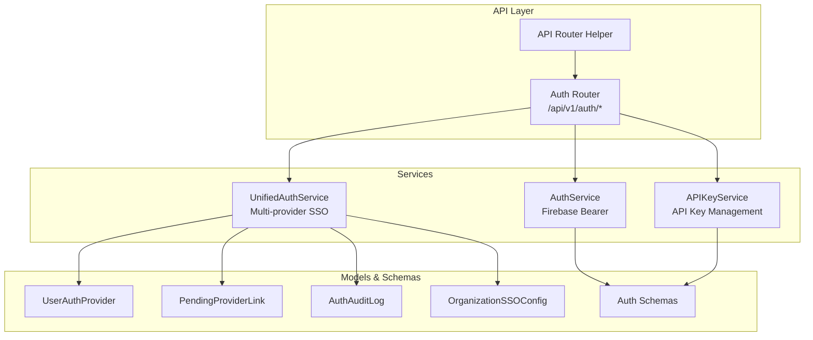
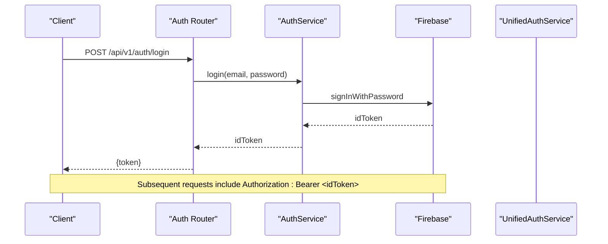
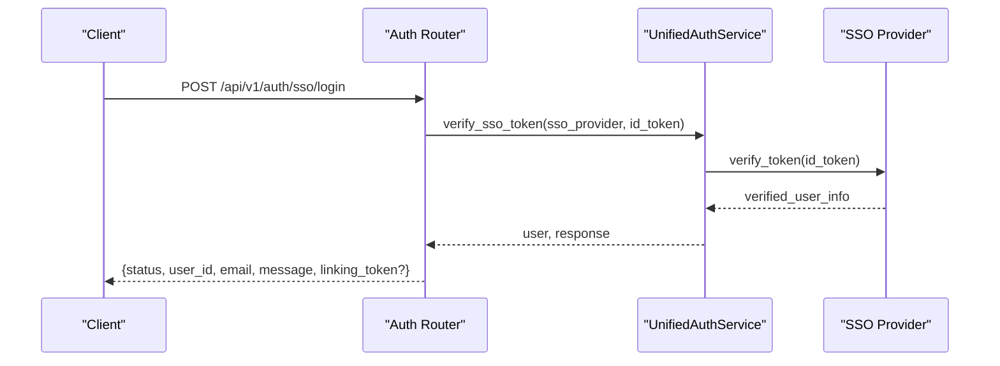
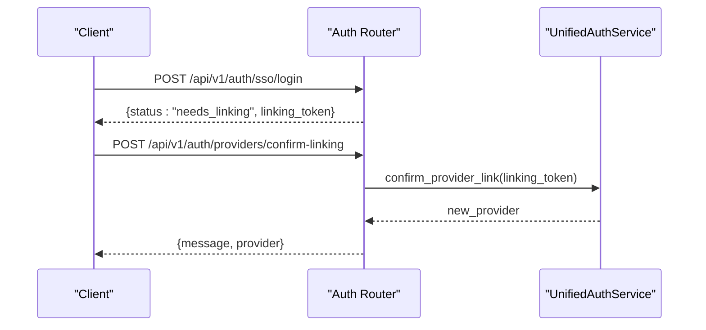
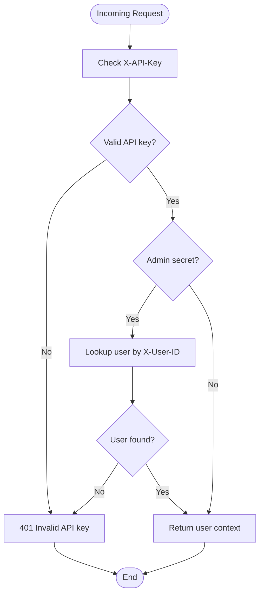
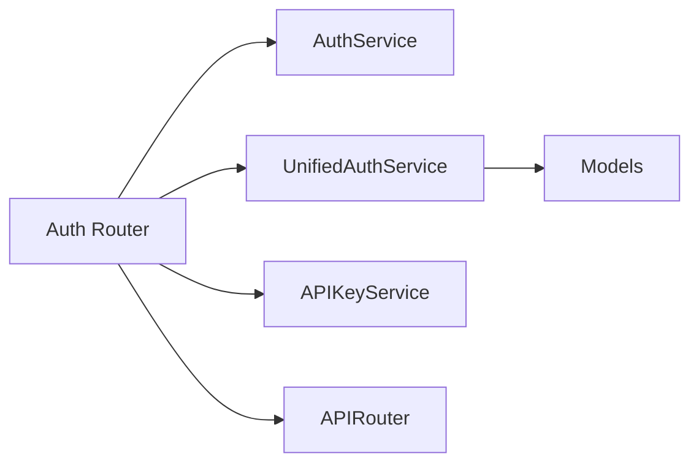

# Authentication API

<cite>
**Referenced Files in This Document**
- [auth_router.py](file://app/modules/auth/auth_router.py)
- [auth_service.py](file://app/modules/auth/auth_service.py)
- [auth_schema.py](file://app/modules/auth/auth_schema.py)
- [api_key_service.py](file://app/modules/auth/api_key_service.py)
- [unified_auth_service.py](file://app/modules/auth/unified_auth_service.py)
- [auth_provider_model.py](file://app/modules/auth/auth_provider_model.py)
- [APIRouter.py](file://app/modules/utils/APIRouter.py)
- [main.py](file://app/main.py)
- [router.py](file://app/api/router.py)
- [.env.template](file://.env.template)
</cite>

## Table of Contents
1. [Introduction](#introduction)
2. [Project Structure](#project-structure)
3. [Core Components](#core-components)
4. [Architecture Overview](#architecture-overview)
5. [Detailed Component Analysis](#detailed-component-analysis)
6. [Dependency Analysis](#dependency-analysis)
7. [Performance Considerations](#performance-considerations)
8. [Troubleshooting Guide](#troubleshooting-guide)
9. [Conclusion](#conclusion)
10. [Appendices](#appendices)

## Introduction
This document provides comprehensive API documentation for Potpie’s authentication system. It covers HTTP methods, URL patterns, request/response schemas, and authentication mechanisms for:
- API key authentication
- User registration and login
- Multi-provider SSO login
- Provider linking and management
- Account information retrieval

It also documents authentication headers (X-API-Key, X-User-ID), token formats, security considerations, error handling strategies, status codes, authentication flow diagrams, rate limiting policies, and best practices.

## Project Structure
The authentication system is organized around modular components:
- Router: Defines API endpoints under /api/v1 with tag “Auth”
- Services: Handle authentication logic, provider linking, and API key management
- Models: Define database entities for providers, pending links, audit logs, and organization SSO configuration
- Schemas: Define Pydantic models for request/response validation
- Utilities: Provide API routing helpers and environment configuration

**Diagram sources**
- [auth_router.py](file://app/modules/auth/auth_router.py#L42-L838)
- [auth_service.py](file://app/modules/auth/auth_service.py#L14-L108)
- [unified_auth_service.py](file://app/modules/auth/unified_auth_service.py#L57-L1274)
- [api_key_service.py](file://app/modules/auth/api_key_service.py#L18-L191)
- [auth_provider_model.py](file://app/modules/auth/auth_provider_model.py#L25-L200)
- [APIRouter.py](file://app/modules/utils/APIRouter.py#L7-L28)

**Section sources**
- [main.py](file://app/main.py#L147-L171)
- [auth_router.py](file://app/modules/auth/auth_router.py#L42-L838)
- [APIRouter.py](file://app/modules/utils/APIRouter.py#L7-L28)

## Core Components
- Auth Router: Exposes endpoints for login, signup, SSO login, provider linking, and account management under /api/v1/auth.
- AuthService: Implements Firebase Bearer token verification and legacy login via Identity Toolkit.
- UnifiedAuthService: Manages multi-provider authentication, provider linking, pending links, and audit logging.
- APIKeyService: Generates, validates, stores, and revokes API keys with secure storage in Secret Manager.
- Models: Define provider relationships, pending links, audit logs, and organization SSO configuration.

**Section sources**
- [auth_router.py](file://app/modules/auth/auth_router.py#L52-L838)
- [auth_service.py](file://app/modules/auth/auth_service.py#L14-L108)
- [unified_auth_service.py](file://app/modules/auth/unified_auth_service.py#L57-L1274)
- [api_key_service.py](file://app/modules/auth/api_key_service.py#L18-L191)
- [auth_provider_model.py](file://app/modules/auth/auth_provider_model.py#L25-L200)

## Architecture Overview
The authentication system integrates Firebase Bearer tokens for session-based authentication and supports API key authentication for server-to-server integrations. Multi-provider SSO enables linking multiple providers (e.g., Google, Azure, Okta, SAML) to a single user identity.

**Diagram sources**
- [auth_router.py](file://app/modules/auth/auth_router.py#L52-L71)
- [auth_service.py](file://app/modules/auth/auth_service.py#L14-L35)

## Detailed Component Analysis

### Authentication Headers and Token Formats
- Authorization header: Bearer <Firebase ID token>
- API key authentication:
  - X-API-Key: API key value
  - X-User-ID: Optional user identifier for admin bypass
- Token formats:
  - Firebase ID tokens issued by Google Identity Toolkit
  - API keys: sk-<32-byte hex>, hashed for storage

**Section sources**
- [auth_service.py](file://app/modules/auth/auth_service.py#L48-L104)
- [router.py](file://app/api/router.py#L56-L87)
- [api_key_service.py](file://app/modules/auth/api_key_service.py#L18-L54)

### Endpoint Specifications

#### POST /api/v1/auth/login
- Purpose: Authenticate with email and password, receive a Firebase ID token.
- Request body:
  - email: string
  - password: string
- Response:
  - token: string (Firebase ID token)
- Status codes:
  - 200: Success
  - 401: Invalid email or password
  - 400/500: Other errors

JSON Schema
- Request: LoginRequest
- Response: { token: string }

**Section sources**
- [auth_router.py](file://app/modules/auth/auth_router.py#L52-L71)
- [auth_schema.py](file://app/modules/auth/auth_schema.py#L10-L13)

#### POST /api/v1/auth/signup
- Purpose: Simplified signup/login supporting GitHub OAuth and email/password.
- Request body:
  - uid: string
  - email: string
  - displayName/display_name: string (optional)
  - emailVerified/email_verified: boolean (default false)
  - linkToUserId: string (optional, for linking to existing SSO user)
  - githubFirebaseUid: string (optional, GitHub Firebase UID)
  - accessToken/access_token: string (optional, GitHub OAuth token)
  - providerUsername: string (optional)
  - providerData: object (optional)
- Response (examples):
  - Existing user with provider: { uid: string, exists: true, needs_github_linking: boolean }
  - New user created: { uid: string, exists: false, needs_github_linking: false }
- Status codes:
  - 200/201: Success
  - 400: Missing required fields
  - 403: New GitHub sign-ups blocked
  - 409: GitHub already linked to another account
  - 500: Internal error

JSON Schema
- Request: Dynamic fields based on provider (see request body)
- Response: { uid: string, exists: boolean, needs_github_linking: boolean }

**Section sources**
- [auth_router.py](file://app/modules/auth/auth_router.py#L72-L437)

#### POST /api/v1/auth/sso/login
- Purpose: Authenticate via SSO providers (Google, Azure, Okta, SAML).
- Request body:
  - email: string
  - sso_provider: string ('google', 'azure', 'okta', 'saml')
  - id_token: string (ID token from SSO provider)
  - provider_data: object (optional)
- Response (examples):
  - success: { status: "success", user_id: string, email: string, display_name: string, message: string }
  - needs_linking: { status: "needs_linking", linking_token: string, existing_providers: string[] }
  - new_user: { status: "new_user", user_id: string, email: string, message: string, needs_github_linking: boolean }
- Status codes:
  - 200: Success
  - 202: Needs linking
  - 400: Invalid request
  - 401: Invalid/expired SSO token
  - 403: Generic email blocked for new users
  - 500: Internal error

JSON Schema
- Request: SSOLoginRequest
- Response: SSOLoginResponse

**Section sources**
- [auth_router.py](file://app/modules/auth/auth_router.py#L441-L570)
- [auth_schema.py](file://app/modules/auth/auth_schema.py#L66-L89)

#### POST /api/v1/auth/providers/confirm-linking
- Purpose: Confirm pending provider linking using a linking token.
- Request body:
  - linking_token: string
- Response:
  - message: string
  - provider: AuthProviderResponse
- Status codes:
  - 200: Success
  - 400: Invalid/expired token
  - 500: Internal error

JSON Schema
- Request: ConfirmLinkingRequest
- Response: { message: string, provider: AuthProviderResponse }

**Section sources**
- [auth_router.py](file://app/modules/auth/auth_router.py#L572-L617)
- [auth_schema.py](file://app/modules/auth/auth_schema.py#L104-L108)

#### DELETE /api/v1/auth/providers/cancel-linking/{linking_token}
- Purpose: Cancel a pending provider link.
- Path parameters:
  - linking_token: string
- Response:
  - message: string
- Status codes:
  - 200: Success
  - 404: Token not found
  - 400: Internal error

JSON Schema
- Response: { message: string }

**Section sources**
- [auth_router.py](file://app/modules/auth/auth_router.py#L619-L644)

#### GET /api/v1/auth/providers/me
- Purpose: Retrieve all authentication providers for the current user.
- Authentication: Bearer <Firebase ID token>
- Response:
  - providers: AuthProviderResponse[]
  - primary_provider: AuthProviderResponse or null
- Status codes:
  - 200: Success
  - 401: Authentication required
  - 400: Internal error

JSON Schema
- Response: UserAuthProvidersResponse

**Section sources**
- [auth_router.py](file://app/modules/auth/auth_router.py#L646-L690)
- [auth_schema.py](file://app/modules/auth/auth_schema.py#L56-L61)

#### POST /api/v1/auth/providers/set-primary
- Purpose: Set a provider as the primary login method.
- Authentication: Bearer <Firebase ID token>
- Request body:
  - provider_type: string
- Response:
  - message: string
- Status codes:
  - 200: Success
  - 401: Authentication required
  - 404: Provider not found
  - 400: Internal error

JSON Schema
- Request: SetPrimaryProviderRequest
- Response: { message: string }

**Section sources**
- [auth_router.py](file://app/modules/auth/auth_router.py#L692-L731)
- [auth_schema.py](file://app/modules/auth/auth_schema.py#L151-L155)

#### DELETE /api/v1/auth/providers/unlink
- Purpose: Unlink a provider from the account.
- Authentication: Bearer <Firebase ID token>
- Request body:
  - provider_type: string
- Response:
  - message: string
- Status codes:
  - 200: Success
  - 401: Authentication required
  - 404: Provider not found
  - 400: Cannot unlink last provider
  - 400: Internal error

JSON Schema
- Request: UnlinkProviderRequest
- Response: { message: string }

**Section sources**
- [auth_router.py](file://app/modules/auth/auth_router.py#L733-L781)
- [auth_schema.py](file://app/modules/auth/auth_schema.py#L110-L114)

#### GET /api/v1/auth/account/me
- Purpose: Retrieve complete account information including providers.
- Authentication: Bearer <Firebase ID token>
- Response:
  - user_id: string
  - email: string
  - display_name: string or null
  - organization: string or null
  - organization_name: string or null
  - email_verified: boolean
  - created_at: datetime
  - providers: AuthProviderResponse[]
  - primary_provider: string or null
- Status codes:
  - 200: Success
  - 401: Authentication required
  - 400: Internal error

JSON Schema
- Response: AccountResponse

**Section sources**
- [auth_router.py](file://app/modules/auth/auth_router.py#L783-L837)
- [auth_schema.py](file://app/modules/auth/auth_schema.py#L157-L169)

### API Key Authentication Endpoints
API key authentication is used for server-to-server integrations. The API exposes a reusable dependency that validates X-API-Key and optionally X-User-ID for admin bypass.

Headers
- X-API-Key: string (required)
- X-User-ID: string (optional, admin bypass)

Behavior
- Validates API key against stored hash
- Returns user context { user_id, email, auth_type: "api_key" }
- Supports internal admin secret for privileged operations

**Section sources**
- [router.py](file://app/api/router.py#L56-L87)
- [api_key_service.py](file://app/modules/auth/api_key_service.py#L104-L138)

### Authentication Flow Diagrams

#### Multi-Provider SSO Login Flow

**Diagram sources**
- [auth_router.py](file://app/modules/auth/auth_router.py#L441-L570)
- [unified_auth_service.py](file://app/modules/auth/unified_auth_service.py#L82-L101)

#### Provider Linking Flow

**Diagram sources**
- [auth_router.py](file://app/modules/auth/auth_router.py#L572-L617)
- [unified_auth_service.py](file://app/modules/auth/unified_auth_service.py#L862-L956)

#### API Key Validation Flow

**Diagram sources**
- [router.py](file://app/api/router.py#L56-L87)
- [api_key_service.py](file://app/modules/auth/api_key_service.py#L104-L138)

## Dependency Analysis
- Auth Router depends on:
  - AuthService for Bearer token verification and legacy login
  - UnifiedAuthService for multi-provider SSO and provider management
  - APIKeyService for API key validation
- Models define relationships among users, providers, pending links, audit logs, and organization SSO configuration
- APIRouter helper ensures trailing slash normalization

**Diagram sources**
- [auth_router.py](file://app/modules/auth/auth_router.py#L42-L838)
- [auth_service.py](file://app/modules/auth/auth_service.py#L14-L108)
- [unified_auth_service.py](file://app/modules/auth/unified_auth_service.py#L57-L1274)
- [api_key_service.py](file://app/modules/auth/api_key_service.py#L18-L191)
- [auth_provider_model.py](file://app/modules/auth/auth_provider_model.py#L25-L200)
- [APIRouter.py](file://app/modules/utils/APIRouter.py#L7-L28)

**Section sources**
- [auth_router.py](file://app/modules/auth/auth_router.py#L42-L838)
- [auth_service.py](file://app/modules/auth/auth_service.py#L14-L108)
- [unified_auth_service.py](file://app/modules/auth/unified_auth_service.py#L57-L1274)
- [api_key_service.py](file://app/modules/auth/api_key_service.py#L18-L191)
- [auth_provider_model.py](file://app/modules/auth/auth_provider_model.py#L25-L200)
- [APIRouter.py](file://app/modules/utils/APIRouter.py#L7-L28)

## Performance Considerations
- Token verification occurs on each protected request; caching decoded tokens at the edge or using short-lived JWTs can reduce latency.
- Provider linking operations involve database writes and encryption; batch operations should be minimized.
- API key validation hashes the key and performs a single indexed lookup; ensure database indexes are optimized for the preferences hash field.

[No sources needed since this section provides general guidance]

## Troubleshooting Guide
Common issues and resolutions:
- Invalid or expired Bearer token:
  - Cause: Token not provided or expired
  - Resolution: Re-authenticate and obtain a new ID token
- Invalid API key:
  - Cause: Missing or malformed X-API-Key
  - Resolution: Provide a valid API key with correct prefix and ensure it is not revoked
- Generic email blocked for new users:
  - Cause: SSO login attempted with personal email domain
  - Resolution: Use a corporate/work email
- Cannot unlink last provider:
  - Cause: Attempting to remove the only authentication method
  - Resolution: Link another provider first
- GitHub linking required:
  - Cause: User authenticated but GitHub provider not linked
  - Resolution: Complete provider linking flow

**Section sources**
- [auth_service.py](file://app/modules/auth/auth_service.py#L68-L104)
- [router.py](file://app/api/router.py#L62-L87)
- [auth_router.py](file://app/modules/auth/auth_router.py#L495-L517)
- [unified_auth_service.py](file://app/modules/auth/unified_auth_service.py#L332-L376)

## Conclusion
Potpie’s authentication system supports robust session-based authentication via Firebase Bearer tokens and secure API key authentication for server integrations. Multi-provider SSO enables flexible identity management with provider linking, audit logging, and organization-level SSO enforcement. Proper use of headers, token formats, and schemas ensures secure and reliable authentication across client and server applications.

[No sources needed since this section summarizes without analyzing specific files]

## Appendices

### Authentication Headers Reference
- Authorization: Bearer <Firebase ID token>
- X-API-Key: <API key>
- X-User-ID: <user identifier> (admin bypass)

Environment variables
- isDevelopmentMode: enabled/disabled
- defaultUsername: default user for development
- GCP_PROJECT: required for Secret Manager in production

**Section sources**
- [.env.template](file://.env.template#L1-L14)
- [.env.template](file://.env.template#L27-L27)

### Rate Limiting Policies
- Not explicitly defined in the analyzed files. Implement rate limiting at the gateway or middleware level for login/signup endpoints to mitigate brute-force attacks.

[No sources needed since this section provides general guidance]

### Security Best Practices
- Always use HTTPS in production
- Rotate API keys periodically and revoke compromised keys
- Enforce SSO for corporate domains where applicable
- Monitor AuthAuditLog for suspicious activity
- Avoid exposing tokens in client-side storage; use secure cookies or short-lived tokens

[No sources needed since this section provides general guidance]