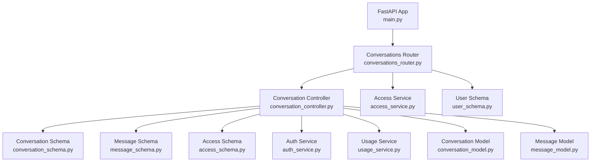
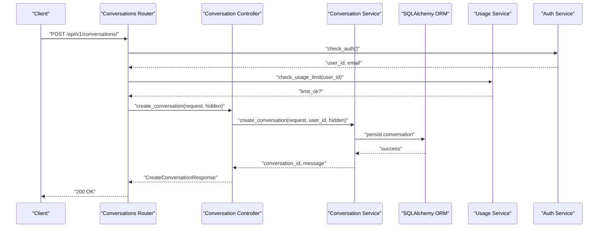
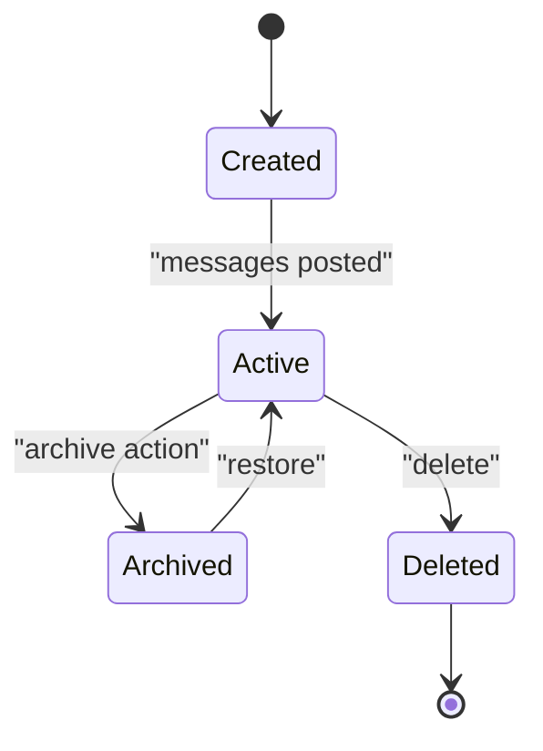
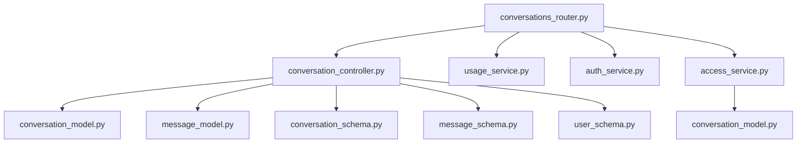

# Conversation Management

<cite>
**Referenced Files in This Document**
- [conversations_router.py](file://app/modules/conversations/conversations_router.py)
- [conversation_controller.py](file://app/modules/conversations/conversation/conversation_controller.py)
- [conversation_schema.py](file://app/modules/conversations/conversation/conversation_schema.py)
- [conversation_model.py](file://app/modules/conversations/conversation/conversation_model.py)
- [message_schema.py](file://app/modules/conversations/message/message_schema.py)
- [message_model.py](file://app/modules/conversations/message/message_model.py)
- [access_schema.py](file://app/modules/conversations/access/access_schema.py)
- [access_service.py](file://app/modules/conversations/access/access_service.py)
- [auth_service.py](file://app/modules/auth/auth_service.py)
- [usage_service.py](file://app/modules/usage/usage_service.py)
- [user_schema.py](file://app/modules/users/user_schema.py)
- [main.py](file://app/main.py)
- [test_conversations_router.py](file://tests/integration-tests/conversations/test_conversations_router.py)
</cite>

## Table of Contents
1. [Introduction](#introduction)
2. [Project Structure](#project-structure)
3. [Core Components](#core-components)
4. [Architecture Overview](#architecture-overview)
5. [Detailed Component Analysis](#detailed-component-analysis)
6. [Dependency Analysis](#dependency-analysis)
7. [Performance Considerations](#performance-considerations)
8. [Troubleshooting Guide](#troubleshooting-guide)
9. [Conclusion](#conclusion)
10. [Appendices](#appendices)

## Introduction
This document provides comprehensive API documentation for conversation management endpoints. It covers HTTP methods, URL patterns, request/response schemas, authentication, error handling, conversation lifecycle management, access control, usage limits, and collaboration features such as sharing and visibility settings.

## Project Structure
The conversation management APIs are implemented under the conversations module and integrated into the main FastAPI application with a base path of /api/v1.

**Diagram sources**
- [main.py](file://app/main.py#L147-L171)
- [conversations_router.py](file://app/modules/conversations/conversations_router.py#L1-L622)
- [conversation_controller.py](file://app/modules/conversations/conversation/conversation_controller.py#L1-L224)
- [conversation_schema.py](file://app/modules/conversations/conversation/conversation_schema.py#L1-L93)
- [message_schema.py](file://app/modules/conversations/message/message_schema.py#L1-L47)
- [access_schema.py](file://app/modules/conversations/access/access_schema.py#L1-L25)
- [auth_service.py](file://app/modules/auth/auth_service.py#L1-L108)
- [usage_service.py](file://app/modules/usage/usage_service.py#L1-L94)
- [conversation_model.py](file://app/modules/conversations/conversation/conversation_model.py#L1-L60)
- [message_model.py](file://app/modules/conversations/message/message_model.py#L1-L65)
- [access_service.py](file://app/modules/conversations/access/access_service.py#L1-L133)
- [user_schema.py](file://app/modules/users/user_schema.py#L1-L54)

**Section sources**
- [main.py](file://app/main.py#L147-L171)
- [conversations_router.py](file://app/modules/conversations/conversations_router.py#L1-L622)

## Core Components
- Conversations Router: Defines endpoints for creating, listing, retrieving, deleting, renaming, and streaming conversations.
- Conversation Controller: Orchestrates business logic and delegates to services and stores.
- Conversation Schema: Defines request/response models for conversations and related metadata.
- Message Schema: Defines request/response models for messages and attachments.
- Access Schema/Service: Manages sharing, visibility, and access removal.
- Auth Service: Handles bearer token authentication and development-mode bypass.
- Usage Service: Enforces usage limits based on subscription plans.
- Models: SQLAlchemy ORM models for conversations and messages.

**Section sources**
- [conversations_router.py](file://app/modules/conversations/conversations_router.py#L58-L622)
- [conversation_controller.py](file://app/modules/conversations/conversation/conversation_controller.py#L33-L224)
- [conversation_schema.py](file://app/modules/conversations/conversation/conversation_schema.py#L13-L93)
- [message_schema.py](file://app/modules/conversations/message/message_schema.py#L15-L47)
- [access_schema.py](file://app/modules/conversations/access/access_schema.py#L8-L25)
- [access_service.py](file://app/modules/conversations/access/access_service.py#L18-L133)
- [auth_service.py](file://app/modules/auth/auth_service.py#L48-L104)
- [usage_service.py](file://app/modules/usage/usage_service.py#L50-L94)
- [conversation_model.py](file://app/modules/conversations/conversation/conversation_model.py#L23-L60)
- [message_model.py](file://app/modules/conversations/message/message_model.py#L23-L65)

## Architecture Overview
The API follows a layered architecture:
- Router layer handles HTTP requests and responses, validates parameters, and invokes services.
- Controller layer encapsulates orchestration and translates between schemas and services.
- Service layer performs business logic and interacts with stores and external systems.
- Model layer defines persistence and relationships.
- Middleware and utilities provide authentication, usage checks, and streaming.

**Diagram sources**
- [conversations_router.py](file://app/modules/conversations/conversations_router.py#L83-L102)
- [conversation_controller.py](file://app/modules/conversations/conversation/conversation_controller.py#L53-L64)
- [usage_service.py](file://app/modules/usage/usage_service.py#L50-L94)
- [auth_service.py](file://app/modules/auth/auth_service.py#L48-L104)

## Detailed Component Analysis

### Authentication and Authorization
- Authentication scheme: Bearer token via Firebase ID token verification.
- Development mode: When enabled and no credentials provided, a default user is injected.
- All conversation endpoints require authenticated access.

**Section sources**
- [auth_service.py](file://app/modules/auth/auth_service.py#L48-L104)
- [conversations_router.py](file://app/modules/conversations/conversations_router.py#L65-L102)

### Usage Limits
- Enforced via subscription service availability and plan type.
- Free plan: 50 messages/month.
- Pro plan: 500 messages/month.
- Exceeded limits return HTTP 402 Payment Required.

**Section sources**
- [usage_service.py](file://app/modules/usage/usage_service.py#L50-L94)

### Endpoint Catalog

#### Create Conversation
- Method: POST
- URL: /api/v1/conversations/
- Authentication: Required
- Query parameters:
  - hidden: bool, default false, whether to hide from web UI
- Request body: CreateConversationRequest
- Response: CreateConversationResponse
- Behavior:
  - Checks usage limit before creation.
  - Creates a conversation with initial system message.
  - Returns conversation_id and message.

JSON Schemas
- CreateConversationRequest
  - user_id: string
  - title: string
  - status: enum "active" | "archived" | "deleted"
  - project_ids: array[string]
  - agent_ids: array[string]
- CreateConversationResponse
  - message: string
  - conversation_id: string

Example Request
- POST /api/v1/conversations/?hidden=false
- Body: { "user_id": "...", "title": "My Chat", "status": "active", "project_ids": ["proj-123"], "agent_ids": ["agent-456"] }

Example Response
- 200 OK
- Body: { "message": "...", "conversation_id": "conv-789" }

Error Responses
- 401 Unauthorized: Invalid or missing bearer token.
- 402 Payment Required: Usage limit exceeded.
- 500 Internal Server Error: Service error.

**Section sources**
- [conversations_router.py](file://app/modules/conversations/conversations_router.py#L83-L102)
- [conversation_schema.py](file://app/modules/conversations/conversation/conversation_schema.py#L13-L34)
- [conversation_controller.py](file://app/modules/conversations/conversation/conversation_controller.py#L53-L64)
- [usage_service.py](file://app/modules/usage/usage_service.py#L50-L94)

#### List Conversations
- Method: GET
- URL: /api/v1/conversations/
- Authentication: Required
- Query parameters:
  - start: int >= 0, default 0
  - limit: int >= 1, default 10
  - sort: enum "updated_at" | "created_at", default "updated_at"
  - order: enum "asc" | "desc", default "desc"
- Response: array of UserConversationListResponse
- Behavior:
  - Returns paginated and sorted conversations for the authenticated user.
  - Includes project and agent metadata.

JSON Schemas
- UserConversationListResponse
  - id: string
  - title: string?
  - status: string?
  - project_ids: array[string]?
  - agent_id: string?
  - repository: string?
  - branch: string?
  - created_at: string (ISO 8601)
  - updated_at: string (ISO 8601)

Example Request
- GET /api/v1/conversations/?start=0&limit=10&sort=updated_at&order=desc

Example Response
- 200 OK
- Body: [{ "id": "...", "title": "Chat 1", "status": "active", "project_ids": [...], "agent_id": "...", "repository": "...", "branch": "...", "created_at": "...", "updated_at": "..." }, ...]

**Section sources**
- [conversations_router.py](file://app/modules/conversations/conversations_router.py#L60-L80)
- [user_schema.py](file://app/modules/users/user_schema.py#L13-L23)
- [conversation_controller.py](file://app/modules/conversations/conversation/conversation_controller.py#L174-L224)

#### Retrieve Conversation Info
- Method: GET
- URL: /api/v1/conversations/{conversation_id}/info/
- Authentication: Required
- Path parameter:
  - conversation_id: string
- Response: ConversationInfoResponse
- Behavior:
  - Validates access and returns conversation metadata, access type, creator info, and visibility.

JSON Schemas
- ConversationInfoResponse
  - id: string
  - title: string
  - status: enum "active" | "archived" | "deleted"
  - project_ids: array[string]
  - created_at: datetime (ISO 8601)
  - updated_at: datetime (ISO 8601)
  - total_messages: int
  - agent_ids: array[string]
  - access_type: enum "read" | "write" | "not_found"
  - is_creator: bool
  - creator_id: string
  - visibility: enum "private" | "public"? (optional)

Example Request
- GET /api/v1/conversations/conv-789/info/

Example Response
- 200 OK
- Body: { "id": "...", "title": "Chat 1", "status": "active", "project_ids": [...], "created_at": "...", "updated_at": "...", "total_messages": 5, "agent_ids": [...], "access_type": "read", "is_creator": true, "creator_id": "...", "visibility": "private" }

**Section sources**
- [conversations_router.py](file://app/modules/conversations/conversations_router.py#L105-L129)
- [conversation_schema.py](file://app/modules/conversations/conversation/conversation_schema.py#L36-L51)
- [conversation_controller.py](file://app/modules/conversations/conversation/conversation_controller.py#L76-L89)

#### Delete Conversation
- Method: DELETE
- URL: /api/v1/conversations/{conversation_id}/
- Authentication: Required
- Path parameter:
  - conversation_id: string
- Response: dict
- Behavior:
  - Deletes the conversation and associated messages.

JSON Schemas
- Response: { "status": "success" }

Example Request
- DELETE /api/v1/conversations/conv-789/

Example Response
- 200 OK
- Body: { "status": "success" }

**Section sources**
- [conversations_router.py](file://app/modules/conversations/conversations_router.py#L420-L430)
- [conversation_controller.py](file://app/modules/conversations/conversation/conversation_controller.py#L66-L74)

#### Rename Conversation
- Method: PATCH
- URL: /api/v1/conversations/{conversation_id}/rename/
- Authentication: Required
- Path parameter:
  - conversation_id: string
- Request body: RenameConversationRequest
- Response: dict
- Behavior:
  - Renames the conversation title.

JSON Schemas
- RenameConversationRequest
  - title: string
- Response: { "message": "..." }

Example Request
- PATCH /api/v1/conversations/conv-789/rename/
- Body: { "title": "New Title" }

Example Response
- 200 OK
- Body: { "message": "Conversation renamed to 'New Title'" }

**Section sources**
- [conversations_router.py](file://app/modules/conversations/conversations_router.py#L447-L458)
- [conversation_schema.py](file://app/modules/conversations/conversation/conversation_schema.py#L64-L66)
- [conversation_controller.py](file://app/modules/conversations/conversation/conversation_controller.py#L151-L161)

#### Conversation Sharing and Visibility
- Share Chat
  - Method: POST
  - URL: /api/v1/conversations/share
  - Authentication: Required
  - Request body: ShareChatRequest
  - Response: ShareChatResponse
  - Behavior:
    - Sets visibility to private or public.
    - For private visibility, adds recipients to shared_with_emails.
    - Validates email addresses.

- Get Shared Emails
  - Method: GET
  - URL: /api/v1/conversations/{conversation_id}/shared-emails
  - Authentication: Required
  - Path parameter:
    - conversation_id: string
  - Response: array[string]

- Remove Access
  - Method: DELETE
  - URL: /api/v1/conversations/{conversation_id}/access
  - Authentication: Required
  - Path parameter:
    - conversation_id: string
  - Request body: RemoveAccessRequest
  - Response: { "message": "Access removed successfully" }

JSON Schemas
- ShareChatRequest
  - conversation_id: string
  - recipientEmails: array[Email]? (optional)
  - visibility: enum "private" | "public"
- ShareChatResponse
  - message: string
  - sharedID: string
- RemoveAccessRequest
  - emails: array[Email]

Example Requests
- POST /api/v1/conversations/share
  - Body: { "conversation_id": "...", "recipientEmails": ["user@example.com"], "visibility": "private" }
- GET /api/v1/conversations/conv-789/shared-emails
- DELETE /api/v1/conversations/conv-789/access
  - Body: { "emails": ["user@example.com"] }

Example Responses
- POST /api/v1/conversations/share
  - 201 Created
  - Body: { "message": "Chat shared successfully!", "sharedID": "conv-789" }
- GET /api/v1/conversations/conv-789/shared-emails
  - 200 OK
  - Body: ["user@example.com"]
- DELETE /api/v1/conversations/conv-789/access
  - 200 OK
  - Body: { "message": "Access removed successfully" }

**Section sources**
- [conversations_router.py](file://app/modules/conversations/conversations_router.py#L569-L622)
- [access_schema.py](file://app/modules/conversations/access/access_schema.py#L8-L25)
- [access_service.py](file://app/modules/conversations/access/access_service.py#L22-L133)

### Conversation Lifecycle Management
- Creation: Initializes conversation and system message.
- Retrieval: Provides metadata and access details.
- Listing: Paginated and sortable list for the user.
- Streaming: SSE for message posting and regeneration.
- Deletion: Removes conversation and messages.
- Renaming: Updates title atomically.

[No sources needed since this diagram shows conceptual workflow, not actual code structure]

### Access Control Mechanisms
- Access types: read, write, not_found.
- Creator flag and creator_id indicate ownership.
- Visibility: private or public.
- Shared emails list for private visibility.

**Section sources**
- [conversation_schema.py](file://app/modules/conversations/conversation/conversation_schema.py#L21-L48)
- [conversation_model.py](file://app/modules/conversations/conversation/conversation_model.py#L18-L47)
- [access_service.py](file://app/modules/conversations/access/access_service.py#L22-L91)

### Usage Limits
- Monthly message counts computed from last 30 days.
- Plan-dependent thresholds enforced before create and message operations.
- Subscription service fallback to free plan if unavailable.

**Section sources**
- [usage_service.py](file://app/modules/usage/usage_service.py#L50-L94)

### Collaborative Features
- Public visibility allows broader access.
- Private visibility restricts to shared emails.
- Access removal prevents further access for specified emails.

**Section sources**
- [access_service.py](file://app/modules/conversations/access/access_service.py#L93-L133)

## Dependency Analysis
Key dependencies and relationships among components:

**Diagram sources**
- [conversations_router.py](file://app/modules/conversations/conversations_router.py#L1-L622)
- [conversation_controller.py](file://app/modules/conversations/conversation/conversation_controller.py#L1-L224)
- [usage_service.py](file://app/modules/usage/usage_service.py#L1-L94)
- [auth_service.py](file://app/modules/auth/auth_service.py#L1-L108)
- [access_service.py](file://app/modules/conversations/access/access_service.py#L1-L133)
- [conversation_model.py](file://app/modules/conversations/conversation/conversation_model.py#L1-L60)
- [message_model.py](file://app/modules/conversations/message/message_model.py#L1-L65)
- [conversation_schema.py](file://app/modules/conversations/conversation/conversation_schema.py#L1-L93)
- [message_schema.py](file://app/modules/conversations/message/message_schema.py#L1-L47)
- [user_schema.py](file://app/modules/users/user_schema.py#L1-L54)

**Section sources**
- [conversations_router.py](file://app/modules/conversations/conversations_router.py#L1-L622)
- [conversation_controller.py](file://app/modules/conversations/conversation/conversation_controller.py#L1-L224)

## Performance Considerations
- Streaming responses: SSE for long-running operations reduce latency and improve UX.
- Background tasks: Celery tasks offload heavy computation while maintaining responsiveness.
- Pagination: List endpoints support pagination and sorting to manage large datasets.
- Redis streaming: Efficient event streaming and session resumption.

[No sources needed since this section provides general guidance]

## Troubleshooting Guide
Common issues and resolutions:
- Authentication failures:
  - Ensure valid Bearer token is provided.
  - In development mode, confirm environment variables enable development mode and default user is set.
- Usage limit exceeded:
  - Reduce message volume or upgrade subscription.
- Access denied:
  - Verify conversation ownership or shared access.
- Streaming issues:
  - Confirm Redis connectivity and stream keys exist for resumed sessions.

**Section sources**
- [auth_service.py](file://app/modules/auth/auth_service.py#L68-L104)
- [usage_service.py](file://app/modules/usage/usage_service.py#L87-L94)
- [conversations_router.py](file://app/modules/conversations/conversations_router.py#L460-L566)

## Conclusion
The conversation management API provides a robust, secure, and scalable foundation for managing conversations with comprehensive lifecycle support, access control, and collaboration features. The modular design and clear separation of concerns facilitate maintainability and extensibility.

## Appendices

### Request/Response Examples

#### Create Conversation
- Request
  - POST /api/v1/conversations/?hidden=false
  - Headers: Authorization: Bearer <token>
  - Body: { "user_id": "user-123", "title": "My Chat", "status": "active", "project_ids": ["proj-123"], "agent_ids": ["agent-456"] }
- Response
  - 200 OK
  - Body: { "message": "Conversation created", "conversation_id": "conv-789" }

#### List Conversations
- Request
  - GET /api/v1/conversations/?start=0&limit=10&sort=updated_at&order=desc
  - Headers: Authorization: Bearer <token>
- Response
  - 200 OK
  - Body: [{ "id": "conv-789", "title": "My Chat", "status": "active", "project_ids": ["proj-123"], "agent_id": "agent-456", "repository": "repo", "branch": "main", "created_at": "2025-01-01T00:00:00Z", "updated_at": "2025-01-01T00:00:00Z" }]

#### Retrieve Conversation Info
- Request
  - GET /api/v1/conversations/conv-789/info/
  - Headers: Authorization: Bearer <token>
- Response
  - 200 OK
  - Body: { "id": "conv-789", "title": "My Chat", "status": "active", "project_ids": ["proj-123"], "created_at": "2025-01-01T00:00:00Z", "updated_at": "2025-01-01T00:00:00Z", "total_messages": 5, "agent_ids": ["agent-456"], "access_type": "read", "is_creator": true, "creator_id": "user-123", "visibility": "private" }

#### Delete Conversation
- Request
  - DELETE /api/v1/conversations/conv-789/
  - Headers: Authorization: Bearer <token>
- Response
  - 200 OK
  - Body: { "status": "success" }

#### Rename Conversation
- Request
  - PATCH /api/v1/conversations/conv-789/rename/
  - Headers: Authorization: Bearer <token>
  - Body: { "title": "Updated Title" }
- Response
  - 200 OK
  - Body: { "message": "Conversation renamed to 'Updated Title'" }

#### Share Chat
- Request
  - POST /api/v1/conversations/share
  - Headers: Authorization: Bearer <token>
  - Body: { "conversation_id": "conv-789", "recipientEmails": ["user@example.com"], "visibility": "private" }
- Response
  - 201 Created
  - Body: { "message": "Chat shared successfully!", "sharedID": "conv-789" }

#### Get Shared Emails
- Request
  - GET /api/v1/conversations/conv-789/shared-emails
  - Headers: Authorization: Bearer <token>
- Response
  - 200 OK
  - Body: ["user@example.com"]

#### Remove Access
- Request
  - DELETE /api/v1/conversations/conv-789/access
  - Headers: Authorization: Bearer <token>
  - Body: { "emails": ["user@example.com"] }
- Response
  - 200 OK
  - Body: { "message": "Access removed successfully" }

**Section sources**
- [test_conversations_router.py](file://tests/integration-tests/conversations/test_conversations_router.py#L16-L126)
- [test_conversations_router.py](file://tests/integration-tests/conversations/test_conversations_router.py#L180-L238)
- [test_conversations_router.py](file://tests/integration-tests/conversations/test_conversations_router.py#L241-L296)