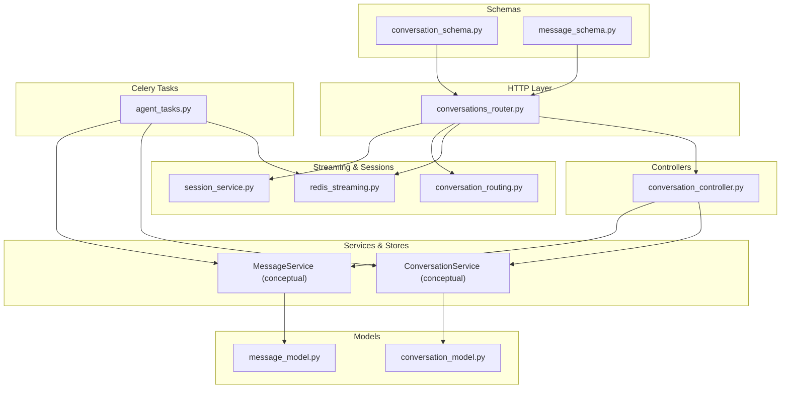
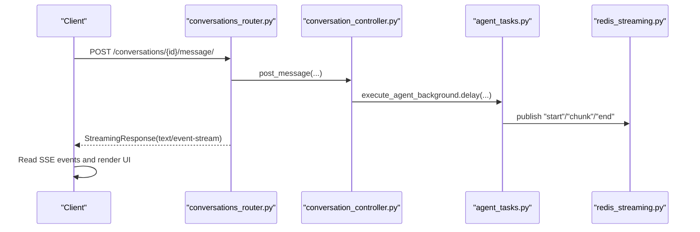
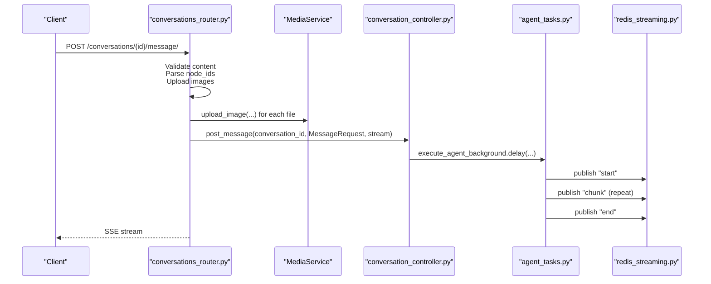
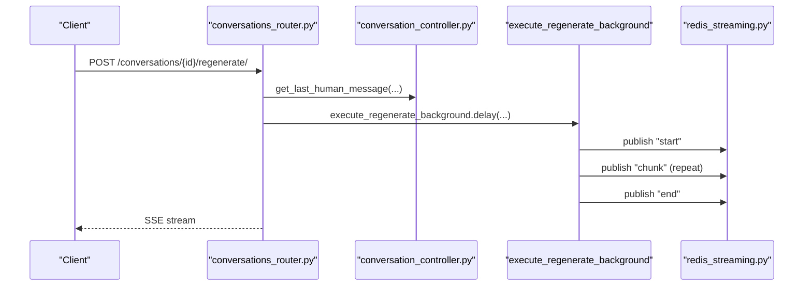
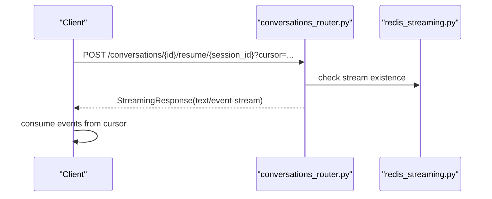
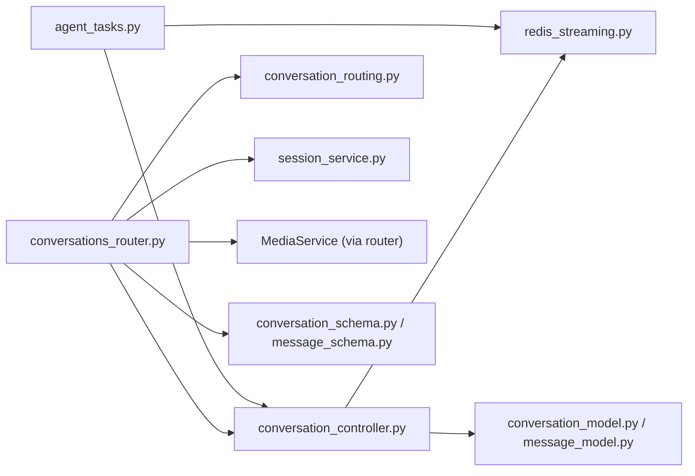

# Conversations API

<cite>
**Referenced Files in This Document**
- [conversations_router.py](file://app/modules/conversations/conversations_router.py)
- [conversation_controller.py](file://app/modules/conversations/conversation/conversation_controller.py)
- [conversation_schema.py](file://app/modules/conversations/conversation/conversation_schema.py)
- [message_schema.py](file://app/modules/conversations/message/message_schema.py)
- [message_model.py](file://app/modules/conversations/message/message_model.py)
- [conversation_model.py](file://app/modules/conversations/conversation/conversation_model.py)
- [session_service.py](file://app/modules/conversations/session/session_service.py)
- [redis_streaming.py](file://app/modules/conversations/utils/redis_streaming.py)
- [conversation_routing.py](file://app/modules/conversations/utils/conversation_routing.py)
- [agent_tasks.py](file://app/celery/tasks/agent_tasks.py)
- [access_schema.py](file://app/modules/conversations/access/access_schema.py)
- [media_schema.py](file://app/modules/media/media_schema.py)
- [conversations.md](file://docs/conversations.md)
- [subagent_streaming_api.md](file://docs/subagent_streaming_api.md)
</cite>

## Table of Contents
1. [Introduction](#introduction)
2. [Project Structure](#project-structure)
3. [Core Components](#core-components)
4. [Architecture Overview](#architecture-overview)
5. [Detailed Component Analysis](#detailed-component-analysis)
6. [Dependency Analysis](#dependency-analysis)
7. [Performance Considerations](#performance-considerations)
8. [Troubleshooting Guide](#troubleshooting-guide)
9. [Conclusion](#conclusion)
10. [Appendices](#appendices)

## Introduction
This document provides comprehensive API documentation for Potpie’s conversation and messaging system. It covers HTTP endpoints for creating conversations, posting messages, retrieving conversation metadata and message lists, regenerating responses, and managing sessions. It also documents the streaming architecture using Redis streams and Celery tasks, including session management, cursor-based resumption, and real-time interaction patterns. Attachments and message threading are explained alongside conversation lifecycle management and performance optimization strategies.

## Project Structure
The conversations module is organized around routers, controllers, services, schemas, and utilities:
- Routers define HTTP endpoints and orchestrate request handling.
- Controllers coordinate service-layer operations and translate responses.
- Schemas define request/response models and enumerations.
- Utilities manage Redis-backed streaming, session IDs, and Celery task orchestration.
- Celery tasks execute agent logic asynchronously and publish streaming events.

**Diagram sources**
- [conversations_router.py](file://app/modules/conversations/conversations_router.py#L58-L622)
- [conversation_controller.py](file://app/modules/conversations/conversation/conversation_controller.py#L33-L224)
- [conversation_schema.py](file://app/modules/conversations/conversation/conversation_schema.py#L13-L93)
- [message_schema.py](file://app/modules/conversations/message/message_schema.py#L10-L47)
- [conversation_model.py](file://app/modules/conversations/conversation/conversation_model.py#L23-L60)
- [message_model.py](file://app/modules/conversations/message/message_model.py#L23-L65)
- [redis_streaming.py](file://app/modules/conversations/utils/redis_streaming.py#L11-L248)
- [conversation_routing.py](file://app/modules/conversations/utils/conversation_routing.py#L23-L324)
- [session_service.py](file://app/modules/conversations/session/session_service.py#L15-L164)
- [agent_tasks.py](file://app/celery/tasks/agent_tasks.py#L11-L460)

**Section sources**
- [conversations_router.py](file://app/modules/conversations/conversations_router.py#L58-L622)
- [conversation_controller.py](file://app/modules/conversations/conversation/conversation_controller.py#L33-L224)
- [conversation_schema.py](file://app/modules/conversations/conversation/conversation_schema.py#L13-L93)
- [message_schema.py](file://app/modules/conversations/message/message_schema.py#L10-L47)
- [conversation_model.py](file://app/modules/conversations/conversation/conversation_model.py#L23-L60)
- [message_model.py](file://app/modules/conversations/message/message_model.py#L23-L65)
- [redis_streaming.py](file://app/modules/conversations/utils/redis_streaming.py#L11-L248)
- [conversation_routing.py](file://app/modules/conversations/utils/conversation_routing.py#L23-L324)
- [session_service.py](file://app/modules/conversations/session/session_service.py#L15-L164)
- [agent_tasks.py](file://app/celery/tasks/agent_tasks.py#L11-L460)

## Core Components
- HTTP Router: Defines endpoints for conversations and messages, handles authentication, uploads, and streaming.
- Controller: Coordinates service operations, enforces access checks, and translates domain results to API responses.
- Streaming Utilities: Normalize and ensure unique session identifiers, publish Redis stream events, and generate SSE-compatible responses.
- Redis Manager: Publishes structured events, manages TTL and max length, tracks task status, and supports cancellation.
- Celery Tasks: Execute agent logic asynchronously, publish “start”, “chunk”, and “end” events, and support cancellation.
- Session Service: Inspects active sessions and task statuses for a given conversation.

Key responsibilities:
- Conversation lifecycle: create, rename, delete, stop generation, and info retrieval.
- Message lifecycle: post messages (streaming), regenerate last message (streaming), and list messages with pagination.
- Real-time streaming: SSE over Redis streams with cursor-based resumption and session management.
- Attachments: Upload images, associate IDs with messages, and expose attachment metadata.

**Section sources**
- [conversations_router.py](file://app/modules/conversations/conversations_router.py#L58-L622)
- [conversation_controller.py](file://app/modules/conversations/conversation/conversation_controller.py#L33-L224)
- [redis_streaming.py](file://app/modules/conversations/utils/redis_streaming.py#L11-L248)
- [conversation_routing.py](file://app/modules/conversations/utils/conversation_routing.py#L23-L324)
- [session_service.py](file://app/modules/conversations/session/session_service.py#L15-L164)
- [agent_tasks.py](file://app/celery/tasks/agent_tasks.py#L11-L460)

## Architecture Overview
The system combines FastAPI endpoints with asynchronous Celery workers and Redis streams:
- Clients send HTTP requests to create conversations, post messages, or regenerate responses.
- For streaming, the router starts a background Celery task and returns an SSE stream keyed by a normalized run ID.
- Celery tasks publish structured events (“start”, “chunk”, “end”) to Redis streams.
- Clients consume SSE and can resume from a cursor for reconnection resilience.
- Session management utilities help discover active sessions and task statuses.

**Diagram sources**
- [conversations_router.py](file://app/modules/conversations/conversations_router.py#L160-L286)
- [conversation_controller.py](file://app/modules/conversations/conversation/conversation_controller.py#L106-L137)
- [agent_tasks.py](file://app/celery/tasks/agent_tasks.py#L11-L247)
- [redis_streaming.py](file://app/modules/conversations/utils/redis_streaming.py#L21-L62)

## Detailed Component Analysis

### HTTP Endpoints

#### GET /conversations/
- Purpose: List conversations for the current user with sorting and pagination.
- Query parameters:
  - start (integer, default 0)
  - limit (integer, default 10)
  - sort (enum: updated_at | created_at)
  - order (enum: asc | desc)
- Response: Array of UserConversationListResponse items.

**Section sources**
- [conversations_router.py](file://app/modules/conversations/conversations_router.py#L60-L80)
- [conversation_controller.py](file://app/modules/conversations/conversation/conversation_controller.py#L174-L223)

#### POST /conversations/
- Purpose: Create a new conversation.
- Request body: CreateConversationRequest (user_id, title, status, project_ids, agent_ids).
- Response: CreateConversationResponse (message, conversation_id).
- Behavior: Enforces usage limits via UsageService.

**Section sources**
- [conversations_router.py](file://app/modules/conversations/conversations_router.py#L82-L102)
- [conversation_schema.py](file://app/modules/conversations/conversation/conversation_schema.py#L13-L34)

#### GET /conversations/{conversation_id}/info/
- Purpose: Retrieve conversation metadata (including access type and visibility).
- Path parameter: conversation_id.
- Response: ConversationInfoResponse.

**Section sources**
- [conversations_router.py](file://app/modules/conversations/conversations_router.py#L104-L128)
- [conversation_schema.py](file://app/modules/conversations/conversation/conversation_schema.py#L36-L51)

#### GET /conversations/{conversation_id}/messages/
- Purpose: Retrieve paginated messages for a conversation.
- Path parameter: conversation_id.
- Query parameters:
  - start (integer, default 0)
  - limit (integer, default 10)
- Response: Array of MessageResponse.

**Section sources**
- [conversations_router.py](file://app/modules/conversations/conversations_router.py#L130-L158)
- [message_schema.py](file://app/modules/conversations/message/message_schema.py#L32-L46)

#### POST /conversations/{conversation_id}/message/
- Purpose: Post a human message and stream the AI response.
- Path parameter: conversation_id.
- Form fields:
  - content (string)
  - node_ids (JSON array of NodeContext)
  - images (multipart file list)
  - stream (boolean, default true)
  - session_id (optional)
  - prev_human_message_id (optional)
  - cursor (optional)
- Behavior:
  - Validates content.
  - Uploads images via MediaService and collects attachment IDs.
  - Parses node_ids JSON.
  - Starts background Celery task and returns SSE stream.
  - Uses normalized run_id and ensures uniqueness when no cursor is provided.

**Section sources**
- [conversations_router.py](file://app/modules/conversations/conversations_router.py#L160-L286)
- [conversation_routing.py](file://app/modules/conversations/utils/conversation_routing.py#L23-L171)
- [redis_streaming.py](file://app/modules/conversations/utils/redis_streaming.py#L11-L248)
- [media_schema.py](file://app/modules/media/media_schema.py#L9-L22)

#### POST /conversations/{conversation_id}/regenerate/
- Purpose: Regenerate the last AI message with optional streaming.
- Path parameter: conversation_id.
- Request body: RegenerateRequest (node_ids).
- Query parameters:
  - stream (boolean, default true)
  - session_id (optional)
  - prev_human_message_id (optional)
  - cursor (optional)
  - background (boolean, default true)
- Behavior:
  - Extracts attachment IDs from the last human message.
  - Starts background Celery task and returns SSE stream.
  - Publishes “queued” status and sets task status in Redis.

**Section sources**
- [conversations_router.py](file://app/modules/conversations/conversations_router.py#L288-L417)
- [conversation_routing.py](file://app/modules/conversations/utils/conversation_routing.py#L173-L324)
- [redis_streaming.py](file://app/modules/conversations/utils/redis_streaming.py#L188-L247)

#### DELETE /conversations/{conversation_id}/
- Purpose: Delete a conversation.
- Path parameter: conversation_id.
- Response: Generic dictionary confirmation.

**Section sources**
- [conversations_router.py](file://app/modules/conversations/conversations_router.py#L420-L430)

#### POST /conversations/{conversation_id}/stop/
- Purpose: Stop an ongoing generation for a conversation.
- Path parameter: conversation_id.
- Query parameters:
  - session_id (optional)
- Response: Generic dictionary confirmation.

**Section sources**
- [conversations_router.py](file://app/modules/conversations/conversations_router.py#L432-L444)

#### PATCH /conversations/{conversation_id}/rename/
- Purpose: Rename a conversation.
- Path parameter: conversation_id.
- Request body: RenameConversationRequest (title).
- Response: Generic dictionary confirmation.

**Section sources**
- [conversations_router.py](file://app/modules/conversations/conversations_router.py#L446-L458)

#### GET /conversations/{conversation_id}/active-session
- Purpose: Get active session information for a conversation.
- Path parameter: conversation_id.
- Response: ActiveSessionResponse or raises 404.

**Section sources**
- [conversations_router.py](file://app/modules/conversations/conversations_router.py#L460-L488)
- [session_service.py](file://app/modules/conversations/session/session_service.py#L23-L98)

#### GET /conversations/{conversation_id}/task-status
- Purpose: Get background task status for a conversation.
- Path parameter: conversation_id.
- Response: TaskStatusResponse or raises 404.

**Section sources**
- [conversations_router.py](file://app/modules/conversations/conversations_router.py#L490-L518)
- [session_service.py](file://app/modules/conversations/session/session_service.py#L100-L163)

#### POST /conversations/{conversation_id}/resume/{session_id}
- Purpose: Resume streaming from an existing session using a cursor.
- Path parameter: conversation_id, session_id.
- Query parameters:
  - cursor (string, default "0-0")
- Response: StreamingResponse(text/event-stream).

**Section sources**
- [conversations_router.py](file://app/modules/conversations/conversations_router.py#L520-L566)
- [redis_streaming.py](file://app/modules/conversations/utils/redis_streaming.py#L64-L150)

#### Sharing and Access Control
- POST /conversations/share
  - Request: ShareChatRequest (conversation_id, recipientEmails, visibility)
  - Response: ShareChatResponse (message, sharedID)
- GET /conversations/{conversation_id}/shared-emails
  - Response: List of shared emails
- DELETE /conversations/{conversation_id}/access
  - Request: RemoveAccessRequest (emails)
  - Response: Generic confirmation

**Section sources**
- [conversations_router.py](file://app/modules/conversations/conversations_router.py#L568-L621)
- [access_schema.py](file://app/modules/conversations/access/access_schema.py#L8-L24)

### Streaming and Session Management

#### Session ID Normalization and Uniqueness
- normalize_run_id: Builds a deterministic run_id scoped to the user and previous human message.
- ensure_unique_run_id: Ensures the Redis stream key does not collide by appending a counter.

**Section sources**
- [conversation_routing.py](file://app/modules/conversations/utils/conversation_routing.py#L23-L58)

#### Redis Stream Publishing and Consumption
- publish_event: Emits structured events with type, conversation_id, run_id, created_at, and payload.
- consume_stream: Reads stream events, supports replay from cursor and live consumption with timeouts.
- clear_session: Publishes an “end” event and marks task as cancelled.

**Section sources**
- [redis_streaming.py](file://app/modules/conversations/utils/redis_streaming.py#L21-L150)
- [redis_streaming.py](file://app/modules/conversations/utils/redis_streaming.py#L212-L234)

#### SSE Streaming Response
- redis_stream_generator: Converts Redis events to JSON chunks compatible with ChatMessageResponse.
- start_celery_task_and_stream: Starts Celery task, publishes “queued” event, and returns StreamingResponse.

**Section sources**
- [conversation_routing.py](file://app/modules/conversations/utils/conversation_routing.py#L61-L171)

#### Celery Task Execution
- execute_agent_background: Stores the human message, streams AI chunks, publishes “start”, “chunk”, and “end” events, and supports cancellation.
- execute_regenerate_background: Similar flow for regeneration.

**Section sources**
- [agent_tasks.py](file://app/celery/tasks/agent_tasks.py#L11-L247)
- [agent_tasks.py](file://app/celery/tasks/agent_tasks.py#L249-L460)

#### Session and Task Status Discovery
- SessionService.get_active_session: Scans Redis for active streams, determines status, and estimates timestamps.
- SessionService.get_task_status: Determines if a task is active and estimates completion.

**Section sources**
- [session_service.py](file://app/modules/conversations/session/session_service.py#L23-L163)

### Data Models and Schemas

#### Conversation Models
- ConversationStatus: active, archived, deleted
- Visibility: private, public
- Conversation entity includes relationships to messages and projects.

**Section sources**
- [conversation_model.py](file://app/modules/conversations/conversation/conversation_model.py#L12-L60)

#### Message Models
- MessageType: AI_GENERATED, HUMAN, SYSTEM_GENERATED
- Message entity includes content, citations, attachments flag, and timestamps.

**Section sources**
- [message_model.py](file://app/modules/conversations/message/message_model.py#L11-L65)

#### Request/Response Schemas
- CreateConversationRequest/Response
- ConversationInfoResponse
- MessageRequest/DirectMessageRequest/RegenerateRequest/MessageResponse
- ChatMessageResponse (streamed chunks)
- ActiveSessionResponse/TaskStatusResponse and their error variants

**Section sources**
- [conversation_schema.py](file://app/modules/conversations/conversation/conversation_schema.py#L13-L93)
- [message_schema.py](file://app/modules/conversations/message/message_schema.py#L10-L47)

### API Workflows

#### Message Posting Flow

**Diagram sources**
- [conversations_router.py](file://app/modules/conversations/conversations_router.py#L160-L286)
- [conversation_controller.py](file://app/modules/conversations/conversation/conversation_controller.py#L106-L137)
- [agent_tasks.py](file://app/celery/tasks/agent_tasks.py#L11-L247)
- [redis_streaming.py](file://app/modules/conversations/utils/redis_streaming.py#L21-L62)

#### Regeneration Flow

**Diagram sources**
- [conversations_router.py](file://app/modules/conversations/conversations_router.py#L288-L417)
- [conversation_controller.py](file://app/modules/conversations/conversation/conversation_controller.py#L163-L172)
- [agent_tasks.py](file://app/celery/tasks/agent_tasks.py#L249-L460)
- [redis_streaming.py](file://app/modules/conversations/utils/redis_streaming.py#L21-L62)

#### Resuming a Stream

**Diagram sources**
- [conversations_router.py](file://app/modules/conversations/conversations_router.py#L520-L566)
- [redis_streaming.py](file://app/modules/conversations/utils/redis_streaming.py#L64-L150)

### Streaming Protocols and Formats
- Media type: text/event-stream
- Event types:
  - start: indicates processing has begun
  - chunk: incremental content with message, citations, tool_calls
  - end: completion, error, or cancellation
- Cursor-based resumption: Clients provide a stream_id cursor to resume from a specific event.
- Task status keys: task:status:{conversation_id}:{run_id} stores queued/running/completed/error.
- Cancellation: cancel:{conversation_id}:{run_id} signals workers to abort.

**Section sources**
- [redis_streaming.py](file://app/modules/conversations/utils/redis_streaming.py#L21-L62)
- [redis_streaming.py](file://app/modules/conversations/utils/redis_streaming.py#L177-L247)
- [conversation_routing.py](file://app/modules/conversations/utils/conversation_routing.py#L61-L105)

### Request/Response Examples and Schemas

#### Create Conversation
- Request: CreateConversationRequest
- Response: CreateConversationResponse

**Section sources**
- [conversation_schema.py](file://app/modules/conversations/conversation/conversation_schema.py#L13-L34)

#### Conversation Info
- Response: ConversationInfoResponse

**Section sources**
- [conversation_schema.py](file://app/modules/conversations/conversation/conversation_schema.py#L36-L51)

#### Message Posting (Streaming)
- Request: multipart/form-data with content, node_ids, images
- Response: SSE stream of ChatMessageResponse chunks

**Section sources**
- [conversations_router.py](file://app/modules/conversations/conversations_router.py#L160-L286)
- [conversation_schema.py](file://app/modules/conversations/conversation/conversation_schema.py#L54-L58)

#### Regenerate Last Message
- Request: RegenerateRequest
- Response: SSE stream of ChatMessageResponse chunks

**Section sources**
- [message_schema.py](file://app/modules/conversations/message/message_schema.py#L28-L30)
- [conversation_schema.py](file://app/modules/conversations/conversation/conversation_schema.py#L54-L58)

#### Session and Task Status
- Response: ActiveSessionResponse or TaskStatusResponse

**Section sources**
- [conversation_schema.py](file://app/modules/conversations/conversation/conversation_schema.py#L69-L93)

### Conversation Lifecycle Management
- Create: POST /conversations/
- Rename: PATCH /conversations/{conversation_id}/rename/
- Delete: DELETE /conversations/{conversation_id}/
- Stop generation: POST /conversations/{conversation_id}/stop/
- Access control: POST /conversations/share, GET /conversations/{conversation_id}/shared-emails, DELETE /conversations/{conversation_id}/access

**Section sources**
- [conversations_router.py](file://app/modules/conversations/conversations_router.py#L82-L102)
- [conversations_router.py](file://app/modules/conversations/conversations_router.py#L446-L458)
- [conversations_router.py](file://app/modules/conversations/conversations_router.py#L420-L430)
- [conversations_router.py](file://app/modules/conversations/conversations_router.py#L432-L444)
- [conversations_router.py](file://app/modules/conversations/conversations_router.py#L568-L621)

### Message Threading and Attachments
- Message threading: Messages belong to a conversation with timestamps and types.
- Attachments: Images uploaded via multipart form are stored and referenced by attachment IDs; messages can have an attachments flag and metadata.

**Section sources**
- [message_model.py](file://app/modules/conversations/message/message_model.py#L23-L65)
- [message_schema.py](file://app/modules/conversations/message/message_schema.py#L32-L46)
- [media_schema.py](file://app/modules/media/media_schema.py#L9-L22)
- [conversations_router.py](file://app/modules/conversations/conversations_router.py#L197-L236)

### Real-Time Interaction Guidelines
- Use session_id and prev_human_message_id to derive deterministic run_id for consistent sessions.
- Provide cursor on resume to reconnect seamlessly.
- Handle “end” events to finalize UI state.
- Respect task status keys to infer whether a task is pending, running, or completed.

**Section sources**
- [conversation_routing.py](file://app/modules/conversations/utils/conversation_routing.py#L23-L58)
- [redis_streaming.py](file://app/modules/conversations/utils/redis_streaming.py#L188-L247)
- [session_service.py](file://app/modules/conversations/session/session_service.py#L100-L163)

## Dependency Analysis

**Diagram sources**
- [conversations_router.py](file://app/modules/conversations/conversations_router.py#L58-L622)
- [conversation_controller.py](file://app/modules/conversations/conversation/conversation_controller.py#L33-L224)
- [redis_streaming.py](file://app/modules/conversations/utils/redis_streaming.py#L11-L248)
- [conversation_routing.py](file://app/modules/conversations/utils/conversation_routing.py#L23-L324)
- [session_service.py](file://app/modules/conversations/session/session_service.py#L15-L164)
- [agent_tasks.py](file://app/celery/tasks/agent_tasks.py#L11-L460)
- [conversation_model.py](file://app/modules/conversations/conversation/conversation_model.py#L23-L60)
- [message_model.py](file://app/modules/conversations/message/message_model.py#L23-L65)
- [conversation_schema.py](file://app/modules/conversations/conversation/conversation_schema.py#L13-L93)
- [message_schema.py](file://app/modules/conversations/message/message_schema.py#L10-L47)

**Section sources**
- [conversations_router.py](file://app/modules/conversations/conversations_router.py#L58-L622)
- [conversation_controller.py](file://app/modules/conversations/conversation/conversation_controller.py#L33-L224)
- [redis_streaming.py](file://app/modules/conversations/utils/redis_streaming.py#L11-L248)
- [conversation_routing.py](file://app/modules/conversations/utils/conversation_routing.py#L23-L324)
- [session_service.py](file://app/modules/conversations/session/session_service.py#L15-L164)
- [agent_tasks.py](file://app/celery/tasks/agent_tasks.py#L11-L460)
- [conversation_model.py](file://app/modules/conversations/conversation/conversation_model.py#L23-L60)
- [message_model.py](file://app/modules/conversations/message/message_model.py#L23-L65)
- [conversation_schema.py](file://app/modules/conversations/conversation/conversation_schema.py#L13-L93)
- [message_schema.py](file://app/modules/conversations/message/message_schema.py#L10-L47)

## Performance Considerations
- Use background execution for streaming to avoid blocking HTTP requests.
- Redis stream TTL and max length prevent unbounded growth; tune via configuration.
- Cursor-based resumption reduces redundant replay for long-running sessions.
- Image uploads are processed before message creation; ensure cleanup on failures.
- Task status keys enable quick health checks and reduce polling overhead.

[No sources needed since this section provides general guidance]

## Troubleshooting Guide
Common issues and resolutions:
- Subscription required: Requests may be rejected if usage limits are exceeded.
- Empty content: Message content must be non-empty.
- Invalid node_ids: JSON parsing errors will surface as bad requests.
- Stream timeout: Fresh requests wait up to 120 seconds for stream creation; “timeout” end event indicates queueing.
- Stream expired: End event with “expired” status indicates TTL reached.
- Session not found: Resume endpoint validates stream existence and returns 404 if missing.
- Cancellation: Setting cancel key triggers worker to flush buffers and publish “cancelled”.

**Section sources**
- [conversations_router.py](file://app/modules/conversations/conversations_router.py#L94-L99)
- [conversations_router.py](file://app/modules/conversations/conversations_router.py#L180-L183)
- [conversations_router.py](file://app/modules/conversations/conversations_router.py#L242-L245)
- [redis_streaming.py](file://app/modules/conversations/utils/redis_streaming.py#L91-L122)
- [redis_streaming.py](file://app/modules/conversations/utils/redis_streaming.py#L113-L150)
- [conversations_router.py](file://app/modules/conversations/conversations_router.py#L549-L554)
- [redis_streaming.py](file://app/modules/conversations/utils/redis_streaming.py#L177-L186)

## Conclusion
Potpie’s conversations API provides a robust, streaming-first architecture for interactive AI-assisted conversations. It supports conversation lifecycle operations, message threading, attachments, and resilient real-time streaming with session management and cursor-based resumption. The design leverages Redis streams and Celery tasks to scale beyond traditional synchronous request-response patterns, enabling responsive UIs and reliable long-running tasks.

[No sources needed since this section summarizes without analyzing specific files]

## Appendices

### Endpoint Specifications Summary
- GET /conversations/: List conversations (start, limit, sort, order)
- POST /conversations/: Create conversation
- GET /conversations/{conversation_id}/info/: Conversation info
- GET /conversations/{conversation_id}/messages/: Messages (start, limit)
- POST /conversations/{conversation_id}/message/: Post message (multipart/form-data)
- POST /conversations/{conversation_id}/regenerate/: Regenerate last message
- DELETE /conversations/{conversation_id}/: Delete conversation
- POST /conversations/{conversation_id}/stop/: Stop generation
- PATCH /conversations/{conversation_id}/rename/: Rename conversation
- GET /conversations/{conversation_id}/active-session: Active session info
- GET /conversations/{conversation_id}/task-status: Task status
- POST /conversations/{conversation_id}/resume/{session_id}: Resume stream
- POST /conversations/share: Share conversation
- GET /conversations/{conversation_id}/shared-emails: Shared emails
- DELETE /conversations/{conversation_id}/access: Remove access

**Section sources**
- [conversations_router.py](file://app/modules/conversations/conversations_router.py#L60-L621)

### Streaming Event Types and Payloads
- start: { agent_id, status, message }
- chunk: { content, citations_json, tool_calls_json }
- end: { status, message }

**Section sources**
- [agent_tasks.py](file://app/celery/tasks/agent_tasks.py#L112-L202)
- [redis_streaming.py](file://app/modules/conversations/utils/redis_streaming.py#L21-L62)

### Session and Task Keys
- chat:stream:{conversation_id}:{run_id}
- task:status:{conversation_id}:{run_id}
- task:id:{conversation_id}:{run_id}
- cancel:{conversation_id}:{run_id}

**Section sources**
- [redis_streaming.py](file://app/modules/conversations/utils/redis_streaming.py#L18-L210)