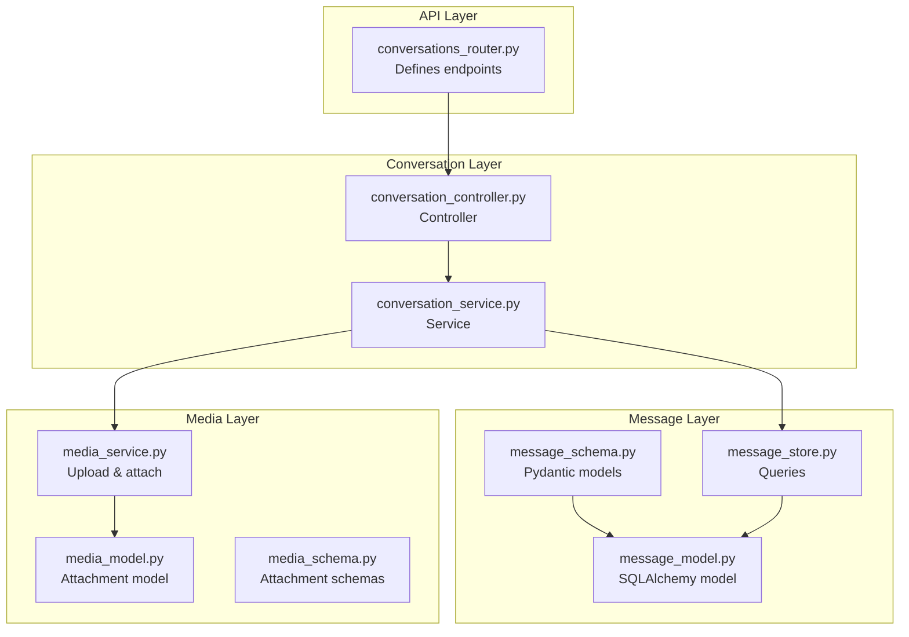
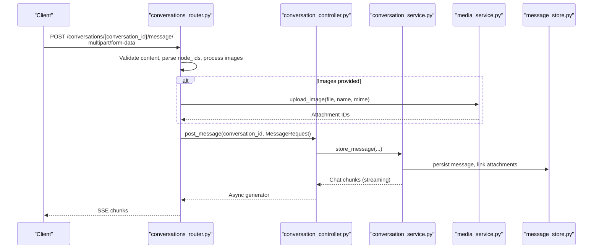
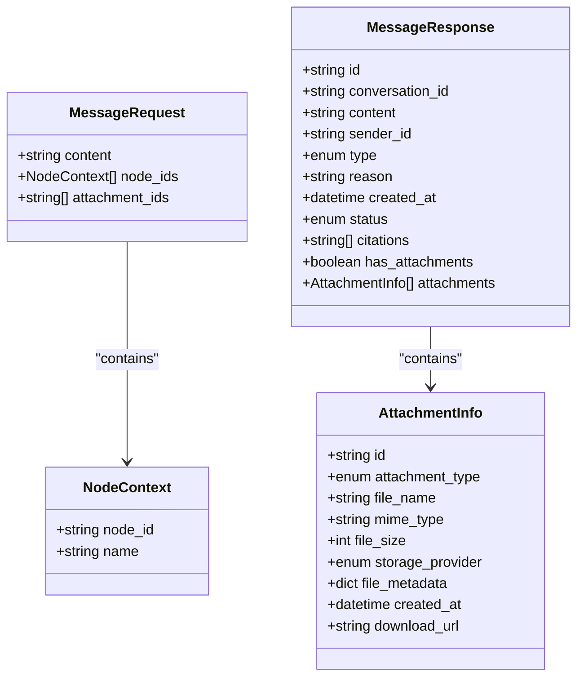
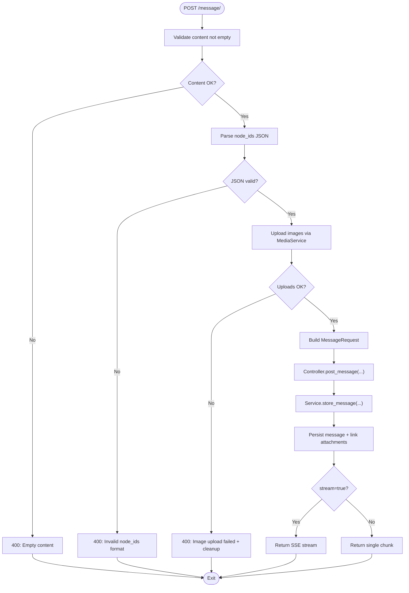
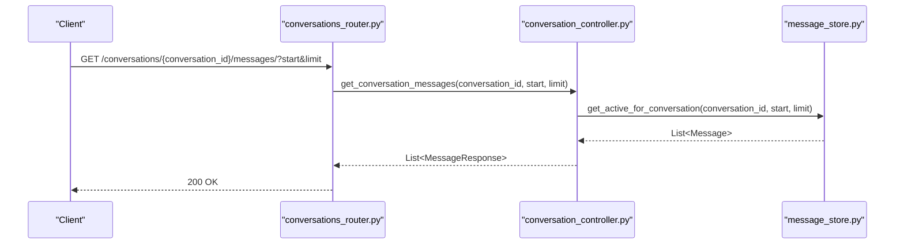
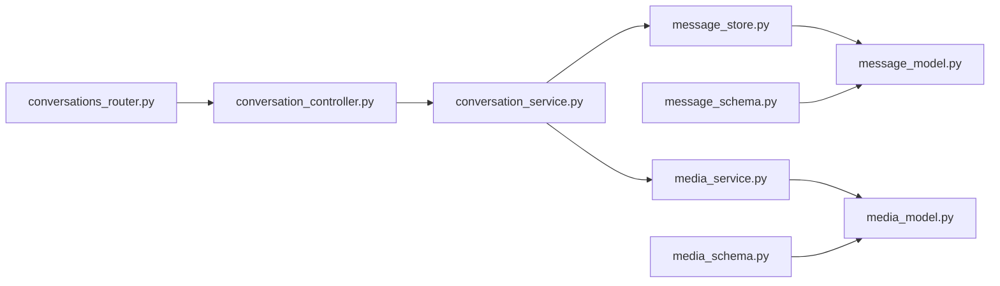

# Message Handling

<cite>
**Referenced Files in This Document**
- [conversations_router.py](file://app/modules/conversations/conversations_router.py)
- [conversation_controller.py](file://app/modules/conversations/conversation/conversation_controller.py)
- [conversation_service.py](file://app/modules/conversations/conversation/conversation_service.py)
- [message_schema.py](file://app/modules/conversations/message/message_schema.py)
- [message_model.py](file://app/modules/conversations/message/message_model.py)
- [message_store.py](file://app/modules/conversations/message/message_store.py)
- [media_service.py](file://app/modules/media/media_service.py)
- [media_model.py](file://app/modules/media/media_model.py)
- [media_schema.py](file://app/modules/media/media_schema.py)
</cite>

## Table of Contents
1. [Introduction](#introduction)
2. [Project Structure](#project-structure)
3. [Core Components](#core-components)
4. [Architecture Overview](#architecture-overview)
5. [Detailed Component Analysis](#detailed-component-analysis)
6. [Dependency Analysis](#dependency-analysis)
7. [Performance Considerations](#performance-considerations)
8. [Troubleshooting Guide](#troubleshooting-guide)
9. [Conclusion](#conclusion)

## Introduction
This document provides comprehensive API documentation for message handling endpoints focused on:
- Posting a new message to a conversation
- Retrieving messages from a conversation

It covers HTTP methods, URL patterns, request and response schemas, validation rules, node ID processing, image upload handling, attachment management, multipart/form-data semantics, message threading, conversation context preservation, message ordering, and error handling.

## Project Structure
The message handling functionality spans several modules:
- API router and endpoint definitions
- Conversation controller and service orchestration
- Message schema, model, and store
- Media service for image uploads and attachment management
- Media model and schema for attachment metadata

**Diagram sources**
- [conversations_router.py](file://app/modules/conversations/conversations_router.py#L160-L286)
- [conversation_controller.py](file://app/modules/conversations/conversation/conversation_controller.py#L106-L120)
- [conversation_service.py](file://app/modules/conversations/conversation/conversation_service.py#L543-L700)
- [message_schema.py](file://app/modules/conversations/message/message_schema.py#L15-L46)
- [message_model.py](file://app/modules/conversations/message/message_model.py#L23-L65)
- [message_store.py](file://app/modules/conversations/message/message_store.py#L8-L83)
- [media_service.py](file://app/modules/media/media_service.py#L101-L185)
- [media_model.py](file://app/modules/media/media_model.py#L24-L47)
- [media_schema.py](file://app/modules/media/media_schema.py#L9-L42)

**Section sources**
- [conversations_router.py](file://app/modules/conversations/conversations_router.py#L160-L286)
- [conversation_controller.py](file://app/modules/conversations/conversation/conversation_controller.py#L106-L120)
- [conversation_service.py](file://app/modules/conversations/conversation/conversation_service.py#L543-L700)
- [message_schema.py](file://app/modules/conversations/message/message_schema.py#L15-L46)
- [message_model.py](file://app/modules/conversations/message/message_model.py#L23-L65)
- [message_store.py](file://app/modules/conversations/message/message_store.py#L8-L83)
- [media_service.py](file://app/modules/media/media_service.py#L101-L185)
- [media_model.py](file://app/modules/media/media_model.py#L24-L47)
- [media_schema.py](file://app/modules/media/media_schema.py#L9-L42)

## Core Components
- Endpoint definitions:
  - POST /conversations/{conversation_id}/message/
  - GET /conversations/{conversation_id}/messages/
- Request/response schemas:
  - MessageRequest, MessageResponse, NodeContext
  - AttachmentInfo, AttachmentUploadResponse
- Validation and processing:
  - Content validation, node IDs parsing, image upload pipeline, attachment linking
- Streaming and session management:
  - Deterministic run IDs, session resumption, Redis streaming

**Section sources**
- [conversations_router.py](file://app/modules/conversations/conversations_router.py#L130-L286)
- [message_schema.py](file://app/modules/conversations/message/message_schema.py#L15-L46)
- [media_schema.py](file://app/modules/media/media_schema.py#L9-L42)

## Architecture Overview
The message posting flow integrates:
- Router validates multipart/form-data inputs
- Controller orchestrates message creation and optional streaming
- Service persists message, optionally links attachments, and triggers generation
- Media service handles image uploads and attachment metadata
- Message store retrieves ordered messages for retrieval

**Diagram sources**
- [conversations_router.py](file://app/modules/conversations/conversations_router.py#L160-L286)
- [conversation_controller.py](file://app/modules/conversations/conversation/conversation_controller.py#L106-L120)
- [conversation_service.py](file://app/modules/conversations/conversation/conversation_service.py#L543-L700)
- [media_service.py](file://app/modules/media/media_service.py#L101-L185)
- [message_store.py](file://app/modules/conversations/message/message_store.py#L8-L83)

## Detailed Component Analysis

### Endpoint: POST /conversations/{conversation_id}/message/
- Method: POST
- Path parameters:
  - conversation_id: string (required)
- Query parameters:
  - stream: boolean, default true
  - session_id: optional string
  - prev_human_message_id: optional string
  - cursor: optional string
- Form-data parameters (multipart/form-data):
  - content: string (required)
  - node_ids: string (JSON array of NodeContext objects) — optional
  - images: file[] — optional
- Behavior:
  - Validates content is non-empty
  - Processes images via MediaService (uploads, records metadata)
  - Parses node_ids JSON array into NodeContext objects
  - Creates MessageRequest and delegates to controller/service
  - Supports streaming via Redis/Celery or immediate response
- Response:
  - StreamingResponse (SSE) when stream=true
  - Single chunk when stream=false

Request schema summary
- content: string (non-empty)
- node_ids: array of NodeContext (optional)
  - node_id: string
  - name: string
- attachment_ids: array of string (IDs from uploaded images)

Response schema summary
- id: string
- conversation_id: string
- content: string
- sender_id: optional string
- type: enum (AI_GENERATED, HUMAN, SYSTEM_GENERATED)
- reason: optional string
- created_at: datetime
- status: enum (ACTIVE, ARCHIVED, DELETED)
- citations: optional array of string
- has_attachments: boolean
- attachments: optional array of AttachmentInfo

Validation and error handling
- Empty content → 400 Bad Request
- Malformed node_ids JSON → 400 Bad Request
- Image upload failure → 400 Bad Request with cleanup of partial attachments
- Usage limit checks prior to processing

Node ID processing
- node_ids is a JSON-encoded array of NodeContext objects
- Parsed into Python objects before being passed to downstream services

Image upload and attachment management
- Each image is validated (type, size, integrity)
- Processed and stored via MediaService
- Attachment IDs collected and linked to the message
- On failure, previously uploaded attachments are cleaned up

Streaming and session management
- Deterministic run_id built from conversation_id, user_id, session_id, prev_human_message_id
- Fresh runs normalized to unique run_id when no cursor provided
- Streaming uses Redis stream generator

Examples
- Message object fields: see MessageResponse schema
- Attachment structure: see AttachmentInfo schema
- Node ID array: array of {node_id: "...", name: "..."}

Ordering and threading
- Messages are ordered chronologically ascending during retrieval
- Streaming preserves conversation context and supports resumption via cursor

**Section sources**
- [conversations_router.py](file://app/modules/conversations/conversations_router.py#L160-L286)
- [message_schema.py](file://app/modules/conversations/message/message_schema.py#L15-L46)
- [media_service.py](file://app/modules/media/media_service.py#L101-L185)
- [media_schema.py](file://app/modules/media/media_schema.py#L9-L42)
- [message_store.py](file://app/modules/conversations/message/message_store.py#L19-L34)

### Endpoint: GET /conversations/{conversation_id}/messages/
- Method: GET
- Path parameters:
  - conversation_id: string (required)
- Query parameters:
  - start: integer, min 0, default 0
  - limit: integer, min 1, default 10
- Response:
  - Array of MessageResponse objects, ordered by created_at ascending

Behavior
- Retrieves active, non-system messages within pagination bounds
- Conversations context preserved via controller/service access checks

**Section sources**
- [conversations_router.py](file://app/modules/conversations/conversations_router.py#L130-L158)
- [conversation_controller.py](file://app/modules/conversations/conversation/conversation_controller.py#L91-L104)
- [message_store.py](file://app/modules/conversations/message/message_store.py#L19-L34)

### Supporting Data Models

Message model
- Fields: id, conversation_id, content, sender_id, type, status, created_at, citations, has_attachments
- Constraints: sender_id must match type (HUMAN requires sender_id; AI/SYSTEM require none)

Message schema
- MessageRequest: content, node_ids, attachment_ids
- MessageResponse: id, conversation_id, content, sender_id, type, reason, created_at, status, citations, has_attachments, attachments

Attachment model and schema
- MessageAttachment: id, message_id, attachment_type, file_name, file_size, mime_type, storage_path, storage_provider, file_metadata, created_at
- AttachmentInfo: id, attachment_type, file_name, mime_type, file_size, storage_provider, file_metadata, created_at, download_url

**Section sources**
- [message_model.py](file://app/modules/conversations/message/message_model.py#L23-L65)
- [message_schema.py](file://app/modules/conversations/message/message_schema.py#L15-L46)
- [media_model.py](file://app/modules/media/media_model.py#L24-L47)
- [media_schema.py](file://app/modules/media/media_schema.py#L9-L42)

## Architecture Overview

**Diagram sources**
- [message_schema.py](file://app/modules/conversations/message/message_schema.py#L15-L46)
- [media_schema.py](file://app/modules/media/media_schema.py#L9-L42)

## Detailed Component Analysis

### Message Posting Flow

**Diagram sources**
- [conversations_router.py](file://app/modules/conversations/conversations_router.py#L179-L286)
- [media_service.py](file://app/modules/media/media_service.py#L101-L185)
- [conversation_controller.py](file://app/modules/conversations/conversation/conversation_controller.py#L106-L120)
- [conversation_service.py](file://app/modules/conversations/conversation/conversation_service.py#L543-L700)

### Message Retrieval Flow

**Diagram sources**
- [conversations_router.py](file://app/modules/conversations/conversations_router.py#L130-L158)
- [conversation_controller.py](file://app/modules/conversations/conversation/conversation_controller.py#L91-L104)
- [message_store.py](file://app/modules/conversations/message/message_store.py#L19-L34)

## Dependency Analysis

**Diagram sources**
- [conversations_router.py](file://app/modules/conversations/conversations_router.py#L160-L286)
- [conversation_controller.py](file://app/modules/conversations/conversation/conversation_controller.py#L106-L120)
- [conversation_service.py](file://app/modules/conversations/conversation/conversation_service.py#L543-L700)
- [message_store.py](file://app/modules/conversations/message/message_store.py#L8-L83)
- [media_service.py](file://app/modules/media/media_service.py#L101-L185)
- [message_model.py](file://app/modules/conversations/message/message_model.py#L23-L65)
- [media_model.py](file://app/modules/media/media_model.py#L24-L47)
- [message_schema.py](file://app/modules/conversations/message/message_schema.py#L15-L46)
- [media_schema.py](file://app/modules/media/media_schema.py#L9-L42)

**Section sources**
- [conversations_router.py](file://app/modules/conversations/conversations_router.py#L160-L286)
- [conversation_controller.py](file://app/modules/conversations/conversation/conversation_controller.py#L106-L120)
- [conversation_service.py](file://app/modules/conversations/conversation/conversation_service.py#L543-L700)
- [message_store.py](file://app/modules/conversations/message/message_store.py#L8-L83)
- [media_service.py](file://app/modules/media/media_service.py#L101-L185)
- [message_model.py](file://app/modules/conversations/message/message_model.py#L23-L65)
- [media_model.py](file://app/modules/media/media_model.py#L24-L47)
- [message_schema.py](file://app/modules/conversations/message/message_schema.py#L15-L46)
- [media_schema.py](file://app/modules/media/media_schema.py#L9-L42)

## Performance Considerations
- Image processing and upload:
  - Image validation, resizing thresholds, and compression are tuned to balance quality and throughput
  - Consider batching image uploads and limiting concurrent uploads per request
- Streaming:
  - Redis-backed streaming minimizes latency and supports resumption
  - Cursor-based resumption reduces redundant work
- Pagination:
  - Retrieve messages with start and limit to avoid large payloads

[No sources needed since this section provides general guidance]

## Troubleshooting Guide
Common errors and resolutions:
- 400 Bad Request
  - Empty content: ensure content is provided and not whitespace-only
  - Invalid node_ids format: ensure JSON is a valid array of NodeContext objects
  - Image upload failures: verify MIME type, size limits, and integrity; check cleanup logs for partially uploaded attachments
- 402 Payment Required
  - Usage limit exceeded; subscription required
- 404 Not Found
  - Conversation not found or session expired/resume target missing
- 403 Forbidden
  - Access denied to conversation

Operational tips:
- For streaming issues, verify Redis connectivity and stream keys
- For attachment retrieval, confirm signed URL generation or fallback endpoints
- For regeneration with attachments, ensure last human message had attachments and they were retrievable

**Section sources**
- [conversations_router.py](file://app/modules/conversations/conversations_router.py#L179-L286)
- [conversation_controller.py](file://app/modules/conversations/conversation/conversation_controller.py#L163-L172)
- [media_service.py](file://app/modules/media/media_service.py#L186-L211)

## Conclusion
The message handling endpoints provide robust support for posting messages with optional node context and image attachments, retrieving paginated message histories, and streaming generation results. The design emphasizes validation, cleanup on failure, and conversation context preservation through deterministic session IDs and Redis streaming.