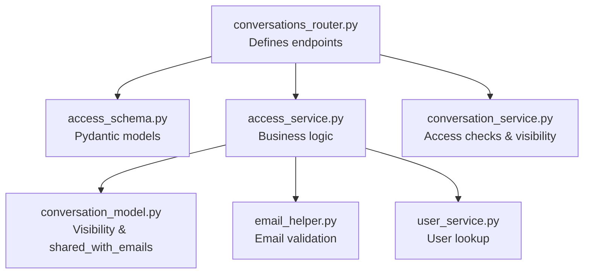
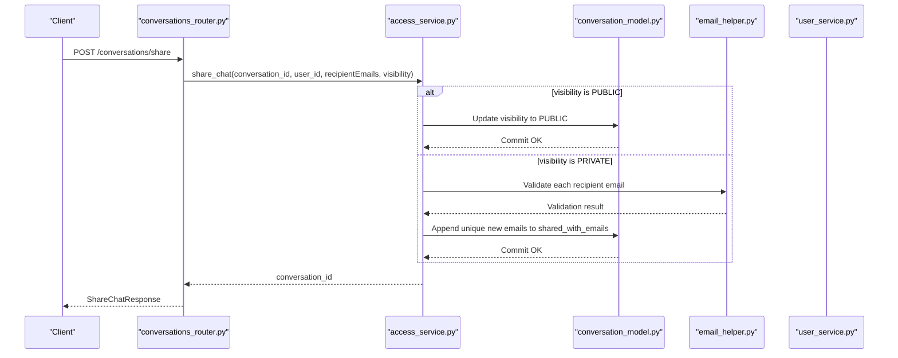
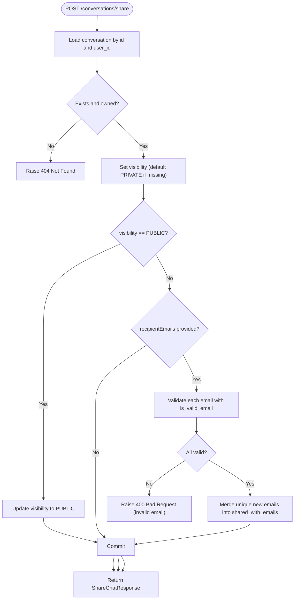
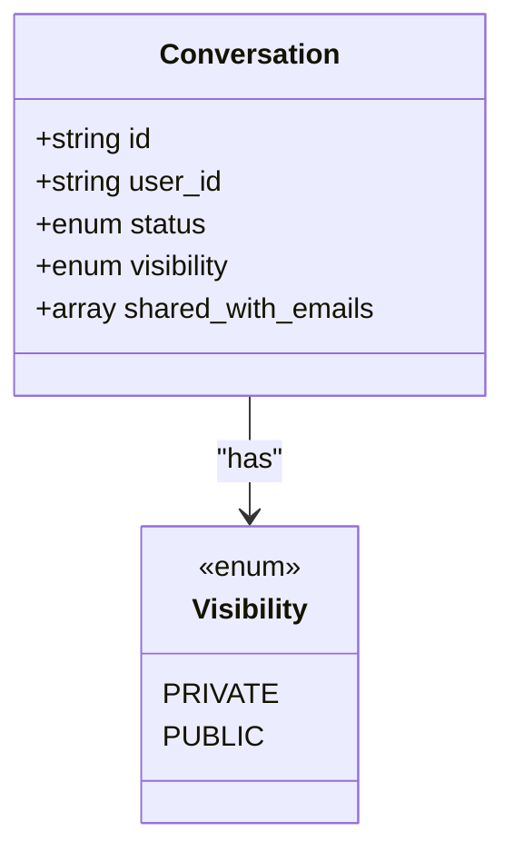
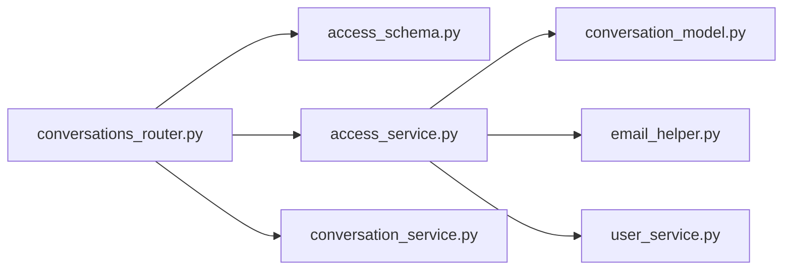

# Sharing & Access Control

<cite>
**Referenced Files in This Document**
- [conversations_router.py](file://app/modules/conversations/conversations_router.py)
- [access_schema.py](file://app/modules/conversations/access/access_schema.py)
- [access_service.py](file://app/modules/conversations/access/access_service.py)
- [conversation_model.py](file://app/modules/conversations/conversation/conversation_model.py)
- [conversation_schema.py](file://app/modules/conversations/conversation/conversation_schema.py)
- [conversation_service.py](file://app/modules/conversations/conversation/conversation_service.py)
- [email_helper.py](file://app/modules/utils/email_helper.py)
- [user_service.py](file://app/modules/users/user_service.py)
</cite>

## Table of Contents
1. [Introduction](#introduction)
2. [Project Structure](#project-structure)
3. [Core Components](#core-components)
4. [Architecture Overview](#architecture-overview)
5. [Detailed Component Analysis](#detailed-component-analysis)
6. [Dependency Analysis](#dependency-analysis)
7. [Performance Considerations](#performance-considerations)
8. [Troubleshooting Guide](#troubleshooting-guide)
9. [Conclusion](#conclusion)

## Introduction
This document provides comprehensive API documentation for conversation sharing and access control endpoints. It covers:
- Sharing conversations via visibility settings and recipient email lists
- Retrieving shared emails for a conversation
- Removing access for specific recipients
- Request/response schemas, validation rules, and permission management
- Visibility modes, access revocation workflows, and collaborative patterns
- Security considerations, access validation, and error handling

## Project Structure
The sharing and access control features are implemented within the conversations module:
- Router endpoints define the HTTP surface
- Access schemas describe request/response models
- Access service encapsulates business logic and validation
- Conversation model defines visibility and shared email storage
- Conversation service enforces access control and visibility rules
- Utility and user services support email validation and user resolution

**Diagram sources**
- [conversations_router.py](file://app/modules/conversations/conversations_router.py#L569-L622)
- [access_schema.py](file://app/modules/conversations/access/access_schema.py#L8-L25)
- [access_service.py](file://app/modules/conversations/access/access_service.py#L18-L133)
- [conversation_model.py](file://app/modules/conversations/conversation/conversation_model.py#L18-L47)
- [conversation_service.py](file://app/modules/conversations/conversation/conversation_service.py#L166-L215)
- [email_helper.py](file://app/modules/utils/email_helper.py#L81-L84)
- [user_service.py](file://app/modules/users/user_service.py#L122-L167)

**Section sources**
- [conversations_router.py](file://app/modules/conversations/conversations_router.py#L569-L622)
- [access_schema.py](file://app/modules/conversations/access/access_schema.py#L8-L25)
- [access_service.py](file://app/modules/conversations/access/access_service.py#L18-L133)
- [conversation_model.py](file://app/modules/conversations/conversation/conversation_model.py#L18-L47)
- [conversation_service.py](file://app/modules/conversations/conversation/conversation_service.py#L166-L215)
- [email_helper.py](file://app/modules/utils/email_helper.py#L81-L84)
- [user_service.py](file://app/modules/users/user_service.py#L122-L167)

## Core Components
- Endpoint: POST /conversations/share
  - Purpose: Share a conversation by setting visibility and optionally adding recipients
  - Authentication: Requires a valid user session
  - Request: ShareChatRequest
  - Response: ShareChatResponse
  - Validation: Recipient emails are validated; visibility defaults to private if unspecified

- Endpoint: GET /conversations/{conversation_id}/shared-emails
  - Purpose: Retrieve the list of emails that currently have access
  - Authentication: Requires a valid user session
  - Response: Array of strings (emails)

- Endpoint: DELETE /conversations/{conversation_id}/access
  - Purpose: Remove access for specified recipient emails
  - Authentication: Requires a valid user session
  - Request: RemoveAccessRequest
  - Response: Generic success message

Key schemas:
- ShareChatRequest: conversation_id, recipientEmails (optional), visibility
- ShareChatResponse: message, sharedID
- RemoveAccessRequest: emails (array of emails)

Visibility and storage:
- Conversation model supports PRIVATE and PUBLIC visibility
- PRIVATE conversations maintain a shared_with_emails array for granular access

Access control enforcement:
- Conversation service determines access type based on ownership, visibility, and shared emails
- READ vs WRITE distinction applies to collaborators and owners

**Section sources**
- [conversations_router.py](file://app/modules/conversations/conversations_router.py#L569-L622)
- [access_schema.py](file://app/modules/conversations/access/access_schema.py#L8-L25)
- [access_service.py](file://app/modules/conversations/access/access_service.py#L22-L133)
- [conversation_model.py](file://app/modules/conversations/conversation/conversation_model.py#L18-L47)
- [conversation_service.py](file://app/modules/conversations/conversation/conversation_service.py#L166-L215)

## Architecture Overview
The sharing workflow integrates router, service, model, and validation layers.

**Diagram sources**
- [conversations_router.py](file://app/modules/conversations/conversations_router.py#L569-L588)
- [access_service.py](file://app/modules/conversations/access/access_service.py#L22-L79)
- [conversation_model.py](file://app/modules/conversations/conversation/conversation_model.py#L46-L47)
- [email_helper.py](file://app/modules/utils/email_helper.py#L81-L84)
- [user_service.py](file://app/modules/users/user_service.py#L154-L167)

## Detailed Component Analysis

### Endpoint: POST /conversations/share
- Method: POST
- URL: /conversations/share
- Authentication: Depends on AuthService.check_auth
- Request schema: ShareChatRequest
  - Fields:
    - conversation_id: string
    - recipientEmails: optional array of emails
    - visibility: enum (PRIVATE or PUBLIC)
- Response schema: ShareChatResponse
  - Fields:
    - message: string
    - sharedID: string (conversation_id)
- Behavior:
  - Validates that the conversation belongs to the current user
  - Defaults visibility to PRIVATE if not provided
  - For PUBLIC visibility: updates visibility and returns immediately
  - For PRIVATE visibility:
    - Validates each recipient email using is_valid_email
    - Merges unique new emails into shared_with_emails
    - Commits changes
- Errors:
  - 404 if conversation not found or unauthorized
  - 400 for invalid email(s)
  - Database integrity errors wrapped as ShareChatServiceError

**Diagram sources**
- [access_service.py](file://app/modules/conversations/access/access_service.py#L22-L79)
- [email_helper.py](file://app/modules/utils/email_helper.py#L81-L84)

**Section sources**
- [conversations_router.py](file://app/modules/conversations/conversations_router.py#L569-L588)
- [access_schema.py](file://app/modules/conversations/access/access_schema.py#L8-L17)
- [access_service.py](file://app/modules/conversations/access/access_service.py#L22-L79)
- [email_helper.py](file://app/modules/utils/email_helper.py#L81-L84)

### Endpoint: GET /conversations/{conversation_id}/shared-emails
- Method: GET
- URL: /conversations/{conversation_id}/shared-emails
- Authentication: Depends on AuthService.check_auth
- Response: Array of strings (emails)
- Behavior:
  - Confirms ownership of the conversation
  - Returns shared_with_emails or empty array
- Errors:
  - 404 if conversation not found or unauthorized

**Section sources**
- [conversations_router.py](file://app/modules/conversations/conversations_router.py#L591-L600)
- [access_service.py](file://app/modules/conversations/access/access_service.py#L80-L91)

### Endpoint: DELETE /conversations/{conversation_id}/access
- Method: DELETE
- URL: /conversations/{conversation_id}/access
- Authentication: Depends on AuthService.check_auth
- Request schema: RemoveAccessRequest
  - Fields:
    - emails: array of emails
- Behavior:
  - Confirms ownership of the conversation
  - Ensures conversation has shared access
  - Validates that at least one requested email has access
  - Removes specified emails from shared_with_emails
  - Commits changes
- Errors:
  - 404 if conversation not found or unauthorized
  - 400 if no shared access exists or none of the specified emails have access

**Section sources**
- [conversations_router.py](file://app/modules/conversations/conversations_router.py#L603-L622)
- [access_schema.py](file://app/modules/conversations/access/access_schema.py#L23-L25)
- [access_service.py](file://app/modules/conversations/access/access_service.py#L93-L133)

### Visibility Settings and Permission Management
- Visibility enum:
  - PRIVATE: Access controlled via shared_with_emails
  - PUBLIC: Read access granted to anyone who can reach the resource
- Access determination logic:
  - Owner always has WRITE access
  - PUBLIC grants READ access
  - PRIVATE checks shared_with_emails against resolved user IDs
- Collaborative workflow:
  - PRIVATE sharing allows fine-grained collaboration by email
  - PUBLIC sharing broadens access without per-email management
  - Removal of access is supported via DELETE /access

**Diagram sources**
- [conversation_model.py](file://app/modules/conversations/conversation/conversation_model.py#L18-L47)

**Section sources**
- [conversation_model.py](file://app/modules/conversations/conversation/conversation_model.py#L18-L47)
- [conversation_service.py](file://app/modules/conversations/conversation/conversation_service.py#L166-L215)

### Access Control Enforcement
- Access checks evaluate:
  - Ownership (creator has WRITE)
  - Visibility (PUBLIC grants READ)
  - Shared emails (READ for matched recipients)
- Errors surfaced as:
  - 403 for insufficient access
  - 401 for access type not found
  - 404 for not found

**Section sources**
- [conversation_service.py](file://app/modules/conversations/conversation/conversation_service.py#L166-L215)

### Email Validation and User Resolution
- Email validation:
  - Uses is_valid_email for basic format validation
- User resolution:
  - Resolves user IDs from emails for shared access checks
  - Supports fallback to Firebase user ID when provided

**Section sources**
- [email_helper.py](file://app/modules/utils/email_helper.py#L81-L84)
- [user_service.py](file://app/modules/users/user_service.py#L122-L167)
- [conversation_service.py](file://app/modules/conversations/conversation/conversation_service.py#L166-L215)

## Dependency Analysis
The sharing endpoints depend on:
- Router for endpoint definition and request binding
- Access schemas for request/response validation
- Access service for business logic and persistence
- Conversation model for visibility and shared emails
- Conversation service for access control decisions
- Email helper for email validation
- User service for user ID resolution

**Diagram sources**
- [conversations_router.py](file://app/modules/conversations/conversations_router.py#L569-L622)
- [access_schema.py](file://app/modules/conversations/access/access_schema.py#L8-L25)
- [access_service.py](file://app/modules/conversations/access/access_service.py#L18-L133)
- [conversation_model.py](file://app/modules/conversations/conversation/conversation_model.py#L18-L47)
- [conversation_service.py](file://app/modules/conversations/conversation/conversation_service.py#L166-L215)
- [email_helper.py](file://app/modules/utils/email_helper.py#L81-L84)
- [user_service.py](file://app/modules/users/user_service.py#L122-L167)

**Section sources**
- [conversations_router.py](file://app/modules/conversations/conversations_router.py#L569-L622)
- [access_schema.py](file://app/modules/conversations/access/access_schema.py#L8-L25)
- [access_service.py](file://app/modules/conversations/access/access_service.py#L18-L133)
- [conversation_model.py](file://app/modules/conversations/conversation/conversation_model.py#L18-L47)
- [conversation_service.py](file://app/modules/conversations/conversation/conversation_service.py#L166-L215)
- [email_helper.py](file://app/modules/utils/email_helper.py#L81-L84)
- [user_service.py](file://app/modules/users/user_service.py#L122-L167)

## Performance Considerations
- Email validation occurs per recipient; batch large lists carefully
- Shared email updates merge arrays; ensure recipient lists are deduplicated before calling
- Access checks rely on user ID resolution; caching user IDs by email can reduce repeated lookups
- PUBLIC visibility eliminates per-user checks for read access

## Troubleshooting Guide
Common issues and resolutions:
- Invalid email format
  - Symptom: 400 error mentioning invalid email
  - Cause: Email validation failure
  - Resolution: Ensure emails conform to standard format

- Attempt to remove access when none exists
  - Symptom: 400 error stating no shared access to remove
  - Cause: Conversation has no shared_with_emails
  - Resolution: Verify shared emails exist before removal

- Attempt to remove emails that do not have access
  - Symptom: 400 error stating none of the specified emails have access
  - Cause: Requested emails are not in shared_with_emails
  - Resolution: Confirm access list via GET /shared-emails

- Conversation not found or unauthorized
  - Symptom: 404 error
  - Cause: Caller does not own the conversation or it does not exist
  - Resolution: Verify conversation ownership and existence

- Access denied for read/write operations
  - Symptom: 403 or 401 errors
  - Cause: Insufficient permissions (not owner, not shared, or visibility restrictions)
  - Resolution: Adjust visibility or share with the correct emails

**Section sources**
- [access_service.py](file://app/modules/conversations/access/access_service.py#L53-L57)
- [access_service.py](file://app/modules/conversations/access/access_service.py#L108-L118)
- [conversation_service.py](file://app/modules/conversations/conversation/conversation_service.py#L166-L215)

## Conclusion
The sharing and access control endpoints provide a flexible mechanism for managing conversation visibility and collaborator access. PRIVATE visibility with shared emails enables precise collaboration, while PUBLIC visibility simplifies broad access. Robust validation and access checks ensure secure and predictable behavior. Proper use of these endpoints supports collaborative workflows with clear permission boundaries and straightforward revocation procedures.