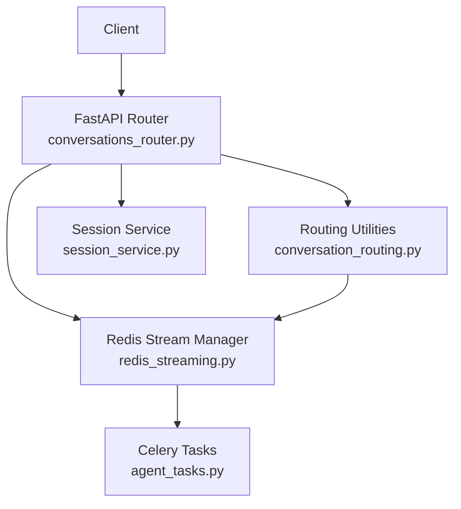
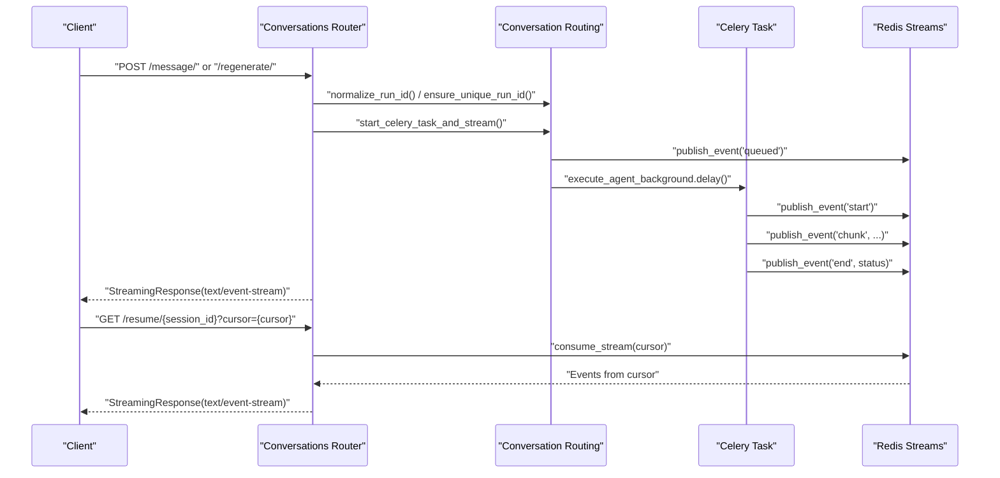
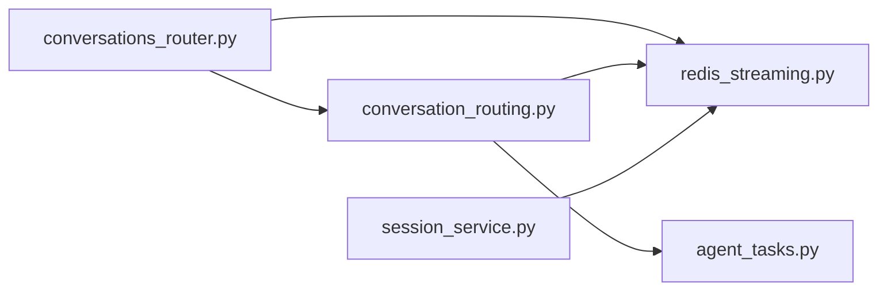

# Streaming API

<cite>
**Referenced Files in This Document**
- [conversations_router.py](file://app/modules/conversations/conversations_router.py)
- [redis_streaming.py](file://app/modules/conversations/utils/redis_streaming.py)
- [conversation_routing.py](file://app/modules/conversations/utils/conversation_routing.py)
- [agent_tasks.py](file://app/celery/tasks/agent_tasks.py)
- [session_service.py](file://app/modules/conversations/session/session_service.py)
- [conversation_schema.py](file://app/modules/conversations/conversation/conversation_schema.py)
- [config_provider.py](file://app/core/config_provider.py)
- [test_conversations_router.py](file://tests/integration-tests/conversations/test_conversations_router.py)
</cite>

## Table of Contents
1. [Introduction](#introduction)
2. [Project Structure](#project-structure)
3. [Core Components](#core-components)
4. [Architecture Overview](#architecture-overview)
5. [Detailed Component Analysis](#detailed-component-analysis)
6. [Dependency Analysis](#dependency-analysis)
7. [Performance Considerations](#performance-considerations)
8. [Troubleshooting Guide](#troubleshooting-guide)
9. [Conclusion](#conclusion)

## Introduction
This document provides comprehensive API documentation for real-time streaming endpoints that power conversation generation, regeneration, and session resumption. It covers WebSocket/SSE connection patterns, URL patterns, streaming response formats, event types, message formats, and cursor-based pagination. It also documents session management, run ID generation, deterministic session handling, and Redis-based streaming implementation details, including task queuing and background processing integration.

## Project Structure
The streaming endpoints are implemented within the conversations module and integrate with Redis for streaming and Celery for background task execution. Key components include:
- FastAPI router endpoints for message generation, regeneration, and session resumption
- Redis stream manager for event publishing and consumption
- Conversation routing utilities for session management and run ID normalization
- Celery tasks for background processing and streaming publication
- Session service for active session and task status queries

**Diagram sources**
- [conversations_router.py](file://app/modules/conversations/conversations_router.py#L160-L566)
- [conversation_routing.py](file://app/modules/conversations/utils/conversation_routing.py#L61-L170)
- [redis_streaming.py](file://app/modules/conversations/utils/redis_streaming.py#L11-L248)
- [agent_tasks.py](file://app/celery/tasks/agent_tasks.py#L11-L460)
- [session_service.py](file://app/modules/conversations/session/session_service.py#L15-L164)

**Section sources**
- [conversations_router.py](file://app/modules/conversations/conversations_router.py#L1-L622)
- [redis_streaming.py](file://app/modules/conversations/utils/redis_streaming.py#L1-L248)
- [conversation_routing.py](file://app/modules/conversations/utils/conversation_routing.py#L1-L324)
- [agent_tasks.py](file://app/celery/tasks/agent_tasks.py#L1-L460)
- [session_service.py](file://app/modules/conversations/session/session_service.py#L1-L164)

## Core Components
- Streaming endpoints:
  - POST /conversations/{conversation_id}/message/
  - POST /conversations/{conversation_id}/regenerate/
  - POST /conversations/{conversation_id}/resume/{session_id}
- Session management endpoints:
  - GET /conversations/{conversation_id}/active-session
  - GET /conversations/{conversation_id}/task-status
- Redis-backed streaming with SSE-like semantics using Redis XREAD/XADD/XREVRANGE/XRANGE
- Deterministic run ID generation and unique session handling
- Cursor-based pagination for resuming streams
- Task status and cancellation signaling via Redis keys

**Section sources**
- [conversations_router.py](file://app/modules/conversations/conversations_router.py#L160-L566)
- [conversation_schema.py](file://app/modules/conversations/conversation/conversation_schema.py#L54-L93)
- [redis_streaming.py](file://app/modules/conversations/utils/redis_streaming.py#L11-L248)

## Architecture Overview
The streaming architecture combines FastAPI endpoints, Redis streams, and Celery workers:
- Clients connect via SSE-like streaming responses
- Endpoints start Celery tasks and immediately return a streaming response bound to a Redis stream
- Celery tasks publish events to Redis streams as they process
- Clients consume events and can resume from a cursor

**Diagram sources**
- [conversations_router.py](file://app/modules/conversations/conversations_router.py#L160-L417)
- [conversation_routing.py](file://app/modules/conversations/utils/conversation_routing.py#L61-L170)
- [redis_streaming.py](file://app/modules/conversations/utils/redis_streaming.py#L64-L150)
- [agent_tasks.py](file://app/celery/tasks/agent_tasks.py#L11-L246)

## Detailed Component Analysis

### Endpoint: POST /conversations/{conversation_id}/message/
- Purpose: Submit a user message to generate a streaming response
- Query parameters:
  - stream: bool, default true
  - session_id: optional string for deterministic session handling
  - prev_human_message_id: optional string to derive deterministic run ID
  - cursor: optional Redis stream ID for resuming
- Form fields:
  - content: string
  - node_ids: optional JSON-encoded list of node contexts
  - images: optional multipart files
- Behavior:
  - Validates content
  - Normalizes/ensures unique run ID
  - Starts Celery background task and returns SSE-like streaming response
  - Uses Redis stream generator to emit events

Event types emitted by Celery task:
- queued: initial queued status event
- start: processing started
- chunk: incremental content updates with message, citations, tool_calls
- end: completion, error, or cancellation

Cursor-based pagination:
- Fresh requests start from the latest event ID
- Resuming requests use provided cursor to replay events and then switch to live

**Section sources**
- [conversations_router.py](file://app/modules/conversations/conversations_router.py#L160-L286)
- [conversation_routing.py](file://app/modules/conversations/utils/conversation_routing.py#L61-L170)
- [agent_tasks.py](file://app/celery/tasks/agent_tasks.py#L11-L246)
- [redis_streaming.py](file://app/modules/conversations/utils/redis_streaming.py#L64-L150)

### Endpoint: POST /conversations/{conversation_id}/regenerate/
- Purpose: Regenerate the last AI-generated message with streaming
- Query parameters:
  - stream: bool, default true
  - session_id: optional string for deterministic session handling
  - prev_human_message_id: optional string to derive deterministic run ID
  - cursor: optional Redis stream ID for resuming
  - background: bool, default true
- Request body:
  - node_ids: optional list of node contexts
- Behavior:
  - Validates usage limits
  - Normalizes/ensures unique run ID
  - Sets initial task status to "queued"
  - Publishes queued event
  - Starts Celery background regenerate task
  - Returns SSE-like streaming response

Event types emitted by Celery regenerate task:
- queued: initial queued status event
- start: processing started
- chunk: incremental content updates with message, citations, tool_calls
- end: completion, error, or cancellation

**Section sources**
- [conversations_router.py](file://app/modules/conversations/conversations_router.py#L288-L417)
- [agent_tasks.py](file://app/celery/tasks/agent_tasks.py#L249-L460)
- [redis_streaming.py](file://app/modules/conversations/utils/redis_streaming.py#L64-L150)

### Endpoint: POST /conversations/{conversation_id}/resume/{session_id}
- Purpose: Resume streaming from an existing session at a given cursor
- Query parameters:
  - cursor: optional Redis stream ID, defaults to "0-0"
- Behavior:
  - Verifies access to conversation
  - Checks Redis stream existence
  - Returns SSE-like streaming response starting from cursor

Connection handling:
- If stream does not exist, returns 404
- If stream expires, emits an end event with status "expired"
- If task does not start within timeout, emits an end event with status "timeout"

**Section sources**
- [conversations_router.py](file://app/modules/conversations/conversations_router.py#L520-L566)
- [redis_streaming.py](file://app/modules/conversations/utils/redis_streaming.py#L64-L150)

### Session Management Endpoints
- GET /conversations/{conversation_id}/active-session
  - Returns active session info including sessionId, status, cursor, timestamps
  - Status values: "active", "idle", "completed"
- GET /conversations/{conversation_id}/task-status
  - Returns task status including isActive flag and estimated completion timestamp

Run ID generation and deterministic session handling:
- normalize_run_id: creates deterministic run ID scoped to user and previous human message
- ensure_unique_run_id: ensures uniqueness by appending counters if stream already exists

**Section sources**
- [conversations_router.py](file://app/modules/conversations/conversations_router.py#L460-L518)
- [session_service.py](file://app/modules/conversations/session/session_service.py#L23-L164)
- [conversation_routing.py](file://app/modules/conversations/utils/conversation_routing.py#L23-L58)

### Redis-Based Streaming Implementation
Redis stream key format:
- chat:stream:{conversation_id}:{run_id}

Key-value metadata stored in Redis:
- task:status:{conversation_id}:{run_id}: task status ("queued", "running", "completed", "error", "cancelled")
- task:id:{conversation_id}:{run_id}: Celery task ID
- cancel:{conversation_id}:{run_id}: cancellation signal

Consumption logic:
- Fresh requests: start from latest event ID to avoid replaying old messages
- Resuming requests: use provided cursor to replay events, then switch to live
- TTL and max length controls: configurable via environment variables

**Section sources**
- [redis_streaming.py](file://app/modules/conversations/utils/redis_streaming.py#L11-L248)
- [config_provider.py](file://app/core/config_provider.py#L207-L217)

### Streaming Protocols and Event Formats
Protocol:
- SSE-like streaming response with text/event-stream media type
- Each event is a JSON object with a "type" field indicating event category

Event categories:
- queued: initial status event with empty message, citations, tool_calls
- start: processing started with agent_id and status
- chunk: incremental content updates with:
  - message: string
  - citations: array of strings
  - tool_calls: array of tool call objects
- end: completion, error, or cancellation with:
  - status: "completed", "error", "cancelled", "expired", "timeout"
  - message: human-readable status message
  - stream_id: final Redis stream ID

Progress indicators and completion signals:
- Progress: incremental chunks delivered as they become available
- Completion: final "end" event with "completed" status
- Errors: "end" event with "error" status and message
- Cancellations: "end" event with "cancelled" status

**Section sources**
- [conversation_schema.py](file://app/modules/conversations/conversation/conversation_schema.py#L54-L93)
- [redis_streaming.py](file://app/modules/conversations/utils/redis_streaming.py#L64-L150)
- [agent_tasks.py](file://app/celery/tasks/agent_tasks.py#L11-L246)

### Connection Handling, Reconnection Strategies, and Session Persistence
Reconnection strategies:
- Clients should pass cursor from the last received event ID
- For fresh connections without cursor, server starts from latest event ID
- If stream creation times out, server emits an "end" event with "timeout" status

Session persistence:
- Redis TTL controls stream lifetime
- Max stream length prevents unbounded growth
- Task status keys enable health checks and task lifecycle management

Cancellation:
- Clients can set a cancellation signal via Redis key
- Workers periodically check for cancellation and flush partial buffers before ending

**Section sources**
- [redis_streaming.py](file://app/modules/conversations/utils/redis_streaming.py#L64-L150)
- [agent_tasks.py](file://app/celery/tasks/agent_tasks.py#L131-L162)

### Background Processing Integration
Task queuing:
- Initial task status set to "queued"
- Queued event published to inform clients
- Celery task started asynchronously

Task lifecycle:
- Running: processing started
- Completed: successful completion
- Error: failure with exception details
- Cancelled: user-initiated cancellation

Task status and task ID storage:
- Redis keys track task status and Celery task ID for revocation

**Section sources**
- [conversation_routing.py](file://app/modules/conversations/utils/conversation_routing.py#L107-L170)
- [redis_streaming.py](file://app/modules/conversations/utils/redis_streaming.py#L188-L210)
- [agent_tasks.py](file://app/celery/tasks/agent_tasks.py#L11-L246)

## Dependency Analysis
The streaming system exhibits clear separation of concerns:
- Router depends on routing utilities and Redis manager
- Routing utilities depend on Redis manager and Celery tasks
- Celery tasks depend on Redis manager and conversation services
- Session service depends on Redis manager for health checks

**Diagram sources**
- [conversations_router.py](file://app/modules/conversations/conversations_router.py#L1-L622)
- [conversation_routing.py](file://app/modules/conversations/utils/conversation_routing.py#L1-L324)
- [redis_streaming.py](file://app/modules/conversations/utils/redis_streaming.py#L1-L248)
- [agent_tasks.py](file://app/celery/tasks/agent_tasks.py#L1-L460)
- [session_service.py](file://app/modules/conversations/session/session_service.py#L1-L164)

**Section sources**
- [conversations_router.py](file://app/modules/conversations/conversations_router.py#L1-L622)
- [conversation_routing.py](file://app/modules/conversations/utils/conversation_routing.py#L1-L324)
- [redis_streaming.py](file://app/modules/conversations/utils/redis_streaming.py#L1-L248)
- [agent_tasks.py](file://app/celery/tasks/agent_tasks.py#L1-L460)
- [session_service.py](file://app/modules/conversations/session/session_service.py#L1-L164)

## Performance Considerations
- Redis stream TTL and max length prevent memory leaks and ensure timely cleanup
- Blocking reads with timeouts balance responsiveness and resource usage
- Thread pool usage for non-streaming waits prevents event loop blocking
- Cursor-based pagination minimizes replay overhead for resumed sessions

[No sources needed since this section provides general guidance]

## Troubleshooting Guide
Common issues and resolutions:
- Stream creation timeout: server emits an "end" event with "timeout" status; retry with cursor or wait for task to start
- Stream expired: server emits an "end" event with "expired" status; start a new session
- Task error: server emits an "end" event with "error" status and message; inspect logs for details
- Task cancellation: server emits an "end" event with "cancelled" status; verify cancellation signal key
- Session not found: resume endpoint returns 404 when stream does not exist; ensure correct conversation_id and session_id

**Section sources**
- [redis_streaming.py](file://app/modules/conversations/utils/redis_streaming.py#L91-L150)
- [conversations_router.py](file://app/modules/conversations/conversations_router.py#L520-L566)

## Conclusion
The streaming API provides robust, scalable real-time conversation generation with deterministic session handling, cursor-based pagination, and comprehensive error signaling. The Redis-based streaming model, combined with Celery background processing, delivers responsive user experiences while maintaining reliability and observability.