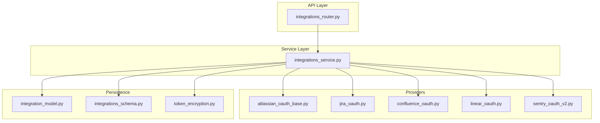
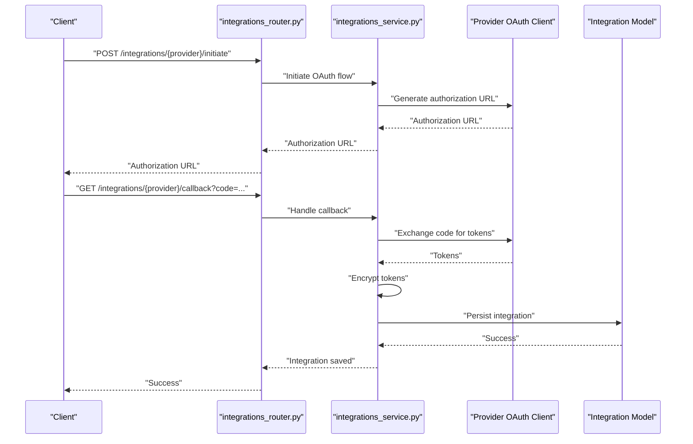
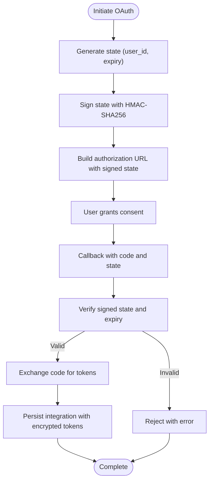
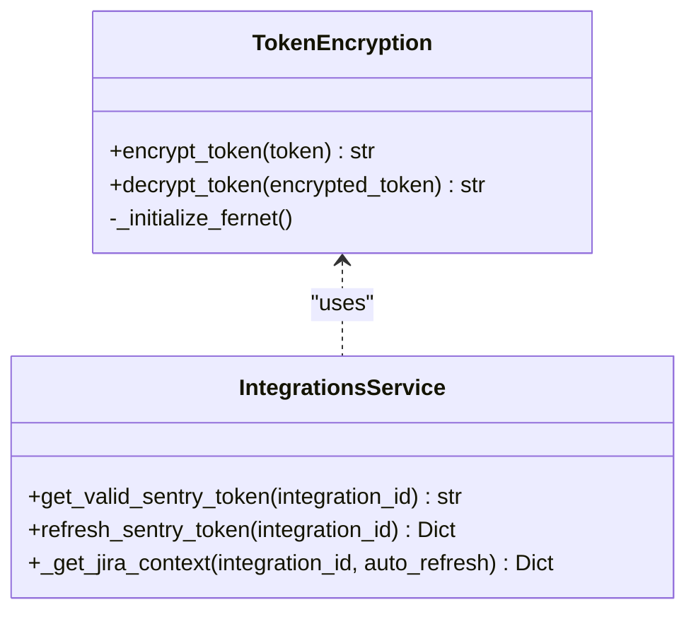
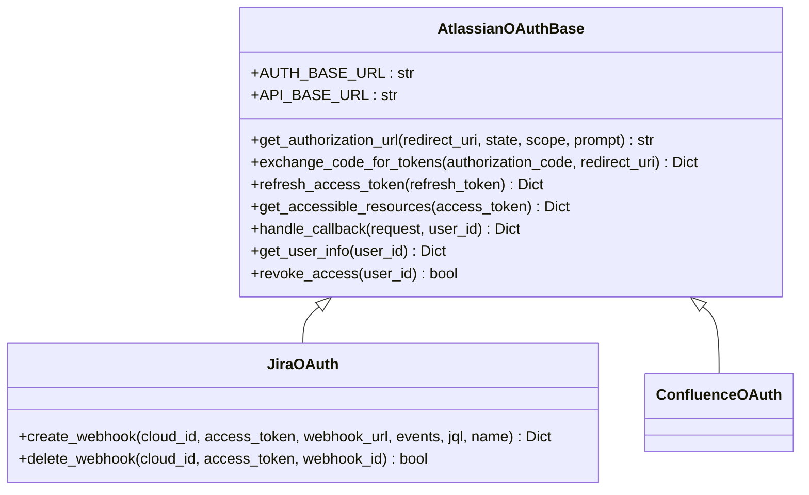
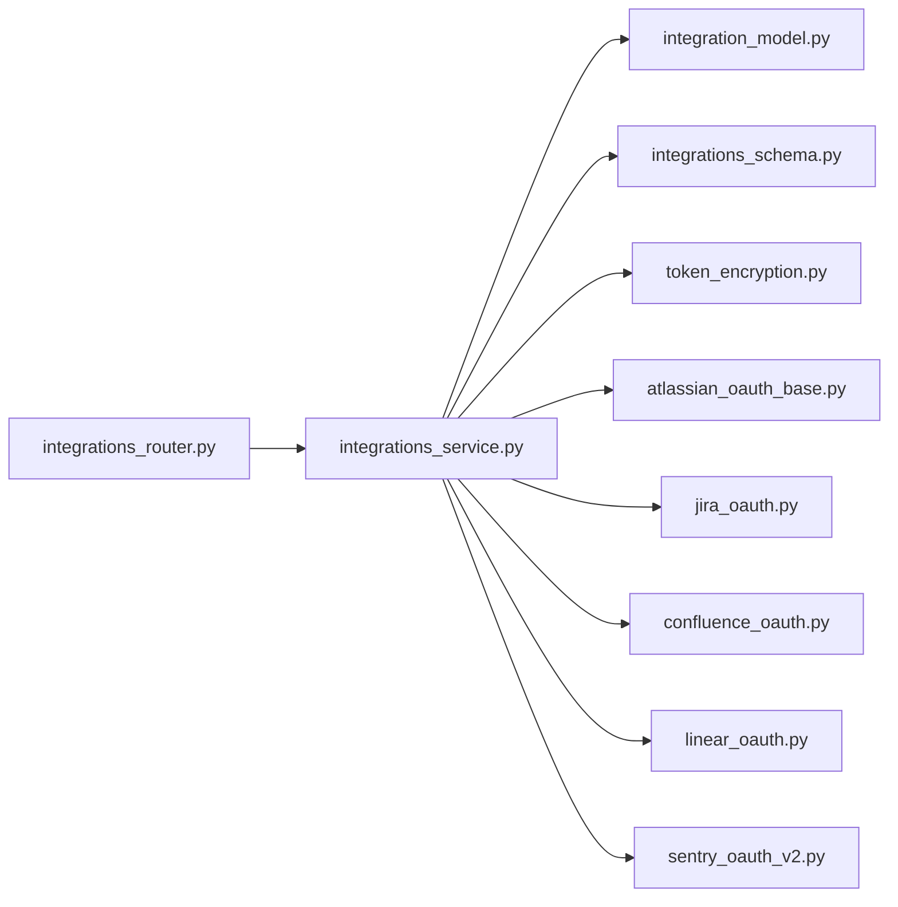

# Integrations API

<cite>
**Referenced Files in This Document**
- [integrations_router.py](file://app/modules/integrations/integrations_router.py)
- [integrations_schema.py](file://app/modules/integrations/integrations_schema.py)
- [integrations_service.py](file://app/modules/integrations/integrations_service.py)
- [integration_model.py](file://app/modules/integrations/integration_model.py)
- [token_encryption.py](file://app/modules/integrations/token_encryption.py)
- [atlassian_oauth_base.py](file://app/modules/integrations/atlassian_oauth_base.py)
- [jira_oauth.py](file://app/modules/integrations/jira_oauth.py)
- [confluence_oauth.py](file://app/modules/integrations/confluence_oauth.py)
- [linear_oauth.py](file://app/modules/integrations/linear_oauth.py)
- [sentry_oauth_v2.py](file://app/modules/integrations/sentry_oauth_v2.py)
</cite>

## Table of Contents
1. [Introduction](#introduction)
2. [Project Structure](#project-structure)
3. [Core Components](#core-components)
4. [Architecture Overview](#architecture-overview)
5. [Detailed Component Analysis](#detailed-component-analysis)
6. [Dependency Analysis](#dependency-analysis)
7. [Performance Considerations](#performance-considerations)
8. [Troubleshooting Guide](#troubleshooting-guide)
9. [Conclusion](#conclusion)
10. [Appendices](#appendices)

## Introduction
This document provides comprehensive API documentation for Potpie’s external service integration system. It covers OAuth flows for GitHub, Jira, Confluence, Linear, and Sentry, along with integration management endpoints, token storage, credential encryption, configuration, status monitoring, error handling, and troubleshooting guidance. The system supports both legacy and schema-driven endpoints, enabling robust integration lifecycle management.

## Project Structure
The integrations module is organized around:
- Router: Exposes HTTP endpoints under /integrations
- Service: Orchestrates OAuth flows, token exchange, persistence, and API calls
- Providers: OAuth clients for each platform (Atlassian base, Linear, Sentry)
- Models and Schemas: Database model and Pydantic schemas for integration data
- Encryption: Secure token storage utilities

**Diagram sources**
- [integrations_router.py](file://app/modules/integrations/integrations_router.py#L1-L2584)
- [integrations_service.py](file://app/modules/integrations/integrations_service.py#L1-L2665)
- [integration_model.py](file://app/modules/integrations/integration_model.py#L1-L44)
- [integrations_schema.py](file://app/modules/integrations/integrations_schema.py#L1-L428)
- [token_encryption.py](file://app/modules/integrations/token_encryption.py#L1-L108)
- [atlassian_oauth_base.py](file://app/modules/integrations/atlassian_oauth_base.py#L1-L383)
- [jira_oauth.py](file://app/modules/integrations/jira_oauth.py#L1-L149)
- [confluence_oauth.py](file://app/modules/integrations/confluence_oauth.py#L1-L82)
- [linear_oauth.py](file://app/modules/integrations/linear_oauth.py#L1-L264)
- [sentry_oauth_v2.py](file://app/modules/integrations/sentry_oauth_v2.py#L1-L268)

**Section sources**
- [integrations_router.py](file://app/modules/integrations/integrations_router.py#L1-L2584)
- [integrations_service.py](file://app/modules/integrations/integrations_service.py#L1-L2665)
- [integration_model.py](file://app/modules/integrations/integration_model.py#L1-L44)
- [integrations_schema.py](file://app/modules/integrations/integrations_schema.py#L1-L428)
- [token_encryption.py](file://app/modules/integrations/token_encryption.py#L1-L108)
- [atlassian_oauth_base.py](file://app/modules/integrations/atlassian_oauth_base.py#L1-L383)
- [jira_oauth.py](file://app/modules/integrations/jira_oauth.py#L1-L149)
- [confluence_oauth.py](file://app/modules/integrations/confluence_oauth.py#L1-L82)
- [linear_oauth.py](file://app/modules/integrations/linear_oauth.py#L1-L264)
- [sentry_oauth_v2.py](file://app/modules/integrations/sentry_oauth_v2.py#L1-L268)

## Core Components
- Router: Defines endpoints for OAuth initiation, callbacks, status checks, revocation, and integration management (both legacy and schema-based).
- Service: Implements business logic for OAuth token exchange, encryption/decryption, Atlassian resource discovery, webhook registration (Jira), and integration CRUD operations.
- Providers: Platform-specific OAuth clients (Atlassian base, Linear, Sentry) encapsulate provider-specific flows and endpoints.
- Models and Schemas: SQLAlchemy Integration model and Pydantic schemas define persisted data structures and request/response formats.
- Encryption: Utilities to securely store tokens using symmetric encryption.

**Section sources**
- [integrations_router.py](file://app/modules/integrations/integrations_router.py#L1-L2584)
- [integrations_service.py](file://app/modules/integrations/integrations_service.py#L1-L2665)
- [integration_model.py](file://app/modules/integrations/integration_model.py#L1-L44)
- [integrations_schema.py](file://app/modules/integrations/integrations_schema.py#L1-L428)
- [token_encryption.py](file://app/modules/integrations/token_encryption.py#L1-L108)

## Architecture Overview
The system follows a layered architecture:
- API Router exposes endpoints grouped by provider and integration management.
- Service layer coordinates OAuth flows, token exchange, and persistence.
- Provider clients encapsulate provider-specific OAuth logic and API calls.
- Persistence stores integration records with encrypted tokens.
- Encryption utilities protect sensitive token data.

**Diagram sources**
- [integrations_router.py](file://app/modules/integrations/integrations_router.py#L180-L383)
- [integrations_service.py](file://app/modules/integrations/integrations_service.py#L595-L788)
- [jira_oauth.py](file://app/modules/integrations/jira_oauth.py#L12-L31)
- [linear_oauth.py](file://app/modules/integrations/linear_oauth.py#L65-L88)
- [sentry_oauth_v2.py](file://app/modules/integrations/sentry_oauth_v2.py#L66-L123)
- [integration_model.py](file://app/modules/integrations/integration_model.py#L7-L44)

## Detailed Component Analysis

### Sentry Integration
- OAuth Initiation: POST /integrations/sentry/initiate with redirect_uri and optional state.
- Callback Handling: GET /integrations/sentry/callback validates signed state and exchanges code for tokens.
- Status Endpoint: GET /integrations/sentry/status/{user_id} checks connection status.
- Revocation: DELETE /integrations/sentry/revoke/{user_id} removes cached tokens.
- Direct Authorize: GET /integrations/sentry/authorize redirects to Sentry OAuth.
- Webhook Redirect Logging: GET /integrations/sentry/redirect logs webhook requests.

Request/Response Schemas
- OAuthInitiateRequest: redirect_uri, state
- OAuthStatusResponse: status, message, user_id
- SentryIntegrationStatus: user_id, is_connected, scope, expires_at
- SentrySaveRequest: code, redirect_uri, instance_name, integration_type, timestamp
- SentrySaveResponse: success, data, error

Security and Token Storage
- Tokens are exchanged server-side and stored encrypted using TokenEncryption utilities.
- Signed state mechanism protects against tampering.

**Section sources**
- [integrations_router.py](file://app/modules/integrations/integrations_router.py#L180-L383)
- [integrations_schema.py](file://app/modules/integrations/integrations_schema.py#L144-L233)
- [sentry_oauth_v2.py](file://app/modules/integrations/sentry_oauth_v2.py#L66-L194)
- [integrations_service.py](file://app/modules/integrations/integrations_service.py#L595-L788)
- [token_encryption.py](file://app/modules/integrations/token_encryption.py#L14-L108)

### Linear Integration
- OAuth Initiation: GET /integrations/linear/redirect with optional redirect_uri, state, scope.
- Callback Handling: GET /integrations/linear/callback validates signed state, exchanges code, saves integration, and redirects to frontend.
- Status Endpoint: GET /integrations/linear/status/{user_id}.
- Revocation: DELETE /integrations/linear/revoke/{user_id}.
- Direct Save: POST /integrations/linear/save with LinearSaveRequest.

Request/Response Schemas
- LinearIntegrationStatus: user_id, is_connected, scope, expires_at
- LinearSaveRequest: code, redirect_uri, instance_name, integration_type, timestamp
- LinearSaveResponse: success, data, error

Notes
- Linear does not provide refresh tokens in basic OAuth; tokens are stored encrypted.
- Organization-level duplicate prevention ensures only one integration per Linear org.

**Section sources**
- [integrations_router.py](file://app/modules/integrations/integrations_router.py#L385-L594)
- [integrations_schema.py](file://app/modules/integrations/integrations_schema.py#L236-L283)
- [linear_oauth.py](file://app/modules/integrations/linear_oauth.py#L65-L264)
- [integrations_service.py](file://app/modules/integrations/integrations_service.py#L1501-L1710)

### Jira Integration
- OAuth Initiation: POST /integrations/jira/initiate with redirect_uri and optional state.
- Callback Handling: GET /integrations/jira/callback validates signed state, exchanges code, persists tokens, registers webhooks (optional), and redirects to frontend.
- Status Endpoint: GET /integrations/jira/status/{user_id}.
- Revocation: DELETE /integrations/jira/revoke/{user_id}.
- Webhook Management: Built-in webhook registration and cleanup for Jira sites.

Request/Response Schemas
- OAuthInitiateRequest: redirect_uri, state
- OAuthStatusResponse: status, message, user_id
- JiraIntegrationStatus: user_id, is_connected, scope, expires_at
- JiraSaveRequest: code, redirect_uri, instance_name, user_id, integration_type, timestamp
- JiraSaveResponse: success, data, error

Atlassian OAuth Details
- Uses shared Atlassian OAuth endpoints for authorization, token exchange, and accessible resources.
- Supports refresh tokens for long-lived access.

**Section sources**
- [integrations_router.py](file://app/modules/integrations/integrations_router.py#L617-L800)
- [integrations_schema.py](file://app/modules/integrations/integrations_schema.py#L285-L321)
- [atlassian_oauth_base.py](file://app/modules/integrations/atlassian_oauth_base.py#L114-L383)
- [jira_oauth.py](file://app/modules/integrations/jira_oauth.py#L12-L149)
- [integrations_service.py](file://app/modules/integrations/integrations_service.py#L1782-L2009)

### Confluence Integration
- OAuth Initiation: Uses Atlassian OAuth base; authorization URL and token exchange follow Atlassian 3LO.
- Status Endpoint: GET /integrations/confluence/status/{user_id}.
- Revocation: DELETE /integrations/confluence/revoke/{user_id}.
- Webhook Limitation: OAuth 2.0 apps cannot register webhooks programmatically; use Connect app descriptors for webhooks.

Request/Response Schemas
- ConfluenceIntegrationStatus: user_id, is_connected, scope, expires_at
- ConfluenceSaveRequest: code, redirect_uri, instance_name, user_id, integration_type, timestamp
- ConfluenceSaveResponse: success, data, error

**Section sources**
- [integrations_router.py](file://app/modules/integrations/integrations_router.py#L1-L2584)
- [integrations_schema.py](file://app/modules/integrations/integrations_schema.py#L323-L361)
- [confluence_oauth.py](file://app/modules/integrations/confluence_oauth.py#L16-L82)
- [atlassian_oauth_base.py](file://app/modules/integrations/atlassian_oauth_base.py#L114-L383)
- [integrations_service.py](file://app/modules/integrations/integrations_service.py#L2311-L2398)

### Integration Management Endpoints
Legacy Endpoints
- GET /integrations/connected: List integrations saved for the authenticated user.
- PUT /integrations/{integration_id}/status?active=true|false: Toggle integration active status.
- POST /integrations/save: Save arbitrary integration with configurable fields.

Schema-Based Endpoints
- POST /integrations/create: Create integration using IntegrationCreateRequest.
- GET /integrations/schema/{integration_id}: Retrieve integration by ID with ownership verification.
- PUT /integrations/schema/{integration_id}: Update integration name with ownership verification.
- DELETE /integrations/schema/{integration_id}: Delete integration with ownership verification.
- GET /integrations/schema: List integrations with filtering by type, status, active, user_id.

Request/Response Schemas
- IntegrationCreateRequest: name, integration_type, auth_data, scope_data, metadata, unique_identifier, created_by
- IntegrationUpdateRequest: name
- IntegrationResponse: success, data, error
- IntegrationListResponse: success, count, integrations, error

**Section sources**
- [integrations_router.py](file://app/modules/integrations/integrations_router.py#L1838-L2169)
- [integrations_schema.py](file://app/modules/integrations/integrations_schema.py#L99-L141)
- [integrations_service.py](file://app/modules/integrations/integrations_service.py#L1016-L1177)

### OAuth Authorization Flow (Signed State)
The system signs OAuth state to prevent tampering:
- State signing: HMAC-SHA256 over base64-url-safe payload containing user_id and expiry.
- Verification: Validates signature and expiry before proceeding with token exchange.

**Diagram sources**
- [integrations_router.py](file://app/modules/integrations/integrations_router.py#L119-L178)
- [integrations_service.py](file://app/modules/integrations/integrations_service.py#L595-L788)

**Section sources**
- [integrations_router.py](file://app/modules/integrations/integrations_router.py#L119-L178)
- [integrations_service.py](file://app/modules/integrations/integrations_service.py#L595-L788)

### Token Storage and Encryption
- Encrypted Fields: access_token, refresh_token are encrypted before storage.
- Decryption: Tokens are decrypted on-demand for API calls or refresh operations.
- Key Management: Symmetric encryption using a key from environment; generates development key if absent.

**Diagram sources**
- [token_encryption.py](file://app/modules/integrations/token_encryption.py#L14-L108)
- [integrations_service.py](file://app/modules/integrations/integrations_service.py#L164-L353)

**Section sources**
- [token_encryption.py](file://app/modules/integrations/token_encryption.py#L14-L108)
- [integrations_service.py](file://app/modules/integrations/integrations_service.py#L164-L353)

### Atlassian OAuth Base (Jira, Confluence)
- Shared Endpoints: authorize, token exchange, accessible-resources.
- Resource Discovery: Retrieves cloud/site identifiers for multi-site environments.
- Webhook Registration (Jira): Registers webhooks for real-time event streaming.

**Diagram sources**
- [atlassian_oauth_base.py](file://app/modules/integrations/atlassian_oauth_base.py#L56-L383)
- [jira_oauth.py](file://app/modules/integrations/jira_oauth.py#L12-L149)
- [confluence_oauth.py](file://app/modules/integrations/confluence_oauth.py#L16-L82)

**Section sources**
- [atlassian_oauth_base.py](file://app/modules/integrations/atlassian_oauth_base.py#L56-L383)
- [jira_oauth.py](file://app/modules/integrations/jira_oauth.py#L12-L149)
- [confluence_oauth.py](file://app/modules/integrations/confluence_oauth.py#L16-L82)

## Dependency Analysis
- Router depends on Service and provider instances for OAuth operations.
- Service depends on provider clients, SQLAlchemy models, and encryption utilities.
- Provider clients depend on shared Atlassian OAuth base and platform-specific endpoints.
- Database model stores JSONB fields for extensible auth, scope, and metadata.

**Diagram sources**
- [integrations_router.py](file://app/modules/integrations/integrations_router.py#L1-L2584)
- [integrations_service.py](file://app/modules/integrations/integrations_service.py#L1-L2665)
- [integration_model.py](file://app/modules/integrations/integration_model.py#L1-L44)
- [integrations_schema.py](file://app/modules/integrations/integrations_schema.py#L1-L428)
- [token_encryption.py](file://app/modules/integrations/token_encryption.py#L1-L108)
- [atlassian_oauth_base.py](file://app/modules/integrations/atlassian_oauth_base.py#L1-L383)
- [jira_oauth.py](file://app/modules/integrations/jira_oauth.py#L1-L149)
- [confluence_oauth.py](file://app/modules/integrations/confluence_oauth.py#L1-L82)
- [linear_oauth.py](file://app/modules/integrations/linear_oauth.py#L1-L264)
- [sentry_oauth_v2.py](file://app/modules/integrations/sentry_oauth_v2.py#L1-L268)

**Section sources**
- [integrations_router.py](file://app/modules/integrations/integrations_router.py#L1-L2584)
- [integrations_service.py](file://app/modules/integrations/integrations_service.py#L1-L2665)

## Performance Considerations
- Asynchronous HTTP calls: All provider interactions use async HTTPX clients to minimize latency.
- Token caching: In-memory token stores reduce repeated provider calls for compatible providers.
- Batch operations: Webhook cleanup for Jira integrates with deletion to avoid orphaned subscriptions.
- Encryption overhead: Token encryption/decryption occurs on demand; consider caching decrypted tokens for frequent operations.

[No sources needed since this section provides general guidance]

## Troubleshooting Guide
Common Issues and Resolutions
- OAuth authorization failures:
  - Invalid or expired authorization code: Codes typically expire in 10 minutes; re-initiate OAuth flow.
  - Redirect URI mismatch: Ensure redirect_uri matches the one registered with the provider.
  - Client credentials invalid: Verify client_id and client_secret environment variables.
- Token refresh failures:
  - Sentry: Inspect sanitized error messages and full response body for structured errors.
  - Jira: Refresh tokens are supported; ensure refresh_token is present and valid.
- Duplicate integrations:
  - Sentry/Linear/Jira/Confluence: Prevents connecting the same organization/site more than once; delete existing integration before reconnecting.
- Webhook registration (Jira):
  - Missing webhook callback URL: Configure JIRA_WEBHOOK_CALLBACK_URL or API_BASE_URL; ensure HTTPS and accessibility.
  - OAuth webhooks require JQL filters; ensure filters meet provider requirements.

Logging and Debugging
- Router logs request summaries, sanitized headers, and body previews for OAuth callbacks and webhook redirects.
- Service logs token exchange outcomes, organization/resource discovery, and webhook registration attempts.
- Encryption warnings indicate missing production keys; set ENCRYPTION_KEY for secure deployments.

**Section sources**
- [integrations_router.py](file://app/modules/integrations/integrations_router.py#L319-L383)
- [integrations_service.py](file://app/modules/integrations/integrations_service.py#L164-L303)
- [jira_oauth.py](file://app/modules/integrations/jira_oauth.py#L32-L149)

## Conclusion
Potpie’s integrations system provides a secure, extensible framework for connecting with external services. It supports robust OAuth flows, encrypted token storage, provider-specific capabilities (especially Atlassian), and comprehensive integration lifecycle management. By following the documented endpoints, schemas, and troubleshooting steps, teams can reliably integrate and monitor external systems.

[No sources needed since this section summarizes without analyzing specific files]

## Appendices

### Endpoint Reference Summary
- Sentry
  - POST /integrations/sentry/initiate
  - GET /integrations/sentry/callback
  - GET /integrations/sentry/status/{user_id}
  - DELETE /integrations/sentry/revoke/{user_id}
  - GET /integrations/sentry/authorize
  - GET /integrations/sentry/redirect
- Linear
  - GET /integrations/linear/redirect
  - GET /integrations/linear/callback
  - GET /integrations/linear/status/{user_id}
  - DELETE /integrations/linear/revoke/{user_id}
  - POST /integrations/linear/save
- Jira
  - POST /integrations/jira/initiate
  - GET /integrations/jira/callback
  - GET /integrations/jira/status/{user_id}
  - DELETE /integrations/jira/revoke/{user_id}
- Confluence
  - GET /integrations/confluence/status/{user_id}
  - DELETE /integrations/confluence/revoke/{user_id}
- Integration Management (Legacy)
  - GET /integrations/connected
  - PUT /integrations/{integration_id}/status?active=...
  - POST /integrations/save
- Integration Management (Schema)
  - POST /integrations/create
  - GET /integrations/schema/{integration_id}
  - PUT /integrations/schema/{integration_id}
  - DELETE /integrations/schema/{integration_id}
  - GET /integrations/schema

[No sources needed since this section provides general guidance]