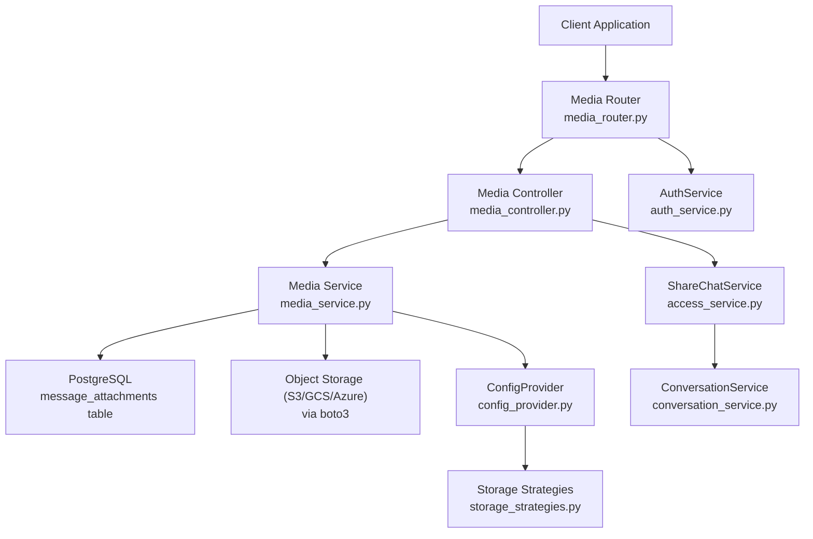
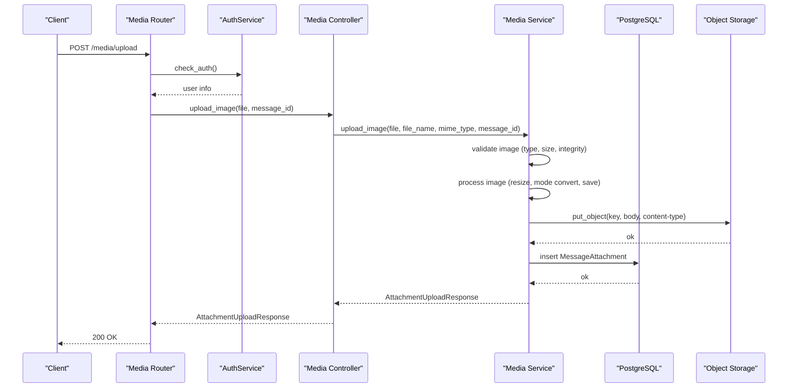
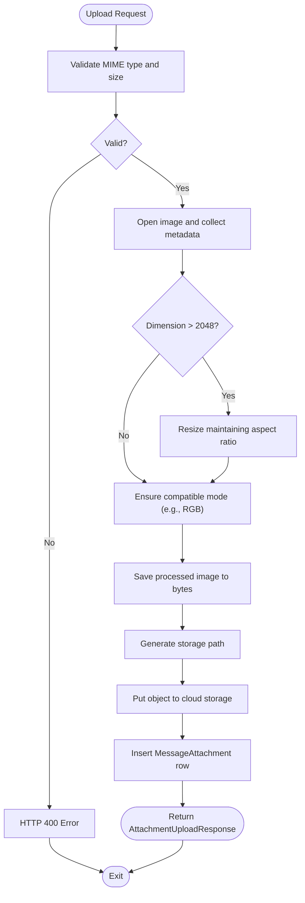
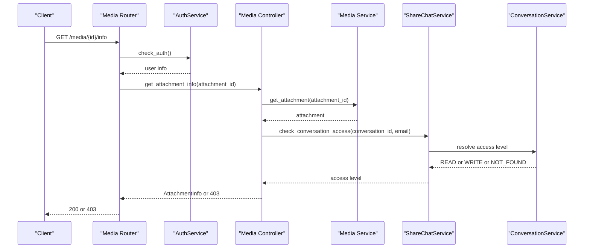
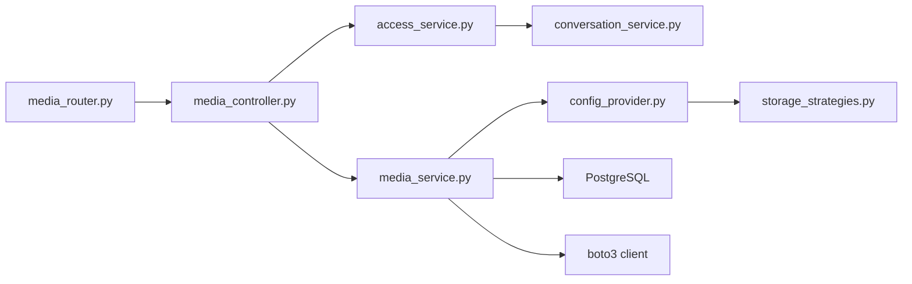

# Media API

<cite>
**Referenced Files in This Document**
- [media_router.py](file://app/modules/media/media_router.py)
- [media_controller.py](file://app/modules/media/media_controller.py)
- [media_service.py](file://app/modules/media/media_service.py)
- [media_model.py](file://app/modules/media/media_model.py)
- [media_schema.py](file://app/modules/media/media_schema.py)
- [auth_service.py](file://app/modules/auth/auth_service.py)
- [access_service.py](file://app/modules/conversations/access/access_service.py)
- [conversation_service.py](file://app/modules/conversations/conversation/conversation_service.py)
- [config_provider.py](file://app/core/config_provider.py)
- [storage_strategies.py](file://app/core/storage_strategies.py)
- [20250626135404_ce87e879766b_add_message_attachments_table.py](file://app/alembic/versions/20250626135404_ce87e879766b_add_message_attachments_table.py)
- [20250626135047_a7f9c1ec89e2_add_media_attachments_support.py](file://app/alembic/versions/20250626135047_a7f9c1ec89e2_add_media_attachments_support.py)
</cite>

## Table of Contents
1. [Introduction](#introduction)
2. [Project Structure](#project-structure)
3. [Core Components](#core-components)
4. [Architecture Overview](#architecture-overview)
5. [Detailed Component Analysis](#detailed-component-analysis)
6. [Dependency Analysis](#dependency-analysis)
7. [Performance Considerations](#performance-considerations)
8. [Troubleshooting Guide](#troubleshooting-guide)
9. [Conclusion](#conclusion)
10. [Appendices](#appendices)

## Introduction
This document provides comprehensive API documentation for Potpie’s media and file upload system. It covers HTTP endpoints for uploading, retrieving, and managing media attachments, including images. It also documents file handling, validation, storage integration, access control, and multimodal processing workflows. Security, performance, and operational considerations are included to help you deploy and operate the media APIs safely and efficiently.

## Project Structure
The media subsystem is organized around a FastAPI router, a controller layer, and a service layer that encapsulates storage and processing logic. Access control is enforced against conversation permissions. Storage backends are configurable via a strategy pattern.

**Diagram sources**
- [media_router.py](file://app/modules/media/media_router.py#L1-L196)
- [media_controller.py](file://app/modules/media/media_controller.py#L1-L286)
- [media_service.py](file://app/modules/media/media_service.py#L1-L686)
- [access_service.py](file://app/modules/conversations/access/access_service.py#L1-L133)
- [conversation_service.py](file://app/modules/conversations/conversation/conversation_service.py#L181-L211)
- [auth_service.py](file://app/modules/auth/auth_service.py#L1-L108)
- [config_provider.py](file://app/core/config_provider.py#L1-L246)
- [storage_strategies.py](file://app/core/storage_strategies.py#L1-L114)

**Section sources**
- [media_router.py](file://app/modules/media/media_router.py#L1-L196)
- [media_controller.py](file://app/modules/media/media_controller.py#L1-L286)
- [media_service.py](file://app/modules/media/media_service.py#L1-L686)
- [media_model.py](file://app/modules/media/media_model.py#L1-L47)
- [media_schema.py](file://app/modules/media/media_schema.py#L1-L42)
- [auth_service.py](file://app/modules/auth/auth_service.py#L1-L108)
- [access_service.py](file://app/modules/conversations/access/access_service.py#L1-L133)
- [conversation_service.py](file://app/modules/conversations/conversation/conversation_service.py#L181-L211)
- [config_provider.py](file://app/core/config_provider.py#L1-L246)
- [storage_strategies.py](file://app/core/storage_strategies.py#L1-L114)

## Core Components
- Media Router: Defines HTTP endpoints for uploads, access URLs, downloads, info, deletion, and listing per message.
- Media Controller: Orchestrates access checks, delegates to Media Service, and handles errors.
- Media Service: Validates, processes, stores, retrieves, and deletes media; supports multimodal workflows.
- Models and Schemas: Define attachment records, enums, and Pydantic response models.
- Access Control: Enforces conversation-level permissions via ShareChatService and ConversationService.
- Configuration: Detects multimodal enablement and selects storage backend via ConfigProvider and Storage Strategies.

**Section sources**
- [media_router.py](file://app/modules/media/media_router.py#L20-L196)
- [media_controller.py](file://app/modules/media/media_controller.py#L24-L286)
- [media_service.py](file://app/modules/media/media_service.py#L31-L686)
- [media_model.py](file://app/modules/media/media_model.py#L10-L47)
- [media_schema.py](file://app/modules/media/media_schema.py#L9-L42)
- [access_service.py](file://app/modules/conversations/access/access_service.py#L18-L133)
- [conversation_service.py](file://app/modules/conversations/conversation/conversation_service.py#L181-L211)
- [config_provider.py](file://app/core/config_provider.py#L157-L205)
- [storage_strategies.py](file://app/core/storage_strategies.py#L22-L114)

## Architecture Overview
The media API follows a layered architecture:
- Presentation: FastAPI routes define endpoints and bind to controller methods.
- Application: Controller enforces auth and access checks, then calls Media Service.
- Domain/Infrastructure: Media Service validates and processes images, persists metadata, and interacts with object storage.
- Persistence: PostgreSQL stores attachment records; object storage stores binary payloads.
- Access Control: Conversation visibility and sharing determine read/write access.

**Diagram sources**
- [media_router.py](file://app/modules/media/media_router.py#L20-L48)
- [auth_service.py](file://app/modules/auth/auth_service.py#L48-L104)
- [media_controller.py](file://app/modules/media/media_controller.py#L43-L75)
- [media_service.py](file://app/modules/media/media_service.py#L101-L184)

## Detailed Component Analysis

### Endpoint Catalog
- POST /media/upload
  - Purpose: Upload an image file.
  - Auth: Required.
  - Query: message_id (optional).
  - Request: multipart/form-data with field file.
  - Response: AttachmentUploadResponse.
  - Notes: Multimodal feature flag gating; image validation and processing.
- GET /media/{attachment_id}/access
  - Purpose: Generate a signed URL for secure access.
  - Auth: Required.
  - Query: expiration_minutes (default 60, range 1–1440).
  - Response: AttachmentAccessResponse with download_url and expires_in (seconds).
- GET /media/{attachment_id}/download
  - Purpose: Direct download of attachment file.
  - Auth: Required.
  - Response: StreamingResponse with file bytes and headers.
- GET /media/{attachment_id}/info
  - Purpose: Retrieve attachment metadata.
  - Auth: Required.
  - Response: AttachmentInfo.
- DELETE /media/{attachment_id}
  - Purpose: Delete an attachment.
  - Auth: Required; requires write access to the conversation containing the message.
  - Response: Success message.
- GET /messages/{message_id}/attachments
  - Purpose: List all attachments linked to a message.
  - Auth: Required.
  - Response: List[AttachmentInfo].
- GET /media/{attachment_id}/test-multimodal
  - Purpose: Test multimodal readiness for an attachment.
  - Auth: Required.
  - Response: JSON result indicating readiness and metadata.

**Section sources**
- [media_router.py](file://app/modules/media/media_router.py#L20-L196)

### Data Models and Schemas
- AttachmentInfo
  - Fields: id, attachment_type, file_name, mime_type, file_size, storage_provider, file_metadata, created_at, download_url (optional).
- AttachmentUploadResponse
  - Fields: id, attachment_type, file_name, mime_type, file_size, message.
- AttachmentAccessResponse
  - Fields: download_url, expires_in (seconds).
- MediaUploadError
  - Fields: error, details.

**Section sources**
- [media_schema.py](file://app/modules/media/media_schema.py#L9-L42)

### Storage and Processing Workflows
- Validation
  - Allowed image types: jpeg, jpg, png, webp, gif.
  - Max file size: 10 MB.
  - Integrity check via PIL.Image.verify().
- Processing
  - Resize if either dimension exceeds 2048 pixels (only if larger than 1024 px to avoid over-compression).
  - Convert modes (e.g., RGBA to RGB) and save with optimized quality.
  - Metadata includes original dimensions, format, mode, sizes, and whether resized.
- Storage Path
  - Path pattern: attachments/{year}/{month}/{attachment_id}.{ext}.
- Upload
  - Uses boto3 client for configured provider (S3/GCS/Azure).
  - Stores MD5 hash in Content-MD5 for integrity.
- Signed URLs
  - Generated via boto3 presigned URL with expiration in seconds.
- Retrieval and Deletion
  - Download via get_object; delete via delete_object; database cleanup follows.

**Diagram sources**
- [media_service.py](file://app/modules/media/media_service.py#L186-L327)
- [media_service.py](file://app/modules/media/media_service.py#L212-L284)
- [media_service.py](file://app/modules/media/media_service.py#L286-L302)

**Section sources**
- [media_service.py](file://app/modules/media/media_service.py#L31-L686)

### Access Control and Permissions
- Auth
  - Bearer token validated via Firebase; development mode support with mock user.
- Conversation Access
  - Read access granted for PUBLIC conversations.
  - Write access granted to conversation creators.
  - Shared users have read access.
- Attachment Access Checks
  - Controllers verify access to the message’s conversation before allowing operations.
  - Delete requires write access.

**Diagram sources**
- [media_router.py](file://app/modules/media/media_router.py#L104-L123)
- [auth_service.py](file://app/modules/auth/auth_service.py#L48-L104)
- [media_controller.py](file://app/modules/media/media_controller.py#L149-L179)
- [access_service.py](file://app/modules/conversations/access/access_service.py#L18-L133)
- [conversation_service.py](file://app/modules/conversations/conversation/conversation_service.py#L181-L211)

**Section sources**
- [auth_service.py](file://app/modules/auth/auth_service.py#L48-L104)
- [media_controller.py](file://app/modules/media/media_controller.py#L227-L255)
- [access_service.py](file://app/modules/conversations/access/access_service.py#L18-L133)
- [conversation_service.py](file://app/modules/conversations/conversation/conversation_service.py#L181-L211)

### Multimodal Functionality
- Feature Flag
  - Controlled by ConfigProvider; auto-detects object storage availability.
- Base64 Conversion
  - Converts stored images to base64 for LLM consumption.
- Recent Images
  - Retrieves recent images from conversation history for context.

**Section sources**
- [media_service.py](file://app/modules/media/media_service.py#L542-L611)
- [media_service.py](file://app/modules/media/media_service.py#L613-L657)
- [config_provider.py](file://app/core/config_provider.py#L157-L172)

### Database Schema
- message_attachments table
  - Columns: id, message_id (FK), attachment_type, file_name, file_size, mime_type, storage_path, storage_provider, file_metadata, created_at.
  - Index: message_id.
- messages table
  - Column: has_attachments (boolean, NOT NULL).

**Section sources**
- [20250626135404_ce87e879766b_add_message_attachments_table.py](file://app/alembic/versions/20250626135404_ce87e879766b_add_message_attachments_table.py#L24-L54)
- [20250626135047_a7f9c1ec89e2_add_media_attachments_support.py](file://app/alembic/versions/20250626135047_a7f9c1ec89e2_add_media_attachments_support.py#L23-L30)
- [media_model.py](file://app/modules/media/media_model.py#L24-L47)

## Dependency Analysis
- Router depends on:
  - AuthService for auth.
  - MediaController for business logic.
- Controller depends on:
  - MediaService for storage and processing.
  - ShareChatService and ConversationService for access checks.
- MediaService depends on:
  - ConfigProvider for multimodal and storage configuration.
  - Storage Strategies for provider descriptors.
  - SQLAlchemy for persistence.
  - boto3 for object storage operations.

**Diagram sources**
- [media_router.py](file://app/modules/media/media_router.py#L1-L196)
- [media_controller.py](file://app/modules/media/media_controller.py#L1-L286)
- [media_service.py](file://app/modules/media/media_service.py#L1-L686)
- [access_service.py](file://app/modules/conversations/access/access_service.py#L1-L133)
- [conversation_service.py](file://app/modules/conversations/conversation/conversation_service.py#L181-L211)
- [config_provider.py](file://app/core/config_provider.py#L1-L246)
- [storage_strategies.py](file://app/core/storage_strategies.py#L1-L114)

**Section sources**
- [media_router.py](file://app/modules/media/media_router.py#L1-L196)
- [media_controller.py](file://app/modules/media/media_controller.py#L1-L286)
- [media_service.py](file://app/modules/media/media_service.py#L1-L686)
- [config_provider.py](file://app/core/config_provider.py#L1-L246)
- [storage_strategies.py](file://app/core/storage_strategies.py#L1-L114)

## Performance Considerations
- Image Processing
  - Resizing threshold prevents unnecessary compression for small images.
  - JPEG quality tuned for readability; consider trade-offs for storage vs. fidelity.
- Storage
  - Signed URLs reduce server bandwidth for downloads.
  - MD5 checksum ensures integrity during upload.
- Pagination and Queries
  - message_id indexing supports efficient attachment listing per message.
- Concurrency
  - Asynchronous processing in service methods supports concurrent uploads/downloads.

[No sources needed since this section provides general guidance]

## Troubleshooting Guide
- Multimodal Disabled
  - Symptom: 501 responses on upload and related endpoints.
  - Cause: isMultimodalEnabled not enabled or storage provider not configured.
  - Resolution: Enable feature flag or configure object storage provider.
- Invalid or Corrupted Image
  - Symptom: 400 error on upload.
  - Cause: unsupported MIME type, size over 10 MB, or invalid image data.
  - Resolution: Validate file type and size; re-encode if necessary.
- Access Denied
  - Symptom: 403 on info/download/delete.
  - Cause: insufficient conversation access (not shared or not creator for write).
  - Resolution: Ensure proper sharing or ownership.
- Storage Initialization Failure
  - Symptom: 500 error during upload/download/signd URL generation.
  - Cause: missing or invalid provider credentials.
  - Resolution: Configure OBJECT_STORAGE_PROVIDER and associated environment variables.

**Section sources**
- [media_router.py](file://app/modules/media/media_router.py#L33-L42)
- [media_service.py](file://app/modules/media/media_service.py#L186-L210)
- [media_controller.py](file://app/modules/media/media_controller.py#L86-L92)
- [media_service.py](file://app/modules/media/media_service.py#L77-L90)
- [config_provider.py](file://app/core/config_provider.py#L178-L188)

## Conclusion
Potpie’s media API provides a robust, secure, and extensible foundation for uploading, storing, and retrieving media attachments. With built-in validation, processing, and access control, it integrates seamlessly with conversation contexts and supports multimodal workflows. Proper configuration of storage providers and feature flags ensures reliable operation across environments.

[No sources needed since this section summarizes without analyzing specific files]

## Appendices

### Endpoint Reference

- POST /media/upload
  - Description: Upload an image file.
  - Auth: Bearer token.
  - Query: message_id (optional).
  - Form Fields: file (multipart/form-data).
  - Responses:
    - 200: AttachmentUploadResponse
    - 400: Validation errors (unsupported type, size exceeded, invalid/corrupted)
    - 403: Access denied
    - 500: Internal error
- GET /media/{attachment_id}/access
  - Description: Generate a signed URL for access.
  - Auth: Bearer token.
  - Query: expiration_minutes (1–1440, default 60).
  - Responses:
    - 200: AttachmentAccessResponse
    - 404: Attachment not found
    - 403: Access denied
    - 500: Internal error
- GET /media/{attachment_id}/download
  - Description: Direct download of file bytes.
  - Auth: Bearer token.
  - Responses:
    - 200: application/octet-stream with Content-Disposition inline
    - 404: Attachment not found
    - 403: Access denied
    - 500: Internal error
- GET /media/{attachment_id}/info
  - Description: Retrieve attachment metadata.
  - Auth: Bearer token.
  - Responses:
    - 200: AttachmentInfo
    - 404: Attachment not found
    - 403: Access denied
    - 500: Internal error
- DELETE /media/{attachment_id}
  - Description: Delete an attachment.
  - Auth: Bearer token.
  - Responses:
    - 200: {"message": "Attachment deleted successfully"}
    - 404: Attachment not found
    - 403: Access denied
    - 500: Internal error
- GET /messages/{message_id}/attachments
  - Description: List attachments for a message.
  - Auth: Bearer token.
  - Responses:
    - 200: List[AttachmentInfo]
    - 403: Access denied
    - 500: Internal error
- GET /media/{attachment_id}/test-multimodal
  - Description: Test multimodal readiness.
  - Auth: Bearer token.
  - Responses:
    - 200: JSON result
    - 404: Attachment not found
    - 403: Access denied
    - 500: Internal error

**Section sources**
- [media_router.py](file://app/modules/media/media_router.py#L20-L196)

### Request/Response Schemas

- AttachmentUploadResponse
  - id: string
  - attachment_type: enum "image"
  - file_name: string
  - mime_type: string
  - file_size: integer
  - message: string
- AttachmentInfo
  - id: string
  - attachment_type: enum "image"
  - file_name: string
  - mime_type: string
  - file_size: integer
  - storage_provider: enum "local"|"gcs"|"s3"|"azure"
  - file_metadata: object|null
  - created_at: datetime
  - download_url: string|null
- AttachmentAccessResponse
  - download_url: string
  - expires_in: integer (seconds)
- MediaUploadError
  - error: string
  - details: string|null

**Section sources**
- [media_schema.py](file://app/modules/media/media_schema.py#L9-L42)

### Supported Formats and Limits
- Image Types: jpeg, jpg, png, webp, gif
- Max Size: 10 MB
- Max Dimension: 2048 pixels (resized only when exceeding threshold)
- Min Dimension Threshold: 1024 pixels (to avoid over-resize)
- JPEG Quality: 98
- Storage Providers: s3, gcs, azure (local fallback)

**Section sources**
- [media_service.py](file://app/modules/media/media_service.py#L33-L45)
- [media_service.py](file://app/modules/media/media_service.py#L186-L210)
- [media_service.py](file://app/modules/media/media_service.py#L212-L284)
- [storage_strategies.py](file://app/core/storage_strategies.py#L22-L114)

### Security Considerations
- Authentication: Bearer token via Firebase; development mode support with mock user.
- Authorization: Conversation-level access checks (read for PUBLIC/shared, write for creator).
- Data Exposure: storage_path intentionally excluded from API responses.
- Signed URLs: Prefer signed URLs for downloads to minimize server exposure.

**Section sources**
- [auth_service.py](file://app/modules/auth/auth_service.py#L48-L104)
- [media_schema.py](file://app/modules/media/media_schema.py#L15-L16)
- [media_service.py](file://app/modules/media/media_service.py#L373-L402)

### Storage Integration
- Provider Selection: Auto-detected via ConfigProvider; explicit provider via OBJECT_STORAGE_PROVIDER.
- GCS/S3/Azure: Interoperable via S3-compatible APIs; HMAC keys for GCS.
- Client Initialization: boto3 client configured with provider-specific client kwargs.

**Section sources**
- [config_provider.py](file://app/core/config_provider.py#L174-L188)
- [storage_strategies.py](file://app/core/storage_strategies.py#L22-L114)
- [media_service.py](file://app/modules/media/media_service.py#L77-L90)