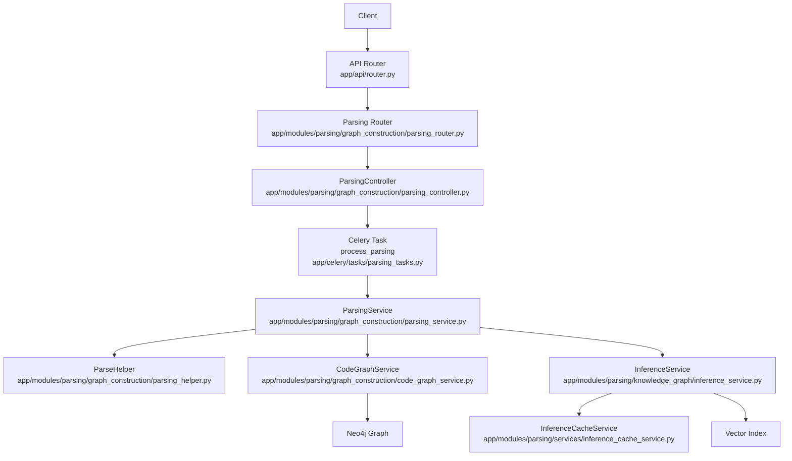
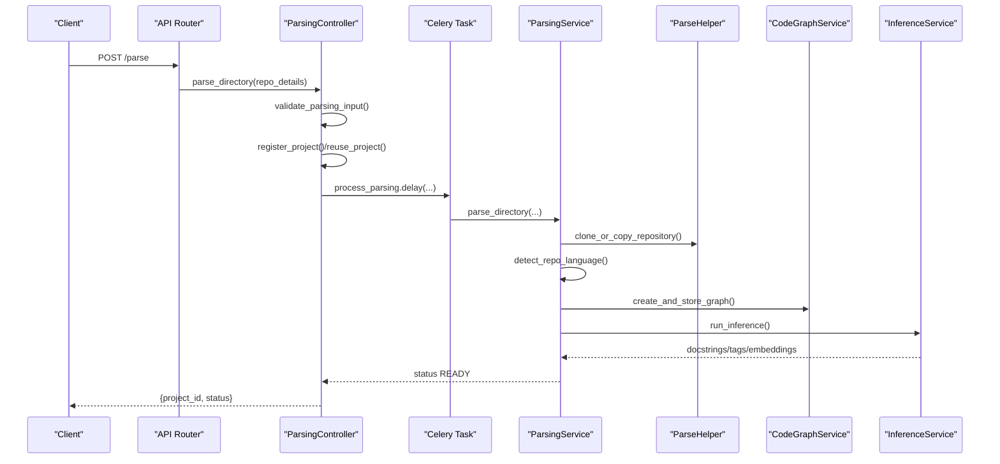
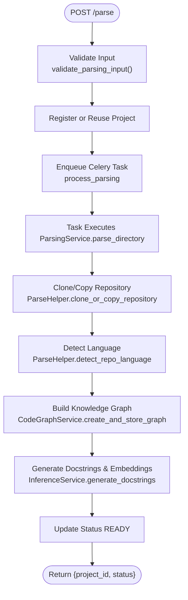
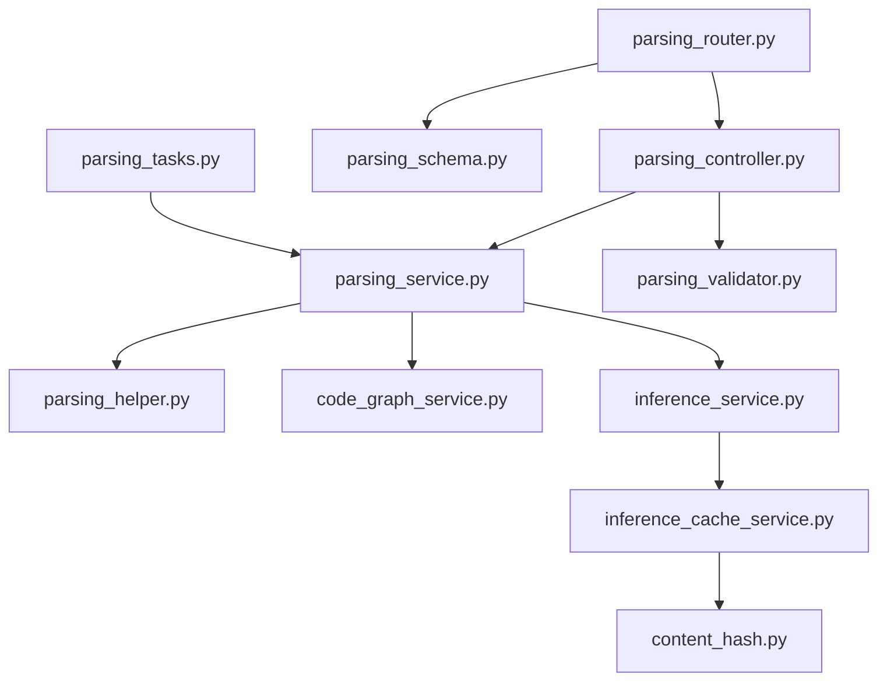

# Parsing API

<cite>
**Referenced Files in This Document**
- [router.py](file://app/api/router.py)
- [parsing_router.py](file://app/modules/parsing/graph_construction/parsing_router.py)
- [parsing_controller.py](file://app/modules/parsing/graph_construction/parsing_controller.py)
- [parsing_service.py](file://app/modules/parsing/graph_construction/parsing_service.py)
- [parsing_schema.py](file://app/modules/parsing/graph_construction/parsing_schema.py)
- [parsing_validator.py](file://app/modules/parsing/graph_construction/parsing_validator.py)
- [parsing_helper.py](file://app/modules/parsing/graph_construction/parsing_helper.py)
- [parsing_repomap.py](file://app/modules/parsing/graph_construction/parsing_repomap.py)
- [code_graph_service.py](file://app/modules/parsing/graph_construction/code_graph_service.py)
- [inference_service.py](file://app/modules/parsing/knowledge_graph/inference_service.py)
- [inference_cache_service.py](file://app/modules/parsing/services/inference_cache_service.py)
- [content_hash.py](file://app/modules/parsing/utils/content_hash.py)
- [parsing_tasks.py](file://app/celery/tasks/parsing_tasks.py)
- [APIRouter.py](file://app/modules/utils/APIRouter.py)
</cite>

## Table of Contents
1. [Introduction](#introduction)
2. [Project Structure](#project-structure)
3. [Core Components](#core-components)
4. [Architecture Overview](#architecture-overview)
5. [Detailed Component Analysis](#detailed-component-analysis)
6. [Dependency Analysis](#dependency-analysis)
7. [Performance Considerations](#performance-considerations)
8. [Troubleshooting Guide](#troubleshooting-guide)
9. [Conclusion](#conclusion)

## Introduction
This document describes the Parsing API that powers repository analysis, file processing, AST generation, and knowledge graph construction in Potpie. It covers HTTP endpoints, request/response schemas, parsing workflows, language detection, supported file formats, status tracking, and operational characteristics such as optimization, error handling, retries, and performance considerations for large codebases.

## Project Structure
The Parsing API is exposed via FastAPI routers and orchestrated by Celery tasks. The primary entry points are defined in the API router and mapped to parsing controller methods, which delegate to parsing service and helper utilities. Knowledge graph construction and inference are performed by dedicated services.

**Diagram sources**
- [router.py](file://app/api/router.py#L123-L147)
- [parsing_router.py](file://app/modules/parsing/graph_construction/parsing_router.py#L16-L38)
- [parsing_controller.py](file://app/modules/parsing/graph_construction/parsing_controller.py#L39-L304)
- [parsing_service.py](file://app/modules/parsing/graph_construction/parsing_service.py#L102-L262)
- [parsing_helper.py](file://app/modules/parsing/graph_construction/parsing_helper.py#L63-L107)
- [code_graph_service.py](file://app/modules/parsing/graph_construction/code_graph_service.py#L37-L178)
- [inference_service.py](file://app/modules/parsing/knowledge_graph/inference_service.py#L741-L899)
- [inference_cache_service.py](file://app/modules/parsing/services/inference_cache_service.py#L10-L149)
- [parsing_tasks.py](file://app/celery/tasks/parsing_tasks.py#L12-L54)

**Section sources**
- [router.py](file://app/api/router.py#L123-L147)
- [parsing_router.py](file://app/modules/parsing/graph_construction/parsing_router.py#L1-L39)
- [APIRouter.py](file://app/modules/utils/APIRouter.py#L7-L27)

## Core Components
- API Router: Exposes endpoints for parsing and status checks, with API key authentication.
- Parsing Router: Maps routes to controller actions.
- Parsing Controller: Validates inputs, manages project lifecycle, enqueues parsing tasks, and returns status.
- Parsing Service: Orchestrates repository cloning/copying, language detection, AST graph construction, and inference.
- Parse Helper: Implements repository access, text-file filtering, archive download, git clone fallback, and language detection.
- Code Graph Service: Builds and stores the knowledge graph in Neo4j with batching and indexing.
- Inference Service: Generates docstrings, tags, embeddings, and vector indices; supports caching and batching.
- Inference Cache Service: Stores and retrieves cached inference results keyed by content hash.
- Celery Tasks: Asynchronous execution of parsing workflows.

**Section sources**
- [parsing_controller.py](file://app/modules/parsing/graph_construction/parsing_controller.py#L39-L304)
- [parsing_service.py](file://app/modules/parsing/graph_construction/parsing_service.py#L33-L262)
- [parsing_helper.py](file://app/modules/parsing/graph_construction/parsing_helper.py#L34-L107)
- [code_graph_service.py](file://app/modules/parsing/graph_construction/code_graph_service.py#L15-L178)
- [inference_service.py](file://app/modules/parsing/knowledge_graph/inference_service.py#L45-L110)
- [inference_cache_service.py](file://app/modules/parsing/services/inference_cache_service.py#L10-L149)
- [parsing_tasks.py](file://app/celery/tasks/parsing_tasks.py#L12-L54)

## Architecture Overview
The Parsing API follows a request-response pattern with asynchronous task execution:
- Clients submit a parsing request via the /parse endpoint.
- The controller validates inputs, registers or reuses a project, and enqueues a Celery task.
- The task runs ParsingService, which:
  - Clones/copies the repository.
  - Detects language and filters text files.
  - Builds an AST-based knowledge graph in Neo4j.
  - Runs inference to generate docstrings, tags, and embeddings.
- Status endpoints (/parsing-status/{project_id} and /parsing-status) allow clients to poll for completion and latest commit status.

**Diagram sources**
- [router.py](file://app/api/router.py#L123-L129)
- [parsing_controller.py](file://app/modules/parsing/graph_construction/parsing_controller.py#L41-L304)
- [parsing_tasks.py](file://app/celery/tasks/parsing_tasks.py#L17-L51)
- [parsing_service.py](file://app/modules/parsing/graph_construction/parsing_service.py#L102-L212)
- [parsing_helper.py](file://app/modules/parsing/graph_construction/parsing_helper.py#L63-L107)
- [code_graph_service.py](file://app/modules/parsing/graph_construction/code_graph_service.py#L37-L178)
- [inference_service.py](file://app/modules/parsing/knowledge_graph/inference_service.py#L1093-L1099)

## Detailed Component Analysis

### Endpoints and Schemas

- POST /parse
  - Description: Starts parsing a repository and returns a project identifier and initial status.
  - Authentication: API key required.
  - Request body: ParsingRequest
  - Response: ParsingResponse
  - Notes: Supports GitHub/GitBucket repositories or local repositories in development mode.

- GET /parsing-status/{project_id}
  - Description: Returns the status of a project and whether it reflects the latest commit.
  - Authentication: API key required.
  - Path parameter: project_id (string)
  - Response: { status: string, latest: boolean }

- POST /parsing-status
  - Description: Returns the status of a project identified by repository name and optional commit/branch.
  - Authentication: API key required.
  - Request body: ParsingStatusRequest
  - Response: { project_id: string, repo_name: string, status: string, latest: boolean }

ParsingRequest Schema
- Fields:
  - repo_name: string (optional)
  - repo_path: string (optional)
  - branch_name: string (optional)
  - commit_id: string (optional)
- Validation: At least one of repo_name or repo_path must be provided.

ParsingStatusRequest Schema
- Fields:
  - repo_name: string (required)
  - commit_id: string (optional)
  - branch_name: string (optional)

ParsingResponse Schema
- Fields:
  - message: string
  - status: string
  - project_id: string

Supported file formats and language detection
- Text file detection: Filters binary files and includes common source/markdown/config files.
- Language detection: Heuristically determines predominant language across text files; if none supported, parsing fails early.

Authentication and authorization
- API key authentication enforced via a dependency that validates the key and returns user identity.
- Access to status endpoints also requires authorization checks against project visibility and sharing.

**Section sources**
- [router.py](file://app/api/router.py#L123-L147)
- [parsing_router.py](file://app/modules/parsing/graph_construction/parsing_router.py#L16-L38)
- [parsing_schema.py](file://app/modules/parsing/graph_construction/parsing_schema.py#L6-L38)
- [parsing_validator.py](file://app/modules/parsing/graph_construction/parsing_validator.py#L7-L27)
- [parsing_helper.py](file://app/modules.parsing/graph_construction.parsing_helper.py#L109-L201)

### Parsing Workflow

**Diagram sources**
- [parsing_controller.py](file://app/modules/parsing/graph_construction/parsing_controller.py#L41-L304)
- [parsing_tasks.py](file://app/celery/tasks/parsing_tasks.py#L17-L51)
- [parsing_service.py](file://app/modules/parsing/graph_construction/parsing_service.py#L102-L212)
- [parsing_helper.py](file://app/modules/parsing/graph_construction.parsing_helper.py#L63-L107)
- [code_graph_service.py](file://app/modules/parsing/graph_construction/code_graph_service.py#L37-L178)
- [inference_service.py](file://app/modules/parsing/knowledge_graph/inference_service.py#L741-L899)

**Section sources**
- [parsing_controller.py](file://app/modules/parsing/graph_construction/parsing_controller.py#L41-L304)
- [parsing_service.py](file://app/modules/parsing/graph_construction/parsing_service.py#L102-L212)
- [parsing_helper.py](file://app/modules/parsing/graph_construction.parsing_helper.py#L63-L107)
- [code_graph_service.py](file://app/modules/parsing/graph_construction/code_graph_service.py#L37-L178)
- [inference_service.py](file://app/modules/parsing/knowledge_graph/inference_service.py#L741-L899)

### Knowledge Graph Construction

- Graph creation:
  - Uses AST queries per language to extract definitions and references.
  - Builds a directed multigraph with nodes for FILE, CLASS, INTERFACE, FUNCTION and relationships such as CONTAINS and REFERENCES.
  - Batches node and relationship creation for performance.

- Neo4j storage:
  - Creates specialized indexes for node lookups and relationship types.
  - Cleans up previous graph data for a project prior to rebuilding.

- Vector indexing:
  - Creates a vector index on docstring embeddings for semantic search.

**Section sources**
- [parsing_repomap.py](file://app/modules/parsing/graph_construction/parsing_repomap.py#L611-L736)
- [code_graph_service.py](file://app/modules/parsing/graph_construction/code_graph_service.py#L37-L178)
- [inference_service.py](file://app/modules/parsing/knowledge_graph/inference_service.py#L1079-L1101)

### Inference and Caching

- Inference pipeline:
  - Batches nodes respecting token limits and caches eligible results.
  - Splits large nodes into chunks and consolidates chunked responses.
  - Updates Neo4j with docstrings, tags, and embeddings; removes raw text for local repositories.

- Caching:
  - Content hashed with cache versioning to differentiate node types.
  - Cache service provides global lookup and upsert semantics with access tracking.

**Section sources**
- [inference_service.py](file://app/modules/parsing/knowledge_graph/inference_service.py#L589-L899)
- [inference_cache_service.py](file://app/modules/parsing/services/inference_cache_service.py#L10-L149)
- [content_hash.py](file://app/modules/parsing/utils/content_hash.py#L9-L68)

### Status Tracking and Progress Indicators
- Immediate response: On successful enqueue, returns { project_id, status } where status is SUBMITTED.
- Polling endpoints:
  - GET /parsing-status/{project_id}: Returns current status and latest flag.
  - POST /parsing-status: Returns project_id, repo_name, status, and latest based on repo/commit/branch.

**Section sources**
- [parsing_controller.py](file://app/modules/parsing/graph_construction/parsing_controller.py#L307-L377)
- [router.py](file://app/api/router.py#L132-L147)

## Dependency Analysis

**Diagram sources**
- [parsing_router.py](file://app/modules/parsing/graph_construction/parsing_router.py#L1-L39)
- [parsing_controller.py](file://app/modules/parsing/graph_construction/parsing_controller.py#L1-L35)
- [parsing_service.py](file://app/modules/parsing/graph_construction/parsing_service.py#L1-L30)
- [parsing_helper.py](file://app/modules/parsing/graph_construction/parsing_helper.py#L1-L23)
- [code_graph_service.py](file://app/modules/parsing/graph_construction/code_graph_service.py#L1-L12)
- [inference_service.py](file://app/modules/parsing/knowledge_graph/inference_service.py#L1-L27)
- [inference_cache_service.py](file://app/modules/parsing/services/inference_cache_service.py#L1-L7)
- [content_hash.py](file://app/modules/parsing/utils/content_hash.py#L1-L6)
- [parsing_tasks.py](file://app/celery/tasks/parsing_tasks.py#L1-L9)

**Section sources**
- [parsing_router.py](file://app/modules/parsing/graph_construction/parsing_router.py#L1-L39)
- [parsing_controller.py](file://app/modules/parsing/graph_construction/parsing_controller.py#L1-L35)
- [parsing_service.py](file://app/modules/parsing/graph_construction/parsing_service.py#L1-L30)
- [parsing_helper.py](file://app/modules/parsing/graph_construction.parsing_helper.py#L1-L23)
- [code_graph_service.py](file://app/modules/parsing/graph_construction/code_graph_service.py#L1-L12)
- [inference_service.py](file://app/modules/parsing/knowledge_graph/inference_service.py#L1-L27)
- [inference_cache_service.py](file://app/modules/parsing/services/inference_cache_service.py#L1-L7)
- [content_hash.py](file://app/modules/parsing/utils/content_hash.py#L1-L6)
- [parsing_tasks.py](file://app/celery/tasks/parsing_tasks.py#L1-L9)

## Performance Considerations
- Batching:
  - Neo4j node and relationship creation uses fixed-size batches to reduce transaction overhead.
  - Inference batching respects token limits and splits large nodes into chunks.
- Indexing:
  - Specialized indexes for node lookups and relationship types improve query performance.
  - Vector index accelerates semantic search on embeddings.
- Caching:
  - Content-hash-based caching avoids redundant LLM calls; cache hit rate is logged.
  - Embedding vectors can be reused when available.
- Parallelism:
  - Semaphore controls concurrent inference requests to manage resource usage.
- Cleanup:
  - Temporary directories are removed after parsing to conserve disk space.

[No sources needed since this section provides general guidance]

## Troubleshooting Guide
Common issues and resolutions:
- Repository not found or inaccessible:
  - Ensure correct repo_name and authentication; for private repositories, configure appropriate tokens.
- Local repository parsing disabled:
  - Enable development mode or use remote repositories; local parsing is restricted outside development mode.
- Unsupported language:
  - If predominant language is not supported, parsing fails early; include supported files or reclassify content.
- Large repositories:
  - Parsing may take significant time; monitor status and consider optimizing file filters or limiting branches.
- Network failures during archive download:
  - Private repositories may require git clone fallback; ensure credentials are configured for GitBucket if applicable.
- Inference failures:
  - Pipeline continues with next batches on individual failures; verify LLM provider availability and quotas.

**Section sources**
- [parsing_helper.py](file://app/modules.parsing/graph_construction.parsing_helper.py#L348-L377)
- [parsing_service.py](file://app/modules/parsing/graph_construction/parsing_service.py#L214-L261)
- [inference_service.py](file://app/modules/parsing/knowledge_graph/inference_service.py#L817-L880)

## Conclusion
The Parsing API provides a robust, asynchronous pipeline for repository ingestion, knowledge graph construction, and inference-driven documentation. It supports multiple repository sources, language detection, efficient graph building, and scalable inference with caching. Clients can track progress via status endpoints and integrate with the broader Potpie ecosystem for search and agent interactions.