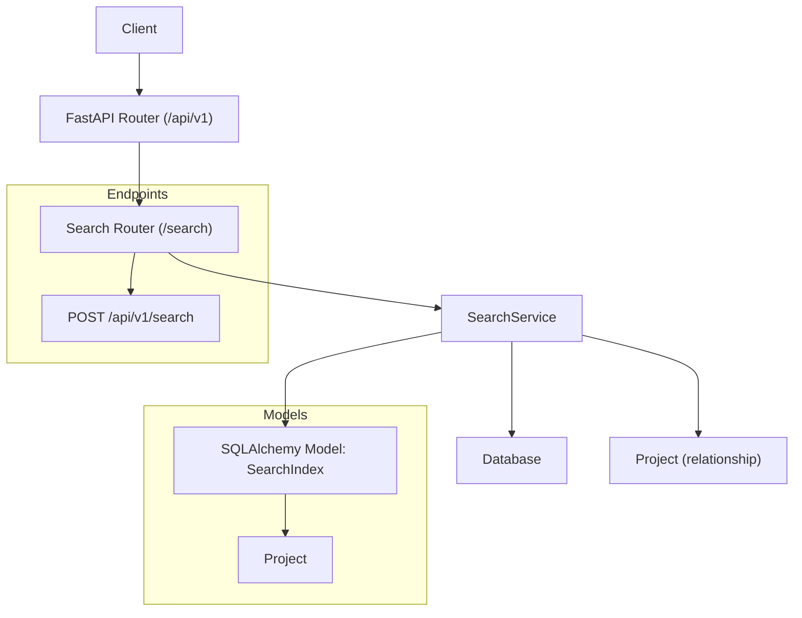
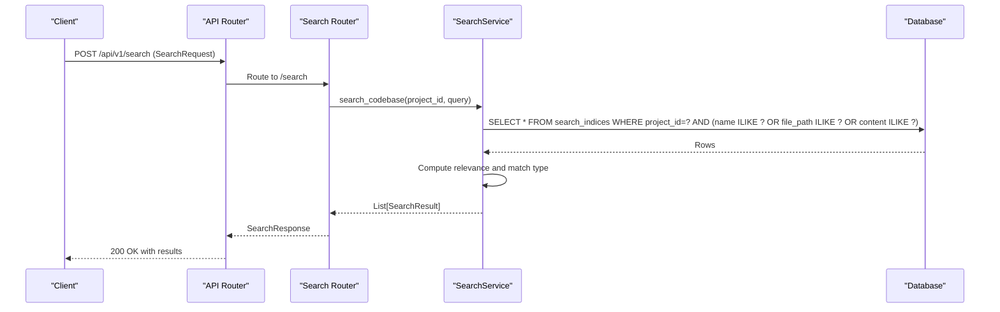
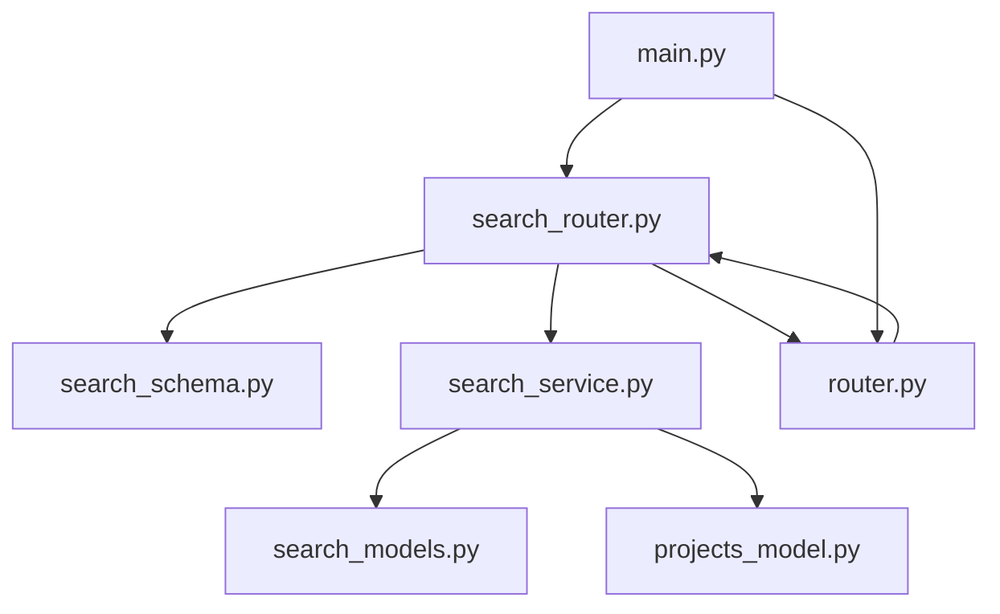

# Search API

<cite>
**Referenced Files in This Document**
- [search_router.py](file://app/modules/search/search_router.py)
- [search_schema.py](file://app/modules/search/search_schema.py)
- [search_service.py](file://app/modules/search/search_service.py)
- [search_models.py](file://app/modules/search/search_models.py)
- [router.py](file://app/api/router.py)
- [main.py](file://app/main.py)
- [20240826215938_3c7be0985b17_search_index.py](file://app/alembic/versions/20240826215938_3c7be0985b17_search_index.py)
- [projects_model.py](file://app/modules/projects/projects_model.py)
- [inference_service.py](file://app/modules/parsing/knowledge_graph/inference_service.py)
</cite>

## Table of Contents
1. [Introduction](#introduction)
2. [Project Structure](#project-structure)
3. [Core Components](#core-components)
4. [Architecture Overview](#architecture-overview)
5. [Detailed Component Analysis](#detailed-component-analysis)
6. [Dependency Analysis](#dependency-analysis)
7. [Performance Considerations](#performance-considerations)
8. [Troubleshooting Guide](#troubleshooting-guide)
9. [Conclusion](#conclusion)
10. [Appendices](#appendices)

## Introduction
This document provides comprehensive API documentation for Potpie’s codebase search system. It covers the HTTP endpoint for performing keyword-based searches over indexed code artifacts, the request/response schemas, search ranking and relevance scoring, and the underlying indexing model. It also documents vector similarity search capabilities available in the knowledge graph pipeline and how the two systems relate.

The search endpoint supports:
- Keyword-based search across name, file path, and content fields
- Relevance scoring and match type classification
- Pagination-friendly result truncation to top results
- Vector similarity search via the knowledge graph for semantic retrieval

## Project Structure
The search capability is implemented as a dedicated module with a FastAPI router, Pydantic models for request/response, a SQLAlchemy model for the search index, and a service layer that executes queries and computes relevance. The endpoint is exposed under the v1 API namespace.

**Diagram sources**
- [main.py](file://app/main.py#L147-L171)
- [search_router.py](file://app/modules/search/search_router.py#L10-L23)
- [router.py](file://app/api/router.py#L285-L296)
- [search_models.py](file://app/modules/search/search_models.py#L7-L17)
- [projects_model.py](file://app/modules/projects/projects_model.py#L49-L50)

**Section sources**
- [main.py](file://app/main.py#L147-L171)
- [search_router.py](file://app/modules/search/search_router.py#L10-L23)
- [router.py](file://app/api/router.py#L285-L296)
- [search_models.py](file://app/modules/search/search_models.py#L7-L17)
- [projects_model.py](file://app/modules/projects/projects_model.py#L49-L50)

## Core Components
- Endpoint: POST /api/v1/search
- Request body: SearchRequest
- Response body: SearchResponse
- Index model: SearchIndex
- Service: SearchService

Key behaviors:
- Authentication: API key required via headers
- Authorization: Project-scoped; results filtered by project_id
- Query processing: Split into words, case-insensitive partial matches
- Ranking: Weighted relevance combining match counts and string similarity
- Output: Top 10 results sorted by relevance

**Section sources**
- [search_router.py](file://app/modules/search/search_router.py#L13-L23)
- [router.py](file://app/api/router.py#L285-L296)
- [search_schema.py](file://app/modules/search/search_schema.py#L6-L27)
- [search_service.py](file://app/modules/search/search_service.py#L19-L71)
- [search_models.py](file://app/modules/search/search_models.py#L7-L17)

## Architecture Overview
The search endpoint integrates with the main API router and delegates to the SearchService, which queries the SearchIndex table. The SearchIndex is linked to the Project entity and indexed for efficient lookup.

**Diagram sources**
- [router.py](file://app/api/router.py#L285-L296)
- [search_router.py](file://app/modules/search/search_router.py#L13-L23)
- [search_service.py](file://app/modules/search/search_service.py#L19-L71)
- [search_models.py](file://app/modules/search/search_models.py#L7-L17)

## Detailed Component Analysis

### Endpoint Specification
- Method: POST
- URL: /api/v1/search
- Authentication: API key header required
- Request body: SearchRequest
- Response body: SearchResponse

Headers:
- X-API-Key: Required
- X-User-ID: Optional (when using internal admin secret)

Request body fields:
- project_id: string (required)
- query: string (required, minimum length 1, stripped)

Response body fields:
- results: array of SearchResult

Result fields:
- node_id: string
- name: string
- file_path: string
- content: string
- match_type: string ("Exact Match" or "Partial Match")
- relevance: number (float)

Example request (JSON):
{
  "project_id": "proj-abc-123",
  "query": "authentication handler"
}

Example response (JSON):
{
  "results": [
    {
      "node_id": "node-xyz-789",
      "name": "auth_handler.py",
      "file_path": "src/auth/handler.py",
      "content": "Handles user authentication and session management.",
      "match_type": "Partial Match",
      "relevance": 4.2
    },
    ...
  ]
}

Notes:
- The endpoint returns up to 10 results, sorted by relevance in descending order.
- match_type is determined by whether all query words are found in content; otherwise "Partial Match".

**Section sources**
- [router.py](file://app/api/router.py#L285-L296)
- [search_schema.py](file://app/modules/search/search_schema.py#L6-L27)
- [search_service.py](file://app/modules/search/search_service.py#L19-L71)

### SearchRequest Schema
- project_id: string (required)
- query: string (required, min length 1, whitespace stripped)

Validation:
- Empty or whitespace-only queries are rejected.

**Section sources**
- [search_schema.py](file://app/modules/search/search_schema.py#L6-L14)

### SearchResponse and SearchResult
- SearchResponse: { results: SearchResult[] }
- SearchResult: { node_id, name, file_path, content, match_type, relevance }

**Section sources**
- [search_schema.py](file://app/modules/search/search_schema.py#L17-L27)

### SearchService Implementation Details
Processing logic:
- Tokenization: Split query into words and convert to lowercase
- Filtering: Case-insensitive partial match on name, file_path, or content
- Deduplication: Track seen node_id to avoid duplicates
- Ranking:
  - Base weights: name match = 3, file_path match = 2, content match = 1
  - Normalization: Multiply by ratio of matched query words to total query words
  - Similarity boost: Add average Jaccard similarity between query and name/file_path
- Sorting: Descending by relevance
- Truncation: Return top 10 results

Match type determination:
- "Exact Match" if all query words are found in content
- Otherwise "Partial Match"

Additional operations:
- bulk_create_search_indices(nodes): Bulk insert index entries
- clone_search_indices(input_project_id, output_project_id): Clone all indices for a project
- delete_project_index(project_id): Remove all indices for a project
- commit_indices(): Commit current transaction

**Section sources**
- [search_service.py](file://app/modules/search/search_service.py#L19-L147)

### SearchIndex Model and Database Schema
Table: search_indices
- Columns: id (primary key), project_id (foreign key to projects.id), node_id, name, file_path, content
- Indexes: id, node_id, name, file_path, project_id

Relationships:
- Back-populated relationship to Project via project_id

Migration highlights:
- Creates table search_indices
- Adds indexes on id, node_id, name, file_path, project_id
- Foreign key constraint to projects.id

**Section sources**
- [search_models.py](file://app/modules/search/search_models.py#L7-L17)
- [20240826215938_3c7be0985b17_search_index.py](file://app/alembic/versions/20240826215938_3c7be0985b17_search_index.py#L21-L57)
- [projects_model.py](file://app/modules/projects/projects_model.py#L49-L50)

### Vector Similarity Search (Knowledge Graph)
While the /search endpoint focuses on keyword matching, the knowledge graph pipeline supports vector similarity search over embeddings. This enables semantic retrieval of code nodes.

Capabilities:
- Embedding generation using a SentenceTransformer model
- Vector index creation with cosine similarity
- Query vector index with optional node context filtering
- Returns node_id, docstring, file_path, start_line, end_line, and similarity score

Endpoint exposure:
- The vector search is invoked internally by tools and services; it is not directly exposed as a public endpoint.

**Section sources**
- [inference_service.py](file://app/modules/parsing/knowledge_graph/inference_service.py#L1080-L1171)

### Hybrid Search Opportunities
The codebase currently separates keyword search and vector similarity search:
- Keyword search: fast, SQL-backed, good for exact and partial matches
- Vector search: semantic, embedding-backed, good for concept matching

Potential hybrid approaches (conceptual):
- Combine scores from both methods (e.g., weighted sum) and rerank
- Apply vector search to refine top-k results from keyword search
- Filter vector candidates by project_id and optionally node context

[No sources needed since this section proposes conceptual improvements]

## Dependency Analysis
The search module depends on:
- FastAPI router for endpoint registration
- Pydantic models for request/response validation
- SQLAlchemy model for persistence
- Database session for queries and bulk operations
- Project model for relationship and scoping

**Diagram sources**
- [search_router.py](file://app/modules/search/search_router.py#L1-L23)
- [search_schema.py](file://app/modules/search/search_schema.py#L1-L28)
- [search_service.py](file://app/modules/search/search_service.py#L1-L15)
- [search_models.py](file://app/modules/search/search_models.py#L1-L18)
- [projects_model.py](file://app/modules/projects/projects_model.py#L40-L51)
- [router.py](file://app/api/router.py#L285-L296)
- [main.py](file://app/main.py#L147-L171)

**Section sources**
- [search_router.py](file://app/modules/search/search_router.py#L1-L23)
- [search_service.py](file://app/modules/search/search_service.py#L1-L15)
- [search_models.py](file://app/modules/search/search_models.py#L1-L18)
- [projects_model.py](file://app/modules/projects/projects_model.py#L40-L51)
- [router.py](file://app/api/router.py#L285-L296)
- [main.py](file://app/main.py#L147-L171)

## Performance Considerations
- Indexing:
  - Ensure project_id, node_id, name, file_path, and content are indexed (already defined in migration)
  - Consider composite indexes if frequently filtering by project_id + name/file_path/content combinations
- Query patterns:
  - Current query uses OR across words; consider limiting maximum words or applying a threshold to reduce cardinality
  - For very large codebases, consider partitioning by project_id or sharding
- Ranking cost:
  - String similarity computation adds overhead; cache or memoize repeated computations if needed
- Bulk operations:
  - Use bulk_create_search_indices for efficient indexing during parsing
- Vector search:
  - Vector index dimension and similarity function are configured; tune top_k and initial_k for latency vs. recall
- Concurrency:
  - The API enforces API key authentication; consider rate limiting at gateway level if needed

[No sources needed since this section provides general guidance]

## Troubleshooting Guide
Common issues and resolutions:
- Empty or whitespace query:
  - Validation rejects empty or whitespace-only queries. Ensure the query contains at least one non-whitespace character.
- No results returned:
  - Verify project_id exists and has indexed data
  - Confirm query words are present in name, file_path, or content
  - Check that the project’s search indices were created during parsing
- Unexpected ordering:
  - Results are sorted by relevance descending; duplicates are removed by node_id
- Authentication failures:
  - Ensure X-API-Key header is provided; for internal admin secret usage, also provide X-User-ID

Operational checks:
- Confirm database migrations applied (search_indices table and indexes)
- Validate that SearchService.bulk_create_search_indices was called during parsing
- For vector search issues, verify embedding model availability and vector index creation

**Section sources**
- [search_schema.py](file://app/modules/search/search_schema.py#L10-L14)
- [search_service.py](file://app/modules/search/search_service.py#L112-L147)
- [20240826215938_3c7be0985b17_search_index.py](file://app/alembic/versions/20240826215938_3c7be0985b17_search_index.py#L21-L57)
- [inference_service.py](file://app/modules/parsing/knowledge_graph/inference_service.py#L1080-L1100)

## Conclusion
Potpie’s search API provides a practical keyword-based search over code artifacts, backed by a relational index scoped per project. It offers clear request/response schemas, robust validation, and a straightforward relevance model. For advanced semantic retrieval, the knowledge graph pipeline exposes vector similarity search, complementing the keyword search. Together, these components enable both precise and concept-driven discovery across large codebases.

[No sources needed since this section summarizes without analyzing specific files]

## Appendices

### Endpoint Reference
- Method: POST
- URL: /api/v1/search
- Headers:
  - X-API-Key: Required
  - X-User-ID: Optional (internal admin secret mode)
- Request body: SearchRequest
- Response body: SearchResponse

**Section sources**
- [router.py](file://app/api/router.py#L285-L296)
- [search_router.py](file://app/modules/search/search_router.py#L13-L23)

### Request/Response JSON Schemas
- SearchRequest
  - project_id: string
  - query: string (min length 1)
- SearchResponse
  - results: array of SearchResult
- SearchResult
  - node_id: string
  - name: string
  - file_path: string
  - content: string
  - match_type: string ("Exact Match" or "Partial Match")
  - relevance: number (float)

**Section sources**
- [search_schema.py](file://app/modules/search/search_schema.py#L6-L27)

### Ranking and Relevance Scoring
- Weights: name match contributes most, file_path medium, content least
- Normalization: multiplied by fraction of matched query words
- Similarity boost: average Jaccard similarity between query and name/file_path
- Sorting: descending relevance; top 10 results returned

**Section sources**
- [search_service.py](file://app/modules/search/search_service.py#L73-L99)

### Vector Similarity Search (Knowledge Graph)
- Embeddings: generated using a SentenceTransformer model
- Index: vector index with cosine similarity
- Query: optional node context filtering; returns node_id, docstring, file_path, start_line, end_line, similarity

**Section sources**
- [inference_service.py](file://app/modules/parsing/knowledge_graph/inference_service.py#L1080-L1171)