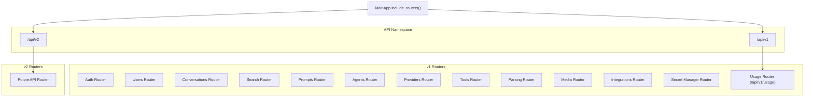
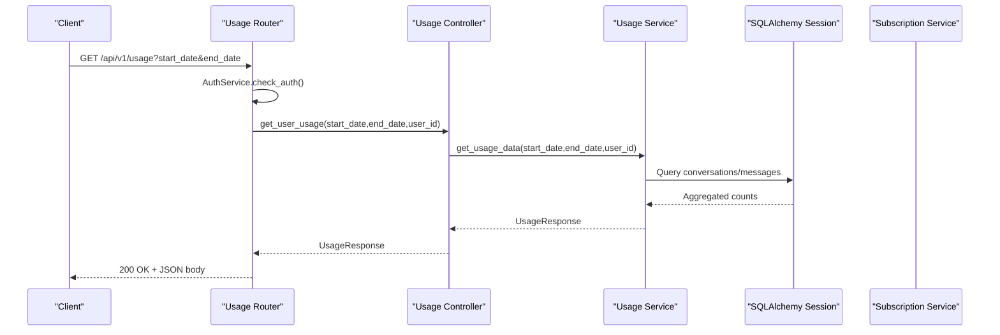
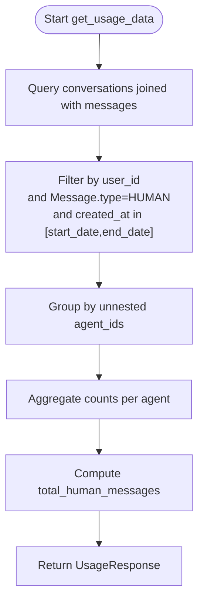
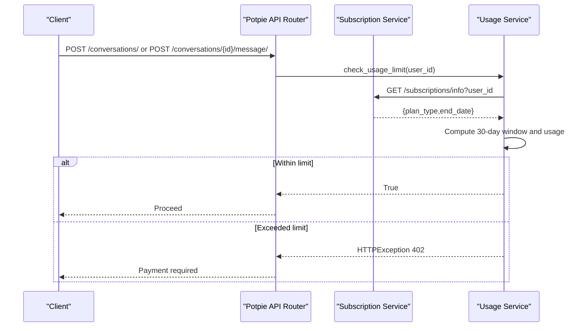
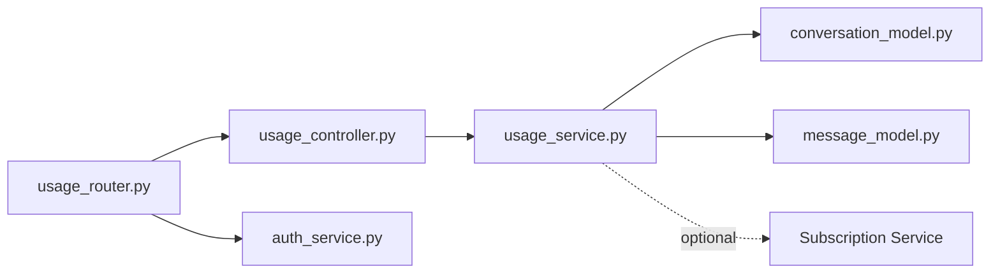

# Usage API

<cite>
**Referenced Files in This Document**
- [main.py](file://app/main.py)
- [router.py](file://app/api/router.py)
- [usage_router.py](file://app/modules/usage/usage_router.py)
- [usage_controller.py](file://app/modules/usage/usage_controller.py)
- [usage_service.py](file://app/modules/usage/usage_service.py)
- [usage_schema.py](file://app/modules/usage/usage_schema.py)
- [auth_service.py](file://app/modules/auth/auth_service.py)
- [conversation_model.py](file://app/modules/conversations/conversation/conversation_model.py)
- [message_model.py](file://app/modules/conversations/message/message_model.py)
- [.env.template](file://.env.template)
- [logging_middleware.py](file://app/modules/utils/logging_middleware.py)
</cite>

## Table of Contents
1. [Introduction](#introduction)
2. [Project Structure](#project-structure)
3. [Core Components](#core-components)
4. [Architecture Overview](#architecture-overview)
5. [Detailed Component Analysis](#detailed-component-analysis)
6. [Dependency Analysis](#dependency-analysis)
7. [Performance Considerations](#performance-considerations)
8. [Troubleshooting Guide](#troubleshooting-guide)
9. [Conclusion](#conclusion)
10. [Appendices](#appendices)

## Introduction
This document provides comprehensive API documentation for Potpie’s usage tracking and analytics system. It covers HTTP endpoints, request/response schemas, usage monitoring, quota enforcement, and integration points with subscription and billing systems. It also includes usage metrics, rate limiting behavior, subscription management integration, analytics data collection, alerting and threshold monitoring guidance, cost optimization recommendations, and privacy/compliance considerations.

## Project Structure
The usage API is exposed under the v1 API namespace and integrates with authentication, conversation/message models, and subscription/billing services. The main application wires routers and includes the usage router under the v1 prefix.

**Diagram sources**
- [main.py](file://app/main.py#L147-L171)

**Section sources**
- [main.py](file://app/main.py#L147-L171)

## Core Components
- Usage Router: Defines the GET /api/v1/usage endpoint for retrieving usage metrics for a user within a date range.
- Usage Controller: Orchestrates calls to the service layer and returns typed responses.
- Usage Service: Implements usage data retrieval and subscription-based quota enforcement.
- Usage Schema: Pydantic model defining the response payload for usage reports.
- Authentication: Uses bearer tokens or development-mode mock authentication to authorize requests.
- Conversation/Message Models: Underpin usage metrics by counting human messages within conversations.

Key responsibilities:
- Retrieve per-user usage counts for human messages grouped by agent and totals.
- Enforce monthly message limits based on subscription plan type.
- Integrate with subscription service for plan and limit determination.

**Section sources**
- [usage_router.py](file://app/modules/usage/usage_router.py#L12-L21)
- [usage_controller.py](file://app/modules/usage/usage_controller.py#L7-L13)
- [usage_service.py](file://app/modules/usage/usage_service.py#L14-L93)
- [usage_schema.py](file://app/modules/usage/usage_schema.py#L6-L8)
- [auth_service.py](file://app/modules/auth/auth_service.py#L47-L104)
- [conversation_model.py](file://app/modules/conversations/conversation/conversation_model.py#L23-L60)
- [message_model.py](file://app/modules/conversations/message/message_model.py#L23-L65)

## Architecture Overview
The usage API follows a layered architecture:
- Router layer validates and extracts parameters.
- Controller layer delegates to service layer.
- Service layer performs database queries and optional subscription service integration.
- Response is returned as a strongly-typed Pydantic model.

**Diagram sources**
- [usage_router.py](file://app/modules/usage/usage_router.py#L14-L21)
- [usage_controller.py](file://app/modules/usage/usage_controller.py#L9-L13)
- [usage_service.py](file://app/modules/usage/usage_service.py#L16-L47)
- [auth_service.py](file://app/modules/auth/auth_service.py#L47-L104)

## Detailed Component Analysis

### Endpoint: GET /api/v1/usage
- Method: GET
- Path: /api/v1/usage
- Description: Returns usage statistics for a user within a given date range.
- Authentication: Bearer token via Firebase or development-mode mock.
- Query Parameters:
  - start_date: datetime (required)
  - end_date: datetime (required)
- Response Model: UsageResponse
  - total_human_messages: integer
  - agent_message_counts: object mapping agent_id to message count

Request example:
- Method: GET
- Headers: Authorization: Bearer <id_token>
- Query: start_date=2025-10-01T00:00:00Z&end_date=2025-10-31T23:59:59Z

Response example:
- Status: 200 OK
- Body:
  - total_human_messages: 120
  - agent_message_counts:
    - "<agent_id_1>": 75
    - "<agent_id_2>": 45

Error responses:
- 401 Unauthorized: Missing or invalid bearer token.
- 400 Bad Request: Invalid date range or malformed parameters.
- 500 Internal Server Error: Database or service failure.

**Section sources**
- [usage_router.py](file://app/modules/usage/usage_router.py#L14-L21)
- [usage_schema.py](file://app/modules/usage/usage_schema.py#L6-L8)
- [auth_service.py](file://app/modules/auth/auth_service.py#L47-L104)

### Usage Metrics and Data Collection
- Metric: Count of human messages per agent within the specified period.
- Aggregation: Grouped by agent_id extracted from conversation.agent_ids.
- Total: Sum of all human messages in the period.
- Data sources: conversations and messages tables filtered by user_id, message type, and timestamps.

**Diagram sources**
- [usage_service.py](file://app/modules/usage/usage_service.py#L16-L47)
- [conversation_model.py](file://app/modules/conversations/conversation/conversation_model.py#L37-L38)
- [message_model.py](file://app/modules/conversations/message/message_model.py#L17-L20)

**Section sources**
- [usage_service.py](file://app/modules/usage/usage_service.py#L16-L47)
- [conversation_model.py](file://app/modules/conversations/conversation/conversation_model.py#L37-L38)
- [message_model.py](file://app/modules/conversations/message/message_model.py#L17-L20)

### Rate Limiting and Quota Management
- Invocation sites: The usage service is also invoked during conversation creation and messaging to enforce quotas.
- Behavior:
  - If SUBSCRIPTION_BASE_URL is not configured, quota enforcement is disabled.
  - Otherwise, the service calls the subscription service to fetch plan info and calculates a 30-day window.
  - Limits: 50 messages/month for free plan, 500/month for pro plan.
  - Exceeding the limit raises a payment-required error.

**Diagram sources**
- [router.py](file://app/api/router.py#L109-L109)
- [router.py](file://app/api/router.py#L168-L173)
- [usage_service.py](file://app/modules/usage/usage_service.py#L50-L93)

**Section sources**
- [router.py](file://app/api/router.py#L109-L109)
- [router.py](file://app/api/router.py#L168-L173)
- [usage_service.py](file://app/modules/usage/usage_service.py#L50-L93)

### Subscription Management Integration
- Environment: SUBSCRIPTION_BASE_URL must be set to integrate with the subscription service.
- Endpoint: GET {SUBSCRIPTION_BASE_URL}/subscriptions/info?user_id
- Response fields used:
  - plan_type: free or pro
  - end_date: ISO timestamp indicating plan validity boundary
- Fallback behavior: If subscription service is unreachable, defaults to free plan with no expiry.

**Section sources**
- [usage_service.py](file://app/modules/usage/usage_service.py#L51-L70)
- [.env.template](file://.env.template#L1-L116)

### Analytics Data Collection
- Current scope: Human message counts per agent and total per month.
- Additional signals can be derived from:
  - Conversation metadata (e.g., project_ids, visibility).
  - Message attachments presence.
  - Provider and agent usage attribution.

**Section sources**
- [conversation_model.py](file://app/modules/conversations/conversation/conversation_model.py#L37-L47)
- [message_model.py](file://app/modules/conversations/message/message_model.py#L52-L53)

### Usage Alerts and Threshold Monitoring
- Built-in enforcement: 402 Payment Required when limits are exceeded.
- Recommended monitoring:
  - Track total_human_messages over rolling 30-day windows.
  - Alert thresholds at 70%, 90%, and 100% of plan limits.
  - Surface usage trends in dashboards for proactive customer care.

[No sources needed since this section provides general guidance]

### Cost Optimization Recommendations
- Cache and reuse frequently accessed conversation/message data.
- Batch analytics queries and precompute aggregates where feasible.
- Right-size plans based on observed usage percentiles.
- Encourage off-peak usage to align with provider pricing.

[No sources needed since this section provides general guidance]

## Dependency Analysis
The usage API depends on authentication, database models, and optionally the subscription service.

**Diagram sources**
- [usage_router.py](file://app/modules/usage/usage_router.py#L1-L21)
- [usage_controller.py](file://app/modules/usage/usage_controller.py#L1-L13)
- [usage_service.py](file://app/modules/usage/usage_service.py#L1-L11)
- [conversation_model.py](file://app/modules/conversations/conversation/conversation_model.py#L1-L60)
- [message_model.py](file://app/modules/conversations/message/message_model.py#L1-L65)
- [auth_service.py](file://app/modules/auth/auth_service.py#L1-L108)

**Section sources**
- [usage_router.py](file://app/modules/usage/usage_router.py#L1-L21)
- [usage_controller.py](file://app/modules/usage/usage_controller.py#L1-L13)
- [usage_service.py](file://app/modules/usage/usage_service.py#L1-L11)
- [auth_service.py](file://app/modules/auth/auth_service.py#L1-L108)

## Performance Considerations
- Database indexing: Ensure indexes on user_id, created_at, and message type for efficient filtering.
- Query granularity: Grouping by agent_id uses array unnesting; consider materialized aggregates for high-volume tenants.
- Caching: Cache recent usage windows for repeated reads.
- Asynchronous calls: Subscription service calls are async; ensure timeouts and retries are configured appropriately.

[No sources needed since this section provides general guidance]

## Troubleshooting Guide
Common issues and resolutions:
- 401 Unauthorized:
  - Cause: Missing or invalid bearer token.
  - Resolution: Provide a valid Firebase ID token or enable development mode with defaultUsername.
- 402 Payment Required:
  - Cause: Monthly message limit exceeded for the user’s plan.
  - Resolution: Upgrade plan or reduce usage within the 30-day window.
- 500 Internal Server Error:
  - Cause: Database errors or subscription service unavailability.
  - Resolution: Check logs and retry; subscription service fallback applies when unavailable.

Operational logging:
- Request-level context injection includes request_id, path, method, and user_id.
- Use X-Request-ID in responses for end-to-end tracing.

**Section sources**
- [auth_service.py](file://app/modules/auth/auth_service.py#L68-L104)
- [usage_service.py](file://app/modules/usage/usage_service.py#L45-L47)
- [usage_service.py](file://app/modules/usage/usage_service.py#L64-L70)
- [logging_middleware.py](file://app/modules/utils/logging_middleware.py#L20-L59)

## Conclusion
The usage API provides a focused mechanism to report human message counts per agent and enforce monthly quotas based on subscription plans. It integrates cleanly with authentication, database models, and optional subscription services. Extending the system to include richer analytics, alerting, and cost optimization requires minimal architectural changes while maintaining strong typing and robust error handling.

[No sources needed since this section summarizes without analyzing specific files]

## Appendices

### Endpoint Reference: GET /api/v1/usage
- Method: GET
- Path: /api/v1/usage
- Auth: Bearer token or development-mode mock
- Query:
  - start_date: datetime (required)
  - end_date: datetime (required)
- Response:
  - total_human_messages: integer
  - agent_message_counts: object mapping agent_id to integer count

**Section sources**
- [usage_router.py](file://app/modules/usage/usage_router.py#L14-L21)
- [usage_schema.py](file://app/modules/usage/usage_schema.py#L6-L8)

### Request/Response Examples
- Example request:
  - GET /api/v1/usage?start_date=2025-10-01T00:00:00Z&end_date=2025-10-31T23:59:59Z
  - Headers: Authorization: Bearer <id_token>
- Example response:
  - {
    "total_human_messages": 120,
    "agent_message_counts": {
      "<agent_id_1>": 75,
      "<agent_id_2>": 45
    }
  }

**Section sources**
- [usage_router.py](file://app/modules/usage/usage_router.py#L14-L21)
- [usage_schema.py](file://app/modules/usage/usage_schema.py#L6-L8)

### Privacy and Compliance Considerations
- Data minimization: Only collect and retain usage metrics necessary for billing and analytics.
- Retention: Define and enforce data retention policies aligned with compliance needs.
- Audit logging: Consider capturing access to usage endpoints for security monitoring.
- Data subject rights: Provide mechanisms for data portability and erasure where applicable.

[No sources needed since this section provides general guidance]