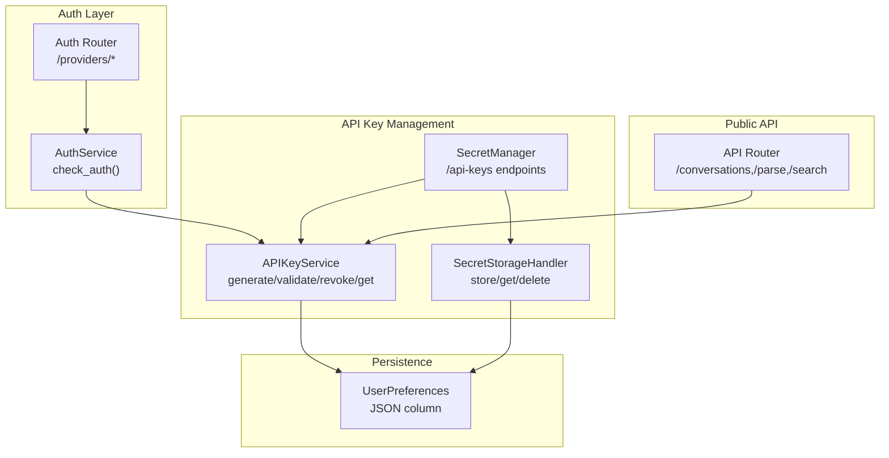
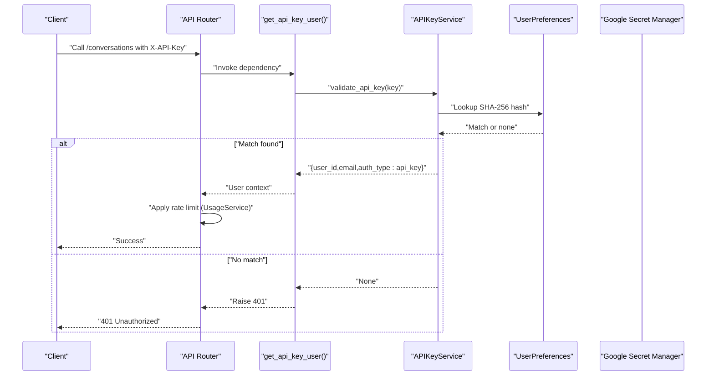
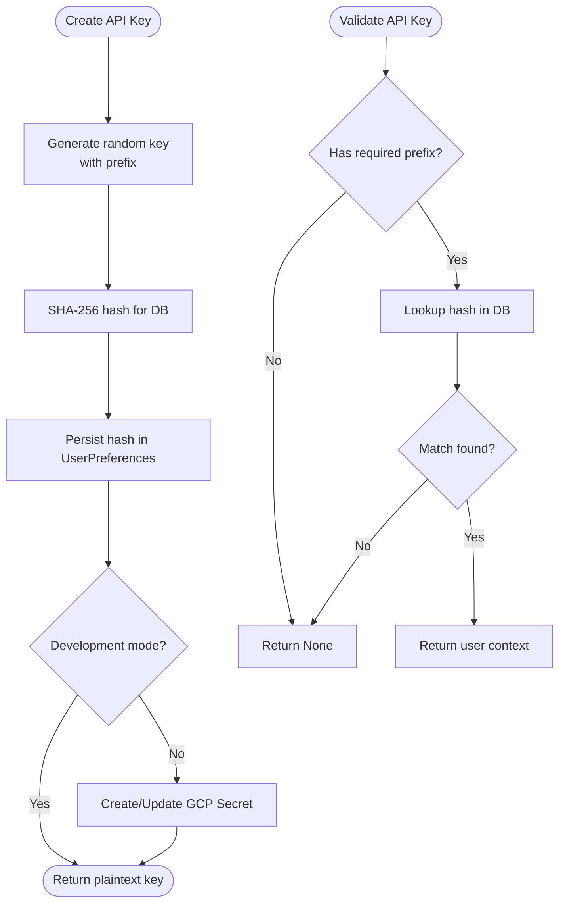
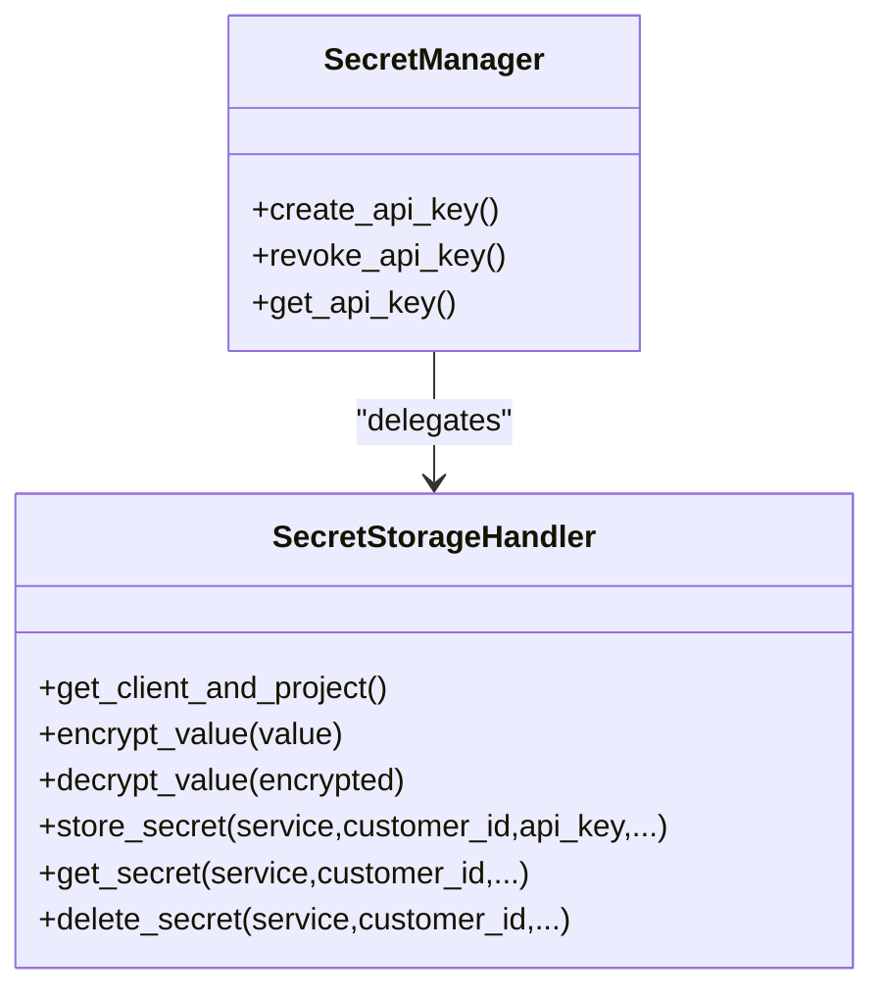
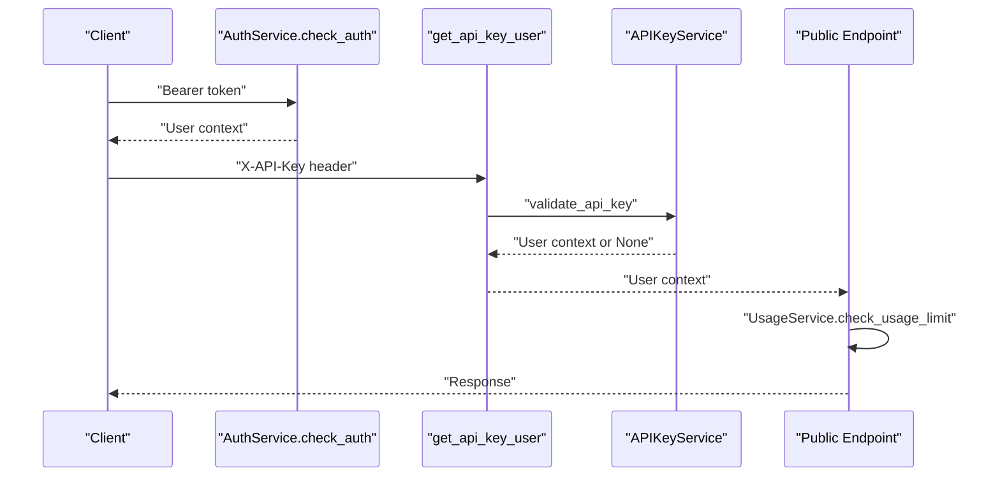
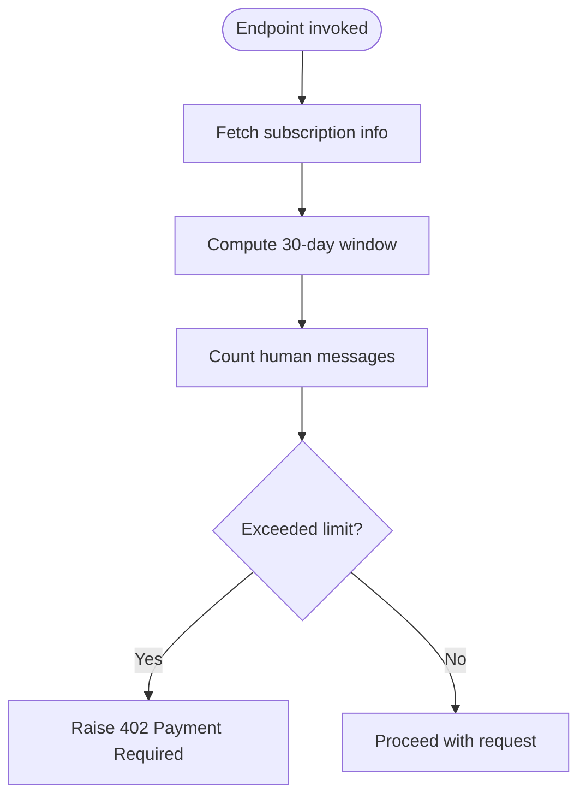
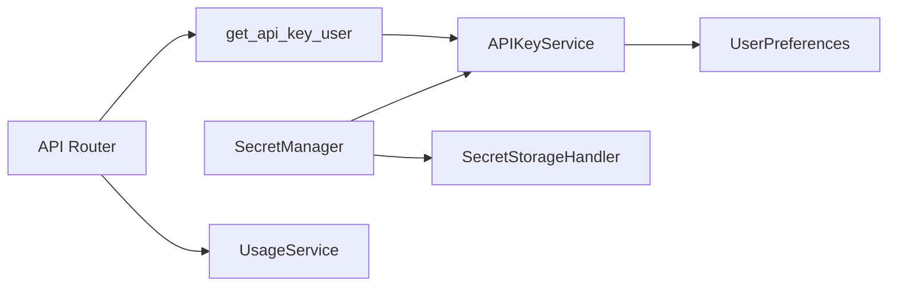

# API Key Management

<cite>
**Referenced Files in This Document**
- [api_key_service.py](file://app/modules/auth/api_key_service.py)
- [secret_manager.py](file://app/modules/key_management/secret_manager.py)
- [secrets_schema.py](file://app/modules/key_management/secrets_schema.py)
- [auth_service.py](file://app/modules/auth/auth_service.py)
- [auth_router.py](file://app/modules/auth/auth_router.py)
- [router.py](file://app/api/router.py)
- [user_preferences_model.py](file://app/modules/users/user_preferences_model.py)
- [usage_service.py](file://app/modules/usage/usage_service.py)
- [.env.template](file://.env.template)
</cite>

## Table of Contents
1. [Introduction](#introduction)
2. [Project Structure](#project-structure)
3. [Core Components](#core-components)
4. [Architecture Overview](#architecture-overview)
5. [Detailed Component Analysis](#detailed-component-analysis)
6. [Dependency Analysis](#dependency-analysis)
7. [Performance Considerations](#performance-considerations)
8. [Troubleshooting Guide](#troubleshooting-guide)
9. [Conclusion](#conclusion)
10. [Appendices](#appendices)

## Introduction
This document explains the API key management system in the project, covering generation, validation, rotation, revocation, secret storage, encryption, and secure retrieval. It also documents configuration options, integration with authentication flows, and practical examples for creating keys, validating requests, and managing lifecycles. The content is designed to be accessible to beginners while providing sufficient technical depth for experienced developers.

## Project Structure
The API key management spans several modules:
- Authentication and API key lifecycle: app/modules/auth/api_key_service.py
- Secret storage and retrieval: app/modules/key_management/secret_manager.py
- Request/response schemas for secrets: app/modules/key_management/secrets_schema.py
- Authentication middleware and routes: app/modules/auth/auth_service.py, app/modules/auth/auth_router.py
- Public API endpoints protected by API keys: app/api/router.py
- User preferences persistence: app/modules/users/user_preferences_model.py
- Usage checks (rate limiting): app/modules/usage/usage_service.py
- Environment configuration: .env.template

**Diagram sources**
- [auth_service.py](file://app/modules/auth/auth_service.py#L48-L104)
- [auth_router.py](file://app/modules/auth/auth_router.py#L42-L838)
- [api_key_service.py](file://app/modules/auth/api_key_service.py#L18-L191)
- [secret_manager.py](file://app/modules/key_management/secret_manager.py#L503-L1009)
- [router.py](file://app/api/router.py#L56-L88)
- [user_preferences_model.py](file://app/modules/users/user_preferences_model.py#L7-L16)

**Section sources**
- [api_key_service.py](file://app/modules/auth/api_key_service.py#L18-L191)
- [secret_manager.py](file://app/modules/key_management/secret_manager.py#L503-L1009)
- [auth_service.py](file://app/modules/auth/auth_service.py#L48-L104)
- [auth_router.py](file://app/modules/auth/auth_router.py#L42-L838)
- [router.py](file://app/api/router.py#L56-L88)
- [user_preferences_model.py](file://app/modules/users/user_preferences_model.py#L7-L16)

## Core Components
- APIKeyService: Generates, hashes, stores, validates, retrieves, and revokes API keys. Stores the SHA-256 hash in the database and the plaintext key in Google Secret Manager (except in development mode).
- SecretManager: Exposes REST endpoints to create, retrieve, and revoke API keys for users, integrating with SecretStorageHandler and AuthService.
- SecretStorageHandler: Centralized logic for storing and retrieving secrets across Google Secret Manager and database fallback, with encryption for local storage.
- Secrets Schema: Pydantic models for secret creation/update requests and responses.
- API Router: Public endpoints that depend on get_api_key_user to validate API keys and enforce usage limits.
- UsageService: Enforces rate limiting per user based on subscription plan and message counts.
- Environment: Configuration flags for development mode, GCP project, and encryption keys.

**Section sources**
- [api_key_service.py](file://app/modules/auth/api_key_service.py#L18-L191)
- [secret_manager.py](file://app/modules/key_management/secret_manager.py#L503-L1009)
- [secrets_schema.py](file://app/modules/key_management/secrets_schema.py#L7-L140)
- [router.py](file://app/api/router.py#L56-L88)
- [usage_service.py](file://app/modules/usage/usage_service.py#L14-L94)
- [.env.template](file://.env.template#L1-L116)

## Architecture Overview
The system integrates API key authentication into public endpoints via a dependency that validates the key against the database and optionally retrieves the plaintext key from Google Secret Manager. Secrets are stored securely with a layered approach: GCP Secret Manager for production and database encryption fallback for development.

**Diagram sources**
- [router.py](file://app/api/router.py#L56-L88)
- [api_key_service.py](file://app/modules/auth/api_key_service.py#L104-L137)
- [user_preferences_model.py](file://app/modules/users/user_preferences_model.py#L7-L16)
- [usage_service.py](file://app/modules/usage/usage_service.py#L50-L93)

## Detailed Component Analysis

### APIKeyService
Responsibilities:
- Generate a prefixed API key using cryptographically secure randomness.
- Hash the key with SHA-256 for storage and comparison.
- Create and store the hashed key in the user’s preferences.
- Store the plaintext key in Google Secret Manager (non-development mode).
- Validate an API key by checking the prefix and matching the stored hash.
- Revoke a key by removing the hash from preferences and deleting the secret from GCP.
- Retrieve the plaintext key from GCP (not available in development mode).

Key behaviors:
- Prefix enforcement: Keys must start with a specific prefix.
- Hash-only storage in DB: Never stores plaintext in the database.
- GCP Secret Manager integration: Creates/updates secrets and versions; deletes on revocation.
- Development mode safety: Disables retrieval of plaintext keys in development.

**Diagram sources**
- [api_key_service.py](file://app/modules/auth/api_key_service.py#L44-L101)
- [api_key_service.py](file://app/modules/auth/api_key_service.py#L104-L137)

**Section sources**
- [api_key_service.py](file://app/modules/auth/api_key_service.py#L18-L191)
- [user_preferences_model.py](file://app/modules/users/user_preferences_model.py#L7-L16)

### SecretManager and SecretStorageHandler
Responsibilities:
- Expose REST endpoints to create, retrieve, and revoke API keys.
- Store and retrieve arbitrary secrets (including integration keys) using SecretStorageHandler.
- Fallback to database encryption when GCP is unavailable.
- Encrypt/decrypt secrets using a symmetric key when stored locally.

Key behaviors:
- GCP availability check: One-time initialization with caching.
- Secret ID formatting: Standardized identifiers for GCP secrets.
- Encryption: Uses a Fernet key for local storage fallback.
- Bulk operations: Parallel processing for multiple services.

**Diagram sources**
- [secret_manager.py](file://app/modules/key_management/secret_manager.py#L550-L610)
- [secret_manager.py](file://app/modules/key_management/secret_manager.py#L32-L332)

**Section sources**
- [secret_manager.py](file://app/modules/key_management/secret_manager.py#L503-L1009)
- [secret_manager.py](file://app/modules/key_management/secret_manager.py#L32-L332)
- [secrets_schema.py](file://app/modules/key_management/secrets_schema.py#L7-L140)

### Authentication Integration
- AuthService.check_auth enforces bearer token authentication and supports a development mode bypass.
- get_api_key_user depends on APIKeyService.validate_api_key to authorize public endpoints.
- Public endpoints apply usage checks via UsageService.

**Diagram sources**
- [auth_service.py](file://app/modules/auth/auth_service.py#L48-L104)
- [router.py](file://app/api/router.py#L56-L88)
- [api_key_service.py](file://app/modules/auth/api_key_service.py#L104-L137)
- [usage_service.py](file://app/modules/usage/usage_service.py#L50-L93)

**Section sources**
- [auth_service.py](file://app/modules/auth/auth_service.py#L48-L104)
- [auth_router.py](file://app/modules/auth/auth_router.py#L42-L838)
- [router.py](file://app/api/router.py#L56-L88)
- [usage_service.py](file://app/modules/usage/usage_service.py#L50-L93)

### Rate Limiting and Access Controls
- UsageService.check_usage_limit enforces message caps based on subscription plan and monthly usage.
- Public endpoints call this before processing requests.
- Subscription service is queried asynchronously with a timeout and sensible defaults.

**Diagram sources**
- [usage_service.py](file://app/modules/usage/usage_service.py#L50-L93)

**Section sources**
- [usage_service.py](file://app/modules/usage/usage_service.py#L14-L94)
- [router.py](file://app/api/router.py#L97-L120)

## Dependency Analysis
- API Router depends on get_api_key_user, which depends on APIKeyService.
- APIKeyService depends on UserPreferences for hashed key storage.
- SecretManager depends on APIKeyService and SecretStorageHandler.
- SecretStorageHandler depends on Google Secret Manager client and database/UserPreferences.
- UsageService is invoked by API endpoints to enforce limits.

**Diagram sources**
- [router.py](file://app/api/router.py#L56-L88)
- [api_key_service.py](file://app/modules/auth/api_key_service.py#L18-L191)
- [secret_manager.py](file://app/modules/key_management/secret_manager.py#L503-L1009)
- [user_preferences_model.py](file://app/modules/users/user_preferences_model.py#L7-L16)
- [usage_service.py](file://app/modules/usage/usage_service.py#L50-L93)

**Section sources**
- [router.py](file://app/api/router.py#L56-L88)
- [api_key_service.py](file://app/modules/auth/api_key_service.py#L18-L191)
- [secret_manager.py](file://app/modules/key_management/secret_manager.py#L503-L1009)
- [user_preferences_model.py](file://app/modules/users/user_preferences_model.py#L7-L16)
- [usage_service.py](file://app/modules/usage/usage_service.py#L50-L93)

## Performance Considerations
- Hash-based lookup: SHA-256 hashing ensures constant-time comparisons and avoids storing plaintext in the database.
- GCP Secret Manager: Efficient secret versioning and retrieval; caching of client/project availability reduces repeated initialization overhead.
- Database index: UserPreferences table includes an index on user_id to optimize lookups.
- Asynchronous operations: SecretManager endpoints are async to minimize blocking during I/O-bound operations.
- Encryption cost: Local fallback uses symmetric encryption; consider hardware security module (HSM) or managed KMS for production-grade encryption.

[No sources needed since this section provides general guidance]

## Troubleshooting Guide
Common issues and resolutions:
- Missing GCP_PROJECT: Secret Manager client initialization requires this environment variable. Ensure it is set in production.
- Invalid SECRET_ENCRYPTION_KEY: The Fernet key must be present and valid for local storage fallback.
- Development mode restrictions: Retrieving plaintext API keys is disabled in development mode for security.
- Validation failures: Keys must include the required prefix; otherwise validation returns None and a 401 is raised.
- Revocation cleanup: If GCP deletion fails, the database hash is still removed; verify both storage backends.
- Rate limit exceeded: UsageService raises 402 when message limits are reached; adjust plan or reduce usage.

**Section sources**
- [api_key_service.py](file://app/modules/auth/api_key_service.py#L22-L42)
- [secret_manager.py](file://app/modules/key_management/secret_manager.py#L84-L98)
- [secret_manager.py](file://app/modules/key_management/secret_manager.py#L177-L190)
- [router.py](file://app/api/router.py#L62-L87)
- [usage_service.py](file://app/modules/usage/usage_service.py#L87-L93)

## Conclusion
The API key management system provides a secure, layered approach to key lifecycle management. It stores sensitive data in Google Secret Manager in production and falls back to encrypted database storage in development. Requests are validated centrally, and usage limits are enforced to prevent abuse. By following the configuration and operational guidance here, teams can implement robust API access patterns with minimal risk.

[No sources needed since this section summarizes without analyzing specific files]

## Appendices

### Configuration Options
- Environment variables:
  - isDevelopmentMode: Enables development mode and disables GCP Secret Manager retrieval.
  - GCP_PROJECT: Required for GCP Secret Manager client initialization.
  - SECRET_ENCRYPTION_KEY: Required for local encryption fallback.
  - SUBSCRIPTION_BASE_URL: Enables subscription-based rate limiting.
  - INTERNAL_ADMIN_SECRET: Allows admin bypass for internal tools.
- Example environment template: See .env.template for defaults and placeholders.

**Section sources**
- [.env.template](file://.env.template#L1-L116)
- [secret_manager.py](file://app/modules/key_management/secret_manager.py#L84-L98)
- [api_key_service.py](file://app/modules/auth/api_key_service.py#L22-L42)
- [router.py](file://app/api/router.py#L69-L76)

### Practical Examples (by file reference)
- Create an API key:
  - Call SecretManager endpoint: [create_api_key](file://app/modules/key_management/secret_manager.py#L943-L957)
  - Underlying service: [APIKeyService.create_api_key](file://app/modules/auth/api_key_service.py#L56-L101)
- Validate a request:
  - Dependency: [get_api_key_user](file://app/api/router.py#L56-L87)
  - Validation logic: [APIKeyService.validate_api_key](file://app/modules/auth/api_key_service.py#L104-L137)
- Revoke an API key:
  - Endpoint: [revoke_api_key](file://app/modules/key_management/secret_manager.py#L959-L973)
  - Service: [APIKeyService.revoke_api_key](file://app/modules/auth/api_key_service.py#L140-L166)
- Retrieve an API key (production only):
  - Endpoint: [get_api_key](file://app/modules/key_management/secret_manager.py#L975-L997)
  - Service: [APIKeyService.get_api_key](file://app/modules/auth/api_key_service.py#L169-L190)
- Rate limiting:
  - Usage check: [UsageService.check_usage_limit](file://app/modules/usage/usage_service.py#L50-L93)

**Section sources**
- [secret_manager.py](file://app/modules/key_management/secret_manager.py#L943-L997)
- [api_key_service.py](file://app/modules/auth/api_key_service.py#L56-L190)
- [router.py](file://app/api/router.py#L56-L87)
- [usage_service.py](file://app/modules/usage/usage_service.py#L50-L93)