# Authentication & Authorization

<cite>
**Referenced Files in This Document**
- [auth_router.py](file://app/modules/auth/auth_router.py)
- [auth_service.py](file://app/modules/auth/auth_service.py)
- [unified_auth_service.py](file://app/modules/auth/unified_auth_service.py)
- [auth_schema.py](file://app/modules/auth/auth_schema.py)
- [google_provider.py](file://app/modules/auth/sso_providers/google_provider.py)
- [base_provider.py](file://app/modules/auth/sso_providers/base_provider.py)
- [provider_registry.py](file://app/modules/auth/sso_providers/provider_registry.py)
- [auth_provider_model.py](file://app/modules/auth/auth_provider_model.py)
- [user_model.py](file://app/modules/users/user_model.py)
- [user_preferences_model.py](file://app/modules/users/user_preferences_model.py)
- [api_key_service.py](file://app/modules/auth/api_key_service.py)
- [token_encryption.py](file://app/modules/integrations/token_encryption.py)
- [APIRouter.py](file://app/modules/utils/APIRouter.py)
</cite>

## Table of Contents
1. [Introduction](#introduction)
2. [Project Structure](#project-structure)
3. [Core Components](#core-components)
4. [Architecture Overview](#architecture-overview)
5. [Detailed Component Analysis](#detailed-component-analysis)
6. [Dependency Analysis](#dependency-analysis)
7. [Performance Considerations](#performance-considerations)
8. [Troubleshooting Guide](#troubleshooting-guide)
9. [Conclusion](#conclusion)
10. [Appendices](#appendices)

## Introduction
This document explains Potpie’s authentication and authorization system with a focus on multi-provider authentication and user management. It covers how the system handles user login, session-like persistence via bearer tokens, and access control across multiple providers (Google SSO, GitHub, and legacy email/password). It documents provider integration patterns, token management, user preferences, API key handling, and security best practices. The content is organized for both beginners (conceptual flows) and experienced developers (code-level details, schemas, and flows).

## Project Structure
The authentication subsystem is primarily located under app/modules/auth and integrates with user and preferences models, SSO provider abstractions, and token encryption utilities. Supporting components include:
- Public API endpoints for login, signup, SSO, provider management, and account info
- Services for authentication, unified multi-provider orchestration, and API key management
- Models for user, providers, pending links, organization SSO config, and audit logs
- SSO provider registry and pluggable provider implementations
- Token encryption utilities for secure storage of OAuth tokens

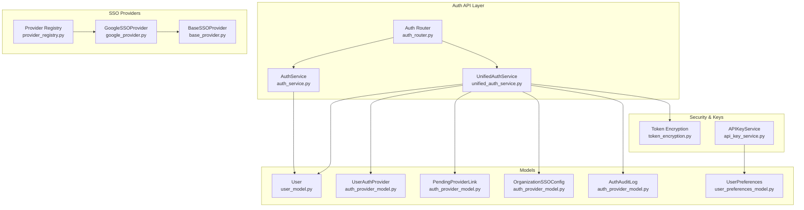

**Diagram sources**
- [auth_router.py](file://app/modules/auth/auth_router.py#L52-L838)
- [auth_service.py](file://app/modules/auth/auth_service.py#L14-L108)
- [unified_auth_service.py](file://app/modules/auth/unified_auth_service.py#L57-L1274)
- [auth_provider_model.py](file://app/modules/auth/auth_provider_model.py#L25-L200)
- [user_model.py](file://app/modules/users/user_model.py#L17-L59)
- [user_preferences_model.py](file://app/modules/users/user_preferences_model.py#L7-L16)
- [provider_registry.py](file://app/modules/auth/sso_providers/provider_registry.py#L22-L103)
- [base_provider.py](file://app/modules/auth/sso_providers/base_provider.py#L26-L110)
- [google_provider.py](file://app/modules/auth/sso_providers/google_provider.py#L23-L227)
- [token_encryption.py](file://app/modules/integrations/token_encryption.py#L14-L108)
- [api_key_service.py](file://app/modules/auth/api_key_service.py#L18-L191)

**Section sources**
- [auth_router.py](file://app/modules/auth/auth_router.py#L42-L838)
- [auth_service.py](file://app/modules/auth/auth_service.py#L14-L108)
- [unified_auth_service.py](file://app/modules/auth/unified_auth_service.py#L57-L1274)
- [auth_provider_model.py](file://app/modules/auth/auth_provider_model.py#L25-L200)
- [user_model.py](file://app/modules/users/user_model.py#L17-L59)
- [user_preferences_model.py](file://app/modules/users/user_preferences_model.py#L7-L16)
- [provider_registry.py](file://app/modules/auth/sso_providers/provider_registry.py#L22-L103)
- [base_provider.py](file://app/modules/auth/sso_providers/base_provider.py#L26-L110)
- [google_provider.py](file://app/modules/auth/sso_providers/google_provider.py#L23-L227)
- [token_encryption.py](file://app/modules/integrations/token_encryption.py#L14-L108)
- [api_key_service.py](file://app/modules/auth/api_key_service.py#L18-L191)

## Core Components
- Auth Router: Public endpoints for login, signup, SSO login, provider linking/unlinking, and account info retrieval. It delegates to AuthService and UnifiedAuthService and enforces bearer auth for protected routes.
- AuthService: Handles legacy email/password login via Identity Toolkit and Firebase user creation; provides bearer token verification for protected routes.
- UnifiedAuthService: Central multi-provider orchestration. Manages provider linking/unlinking, primary provider selection, pending provider links, SSO token verification, audit logging, and GitHub linking requirements.
- SSO Providers: Pluggable provider implementations (currently Google) with standardized token verification and authorization URL generation.
- Models: User, UserAuthProvider, PendingProviderLink, OrganizationSSOConfig, AuthAuditLog; define identities, provider associations, pending links, org policies, and audit trail.
- Token Encryption: Secure storage of OAuth tokens using symmetric encryption with environment-controlled keys.
- APIKeyService: Generates, stores, validates, and revokes user API keys with Secret Manager integration outside development mode.

**Section sources**
- [auth_router.py](file://app/modules/auth/auth_router.py#L52-L838)
- [auth_service.py](file://app/modules/auth/auth_service.py#L14-L108)
- [unified_auth_service.py](file://app/modules/auth/unified_auth_service.py#L57-L1274)
- [auth_provider_model.py](file://app/modules/auth/auth_provider_model.py#L25-L200)
- [token_encryption.py](file://app/modules/integrations/token_encryption.py#L14-L108)
- [api_key_service.py](file://app/modules/auth/api_key_service.py#L18-L191)

## Architecture Overview
The system supports:
- Multi-provider authentication: Google SSO, GitHub OAuth, legacy email/password
- Single-user identity across providers keyed by email
- Provider linking with pending confirmation and primary provider preference
- Secure token storage and rotation patterns
- Audit logging and organization-level SSO enforcement

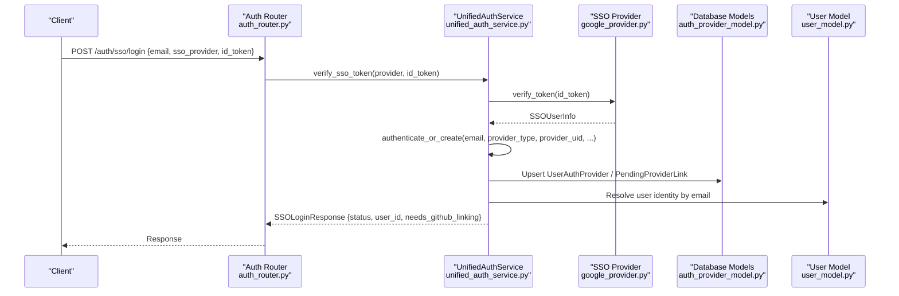

**Diagram sources**
- [auth_router.py](file://app/modules/auth/auth_router.py#L441-L570)
- [unified_auth_service.py](file://app/modules/auth/unified_auth_service.py#L82-L101)
- [google_provider.py](file://app/modules/auth/sso_providers/google_provider.py#L64-L182)
- [auth_provider_model.py](file://app/modules/auth/auth_provider_model.py#L25-L200)
- [user_model.py](file://app/modules/users/user_model.py#L17-L59)

## Detailed Component Analysis

### Authentication Flows

#### Legacy Email/Password Login
- Endpoint: POST /auth/login
- Behavior: Calls AuthService.login to authenticate via Identity Toolkit and returns a token for subsequent bearer auth.
- Security: Relies on Firebase Admin SDK for token verification in protected routes.

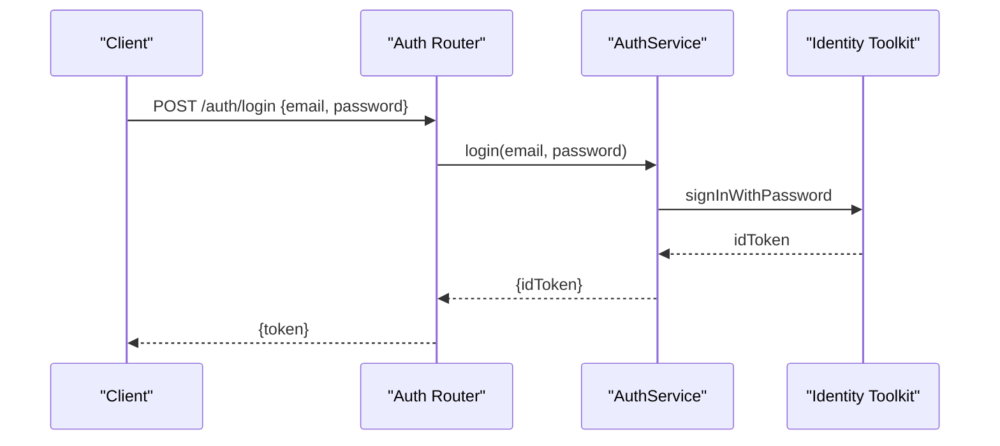

**Diagram sources**
- [auth_router.py](file://app/modules/auth/auth_router.py#L53-L71)
- [auth_service.py](file://app/modules/auth/auth_service.py#L15-L35)

**Section sources**
- [auth_router.py](file://app/modules/auth/auth_router.py#L53-L71)
- [auth_service.py](file://app/modules/auth/auth_service.py#L15-L35)

#### SSO Login (Google and others)
- Endpoint: POST /auth/sso/login
- Flow:
  - Map sso_provider to provider type (e.g., sso_google)
  - Verify ID token via UnifiedAuthService.verify_sso_token
  - Normalize provider_uid and email from verified data
  - Enforce domain policy (personal email blocking for new users)
  - Call authenticate_or_create to resolve or create user
  - Return SSOLoginResponse with status and needs_github_linking flag

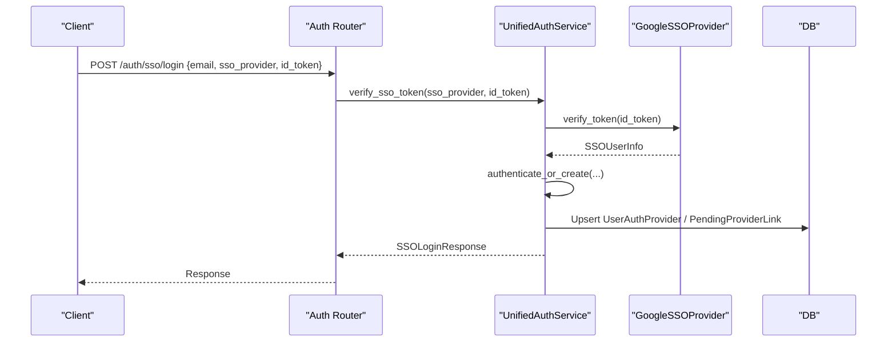

**Diagram sources**
- [auth_router.py](file://app/modules/auth/auth_router.py#L441-L570)
- [unified_auth_service.py](file://app/modules/auth/unified_auth_service.py#L82-L101)
- [google_provider.py](file://app/modules/auth/sso_providers/google_provider.py#L64-L182)

**Section sources**
- [auth_router.py](file://app/modules/auth/auth_router.py#L441-L570)
- [unified_auth_service.py](file://app/modules/auth/unified_auth_service.py#L387-L806)
- [google_provider.py](file://app/modules/auth/sso_providers/google_provider.py#L64-L182)

#### GitHub OAuth Flow (Legacy and Linking)
- Endpoint: POST /auth/signup
- Behavior:
  - Supports GitHub OAuth flow with accessToken and providerUsername
  - Blocks new GitHub sign-ups; allows existing GitHub-linked users to sign in
  - Supports linking GitHub to an existing SSO account via linkToUserId
  - Emits analytics and Slack notifications for new signups

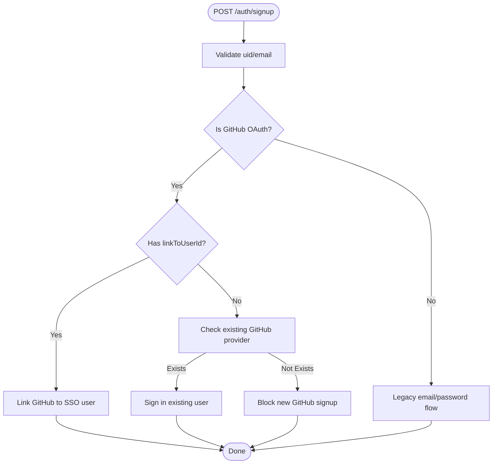

**Diagram sources**
- [auth_router.py](file://app/modules/auth/auth_router.py#L72-L437)

**Section sources**
- [auth_router.py](file://app/modules/auth/auth_router.py#L72-L437)

#### Provider Linking and Management
- Endpoints:
  - POST /auth/providers/confirm-linking
  - DELETE /auth/providers/cancel-linking/{linking_token}
  - GET /auth/providers/me
  - POST /auth/providers/set-primary
  - DELETE /auth/providers/unlink
- Behavior:
  - PendingProviderLink records are created with short expiry
  - confirm-linking finalizes linking; cancel removes pending link
  - set-primary updates primary provider; unlink enforces at least one provider remains

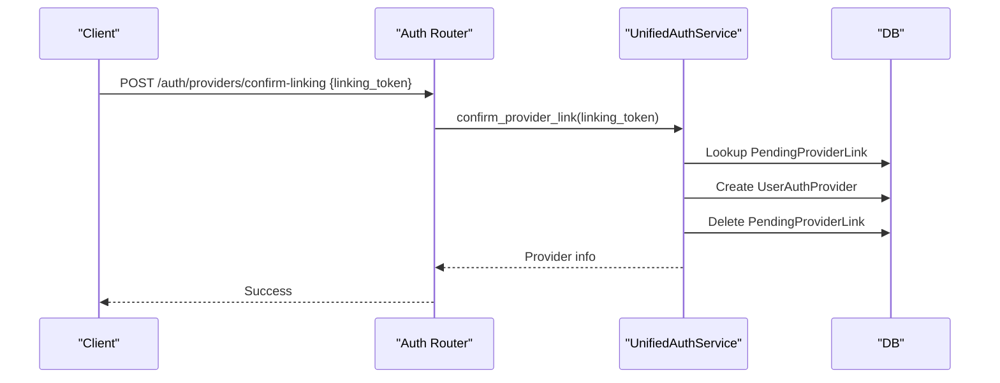

**Diagram sources**
- [auth_router.py](file://app/modules/auth/auth_router.py#L572-L644)
- [unified_auth_service.py](file://app/modules/auth/unified_auth_service.py#L862-L973)

**Section sources**
- [auth_router.py](file://app/modules/auth/auth_router.py#L572-L838)
- [unified_auth_service.py](file://app/modules/auth/unified_auth_service.py#L807-L973)

### SSO Provider Abstractions
- BaseSSOProvider defines the contract for token verification and authorization URL generation.
- GoogleSSOProvider implements verification supporting both Firebase ID tokens and Google OAuth ID tokens, with hosted domain enforcement.
- ProviderRegistry manages singleton provider instances and dynamic registration.

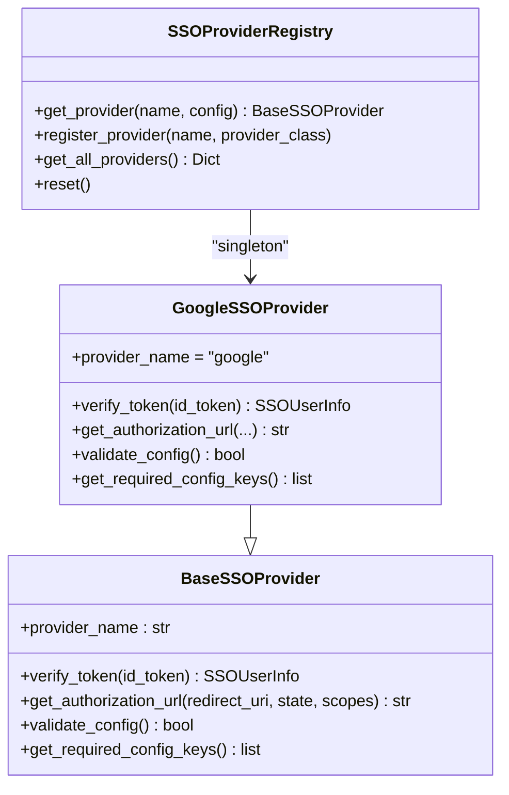

**Diagram sources**
- [base_provider.py](file://app/modules/auth/sso_providers/base_provider.py#L26-L110)
- [google_provider.py](file://app/modules/auth/sso_providers/google_provider.py#L23-L227)
- [provider_registry.py](file://app/modules/auth/sso_providers/provider_registry.py#L22-L103)

**Section sources**
- [base_provider.py](file://app/modules/auth/sso_providers/base_provider.py#L26-L110)
- [google_provider.py](file://app/modules/auth/sso_providers/google_provider.py#L23-L227)
- [provider_registry.py](file://app/modules/auth/sso_providers/provider_registry.py#L22-L103)

### Token Management and Security
- OAuth tokens stored in UserAuthProvider are encrypted before persisting and decrypted on demand.
- Backward compatibility: plaintext tokens are tolerated and logged with warnings.
- Encryption key sourced from environment; auto-generated in development with warnings.

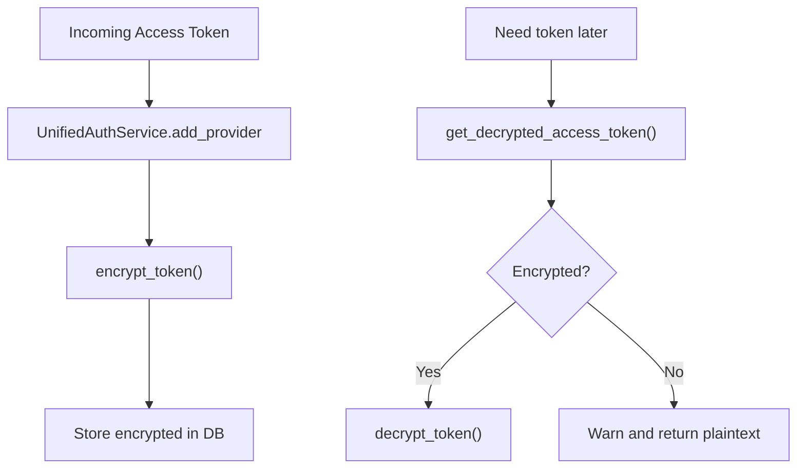

**Diagram sources**
- [unified_auth_service.py](file://app/modules/auth/unified_auth_service.py#L228-L311)
- [unified_auth_service.py](file://app/modules/auth/unified_auth_service.py#L176-L227)
- [token_encryption.py](file://app/modules/integrations/token_encryption.py#L14-L108)

**Section sources**
- [unified_auth_service.py](file://app/modules/auth/unified_auth_service.py#L176-L311)
- [token_encryption.py](file://app/modules/integrations/token_encryption.py#L14-L108)

### API Key Handling
- APIKeyService generates prefixed keys, hashes for DB storage, and stores the plaintext in Secret Manager (non-development).
- Validation compares hashed value from DB; revocation clears hash and deletes secret.

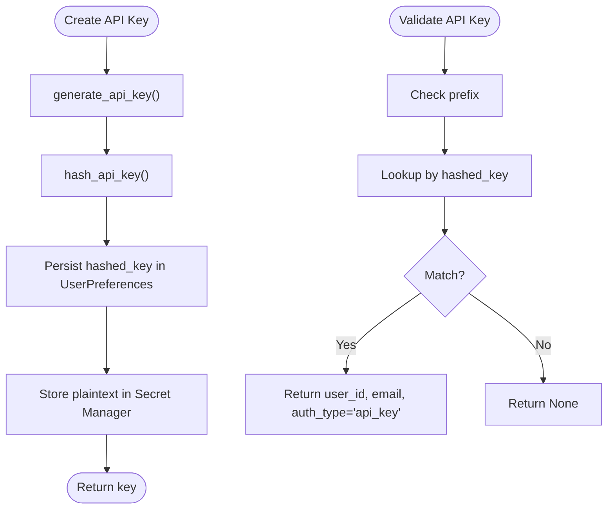

**Diagram sources**
- [api_key_service.py](file://app/modules/auth/api_key_service.py#L56-L101)
- [api_key_service.py](file://app/modules/auth/api_key_service.py#L104-L138)

**Section sources**
- [api_key_service.py](file://app/modules/auth/api_key_service.py#L18-L191)

### Access Control and Session Management
- Bearer token verification via AuthService.check_auth for protected endpoints.
- Protected routes decorated with Depends(AuthService.check_auth) ensure user context is attached to request.state.user.
- APIRouter strips trailing slashes for consistent endpoint paths.

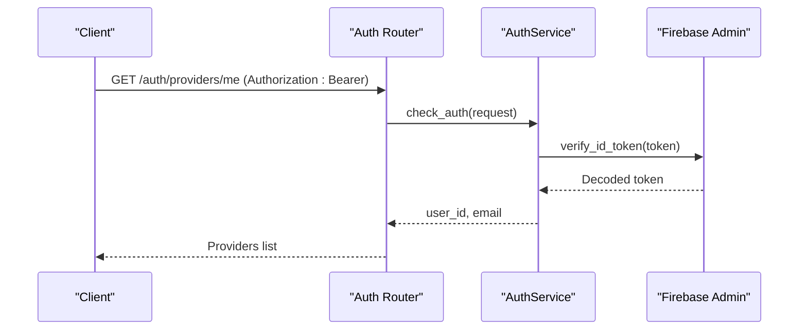

**Diagram sources**
- [auth_router.py](file://app/modules/auth/auth_router.py#L646-L690)
- [auth_service.py](file://app/modules/auth/auth_service.py#L48-L104)
- [APIRouter.py](file://app/modules/utils/APIRouter.py#L7-L28)

**Section sources**
- [auth_router.py](file://app/modules/auth/auth_router.py#L646-L781)
- [auth_service.py](file://app/modules/auth/auth_service.py#L48-L104)
- [APIRouter.py](file://app/modules/utils/APIRouter.py#L7-L28)

## Dependency Analysis
- Auth Router depends on AuthService for legacy flows and UnifiedAuthService for multi-provider orchestration.
- UnifiedAuthService depends on SSOProviderRegistry and provider implementations, models, and token encryption utilities.
- Models encapsulate relationships and constraints; audit logs track all auth events.
- APIKeyService depends on Secret Manager client and UserPreferences.

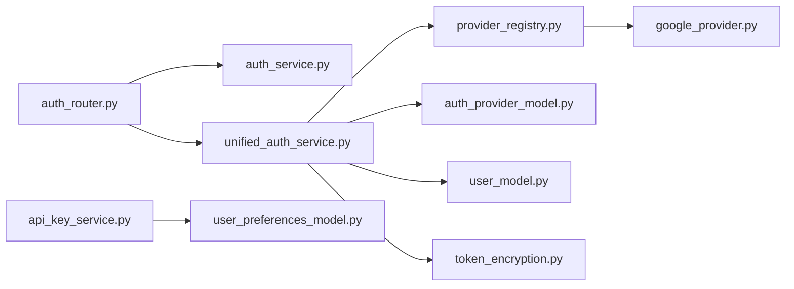

**Diagram sources**
- [auth_router.py](file://app/modules/auth/auth_router.py#L52-L838)
- [auth_service.py](file://app/modules/auth/auth_service.py#L14-L108)
- [unified_auth_service.py](file://app/modules/auth/unified_auth_service.py#L57-L1274)
- [provider_registry.py](file://app/modules/auth/sso_providers/provider_registry.py#L22-L103)
- [google_provider.py](file://app/modules/auth/sso_providers/google_provider.py#L23-L227)
- [auth_provider_model.py](file://app/modules/auth/auth_provider_model.py#L25-L200)
- [user_model.py](file://app/modules/users/user_model.py#L17-L59)
- [token_encryption.py](file://app/modules/integrations/token_encryption.py#L14-L108)
- [api_key_service.py](file://app/modules/auth/api_key_service.py#L18-L191)
- [user_preferences_model.py](file://app/modules/users/user_preferences_model.py#L7-L16)

**Section sources**
- [auth_router.py](file://app/modules/auth/auth_router.py#L52-L838)
- [unified_auth_service.py](file://app/modules/auth/unified_auth_service.py#L57-L1274)

## Performance Considerations
- Provider verification: SSO provider verification is delegated to provider implementations; minimize repeated verifications by caching normalized user info at the service layer when appropriate.
- Token encryption/decryption: Offload encryption to the service layer; batch operations where possible to reduce cryptographic overhead.
- Database queries: UnifiedAuthService uses targeted queries with filters; ensure indexes on frequently queried fields (e.g., user_id, provider_type, provider_uid).
- Pending links: Short expiry reduces long-lived dangling records; clean up expired pending links periodically if needed.

## Troubleshooting Guide
- Invalid or expired SSO token: verify_sso_token returns None; ensure provider configuration and token issuer are correct.
- Personal email blocking for new users: Generic email domains are blocked for new signups; use a corporate domain.
- Provider linking conflicts: Unique constraints prevent duplicate provider_uid; check existing provider associations.
- Token decryption failures: Encrypted tokens may be missing or corrupted; fallback logs warn and return plaintext for backward compatibility.
- API key validation failures: Missing prefix or mismatched hash; re-create the key and retry.

**Section sources**
- [auth_router.py](file://app/modules/auth/auth_router.py#L466-L476)
- [unified_auth_service.py](file://app/modules/auth/unified_auth_service.py#L190-L199)
- [api_key_service.py](file://app/modules/auth/api_key_service.py#L104-L138)

## Conclusion
Potpie’s authentication system provides a robust, extensible foundation for multi-provider identity management. It enforces a single-user identity across providers, secures tokens with encryption, and offers auditability and organization-level SSO controls. Developers can extend provider support via the SSO provider interface, while administrators can configure domain-based SSO policies and manage user providers through dedicated endpoints.

## Appendices

### Public Interfaces and Parameters
- POST /auth/login
  - Request: email, password
  - Response: token
- POST /auth/signup
  - Request: uid, email, displayName, emailVerified, linkToUserId, githubFirebaseUid, accessToken, providerUsername, providerData
  - Response: uid, exists, needs_github_linking
- POST /auth/sso/login
  - Request: email, sso_provider, id_token, provider_data
  - Response: status, user_id, email, display_name, message, linking_token, existing_providers, needs_github_linking
- POST /auth/providers/confirm-linking
  - Request: linking_token
  - Response: provider info
- DELETE /auth/providers/cancel-linking/{linking_token}
  - Response: message or error
- GET /auth/providers/me
  - Response: providers, primary_provider
- POST /auth/providers/set-primary
  - Request: provider_type
  - Response: message or error
- DELETE /auth/providers/unlink
  - Request: provider_type
  - Response: message or error
- GET /auth/account/me
  - Response: user account details including providers

**Section sources**
- [auth_router.py](file://app/modules/auth/auth_router.py#L53-L838)
- [auth_schema.py](file://app/modules/auth/auth_schema.py#L10-L188)

### Security Best Practices
- Always use HTTPS and secure cookies for production deployments.
- Enforce organization-level SSO where applicable to reduce personal account misuse.
- Rotate ENCRYPTION_KEY and back up keys securely; monitor token encryption initialization logs.
- Limit API key scope and rotate keys regularly; revoke on compromise.
- Monitor AuthAuditLog for suspicious activity and integrate with SIEM.

**Section sources**
- [auth_provider_model.py](file://app/modules/auth/auth_provider_model.py#L161-L200)
- [token_encryption.py](file://app/modules/integrations/token_encryption.py#L21-L61)
- [api_key_service.py](file://app/modules/auth/api_key_service.py#L18-L43)