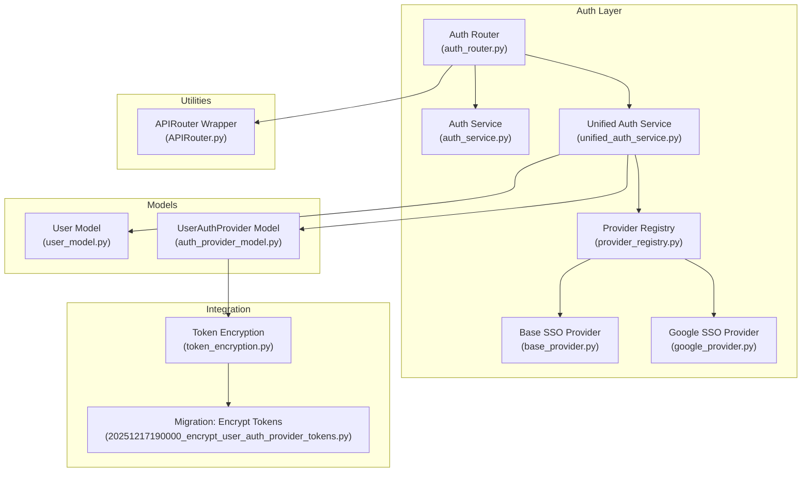
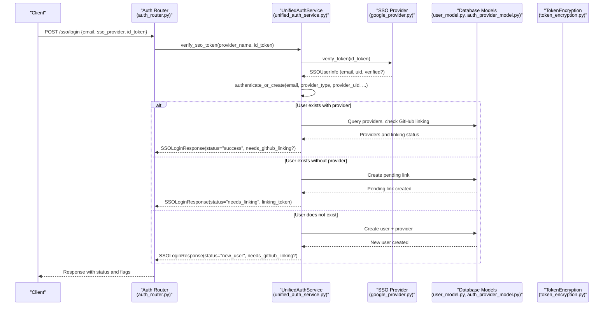
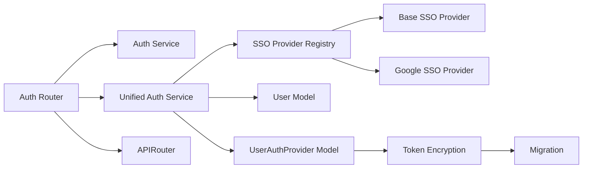

# Authentication System Overview

<cite>
**Referenced Files in This Document**
- [unified_auth_service.py](file://app/modules/auth/unified_auth_service.py)
- [auth_router.py](file://app/modules/auth/auth_router.py)
- [auth_service.py](file://app/modules/auth/auth_service.py)
- [auth_schema.py](file://app/modules/auth/auth_schema.py)
- [auth_provider_model.py](file://app/modules/auth/auth_provider_model.py)
- [user_model.py](file://app/modules/users/user_model.py)
- [user_service.py](file://app/modules/users/user_service.py)
- [base_provider.py](file://app/modules/auth/sso_providers/base_provider.py)
- [google_provider.py](file://app/modules/auth/sso_providers/google_provider.py)
- [provider_registry.py](file://app/modules/auth/sso_providers/provider_registry.py)
- [token_encryption.py](file://app/modules/integrations/token_encryption.py)
- [20251217190000_encrypt_user_auth_provider_tokens.py](file://app/alembic/versions/20251217190000_encrypt_user_auth_provider_tokens.py)
- [APIRouter.py](file://app/modules/utils/APIRouter.py)
</cite>

## Table of Contents
1. [Introduction](#introduction)
2. [Project Structure](#project-structure)
3. [Core Components](#core-components)
4. [Architecture Overview](#architecture-overview)
5. [Detailed Component Analysis](#detailed-component-analysis)
6. [Dependency Analysis](#dependency-analysis)
7. [Performance Considerations](#performance-considerations)
8. [Troubleshooting Guide](#troubleshooting-guide)
9. [Conclusion](#conclusion)

## Introduction
This document explains Potpie’s authentication system with a focus on multi-provider support, unified authentication flows, and user management. It covers how the system handles user login, session-like persistence via tokens, access control, and provider integration patterns. The documentation includes both conceptual overviews for beginners and technical details for experienced developers, including token verification, user session handling, provider integration, and security configurations.

## Project Structure
The authentication system spans several modules:
- Unified authentication orchestration and provider management
- SSO provider abstractions and concrete implementations
- User and provider persistence models
- Router endpoints and schemas
- Token encryption utilities and migrations
- Custom API router wrapper

**Diagram sources**
- [auth_router.py](file://app/modules/auth/auth_router.py#L42-L838)
- [auth_service.py](file://app/modules/auth/auth_service.py#L14-L108)
- [unified_auth_service.py](file://app/modules/auth/unified_auth_service.py#L57-L1274)
- [provider_registry.py](file://app/modules/auth/sso_providers/provider_registry.py#L22-L103)
- [base_provider.py](file://app/modules/auth/sso_providers/base_provider.py#L26-L110)
- [google_provider.py](file://app/modules/auth/sso_providers/google_provider.py#L23-L227)
- [user_model.py](file://app/modules/users/user_model.py#L17-L59)
- [auth_provider_model.py](file://app/modules/auth/auth_provider_model.py#L25-L200)
- [token_encryption.py](file://app/modules/integrations/token_encryption.py#L14-L108)
- [20251217190000_encrypt_user_auth_provider_tokens.py](file://app/alembic/versions/20251217190000_encrypt_user_auth_provider_tokens.py#L23-L75)
- [APIRouter.py](file://app/modules/utils/APIRouter.py#L7-L28)

**Section sources**
- [auth_router.py](file://app/modules/auth/auth_router.py#L42-L838)
- [unified_auth_service.py](file://app/modules/auth/unified_auth_service.py#L57-L1274)
- [provider_registry.py](file://app/modules/auth/sso_providers/provider_registry.py#L22-L103)
- [base_provider.py](file://app/modules/auth/sso_providers/base_provider.py#L26-L110)
- [google_provider.py](file://app/modules/auth/sso_providers/google_provider.py#L23-L227)
- [user_model.py](file://app/modules/users/user_model.py#L17-L59)
- [auth_provider_model.py](file://app/modules/auth/auth_provider_model.py#L25-L200)
- [token_encryption.py](file://app/modules/integrations/token_encryption.py#L14-L108)
- [20251217190000_encrypt_user_auth_provider_tokens.py](file://app/alembic/versions/20251217190000_encrypt_user_auth_provider_tokens.py#L23-L75)
- [APIRouter.py](file://app/modules/utils/APIRouter.py#L7-L28)

## Core Components
- UnifiedAuthService: Orchestrates multi-provider authentication, provider linking/unlinking, and user identity resolution. It verifies SSO tokens via provider registry, manages provider preferences, and enforces GitHub linking requirements.
- AuthAPI endpoints: Provide login/signup, SSO login, provider linking confirmation, listing providers, setting primary provider, unlinking provider, and account retrieval.
- BaseSSOProvider and GoogleSSOProvider: Define the SSO provider interface and implement Google ID token verification and authorization URL generation.
- SSOProviderRegistry: Singleton registry for SSO providers, enabling reuse and thread-safe access.
- UserAuthProvider model: Stores multiple providers per user, OAuth tokens (encrypted), and metadata.
- TokenEncryption utilities and migration: Securely encrypt stored tokens and handle backward compatibility.

Key responsibilities:
- Token verification for SSO providers
- User existence checks and account linking
- Provider preference management
- Audit logging and security controls
- Encrypted token storage and retrieval

**Section sources**
- [unified_auth_service.py](file://app/modules/auth/unified_auth_service.py#L57-L1274)
- [auth_router.py](file://app/modules/auth/auth_router.py#L52-L838)
- [base_provider.py](file://app/modules/auth/sso_providers/base_provider.py#L26-L110)
- [google_provider.py](file://app/modules/auth/sso_providers/google_provider.py#L23-L227)
- [provider_registry.py](file://app/modules/auth/sso_providers/provider_registry.py#L22-L103)
- [auth_provider_model.py](file://app/modules/auth/auth_provider_model.py#L25-L200)
- [token_encryption.py](file://app/modules/integrations/token_encryption.py#L14-L108)

## Architecture Overview
The authentication system integrates Firebase-based identity with multiple SSO providers while maintaining a single user identity based on email. It supports:
- SSO login with token verification
- Multi-provider account linking
- GitHub linking requirement enforcement
- Encrypted OAuth token storage
- Audit logging and security controls

**Diagram sources**
- [auth_router.py](file://app/modules/auth/auth_router.py#L441-L570)
- [unified_auth_service.py](file://app/modules/auth/unified_auth_service.py#L82-L101)
- [google_provider.py](file://app/modules/auth/sso_providers/google_provider.py#L64-L182)
- [user_model.py](file://app/modules/users/user_model.py#L17-L59)
- [auth_provider_model.py](file://app/modules/auth/auth_provider_model.py#L25-L200)
- [token_encryption.py](file://app/modules/integrations/token_encryption.py#L100-L108)

## Detailed Component Analysis

### Unified Authentication Service
Responsibilities:
- Verify SSO ID tokens via provider registry
- Authenticate or create users across providers
- Manage provider linking/unlinking and primary provider selection
- Enforce GitHub linking requirement for login completion
- Track provider usage and maintain audit logs

Key flows:
- authenticate_or_create: Determines whether to log in, prompt linking, or create a new user; enforces GitHub linking for existing users and sets primary provider on sign-in.
- add_provider: Adds a new provider to an existing account, encrypting tokens before storage.
- get_decrypted_access_token/get_decrypted_refresh_token: Decrypts stored tokens with backward compatibility for plaintext tokens.
- set_primary_provider/unlink_provider: Adjusts provider preferences and enforces minimum provider requirements.

Security and compliance:
- Encrypted OAuth tokens stored in provider records.
- Audit logs capture login attempts, provider linking/unlinking, and SSO events.
- Development mode fallback for token verification.

**Section sources**
- [unified_auth_service.py](file://app/modules/auth/unified_auth_service.py#L57-L1274)
- [auth_provider_model.py](file://app/modules/auth/auth_provider_model.py#L25-L200)
- [token_encryption.py](file://app/modules/integrations/token_encryption.py#L14-L108)

### SSO Provider Abstractions
- BaseSSOProvider defines the standardized interface for token verification, authorization URL generation, and configuration validation.
- GoogleSSOProvider implements ID token verification supporting both Firebase Admin SDK and Google OAuth libraries, with hosted domain validation and user info extraction.

Provider integration patterns:
- Registry-based singleton pattern enables sharing provider instances across requests.
- Provider-specific configuration loaded from environment or constructor.

**Section sources**
- [base_provider.py](file://app/modules/auth/sso_providers/base_provider.py#L26-L110)
- [google_provider.py](file://app/modules/auth/sso_providers/google_provider.py#L23-L227)
- [provider_registry.py](file://app/modules/auth/sso_providers/provider_registry.py#L22-L103)

### Authentication Router and Endpoints
Endpoints:
- POST /login: Legacy email/password login via Firebase Identity Toolkit.
- POST /signup: Multi-flow signup supporting GitHub linking, GitHub sign-in, and email/password sign-in.
- POST /sso/login: SSO login with provider type and ID token; returns success, needs_linking, or new_user.
- POST /providers/confirm-linking: Confirm pending provider linking.
- DELETE /providers/cancel-linking/{token}: Cancel pending linking.
- GET /providers/me: List user’s providers and primary provider.
- POST /providers/set-primary: Set primary provider.
- DELETE /providers/unlink: Unlink provider with safety checks.
- GET /account/me: Retrieve account details including providers.

Middleware and security:
- AuthService.check_auth validates bearer tokens and injects user context; supports development mode with mock authentication.

**Section sources**
- [auth_router.py](file://app/modules/auth/auth_router.py#L52-L838)
- [auth_service.py](file://app/modules/auth/auth_service.py#L14-L108)

### User and Provider Models
- User: Core identity with email, display name, organization fields, and relationships to providers and resources.
- UserAuthProvider: Per-user provider records with encrypted OAuth tokens, provider metadata, and audit fields.
- OrganizationSSOConfig and AuthAuditLog: Organizational SSO policies and audit trail.

Data integrity:
- Unique constraints prevent duplicate provider types per user and duplicate provider UIDs across providers.
- Migration ensures existing plaintext tokens are encrypted and readable by the service layer.

**Section sources**
- [user_model.py](file://app/modules/users/user_model.py#L17-L59)
- [auth_provider_model.py](file://app/modules/auth/auth_provider_model.py#L25-L200)
- [20251217190000_encrypt_user_auth_provider_tokens.py](file://app/alembic/versions/20251217190000_encrypt_user_auth_provider_tokens.py#L23-L75)

### Token Encryption and Storage
- TokenEncryption provides symmetric encryption/decryption using Fernet with environment-driven keys.
- UnifiedAuthService encrypts tokens before storage and decrypts on retrieval with backward compatibility for plaintext tokens.
- Migration upgrades existing tokens to encrypted format.

**Section sources**
- [token_encryption.py](file://app/modules/integrations/token_encryption.py#L14-L108)
- [unified_auth_service.py](file://app/modules/auth/unified_auth_service.py#L176-L227)
- [20251217190000_encrypt_user_auth_provider_tokens.py](file://app/alembic/versions/20251217190000_encrypt_user_auth_provider_tokens.py#L23-L75)

### Practical Examples

- User Registration (SSO)
  - Endpoint: POST /sso/login
  - Parameters: email, sso_provider (e.g., google), id_token, provider_data (optional)
  - Behavior: Verifies token, resolves user by email, enforces GitHub linking for existing users, creates new user if needed, and returns status flags indicating success, needs_linking, or new_user.

- User Login (Legacy Email/Password)
  - Endpoint: POST /login
  - Parameters: email, password
  - Behavior: Calls Firebase Identity Toolkit to authenticate and returns an ID token.

- Provider Linking Confirmation
  - Endpoint: POST /providers/confirm-linking
  - Parameters: linking_token
  - Behavior: Confirms pending linking and returns the newly linked provider.

- Listing and Managing Providers
  - GET /providers/me: Returns all providers and primary provider.
  - POST /providers/set-primary: Sets a provider as primary.
  - DELETE /providers/unlink: Unlinks a provider with safety checks.

- Token Verification Flow
  - UnifiedAuthService.verify_sso_token delegates to the appropriate provider via SSOProviderRegistry and returns standardized SSOUserInfo.

**Section sources**
- [auth_router.py](file://app/modules/auth/auth_router.py#L52-L838)
- [unified_auth_service.py](file://app/modules/auth/unified_auth_service.py#L82-L101)
- [provider_registry.py](file://app/modules/auth/sso_providers/provider_registry.py#L83-L94)

## Dependency Analysis
The authentication system exhibits clear separation of concerns:
- Router depends on Auth Service and Unified Auth Service
- Unified Auth Service depends on SSO Provider Registry and models
- Providers depend on Base SSO Provider and environment configuration
- Models depend on SQLAlchemy ORM and relationships
- Token encryption is isolated and reused by services

**Diagram sources**
- [auth_router.py](file://app/modules/auth/auth_router.py#L42-L838)
- [auth_service.py](file://app/modules/auth/auth_service.py#L14-L108)
- [unified_auth_service.py](file://app/modules/auth/unified_auth_service.py#L57-L1274)
- [provider_registry.py](file://app/modules/auth/sso_providers/provider_registry.py#L22-L103)
- [base_provider.py](file://app/modules/auth/sso_providers/base_provider.py#L26-L110)
- [google_provider.py](file://app/modules/auth/sso_providers/google_provider.py#L23-L227)
- [user_model.py](file://app/modules/users/user_model.py#L17-L59)
- [auth_provider_model.py](file://app/modules/auth/auth_provider_model.py#L25-L200)
- [token_encryption.py](file://app/modules/integrations/token_encryption.py#L14-L108)
- [20251217190000_encrypt_user_auth_provider_tokens.py](file://app/alembic/versions/20251217190000_encrypt_user_auth_provider_tokens.py#L23-L75)
- [APIRouter.py](file://app/modules/utils/APIRouter.py#L7-L28)

**Section sources**
- [auth_router.py](file://app/modules/auth/auth_router.py#L42-L838)
- [unified_auth_service.py](file://app/modules/auth/unified_auth_service.py#L57-L1274)
- [provider_registry.py](file://app/modules/auth/sso_providers/provider_registry.py#L22-L103)
- [base_provider.py](file://app/modules/auth/sso_providers/base_provider.py#L26-L110)
- [google_provider.py](file://app/modules/auth/sso_providers/google_provider.py#L23-L227)
- [user_model.py](file://app/modules/users/user_model.py#L17-L59)
- [auth_provider_model.py](file://app/modules/auth/auth_provider_model.py#L25-L200)
- [token_encryption.py](file://app/modules/integrations/token_encryption.py#L14-L108)
- [20251217190000_encrypt_user_auth_provider_tokens.py](file://app/alembic/versions/20251217190000_encrypt_user_auth_provider_tokens.py#L23-L75)
- [APIRouter.py](file://app/modules/utils/APIRouter.py#L7-L28)

## Performance Considerations
- Provider registry uses singleton instances to reduce memory and initialization overhead.
- Token encryption/decryption occurs only when reading/writing tokens; consider caching decrypted tokens per request if needed.
- Database queries for provider checks and user lookups are straightforward; ensure proper indexing on user email and provider unique constraints.
- SSO token verification defers to provider libraries; network latency may impact response times—consider timeouts and retries at the provider layer.

## Troubleshooting Guide
Common issues and resolutions:
- Invalid or expired SSO token: Returned as Unauthorized with descriptive error; verify provider configuration and token validity.
- Missing bearer token: AuthService.check_auth raises 401; ensure Authorization header is present or enable development mode appropriately.
- Provider linking conflicts: Unique constraints prevent duplicate provider UIDs; resolve conflicts by unlinking or using different accounts.
- Orphaned user records: If a local user exists without a corresponding Firebase user, the system deletes the orphaned record to prevent stale identities.
- Token encryption failures: Ensure ENCRYPTION_KEY is set in production; development mode generates a temporary key for convenience.

**Section sources**
- [auth_router.py](file://app/modules/auth/auth_router.py#L559-L570)
- [auth_service.py](file://app/modules/auth/auth_service.py#L96-L104)
- [unified_auth_service.py](file://app/modules/auth/unified_auth_service.py#L508-L546)
- [token_encryption.py](file://app/modules/integrations/token_encryption.py#L21-L62)

## Conclusion
Potpie’s authentication system provides a robust, extensible foundation for multi-provider identity management. It unifies SSO and legacy providers under a single user identity, enforces security policies (like GitHub linking), and safeguards sensitive credentials with encrypted token storage. The modular design, provider registry, and comprehensive audit logging support both developer productivity and operational security.