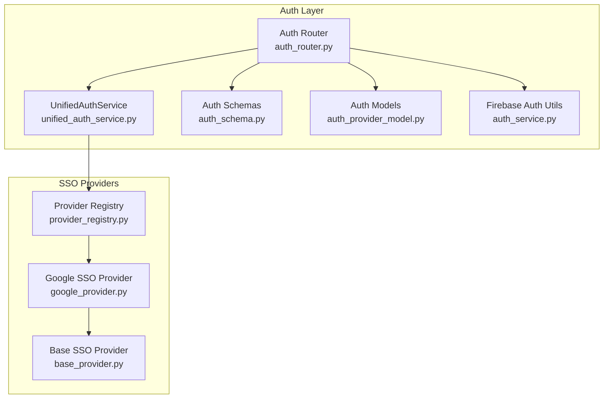
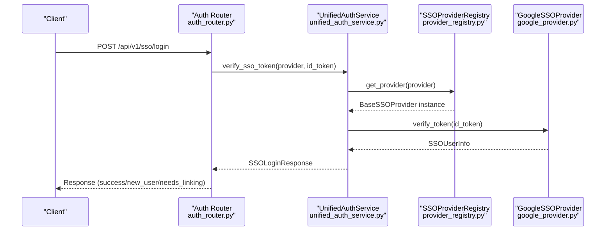
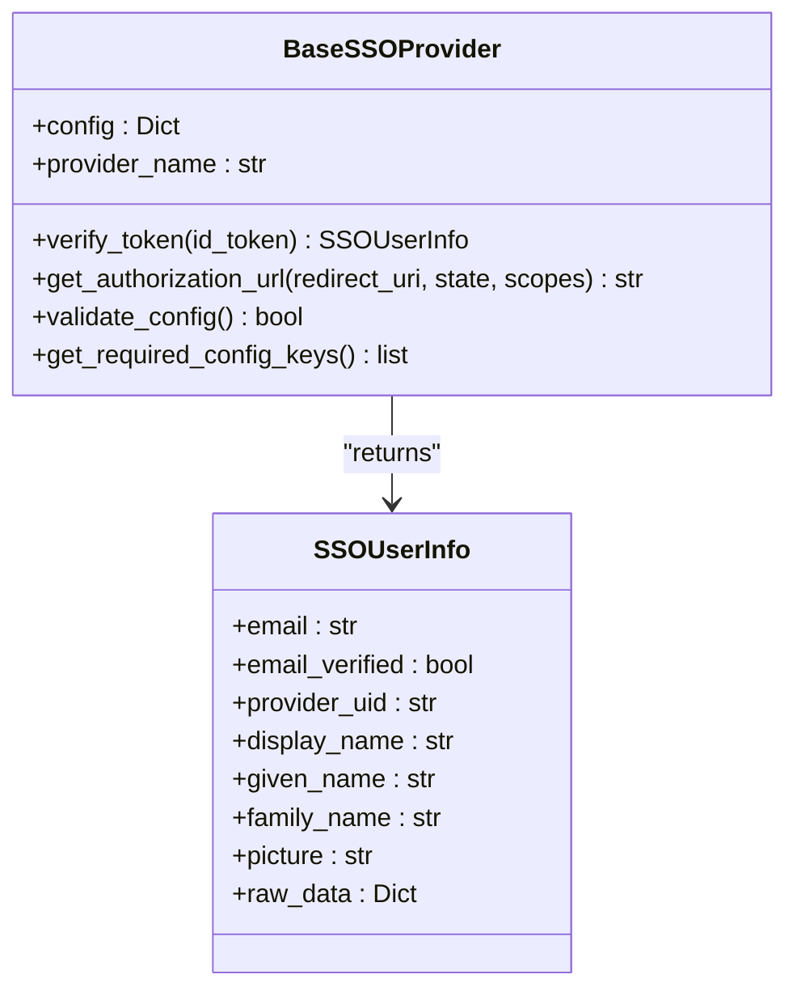
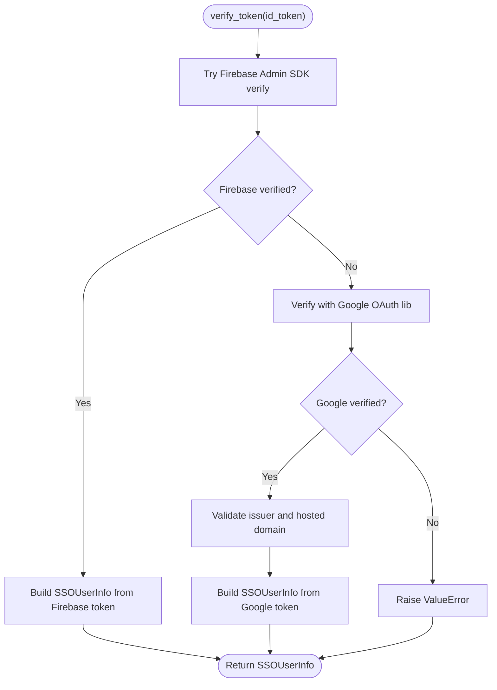
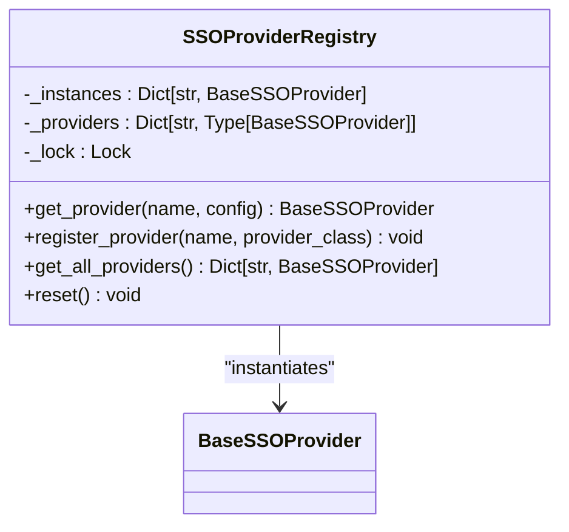
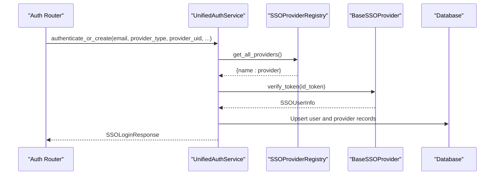
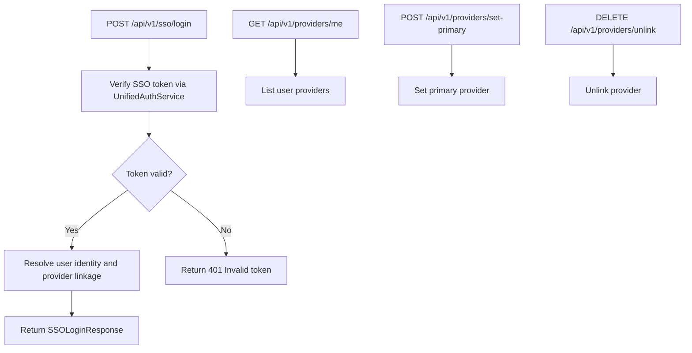
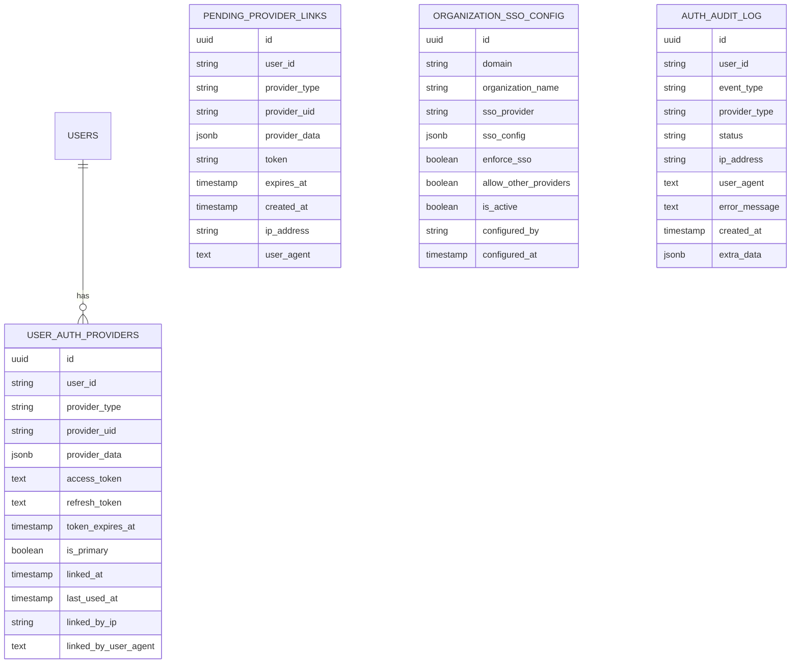
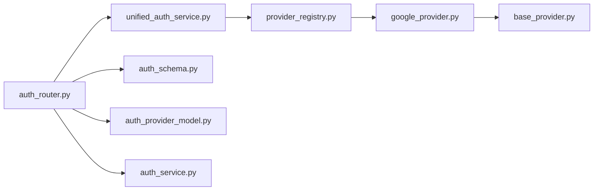

# Multi-Provider Support

<cite>
**Referenced Files in This Document**
- [base_provider.py](file://app/modules/auth/sso_providers/base_provider.py)
- [google_provider.py](file://app/modules/auth/sso_providers/google_provider.py)
- [provider_registry.py](file://app/modules/auth/sso_providers/provider_registry.py)
- [unified_auth_service.py](file://app/modules/auth/unified_auth_service.py)
- [auth_router.py](file://app/modules/auth/auth_router.py)
- [auth_schema.py](file://app/modules/auth/auth_schema.py)
- [auth_provider_model.py](file://app/modules/auth/auth_provider_model.py)
- [auth_service.py](file://app/modules/auth/auth_service.py)
- [test_unified_auth_service.py](file://app/modules/auth/tests/test_unified_auth_service.py)
- [.env.template](file://.env.template)
</cite>

## Table of Contents
1. [Introduction](#introduction)
2. [Project Structure](#project-structure)
3. [Core Components](#core-components)
4. [Architecture Overview](#architecture-overview)
5. [Detailed Component Analysis](#detailed-component-analysis)
6. [Dependency Analysis](#dependency-analysis)
7. [Performance Considerations](#performance-considerations)
8. [Troubleshooting Guide](#troubleshooting-guide)
9. [Conclusion](#conclusion)
10. [Appendices](#appendices)

## Introduction
This document explains the multi-provider authentication system that supports multiple identity providers (Google SSO, GitHub, enterprise SSO providers, and custom providers). It covers the provider registry, base provider interface, provider-specific implementations, configuration options, authentication flows, and integration with the unified authentication service. It also documents return value structures, validation mechanisms, and common issues with practical guidance for both beginners and advanced developers.

## Project Structure
The multi-provider authentication system is centered around:
- SSO provider abstractions and implementations under app/modules/auth/sso_providers
- Unified authentication orchestration under app/modules/auth/unified_auth_service.py
- HTTP endpoints under app/modules/auth/auth_router.py
- Data models for providers and audit logging under app/modules/auth/auth_provider_model.py
- Pydantic schemas for request/response contracts under app/modules/auth/auth_schema.py
- Supporting Firebase auth utilities under app/modules/auth/auth_service.py

**Diagram sources**
- [auth_router.py](file://app/modules/auth/auth_router.py#L441-L570)
- [unified_auth_service.py](file://app/modules/auth/unified_auth_service.py#L57-L101)
- [auth_schema.py](file://app/modules/auth/auth_schema.py#L66-L89)
- [auth_provider_model.py](file://app/modules/auth/auth_provider_model.py#L25-L84)
- [auth_service.py](file://app/modules/auth/auth_service.py#L14-L108)
- [provider_registry.py](file://app/modules/auth/sso_providers/provider_registry.py#L22-L103)
- [base_provider.py](file://app/modules/auth/sso_providers/base_provider.py#L26-L110)
- [google_provider.py](file://app/modules/auth/sso_providers/google_provider.py#L23-L227)

**Section sources**
- [auth_router.py](file://app/modules/auth/auth_router.py#L441-L570)
- [unified_auth_service.py](file://app/modules/auth/unified_auth_service.py#L57-L101)
- [auth_schema.py](file://app/modules/auth/auth_schema.py#L66-L89)
- [auth_provider_model.py](file://app/modules/auth/auth_provider_model.py#L25-L84)
- [auth_service.py](file://app/modules/auth/auth_service.py#L14-L108)
- [provider_registry.py](file://app/modules/auth/sso_providers/provider_registry.py#L22-L103)
- [base_provider.py](file://app/modules/auth/sso_providers/base_provider.py#L26-L110)
- [google_provider.py](file://app/modules/auth/sso_providers/google_provider.py#L23-L227)

## Core Components
- Base SSO Provider interface defines the contract for token verification and authorization URL generation.
- Google SSO Provider implements the interface for Google OAuth ID tokens and Firebase ID tokens.
- Provider Registry manages singleton instances of providers and allows registration of new providers.
- UnifiedAuthService orchestrates multi-provider authentication, provider linking, and user identity resolution.
- Auth Router exposes endpoints for SSO login, provider management, and account queries.
- Auth Schemas define request/response structures for SSO login and provider management.
- Auth Models persist provider associations, pending links, organization SSO configs, and audit logs.

Key responsibilities:
- Provider abstraction and extensibility
- Token verification and user info extraction
- Provider registration and retrieval
- Multi-provider user identity and linking
- Organization-level SSO enforcement
- Audit logging and compliance

**Section sources**
- [base_provider.py](file://app/modules/auth/sso_providers/base_provider.py#L26-L110)
- [google_provider.py](file://app/modules/auth/sso_providers/google_provider.py#L23-L227)
- [provider_registry.py](file://app/modules/auth/sso_providers/provider_registry.py#L22-L103)
- [unified_auth_service.py](file://app/modules/auth/unified_auth_service.py#L57-L101)
- [auth_router.py](file://app/modules/auth/auth_router.py#L441-L570)
- [auth_schema.py](file://app/modules/auth/auth_schema.py#L66-L89)
- [auth_provider_model.py](file://app/modules/auth/auth_provider_model.py#L25-L84)

## Architecture Overview
The system separates concerns across layers:
- Presentation: Auth Router exposes endpoints for SSO login and provider management.
- Application: UnifiedAuthService coordinates provider verification, user identity, and linking.
- Persistence: Auth Models store provider associations, pending links, and audit logs.
- Identity: SSO Providers implement token verification and user info extraction.
- Configuration: Environment variables and provider registry configure providers.

**Diagram sources**
- [auth_router.py](file://app/modules/auth/auth_router.py#L441-L570)
- [unified_auth_service.py](file://app/modules/auth/unified_auth_service.py#L82-L101)
- [provider_registry.py](file://app/modules/auth/sso_providers/provider_registry.py#L38-L65)
- [google_provider.py](file://app/modules/auth/sso_providers/google_provider.py#L64-L182)

**Section sources**
- [auth_router.py](file://app/modules/auth/auth_router.py#L441-L570)
- [unified_auth_service.py](file://app/modules/auth/unified_auth_service.py#L82-L101)
- [provider_registry.py](file://app/modules/auth/sso_providers/provider_registry.py#L38-L65)
- [google_provider.py](file://app/modules/auth/sso_providers/google_provider.py#L64-L182)

## Detailed Component Analysis

### Base SSO Provider Interface
The base interface defines:
- Provider name property
- Token verification method returning standardized user info
- Authorization URL builder
- Configuration validation and required keys

**Diagram sources**
- [base_provider.py](file://app/modules/auth/sso_providers/base_provider.py#L26-L110)

**Section sources**
- [base_provider.py](file://app/modules/auth/sso_providers/base_provider.py#L26-L110)

### Google SSO Provider
Implements Google OAuth ID token verification and Firebase ID token verification. Supports hosted domain checks and extracts standardized user info.

Key behaviors:
- Attempts Firebase Admin SDK verification first, falls back to Google OAuth verification
- Validates issuer and hosted domain when configured
- Builds authorization URL with default scopes

**Diagram sources**
- [google_provider.py](file://app/modules/auth/sso_providers/google_provider.py#L64-L182)

**Section sources**
- [google_provider.py](file://app/modules/auth/sso_providers/google_provider.py#L23-L227)

### Provider Registry
Singleton registry that:
- Maintains a mapping of provider names to provider classes
- Lazily instantiates providers on first use
- Thread-safe access using double-checked locking
- Allows dynamic registration of new providers

**Diagram sources**
- [provider_registry.py](file://app/modules/auth/sso_providers/provider_registry.py#L22-L103)

**Section sources**
- [provider_registry.py](file://app/modules/auth/sso_providers/provider_registry.py#L22-L103)

### Unified Authentication Service
Coordinates multi-provider authentication and provider management:
- Retrieves SSO providers from the registry
- Verifies tokens via the appropriate provider
- Resolves user identity by email and provider linkage
- Manages provider linking, primary provider selection, and token encryption/decryption
- Enforces organization SSO policies and logs audit events

**Diagram sources**
- [unified_auth_service.py](file://app/modules/auth/unified_auth_service.py#L387-L800)
- [provider_registry.py](file://app/modules/auth/sso_providers/provider_registry.py#L83-L94)

**Section sources**
- [unified_auth_service.py](file://app/modules/auth/unified_auth_service.py#L57-L101)
- [unified_auth_service.py](file://app/modules/auth/unified_auth_service.py#L387-L800)

### Auth Router Endpoints
Exposes:
- SSO login endpoint validating tokens and returning standardized responses
- Provider management endpoints for listing, setting primary, and unlinking providers
- Account endpoint for retrieving complete account information

**Diagram sources**
- [auth_router.py](file://app/modules/auth/auth_router.py#L441-L570)
- [auth_router.py](file://app/modules/auth/auth_router.py#L646-L781)

**Section sources**
- [auth_router.py](file://app/modules/auth/auth_router.py#L441-L570)
- [auth_router.py](file://app/modules/auth/auth_router.py#L646-L781)

### Data Models and Audit Logging
Models include:
- UserAuthProvider: stores provider associations, tokens, and metadata
- PendingProviderLink: temporary linking confirmation records
- OrganizationSSOConfig: domain-to-provider mapping and policies
- AuthAuditLog: audit trail for authentication events

**Diagram sources**
- [auth_provider_model.py](file://app/modules/auth/auth_provider_model.py#L25-L200)

**Section sources**
- [auth_provider_model.py](file://app/modules/auth/auth_provider_model.py#L25-L200)

## Dependency Analysis
- Auth Router depends on UnifiedAuthService and Pydantic schemas for request/response handling.
- UnifiedAuthService depends on SSOProviderRegistry and provider implementations for token verification.
- Provider Registry depends on BaseSSOProvider and concrete provider classes.
- Auth Models encapsulate persistence and relationships for providers and audit logs.
- Auth Service provides Firebase token verification for legacy flows.

**Diagram sources**
- [auth_router.py](file://app/modules/auth/auth_router.py#L441-L570)
- [unified_auth_service.py](file://app/modules/auth/unified_auth_service.py#L57-L101)
- [provider_registry.py](file://app/modules/auth/sso_providers/provider_registry.py#L22-L103)
- [google_provider.py](file://app/modules/auth/sso_providers/google_provider.py#L23-L227)
- [base_provider.py](file://app/modules/auth/sso_providers/base_provider.py#L26-L110)
- [auth_schema.py](file://app/modules/auth/auth_schema.py#L66-L89)
- [auth_provider_model.py](file://app/modules/auth/auth_provider_model.py#L25-L84)
- [auth_service.py](file://app/modules/auth/auth_service.py#L14-L108)

**Section sources**
- [auth_router.py](file://app/modules/auth/auth_router.py#L441-L570)
- [unified_auth_service.py](file://app/modules/auth/unified_auth_service.py#L57-L101)
- [provider_registry.py](file://app/modules/auth/sso_providers/provider_registry.py#L22-L103)
- [google_provider.py](file://app/modules/auth/sso_providers/google_provider.py#L23-L227)
- [base_provider.py](file://app/modules/auth/sso_providers/base_provider.py#L26-L110)
- [auth_schema.py](file://app/modules/auth/auth_schema.py#L66-L89)
- [auth_provider_model.py](file://app/modules/auth/auth_provider_model.py#L25-L84)
- [auth_service.py](file://app/modules/auth/auth_service.py#L14-L108)

## Performance Considerations
- Provider instances are singletons and thread-safe, reducing memory and initialization overhead.
- Token verification is delegated to provider implementations; ensure network timeouts are configured appropriately for external identity providers.
- Encryption/decryption of tokens occurs in the service layer; consider caching decrypted tokens for short-lived operations if needed.
- Organization SSO configuration queries should be indexed by domain for efficient lookups.

[No sources needed since this section provides general guidance]

## Troubleshooting Guide
Common issues and resolutions:
- Provider configuration errors
  - Symptom: Validation errors during provider initialization
  - Cause: Missing required configuration keys
  - Resolution: Ensure required keys are present in environment variables or provider config
  - Reference: [base_provider.py](file://app/modules/auth/sso_providers/base_provider.py#L86-L104), [google_provider.py](file://app/modules/auth/sso_providers/google_provider.py#L221-L227)

- Token validation failures
  - Symptom: Invalid or expired SSO token responses
  - Cause: Expired token, wrong issuer, or mismatched hosted domain
  - Resolution: Verify token freshness and issuer; check hosted domain configuration
  - Reference: [google_provider.py](file://app/modules/auth/sso_providers/google_provider.py#L134-L182), [unified_auth_service.py](file://app/modules/auth/unified_auth_service.py#L82-L101)

- Provider-specific edge cases
  - Symptom: Mixed Firebase and Google ID tokens
  - Cause: Different token formats and verification paths
  - Resolution: The Google provider tries Firebase verification first, then Google OAuth verification
  - Reference: [google_provider.py](file://app/modules/auth/sso_providers/google_provider.py#L79-L133)

- Organization SSO enforcement
  - Symptom: Unexpected SSO redirection or blocking
  - Cause: Domain mapped to SSO provider with enforcement enabled
  - Resolution: Review organization SSO configuration and adjust policies
  - Reference: [auth_provider_model.py](file://app/modules/auth/auth_provider_model.py#L123-L158), [unified_auth_service.py](file://app/modules/auth/unified_auth_service.py#L387-L800)

**Section sources**
- [base_provider.py](file://app/modules/auth/sso_providers/base_provider.py#L86-L104)
- [google_provider.py](file://app/modules/auth/sso_providers/google_provider.py#L134-L182)
- [google_provider.py](file://app/modules/auth/sso_providers/google_provider.py#L79-L133)
- [auth_provider_model.py](file://app/modules/auth/auth_provider_model.py#L123-L158)
- [unified_auth_service.py](file://app/modules/auth/unified_auth_service.py#L82-L101)
- [unified_auth_service.py](file://app/modules/auth/unified_auth_service.py#L387-L800)

## Conclusion
The multi-provider authentication system cleanly separates identity verification, user identity resolution, and provider management. The provider registry enables extensibility, while the unified service centralizes cross-provider logic. The schemas and models provide robust contracts and persistence for provider associations and auditability. By following the configuration and validation patterns documented here, teams can confidently add new providers and maintain a secure, scalable authentication infrastructure.

[No sources needed since this section summarizes without analyzing specific files]

## Appendices

### Configuration Options by Provider Type
- Google SSO Provider
  - Required: client_id
  - Optional: client_secret, hosted domain (hd)
  - Environment fallbacks: GOOGLE_SSO_CLIENT_ID, GOOGLE_SSO_CLIENT_SECRET, GOOGLE_SSO_HOSTED_DOMAIN
  - Reference: [google_provider.py](file://app/modules/auth/sso_providers/google_provider.py#L42-L62), [google_provider.py](file://app/modules/auth/sso_providers/google_provider.py#L217-L219)

- Organization SSO Config
  - Fields: domain, organization_name, sso_provider, sso_config, enforce_sso, allow_other_providers
  - Reference: [auth_provider_model.py](file://app/modules/auth/auth_provider_model.py#L123-L158), [auth_schema.py](file://app/modules/auth/auth_schema.py#L119-L146)

- Environment Variables
  - FIREBASE_SERVICE_ACCOUNT, GOOGLE_APPLICATION_CREDENTIALS, and others for integrations
  - Reference: [.env.template](file://.env.template#L59-L61), [.env.template](file://.env.template#L82-L104)

**Section sources**
- [google_provider.py](file://app/modules/auth/sso_providers/google_provider.py#L42-L62)
- [google_provider.py](file://app/modules/auth/sso_providers/google_provider.py#L217-L219)
- [auth_provider_model.py](file://app/modules/auth/auth_provider_model.py#L123-L158)
- [auth_schema.py](file://app/modules/auth/auth_schema.py#L119-L146)
- [.env.template](file://.env.template#L59-L61)
- [.env.template](file://.env.template#L82-L104)

### Authentication Parameters and Return Value Structures
- SSO Login Request
  - Fields: email, sso_provider, id_token, provider_data
  - Reference: [auth_schema.py](file://app/modules/auth/auth_schema.py#L66-L73)

- SSO Login Response
  - Fields: status, user_id, email, display_name, access_token, message, linking_token, existing_providers, needs_github_linking
  - Reference: [auth_schema.py](file://app/modules/auth/auth_schema.py#L75-L89)

- Provider Management Requests
  - Set Primary Provider: provider_type
  - Unlink Provider: provider_type
  - References: [auth_schema.py](file://app/modules/auth/auth_schema.py#L151-L114)

**Section sources**
- [auth_schema.py](file://app/modules/auth/auth_schema.py#L66-L89)
- [auth_schema.py](file://app/modules/auth/auth_schema.py#L151-L114)

### How to Register a New Provider
Steps:
1. Implement a new provider class extending the base provider interface
   - Reference: [base_provider.py](file://app/modules/auth/sso_providers/base_provider.py#L26-L110)
2. Implement token verification and authorization URL generation
   - Reference: [google_provider.py](file://app/modules/auth/sso_providers/google_provider.py#L64-L216)
3. Register the provider in the registry
   - Reference: [provider_registry.py](file://app/modules/auth/sso_providers/provider_registry.py#L68-L81)
4. Use the provider via the unified service
   - Reference: [unified_auth_service.py](file://app/modules/auth/unified_auth_service.py#L78-L81)

**Section sources**
- [base_provider.py](file://app/modules/auth/sso_providers/base_provider.py#L26-L110)
- [google_provider.py](file://app/modules/auth/sso_providers/google_provider.py#L64-L216)
- [provider_registry.py](file://app/modules/auth/sso_providers/provider_registry.py#L68-L81)
- [unified_auth_service.py](file://app/modules/auth/unified_auth_service.py#L78-L81)

### Example Workflows from Tests
- Authenticating a new user via SSO
  - Reference: [test_unified_auth_service.py](file://app/modules/auth/tests/test_unified_auth_service.py#L208-L225)
- Creating a pending provider link for an existing user
  - Reference: [test_unified_auth_service.py](file://app/modules/auth/tests/test_unified_auth_service.py#L246-L264)
- Confirming a pending provider link
  - Reference: [test_unified_auth_service.py](file://app/modules/auth/tests/test_unified_auth_service.py#L265-L281)

**Section sources**
- [test_unified_auth_service.py](file://app/modules/auth/tests/test_unified_auth_service.py#L208-L225)
- [test_unified_auth_service.py](file://app/modules/auth/tests/test_unified_auth_service.py#L246-L264)
- [test_unified_auth_service.py](file://app/modules/auth/tests/test_unified_auth_service.py#L265-L281)