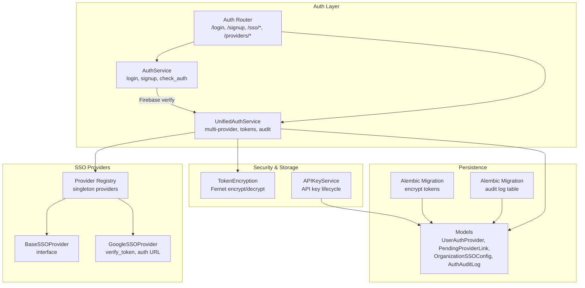
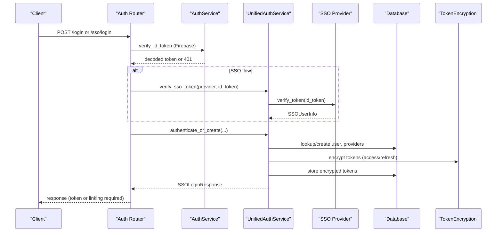
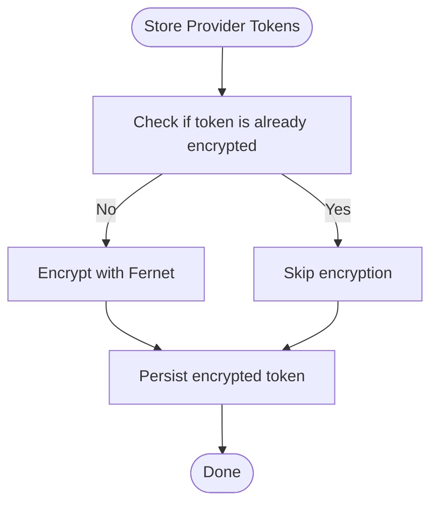
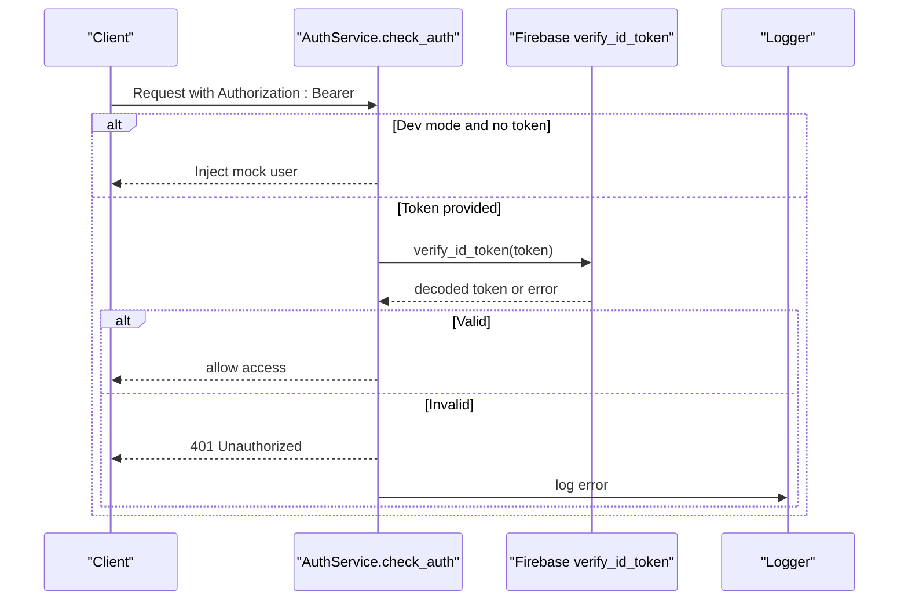
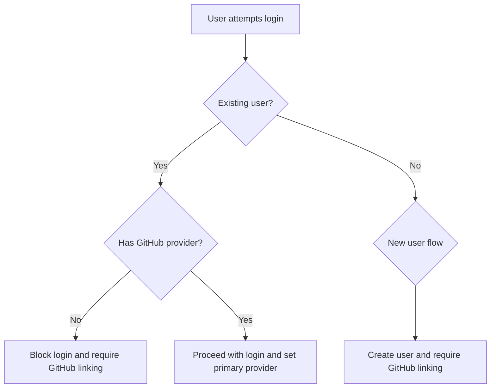
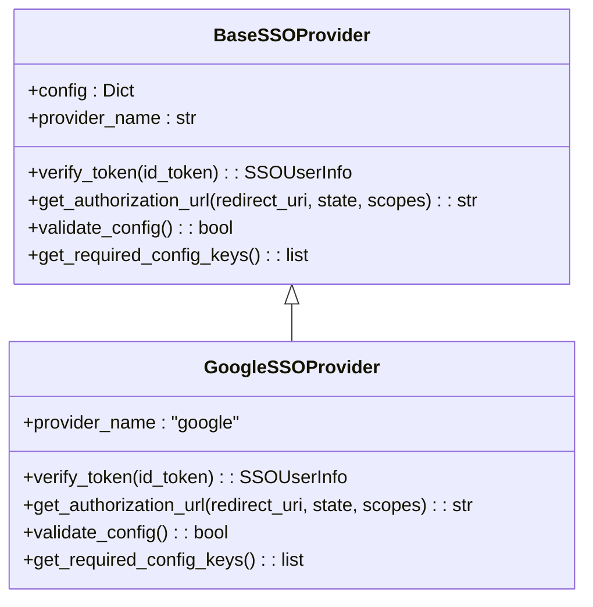
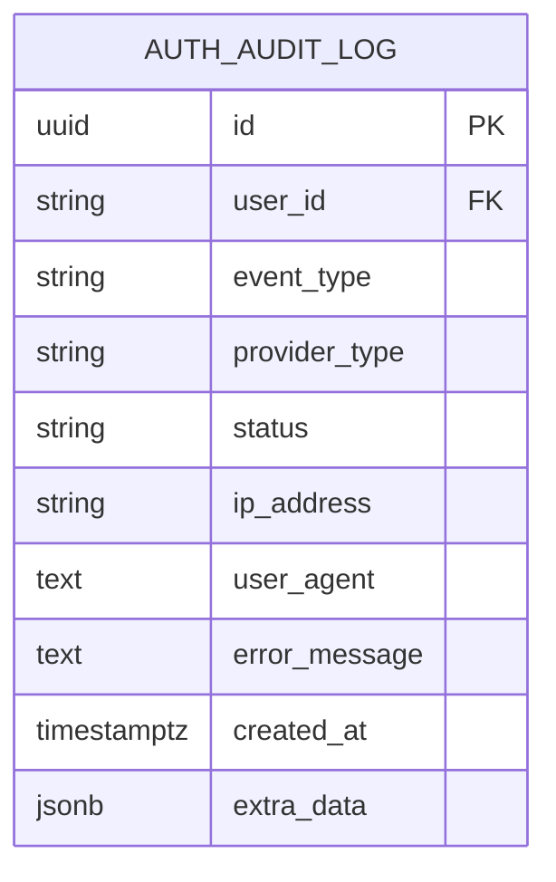
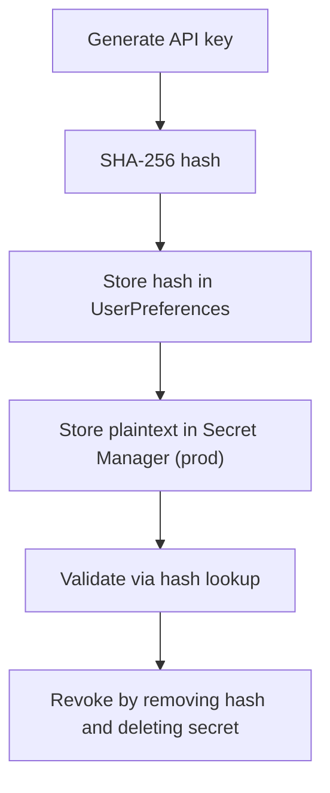
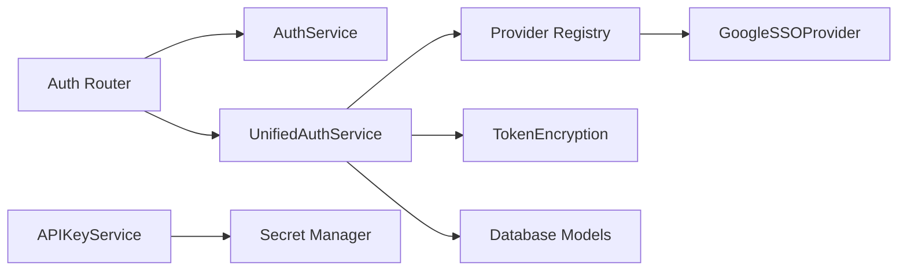

# Security Best Practices

<cite>
**Referenced Files in This Document**
- [auth_service.py](file://app/modules/auth/auth_service.py)
- [auth_router.py](file://app/modules/auth/auth_router.py)
- [unified_auth_service.py](file://app/modules/auth/unified_auth_service.py)
- [auth_schema.py](file://app/modules/auth/auth_schema.py)
- [auth_provider_model.py](file://app/modules/auth/auth_provider_model.py)
- [token_encryption.py](file://app/modules/integrations/token_encryption.py)
- [base_provider.py](file://app/modules/auth/sso_providers/base_provider.py)
- [google_provider.py](file://app/modules/auth/sso_providers/google_provider.py)
- [provider_registry.py](file://app/modules/auth/sso_providers/provider_registry.py)
- [api_key_service.py](file://app/modules/auth/api_key_service.py)
- [20251217190000_encrypt_user_auth_provider_tokens.py](file://app/alembic/versions/20251217190000_encrypt_user_auth_provider_tokens.py)
- [20251202164905_07bea433f543_add_sso_auth_provider_tables.py](file://app/alembic/versions/20251202164905_07bea433f543_add_sso_auth_provider_tables.py)
</cite>

## Table of Contents
1. [Introduction](#introduction)
2. [Project Structure](#project-structure)
3. [Core Components](#core-components)
4. [Architecture Overview](#architecture-overview)
5. [Detailed Component Analysis](#detailed-component-analysis)
6. [Dependency Analysis](#dependency-analysis)
7. [Performance Considerations](#performance-considerations)
8. [Troubleshooting Guide](#troubleshooting-guide)
9. [Conclusion](#conclusion)
10. [Appendices](#appendices)

## Introduction
This document consolidates security best practices for authentication in the system, focusing on secure implementation, threat mitigation, and continuous security monitoring. It explains how token security, credential encryption, audit logging, and validation controls protect user data, prevent unauthorized access, and maintain system integrity. The content balances conceptual guidance for beginners with technical depth for experienced developers, aligning with the codebase’s implementation patterns and security controls.

## Project Structure
Authentication spans several modules:
- Authentication service and router orchestrate login/signup, SSO, and provider management.
- Unified authentication service coordinates multi-provider flows, token handling, and audit logging.
- SSO providers implement standardized verification and authorization flows.
- Token encryption utilities secure sensitive OAuth tokens at rest.
- Database models define provider, linking, SSO configuration, and audit log schemas.
- Alembic migrations implement encryption and audit logging infrastructure.

**Diagram sources**
- [auth_service.py](file://app/modules/auth/auth_service.py#L14-L107)
- [auth_router.py](file://app/modules/auth/auth_router.py#L52-L838)
- [unified_auth_service.py](file://app/modules/auth/unified_auth_service.py#L57-L1274)
- [base_provider.py](file://app/modules/auth/sso_providers/base_provider.py#L26-L110)
- [google_provider.py](file://app/modules/auth/sso_providers/google_provider.py#L23-L227)
- [provider_registry.py](file://app/modules/auth/sso_providers/provider_registry.py#L22-L103)
- [token_encryption.py](file://app/modules/integrations/token_encryption.py#L14-L108)
- [api_key_service.py](file://app/modules/auth/api_key_service.py#L18-L191)
- [auth_provider_model.py](file://app/modules/auth/auth_provider_model.py#L25-L200)
- [20251217190000_encrypt_user_auth_provider_tokens.py](file://app/alembic/versions/20251217190000_encrypt_user_auth_provider_tokens.py#L38-L118)
- [20251202164905_07bea433f543_add_sso_auth_provider_tables.py](file://app/alembic/versions/20251202164905_07bea433f543_add_sso_auth_provider_tables.py#L21-L33)

**Section sources**
- [auth_service.py](file://app/modules/auth/auth_service.py#L14-L107)
- [auth_router.py](file://app/modules/auth/auth_router.py#L52-L838)
- [unified_auth_service.py](file://app/modules/auth/unified_auth_service.py#L57-L1274)
- [auth_provider_model.py](file://app/modules/auth/auth_provider_model.py#L25-L200)
- [token_encryption.py](file://app/modules/integrations/token_encryption.py#L14-L108)
- [base_provider.py](file://app/modules/auth/sso_providers/base_provider.py#L26-L110)
- [google_provider.py](file://app/modules/auth/sso_providers/google_provider.py#L23-L227)
- [provider_registry.py](file://app/modules/auth/sso_providers/provider_registry.py#L22-L103)
- [api_key_service.py](file://app/modules/auth/api_key_service.py#L18-L191)
- [20251217190000_encrypt_user_auth_provider_tokens.py](file://app/alembic/versions/20251217190000_encrypt_user_auth_provider_tokens.py#L38-L118)
- [20251202164905_07bea433f543_add_sso_auth_provider_tables.py](file://app/alembic/versions/20251202164905_07bea433f543_add_sso_auth_provider_tables.py#L21-L33)

## Core Components
- Authentication service: Implements Firebase-based token verification and development-mode bypass for local testing.
- Auth router: Exposes endpoints for login, signup, SSO login, provider management, and account details.
- Unified authentication service: Orchestrates multi-provider flows, enforces GitHub linking, manages tokens, and logs audit events.
- SSO providers: Standardized interfaces and provider-specific implementations (e.g., Google) with token verification and authorization URL generation.
- Token encryption: Fernet-based encryption/decryption for OAuth tokens stored in the database.
- API key service: Secure generation, hashing, storage, and retrieval of API keys using Secret Manager and hashed storage.
- Audit logging: Structured persistence of authentication events for monitoring and compliance.
- Database models: Define provider linkage, pending links, organization SSO configuration, and audit logs.

**Section sources**
- [auth_service.py](file://app/modules/auth/auth_service.py#L14-L107)
- [auth_router.py](file://app/modules/auth/auth_router.py#L52-L838)
- [unified_auth_service.py](file://app/modules/auth/unified_auth_service.py#L57-L1274)
- [base_provider.py](file://app/modules/auth/sso_providers/base_provider.py#L26-L110)
- [google_provider.py](file://app/modules/auth/sso_providers/google_provider.py#L23-L227)
- [token_encryption.py](file://app/modules/integrations/token_encryption.py#L14-L108)
- [api_key_service.py](file://app/modules/auth/api_key_service.py#L18-L191)
- [auth_provider_model.py](file://app/modules/auth/auth_provider_model.py#L25-L200)

## Architecture Overview
The authentication architecture integrates Firebase-based identity verification, multi-provider SSO, secure token storage, and comprehensive audit logging. It enforces GitHub linking for existing users, supports provider linking/unlinking, and captures contextual metadata for security monitoring.

**Diagram sources**
- [auth_router.py](file://app/modules/auth/auth_router.py#L52-L571)
- [auth_service.py](file://app/modules/auth/auth_service.py#L47-L104)
- [unified_auth_service.py](file://app/modules/auth/unified_auth_service.py#L82-L101)
- [base_provider.py](file://app/modules/auth/sso_providers/base_provider.py#L50-L64)
- [google_provider.py](file://app/modules/auth/sso_providers/google_provider.py#L64-L181)
- [token_encryption.py](file://app/modules/integrations/token_encryption.py#L63-L93)
- [auth_provider_model.py](file://app/modules/auth/auth_provider_model.py#L25-L84)

## Detailed Component Analysis

### Token Security and Credential Encryption
- OAuth tokens (access/refresh) are encrypted at rest using Fernet before storage. The service layer transparently handles encryption and decryption, supporting backward compatibility with plaintext tokens.
- Encryption key is sourced from the environment; a development fallback generates a temporary key with warnings.
- Migration securely encrypts existing tokens and marks the column as encrypted for future writes.

**Diagram sources**
- [token_encryption.py](file://app/modules/integrations/token_encryption.py#L14-L108)
- [unified_auth_service.py](file://app/modules/auth/unified_auth_service.py#L228-L311)
- [20251217190000_encrypt_user_auth_provider_tokens.py](file://app/alembic/versions/20251217190000_encrypt_user_auth_provider_tokens.py#L38-L118)

**Section sources**
- [token_encryption.py](file://app/modules/integrations/token_encryption.py#L14-L108)
- [unified_auth_service.py](file://app/modules/auth/unified_auth_service.py#L176-L227)
- [auth_provider_model.py](file://app/modules/auth/auth_provider_model.py#L56-L62)
- [20251217190000_encrypt_user_auth_provider_tokens.py](file://app/alembic/versions/20251217190000_encrypt_user_auth_provider_tokens.py#L38-L118)

### Authentication Validation and Bearer Verification
- Requests are validated using Firebase ID token verification for bearer tokens. Development mode allows mock authentication when no token is provided.
- On failure, the system returns explicit 401 responses with WWW-Authenticate headers and logs detailed errors.

**Diagram sources**
- [auth_service.py](file://app/modules/auth/auth_service.py#L47-L104)

**Section sources**
- [auth_service.py](file://app/modules/auth/auth_service.py#L47-L104)

### Multi-Provider Authentication and GitHub Linking
- Unified authentication service coordinates multi-provider flows, ensuring users must link a GitHub provider before completing login.
- It manages provider linking/unlinking, sets primary providers, and enforces constraints to prevent lockout.

**Diagram sources**
- [unified_auth_service.py](file://app/modules/auth/unified_auth_service.py#L387-L800)
- [auth_router.py](file://app/modules/auth/auth_router.py#L286-L381)

**Section sources**
- [unified_auth_service.py](file://app/modules/auth/unified_auth_service.py#L130-L175)
- [auth_router.py](file://app/modules/auth/auth_router.py#L286-L381)

### SSO Provider Abstractions and Google Implementation
- Base SSO provider defines a standardized interface for token verification and authorization URL generation.
- Google SSO provider supports both Firebase ID tokens and Google OAuth ID tokens, with hosted domain enforcement and robust error handling.

**Diagram sources**
- [base_provider.py](file://app/modules/auth/sso_providers/base_provider.py#L26-L110)
- [google_provider.py](file://app/modules/auth/sso_providers/google_provider.py#L23-L227)

**Section sources**
- [base_provider.py](file://app/modules/auth/sso_providers/base_provider.py#L26-L110)
- [google_provider.py](file://app/modules/auth/sso_providers/google_provider.py#L64-L181)
- [provider_registry.py](file://app/modules/auth/sso_providers/provider_registry.py#L22-L103)

### Audit Logging and Security Monitoring
- Auth audit log captures login attempts, provider linking/unlinking, SSO authentications, and failures with IP, user agent, and error messages.
- Migrations establish the audit log table with JSONB for extensibility.

**Diagram sources**
- [auth_provider_model.py](file://app/modules/auth/auth_provider_model.py#L161-L200)
- [20251202164905_07bea433f543_add_sso_auth_provider_tables.py](file://app/alembic/versions/20251202164905_07bea433f543_add_sso_auth_provider_tables.py#L21-L33)

**Section sources**
- [auth_provider_model.py](file://app/modules/auth/auth_provider_model.py#L161-L200)
- [unified_auth_service.py](file://app/modules/auth/unified_auth_service.py#L368-L376)

### API Key Security
- API keys are prefixed, randomly generated, hashed for storage, and kept in Secret Manager outside development mode.
- Validation compares the provided key against the stored hash; retrieval is disallowed in development mode for security.

**Diagram sources**
- [api_key_service.py](file://app/modules/auth/api_key_service.py#L56-L101)
- [api_key_service.py](file://app/modules/auth/api_key_service.py#L104-L137)
- [api_key_service.py](file://app/modules/auth/api_key_service.py#L140-L166)

**Section sources**
- [api_key_service.py](file://app/modules/auth/api_key_service.py#L18-L191)

## Dependency Analysis
- Coupling: UnifiedAuthService depends on SSO providers via the registry, enabling extensibility without tight coupling.
- Data flow: Auth router delegates to AuthService for token verification and to UnifiedAuthService for multi-provider logic and persistence.
- Security: TokenEncryption is used by UnifiedAuthService to encrypt tokens; APIKeyService uses Secret Manager for secure storage.

**Diagram sources**
- [auth_router.py](file://app/modules/auth/auth_router.py#L52-L838)
- [auth_service.py](file://app/modules/auth/auth_service.py#L14-L107)
- [unified_auth_service.py](file://app/modules/auth/unified_auth_service.py#L57-L1274)
- [provider_registry.py](file://app/modules/auth/sso_providers/provider_registry.py#L22-L103)
- [google_provider.py](file://app/modules/auth/sso_providers/google_provider.py#L23-L227)
- [token_encryption.py](file://app/modules/integrations/token_encryption.py#L14-L108)
- [api_key_service.py](file://app/modules/auth/api_key_service.py#L18-L191)

**Section sources**
- [auth_router.py](file://app/modules/auth/auth_router.py#L52-L838)
- [unified_auth_service.py](file://app/modules/auth/unified_auth_service.py#L57-L1274)
- [provider_registry.py](file://app/modules/auth/sso_providers/provider_registry.py#L22-L103)

## Performance Considerations
- Token encryption/decryption adds CPU overhead; batch operations and caching decrypted tokens per request lifecycle can reduce repeated decryption costs.
- SSO verification calls external providers; implement retries with exponential backoff and circuit breaker patterns.
- Audit logging should be asynchronous or batched to minimize latency on critical paths.
- Use database indexes on frequently queried fields (e.g., user_id, provider_type) to optimize provider lookups.

## Troubleshooting Guide
Common issues and resolutions:
- Invalid or expired SSO token: Verify provider configuration and token issuer; check hosted domain constraints for Google SSO.
- Missing ENCRYPTION_KEY: Ensure production deployments set the environment variable; development mode generates a temporary key with warnings.
- API key validation failures: Confirm the key format and hash match; verify Secret Manager availability in production.
- Audit log queries: Use event_type and time-range filters to investigate anomalies.

**Section sources**
- [google_provider.py](file://app/modules/auth/sso_providers/google_provider.py#L134-L181)
- [token_encryption.py](file://app/modules/integrations/token_encryption.py#L21-L61)
- [api_key_service.py](file://app/modules/auth/api_key_service.py#L104-L137)
- [auth_provider_model.py](file://app/modules/auth/auth_provider_model.py#L161-L200)

## Conclusion
The system implements robust authentication security through:
- Verified bearer tokens with Firebase for identity assurance.
- Encrypted OAuth tokens at rest with transparent encryption/decryption.
- Multi-provider flows with enforced GitHub linking to mitigate account takeover risks.
- Comprehensive audit logging for monitoring and compliance.
- Secure API key lifecycle management with Secret Manager.

These controls collectively protect user data, prevent unauthorized access, and support incident response and compliance requirements.

## Appendices

### Security Configuration Checklist
- Set ENCRYPTION_KEY in production.
- Configure SSO providers with required client IDs and optional hosted domains.
- Enforce organization SSO policies where applicable.
- Monitor audit logs for failed login attempts and provider linking events.
- Rotate API keys periodically and revoke unused ones.

### Compliance Notes
- Audit logs capture sufficient context for SOC 2 and GDPR compliance.
- Token encryption protects personal data at rest.
- API key hashing and Secret Manager usage reduce exposure risks.