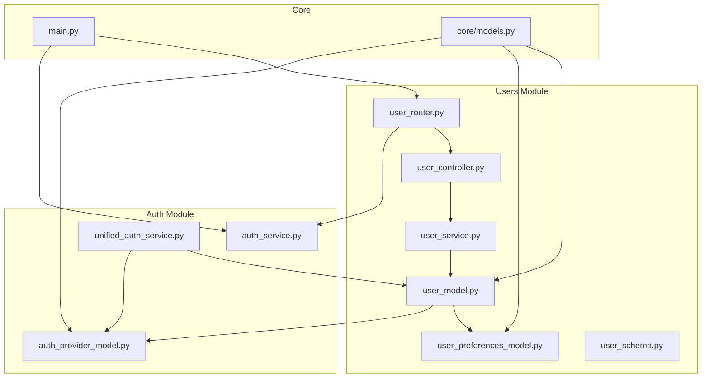
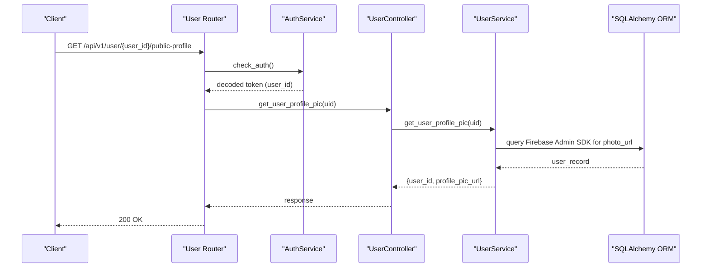
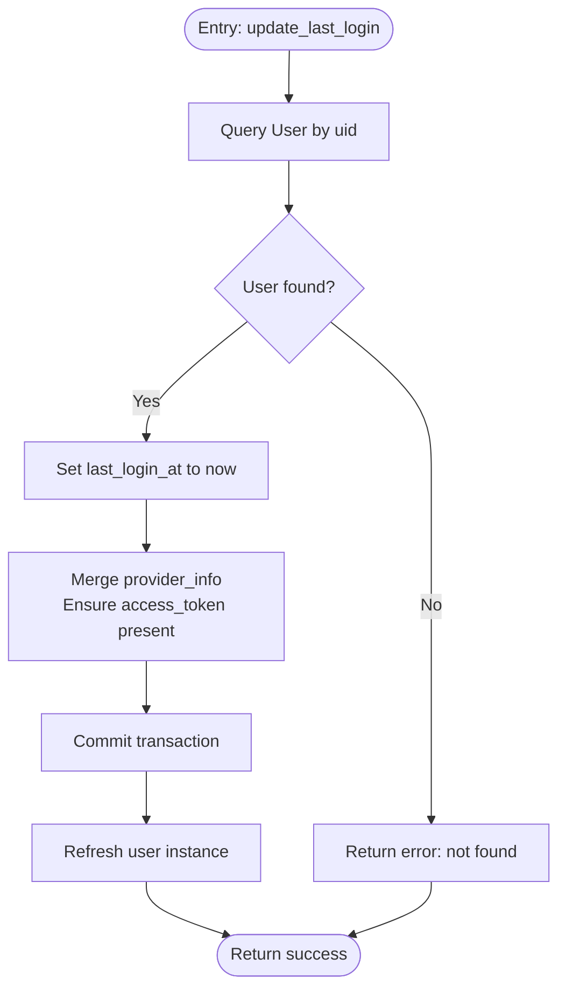
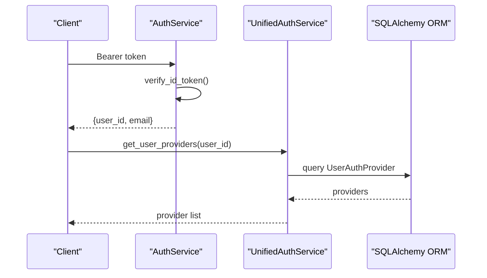
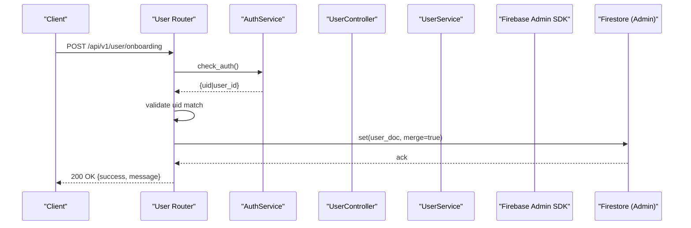
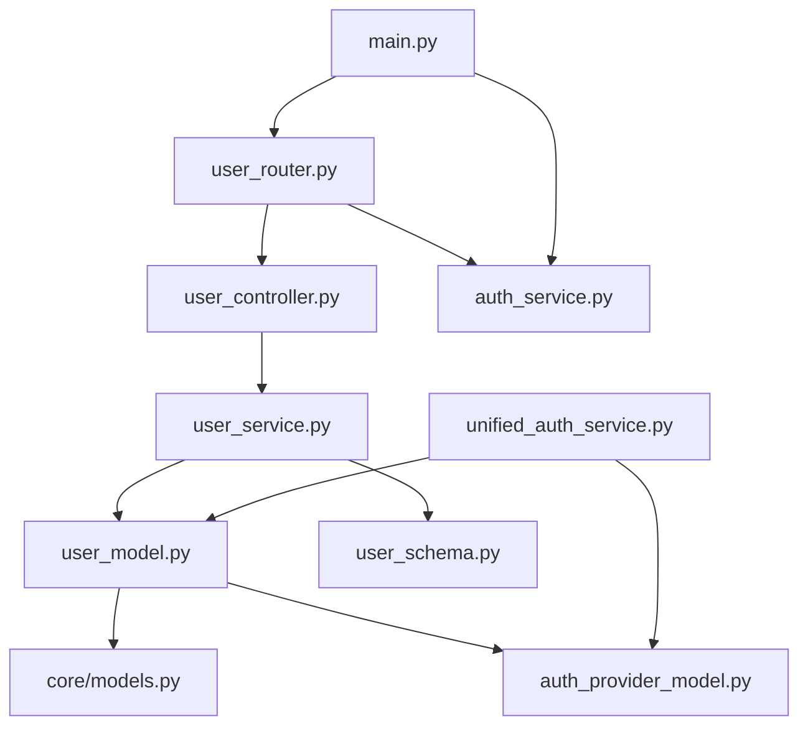

# User Management

<cite>
**Referenced Files in This Document**
- [user_model.py](file://app/modules/users/user_model.py)
- [user_preferences_model.py](file://app/modules/users/user_preferences_model.py)
- [user_schema.py](file://app/modules/users/user_schema.py)
- [user_service.py](file://app/modules/users/user_service.py)
- [user_controller.py](file://app/modules/users/user_controller.py)
- [user_router.py](file://app/modules/users/user_router.py)
- [auth_service.py](file://app/modules/auth/auth_service.py)
- [unified_auth_service.py](file://app/modules/auth/unified_auth_service.py)
- [auth_provider_model.py](file://app/modules/auth/auth_provider_model.py)
- [main.py](file://app/main.py)
- [router.py](file://app/api/router.py)
- [20240905144257_342902c88262_add_user_preferences_table.py](file://app/alembic/versions/20240905144257_342902c88262_add_user_preferences_table.py)
</cite>

## Table of Contents
1. [Introduction](#introduction)
2. [Project Structure](#project-structure)
3. [Core Components](#core-components)
4. [Architecture Overview](#architecture-overview)
5. [Detailed Component Analysis](#detailed-component-analysis)
6. [Dependency Analysis](#dependency-analysis)
7. [Performance Considerations](#performance-considerations)
8. [Troubleshooting Guide](#troubleshooting-guide)
9. [Conclusion](#conclusion)
10. [Appendices](#appendices)

## Introduction
Potpie’s user management system centralizes user profile handling, preference storage, and account lifecycle operations. It supports:
- User profiles: immutable identity fields, timestamps, and legacy provider metadata
- Preferences: structured JSON preferences keyed by user
- Account operations: authentication via Firebase, SSO provider linking, and profile picture retrieval
- API exposure: public profile retrieval and onboarding data persistence

The system is designed around a layered architecture:
- Data models define user and preferences schemas
- Services encapsulate business logic and persistence
- Controllers orchestrate service calls
- Routers expose endpoints with authentication guards

## Project Structure
The user management module resides under app/modules/users and integrates with authentication and database layers.



**Diagram sources**
- [user_model.py](file://app/modules/users/user_model.py#L17-L59)
- [user_preferences_model.py](file://app/modules/users/user_preferences_model.py#L7-L16)
- [user_service.py](file://app/modules/users/user_service.py#L20-L177)
- [user_controller.py](file://app/modules/users/user_controller.py#L9-L16)
- [user_router.py](file://app/modules/users/user_router.py#L19-L91)
- [auth_service.py](file://app/modules/auth/auth_service.py#L14-L108)
- [unified_auth_service.py](file://app/modules/auth/unified_auth_service.py#L57-L200)
- [auth_provider_model.py](file://app/modules/auth/auth_provider_model.py#L25-L200)
- [main.py](file://app/main.py#L147-L171)

**Section sources**
- [main.py](file://app/main.py#L147-L171)
- [user_model.py](file://app/modules/users/user_model.py#L17-L59)
- [user_preferences_model.py](file://app/modules/users/user_preferences_model.py#L7-L16)
- [user_service.py](file://app/modules/users/user_service.py#L20-L177)
- [user_controller.py](file://app/modules/users/user_controller.py#L9-L16)
- [user_router.py](file://app/modules/users/user_router.py#L19-L91)
- [auth_service.py](file://app/modules/auth/auth_service.py#L14-L108)
- [unified_auth_service.py](file://app/modules/auth/unified_auth_service.py#L57-L200)
- [auth_provider_model.py](file://app/modules/auth/auth_provider_model.py#L25-L200)

## Core Components
- User model: defines user identity, metadata, relationships, and helper methods for provider checks
- User preferences model: stores user-scoped JSON preferences with a foreign-key relationship to users
- User service: CRUD-like operations, last login updates, profile picture retrieval, and lookup helpers
- User controller: thin orchestrator delegating to service
- User router: exposes public profile retrieval and onboarding data persistence endpoints guarded by authentication
- Authentication services: Firebase-based bearer token verification and multi-provider SSO support
- Auth provider model: multi-provider linkage, pending links, organization SSO config, and audit logs

**Section sources**
- [user_model.py](file://app/modules/users/user_model.py#L17-L59)
- [user_preferences_model.py](file://app/modules/users/user_preferences_model.py#L7-L16)
- [user_service.py](file://app/modules/users/user_service.py#L20-L177)
- [user_controller.py](file://app/modules/users/user_controller.py#L9-L16)
- [user_router.py](file://app/modules/users/user_router.py#L19-L91)
- [auth_service.py](file://app/modules/auth/auth_service.py#L14-L108)
- [unified_auth_service.py](file://app/modules/auth/unified_auth_service.py#L57-L200)
- [auth_provider_model.py](file://app/modules/auth/auth_provider_model.py#L25-L200)

## Architecture Overview
The user management flow spans routers, controllers, services, and models, with authentication enforced at the router level and persistence handled by SQLAlchemy.



**Diagram sources**
- [user_router.py](file://app/modules/users/user_router.py#L19-L28)
- [auth_service.py](file://app/modules/auth/auth_service.py#L48-L104)
- [user_controller.py](file://app/modules/users/user_controller.py#L14-L15)
- [user_service.py](file://app/modules/users/user_service.py#L169-L176)

## Detailed Component Analysis

### User Data Models
The user entity and preferences are defined as SQLAlchemy models with relationships and indexes.

```mermaid
classDiagram
class User {
+string uid (PK)
+string email (UK)
+string display_name
+boolean email_verified
+timestamp created_at
+timestamp last_login_at
+jsonb provider_info
+string provider_username
+string organization
+string organization_name
+get_primary_provider()
+has_provider(provider_type) bool
}
class UserPreferences {
+string user_id (PK, FK)
+json preferences (default {})
}
class UserAuthProvider {
+uuid id (PK)
+string user_id (FK)
+string provider_type
+string provider_uid
+jsonb provider_data
+text access_token
+text refresh_token
+timestamp token_expires_at
+boolean is_primary
+timestamp linked_at
+timestamp last_used_at
+string linked_by_ip
+text linked_by_user_agent
}
User "1" --> "0..*" UserPreferences : "preferences (uselist=False)"
User "1" --> "0..*" UserAuthProvider : "auth_providers"
```

**Diagram sources**
- [user_model.py](file://app/modules/users/user_model.py#L17-L59)
- [user_preferences_model.py](file://app/modules/users/user_preferences_model.py#L7-L16)
- [auth_provider_model.py](file://app/modules/auth/auth_provider_model.py#L25-L83)

**Section sources**
- [user_model.py](file://app/modules/users/user_model.py#L17-L59)
- [user_preferences_model.py](file://app/modules/users/user_preferences_model.py#L7-L16)
- [auth_provider_model.py](file://app/modules/auth/auth_provider_model.py#L25-L83)

### User Preferences Schema and Storage
- Preferences are stored as JSON with a dedicated table keyed by user_id
- A database migration creates the user_preferences table with a foreign key to users and an index on user_id
- The User model defines a relationship to UserPreferences with uselist=False

Practical implications:
- Preference reads/writes are scoped per user_id
- Indexing improves lookup performance for user_id

**Section sources**
- [user_preferences_model.py](file://app/modules/users/user_preferences_model.py#L7-L16)
- [20240905144257_342902c88262_add_user_preferences_table.py](file://app/alembic/versions/20240905144257_342902c88262_add_user_preferences_table.py#L21-L33)

### User CRUD and Account Operations
- Create user: constructs a User instance from CreateUser schema and persists it
- Lookup helpers: by uid, by email, and batch by emails
- Last login update: sets last_login_at and optionally updates provider_info access_token
- Profile picture retrieval: queries Firebase Admin SDK asynchronously



**Diagram sources**
- [user_service.py](file://app/modules/users/user_service.py#L24-L56)

**Section sources**
- [user_service.py](file://app/modules/users/user_service.py#L24-L89)
- [user_service.py](file://app/modules/users/user_service.py#L114-L152)
- [user_service.py](file://app/modules/users/user_service.py#L169-L176)

### Authentication and Provider Linking
- AuthService enforces bearer token verification and normalizes token claims
- UnifiedAuthService manages multi-provider support, provider discovery, and token decryption
- AuthProvider model enables multiple providers per user, pending links, and organization SSO configuration



**Diagram sources**
- [auth_service.py](file://app/modules/auth/auth_service.py#L48-L104)
- [unified_auth_service.py](file://app/modules/auth/unified_auth_service.py#L104-L113)
- [auth_provider_model.py](file://app/modules/auth/auth_provider_model.py#L25-L83)

**Section sources**
- [auth_service.py](file://app/modules/auth/auth_service.py#L14-L108)
- [unified_auth_service.py](file://app/modules/auth/unified_auth_service.py#L57-L200)
- [auth_provider_model.py](file://app/modules/auth/auth_provider_model.py#L25-L200)

### Public Interfaces and API Endpoints
- Public profile retrieval: GET /api/v1/user/{user_id}/public-profile
  - Requires authenticated user (via AuthService.check_auth)
  - Returns user_id and profile_pic_url from Firebase
- Onboarding data persistence: POST /api/v1/user/onboarding
  - Requires authenticated user
  - Validates ownership (authenticated uid equals request uid)
  - Writes onboarding fields to Firestore (admin SDK)



**Diagram sources**
- [user_router.py](file://app/modules/users/user_router.py#L29-L91)
- [auth_service.py](file://app/modules/auth/auth_service.py#L48-L104)

**Section sources**
- [user_router.py](file://app/modules/users/user_router.py#L19-L91)
- [auth_service.py](file://app/modules/auth/auth_service.py#L48-L104)

### User Schema Definitions
- CreateUser: used to construct new User instances
- UserProfileResponse: response shape for public profile picture retrieval
- OnboardingDataRequest/OnboardingDataResponse: request/response for onboarding data persistence

Validation and normalization:
- AuthService normalizes Firebase tokens to include user_id for internal consistency
- Router validates ownership for onboarding writes

**Section sources**
- [user_schema.py](file://app/modules/users/user_schema.py#L25-L54)
- [auth_service.py](file://app/modules/auth/auth_service.py#L82-L95)
- [user_router.py](file://app/modules/users/user_router.py#L40-L54)

## Dependency Analysis
The user module depends on:
- Core models for database initialization and imports
- Auth services for authentication and provider management
- Firebase Admin SDK for profile picture retrieval and onboarding data persistence



**Diagram sources**
- [main.py](file://app/main.py#L147-L171)
- [core/models.py](file://app/core/models.py#L18-L25)
- [user_model.py](file://app/modules/users/user_model.py#L17-L59)
- [auth_provider_model.py](file://app/modules/auth/auth_provider_model.py#L25-L83)
- [user_service.py](file://app/modules/users/user_service.py#L9-L11)
- [user_controller.py](file://app/modules/users/user_controller.py#L6-L12)
- [user_router.py](file://app/modules/users/user_router.py#L4-L13)
- [auth_service.py](file://app/modules/auth/auth_service.py#L6-L9)
- [unified_auth_service.py](file://app/modules/auth/unified_auth_service.py#L41-L52)

**Section sources**
- [main.py](file://app/main.py#L147-L171)
- [core/models.py](file://app/core/models.py#L18-L25)

## Performance Considerations
- Indexing: user_preferences table includes an index on user_id to optimize preference lookups
- Asynchronous profile picture retrieval: UserService.get_user_profile_pic uses async threading to avoid blocking
- Batch lookups: get_user_ids_by_emails performs a single query with an IN clause
- Token handling: provider_info access_token is merged defensively to avoid mutation issues

Recommendations:
- Prefer batch operations for bulk user lookups
- Cache frequently accessed user preferences where appropriate
- Monitor Firebase Admin SDK calls for rate limits

**Section sources**
- [user_preferences_model.py](file://app/modules/users/user_preferences_model.py#L15-L16)
- [user_service.py](file://app/modules/users/user_service.py#L169-L176)
- [user_service.py](file://app/modules/users/user_service.py#L154-L167)

## Troubleshooting Guide
Common issues and resolutions:
- Authentication failures
  - Ensure Bearer token is provided and valid; AuthService.check_auth raises 401 if missing or invalid
  - Confirm token normalization includes user_id for internal consistency
- Onboarding data write errors
  - Verify authenticated uid matches request uid; router enforces ownership
  - Check Firestore admin credentials and collection permissions
- User not found
  - Creation and lookup methods return None or raise errors; confirm uid/email correctness
- Provider linking
  - Use UnifiedAuthService.get_user_providers to inspect linked providers
  - PendingProviderLink entries are temporary and expire after a short time window

Operational tips:
- Enable development mode for local testing; dummy user is created automatically
- Review logs for detailed error messages from services and routers

**Section sources**
- [auth_service.py](file://app/modules/auth/auth_service.py#L68-L104)
- [user_router.py](file://app/modules/users/user_router.py#L46-L53)
- [user_service.py](file://app/modules/users/user_service.py#L114-L120)
- [unified_auth_service.py](file://app/modules/auth/unified_auth_service.py#L104-L113)

## Conclusion
Potpie’s user management system provides a robust foundation for user profiles, preferences, and account operations. It leverages Firebase for authentication and profile data, supports multi-provider SSO through dedicated models and services, and exposes clear APIs for public profile retrieval and onboarding data persistence. The layered design promotes separation of concerns, while migrations and indexing ensure scalable persistence.

## Appendices

### Practical Examples

- User registration
  - Construct a CreateUser payload and persist via UserService.create_user
  - Fields include uid, email, display_name, email_verified, timestamps, provider_info, and optional provider_username

- Profile updates
  - Update last login timestamp and provider_info access_token using UserService.update_last_login
  - Retrieve profile picture via UserService.get_user_profile_pic

- Preference changes
  - Store user preferences in the user_preferences table keyed by user_id
  - Use the relationship on User to access preferences consistently

- Account operations
  - Retrieve authenticated user via AuthService.check_auth
  - Persist onboarding data to Firestore with proper ownership validation

**Section sources**
- [user_service.py](file://app/modules/users/user_service.py#L58-L89)
- [user_service.py](file://app/modules/users/user_service.py#L24-L56)
- [user_service.py](file://app/modules/users/user_service.py#L169-L176)
- [user_router.py](file://app/modules/users/user_router.py#L29-L91)
- [user_preferences_model.py](file://app/modules/users/user_preferences_model.py#L7-L16)