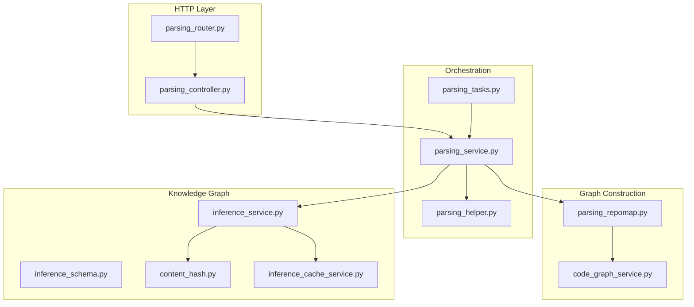
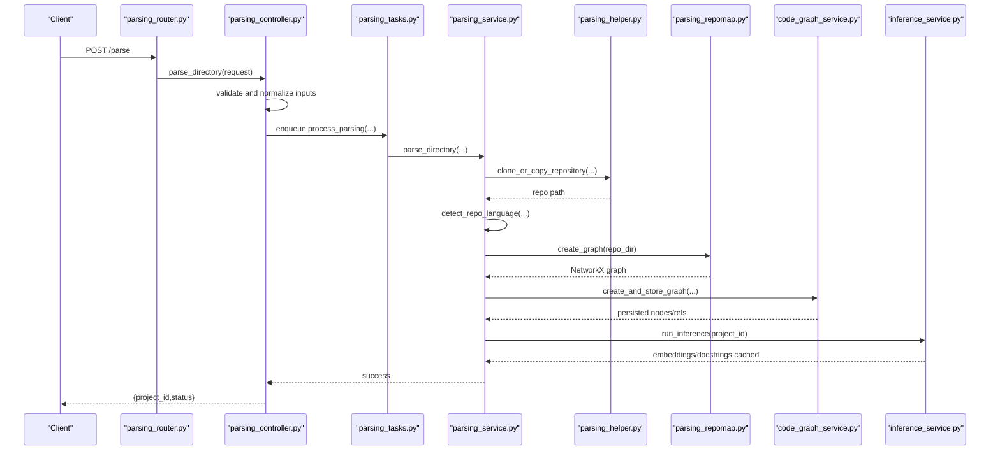
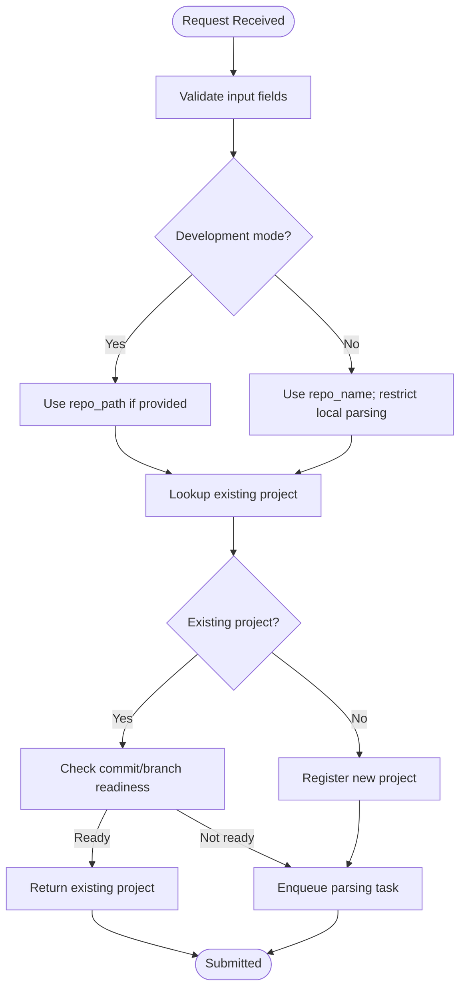
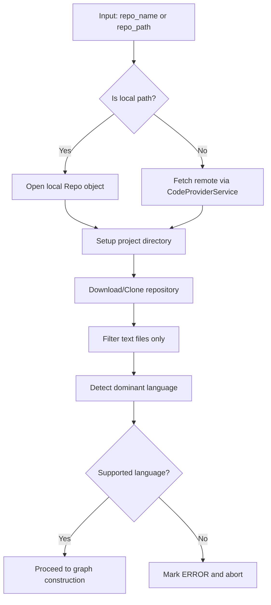
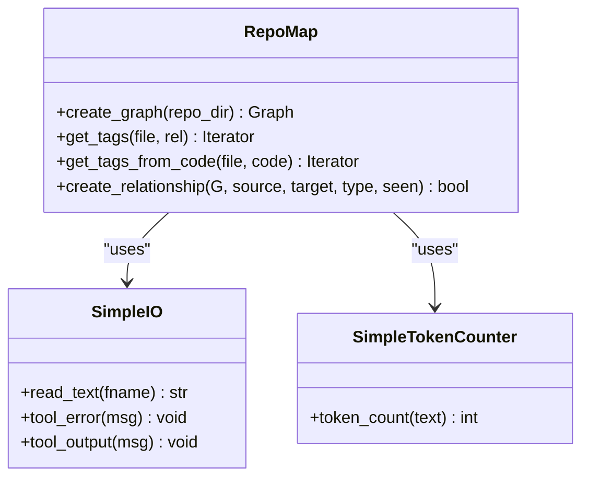
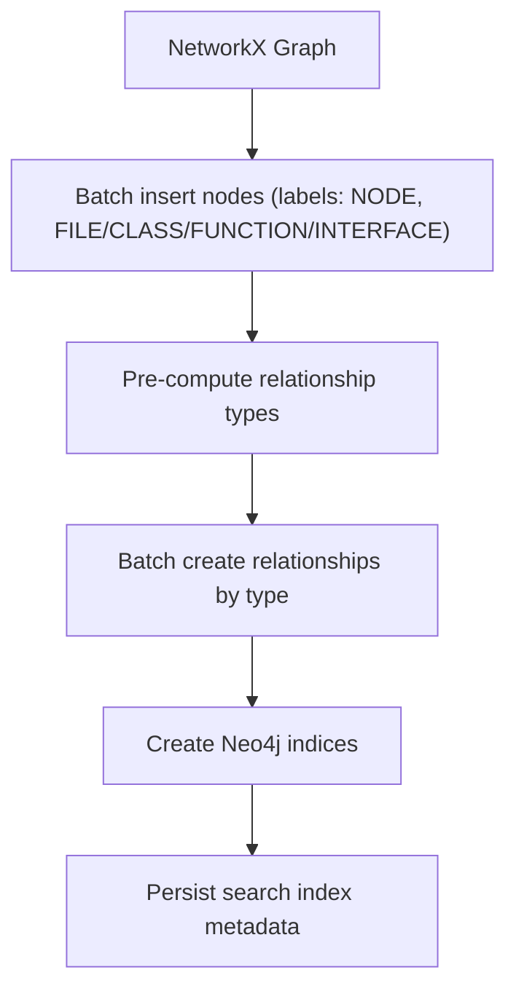
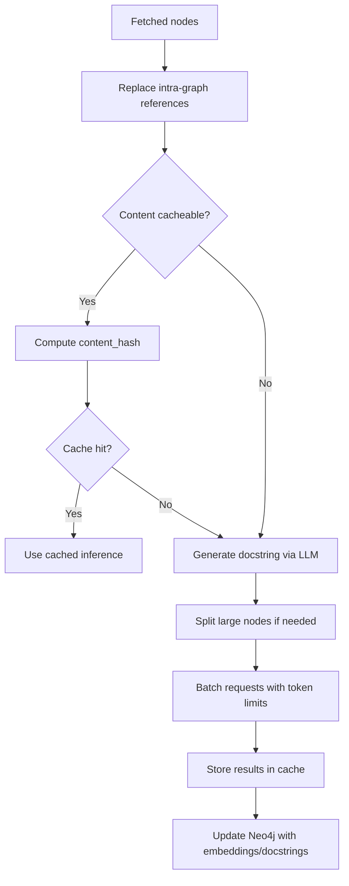
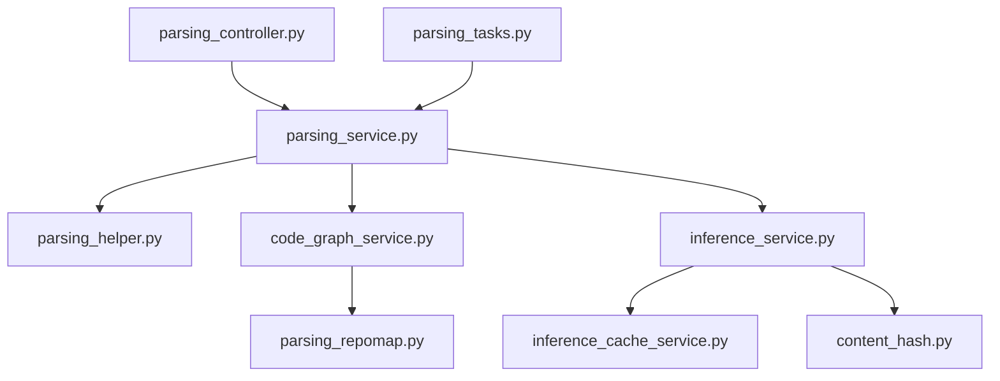

# Code Parsing & Knowledge Graph

<cite>
**Referenced Files in This Document**
- [parsing_service.py](file://app/modules/parsing/graph_construction/parsing_service.py)
- [code_graph_service.py](file://app/modules/parsing/graph_construction/code_graph_service.py)
- [parsing_controller.py](file://app/modules/parsing/graph_construction/parsing_controller.py)
- [parsing_router.py](file://app/modules/parsing/graph_construction/parsing_router.py)
- [parsing_helper.py](file://app/modules/parsing/graph_construction/parsing_helper.py)
- [parsing_schema.py](file://app/modules/parsing/graph_construction/parsing_schema.py)
- [parsing_repomap.py](file://app/modules/parsing/graph_construction/parsing_repomap.py)
- [inference_service.py](file://app/modules/parsing/knowledge_graph/inference_service.py)
- [inference_schema.py](file://app/modules/parsing/knowledge_graph/inference_schema.py)
- [content_hash.py](file://app/modules/parsing/utils/content_hash.py)
- [inference_cache_service.py](file://app/modules/parsing/services/inference_cache_service.py)
- [parsing_tasks.py](file://app/celery/tasks/parsing_tasks.py)
- [tree-sitter-python-tags.scm](file://app/modules/parsing/graph_construction/queries/tree-sitter-python-tags.scm)
- [tree-sitter-javascript-tags.scm](file://app/modules/parsing/graph_construction/queries/tree-sitter-javascript-tags.scm)
- [tree-sitter-java-tags.scm](file://app/modules/parsing/graph_construction/queries/tree-sitter-java-tags.scm)
</cite>

## Table of Contents
1. [Introduction](#introduction)
2. [Project Structure](#project-structure)
3. [Core Components](#core-components)
4. [Architecture Overview](#architecture-overview)
5. [Detailed Component Analysis](#detailed-component-analysis)
6. [Dependency Analysis](#dependency-analysis)
7. [Performance Considerations](#performance-considerations)
8. [Troubleshooting Guide](#troubleshooting-guide)
9. [Conclusion](#conclusion)
10. [Appendices](#appendices)

## Introduction
Potpie transforms static code repositories into interactive knowledge graphs to power AI agents with contextual understanding. The parsing pipeline extracts code relationships across multiple languages using Tree-sitter queries, builds a Neo4j graph enriched with embeddings and docstrings, and exposes APIs for querying and traversal. This document explains the end-to-end flow, from repository ingestion to graph construction and inference, with both conceptual overviews for newcomers and technical details for advanced users.

## Project Structure
The parsing and knowledge graph system is organized around:
- HTTP entry points and orchestration
- Repository ingestion and preprocessing
- Multi-language AST parsing and graph construction
- Knowledge graph enrichment and search indexing
- Asynchronous task execution and caching

**Diagram sources**
- [parsing_router.py](file://app/modules/parsing/graph_construction/parsing_router.py#L1-L39)
- [parsing_controller.py](file://app/modules/parsing/graph_construction/parsing_controller.py#L1-L384)
- [parsing_service.py](file://app/modules/parsing/graph_construction/parsing_service.py#L1-L477)
- [parsing_helper.py](file://app/modules/parsing/graph_construction/parsing_helper.py#L1-L800)
- [parsing_repomap.py](file://app/modules/parsing/graph_construction/parsing_repomap.py#L1-L839)
- [code_graph_service.py](file://app/modules/parsing/graph_construction/code_graph_service.py#L1-L240)
- [inference_service.py](file://app/modules/parsing/knowledge_graph/inference_service.py#L1-L1171)
- [inference_schema.py](file://app/modules/parsing/knowledge_graph/inference_schema.py#L1-L35)
- [content_hash.py](file://app/modules/parsing/utils/content_hash.py#L1-L69)
- [inference_cache_service.py](file://app/modules/parsing/services/inference_cache_service.py#L1-L149)
- [parsing_tasks.py](file://app/celery/tasks/parsing_tasks.py#L1-L58)

**Section sources**
- [parsing_router.py](file://app/modules/parsing/graph_construction/parsing_router.py#L1-L39)
- [parsing_controller.py](file://app/modules/parsing/graph_construction/parsing_controller.py#L1-L384)
- [parsing_service.py](file://app/modules/parsing/graph_construction/parsing_service.py#L1-L477)

## Core Components
- ParsingController: Validates inputs, manages project lifecycle, enqueues parsing tasks, and exposes status endpoints.
- ParsingService: Orchestrates repository cloning/extraction, language detection, graph creation, and inference.
- ParseHelper: Handles repository access (local/remote), archive extraction, text filtering, and language detection.
- RepoMap: Multi-language AST parsing using Tree-sitter with language-specific queries; constructs a NetworkX graph of files, classes, functions, and references.
- CodeGraphService: Translates the NetworkX graph into Neo4j, creates indices, and provides graph operations.
- InferenceService: Generates docstrings and summaries, performs batching and chunking, manages embeddings, and updates Neo4j with results.
- InferenceCacheService: Provides a global cache for inference results keyed by content hash.
- ContentHash: Utilities for deterministic content hashing and cache eligibility checks.

**Section sources**
- [parsing_controller.py](file://app/modules/parsing/graph_construction/parsing_controller.py#L1-L384)
- [parsing_service.py](file://app/modules/parsing/graph_construction/parsing_service.py#L1-L477)
- [parsing_helper.py](file://app/modules/parsing/graph_construction/parsing_helper.py#L1-L800)
- [parsing_repomap.py](file://app/modules/parsing/graph_construction/parsing_repomap.py#L1-L839)
- [code_graph_service.py](file://app/modules/parsing/graph_construction/code_graph_service.py#L1-L240)
- [inference_service.py](file://app/modules/parsing/knowledge_graph/inference_service.py#L1-L1171)
- [inference_cache_service.py](file://app/modules/parsing/services/inference_cache_service.py#L1-L149)
- [content_hash.py](file://app/modules/parsing/utils/content_hash.py#L1-L69)

## Architecture Overview
The system follows an asynchronous, layered architecture:
- HTTP endpoints accept parsing requests and return immediate status.
- Celery tasks execute long-running parsing work off the main thread.
- ParseHelper prepares a filtered, text-only repository snapshot.
- RepoMap parses ASTs and builds a NetworkX graph.
- CodeGraphService persists the graph to Neo4j and creates indices.
- InferenceService enriches nodes with embeddings and docstrings, and maintains a global cache.

**Diagram sources**
- [parsing_router.py](file://app/modules/parsing/graph_construction/parsing_router.py#L1-L39)
- [parsing_controller.py](file://app/modules/parsing/graph_construction/parsing_controller.py#L1-L384)
- [parsing_tasks.py](file://app/celery/tasks/parsing_tasks.py#L1-L58)
- [parsing_service.py](file://app/modules/parsing/graph_construction/parsing_service.py#L1-L477)
- [parsing_helper.py](file://app/modules/parsing/graph_construction/parsing_helper.py#L1-L800)
- [parsing_repomap.py](file://app/modules/parsing/graph_construction/parsing_repomap.py#L1-L839)
- [code_graph_service.py](file://app/modules/parsing/graph_construction/code_graph_service.py#L1-L240)
- [inference_service.py](file://app/modules/parsing/knowledge_graph/inference_service.py#L1-L1171)

## Detailed Component Analysis

### Parsing Pipeline Orchestration
- Parses incoming requests, handles demo project duplication, and enqueues Celery tasks.
- Supports local and remote repositories, with development mode restrictions.
- Exposes status endpoints to check parsing progress and freshness.

**Section sources**
- [parsing_controller.py](file://app/modules/parsing/graph_construction/parsing_controller.py#L1-L384)
- [parsing_router.py](file://app/modules/parsing/graph_construction/parsing_router.py#L1-L39)

### Repository Access and Preparation
- Detects whether the input is a local path or remote repository.
- Downloads archives or clones repositories, filtering to text files only.
- Determines predominant language across the repository to gate graph construction.

**Section sources**
- [parsing_helper.py](file://app/modules/parsing/graph_construction/parsing_helper.py#L1-L800)

### Multi-Language AST Parsing and Relationship Mapping
- Uses Tree-sitter parsers and language-specific queries to extract definitions and references.
- Builds a NetworkX graph with nodes for FILE, CLASS, INTERFACE, FUNCTION, and relationships like CONTAINS and REFERENCES.
- Applies directionality rules to ensure semantic correctness (e.g., caller → callee).

**Diagram sources**
- [parsing_repomap.py](file://app/modules/parsing/graph_construction/parsing_repomap.py#L1-L839)

**Section sources**
- [parsing_repomap.py](file://app/modules/parsing/graph_construction/parsing_repomap.py#L1-L839)
- [tree-sitter-python-tags.scm](file://app/modules/parsing/graph_construction/queries/tree-sitter-python-tags.scm#L1-L13)
- [tree-sitter-javascript-tags.scm](file://app/modules/parsing/graph_construction/queries/tree-sitter-javascript-tags.scm#L1-L89)
- [tree-sitter-java-tags.scm](file://app/modules/parsing/graph_construction/queries/tree-sitter-java-tags.scm#L1-L36)

### Knowledge Graph Construction and Indexing
- Converts the NetworkX graph to Neo4j, batching node and relationship creation.
- Creates specialized indices for efficient lookups and relationship queries.
- Cleans up prior graph snapshots for a project before rebuilding.

**Section sources**
- [code_graph_service.py](file://app/modules/parsing/graph_construction/code_graph_service.py#L1-L240)

### Inference, Docstrings, and Embeddings
- Batches nodes by token budget, splits oversized nodes, and consolidates chunked responses.
- Resolves intra-graph references to improve cacheability and consistency.
- Stores and retrieves cached inference results keyed by content hash.
- Updates Neo4j with embeddings and docstrings.

**Section sources**
- [inference_service.py](file://app/modules/parsing/knowledge_graph/inference_service.py#L1-L1171)
- [inference_cache_service.py](file://app/modules/parsing/services/inference_cache_service.py#L1-L149)
- [content_hash.py](file://app/modules/parsing/utils/content_hash.py#L1-L69)

### Public Interfaces and Parameters
- ParsingRequest: repo_name or repo_path, branch_name, commit_id.
- ParsingStatusRequest: repo_name, commit_id, branch_name.
- QueryRequest/QueryResponse: project_id, query, optional node_ids; returns node_id, docstring, file_path, line range, similarity.

**Section sources**
- [parsing_schema.py](file://app/modules/parsing/graph_construction/parsing_schema.py#L1-L39)
- [inference_schema.py](file://app/modules/parsing/knowledge_graph/inference_schema.py#L1-L35)

## Dependency Analysis
Key dependencies and coupling:
- ParsingController depends on ParsingService, Celery tasks, and project services.
- ParsingService depends on ParseHelper, CodeGraphService, InferenceService, and search services.
- RepoMap depends on Tree-sitter language pack and language-specific SCM queries.
- InferenceService depends on ProviderService for LLM calls, SentenceTransformer for embeddings, and InferenceCacheService.

**Diagram sources**
- [parsing_controller.py](file://app/modules/parsing/graph_construction/parsing_controller.py#L1-L384)
- [parsing_service.py](file://app/modules/parsing/graph_construction/parsing_service.py#L1-L477)
- [parsing_helper.py](file://app/modules/parsing/graph_construction/parsing_helper.py#L1-L800)
- [code_graph_service.py](file://app/modules/parsing/graph_construction/code_graph_service.py#L1-L240)
- [parsing_repomap.py](file://app/modules/parsing/graph_construction/parsing_repomap.py#L1-L839)
- [inference_service.py](file://app/modules/parsing/knowledge_graph/inference_service.py#L1-L1171)
- [inference_cache_service.py](file://app/modules/parsing/services/inference_cache_service.py#L1-L149)
- [content_hash.py](file://app/modules/parsing/utils/content_hash.py#L1-L69)
- [parsing_tasks.py](file://app/celery/tasks/parsing_tasks.py#L1-L58)

**Section sources**
- [parsing_controller.py](file://app/modules/parsing/graph_construction/parsing_controller.py#L1-L384)
- [parsing_service.py](file://app/modules/parsing/graph_construction/parsing_service.py#L1-L477)

## Performance Considerations
- Batching: Both node and relationship creation use fixed-size batches to reduce transaction overhead.
- Indices: Composite and lookup indices optimize lookups by repoId, node_id, and relationship types.
- Token budgeting: Inference batches cap token usage per request and split oversized nodes.
- Caching: Content hashing and cache eligibility reduce redundant LLM calls; embeddings reused when available.
- Parallelism: Semaphore controls concurrent LLM requests; Celery tasks run asynchronously.

[No sources needed since this section provides general guidance]

## Troubleshooting Guide
Common issues and remedies:
- Repository access failures: Verify credentials and provider configuration; private repositories may require archive fallback or git clone with credentials.
- Unsupported language: Language detection returns “other” when no supported extensions are found; ensure repository contains recognized file types.
- Large repositories: Pagination and token budgeting mitigate timeouts; consider limiting branches or commits.
- Neo4j connectivity: Ensure driver credentials and indices are configured; check logs for connection errors.
- Cache misses: Confirm content meets minimum length and uniqueness thresholds; unresolved references prevent caching.

**Section sources**
- [parsing_helper.py](file://app/modules/parsing/graph_construction/parsing_helper.py#L1-L800)
- [parsing_service.py](file://app/modules/parsing/graph_construction/parsing_service.py#L1-L477)
- [inference_service.py](file://app/modules/parsing/knowledge_graph/inference_service.py#L1-L1171)
- [content_hash.py](file://app/modules/parsing/utils/content_hash.py#L1-L69)

## Conclusion
Potpie’s parsing and knowledge graph system provides a robust, scalable foundation for turning codebases into navigable, searchable graphs. By combining multi-language AST parsing, semantic relationship mapping, and LLM-powered enrichment with caching and embeddings, it enables AI agents to understand and act upon codebases efficiently. The modular design, asynchronous task execution, and careful indexing ensure performance and reliability at scale.

[No sources needed since this section summarizes without analyzing specific files]

## Appendices

### Practical Examples
- Repository analysis: Submit a parsing request with repo_name and branch_name; receive a project_id and monitor status via GET endpoints.
- Graph querying: Use the knowledge graph endpoints to retrieve nodes, neighbors, and docstrings by node_id or project_id.
- Relationship extraction: Traverse relationships in Neo4j using Cypher queries targeting repoId and node labels.

[No sources needed since this section provides general guidance]