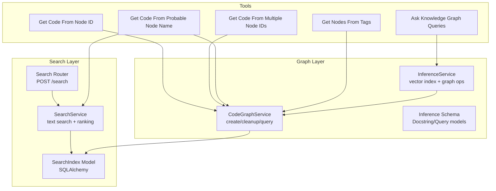
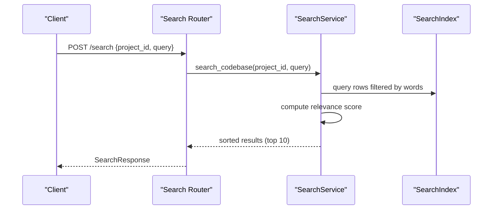
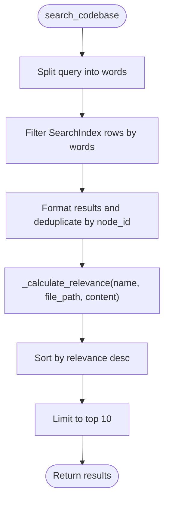
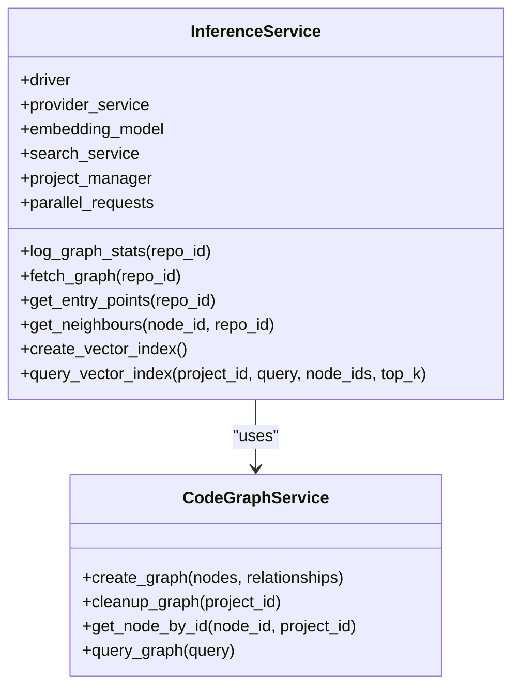
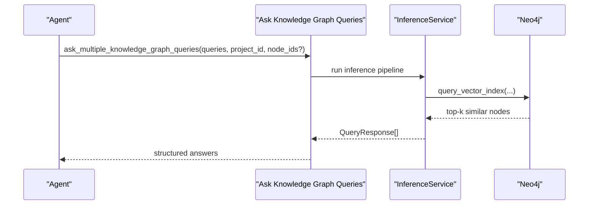
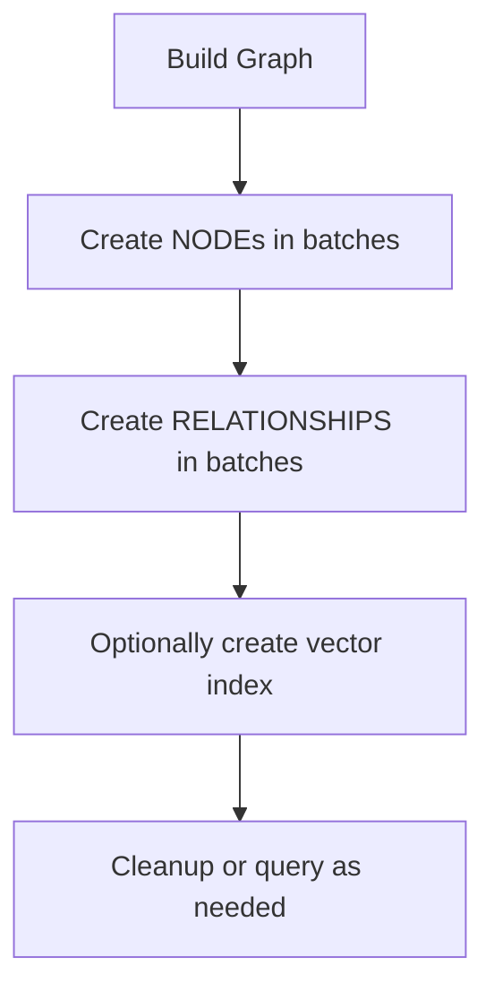
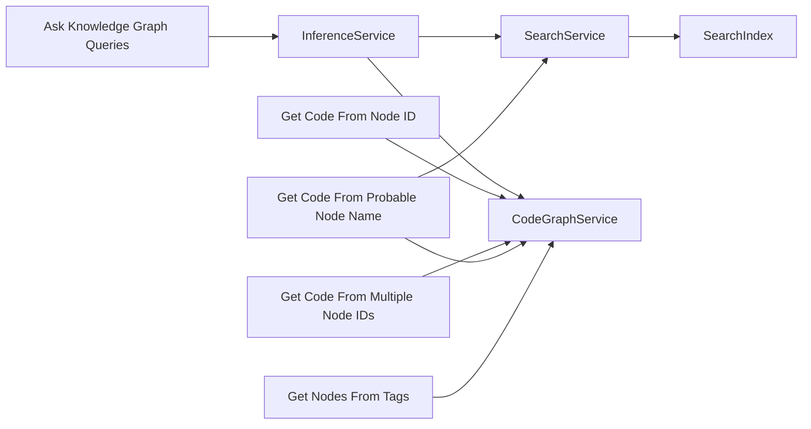

# Graph Querying & Analysis

<cite>
**Referenced Files in This Document**
- [inference_service.py](file://app/modules/parsing/knowledge_graph/inference_service.py)
- [inference_schema.py](file://app/modules/parsing/knowledge_graph/inference_schema.py)
- [search_service.py](file://app/modules/search/search_service.py)
- [search_router.py](file://app/modules/search/search_router.py)
- [search_schema.py](file://app/modules/search/search_schema.py)
- [search_models.py](file://app/modules/search/search_models.py)
- [get_code_from_node_id_tool.py](file://app/modules/intelligence/tools/kg_based_tools/get_code_from_node_id_tool.py)
- [get_code_from_multiple_node_ids_tool.py](file://app/modules/intelligence/tools/kg_based_tools/get_code_from_multiple_node_ids_tool.py)
- [get_code_from_probable_node_name_tool.py](file://app/modules/intelligence/tools/kg_based_tools/get_code_from_probable_node_name_tool.py)
- [get_nodes_from_tags_tool.py](file://app/modules/intelligence/tools/kg_based_tools/get_nodes_from_tags_tool.py)
- [ask_knowledge_graph_queries_tool.py](file://app/modules/intelligence/tools/kg_based_tools/ask_knowledge_graph_queries_tool.py)
- [code_graph_service.py](file://app/modules/parsing/graph_construction/code_graph_service.py)
- [parsing_service.py](file://app/modules/parsing/graph_construction/parsing_service.py)
</cite>

## Table of Contents
1. [Introduction](#introduction)
2. [Project Structure](#project-structure)
3. [Core Components](#core-components)
4. [Architecture Overview](#architecture-overview)
5. [Detailed Component Analysis](#detailed-component-analysis)
6. [Dependency Analysis](#dependency-analysis)
7. [Performance Considerations](#performance-considerations)
8. [Troubleshooting Guide](#troubleshooting-guide)
9. [Conclusion](#conclusion)

## Introduction
This document explains how to query and analyze the knowledge graph to discover code insights, relationships, and patterns. It covers:
- How to use Cypher queries and specialized tools to traverse the graph and surface relevant code artifacts
- The search service architecture and ranking algorithms for text-based queries
- Vector similarity search integration for semantic retrieval
- Practical examples from the codebase showing graph traversal patterns, relationship discovery, and hybrid search strategies
- Configuration options, result filtering, and performance tuning for large-scale graphs

## Project Structure
The graph querying and analysis system spans several modules:
- Knowledge graph inference and vector indexing
- Text-based search service backed by a relational index
- Specialized tools for retrieving code and relationships from the graph
- Graph construction utilities that create nodes and relationships

**Diagram sources**
- [search_router.py](file://app/modules/search/search_router.py#L13-L23)
- [search_service.py](file://app/modules/search/search_service.py#L19-L71)
- [search_models.py](file://app/modules/search/search_models.py#L7-L17)
- [code_graph_service.py](file://app/modules/parsing/graph_construction/code_graph_service.py#L101-L199)
- [inference_service.py](file://app/modules/parsing/knowledge_graph/inference_service.py#L45-L61)
- [inference_schema.py](file://app/modules/parsing/knowledge_graph/inference_schema.py#L6-L35)
- [get_code_from_node_id_tool.py](file://app/modules/intelligence/tools/kg_based_tools/get_code_from_node_id_tool.py#L55-L98)
- [get_code_from_multiple_node_ids_tool.py](file://app/modules/intelligence/tools/kg_based_tools/get_code_from_multiple_node_ids_tool.py#L56-L98)
- [get_code_from_probable_node_name_tool.py](file://app/modules/intelligence/tools/kg_based_tools/get_code_from_probable_node_name_tool.py#L101-L124)
- [get_nodes_from_tags_tool.py](file://app/modules/intelligence/tools/kg_based_tools/get_nodes_from_tags_tool.py#L52-L102)
- [ask_knowledge_graph_queries_tool.py](file://app/modules/intelligence/tools/kg_based_tools/ask_knowledge_graph_queries_tool.py#L57-L120)

**Section sources**
- [search_router.py](file://app/modules/search/search_router.py#L13-L23)
- [search_service.py](file://app/modules/search/search_service.py#L19-L71)
- [search_models.py](file://app/modules/search/search_models.py#L7-L17)
- [code_graph_service.py](file://app/modules/parsing/graph_construction/code_graph_service.py#L101-L199)
- [inference_service.py](file://app/modules/parsing/knowledge_graph/inference_service.py#L45-L61)
- [inference_schema.py](file://app/modules/parsing/knowledge_graph/inference_schema.py#L6-L35)
- [get_code_from_node_id_tool.py](file://app/modules/intelligence/tools/kg_based_tools/get_code_from_node_id_tool.py#L55-L98)
- [get_code_from_multiple_node_ids_tool.py](file://app/modules/intelligence/tools/kg_based_tools/get_code_from_multiple_node_ids_tool.py#L56-L98)
- [get_code_from_probable_node_name_tool.py](file://app/modules/intelligence/tools/kg_based_tools/get_code_from_probable_node_name_tool.py#L101-L124)
- [get_nodes_from_tags_tool.py](file://app/modules/intelligence/tools/kg_based_tools/get_nodes_from_tags_tool.py#L52-L102)
- [ask_knowledge_graph_queries_tool.py](file://app/modules/intelligence/tools/kg_based_tools/ask_knowledge_graph_queries_tool.py#L57-L120)

## Core Components
- SearchService: Implements text-based search over a relational index, computes relevance scores, and returns ranked results.
- CodeGraphService: Creates nodes and relationships in Neo4j, supports cleanup, and executes arbitrary Cypher queries.
- InferenceService: Manages graph statistics, performs graph traversal, generates embeddings, and creates vector indexes for semantic search.
- KG-based Tools: Provide specialized interfaces to retrieve code, discover neighbors, filter by tags, and ask natural language questions against the knowledge graph.

Key capabilities:
- Text search with relevance scoring and partial/exact match detection
- Graph traversal for entry points and neighbors
- Vector similarity search with configurable top-k
- Hybrid workflows combining text and vector search

**Section sources**
- [search_service.py](file://app/modules/search/search_service.py#L19-L71)
- [code_graph_service.py](file://app/modules/parsing/graph_construction/code_graph_service.py#L101-L199)
- [inference_service.py](file://app/modules/parsing/knowledge_graph/inference_service.py#L62-L133)
- [inference_service.py](file://app/modules/parsing/knowledge_graph/inference_service.py#L1102-L1127)
- [inference_schema.py](file://app/modules/parsing/knowledge_graph/inference_schema.py#L6-L35)

## Architecture Overview
The system integrates three layers:
- Text search layer for keyword-based discovery
- Graph traversal and vector indexing layer for semantic understanding
- Tool layer exposing specialized operations to end-users and agents

**Diagram sources**
- [search_router.py](file://app/modules/search/search_router.py#L13-L23)
- [search_service.py](file://app/modules/search/search_service.py#L19-L71)
- [search_models.py](file://app/modules/search/search_models.py#L7-L17)

## Detailed Component Analysis

### Text-Based Search Service
Text search is implemented with:
- Word-based filtering across name, file_path, and content
- Relevance scoring favoring exact matches and higher-weighted fields
- Partial vs exact match classification
- Top-N result limiting

**Diagram sources**
- [search_service.py](file://app/modules/search/search_service.py#L19-L71)
- [search_service.py](file://app/modules/search/search_service.py#L73-L99)
- [search_service.py](file://app/modules/search/search_service.py#L101-L104)

**Section sources**
- [search_service.py](file://app/modules/search/search_service.py#L19-L71)
- [search_service.py](file://app/modules/search/search_service.py#L73-L99)
- [search_service.py](file://app/modules/search/search_service.py#L101-L104)
- [search_schema.py](file://app/modules/search/search_schema.py#L6-L27)
- [search_models.py](file://app/modules/search/search_models.py#L7-L17)

### Knowledge Graph Inference and Vector Similarity
InferenceService provides:
- Graph statistics logging and node fetching with pagination
- Entry point discovery and neighbor traversal
- Vector index creation and querying with semantic similarity
- Integration with a SentenceTransformer model for embeddings

**Diagram sources**
- [inference_service.py](file://app/modules/parsing/knowledge_graph/inference_service.py#L45-L61)
- [inference_service.py](file://app/modules/parsing/knowledge_graph/inference_service.py#L1102-L1127)
- [code_graph_service.py](file://app/modules/parsing/graph_construction/code_graph_service.py#L101-L199)

**Section sources**
- [inference_service.py](file://app/modules/parsing/knowledge_graph/inference_service.py#L45-L61)
- [inference_service.py](file://app/modules/parsing/knowledge_graph/inference_service.py#L1102-L1127)
- [code_graph_service.py](file://app/modules/parsing/graph_construction/code_graph_service.py#L101-L199)

### Tools for Graph Traversal and Retrieval
- Get Code From Node ID: Retrieves a single node’s code and docstring by node_id.
- Get Code From Multiple Node IDs: Parallel retrieval for multiple nodes.
- Get Code From Probable Node Name: Uses text search to find a node by a likely name, then retrieves code.
- Get Nodes From Tags: Filters nodes by tags (e.g., API, DATABASE).
- Ask Knowledge Graph Queries: Natural language queries against the knowledge graph.

**Diagram sources**
- [ask_knowledge_graph_queries_tool.py](file://app/modules/intelligence/tools/kg_based_tools/ask_knowledge_graph_queries_tool.py#L57-L120)
- [inference_service.py](file://app/modules/parsing/knowledge_graph/inference_service.py#L1102-L1127)
- [inference_schema.py](file://app/modules/parsing/knowledge_graph/inference_schema.py#L22-L35)

**Section sources**
- [get_code_from_node_id_tool.py](file://app/modules/intelligence/tools/kg_based_tools/get_code_from_node_id_tool.py#L55-L98)
- [get_code_from_multiple_node_ids_tool.py](file://app/modules/intelligence/tools/kg_based_tools/get_code_from_multiple_node_ids_tool.py#L56-L98)
- [get_code_from_probable_node_name_tool.py](file://app/modules/intelligence/tools/kg_based_tools/get_code_from_probable_node_name_tool.py#L101-L124)
- [get_nodes_from_tags_tool.py](file://app/modules/intelligence/tools/kg_based_tools/get_nodes_from_tags_tool.py#L52-L102)
- [ask_knowledge_graph_queries_tool.py](file://app/modules/intelligence/tools/kg_based_tools/ask_knowledge_graph_queries_tool.py#L57-L120)

### Graph Construction and Relationship Discovery
Graph construction utilities:
- Create nodes and relationships in batches
- Cleanup entire graphs for a project
- Retrieve a node by ID
- Execute arbitrary Cypher queries

**Diagram sources**
- [code_graph_service.py](file://app/modules/parsing/graph_construction/code_graph_service.py#L101-L199)
- [parsing_service.py](file://app/modules/parsing/graph_construction/parsing_service.py#L418-L446)

**Section sources**
- [code_graph_service.py](file://app/modules/parsing/graph_construction/code_graph_service.py#L101-L199)
- [parsing_service.py](file://app/modules/parsing/graph_construction/parsing_service.py#L418-L446)

## Dependency Analysis
High-level dependencies:
- SearchService depends on SearchIndex model and SQLAlchemy ORM
- InferenceService depends on Neo4j driver, embedding model, ProviderService, and SearchService
- Tools depend on Neo4j driver and optionally SearchService for name-to-ID resolution
- CodeGraphService encapsulates Neo4j operations and is used by both InferenceService and parsing pipelines

**Diagram sources**
- [search_service.py](file://app/modules/search/search_service.py#L11-L17)
- [search_models.py](file://app/modules/search/search_models.py#L7-L17)
- [inference_service.py](file://app/modules/parsing/knowledge_graph/inference_service.py#L45-L61)
- [code_graph_service.py](file://app/modules/parsing/graph_construction/code_graph_service.py#L101-L199)
- [get_code_from_node_id_tool.py](file://app/modules/intelligence/tools/kg_based_tools/get_code_from_node_id_tool.py#L43-L53)
- [get_code_from_multiple_node_ids_tool.py](file://app/modules/intelligence/tools/kg_based_tools/get_code_from_multiple_node_ids_tool.py#L46-L51)
- [get_code_from_probable_node_name_tool.py](file://app/modules/intelligence/tools/kg_based_tools/get_code_from_probable_node_name_tool.py#L51-L56)
- [get_nodes_from_tags_tool.py](file://app/modules/intelligence/tools/kg_based_tools/get_nodes_from_tags_tool.py#L95-L101)
- [ask_knowledge_graph_queries_tool.py](file://app/modules/intelligence/tools/kg_based_tools/ask_knowledge_graph_queries_tool.py#L60-L61)

**Section sources**
- [search_service.py](file://app/modules/search/search_service.py#L11-L17)
- [search_models.py](file://app/modules/search/search_models.py#L7-L17)
- [inference_service.py](file://app/modules/parsing/knowledge_graph/inference_service.py#L45-L61)
- [code_graph_service.py](file://app/modules/parsing/graph_construction/code_graph_service.py#L101-L199)
- [get_code_from_node_id_tool.py](file://app/modules/intelligence/tools/kg_based_tools/get_code_from_node_id_tool.py#L43-L53)
- [get_code_from_multiple_node_ids_tool.py](file://app/modules/intelligence/tools/kg_based_tools/get_code_from_multiple_node_ids_tool.py#L46-L51)
- [get_code_from_probable_node_name_tool.py](file://app/modules/intelligence/tools/kg_based_tools/get_code_from_probable_node_name_tool.py#L51-L56)
- [get_nodes_from_tags_tool.py](file://app/modules/intelligence/tools/kg_based_tools/get_nodes_from_tags_tool.py#L95-L101)
- [ask_knowledge_graph_queries_tool.py](file://app/modules/intelligence/tools/kg_based_tools/ask_knowledge_graph_queries_tool.py#L60-L61)

## Performance Considerations
- Pagination and batching
  - Graph fetch and entry point discovery use SKIP/LIMIT loops to avoid large result sets in a single transaction.
  - Relationship creation batches by type to reduce overhead.
- Tokenization and chunking
  - Large nodes are split into chunks to fit model token limits; responses are consolidated.
- Parallelism
  - Semaphore-controlled concurrency for entry point inference to bound parallel requests.
- Indexing and caching
  - Bulk insertions for search indices; cache-aware batching reduces LLM calls.
- Vector index creation
  - Embeddings generated once per process via a singleton model; vector index creation leverages Neo4j capabilities.

Recommendations:
- Tune batch sizes and limit values for very large graphs
- Monitor cache hit rates and adjust content hash thresholds
- Use node_ids context to constrain vector search to relevant subgraphs
- Apply result truncation for large code responses to keep payloads manageable

**Section sources**
- [inference_service.py](file://app/modules/parsing/knowledge_graph/inference_service.py#L112-L133)
- [inference_service.py](file://app/modules/parsing/knowledge_graph/inference_service.py#L135-L158)
- [inference_service.py](file://app/modules/parsing/knowledge_graph/inference_service.py#L160-L194)
- [inference_service.py](file://app/modules/parsing/knowledge_graph/inference_service.py#L589-L636)
- [inference_service.py](file://app/modules/parsing/knowledge_graph/inference_service.py#L588-L588)
- [code_graph_service.py](file://app/modules/parsing/graph_construction/code_graph_service.py#L111-L159)

## Troubleshooting Guide
Common issues and mitigations:
- Query performance
  - Large graphs: Use pagination and batching; restrict queries to specific repoId and node_id filters.
  - Excessive parallel requests: Adjust PARALLEL_REQUESTS environment variable to control concurrency.
- Result relevance
  - Text search: Ensure queries include meaningful keywords; leverage node names and file paths.
  - Vector search: Provide context node_ids to narrow the search space; increase top_k for broader coverage.
- Graph scale
  - Cleanup stale graphs before rebuilding; use targeted queries and avoid full-graph scans.
- Tool errors
  - Node not found: Verify node_id and project_id; confirm the node exists in the graph.
  - Truncated responses: Expect truncation for large code bodies; consider narrowing the selection.

Operational tips:
- Enable debug logs to inspect cache hits/misses and batch sizes
- Validate Neo4j credentials and connectivity
- Confirm that vector index exists before performing semantic similarity queries

**Section sources**
- [inference_service.py](file://app/modules/parsing/knowledge_graph/inference_service.py#L57-L57)
- [get_code_from_node_id_tool.py](file://app/modules/intelligence/tools/kg_based_tools/get_code_from_node_id_tool.py#L61-L89)
- [get_code_from_multiple_node_ids_tool.py](file://app/modules/intelligence/tools/kg_based_tools/get_code_from_multiple_node_ids_tool.py#L62-L98)
- [get_code_from_probable_node_name_tool.py](file://app/modules/intelligence/tools/kg_based_tools/get_code_from_probable_node_name_tool.py#L130-L155)
- [get_nodes_from_tags_tool.py](file://app/modules/intelligence/tools/kg_based_tools/get_nodes_from_tags_tool.py#L81-L102)

## Conclusion
The system combines text-based search, graph traversal, and vector similarity to deliver powerful code insights:
- Use SearchService for keyword-driven discovery with tunable relevance
- Use CodeGraphService and InferenceService for robust graph operations and semantic retrieval
- Leverage KG-based tools to build agent-friendly workflows for code exploration and Q&A
- Apply the provided configuration options and performance guidance to scale effectively across large codebases