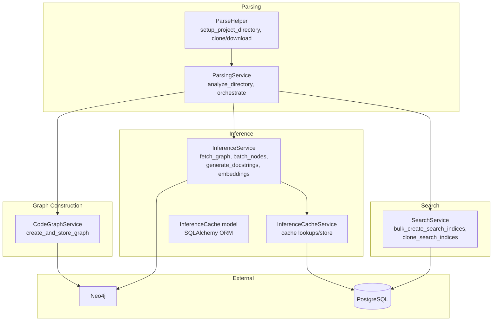
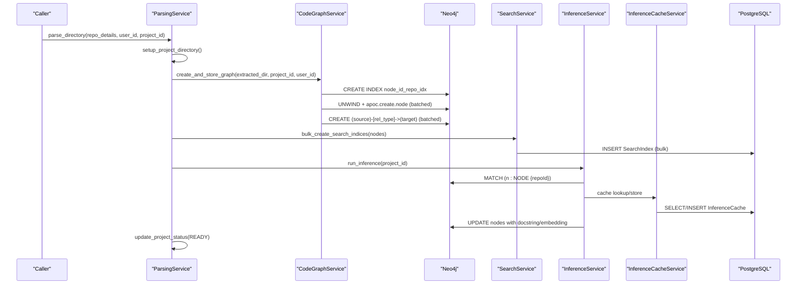
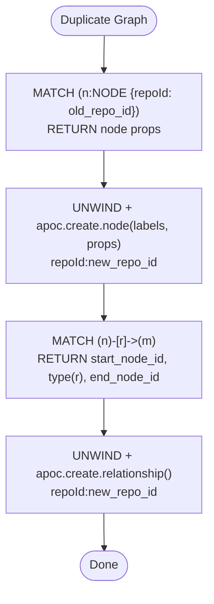
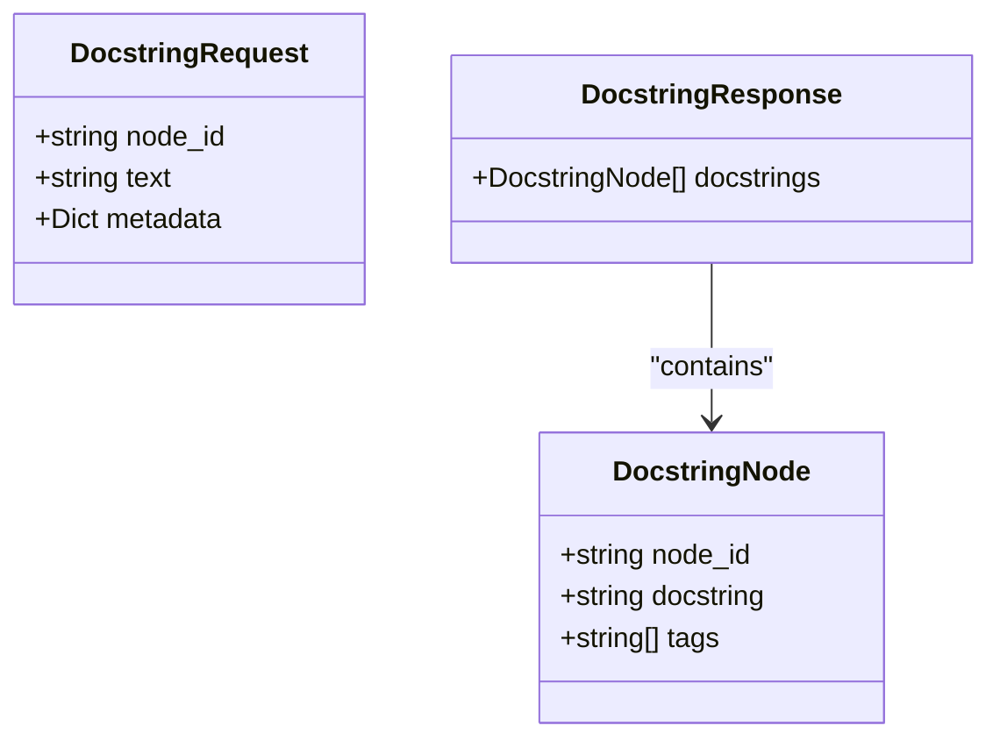
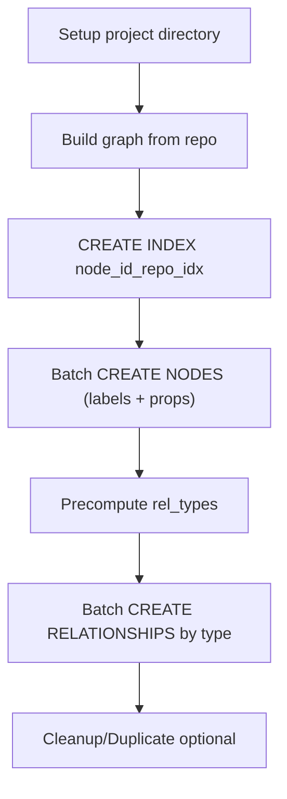
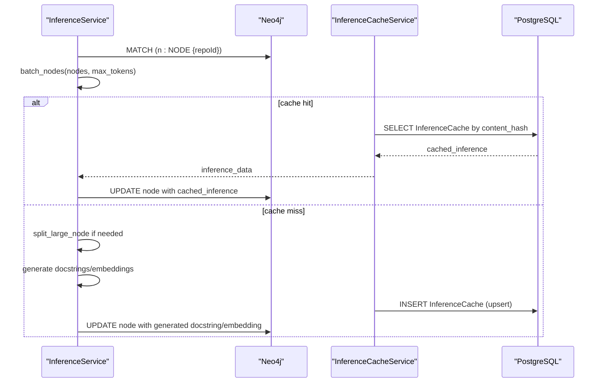
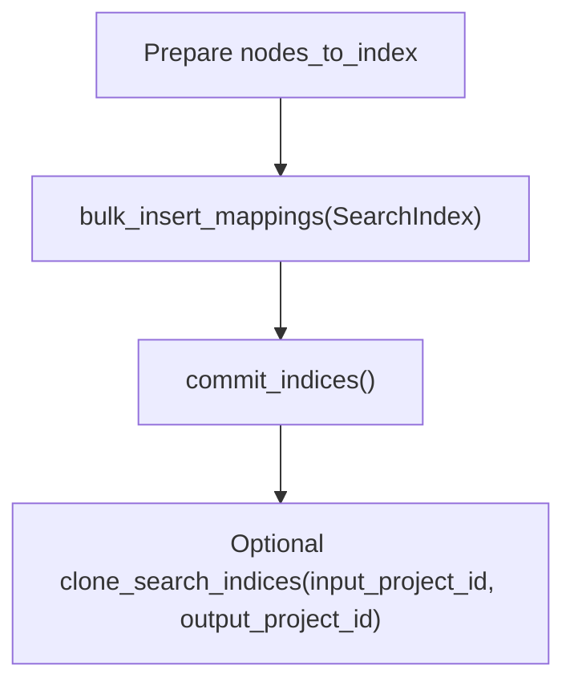
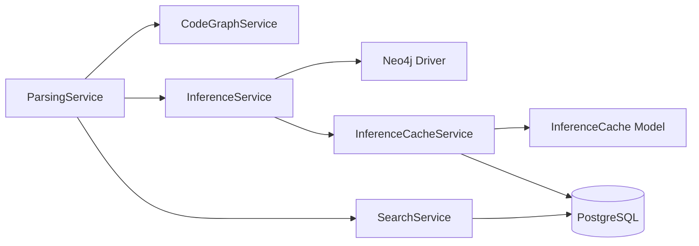

# Knowledge Graph Construction

<cite>
**Referenced Files in This Document**
- [code_graph_service.py](file://app/modules/parsing/graph_construction/code_graph_service.py)
- [parsing_service.py](file://app/modules/parsing/graph_construction/parsing_service.py)
- [parsing_helper.py](file://app/modules/parsing/graph_construction/parsing_helper.py)
- [parsing_schema.py](file://app/modules/parsing/graph_construction/parsing_schema.py)
- [inference_service.py](file://app/modules/parsing/knowledge_graph/inference_service.py)
- [inference_schema.py](file://app/modules/parsing/knowledge_graph/inference_schema.py)
- [inference_cache_service.py](file://app/modules/parsing/services/inference_cache_service.py)
- [inference_cache_model.py](file://app/modules/parsing/models/inference_cache_model.py)
- [search_service.py](file://app/modules/search/search_service.py)
- [config_provider.py](file://app/core/config_provider.py)
- [neo4j.py](file://potpie/core/neo4j.py)
</cite>

## Table of Contents
1. [Introduction](#introduction)
2. [Project Structure](#project-structure)
3. [Core Components](#core-components)
4. [Architecture Overview](#architecture-overview)
5. [Detailed Component Analysis](#detailed-component-analysis)
6. [Dependency Analysis](#dependency-analysis)
7. [Performance Considerations](#performance-considerations)
8. [Troubleshooting Guide](#troubleshooting-guide)
9. [Conclusion](#conclusion)
10. [Appendices](#appendices)

## Introduction
This document explains the knowledge graph construction system that extracts code relationships, transforms them into a Neo4j graph, and enriches them with inference-driven docstrings and embeddings. It covers:
- How code entities are represented as nodes and relationships
- The graph schema, node types, and relationship patterns
- The end-to-end workflow from repository parsing to graph ingestion and enrichment
- Indexing strategies and configuration options for performance
- Integration with the inference service for automatic docstring generation and semantic enrichment
- Practical guidance for handling large graphs, cycles, and performance tuning

## Project Structure
The knowledge graph pipeline spans several modules:
- Graph construction: repository parsing, graph building, and Neo4j ingestion
- Inference: docstring generation, embedding computation, and cache management
- Search: auxiliary search index for fast retrieval alongside the graph
- Configuration: Neo4j and provider settings

**Diagram sources**
- [parsing_service.py](file://app/modules/parsing/graph_construction/parsing_service.py#L299-L382)
- [code_graph_service.py](file://app/modules/parsing/graph_construction/code_graph_service.py#L37-L179)
- [inference_service.py](file://app/modules/parsing/knowledge_graph/inference_service.py#L741-L800)
- [inference_cache_service.py](file://app/modules/parsing/services/inference_cache_service.py#L10-L149)
- [inference_cache_model.py](file://app/modules/parsing/models/inference_cache_model.py#L16-L36)
- [search_service.py](file://app/modules/search/search_service.py#L118-L147)

**Section sources**
- [parsing_service.py](file://app/modules/parsing/graph_construction/parsing_service.py#L33-L86)
- [code_graph_service.py](file://app/modules/parsing/graph_construction/code_graph_service.py#L15-L36)

## Core Components
- CodeGraphService: Builds a graph from repository artifacts and writes nodes and relationships to Neo4j with batching and indexing.
- ParsingService: Orchestrates repository setup, graph creation, and triggers inference and search index updates.
- InferenceService: Fetches graph nodes, batches them, generates docstrings and embeddings, consolidates chunked responses, and updates Neo4j with cached results.
- InferenceCacheService and InferenceCache model: Manage a PostgreSQL-backed cache for inference results and embeddings.
- SearchService: Maintains a searchable index in PostgreSQL for fast retrieval of nodes by name, path, and content.
- ConfigProvider and Neo4jManager: Provide Neo4j configuration and async driver management.

**Section sources**
- [code_graph_service.py](file://app/modules/parsing/graph_construction/code_graph_service.py#L15-L36)
- [parsing_service.py](file://app/modules/parsing/graph_construction/parsing_service.py#L33-L86)
- [inference_service.py](file://app/modules/parsing/knowledge_graph/inference_service.py#L45-L61)
- [inference_cache_service.py](file://app/modules/parsing/services/inference_cache_service.py#L10-L149)
- [inference_cache_model.py](file://app/modules/parsing/models/inference_cache_model.py#L16-L36)
- [search_service.py](file://app/modules/search/search_service.py#L11-L18)
- [config_provider.py](file://app/core/config_provider.py#L69-L73)
- [neo4j.py](file://potpie/core/neo4j.py#L19-L81)

## Architecture Overview
The system follows a staged pipeline:
1. Repository acquisition and preparation
2. Graph construction and Neo4j ingestion
3. Search index population
4. Inference-driven enrichment (docstrings, embeddings)
5. Optional duplication and cloning of indices

**Diagram sources**
- [parsing_service.py](file://app/modules/parsing/graph_construction/parsing_service.py#L341-L382)
- [code_graph_service.py](file://app/modules/parsing/graph_construction/code_graph_service.py#L37-L179)
- [search_service.py](file://app/modules/search/search_service.py#L118-L147)
- [inference_service.py](file://app/modules/parsing/knowledge_graph/inference_service.py#L741-L800)
- [inference_cache_service.py](file://app/modules/parsing/services/inference_cache_service.py#L14-L128)

## Detailed Component Analysis

### Graph Schema Design and Node Types
- Node labels and properties:
  - Labels: NODE and a specific type label (FILE, CLASS, FUNCTION, INTERFACE)
  - Properties: name, file_path, start_line, end_line, repoId, node_id, entityId, type, text, labels
- Relationship types:
  - Dynamically created from the parsed graph; relationships are written with repoId and typed consistently
- Indexing:
  - Composite index on (node_id, repoId)
  - Composite index on (name, repoId)
  - Lookup index on relationship types

These choices enable efficient filtering by repository, name lookups, and relationship traversal.

**Section sources**
- [code_graph_service.py](file://app/modules/parsing/graph_construction/code_graph_service.py#L53-L59)
- [code_graph_service.py](file://app/modules/parsing/graph_construction/code_graph_service.py#L281-L291)
- [code_graph_service.py](file://app/modules/parsing/graph_construction/code_graph_service.py#L293-L297)

### Relationship Patterns
- Nodes are connected via typed relationships derived from the parsed graph.
- During duplication, relationships are reconstructed using the same relationship types and repo scoping.

**Diagram sources**
- [parsing_service.py](file://app/modules/parsing/graph_construction/parsing_service.py#L387-L477)

**Section sources**
- [parsing_service.py](file://app/modules/parsing/graph_construction/parsing_service.py#L387-L477)

### Property Structures and Enrichment
- Node properties include textual content and metadata suitable for search and LLM prompting.
- InferenceService enriches nodes with:
  - Docstrings
  - Tags
  - Embeddings (via SentenceTransformer)
  - Cached inference results (when applicable)

**Diagram sources**
- [inference_schema.py](file://app/modules/parsing/knowledge_graph/inference_schema.py#L6-L35)

**Section sources**
- [inference_schema.py](file://app/modules/parsing/knowledge_graph/inference_schema.py#L6-L35)
- [inference_service.py](file://app/modules/parsing/knowledge_graph/inference_service.py#L222-L304)

### Graph Creation Workflow
- Repository setup: clone or download, filter text files, and prepare a working directory.
- Graph construction:
  - Build a networkx-like graph from repository artifacts.
  - Create specialized index for node lookups.
  - Batch-create nodes with labels and properties.
  - Batch-create relationships by type to optimize transaction costs.
- Cleanup and duplication:
  - Optionally remove entire repo graphs by repoId.
  - Duplicate nodes and relationships to a new repoId.

**Diagram sources**
- [code_graph_service.py](file://app/modules/parsing/graph_construction/code_graph_service.py#L37-L179)

**Section sources**
- [parsing_helper.py](file://app/modules/parsing/graph_construction/parsing_helper.py#L749-L800)
- [code_graph_service.py](file://app/modules/parsing/graph_construction/code_graph_service.py#L37-L179)

### Inference and Semantic Enrichment
- Fetch nodes for a repository and optionally compute entry points and neighbors.
- Batch nodes respecting token limits and cache-aware processing.
- Split large nodes into chunks and consolidate chunked responses.
- Generate docstrings and embeddings, and update Neo4j with cached results.

**Diagram sources**
- [inference_service.py](file://app/modules/parsing/knowledge_graph/inference_service.py#L741-L800)
- [inference_service.py](file://app/modules/parsing/knowledge_graph/inference_service.py#L352-L587)
- [inference_cache_service.py](file://app/modules/parsing/services/inference_cache_service.py#L14-L128)

**Section sources**
- [inference_service.py](file://app/modules/parsing/knowledge_graph/inference_service.py#L741-L800)
- [inference_service.py](file://app/modules/parsing/knowledge_graph/inference_service.py#L352-L587)
- [inference_cache_service.py](file://app/modules/parsing/services/inference_cache_service.py#L14-L128)

### Search Indexing Parallel to the Graph
- Populate a PostgreSQL-backed search index with node metadata for fast retrieval.
- Supports bulk inserts and cloning across projects.

**Diagram sources**
- [search_service.py](file://app/modules/search/search_service.py#L118-L147)

**Section sources**
- [search_service.py](file://app/modules/search/search_service.py#L11-L18)
- [search_service.py](file://app/modules/search/search_service.py#L118-L147)

### Configuration Options and Environment
- Neo4j configuration is provided by ConfigProvider and consumed by services.
- Neo4jManager offers async driver lifecycle and session management for the runtime library.
- Environment variables include Neo4j credentials and concurrency-related settings.

**Section sources**
- [config_provider.py](file://app/core/config_provider.py#L69-L73)
- [neo4j.py](file://potpie/core/neo4j.py#L19-L81)

## Dependency Analysis
Key dependencies and interactions:
- ParsingService depends on CodeGraphService, SearchService, and InferenceService.
- InferenceService depends on Neo4j driver, ProviderService, SearchService, ProjectService, and InferenceCacheService.
- InferenceCacheService persists to PostgreSQL via SQLAlchemy and the InferenceCache model.
- SearchService persists to PostgreSQL via SearchIndex.

**Diagram sources**
- [parsing_service.py](file://app/modules/parsing/graph_construction/parsing_service.py#L33-L86)
- [inference_service.py](file://app/modules/parsing/knowledge_graph/inference_service.py#L45-L61)
- [inference_cache_service.py](file://app/modules/parsing/services/inference_cache_service.py#L10-L149)
- [inference_cache_model.py](file://app/modules/parsing/models/inference_cache_model.py#L16-L36)
- [search_service.py](file://app/modules/search/search_service.py#L11-L18)

**Section sources**
- [parsing_service.py](file://app/modules/parsing/graph_construction/parsing_service.py#L33-L86)
- [inference_service.py](file://app/modules/parsing/knowledge_graph/inference_service.py#L45-L61)
- [inference_cache_service.py](file://app/modules/parsing/services/inference_cache_service.py#L10-L149)
- [search_service.py](file://app/modules/search/search_service.py#L11-L18)

## Performance Considerations
- Batching:
  - Nodes and relationships are created in batches to reduce transaction overhead.
  - Batch sizes are tuned for throughput and memory constraints.
- Indexing:
  - Composite indexes on (node_id, repoId) and (name, repoId) improve lookup performance.
  - Relationship type lookup index accelerates traversal.
- Token-aware batching:
  - InferenceService splits large nodes and batches content to fit model token limits.
- Concurrency:
  - Semaphore controls parallel LLM requests to avoid overload.
- Memory management:
  - Chunking and pagination prevent loading entire graphs into memory.
- Cache-first strategy:
  - Content hashing and cache lookups reduce redundant LLM calls and speed up processing.

[No sources needed since this section provides general guidance]

## Troubleshooting Guide
Common issues and mitigations:
- Graph size limitations:
  - Use batching and pagination; consider splitting repositories or limiting scope.
  - Monitor node and relationship counts and adjust batch sizes accordingly.
- Relationship cycles:
  - Prefer directional relationships and avoid self-loops where possible.
  - Use traversal patterns that prevent infinite expansion (e.g., bounded hops).
- Performance bottlenecks:
  - Ensure required indexes exist; verify composite indexes on (node_id, repoId) and (name, repoId).
  - Limit concurrent LLM requests using the semaphore setting.
- Large nodes:
  - Rely on automatic splitting into chunks and consolidation of responses.
- Cache misses:
  - Confirm content hash correctness and that referenced placeholders are resolved before hashing.
- Neo4j connectivity:
  - Verify Neo4j configuration and driver initialization; use Neo4jManager for async sessions.

**Section sources**
- [code_graph_service.py](file://app/modules/parsing/graph_construction/code_graph_service.py#L53-L59)
- [code_graph_service.py](file://app/modules/parsing/graph_construction/code_graph_service.py#L281-L297)
- [inference_service.py](file://app/modules/parsing/knowledge_graph/inference_service.py#L589-L636)
- [inference_service.py](file://app/modules/parsing/knowledge_graph/inference_service.py#L222-L268)
- [inference_cache_service.py](file://app/modules/parsing/services/inference_cache_service.py#L14-L128)
- [neo4j.py](file://potpie/core/neo4j.py#L54-L81)

## Conclusion
The knowledge graph construction system integrates repository parsing, Neo4j ingestion, and inference-driven enrichment to produce a searchable, semantically enriched graph. By leveraging batching, indexing, caching, and chunking, it scales to large codebases while maintaining performance and reliability. The modular design enables customization for custom transformations and optimizations tailored to specific environments.

[No sources needed since this section summarizes without analyzing specific files]

## Appendices

### Appendix A: End-to-End Orchestration
- ParsingService orchestrates repository setup, graph creation, search index population, inference, and status updates.
- CodeGraphService handles Neo4j ingestion with batching and indexing.
- InferenceService manages token-aware batching, chunking, and cache-first enrichment.
- SearchService maintains a complementary search index in PostgreSQL.

**Section sources**
- [parsing_service.py](file://app/modules/parsing/graph_construction/parsing_service.py#L299-L382)
- [code_graph_service.py](file://app/modules/parsing/graph_construction/code_graph_service.py#L37-L179)
- [inference_service.py](file://app/modules/parsing/knowledge_graph/inference_service.py#L741-L800)
- [search_service.py](file://app/modules/search/search_service.py#L118-L147)