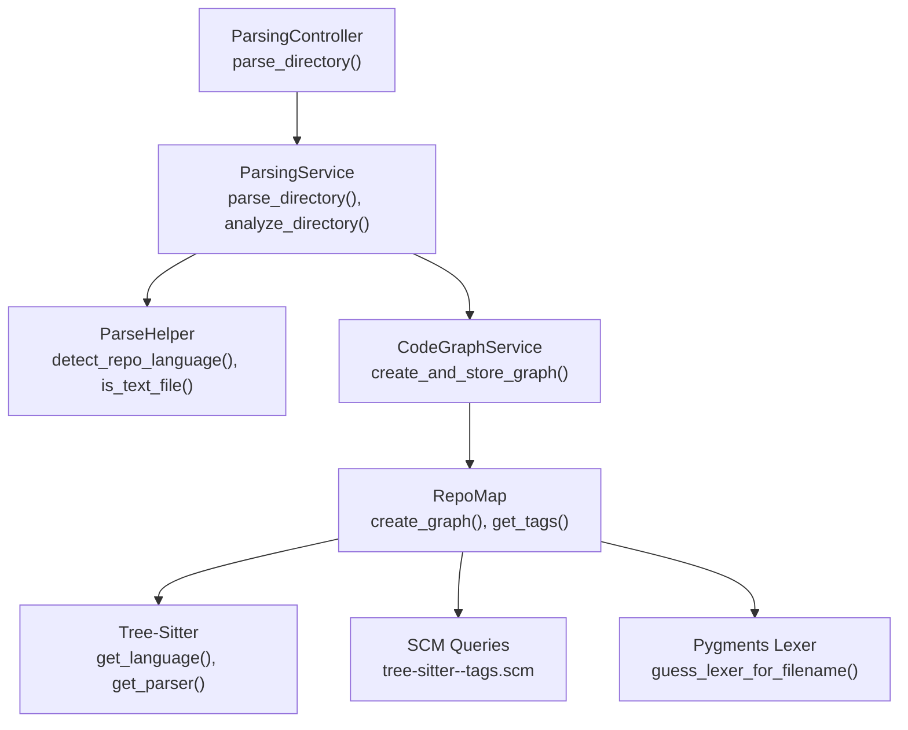
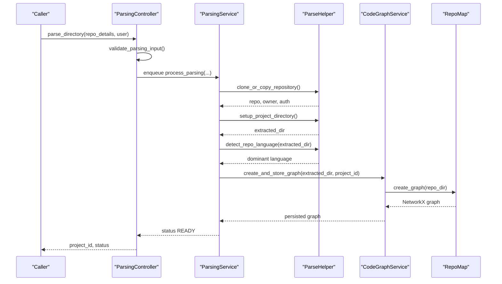
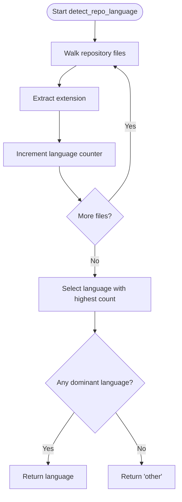
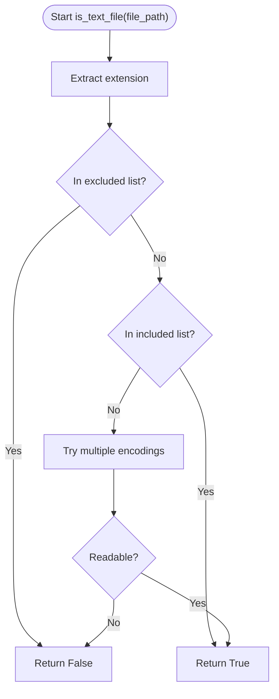
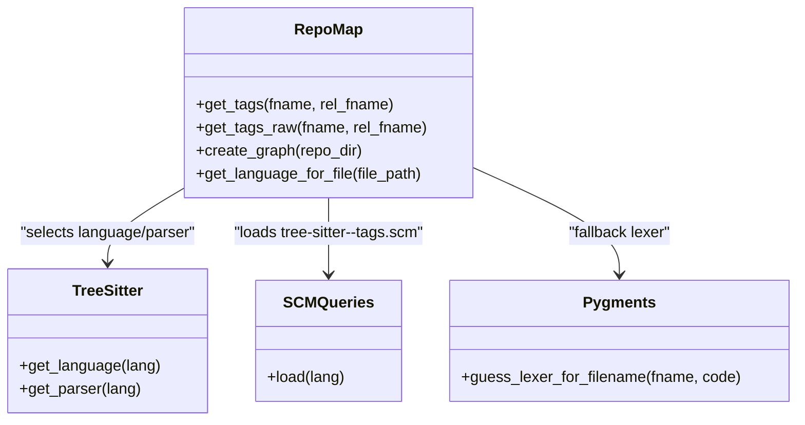
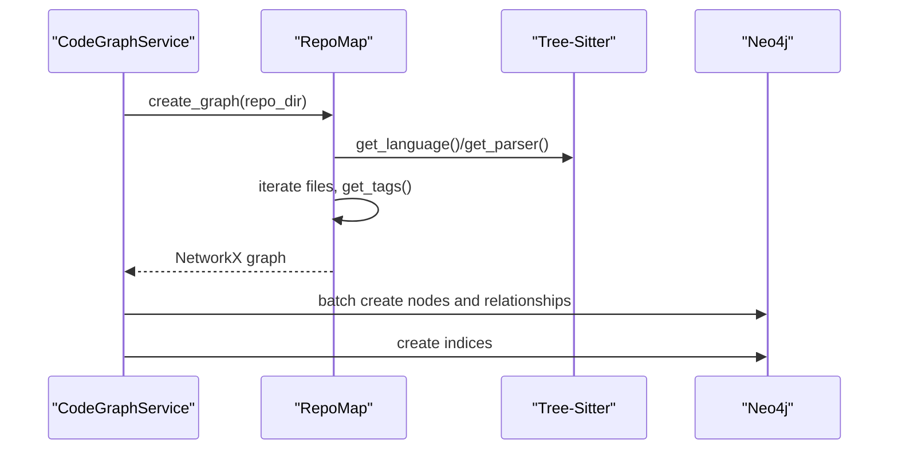
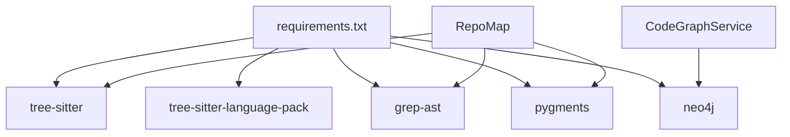

# Multi-Language Support

<cite>
**Referenced Files in This Document**
- [parsing_service.py](file://app/modules/parsing/graph_construction/parsing_service.py)
- [parsing_controller.py](file://app/modules/parsing/graph_construction/parsing_controller.py)
- [parsing_helper.py](file://app/modules/parsing/graph_construction/parsing_helper.py)
- [parsing_repomap.py](file://app/modules/parsing/graph_construction/parsing_repomap.py)
- [code_graph_service.py](file://app/modules/parsing/graph_construction/code_graph_service.py)
- [parsing_schema.py](file://app/modules/parsing/graph_construction/parsing_schema.py)
- [parsing_validator.py](file://app/modules/parsing/graph_construction/parsing_validator.py)
- [encoding_detector.py](file://app/modules/parsing/utils/encoding_detector.py)
- [code_analysis.py](file://app/modules/intelligence/tools/code_query_tools/code_analysis.py)
- [requirements.txt](file://requirements.txt)
</cite>

## Table of Contents
1. [Introduction](#introduction)
2. [Project Structure](#project-structure)
3. [Core Components](#core-components)
4. [Architecture Overview](#architecture-overview)
5. [Detailed Component Analysis](#detailed-component-analysis)
6. [Dependency Analysis](#dependency-analysis)
7. [Performance Considerations](#performance-considerations)
8. [Troubleshooting Guide](#troubleshooting-guide)
9. [Conclusion](#conclusion)

## Introduction
This document explains Potpie’s multi-language support system. It covers how Potpie detects and processes different programming languages, including language detection algorithms, supported language ecosystems, and parsing strategy selection. It documents language-specific parsing configurations, file type filtering, extension handling, and Tree-Sitter integration. It also provides guidance for adding new languages, customizing parsers, and optimizing performance, while addressing common issues such as ambiguous file extensions, mixed-language repositories, and parser compatibility.

## Project Structure
Potpie’s parsing pipeline is organized around several focused modules:
- Controllers and services orchestrate repository parsing and status management.
- Helpers implement file filtering, encoding detection, and repository language detection.
- Graph construction transforms source code into a knowledge graph via Tree-Sitter and custom queries.
- Utilities provide encoding detection and language-specific tag extraction.

**Diagram sources**
- [parsing_controller.py](file://app/modules/parsing/graph_construction/parsing_controller.py#L39-L384)
- [parsing_service.py](file://app/modules/parsing/graph_construction/parsing_service.py#L33-L477)
- [parsing_helper.py](file://app/modules/parsing/graph_construction/parsing_helper.py#L645-L747)
- [code_graph_service.py](file://app/modules/parsing/graph_construction/code_graph_service.py#L15-L240)
- [parsing_repomap.py](file://app/modules/parsing/graph_construction/parsing_repomap.py#L29-L839)

**Section sources**
- [parsing_controller.py](file://app/modules/parsing/graph_construction/parsing_controller.py#L39-L384)
- [parsing_service.py](file://app/modules/parsing/graph_construction/parsing_service.py#L33-L477)
- [parsing_helper.py](file://app/modules/parsing/graph_construction/parsing_helper.py#L645-L747)
- [code_graph_service.py](file://app/modules/parsing/graph_construction/code_graph_service.py#L15-L240)
- [parsing_repomap.py](file://app/modules/parsing/graph_construction/parsing_repomap.py#L29-L839)

## Core Components
- ParsingController: Validates inputs, normalizes repository names, manages project lifecycle, and enqueues parsing tasks.
- ParsingService: Orchestrates repository cloning/extraction, language detection, graph creation, and status updates.
- ParseHelper: Implements file filtering, encoding detection, and repository-wide language detection.
- RepoMap: Builds a knowledge graph from source files using Tree-Sitter queries and Pygments fallbacks.
- CodeGraphService: Persists the constructed graph to Neo4j and manages cleanup and indexing.
- Utilities: EncodingDetector provides robust encoding detection; code_analysis integrates with SCM queries.

Key responsibilities:
- Language detection: Repository-level predominant language via file extension histograms.
- File filtering: Exclude binary/media files and include text files using extension lists and encoding checks.
- Parser selection: Tree-Sitter language and parser selection per file extension; fallback to Pygments for references.
- Validation: Input validation and environment gating for local repository parsing.

**Section sources**
- [parsing_controller.py](file://app/modules/parsing/graph_construction/parsing_controller.py#L39-L384)
- [parsing_service.py](file://app/modules/parsing/graph_construction/parsing_service.py#L33-L477)
- [parsing_helper.py](file://app/modules/parsing/graph_construction/parsing_helper.py#L645-L747)
- [parsing_repomap.py](file://app/modules/parsing/graph_construction/parsing_repomap.py#L29-L839)
- [code_graph_service.py](file://app/modules/parsing/graph_construction/code_graph_service.py#L15-L240)
- [encoding_detector.py](file://app/modules/parsing/utils/encoding_detector.py#L14-L116)
- [code_analysis.py](file://app/modules/intelligence/tools/code_query_tools/code_analysis.py#L73-L111)

## Architecture Overview
The multi-language pipeline follows a clear flow:
1. Input validation and normalization.
2. Repository retrieval (local or remote) and extraction.
3. Repository language detection.
4. Text file filtering and encoding detection.
5. Tree-Sitter-based AST generation and tag extraction.
6. Graph construction and persistence to Neo4j.
7. Status updates and notifications.

**Diagram sources**
- [parsing_controller.py](file://app/modules/parsing/graph_construction/parsing_controller.py#L39-L384)
- [parsing_service.py](file://app/modules/parsing/graph_construction/parsing_service.py#L102-L385)
- [parsing_helper.py](file://app/modules/parsing/graph_construction/parsing_helper.py#L63-L107)
- [code_graph_service.py](file://app/modules/parsing/graph_construction/code_graph_service.py#L37-L164)
- [parsing_repomap.py](file://app/modules/parsing/graph_construction/parsing_repomap.py#L611-L736)

## Detailed Component Analysis

### Language Detection and Repository-Level Strategy
- Repository-level detection: Walks the repository, counts files by extension, and selects the predominant language. This determines whether parsing proceeds and how the graph is built.
- Supported languages: Python, JavaScript, TypeScript, C, C#, C++, Elisp, Elixir, Elm, Go, Java, OCaml, PHP, QL, Ruby, Rust, Markdown, XML, and others captured by the histogram.
- Decision boundary: If no language dominates, parsing is aborted with an error indicating unsupported content.

**Diagram sources**
- [parsing_helper.py](file://app/modules/parsing/graph_construction/parsing_helper.py#L645-L747)

**Section sources**
- [parsing_service.py](file://app/modules/parsing/graph_construction/parsing_service.py#L199-L210)
- [parsing_helper.py](file://app/modules/parsing/graph_construction/parsing_helper.py#L645-L747)

### File Type Filtering and Extension Handling
- Binary/media exclusion: Explicitly excludes common image/video/audio extensions.
- Text inclusion: Includes a broad set of source/markup/extensions; falls back to encoding checks for ambiguous cases.
- Encoding detection: Attempts multiple encodings in order to determine if a file is text and which encoding is valid.

**Diagram sources**
- [parsing_helper.py](file://app/modules/parsing/graph_construction/parsing_helper.py#L109-L201)
- [encoding_detector.py](file://app/modules/parsing/utils/encoding_detector.py#L14-L116)

**Section sources**
- [parsing_helper.py](file://app/modules/parsing/graph_construction/parsing_helper.py#L137-L201)
- [encoding_detector.py](file://app/modules/parsing/utils/encoding_detector.py#L14-L116)

### Parser Selection and Tree-Sitter Integration
- Per-file parser selection: Uses Tree-Sitter language pack to resolve language and parser instances based on file extension.
- Query-driven tag extraction: Loads language-specific SCM query files to capture definitions and references.
- Fallback mechanism: When SCM queries are missing, RepoMap falls back to Pygments to extract identifiers as references.

**Diagram sources**
- [parsing_repomap.py](file://app/modules/parsing/graph_construction/parsing_repomap.py#L144-L241)
- [parsing_repomap.py](file://app/modules/parsing/graph_construction/parsing_repomap.py#L243-L330)
- [parsing_repomap.py](file://app/modules/parsing/graph_construction/parsing_repomap.py#L738-L762)

**Section sources**
- [parsing_repomap.py](file://app/modules/parsing/graph_construction/parsing_repomap.py#L144-L241)
- [parsing_repomap.py](file://app/modules/parsing/graph_construction/parsing_repomap.py#L243-L330)
- [parsing_repomap.py](file://app/modules/parsing/graph_construction/parsing_repomap.py#L738-L762)
- [code_analysis.py](file://app/modules/intelligence/tools/code_query_tools/code_analysis.py#L73-L111)

### Graph Construction and Persistence
- Graph creation: Iterates filtered files, extracts tags, builds nodes and relationships, and persists to Neo4j with batching and indexing.
- Node labeling: Nodes receive labels such as FILE, CLASS, FUNCTION, INTERFACE; relationships include REFERENCES and CONTAINS.
- Cleanup and indexing: Removes previous project data and creates indices for efficient lookups.

**Diagram sources**
- [code_graph_service.py](file://app/modules/parsing/graph_construction/code_graph_service.py#L37-L164)
- [parsing_repomap.py](file://app/modules/parsing/graph_construction/parsing_repomap.py#L611-L736)

**Section sources**
- [code_graph_service.py](file://app/modules/parsing/graph_construction/code_graph_service.py#L15-L240)
- [parsing_repomap.py](file://app/modules/parsing/graph_construction/parsing_repomap.py#L611-L736)

### Configuration Options and Extensibility
- Adding a new language:
  - Provide a Tree-Sitter language pack and a language-specific SCM query file named tree-sitter-<lang>-tags.scm in the queries directory.
  - Extend the file-to-language mapping in RepoMap.get_language_for_file and the extension inclusion logic in ParseHelper.is_text_file if needed.
  - Ensure the language is represented in repository-level detection histograms if you want repository-level decisions to consider it.
- Parser customization:
  - Adjust query files to refine tag extraction for definitions and references.
  - Tune batching sizes and indexing strategies in CodeGraphService for performance.
- Environment constraints:
  - Local repository parsing requires development mode enabled; otherwise remote repositories are required.

**Section sources**
- [parsing_repomap.py](file://app/modules/parsing/graph_construction/parsing_repomap.py#L738-L762)
- [parsing_helper.py](file://app/modules/parsing/graph_construction/parsing_helper.py#L137-L201)
- [parsing_validator.py](file://app/modules/parsing/graph_construction/parsing_validator.py#L7-L28)

## Dependency Analysis
External dependencies relevant to multi-language support:
- Tree-Sitter and language packs: Used for parsing and language selection.
- grep-ast: Provides filename-to-language mapping for tag extraction.
- pygments: Supplies lexer fallback for reference extraction.
- neo4j driver: Persists the constructed knowledge graph.

**Diagram sources**
- [requirements.txt](file://requirements.txt#L253-L256)
- [parsing_repomap.py](file://app/modules/parsing/graph_construction/parsing_repomap.py#L8-L14)
- [code_graph_service.py](file://app/modules/parsing/graph_construction/code_graph_service.py#L5-L10)

**Section sources**
- [requirements.txt](file://requirements.txt#L253-L256)
- [parsing_repomap.py](file://app/modules/parsing/graph_construction/parsing_repomap.py#L8-L14)
- [code_graph_service.py](file://app/modules/parsing/graph_construction/code_graph_service.py#L5-L10)

## Performance Considerations
- Batching: Graph creation uses batched node and relationship insertion to reduce transaction overhead.
- Indexing: Specialized indices improve lookup performance for nodes and relationships.
- Encoding fallback: Efficiently tries common encodings to avoid repeated failures.
- Repository traversal: Skips hidden directories and files to reduce IO overhead.
- Query selection: Uses language-specific SCM queries to minimize expensive fallbacks.

[No sources needed since this section provides general guidance]

## Troubleshooting Guide
Common issues and resolutions:
- Ambiguous file extensions:
  - Use encoding detection to confirm text files; adjust include lists if necessary.
  - Ensure the language is covered by Tree-Sitter language packs and SCM queries.
- Mixed-language repositories:
  - Repository-level detection chooses the predominant language; if none dominates, parsing stops. Consider splitting repositories or ensuring a clear majority of a single language.
- Parser compatibility:
  - Verify Tree-Sitter language pack availability and correct language selection logic.
  - Confirm SCM query files exist for the target language.
- Local repository parsing:
  - Development mode must be enabled; otherwise local parsing is blocked by validation.

**Section sources**
- [parsing_helper.py](file://app/modules/parsing/graph_construction/parsing_helper.py#L109-L201)
- [parsing_service.py](file://app/modules/parsing/graph_construction/parsing_service.py#L199-L210)
- [parsing_validator.py](file://app/modules/parsing/graph_construction/parsing_validator.py#L7-L28)

## Conclusion
Potpie’s multi-language support combines robust file filtering, repository-level language detection, and Tree-Sitter-powered AST generation with Pygments fallbacks. The system is designed for extensibility: adding a new language involves installing the appropriate Tree-Sitter package, supplying language-specific SCM queries, and updating mappings. The graph construction pipeline efficiently persists results to Neo4j with batching and indexing, enabling scalable downstream analytics and search.