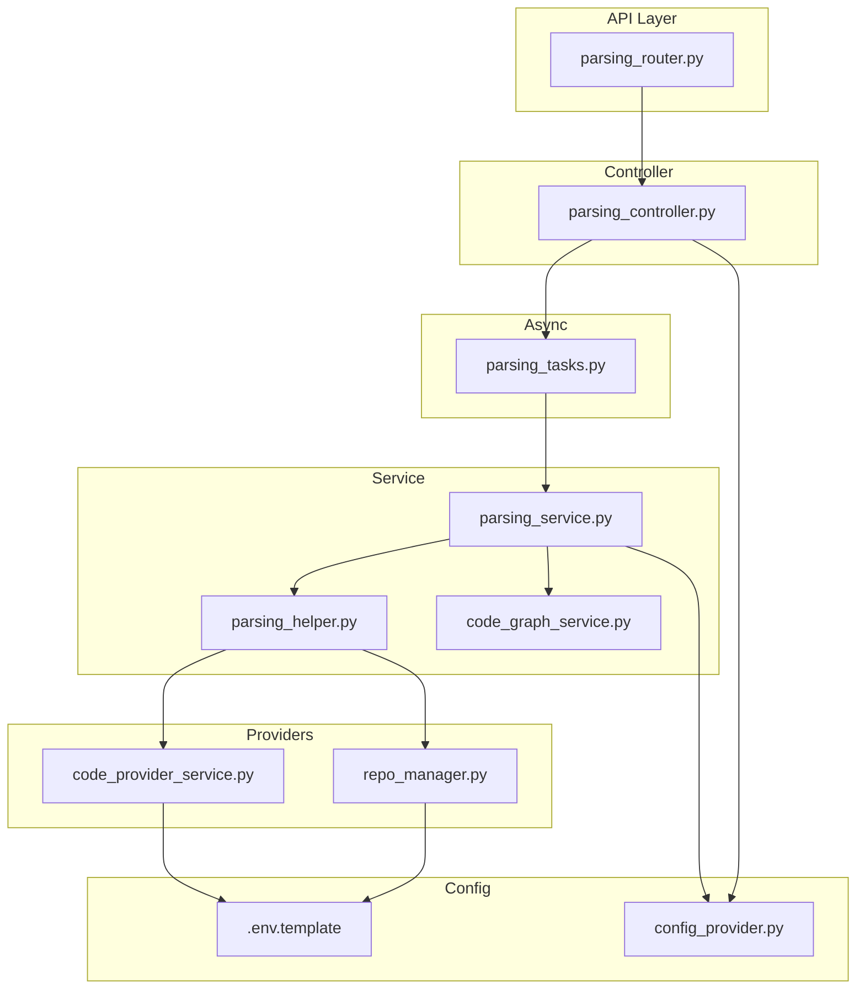
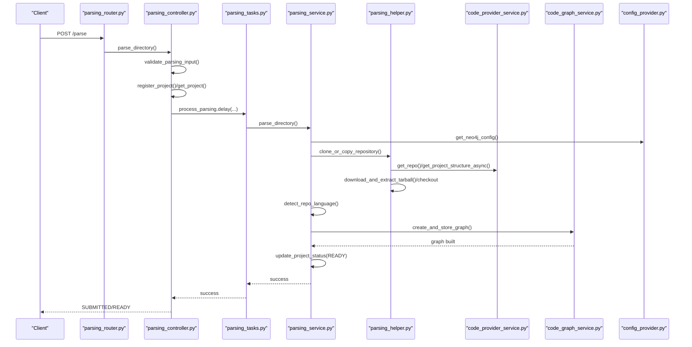
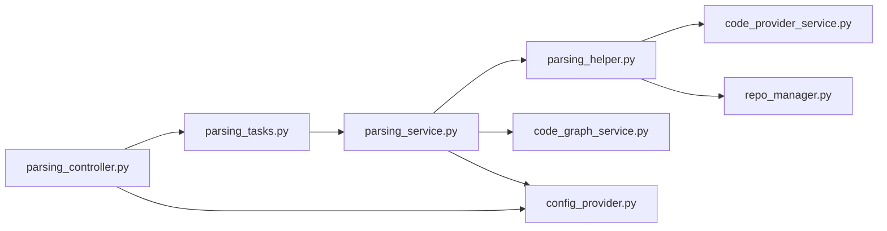

# Repository Analysis Pipeline

<cite>
**Referenced Files in This Document**
- [parsing_service.py](file://app/modules/parsing/graph_construction/parsing_service.py)
- [parsing_controller.py](file://app/modules/parsing/graph_construction/parsing_controller.py)
- [parsing_helper.py](file://app/modules/parsing/graph_construction/parsing_helper.py)
- [code_graph_service.py](file://app/modules/parsing/graph_construction/code_graph_service.py)
- [parsing_router.py](file://app/modules/parsing/graph_construction/parsing_router.py)
- [parsing_schema.py](file://app/modules/parsing/graph_construction/parsing_schema.py)
- [code_provider_service.py](file://app/modules/code_provider/code_provider_service.py)
- [repo_manager.py](file://app/modules/repo_manager/repo_manager.py)
- [parsing_tasks.py](file://app/celery/tasks/parsing_tasks.py)
- [config_provider.py](file://app/core/config_provider.py)
- [.env.template](file://.env.template)
- [parsing.md](file://docs/parsing.md)
</cite>

## Table of Contents
1. [Introduction](#introduction)
2. [Project Structure](#project-structure)
3. [Core Components](#core-components)
4. [Architecture Overview](#architecture-overview)
5. [Detailed Component Analysis](#detailed-component-analysis)
6. [Dependency Analysis](#dependency-analysis)
7. [Performance Considerations](#performance-considerations)
8. [Troubleshooting Guide](#troubleshooting-guide)
9. [Conclusion](#conclusion)
10. [Appendices](#appendices)

## Introduction
This document explains the complete repository analysis pipeline from ingestion to graph construction. It covers repository cloning/fetching, directory setup, language detection, graph building, and cleanup. It also documents the parsing service architecture, project management integration, error handling, configuration options for different repository types, authentication handling, and cleanup strategies. The goal is to make the pipeline understandable for beginners while providing sufficient technical depth for advanced users implementing custom parsing workflows.

## Project Structure
The parsing pipeline spans several modules:
- API entrypoint and routing
- Controller orchestrating parsing requests
- Service layer performing parsing and graph construction
- Helper utilities for repository operations and language detection
- Code provider service for remote repository access
- Repository manager for local caching and worktrees
- Celery task layer for asynchronous processing
- Configuration provider for environment-driven behavior

**Diagram sources**
- [parsing_router.py](file://app/modules/parsing/graph_construction/parsing_router.py#L1-L39)
- [parsing_controller.py](file://app/modules/parsing/graph_construction/parsing_controller.py#L1-L384)
- [parsing_service.py](file://app/modules/parsing/graph_construction/parsing_service.py#L1-L477)
- [parsing_helper.py](file://app/modules/parsing/graph_construction/parsing_helper.py#L1-L1326)
- [code_graph_service.py](file://app/modules/parsing/graph_construction/code_graph_service.py#L1-L240)
- [code_provider_service.py](file://app/modules/code_provider/code_provider_service.py#L1-L467)
- [repo_manager.py](file://app/modules/repo_manager/repo_manager.py#L1-L758)
- [parsing_tasks.py](file://app/celery/tasks/parsing_tasks.py#L1-L58)
- [config_provider.py](file://app/core/config_provider.py#L1-L246)
- [.env.template](file://.env.template#L1-L116)

**Section sources**
- [parsing_router.py](file://app/modules/parsing/graph_construction/parsing_router.py#L1-L39)
- [parsing_controller.py](file://app/modules/parsing/graph_construction/parsing_controller.py#L1-L384)
- [parsing_service.py](file://app/modules/parsing/graph_construction/parsing_service.py#L1-L477)
- [parsing_helper.py](file://app/modules/parsing/graph_construction/parsing_helper.py#L1-L1326)
- [code_graph_service.py](file://app/modules/parsing/graph_construction/code_graph_service.py#L1-L240)
- [code_provider_service.py](file://app/modules/code_provider/code_provider_service.py#L1-L467)
- [repo_manager.py](file://app/modules/repo_manager/repo_manager.py#L1-L758)
- [parsing_tasks.py](file://app/celery/tasks/parsing_tasks.py#L1-L58)
- [config_provider.py](file://app/core/config_provider.py#L1-L246)
- [.env.template](file://.env.template#L1-L116)

## Core Components
- ParsingController: Validates input, manages project lifecycle, enqueues parsing tasks, and exposes status endpoints.
- ParsingService: Orchestrates repository ingestion, directory setup, language detection, graph construction, and cleanup.
- ParseHelper: Handles repository cloning/fetching, tarball extraction, checkout, language detection, and repo manager integration.
- CodeGraphService: Builds the Neo4j graph from the parsed repository and manages cleanup.
- CodeProviderService: Unified access to code providers (GitHub, GitBucket, local) with authentication fallback.
- RepoManager: Manages local repository copies, worktrees, and eviction policies.
- Celery Task: Asynchronous execution of parsing with structured logging and error propagation.
- Configuration: Environment-driven behavior for providers, Neo4j, development mode, and cleanup.

**Section sources**
- [parsing_controller.py](file://app/modules/parsing/graph_construction/parsing_controller.py#L1-L384)
- [parsing_service.py](file://app/modules/parsing/graph_construction/parsing_service.py#L1-L477)
- [parsing_helper.py](file://app/modules/parsing/graph_construction/parsing_helper.py#L1-L1326)
- [code_graph_service.py](file://app/modules/parsing/graph_construction/code_graph_service.py#L1-L240)
- [code_provider_service.py](file://app/modules/code_provider/code_provider_service.py#L1-L467)
- [repo_manager.py](file://app/modules/repo_manager/repo_manager.py#L1-L758)
- [parsing_tasks.py](file://app/celery/tasks/parsing_tasks.py#L1-L58)
- [config_provider.py](file://app/core/config_provider.py#L1-L246)

## Architecture Overview
The pipeline follows a request-response flow with asynchronous task execution:
- API receives a parsing request and validates it.
- Controller registers or retrieves a project, enqueues a Celery task, and returns submission status.
- Celery task invokes ParsingService to perform the analysis.
- ParsingService coordinates repository setup, language detection, graph construction, and cleanup.
- CodeGraphService persists the graph to Neo4j and creates indices.
- Cleanup removes temporary directories and updates project status.

**Diagram sources**
- [parsing_router.py](file://app/modules/parsing/graph_construction/parsing_router.py#L16-L22)
- [parsing_controller.py](file://app/modules/parsing/graph_construction/parsing_controller.py#L42-L251)
- [parsing_tasks.py](file://app/celery/tasks/parsing_tasks.py#L17-L54)
- [parsing_service.py](file://app/modules/parsing/graph_construction/parsing_service.py#L102-L273)
- [parsing_helper.py](file://app/modules/parsing/graph_construction/parsing_helper.py#L63-L807)
- [code_provider_service.py](file://app/modules/code_provider/code_provider_service.py#L431-L467)
- [code_graph_service.py](file://app/modules/parsing/graph_construction/code_graph_service.py#L37-L179)
- [config_provider.py](file://app/core/config_provider.py#L69-L73)

## Detailed Component Analysis

### API Entry and Request Validation
- Endpoint: POST /parse triggers parsing.
- Request body: ParsingRequest with repo_name, repo_path, branch_name, commit_id.
- Validation: Ensures either repo_name or repo_path is provided.
- Response: ParsingResponse with message, status, and project_id.

**Section sources**
- [parsing_router.py](file://app/modules/parsing/graph_construction/parsing_router.py#L16-L22)
- [parsing_schema.py](file://app/modules/parsing/graph_construction/parsing_schema.py#L6-L39)
- [parsing.md](file://docs/parsing.md#L7-L46)

### Controller Orchestration
- Determines whether the request targets a local path or remote repository.
- Auto-detects local paths in development mode.
- Manages demo repositories and duplication logic.
- Registers or retrieves projects, sets statuses, and enqueues parsing tasks.
- Exposes status endpoints for project_id and for repo+branch/commit.

Key behaviors:
- Local repo parsing requires development mode.
- Demo repositories are duplicated and graph copied to new project.
- Existing projects are checked for commit freshness; if up-to-date, returns READY immediately.

**Section sources**
- [parsing_controller.py](file://app/modules/parsing/graph_construction/parsing_controller.py#L42-L383)

### Celery Task Execution
- Wraps ParsingService in a Celery task with structured logging context.
- Runs the async parsing coroutine using BaseTask’s event loop.
- Propagates exceptions and logs timing.

**Section sources**
- [parsing_tasks.py](file://app/celery/tasks/parsing_tasks.py#L17-L54)

### ParsingService Workflow
Responsibilities:
- Initializes dependencies: ProjectService, InferenceService, SearchService, CodeProviderService.
- Cleans up Neo4j graph if requested.
- Converts ParsingRequest to RepoDetails.
- Clones/copies repository and sets up project directory.
- Detects language and builds the graph.
- Updates project status through PARSED to READY.
- Sends notifications and emails upon completion.
- Cleans up temporary directories on exit.

Cleanup:
- Removes extracted directories under PROJECT_PATH if they are subdirectories of PROJECT_PATH.

**Section sources**
- [parsing_service.py](file://app/modules/parsing/graph_construction/parsing_service.py#L33-L477)

### ParseHelper: Repository Operations and Language Detection
Core operations:
- clone_or_copy_repository: Returns local Repo object for local paths or provider client and repo for remote.
- download_and_extract_tarball: Downloads tarball via provider or falls back to git clone for private repos.
- _clone_repository_with_auth: Uses embedded credentials for private GitBucket repos.
- setup_project_directory: Creates final directory, checks out commit/branch, updates project metadata, and integrates with RepoManager.
- detect_repo_language: Counts file extensions and determines predominant language.
- check_commit_status: Compares stored commit with latest branch or requested commit.

RepoManager integration:
- Copies extracted repo to .repos with worktrees.
- Registers worktree paths and metadata.
- Updates last accessed timestamps.

**Section sources**
- [parsing_helper.py](file://app/modules/parsing/graph_construction/parsing_helper.py#L63-L1326)
- [repo_manager.py](file://app/modules/repo_manager/repo_manager.py#L909-L1122)

### CodeProviderService: Unified Provider Access
- ProviderWrapper: Factory-based provider selection with fallback chain (GitHub App → PAT pool → single PAT → unauthenticated).
- Supports multiple providers: GitHub, GitBucket, local.
- get_project_structure_async: Retrieves repository structure using RepoManager if available; otherwise uses provider or legacy GitHub service.
- Authentication fallback: On 401 errors for GitHub, attempts unauthenticated access for public repos.

**Section sources**
- [code_provider_service.py](file://app/modules/code_provider/code_provider_service.py#L143-L467)

### CodeGraphService: Graph Construction and Cleanup
- Generates node IDs deterministically from path and user_id.
- Creates nodes and relationships in batches.
- Creates specialized indices for efficient lookups.
- cleanup_graph: Deletes nodes and relationships for a project and cleans search indices.

**Section sources**
- [code_graph_service.py](file://app/modules/parsing/graph_construction/code_graph_service.py#L15-L240)

### Configuration and Environment
Key environment variables:
- Development mode and project path
- Neo4j connection
- Code provider type, base URL, tokens, and credentials
- Repo manager settings (enablement, volume limits, base path)
- Celery broker and queue

**Section sources**
- [.env.template](file://.env.template#L1-L116)
- [config_provider.py](file://app/core/config_provider.py#L22-L243)

### Progress Tracking and Completion Verification
- Status endpoints:
  - GET /parsing-status/{project_id}: Returns status and latest flag.
  - POST /parsing-status: Returns project_id, repo_name, status, and latest flag for a given repo+commit/branch.
- Controller sets SUBMITTED on enqueue and updates to READY upon completion.

**Section sources**
- [parsing_controller.py](file://app/modules/parsing/graph_construction/parsing_controller.py#L307-L383)
- [parsing_router.py](file://app/modules/parsing/graph_construction/parsing_router.py#L25-L38)

## Dependency Analysis
High-level dependencies:
- Controller depends on ParsingController and Celery task.
- Service depends on ParseHelper, CodeGraphService, ProjectService, InferenceService, SearchService, CodeProviderService, and configuration.
- ParseHelper depends on CodeProviderService and RepoManager.
- CodeGraphService depends on Neo4j driver and SearchService.
- Celery task depends on ParsingService and BaseTask.

**Diagram sources**
- [parsing_controller.py](file://app/modules/parsing/graph_construction/parsing_controller.py#L1-L384)
- [parsing_tasks.py](file://app/celery/tasks/parsing_tasks.py#L1-L58)
- [parsing_service.py](file://app/modules/parsing/graph_construction/parsing_service.py#L1-L477)
- [parsing_helper.py](file://app/modules/parsing/graph_construction/parsing_helper.py#L1-L1326)
- [code_graph_service.py](file://app/modules/parsing/graph_construction/code_graph_service.py#L1-L240)
- [code_provider_service.py](file://app/modules/code_provider/code_provider_service.py#L1-L467)
- [repo_manager.py](file://app/modules/repo_manager/repo_manager.py#L1-L758)
- [config_provider.py](file://app/core/config_provider.py#L1-L246)

**Section sources**
- [parsing_controller.py](file://app/modules/parsing/graph_construction/parsing_controller.py#L1-L384)
- [parsing_service.py](file://app/modules/parsing/graph_construction/parsing_service.py#L1-L477)
- [parsing_helper.py](file://app/modules/parsing/graph_construction/parsing_helper.py#L1-L1326)
- [code_graph_service.py](file://app/modules/parsing/graph_construction/code_graph_service.py#L1-L240)
- [code_provider_service.py](file://app/modules/code_provider/code_provider_service.py#L1-L467)
- [repo_manager.py](file://app/modules/repo_manager/repo_manager.py#L1-L758)
- [parsing_tasks.py](file://app/celery/tasks/parsing_tasks.py#L1-L58)
- [config_provider.py](file://app/core/config_provider.py#L1-L246)

## Performance Considerations
- Batched graph creation: Nodes and relationships are inserted in batches to reduce transaction overhead.
- Index creation: Specialized indices improve query performance for node lookups and relationship types.
- Language detection: Iterates files and tries multiple encodings; consider limiting scope for very large repositories.
- Tarball extraction: Filters text files to avoid parsing binaries; ensure adequate disk space under PROJECT_PATH.
- Repo manager: Worktrees avoid repeated cloning; eviction policies help manage disk usage.
- Celery task: Long-running operations executed in a dedicated event loop to avoid blocking.

[No sources needed since this section provides general guidance]

## Troubleshooting Guide
Common issues and resolutions:
- Repository access failures
  - Symptom: 401 errors or repository not found.
  - Cause: Invalid or missing tokens; wrong provider configuration.
  - Resolution: Verify CODE_PROVIDER, CODE_PROVIDER_TOKEN, CODE_PROVIDER_BASE_URL; ensure GitHub App or PAT is configured; fallback to unauthenticated for public repos.
- Language detection problems
  - Symptom: Project marked ERROR with “Repository doesn't consist of a language currently supported.”
  - Cause: No text files detected or unsupported extension.
  - Resolution: Confirm repository contains text files; verify encoding detection logic; adjust filtering if needed.
- Cleanup errors
  - Symptom: Temporary directories not removed or Neo4j cleanup fails.
  - Cause: Permissions or path misconfiguration.
  - Resolution: Ensure PROJECT_PATH is writable; confirm cleanup logic runs only for directories under PROJECT_PATH; verify Neo4j credentials.

Error handling specifics:
- ParsingService catches ParsingServiceError and generic exceptions, updates project status to ERROR, and raises HTTPException or library exceptions depending on mode.
- ParseHelper wraps repository operations and raises ParsingFailedError for recoverable failures.
- CodeGraphService cleanup deletes nodes and search indices; ensure Neo4j connectivity.

**Section sources**
- [parsing_service.py](file://app/modules/parsing/graph_construction/parsing_service.py#L214-L261)
- [parsing_helper.py](file://app/modules/parsing/graph_construction/parsing_helper.py#L348-L377)
- [code_graph_service.py](file://app/modules/parsing/graph_construction/code_graph_service.py#L166-L179)
- [code_provider_service.py](file://app/modules/code_provider/code_provider_service.py#L200-L230)

## Conclusion
The repository analysis pipeline integrates API orchestration, asynchronous task execution, provider abstraction, and graph construction. It supports local and remote repositories, handles authentication gracefully, and maintains cleanup hygiene. By leveraging configuration and environment variables, teams can adapt the pipeline for different providers and environments while maintaining robust error handling and progress tracking.

[No sources needed since this section summarizes without analyzing specific files]

## Appendices

### Configuration Options
- Development mode and project path
  - isDevelopmentMode, PROJECT_PATH
- Neo4j
  - NEO4J_URI, NEO4J_USERNAME, NEO4J_PASSWORD
- Code provider
  - CODE_PROVIDER, CODE_PROVIDER_BASE_URL, CODE_PROVIDER_TOKEN, CODE_PROVIDER_USERNAME, CODE_PROVIDER_PASSWORD
- Repo manager
  - REPO_MANAGER_ENABLED, REPOS_BASE_PATH, REPOS_VOLUME_LIMIT_BYTES
- Celery
  - BROKER_URL, CELERY_QUEUE_NAME

**Section sources**
- [.env.template](file://.env.template#L1-L116)
- [config_provider.py](file://app/core/config_provider.py#L22-L243)

### Example Workflows
- Initiating parsing
  - Call POST /parse with ParsingRequest payload; receive SUBMITTED status immediately.
- Progress tracking
  - Poll GET /parsing-status/{project_id} or POST /parsing-status with ParsingStatusRequest.
- Completion verification
  - Status transitions from SUBMITTED to READY; graph is built and searchable.

**Section sources**
- [parsing.md](file://docs/parsing.md#L7-L87)
- [parsing_router.py](file://app/modules/parsing/graph_construction/parsing_router.py#L16-L38)
- [parsing_controller.py](file://app/modules/parsing/graph_construction/parsing_controller.py#L307-L383)