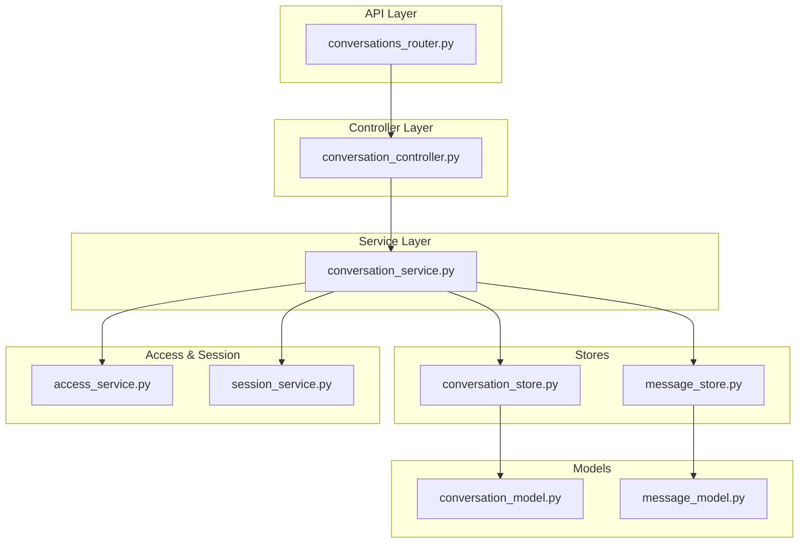
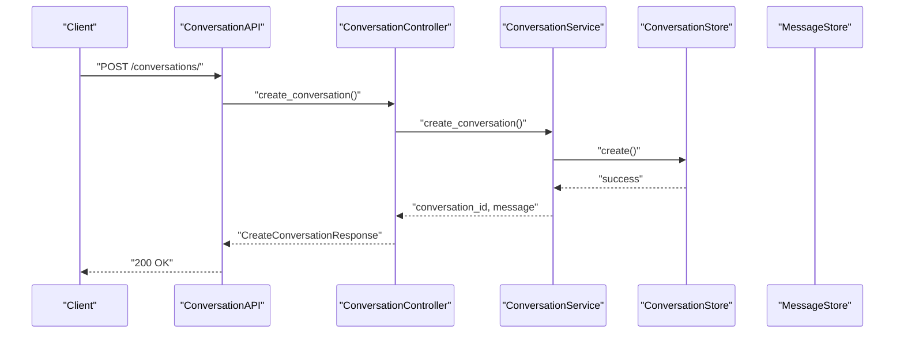
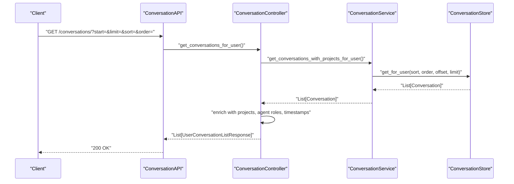
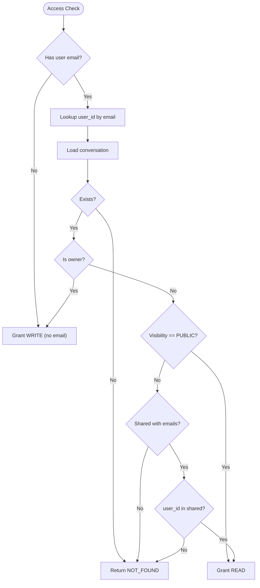
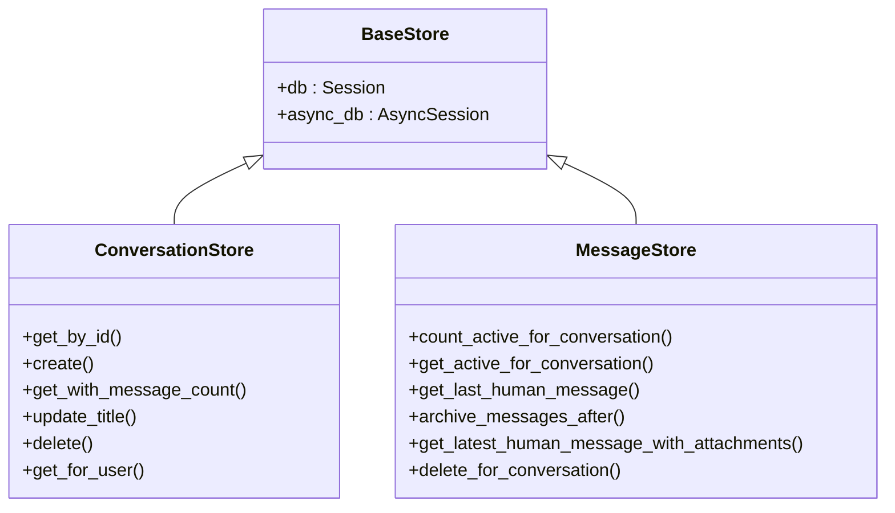
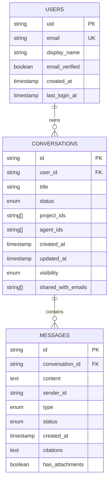
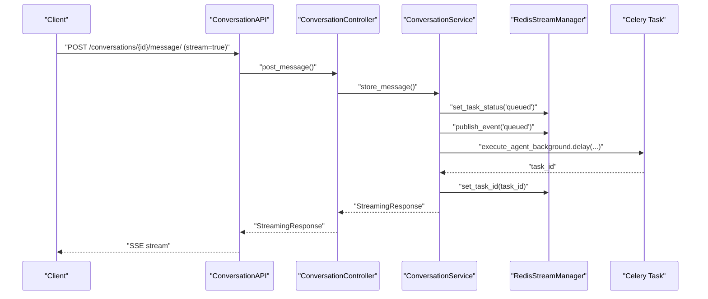
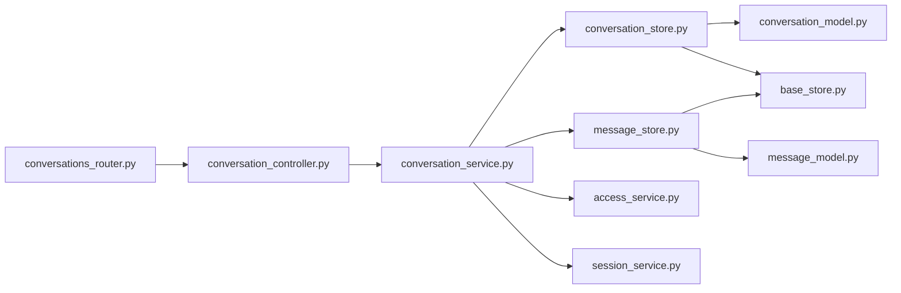

# Conversation Management

<cite>
**Referenced Files in This Document**
- [conversations_router.py](file://app/modules/conversations/conversations_router.py)
- [conversation_controller.py](file://app/modules/conversations/conversation/conversation_controller.py)
- [conversation_service.py](file://app/modules/conversations/conversation/conversation_service.py)
- [conversation_model.py](file://app/modules/conversations/conversation/conversation_model.py)
- [conversation_store.py](file://app/modules/conversations/conversation/conversation_store.py)
- [conversation_schema.py](file://app/modules/conversations/conversation/conversation_schema.py)
- [message_store.py](file://app/modules/conversations/message/message_store.py)
- [message_model.py](file://app/modules/conversations/message/message_model.py)
- [access_service.py](file://app/modules/conversations/access/access_service.py)
- [access_schema.py](file://app/modules/conversations/access/access_schema.py)
- [session_service.py](file://app/modules/conversations/session/session_service.py)
- [base_store.py](file://app/core/base_store.py)
- [models.py](file://app/core/models.py)
- [test_conversations_router.py](file://tests/integration-tests/conversations/test_conversations_router.py)
</cite>

## Table of Contents
1. [Introduction](#introduction)
2. [Project Structure](#project-structure)
3. [Core Components](#core-components)
4. [Architecture Overview](#architecture-overview)
5. [Detailed Component Analysis](#detailed-component-analysis)
6. [Dependency Analysis](#dependency-analysis)
7. [Performance Considerations](#performance-considerations)
8. [Troubleshooting Guide](#troubleshooting-guide)
9. [Conclusion](#conclusion)
10. [Appendices](#appendices)

## Introduction
This document explains the conversation management system, focusing on the conversation lifecycle: creation, retrieval, renaming, deletion, and metadata management. It details how the controller orchestrates business logic, how the service layer handles data access patterns, and how the models define the conversation entity and its relationships. It also documents the conversation store pattern, persistence strategies, and the streaming pipeline for long-running operations. Practical examples are drawn from the actual codebase to illustrate CRUD operations, conversation info retrieval, and listing with sorting.

## Project Structure
The conversation subsystem is organized by feature and layered responsibilities:
- Router: Exposes HTTP endpoints for conversation operations and delegates to the controller.
- Controller: Coordinates service calls and translates domain results to API responses.
- Service: Implements business logic, access control, orchestration of stores and external services.
- Stores: Encapsulate database operations for conversations and messages.
- Models: Define ORM entities and relationships.
- Access: Manages sharing and visibility controls.
- Session: Provides streaming and task status helpers for long-running operations.

**Diagram sources**
- [conversations_router.py](file://app/modules/conversations/conversations_router.py#L58-L622)
- [conversation_controller.py](file://app/modules/conversations/conversation/conversation_controller.py#L33-L224)
- [conversation_service.py](file://app/modules/conversations/conversation/conversation_service.py#L73-L164)
- [conversation_store.py](file://app/modules/conversations/conversation/conversation_store.py#L18-L119)
- [message_store.py](file://app/modules/conversations/message/message_store.py#L8-L83)
- [conversation_model.py](file://app/modules/conversations/conversation/conversation_model.py#L23-L60)
- [message_model.py](file://app/modules/conversations/message/message_model.py#L23-L65)
- [access_service.py](file://app/modules/conversations/access/access_service.py#L18-L133)
- [session_service.py](file://app/modules/conversations/session/session_service.py#L15-L164)

**Section sources**
- [conversations_router.py](file://app/modules/conversations/conversations_router.py#L58-L622)
- [conversation_controller.py](file://app/modules/conversations/conversation/conversation_controller.py#L33-L224)
- [conversation_service.py](file://app/modules/conversations/conversation/conversation_service.py#L73-L164)
- [conversation_store.py](file://app/modules/conversations/conversation/conversation_store.py#L18-L119)
- [message_store.py](file://app/modules/conversations/message/message_store.py#L8-L83)
- [conversation_model.py](file://app/modules/conversations/conversation/conversation_model.py#L23-L60)
- [message_model.py](file://app/modules/conversations/message/message_model.py#L23-L65)
- [access_service.py](file://app/modules/conversations/access/access_service.py#L18-L133)
- [session_service.py](file://app/modules/conversations/session/session_service.py#L15-L164)

## Core Components
- ConversationController: Instantiates ConversationStore and MessageStore via ConversationService factory, then delegates to service methods for all operations. It translates exceptions into HTTP exceptions and formats responses.
- ConversationService: Implements core business logic including access checks, conversation creation, message storage, title generation, regeneration, and streaming orchestration. It integrates with external services (agents, provider, tools, prompts, media, session, Redis).
- ConversationStore and MessageStore: Provide async-safe CRUD operations for conversations and messages, including counting, pagination/sorting, and archival.
- Conversation and Message models: Define the schema, enums, relationships, and constraints. Conversations cascade-delete messages; messages link to attachments.
- AccessService: Manages visibility and shared-with-emails updates and removal of access.
- SessionService: Interacts with Redis to expose active session and task status for a conversation.

**Section sources**
- [conversation_controller.py](file://app/modules/conversations/conversation/conversation_controller.py#L33-L224)
- [conversation_service.py](file://app/modules/conversations/conversation/conversation_service.py#L73-L164)
- [conversation_store.py](file://app/modules/conversations/conversation/conversation_store.py#L18-L119)
- [message_store.py](file://app/modules/conversations/message/message_store.py#L8-L83)
- [conversation_model.py](file://app/modules/conversations/conversation/conversation_model.py#L23-L60)
- [message_model.py](file://app/modules/conversations/message/message_model.py#L23-L65)
- [access_service.py](file://app/modules/conversations/access/access_service.py#L18-L133)
- [session_service.py](file://app/modules/conversations/session/session_service.py#L15-L164)

## Architecture Overview
The system follows a layered architecture:
- API layer (FastAPI router) validates requests, authenticates users, and invokes the controller.
- Controller layer mediates between router and service, handling exceptions and response formatting.
- Service layer encapsulates business logic, access control, and orchestrates stores and external services.
- Store layer abstracts database operations for conversations and messages.
- Model layer defines entities and relationships.

**Diagram sources**
- [conversations_router.py](file://app/modules/conversations/conversations_router.py#L82-L102)
- [conversation_controller.py](file://app/modules/conversations/conversation/conversation_controller.py#L53-L64)
- [conversation_service.py](file://app/modules/conversations/conversation/conversation_service.py#L216-L282)
- [conversation_store.py](file://app/modules/conversations/conversation/conversation_store.py#L26-L28)

**Section sources**
- [conversations_router.py](file://app/modules/conversations/conversations_router.py#L82-L102)
- [conversation_controller.py](file://app/modules/conversations/conversation/conversation_controller.py#L53-L64)
- [conversation_service.py](file://app/modules/conversations/conversation/conversation_service.py#L216-L282)
- [conversation_store.py](file://app/modules/conversations/conversation/conversation_store.py#L26-L28)

## Detailed Component Analysis

### Conversation Lifecycle Operations
- Creation
  - Endpoint: POST /conversations/
  - Flow: Router validates usage limits, constructs controller, calls service.create_conversation, persists conversation, adds system message, and returns response.
  - Key paths:
    - [conversations_router.py](file://app/modules/conversations/conversations_router.py#L82-L102)
    - [conversation_controller.py](file://app/modules/conversations/conversation/conversation_controller.py#L53-L64)
    - [conversation_service.py](file://app/modules/conversations/conversation/conversation_service.py#L216-L282)
    - [conversation_store.py](file://app/modules/conversations/conversation/conversation_store.py#L26-L28)
- Retrieval (Info)
  - Endpoint: GET /conversations/{conversation_id}/info/
  - Flow: Router constructs controller, calls service.get_conversation_info, returns enriched info with access type and metadata.
  - Key paths:
    - [conversations_router.py](file://app/modules/conversations/conversations_router.py#L104-L128)
    - [conversation_controller.py](file://app/modules/conversations/conversation/conversation_controller.py#L76-L89)
    - [conversation_service.py](file://app/modules/conversations/conversation/conversation_service.py#L73-L164)
- Retrieval (Messages)
  - Endpoint: GET /conversations/{conversation_id}/messages/?start=&limit=
  - Flow: Router constructs controller, calls service.get_conversation_messages, paginates and filters active non-system messages.
  - Key paths:
    - [conversations_router.py](file://app/modules/conversations/conversations_router.py#L130-L158)
    - [conversation_controller.py](file://app/modules/conversations/conversation/conversation_controller.py#L91-L104)
    - [message_store.py](file://app/modules/conversations/message/message_store.py#L19-L34)
- Renaming
  - Endpoint: PATCH /conversations/{conversation_id}/rename/
  - Flow: Router constructs controller, calls service.rename_conversation, updates title via store.
  - Key paths:
    - [conversations_router.py](file://app/modules/conversations/conversations_router.py#L446-L458)
    - [conversation_controller.py](file://app/modules/conversations/conversation/conversation_controller.py#L151-L161)
    - [conversation_service.py](file://app/modules/conversations/conversation/conversation_service.py#L73-L164)
    - [conversation_store.py](file://app/modules/conversations/conversation/conversation_store.py#L51-L58)
- Deletion
  - Endpoint: DELETE /conversations/{conversation_id}/
  - Flow: Router constructs controller, calls service.delete_conversation, deletes conversation and cascading messages.
  - Key paths:
    - [conversations_router.py](file://app/modules/conversations/conversations_router.py#L420-L430)
    - [conversation_controller.py](file://app/modules/conversations/conversation/conversation_controller.py#L66-L74)
    - [conversation_service.py](file://app/modules/conversations/conversation/conversation_service.py#L73-L164)
    - [conversation_store.py](file://app/modules/conversations/conversation/conversation_store.py#L60-L65)

**Section sources**
- [conversations_router.py](file://app/modules/conversations/conversations_router.py#L82-L158)
- [conversation_controller.py](file://app/modules/conversations/conversation/conversation_controller.py#L53-L161)
- [conversation_service.py](file://app/modules/conversations/conversation/conversation_service.py#L216-L282)
- [conversation_store.py](file://app/modules/conversations/conversation/conversation_store.py#L26-L65)
- [message_store.py](file://app/modules/conversations/message/message_store.py#L19-L34)

### Conversation Info Retrieval and Listing with Sorting
- Info retrieval enriches conversation metadata and access level for a given user.
- Listing supports pagination and sorting by updated_at or created_at in ascending/descending order, with eager loading of related projects.
- Key paths:
  - [conversation_controller.py](file://app/modules/conversations/conversation/conversation_controller.py#L174-L223)
  - [conversation_service.py](file://app/modules/conversations/conversation/conversation_service.py#L73-L164)
  - [conversation_store.py](file://app/modules/conversations/conversation/conversation_store.py#L67-L118)

**Diagram sources**
- [conversations_router.py](file://app/modules/conversations/conversations_router.py#L58-L80)
- [conversation_controller.py](file://app/modules/conversations/conversation/conversation_controller.py#L174-L223)
- [conversation_store.py](file://app/modules/conversations/conversation/conversation_store.py#L67-L118)

**Section sources**
- [conversation_controller.py](file://app/modules/conversations/conversation/conversation_controller.py#L174-L223)
- [conversation_store.py](file://app/modules/conversations/conversation/conversation_store.py#L67-L118)

### Access Control and Sharing
- Access control determines READ vs WRITE permissions based on ownership, public visibility, or shared-with-emails.
- Sharing supports PUBLIC visibility or PRIVATE with a list of recipient emails; access can be removed per email.
- Key paths:
  - [conversation_service.py](file://app/modules/conversations/conversation/conversation_service.py#L166-L214)
  - [access_service.py](file://app/modules/conversations/access/access_service.py#L22-L79)
  - [access_schema.py](file://app/modules/conversations/access/access_schema.py#L8-L25)

**Diagram sources**
- [conversation_service.py](file://app/modules/conversations/conversation/conversation_service.py#L166-L214)

**Section sources**
- [conversation_service.py](file://app/modules/conversations/conversation/conversation_service.py#L166-L214)
- [access_service.py](file://app/modules/conversations/access/access_service.py#L22-L79)
- [access_schema.py](file://app/modules/conversations/access/access_schema.py#L8-L25)

### Conversation Store Pattern and Persistence
- ConversationStore encapsulates async CRUD operations: create, get_by_id, get_with_message_count, update_title, delete, and get_for_user with sorting and pagination.
- MessageStore provides counting, pagination, last human message retrieval, archiving, and deletion.
- Both inherit from BaseStore to hold both sync and async sessions during migration.
- Key paths:
  - [conversation_store.py](file://app/modules/conversations/conversation/conversation_store.py#L18-L119)
  - [message_store.py](file://app/modules/conversations/message/message_store.py#L8-L83)
  - [base_store.py](file://app/core/base_store.py#L7-L16)

**Diagram sources**
- [base_store.py](file://app/core/base_store.py#L7-L16)
- [conversation_store.py](file://app/modules/conversations/conversation/conversation_store.py#L18-L119)
- [message_store.py](file://app/modules/conversations/message/message_store.py#L8-L83)

**Section sources**
- [conversation_store.py](file://app/modules/conversations/conversation/conversation_store.py#L18-L119)
- [message_store.py](file://app/modules/conversations/message/message_store.py#L8-L83)
- [base_store.py](file://app/core/base_store.py#L7-L16)

### Conversation Schema Definitions and Relationships
- Conversation model defines id, user_id (FK), title, status, project_ids, agent_ids, timestamps, visibility, shared_with_emails, and relationships to User and Message.
- Message model defines id, conversation_id (FK), content, sender_id, type, status, timestamps, citations, has_attachments, and relationship to Conversation and attachments.
- Relationships:
  - One-to-many: User → Conversations
  - One-to-many: Conversation → Messages (with cascade delete)
  - Many-to-one: Message → Conversation
- Key paths:
  - [conversation_model.py](file://app/modules/conversations/conversation/conversation_model.py#L23-L60)
  - [message_model.py](file://app/modules/conversations/message/message_model.py#L23-L65)
  - [models.py](file://app/core/models.py#L1-L26)

**Diagram sources**
- [conversation_model.py](file://app/modules/conversations/conversation/conversation_model.py#L23-L60)
- [message_model.py](file://app/modules/conversations/message/message_model.py#L23-L65)
- [models.py](file://app/core/models.py#L1-L26)

**Section sources**
- [conversation_model.py](file://app/modules/conversations/conversation/conversation_model.py#L23-L60)
- [message_model.py](file://app/modules/conversations/message/message_model.py#L23-L65)
- [models.py](file://app/core/models.py#L1-L26)

### Streaming, Sessions, and Background Tasks
- Long-running operations (message posting and regeneration) are offloaded to Celery tasks and streamed via Redis streams.
- SessionService inspects Redis to determine active sessions and task statuses for a conversation.
- Key paths:
  - [conversations_router.py](file://app/modules/conversations/conversations_router.py#L160-L286)
  - [session_service.py](file://app/modules/conversations/session/session_service.py#L23-L98)
  - [test_conversations_router.py](file://tests/integration-tests/conversations/test_conversations_router.py#L128-L178)

**Diagram sources**
- [conversations_router.py](file://app/modules/conversations/conversations_router.py#L160-L286)
- [session_service.py](file://app/modules/conversations/session/session_service.py#L23-L98)

**Section sources**
- [conversations_router.py](file://app/modules/conversations/conversations_router.py#L160-L286)
- [session_service.py](file://app/modules/conversations/session/session_service.py#L23-L98)
- [test_conversations_router.py](file://tests/integration-tests/conversations/test_conversations_router.py#L128-L178)

## Dependency Analysis
- Router depends on AuthService for authentication and on ConversationController for business logic.
- Controller depends on ConversationService and stores.
- Service depends on stores, external services (agents, provider, tools, prompts, media, session), and Redis manager.
- Stores depend on SQLAlchemy ORM and async sessions.
- Models define relationships and constraints; BaseStore provides dual-session support.

**Diagram sources**
- [conversations_router.py](file://app/modules/conversations/conversations_router.py#L58-L622)
- [conversation_controller.py](file://app/modules/conversations/conversation/conversation_controller.py#L33-L51)
- [conversation_service.py](file://app/modules/conversations/conversation/conversation_service.py#L73-L164)
- [conversation_store.py](file://app/modules/conversations/conversation/conversation_store.py#L18-L119)
- [message_store.py](file://app/modules/conversations/message/message_store.py#L8-L83)
- [conversation_model.py](file://app/modules/conversations/conversation/conversation_model.py#L23-L60)
- [message_model.py](file://app/modules/conversations/message/message_model.py#L23-L65)
- [base_store.py](file://app/core/base_store.py#L7-L16)
- [access_service.py](file://app/modules/conversations/access/access_service.py#L18-L133)
- [session_service.py](file://app/modules/conversations/session/session_service.py#L15-L164)

**Section sources**
- [conversations_router.py](file://app/modules/conversations/conversations_router.py#L58-L622)
- [conversation_controller.py](file://app/modules/conversations/conversation/conversation_controller.py#L33-L51)
- [conversation_service.py](file://app/modules/conversations/conversation/conversation_service.py#L73-L164)
- [conversation_store.py](file://app/modules/conversations/conversation/conversation_store.py#L18-L119)
- [message_store.py](file://app/modules/conversations/message/message_store.py#L8-L83)
- [conversation_model.py](file://app/modules/conversations/conversation/conversation_model.py#L23-L60)
- [message_model.py](file://app/modules/conversations/message/message_model.py#L23-L65)
- [base_store.py](file://app/core/base_store.py#L7-L16)
- [access_service.py](file://app/modules/conversations/access/access_service.py#L18-L133)
- [session_service.py](file://app/modules/conversations/session/session_service.py#L15-L164)

## Performance Considerations
- Async database operations: ConversationStore and MessageStore use async SQLAlchemy to avoid blocking I/O.
- Pagination and sorting: get_for_user applies validated sort fields and pagination to limit database load.
- Eager loading: selectinload for projects reduces N+1 queries when listing conversations.
- Fire-and-forget background tasks: Project structure fetch during creation avoids blocking the main request.
- Streaming and Redis: SSE responses and Redis streams enable responsive long-running operations without holding connections.
- Attachment handling: MediaService links attachments after message creation to keep message insertion fast.

[No sources needed since this section provides general guidance]

## Troubleshooting Guide
- Authentication and Authorization
  - Ensure the user is authenticated; unauthorized access raises HTTP exceptions in controller/service layers.
  - Access control failures return 401/403 depending on the error type.
- Conversation Not Found
  - Operations expecting a conversation id return 404 when not found; verify ids and access rights.
- Usage Limits
  - Creating conversations requires subscription checks; non-compliant users receive 402.
- Streaming Failures
  - If background tasks do not start, verify Redis connectivity and task queue health; SessionService estimates session status based on Redis presence and task status.
- Attachment Issues
  - Image uploads are validated and cleaned up on failure; ensure proper MIME types and file sizes.

**Section sources**
- [conversation_controller.py](file://app/modules/conversations/conversation/conversation_controller.py#L66-L104)
- [conversation_service.py](file://app/modules/conversations/conversation/conversation_service.py#L166-L214)
- [conversations_router.py](file://app/modules/conversations/conversations_router.py#L94-L99)
- [session_service.py](file://app/modules/conversations/session/session_service.py#L23-L98)

## Conclusion
The conversation management system cleanly separates concerns across router, controller, service, store, and model layers. It supports robust lifecycle operations, access control, and scalable streaming for long-running tasks. The store pattern centralizes database logic, while the service layer coordinates external integrations and enforces business rules. Together, these components provide a maintainable and extensible foundation for conversation data management.

[No sources needed since this section summarizes without analyzing specific files]

## Appendices

### API Endpoints and Examples
- Create conversation
  - Endpoint: POST /api/v1/conversations/
  - Example request payload: see [CreateConversationRequest](file://app/modules/conversations/conversation/conversation_schema.py#L13-L19)
  - Example response: see [CreateConversationResponse](file://app/modules/conversations/conversation/conversation_schema.py#L31-L34)
  - Implementation: [conversations_router.py](file://app/modules/conversations/conversations_router.py#L82-L102), [conversation_controller.py](file://app/modules/conversations/conversation/conversation_controller.py#L53-L64), [conversation_service.py](file://app/modules/conversations/conversation/conversation_service.py#L216-L282)
- Get conversation info
  - Endpoint: GET /api/v1/conversations/{conversation_id}/info/
  - Response: see [ConversationInfoResponse](file://app/modules/conversations/conversation/conversation_schema.py#L36-L51)
  - Implementation: [conversations_router.py](file://app/modules/conversations/conversations_router.py#L104-L128), [conversation_controller.py](file://app/modules/conversations/conversation/conversation_controller.py#L76-L89), [conversation_service.py](file://app/modules/conversations/conversation/conversation_service.py#L73-L164)
- List conversations with sorting
  - Endpoint: GET /api/v1/conversations/?start=&limit=&sort=updated_at|created_at&order=asc|desc
  - Implementation: [conversations_router.py](file://app/modules/conversations/conversations_router.py#L58-L80), [conversation_controller.py](file://app/modules/conversations/conversation/conversation_controller.py#L174-L223), [conversation_store.py](file://app/modules/conversations/conversation/conversation_store.py#L67-L118)
- Rename conversation
  - Endpoint: PATCH /api/v1/conversations/{conversation_id}/rename/
  - Request: see [RenameConversationRequest](file://app/modules/conversations/conversation/conversation_schema.py#L64-L66)
  - Implementation: [conversations_router.py](file://app/modules/conversations/conversations_router.py#L446-L458), [conversation_controller.py](file://app/modules/conversations/conversation/conversation_controller.py#L151-L161), [conversation_store.py](file://app/modules/conversations/conversation/conversation_store.py#L51-L58)
- Delete conversation
  - Endpoint: DELETE /api/v1/conversations/{conversation_id}/
  - Implementation: [conversations_router.py](file://app/modules/conversations/conversations_router.py#L420-L430), [conversation_controller.py](file://app/modules/conversations/conversation/conversation_controller.py#L66-L74), [conversation_store.py](file://app/modules/conversations/conversation/conversation_store.py#L60-L65)
- Share conversation
  - Endpoint: POST /api/v1/conversations/share
  - Request: see [ShareChatRequest](file://app/modules/conversations/access/access_schema.py#L8-L12)
  - Implementation: [conversations_router.py](file://app/modules/conversations/conversations_router.py#L569-L588), [access_service.py](file://app/modules/conversations/access/access_service.py#L22-L79)
- Remove access
  - Endpoint: DELETE /api/v1/conversations/{conversation_id}/access
  - Request: see [RemoveAccessRequest](file://app/modules/conversations/access/access_schema.py#L23-L25)
  - Implementation: [conversations_router.py](file://app/modules/conversations/conversations_router.py#L603-L621), [access_service.py](file://app/modules/conversations/access/access_service.py#L93-L133)

**Section sources**
- [conversation_schema.py](file://app/modules/conversations/conversation/conversation_schema.py#L13-L66)
- [access_schema.py](file://app/modules/conversations/access/access_schema.py#L8-L25)
- [conversations_router.py](file://app/modules/conversations/conversations_router.py#L58-L622)
- [conversation_controller.py](file://app/modules/conversations/conversation/conversation_controller.py#L53-L223)
- [conversation_service.py](file://app/modules/conversations/conversation/conversation_service.py#L73-L282)
- [conversation_store.py](file://app/modules/conversations/conversation/conversation_store.py#L18-L119)
- [access_service.py](file://app/modules/conversations/access/access_service.py#L18-L133)