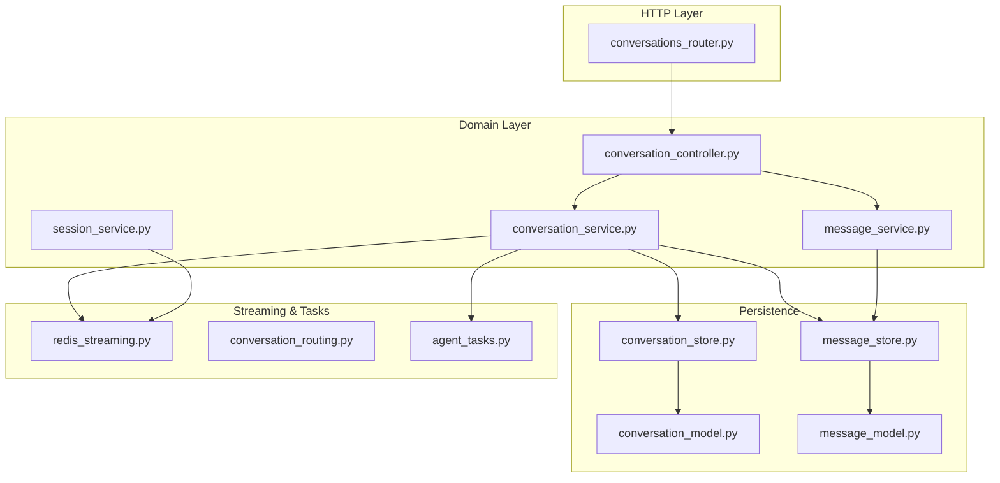
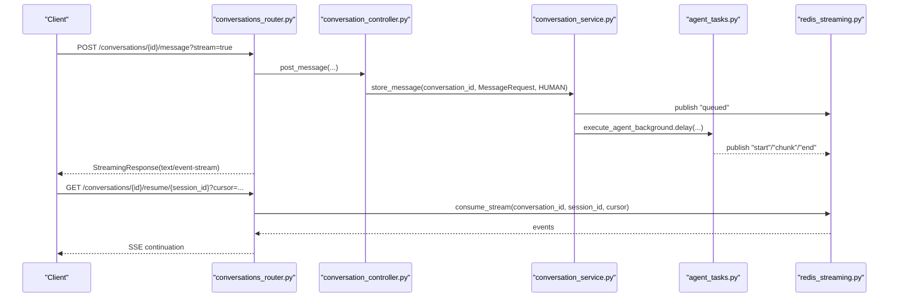
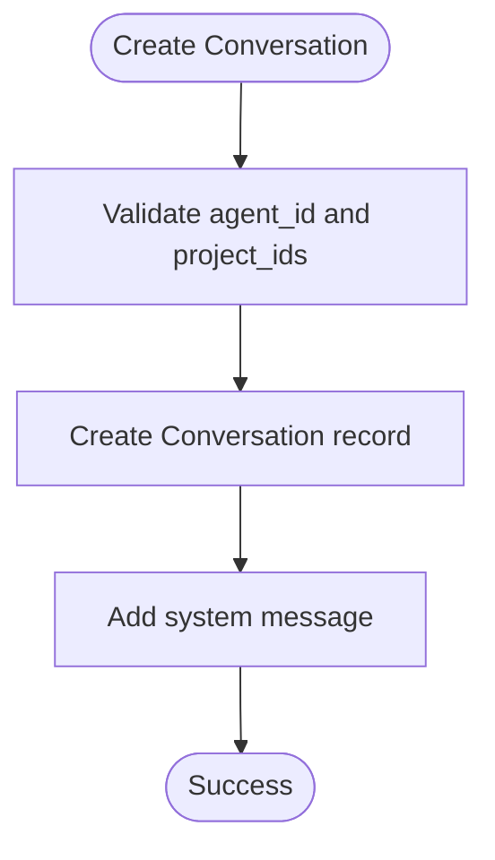
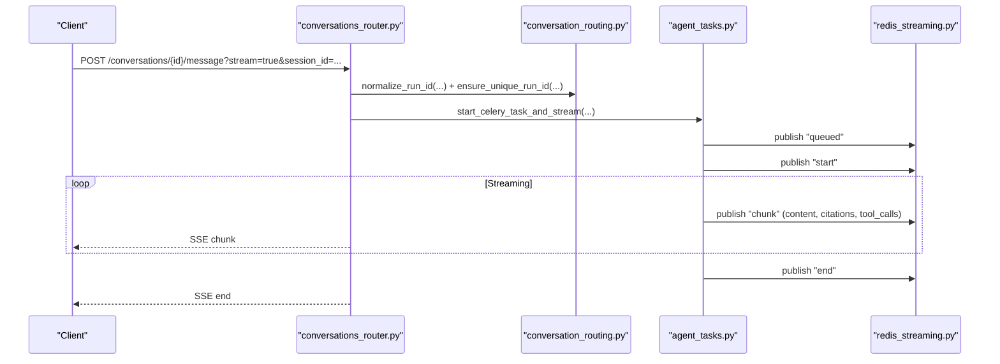
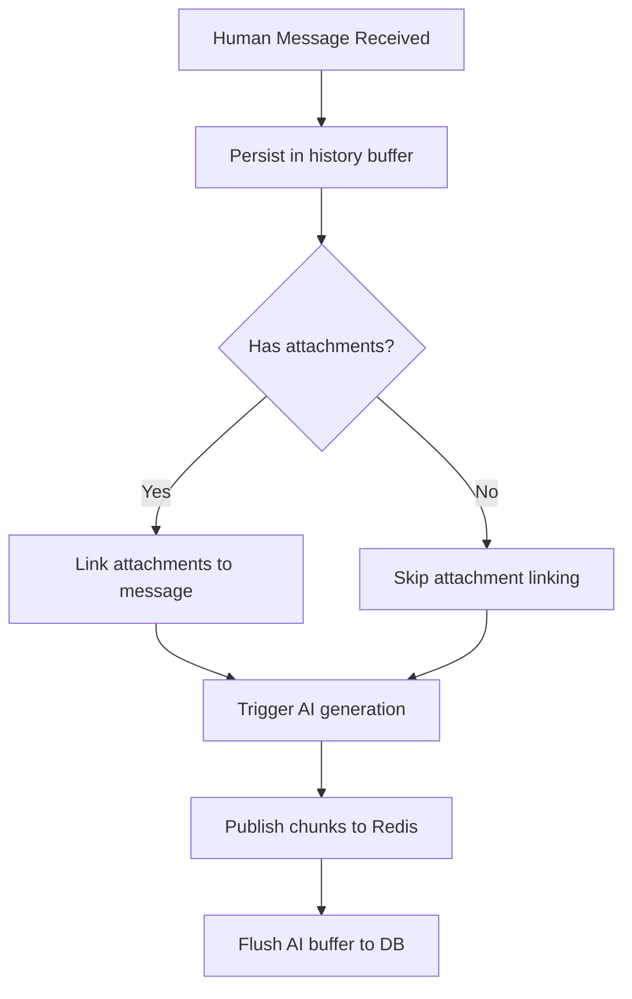
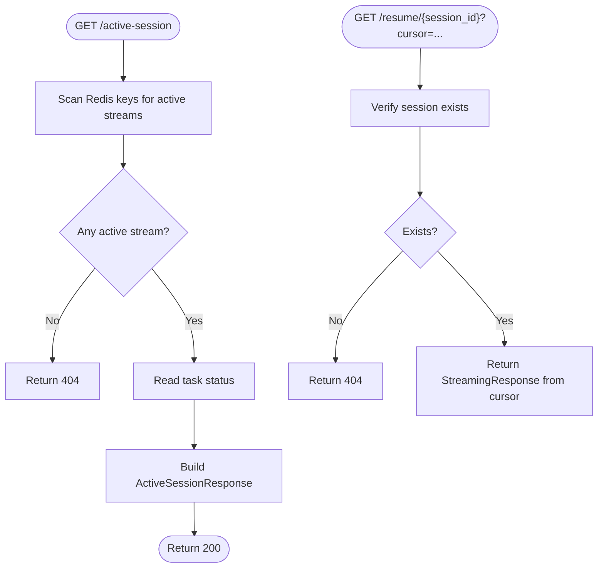
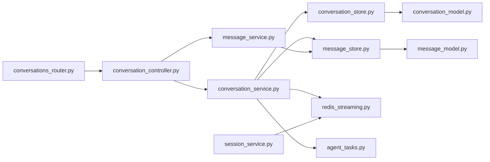
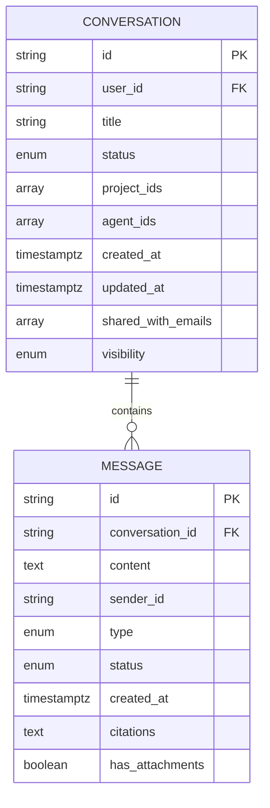

# Conversations & Messaging

<cite>
**Referenced Files in This Document**
- [conversations_router.py](file://app/modules/conversations/conversations_router.py)
- [conversation_controller.py](file://app/modules/conversations/conversation/conversation_controller.py)
- [conversation_service.py](file://app/modules/conversations/conversation/conversation_service.py)
- [conversation_schema.py](file://app/modules/conversations/conversation/conversation_schema.py)
- [conversation_model.py](file://app/modules/conversations/conversation/conversation_model.py)
- [conversation_store.py](file://app/modules/conversations/conversation/conversation_store.py)
- [message_schema.py](file://app/modules/conversations/message/message_schema.py)
- [message_model.py](file://app/modules/conversations/message/message_model.py)
- [message_store.py](file://app/modules/conversations/message/message_store.py)
- [message_service.py](file://app/modules/conversations/message/message_service.py)
- [session_service.py](file://app/modules/conversations/session/session_service.py)
- [redis_streaming.py](file://app/modules/conversations/utils/redis_streaming.py)
- [conversation_routing.py](file://app/modules/conversations/utils/conversation_routing.py)
- [agent_tasks.py](file://app/celery/tasks/agent_tasks.py)
</cite>

## Table of Contents
1. [Introduction](#introduction)
2. [Project Structure](#project-structure)
3. [Core Components](#core-components)
4. [Architecture Overview](#architecture-overview)
5. [Detailed Component Analysis](#detailed-component-analysis)
6. [Dependency Analysis](#dependency-analysis)
7. [Performance Considerations](#performance-considerations)
8. [Troubleshooting Guide](#troubleshooting-guide)
9. [Conclusion](#conclusion)
10. [Appendices](#appendices)

## Introduction
Potpie’s conversation and messaging system powers real-time, streaming interactions between users and AI agents. It manages:
- Conversation lifecycle: creation, retrieval, renaming, deletion, and archival
- Message handling: persistence, multimodal attachments, and streaming responses
- Real-time streaming: server-sent events via Redis-backed streams with session resumption and cancellation
- Session management: active session discovery, task status monitoring, and deterministic run IDs

The system supports both immediate, non-streaming responses and background streaming via Celery, enabling resilient, reconnectable chat experiences.

## Project Structure
The conversations module is organized by domain:
- Router: HTTP endpoints for conversations, messages, sessions, and sharing
- Controller: orchestrates user requests and delegates to services
- Service: business logic for conversations, messages, agents, and streaming
- Stores: database access for conversations and messages
- Session: Redis-backed session and task status helpers
- Utilities: Redis streaming, routing helpers, and Celery tasks

**Diagram sources**
- [conversations_router.py](file://app/modules/conversations/conversations_router.py#L1-L622)
- [conversation_controller.py](file://app/modules/conversations/conversation/conversation_controller.py#L1-L224)
- [conversation_service.py](file://app/modules/conversations/conversation/conversation_service.py#L1-L800)
- [conversation_store.py](file://app/modules/conversations/conversation/conversation_store.py#L1-L119)
- [message_store.py](file://app/modules/conversations/message/message_store.py#L1-L83)
- [message_service.py](file://app/modules/conversations/message/message_service.py#L1-L138)
- [session_service.py](file://app/modules/conversations/session/session_service.py#L1-L164)
- [redis_streaming.py](file://app/modules/conversations/utils/redis_streaming.py#L1-L248)
- [conversation_routing.py](file://app/modules/conversations/utils/conversation_routing.py#L1-L324)
- [agent_tasks.py](file://app/celery/tasks/agent_tasks.py#L1-L460)

**Section sources**
- [conversations_router.py](file://app/modules/conversations/conversations_router.py#L1-L622)
- [conversation_controller.py](file://app/modules/conversations/conversation/conversation_controller.py#L1-L224)
- [conversation_service.py](file://app/modules/conversations/conversation/conversation_service.py#L1-L800)
- [conversation_store.py](file://app/modules/conversations/conversation/conversation_store.py#L1-L119)
- [message_store.py](file://app/modules/conversations/message/message_store.py#L1-L83)
- [message_service.py](file://app/modules/conversations/message/message_service.py#L1-L138)
- [session_service.py](file://app/modules/conversations/session/session_service.py#L1-L164)
- [redis_streaming.py](file://app/modules/conversations/utils/redis_streaming.py#L1-L248)
- [conversation_routing.py](file://app/modules/conversations/utils/conversation_routing.py#L1-L324)
- [agent_tasks.py](file://app/celery/tasks/agent_tasks.py#L1-L460)

## Core Components
- Conversation Router: Exposes endpoints for listing, creating, retrieving, renaming, deleting, and streaming conversations; also exposes session and task status endpoints.
- Conversation Controller: Validates access, orchestrates persistence, and delegates to ConversationService for streaming and regeneration.
- Conversation Service: Implements conversation CRUD, access checks, message storage, AI generation, and streaming orchestration via Redis and Celery.
- Message Service: Creates and archives messages with validation and error handling.
- Session Service: Inspects active sessions and task statuses using Redis keys.
- Redis Stream Manager: Publishes and consumes streaming events, manages TTL and max length, cancellation, and task status.
- Celery Tasks: Execute agent and regeneration workflows, publish chunks, and finalize streams.

Key public interfaces:
- Conversation endpoints: GET/POST/DELETE /conversations/, GET /conversations/{id}/info, GET /conversations/{id}/messages
- Message endpoints: POST /conversations/{id}/message, POST /conversations/{id}/regenerate
- Session endpoints: GET /conversations/{id}/active-session, GET /conversations/{id}/task-status, GET /conversations/{id}/resume/{session_id}
- Streaming response: Server-Sent Events with JSON-encoded chunks

**Section sources**
- [conversations_router.py](file://app/modules/conversations/conversations_router.py#L58-L622)
- [conversation_controller.py](file://app/modules/conversations/conversation/conversation_controller.py#L33-L224)
- [conversation_service.py](file://app/modules/conversations/conversation/conversation_service.py#L73-L800)
- [message_service.py](file://app/modules/conversations/message/message_service.py#L31-L138)
- [session_service.py](file://app/modules/conversations/session/session_service.py#L15-L164)
- [redis_streaming.py](file://app/modules/conversations/utils/redis_streaming.py#L11-L248)
- [agent_tasks.py](file://app/celery/tasks/agent_tasks.py#L11-L460)

## Architecture Overview
High-level flow:
- Client sends a message or requests regeneration
- Router validates auth and routes to controller
- Controller persists human message and triggers AI generation
- Service streams chunks to Redis; Celery tasks publish events
- Client consumes SSE stream; session endpoints expose status and resumability

**Diagram sources**
- [conversations_router.py](file://app/modules/conversations/conversations_router.py#L160-L286)
- [conversation_controller.py](file://app/modules/conversations/conversation/conversation_controller.py#L106-L137)
- [conversation_service.py](file://app/modules/conversations/conversation/conversation_service.py#L544-L652)
- [conversation_routing.py](file://app/modules/conversations/utils/conversation_routing.py#L107-L170)
- [redis_streaming.py](file://app/modules/conversations/utils/redis_streaming.py#L64-L151)
- [agent_tasks.py](file://app/celery/tasks/agent_tasks.py#L11-L247)

## Detailed Component Analysis

### Conversation Lifecycle Management
- Creation: Validates agent/project associations, sets title, and adds a system message
- Retrieval: Lists conversations with pagination/sorting and enriches with project/agent metadata
- Renaming: Updates title for a conversation the user owns
- Deletion: Removes conversation and cascades related messages

**Diagram sources**
- [conversation_service.py](file://app/modules/conversations/conversation/conversation_service.py#L216-L282)
- [conversation_store.py](file://app/modules/conversations/conversation/conversation_store.py#L26-L58)

**Section sources**
- [conversation_controller.py](file://app/modules/conversations/conversation/conversation_controller.py#L53-L161)
- [conversation_service.py](file://app/modules/conversations/conversation/conversation_service.py#L216-L282)
- [conversation_store.py](file://app/modules/conversations/conversation/conversation_store.py#L18-L119)

### Real-Time Streaming Architecture
- Deterministic run IDs: Combine conversation/user/context to ensure stable sessions
- Background execution: Celery tasks publish “chunk” events; “queued” and “end” events signal state
- SSE streaming: Router wraps redis_stream_generator to emit JSON-encoded chunks
- Resumption: Clients can resume from a cursor; Router validates session existence and returns SSE

**Diagram sources**
- [conversations_router.py](file://app/modules/conversations/conversations_router.py#L264-L286)
- [conversation_routing.py](file://app/modules/conversations/utils/conversation_routing.py#L23-L58)
- [conversation_routing.py](file://app/modules/conversations/utils/conversation_routing.py#L107-L170)
- [agent_tasks.py](file://app/celery/tasks/agent_tasks.py#L11-L247)
- [redis_streaming.py](file://app/modules/conversations/utils/redis_streaming.py#L21-L62)

**Section sources**
- [conversation_routing.py](file://app/modules/conversations/utils/conversation_routing.py#L23-L170)
- [redis_streaming.py](file://app/modules/conversations/utils/redis_streaming.py#L11-L248)
- [agent_tasks.py](file://app/celery/tasks/agent_tasks.py#L11-L247)

### Message Handling and Persistence
- Human messages: Persisted immediately; optional multimodal attachments linked afterward
- AI messages: Buffered and flushed after cancellation or completion
- Regeneration: Archives subsequent messages and replays from last human message with optional image attachments

**Diagram sources**
- [conversation_service.py](file://app/modules/conversations/conversation/conversation_service.py#L544-L652)
- [message_service.py](file://app/modules/conversations/message/message_service.py#L31-L138)

**Section sources**
- [conversation_service.py](file://app/modules/conversations/conversation/conversation_service.py#L544-L783)
- [message_service.py](file://app/modules/conversations/message/message_service.py#L31-L138)
- [message_store.py](file://app/modules/conversations/message/message_store.py#L1-L83)

### Session Persistence and Resumption
- Active session discovery: Scans Redis for active streams and determines status from task status
- Task status: Estimates completion and returns session metadata
- Resume: Validates session existence and returns SSE from a given cursor

**Diagram sources**
- [session_service.py](file://app/modules/conversations/session/session_service.py#L23-L98)
- [conversations_router.py](file://app/modules/conversations/conversations_router.py#L521-L566)
- [redis_streaming.py](file://app/modules/conversations/utils/redis_streaming.py#L64-L151)

**Section sources**
- [session_service.py](file://app/modules/conversations/session/session_service.py#L15-L164)
- [conversations_router.py](file://app/modules/conversations/conversations_router.py#L461-L566)
- [redis_streaming.py](file://app/modules/conversations/utils/redis_streaming.py#L64-L151)

### Public Interfaces and Parameters
- Create conversation
  - Method: POST /conversations/
  - Body: CreateConversationRequest (title, project_ids, agent_ids)
  - Query: hidden (bool)
  - Response: CreateConversationResponse (message, conversation_id)

- Get conversation info
  - Method: GET /conversations/{conversation_id}/info/
  - Response: ConversationInfoResponse (id, title, status, project_ids, created_at, updated_at, total_messages, agent_ids, access_type, is_creator, visibility)

- Get messages
  - Method: GET /conversations/{conversation_id}/messages/?start=&limit=
  - Response: List[MessageResponse]

- Post message (streaming)
  - Method: POST /conversations/{conversation_id}/message/?stream=&session_id=&prev_human_message_id=&cursor=
  - Form fields: content (required), node_ids (optional JSON), images (optional uploads)
  - Response: SSE (text/event-stream) of ChatMessageResponse

- Regenerate last message (streaming)
  - Method: POST /conversations/{conversation_id}/regenerate/?stream=&session_id=&prev_human_message_id=&cursor=&background=
  - Body: RegenerateRequest (node_ids)
  - Response: SSE (text/event-stream) of ChatMessageResponse

- Stop generation
  - Method: POST /conversations/{conversation_id}/stop/?session_id=

- Rename conversation
  - Method: PATCH /conversations/{conversation_id}/rename/
  - Body: RenameConversationRequest (title)

- Active session
  - Method: GET /conversations/{conversation_id}/active-session
  - Response: ActiveSessionResponse or 404

- Task status
  - Method: GET /conversations/{conversation_id}/task-status
  - Response: TaskStatusResponse or 404

- Resume session
  - Method: GET /conversations/{conversation_id}/resume/{session_id}?cursor=
  - Response: SSE (text/event-stream)

Streaming response format (JSON per SSE event):
- ChatMessageResponse: message (string), citations (array), tool_calls (array)

**Section sources**
- [conversations_router.py](file://app/modules/conversations/conversations_router.py#L58-L622)
- [conversation_schema.py](file://app/modules/conversations/conversation/conversation_schema.py#L13-L93)
- [message_schema.py](file://app/modules/conversations/message/message_schema.py#L15-L47)
- [conversation_routing.py](file://app/modules/conversations/utils/conversation_routing.py#L61-L105)

## Dependency Analysis
- Router depends on Controller, AuthService, UsageService, MediaService, and Redis utilities
- Controller composes ConversationService and MessageService
- Service depends on stores, providers, tools, prompts, agents, media, session, and Redis/Celery
- Stores depend on SQLAlchemy models
- SessionService and RedisStreamManager coordinate streaming state

**Diagram sources**
- [conversations_router.py](file://app/modules/conversations/conversations_router.py#L1-L622)
- [conversation_controller.py](file://app/modules/conversations/conversation/conversation_controller.py#L1-L224)
- [conversation_service.py](file://app/modules/conversations/conversation/conversation_service.py#L1-L800)
- [conversation_store.py](file://app/modules/conversations/conversation/conversation_store.py#L1-L119)
- [message_store.py](file://app/modules/conversations/message/message_store.py#L1-L83)
- [message_service.py](file://app/modules/conversations/message/message_service.py#L1-L138)
- [session_service.py](file://app/modules/conversations/session/session_service.py#L1-L164)
- [redis_streaming.py](file://app/modules/conversations/utils/redis_streaming.py#L1-L248)
- [agent_tasks.py](file://app/celery/tasks/agent_tasks.py#L1-L460)

**Section sources**
- [conversation_service.py](file://app/modules/conversations/conversation/conversation_service.py#L73-L164)
- [redis_streaming.py](file://app/modules/conversations/utils/redis_streaming.py#L11-L248)
- [agent_tasks.py](file://app/celery/tasks/agent_tasks.py#L11-L247)

## Performance Considerations
- Streaming with Redis: Uses XADD with max length and TTL to cap memory; consumers poll with blocking reads
- Background tasks: Celery tasks run on separate workers; Redis keys expire to prevent leaks
- Repo manager: Optional background registration with timeouts to avoid blocking
- Pagination: Conversation listing supports pagination and sorting to reduce payload sizes
- Attachments: Image uploads are processed before message creation; failures clean up partial attachments

[No sources needed since this section provides general guidance]

## Troubleshooting Guide
Common issues and resolutions:
- Subscription required: Usage limits enforced on conversation creation and message posting
- Access denied: Conversation access controlled by ownership, visibility, and shared emails
- Stream timeout/expired: Consumers wait up to 120 seconds for stream creation; “end” events signal expiration
- Cancellation: Setting a cancellation key stops generation; partial AI buffers are flushed before ending
- Task not found: Session endpoints return 404 when no active stream or task status is available

**Section sources**
- [conversations_router.py](file://app/modules/conversations/conversations_router.py#L94-L195)
- [conversation_service.py](file://app/modules/conversations/conversation/conversation_service.py#L166-L214)
- [redis_streaming.py](file://app/modules/conversations/utils/redis_streaming.py#L91-L150)
- [session_service.py](file://app/modules/conversations/session/session_service.py#L35-L98)

## Conclusion
Potpie’s conversation and messaging system integrates HTTP endpoints, streaming via Redis, and background Celery tasks to deliver responsive, resilient chat experiences. It supports deterministic sessions, resumability, cancellation, and multimodal attachments while maintaining clear separation of concerns across routers, controllers, services, stores, and streaming utilities.

[No sources needed since this section summarizes without analyzing specific files]

## Appendices

### Data Models Overview

**Diagram sources**
- [conversation_model.py](file://app/modules/conversations/conversation/conversation_model.py#L23-L60)
- [message_model.py](file://app/modules/conversations/message/message_model.py#L23-L65)