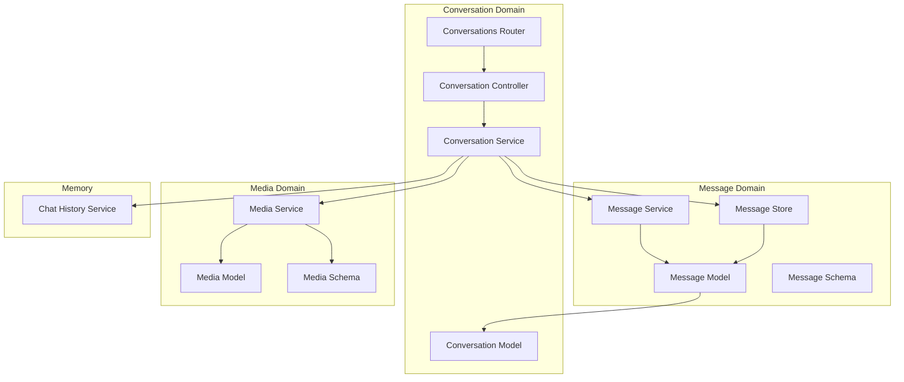
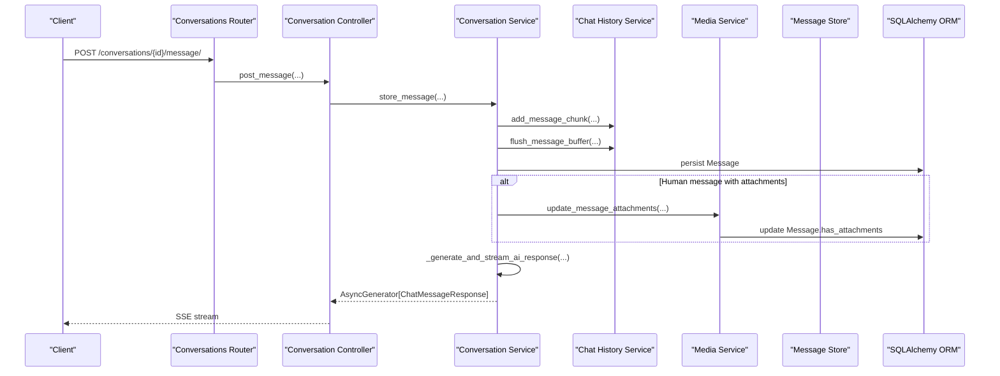
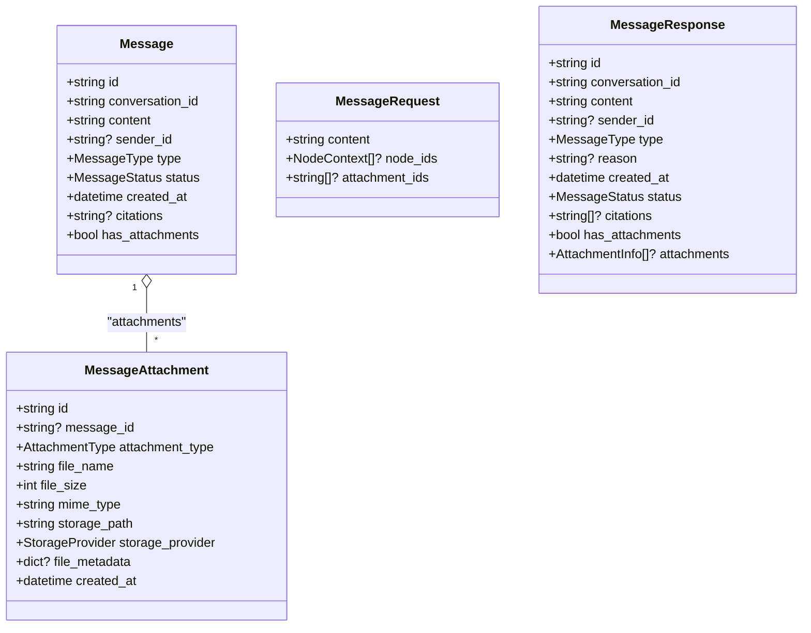
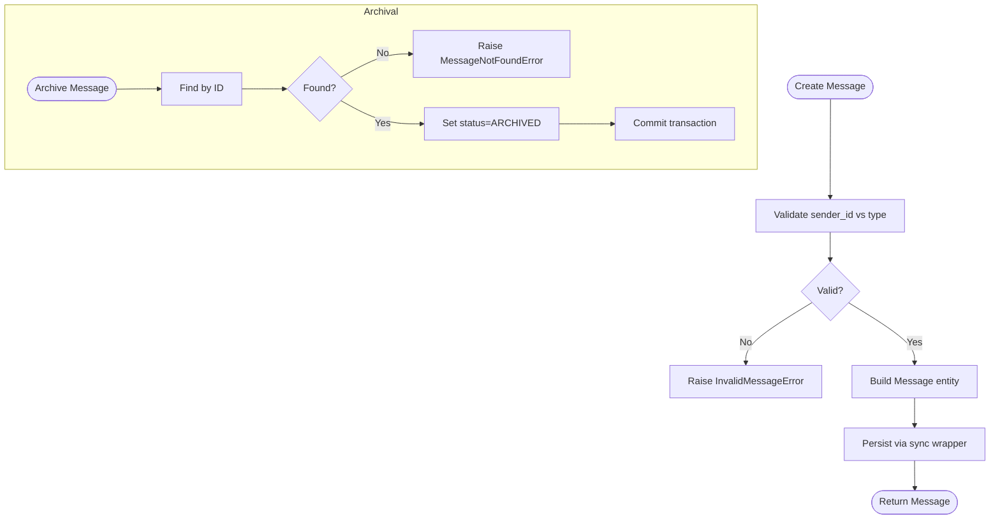
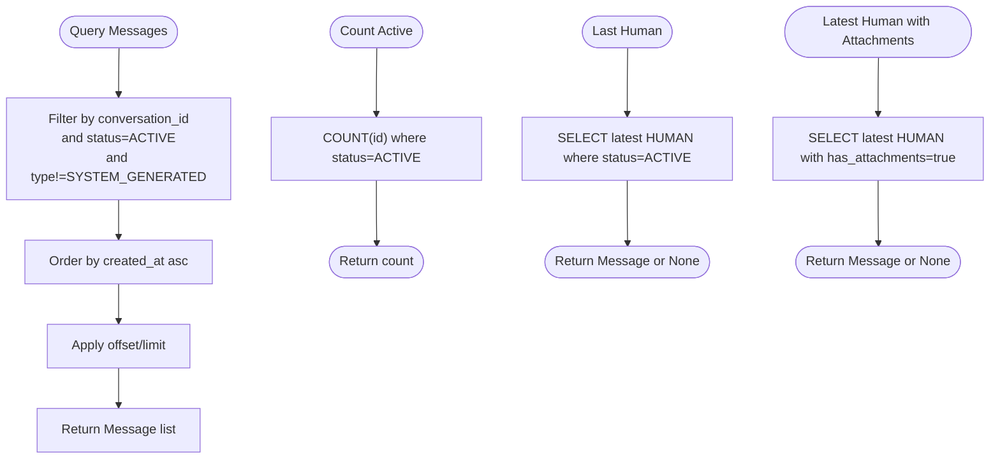
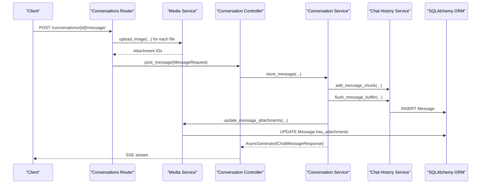
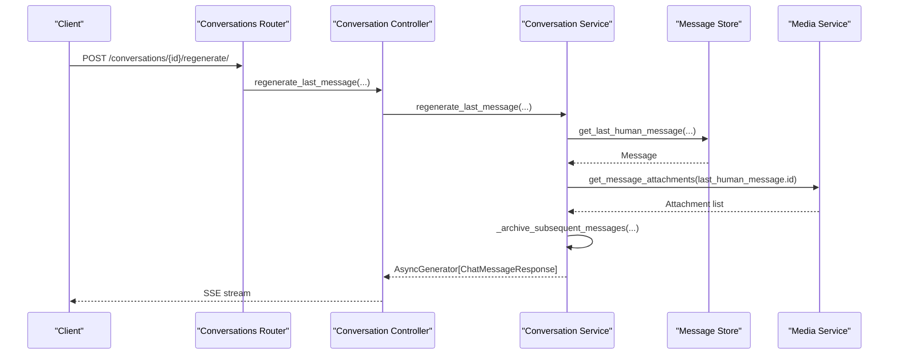
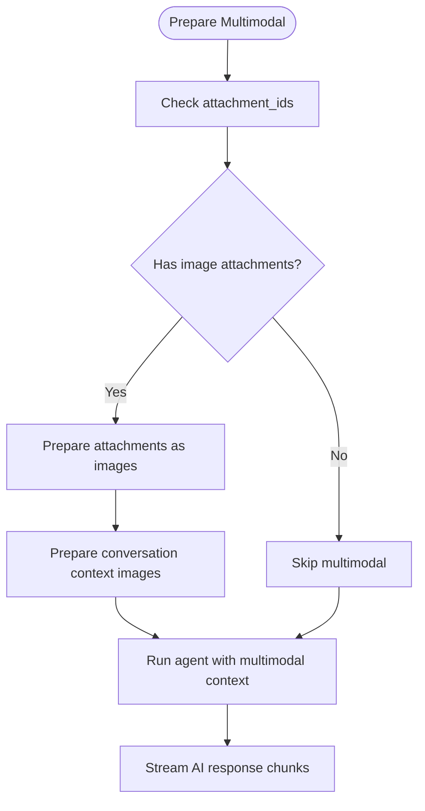
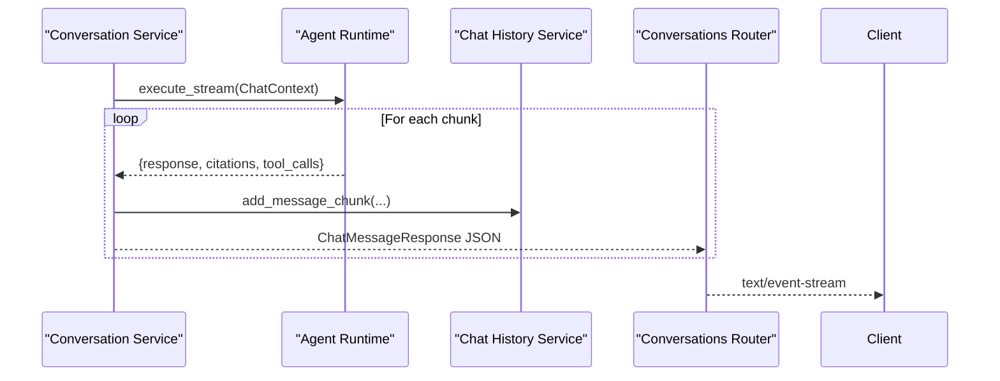
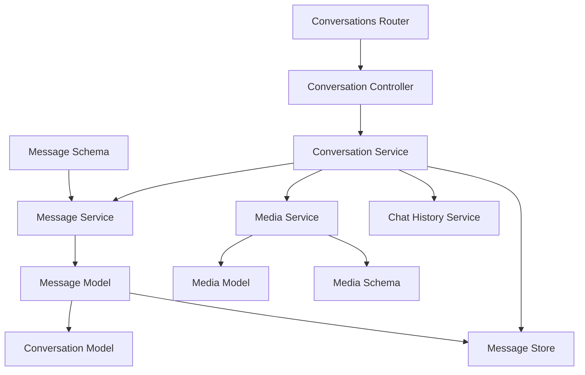

# Message Handling

<cite>
**Referenced Files in This Document**
- [message_model.py](file://app/modules/conversations/message/message_model.py)
- [message_schema.py](file://app/modules/conversations/message/message_schema.py)
- [message_service.py](file://app/modules/conversations/message/message_service.py)
- [message_store.py](file://app/modules/conversations/message/message_store.py)
- [conversation_model.py](file://app/modules/conversations/conversation/conversation_model.py)
- [conversation_controller.py](file://app/modules/conversations/conversation/conversation_controller.py)
- [conversation_service.py](file://app/modules/conversations/conversation/conversation_service.py)
- [conversations_router.py](file://app/modules/conversations/conversations_router.py)
- [chat_history_service.py](file://app/modules/intelligence/memory/chat_history_service.py)
- [media_model.py](file://app/modules/media/media_model.py)
- [media_schema.py](file://app/modules/media/media_schema.py)
- [media_service.py](file://app/modules/media/media_service.py)
</cite>

## Table of Contents
1. [Introduction](#introduction)
2. [Project Structure](#project-structure)
3. [Core Components](#core-components)
4. [Architecture Overview](#architecture-overview)
5. [Detailed Component Analysis](#detailed-component-analysis)
6. [Dependency Analysis](#dependency-analysis)
7. [Performance Considerations](#performance-considerations)
8. [Troubleshooting Guide](#troubleshooting-guide)
9. [Conclusion](#conclusion)

## Introduction
This document explains the message handling system that powers conversation creation, processing, and retrieval. It covers message service operations, schema validation, persistence patterns, multimodal attachment processing, message regeneration, streaming responses, and message history management. The goal is to make the system understandable for beginners while providing sufficient technical depth for experienced developers.

## Project Structure
The message handling system spans several modules:
- Message domain: models, schemas, service, and store
- Conversation domain: controller, service, and router orchestration
- Media domain: attachment records and multimodal processing
- Memory/history: buffering and streaming of AI responses

**Diagram sources**
- [message_model.py](file://app/modules/conversations/message/message_model.py#L23-L65)
- [message_schema.py](file://app/modules/conversations/message/message_schema.py#L15-L47)
- [message_service.py](file://app/modules/conversations/message/message_service.py#L31-L138)
- [message_store.py](file://app/modules/conversations/message/message_store.py#L8-L83)
- [conversation_model.py](file://app/modules/conversations/conversation/conversation_model.py#L23-L60)
- [conversation_controller.py](file://app/modules/conversations/conversation/conversation_controller.py#L33-L224)
- [conversation_service.py](file://app/modules/conversations/conversation/conversation_service.py#L73-L164)
- [conversations_router.py](file://app/modules/conversations/conversations_router.py#L58-L622)
- [chat_history_service.py](file://app/modules/intelligence/memory/chat_history_service.py#L23-L160)
- [media_model.py](file://app/modules/media/media_model.py#L24-L47)
- [media_schema.py](file://app/modules/media/media_schema.py#L9-L42)
- [media_service.py](file://app/modules/media/media_service.py#L31-L686)

**Section sources**
- [message_model.py](file://app/modules/conversations/message/message_model.py#L1-L65)
- [message_schema.py](file://app/modules/conversations/message/message_schema.py#L1-L47)
- [message_service.py](file://app/modules/conversations/message/message_service.py#L1-L138)
- [message_store.py](file://app/modules/conversations/message/message_store.py#L1-L83)
- [conversation_model.py](file://app/modules/conversations/conversation/conversation_model.py#L1-L60)
- [conversation_controller.py](file://app/modules/conversations/conversation/conversation_controller.py#L1-L224)
- [conversation_service.py](file://app/modules/conversations/conversation/conversation_service.py#L1-L1525)
- [conversations_router.py](file://app/modules/conversations/conversations_router.py#L1-L622)
- [chat_history_service.py](file://app/modules/intelligence/memory/chat_history_service.py#L1-L160)
- [media_model.py](file://app/modules/media/media_model.py#L1-L47)
- [media_schema.py](file://app/modules/media/media_schema.py#L1-L42)
- [media_service.py](file://app/modules/media/media_service.py#L1-L686)

## Core Components
- Message model defines the persisted entity with type, status, timestamps, sender, citations, and attachment flags.
- Message schema validates and serializes requests/responses for message creation and retrieval.
- Message service encapsulates creation/validation and archival operations.
- Message store provides database queries for pagination, counts, and attachment-aware retrieval.
- Conversation controller and service coordinate message creation, streaming, regeneration, and history management.
- Media service handles multimodal attachments, base64 conversion, and storage integration.
- Chat history service buffers streaming chunks and flushes them as discrete messages.

**Section sources**
- [message_model.py](file://app/modules/conversations/message/message_model.py#L23-L65)
- [message_schema.py](file://app/modules/conversations/message/message_schema.py#L15-L47)
- [message_service.py](file://app/modules/conversations/message/message_service.py#L31-L138)
- [message_store.py](file://app/modules/conversations/message/message_store.py#L8-L83)
- [conversation_controller.py](file://app/modules/conversations/conversation/conversation_controller.py#L33-L224)
- [conversation_service.py](file://app/modules/conversations/conversation/conversation_service.py#L544-L1028)
- [media_service.py](file://app/modules/media/media_service.py#L31-L686)
- [chat_history_service.py](file://app/modules/intelligence/memory/chat_history_service.py#L23-L160)

## Architecture Overview
The system follows a layered architecture:
- API layer: FastAPI router exposes endpoints for creating conversations, posting messages, retrieving messages, and regenerating responses.
- Controller layer: Validates access, orchestrates service operations, and streams responses.
- Service layer: Manages conversation lifecycle, message persistence, multimodal processing, and streaming.
- Persistence layer: SQLAlchemy ORM models and stores for messages and attachments.
- Media layer: Handles image uploads, transformations, and base64 conversion for multimodal agents.

**Diagram sources**
- [conversations_router.py](file://app/modules/conversations/conversations_router.py#L160-L286)
- [conversation_controller.py](file://app/modules/conversations/conversation/conversation_controller.py#L106-L120)
- [conversation_service.py](file://app/modules/conversations/conversation/conversation_service.py#L544-L652)
- [chat_history_service.py](file://app/modules/intelligence/memory/chat_history_service.py#L68-L135)
- [media_service.py](file://app/modules/media/media_service.py#L450-L487)
- [message_store.py](file://app/modules/conversations/message/message_store.py#L11-L34)

**Section sources**
- [conversations_router.py](file://app/modules/conversations/conversations_router.py#L160-L286)
- [conversation_controller.py](file://app/modules/conversations/conversation/conversation_controller.py#L106-L120)
- [conversation_service.py](file://app/modules/conversations/conversation/conversation_service.py#L544-L652)
- [chat_history_service.py](file://app/modules/intelligence/memory/chat_history_service.py#L68-L135)
- [media_service.py](file://app/modules/media/media_service.py#L450-L487)
- [message_store.py](file://app/modules/conversations/message/message_store.py#L11-L34)

## Detailed Component Analysis

### Message Model and Schema
- Message model enforces:
  - Type and status enums
  - Sender constraints per type (human requires sender_id; AI/system-generated must not)
  - Timestamps and foreign key to conversation
  - Citations as text and attachment presence flag
- Message schema defines:
  - Request payload for creating messages (content, node contexts, attachment IDs)
  - Response payload for retrieving messages (including attachments and citations)
  - Direct message request variant with optional agent targeting

**Diagram sources**
- [message_model.py](file://app/modules/conversations/message/message_model.py#L23-L65)
- [media_model.py](file://app/modules/media/media_model.py#L24-L47)
- [message_schema.py](file://app/modules/conversations/message/message_schema.py#L15-L47)
- [media_schema.py](file://app/modules/media/media_schema.py#L9-L23)

**Section sources**
- [message_model.py](file://app/modules/conversations/message/message_model.py#L11-L65)
- [message_schema.py](file://app/modules/conversations/message/message_schema.py#L15-L47)
- [media_model.py](file://app/modules/media/media_model.py#L10-L47)
- [media_schema.py](file://app/modules/media/media_schema.py#L9-L23)

### Message Service Operations
- Creation:
  - Validates sender_id against message type
  - Generates unique IDs, sets status and timestamps
  - Persists asynchronously via a sync wrapper
- Archival:
  - Marks messages as archived by ID
  - Handles not-found and database errors

**Diagram sources**
- [message_service.py](file://app/modules/conversations/message/message_service.py#L35-L89)
- [message_service.py](file://app/modules/conversations/message/message_service.py#L100-L137)

**Section sources**
- [message_service.py](file://app/modules/conversations/message/message_service.py#L35-L89)
- [message_service.py](file://app/modules/conversations/message/message_service.py#L100-L137)

### Message Retrieval with Pagination
- Retrieves active, non-system messages ordered by creation time
- Supports pagination via offset/limit
- Counts active messages per conversation
- Retrieves last human message and latest human message with attachments

**Diagram sources**
- [message_store.py](file://app/modules/conversations/message/message_store.py#L11-L34)
- [message_store.py](file://app/modules/conversations/message/message_store.py#L36-L47)
- [message_store.py](file://app/modules/conversations/message/message_store.py#L63-L77)

**Section sources**
- [message_store.py](file://app/modules/conversations/message/message_store.py#L11-L34)
- [message_store.py](file://app/modules/conversations/message/message_store.py#L36-L47)
- [message_store.py](file://app/modules/conversations/message/message_store.py#L63-L77)

### Message Creation Workflow (Human Messages)
- Router validates content and optional images
- Uploads images to storage and records attachments
- Builds MessageRequest with content, node IDs, and attachment IDs
- Controller delegates to service’s store_message
- Service buffers human content, persists as a message, links attachments, and triggers AI generation

**Diagram sources**
- [conversations_router.py](file://app/modules/conversations/conversations_router.py#L178-L286)
- [media_service.py](file://app/modules/media/media_service.py#L101-L177)
- [conversation_controller.py](file://app/modules/conversations/conversation/conversation_controller.py#L106-L120)
- [conversation_service.py](file://app/modules/conversations/conversation/conversation_service.py#L544-L652)
- [chat_history_service.py](file://app/modules/intelligence/memory/chat_history_service.py#L68-L135)

**Section sources**
- [conversations_router.py](file://app/modules/conversations/conversations_router.py#L178-L286)
- [media_service.py](file://app/modules/media/media_service.py#L101-L177)
- [conversation_controller.py](file://app/modules/conversations/conversation/conversation_controller.py#L106-L120)
- [conversation_service.py](file://app/modules/conversations/conversation/conversation_service.py#L544-L652)
- [chat_history_service.py](file://app/modules/intelligence/memory/chat_history_service.py#L68-L135)

### Message Regeneration Workflow
- Validates access and retrieves the last human message
- Optionally extracts image attachment IDs for multimodal regeneration
- Archives messages after the last human message
- Streams a new AI response using the same context and attachments

**Diagram sources**
- [conversations_router.py](file://app/modules/conversations/conversations_router.py#L288-L417)
- [conversation_controller.py](file://app/modules/conversations/conversation/conversation_controller.py#L121-L137)
- [conversation_service.py](file://app/modules/conversations/conversation/conversation_service.py#L688-L783)
- [message_store.py](file://app/modules/conversations/message/message_store.py#L36-L47)
- [media_service.py](file://app/modules/media/media_service.py#L489-L540)

**Section sources**
- [conversations_router.py](file://app/modules/conversations/conversations_router.py#L288-L417)
- [conversation_controller.py](file://app/modules/conversations/conversation/conversation_controller.py#L121-L137)
- [conversation_service.py](file://app/modules/conversations/conversation/conversation_service.py#L688-L783)
- [message_store.py](file://app/modules/conversations/message/message_store.py#L36-L47)
- [media_service.py](file://app/modules/media/media_service.py#L489-L540)

### Multimodal Message Support
- Human messages can include image attachments.
- During regeneration, image attachments from the last human message are extracted and passed to the agent.
- Media service converts images to base64 for LLM consumption and prepares context images from recent conversation history.

**Diagram sources**
- [conversation_service.py](file://app/modules/conversations/conversation/conversation_service.py#L927-L946)
- [conversation_service.py](file://app/modules/conversations/conversation/conversation_service.py#L1046-L1096)
- [conversation_service.py](file://app/modules/conversations/conversation/conversation_service.py#L1126-L1142)
- [media_service.py](file://app/modules/media/media_service.py#L542-L566)
- [media_service.py](file://app/modules/media/media_service.py#L568-L611)
- [media_service.py](file://app/modules/media/media_service.py#L613-L657)

**Section sources**
- [conversation_service.py](file://app/modules/conversations/conversation/conversation_service.py#L927-L946)
- [conversation_service.py](file://app/modules/conversations/conversation/conversation_service.py#L1046-L1096)
- [conversation_service.py](file://app/modules/conversations/conversation/conversation_service.py#L1126-L1142)
- [media_service.py](file://app/modules/media/media_service.py#L542-L566)
- [media_service.py](file://app/modules/media/media_service.py#L568-L611)
- [media_service.py](file://app/modules/media/media_service.py#L613-L657)

### Streaming Message Responses
- The service streams AI responses as structured chunks with message text, citations, and tool calls.
- Router wraps the stream in JSON-encoded events for SSE.
- Sessions are managed with run IDs and Redis for background tasks and resumption.

**Diagram sources**
- [conversation_service.py](file://app/modules/conversations/conversation/conversation_service.py#L996-L1015)
- [chat_history_service.py](file://app/modules/intelligence/memory/chat_history_service.py#L68-L83)
- [conversations_router.py](file://app/modules/conversations/conversations_router.py#L53-L55)

**Section sources**
- [conversation_service.py](file://app/modules/conversations/conversation/conversation_service.py#L996-L1015)
- [chat_history_service.py](file://app/modules/intelligence/memory/chat_history_service.py#L68-L83)
- [conversations_router.py](file://app/modules/conversations/conversations_router.py#L53-L55)

### Message Validation Rules and Content Handling
- Router validates that human message content is not empty.
- Message service validates sender_id against message type.
- Media service validates image types, sizes, and transforms images for optimal LLM consumption.
- Chat history service deduplicates citations when flushing buffers.

**Section sources**
- [conversations_router.py](file://app/modules/conversations/conversations_router.py#L179-L183)
- [message_service.py](file://app/modules/conversations/message/message_service.py#L43-L49)
- [media_service.py](file://app/modules/media/media_service.py#L186-L210)
- [chat_history_service.py](file://app/modules/intelligence/memory/chat_history_service.py#L106-L108)

### Message Ordering Within Conversations
- Messages are ordered by created_at ascending for retrieval.
- System-generated messages are excluded from user-facing lists.
- The last human message is used as the anchor for regeneration.

**Section sources**
- [message_store.py](file://app/modules/conversations/message/message_store.py#L29-L34)
- [message_store.py](file://app/modules/conversations/message/message_store.py#L43-L47)
- [conversation_service.py](file://app/modules/conversations/conversation/conversation_service.py#L849-L854)

### Message Metadata Handling
- MessageResponse includes timestamps, status, type, sender_id, citations, and attachment metadata.
- AttachmentInfo excludes internal storage paths and includes signed URLs for secure access.

**Section sources**
- [message_schema.py](file://app/modules/conversations/message/message_schema.py#L32-L46)
- [media_schema.py](file://app/modules/media/media_schema.py#L9-L23)

## Dependency Analysis
- Message model depends on SQLAlchemy and defines foreign keys to conversations and attachments.
- Conversation model depends on message model and defines relationships.
- Conversation service composes multiple collaborators: stores, media service, agent services, and history manager.
- Router depends on controller and media service for uploads.
- Media service depends on storage providers and SQLAlchemy for persistence.

**Diagram sources**
- [message_model.py](file://app/modules/conversations/message/message_model.py#L23-L65)
- [conversation_model.py](file://app/modules/conversations/conversation/conversation_model.py#L23-L60)
- [message_store.py](file://app/modules/conversations/message/message_store.py#L8-L83)
- [message_service.py](file://app/modules/conversations/message/message_service.py#L31-L138)
- [conversation_controller.py](file://app/modules/conversations/conversation/conversation_controller.py#L33-L51)
- [conversation_service.py](file://app/modules/conversations/conversation/conversation_service.py#L73-L164)
- [conversations_router.py](file://app/modules/conversations/conversations_router.py#L58-L80)
- [media_model.py](file://app/modules/media/media_model.py#L24-L47)
- [media_schema.py](file://app/modules/media/media_schema.py#L9-L42)
- [media_service.py](file://app/modules/media/media_service.py#L31-L686)

**Section sources**
- [message_model.py](file://app/modules/conversations/message/message_model.py#L23-L65)
- [conversation_model.py](file://app/modules/conversations/conversation/conversation_model.py#L23-L60)
- [message_store.py](file://app/modules/conversations/message/message_store.py#L8-L83)
- [message_service.py](file://app/modules/conversations/message/message_service.py#L31-L138)
- [conversation_controller.py](file://app/modules/conversations/conversation/conversation_controller.py#L33-L51)
- [conversation_service.py](file://app/modules/conversations/conversation/conversation_service.py#L73-L164)
- [conversations_router.py](file://app/modules/conversations/conversations_router.py#L58-L80)
- [media_model.py](file://app/modules/media/media_model.py#L24-L47)
- [media_schema.py](file://app/modules/media/media_schema.py#L9-L42)
- [media_service.py](file://app/modules/media/media_service.py#L31-L686)

## Performance Considerations
- Asynchronous persistence: Message creation uses a thread pool to run sync DB operations, minimizing latency in async contexts.
- Streaming: AI responses are streamed to reduce perceived latency and memory usage.
- Pagination: Retrieval uses offset/limit to avoid loading entire histories.
- Image processing: Images are resized and compressed to balance quality and bandwidth for multimodal processing.
- Background tasks: Regeneration and long-running tasks are offloaded to Celery with Redis-backed streaming.

[No sources needed since this section provides general guidance]

## Troubleshooting Guide
Common issues and resolutions:
- Invalid sender_id/type mismatch during message creation:
  - Ensure human messages include a sender_id and AI/system messages do not.
- Attachment linking failures:
  - Verify attachment IDs exist and are unlinked; the system continues processing even if linking fails.
- Access denied errors:
  - Confirm conversation access level and visibility; only creators can regenerate.
- Empty message content:
  - Router rejects empty content; ensure content is provided.
- Multimodal disabled:
  - If multimodal is disabled, image processing steps are skipped; enable configuration to use images.

**Section sources**
- [message_service.py](file://app/modules/conversations/message/message_service.py#L43-L49)
- [conversation_service.py](file://app/modules/conversations/conversation/conversation_service.py#L688-L783)
- [conversations_router.py](file://app/modules/conversations/conversations_router.py#L179-L183)
- [media_service.py](file://app/modules/media/media_service.py#L92-L99)

## Conclusion
The message handling system integrates robust validation, asynchronous persistence, streaming responses, and multimodal capabilities. It supports human-AI interactions with attachments, message regeneration, and efficient retrieval with pagination. The layered design separates concerns across routers, controllers, services, stores, and media services, enabling scalability and maintainability.