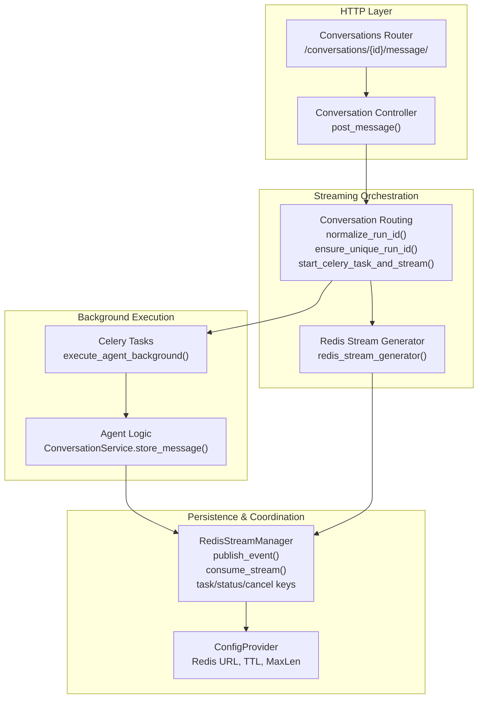
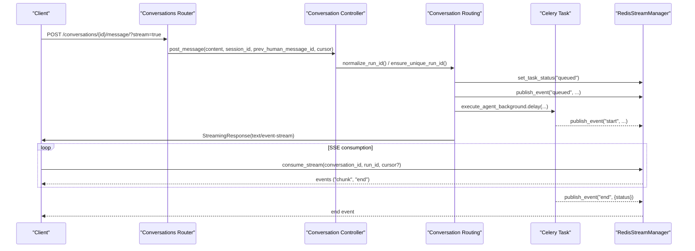
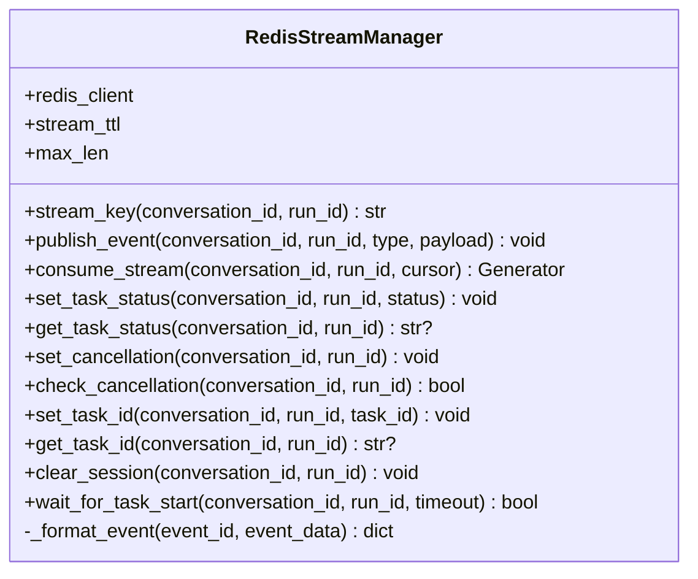
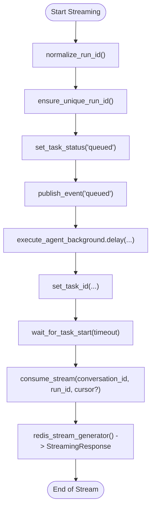
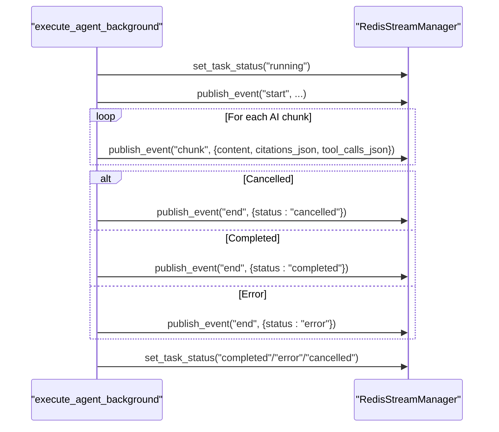
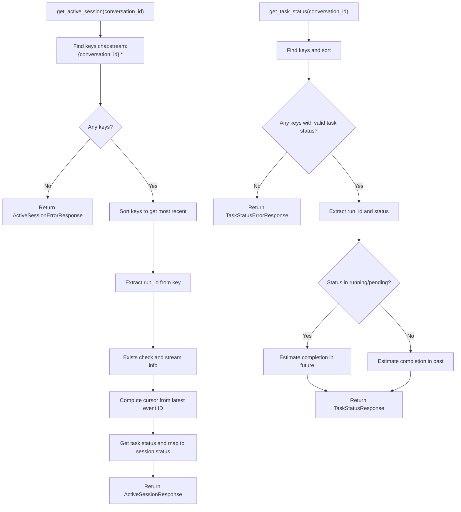
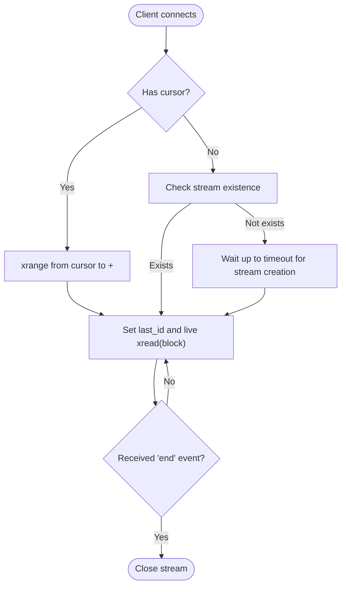
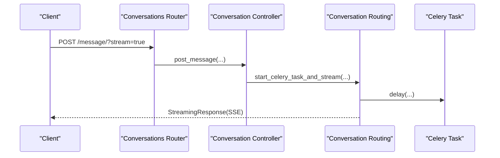
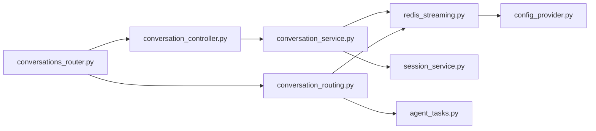

# Real-Time Streaming

<cite>
**Referenced Files in This Document**
- [redis_streaming.py](file://app/modules/conversations/utils/redis_streaming.py)
- [conversation_routing.py](file://app/modules/conversations/utils/conversation_routing.py)
- [conversations_router.py](file://app/modules/conversations/conversations_router.py)
- [conversation_controller.py](file://app/modules/conversations/conversation/conversation_controller.py)
- [conversation_service.py](file://app/modules/conversations/conversation/conversation_service.py)
- [session_service.py](file://app/modules/conversations/session/session_service.py)
- [conversation_schema.py](file://app/modules/conversations/conversation/conversation_schema.py)
- [agent_tasks.py](file://app/celery/tasks/agent_tasks.py)
- [config_provider.py](file://app/core/config_provider.py)
- [test_conversations_router.py](file://tests/integration-tests/conversations/test_conversations_router.py)
</cite>

## Table of Contents
1. [Introduction](#introduction)
2. [Project Structure](#project-structure)
3. [Core Components](#core-components)
4. [Architecture Overview](#architecture-overview)
5. [Detailed Component Analysis](#detailed-component-analysis)
6. [Dependency Analysis](#dependency-analysis)
7. [Performance Considerations](#performance-considerations)
8. [Troubleshooting Guide](#troubleshooting-guide)
9. [Conclusion](#conclusion)

## Introduction
This document explains the real-time streaming system built on Redis streams and Celery background tasks. It covers how long-running AI generation tasks are initiated, streamed to clients via Server-Sent Events (SSE), resumed across interruptions using stream cursors, and coordinated through Redis keys for task status and cancellation. It also documents session management APIs that expose active sessions and task status to frontends, and outlines the Redis utilities and conversation routing logic that power the streaming architecture.

## Project Structure
The streaming system spans several modules:
- Redis utilities for stream publishing/consuming and task/cancel keys
- Conversation routing utilities for session normalization, run_id uniqueness, and SSE generation
- Router/controller/service layers for initiating and managing streaming requests
- Celery tasks that execute agent logic and publish events to Redis
- Session service for exposing active sessions and task status via REST endpoints
- Configuration provider for Redis and stream parameters

**Diagram sources**
- [conversations_router.py](file://app/modules/conversations/conversations_router.py#L160-L200)
- [conversation_controller.py](file://app/modules/conversations/conversation/conversation_controller.py#L106-L120)
- [conversation_routing.py](file://app/modules/conversations/utils/conversation_routing.py#L23-L58)
- [conversation_routing.py](file://app/modules/conversations/utils/conversation_routing.py#L107-L170)
- [agent_tasks.py](file://app/celery/tasks/agent_tasks.py#L16-L460)
- [redis_streaming.py](file://app/modules/conversations/utils/redis_streaming.py#L11-L248)
- [config_provider.py](file://app/core/config_provider.py#L142-L217)

**Section sources**
- [conversations_router.py](file://app/modules/conversations/conversations_router.py#L160-L200)
- [conversation_routing.py](file://app/modules/conversations/utils/conversation_routing.py#L23-L58)
- [redis_streaming.py](file://app/modules/conversations/utils/redis_streaming.py#L11-L248)
- [config_provider.py](file://app/core/config_provider.py#L142-L217)

## Core Components
- RedisStreamManager: central Redis client wrapper that publishes events to streams, consumes events for SSE, manages task status and cancellation keys, and enforces TTL and max length.
- ConversationRouting: utilities for run_id normalization and uniqueness, SSE generator, and orchestration of Celery task initiation and streaming.
- CeleryTasks: background workers that execute agent logic, publish “start”, “chunk”, and “end” events, and update task status.
- ConversationService/Controller/Router: HTTP entry points that validate requests, normalize session identifiers, and delegate to routing utilities.
- SessionService: exposes REST endpoints to query active sessions and task status using Redis keys.

Key responsibilities:
- Run_id normalization and uniqueness to prevent collisions
- SSE generation via text/event-stream
- Stream cursors for resuming interrupted streams
- Task status tracking and cancellation signaling
- Background task coordination and cleanup

**Section sources**
- [redis_streaming.py](file://app/modules/conversations/utils/redis_streaming.py#L11-L248)
- [conversation_routing.py](file://app/modules/conversations/utils/conversation_routing.py#L23-L58)
- [conversation_routing.py](file://app/modules/conversations/utils/conversation_routing.py#L107-L170)
- [agent_tasks.py](file://app/celery/tasks/agent_tasks.py#L16-L460)
- [session_service.py](file://app/modules/conversations/session/session_service.py#L15-L164)
- [conversation_controller.py](file://app/modules/conversations/conversation/conversation_controller.py#L106-L120)
- [conversations_router.py](file://app/modules/conversations/conversations_router.py#L160-L200)

## Architecture Overview
The streaming architecture uses Redis streams as the transport layer for real-time updates. Celery tasks publish structured events (“start”, “chunk”, “end”) into a per-run stream. HTTP endpoints initiate background tasks and immediately start streaming SSE responses by consuming the Redis stream. Clients can resume streaming by supplying a cursor to rejoin the stream at a specific position.

**Diagram sources**
- [conversations_router.py](file://app/modules/conversations/conversations_router.py#L160-L200)
- [conversation_controller.py](file://app/modules/conversations/conversation/conversation_controller.py#L106-L120)
- [conversation_routing.py](file://app/modules/conversations/utils/conversation_routing.py#L107-L170)
- [agent_tasks.py](file://app/celery/tasks/agent_tasks.py#L16-L460)
- [redis_streaming.py](file://app/modules/conversations/utils/redis_streaming.py#L64-L150)

## Detailed Component Analysis

### Redis Streaming Utilities
RedisStreamManager encapsulates:
- Stream key construction and publishing with TTL and max length
- Consumption with optional cursor-based replay and live streaming
- Task status and cancellation keys
- Health checks and graceful termination signals

Key behaviors:
- Publishing ensures values are serialized and nested JSON fields are stored with suffixes for later parsing
- Consuming supports:
  - Cursor-based replay when resuming
  - Fresh requests waiting for stream creation with a timeout
  - Live streaming with blocking reads and TTL expiry detection
- Task status keys enable health checks and UI status reporting
- Cancellation keys allow clients to signal stop and workers to flush partial buffers

**Diagram sources**
- [redis_streaming.py](file://app/modules/conversations/utils/redis_streaming.py#L11-L248)

**Section sources**
- [redis_streaming.py](file://app/modules/conversations/utils/redis_streaming.py#L11-L248)
- [config_provider.py](file://app/core/config_provider.py#L207-L217)

### Conversation Routing and Streaming Response Patterns
ConversationRouting provides:
- normalize_run_id(): deterministic session IDs scoped to user and previous message
- ensure_unique_run_id(): ensures uniqueness by appending counters when conflicts exist
- start_celery_task_and_stream(): orchestrates task launch, sets queued status, publishes queued event, stores Celery task ID, waits briefly for task start, and returns an SSE response
- redis_stream_generator(): converts Redis events into JSON-compatible SSE frames

**Diagram sources**
- [conversation_routing.py](file://app/modules/conversations/utils/conversation_routing.py#L23-L58)
- [conversation_routing.py](file://app/modules/conversations/utils/conversation_routing.py#L107-L170)
- [redis_streaming.py](file://app/modules/conversations/utils/redis_streaming.py#L64-L150)

**Section sources**
- [conversation_routing.py](file://app/modules/conversations/utils/conversation_routing.py#L23-L58)
- [conversation_routing.py](file://app/modules/conversations/utils/conversation_routing.py#L107-L170)
- [redis_streaming.py](file://app/modules/conversations/utils/redis_streaming.py#L64-L150)

### Background Task Coordination and Status Updates
Celery tasks:
- Set task status to “running” upon execution
- Publish “start” event when actual processing begins
- Publish “chunk” events containing message, citations, and tool_calls
- Publish “end” event with status “completed”, “error”, or “cancelled”
- Update task status accordingly and clean up on stop

**Diagram sources**
- [agent_tasks.py](file://app/celery/tasks/agent_tasks.py#L16-L460)
- [redis_streaming.py](file://app/modules/conversations/utils/redis_streaming.py#L188-L247)

**Section sources**
- [agent_tasks.py](file://app/celery/tasks/agent_tasks.py#L16-L460)
- [redis_streaming.py](file://app/modules/conversations/utils/redis_streaming.py#L188-L247)

### Session Management and Task Status Tracking
SessionService exposes:
- get_active_session(): finds the most recent active stream for a conversation, extracts run_id, determines status from task status, computes cursor from latest event ID, and estimates timestamps
- get_task_status(): locates the most recent stream and returns whether the task is active, along with a sessionId and estimated completion time

**Diagram sources**
- [session_service.py](file://app/modules/conversations/session/session_service.py#L23-L98)
- [session_service.py](file://app/modules/conversations/session/session_service.py#L100-L163)

**Section sources**
- [session_service.py](file://app/modules/conversations/session/session_service.py#L23-L98)
- [session_service.py](file://app/modules/conversations/session/session_service.py#L100-L163)

### Streaming Protocols, Resumption, and Cursors
- Streaming protocol: SSE with text/event-stream media type
- Resumption: clients supply a cursor to redis_stream_generator; the generator replays events from that position and then switches to live streaming
- Stream lifecycle: created on first publish, TTL enforced, cleaned up on completion or cancellation

**Diagram sources**
- [redis_streaming.py](file://app/modules/conversations/utils/redis_streaming.py#L64-L150)

**Section sources**
- [redis_streaming.py](file://app/modules/conversations/utils/redis_streaming.py#L64-L150)
- [conversation_routing.py](file://app/modules/conversations/utils/conversation_routing.py#L61-L105)

### Conversation Router and Controller Integration
- Router validates inputs, normalizes session identifiers, and delegates to controller
- Controller calls service methods that trigger routing utilities to start Celery tasks and stream responses
- Integration tests confirm SSE content-type and background task invocation

**Diagram sources**
- [conversations_router.py](file://app/modules/conversations/conversations_router.py#L160-L200)
- [conversation_controller.py](file://app/modules/conversations/conversation/conversation_controller.py#L106-L120)
- [conversation_routing.py](file://app/modules/conversations/utils/conversation_routing.py#L107-L170)
- [test_conversations_router.py](file://tests/integration-tests/conversations/test_conversations_router.py#L138-L172)

**Section sources**
- [conversations_router.py](file://app/modules/conversations/conversations_router.py#L160-L200)
- [conversation_controller.py](file://app/modules/conversations/conversation/conversation_controller.py#L106-L120)
- [test_conversations_router.py](file://tests/integration-tests/conversations/test_conversations_router.py#L138-L172)

## Dependency Analysis
High-level dependencies:
- Router depends on Controller and AuthService
- Controller depends on ConversationService
- ConversationService depends on RedisStreamManager and SessionService
- ConversationRouting depends on RedisStreamManager and Celery tasks
- Celery tasks depend on RedisStreamManager and ConversationService internals
- RedisStreamManager depends on ConfigProvider for Redis URL and stream parameters

**Diagram sources**
- [conversations_router.py](file://app/modules/conversations/conversations_router.py#L1-L200)
- [conversation_controller.py](file://app/modules/conversations/conversation/conversation_controller.py#L1-L224)
- [conversation_service.py](file://app/modules/conversations/conversation/conversation_service.py#L73-L164)
- [session_service.py](file://app/modules/conversations/session/session_service.py#L15-L164)
- [conversation_routing.py](file://app/modules/conversations/utils/conversation_routing.py#L1-L324)
- [agent_tasks.py](file://app/celery/tasks/agent_tasks.py#L1-L460)
- [redis_streaming.py](file://app/modules/conversations/utils/redis_streaming.py#L11-L248)
- [config_provider.py](file://app/core/config_provider.py#L142-L217)

**Section sources**
- [conversations_router.py](file://app/modules/conversations/conversations_router.py#L1-L200)
- [conversation_service.py](file://app/modules/conversations/conversation/conversation_service.py#L73-L164)
- [redis_streaming.py](file://app/modules/conversations/utils/redis_streaming.py#L11-L248)
- [config_provider.py](file://app/core/config_provider.py#L142-L217)

## Performance Considerations
- Stream sizing and retention: max length and TTL are configurable to balance memory usage and resumption windows.
- Blocking reads: xread blocks with a small timeout to keep SSE responsive while minimizing CPU spin.
- Serialization overhead: JSON serialization of tool_calls and nested structures is handled carefully to avoid heavy allocations.
- Concurrency: SSE consumption runs synchronously; for non-streaming waits, thread pools are used to avoid blocking the event loop.
- Backoff and timeouts: initial task start waits with short intervals; stream creation waits with extended timeouts to accommodate queued tasks.

Recommendations:
- Tune REDIS_STREAM_MAX_LEN and REDIS_STREAM_TTL_SECS for workload characteristics.
- Monitor Redis memory usage and adjust max_len/TTL accordingly.
- Consider batching tool_calls when possible to reduce payload sizes.
- Ensure Celery workers are scaled appropriately to handle queue depth and concurrency.

**Section sources**
- [config_provider.py](file://app/core/config_provider.py#L207-L217)
- [redis_streaming.py](file://app/modules/conversations/utils/redis_streaming.py#L64-L150)
- [conversation_routing.py](file://app/modules/conversations/utils/conversation_routing.py#L173-L324)

## Troubleshooting Guide
Common issues and resolutions:
- Stream creation timeout: when a task is queued, the stream may not exist yet. The consumer emits a timeout end event; clients should retry or poll task status.
- Stream expired: TTL expiry terminates the stream; clients should reconnect and supply a cursor to resume.
- Task error: Celery tasks publish an “end” event with status “error”; clients should surface the error message.
- Cancellation: setting a cancellation key triggers the worker to flush partial buffers and publish an “end” event with status “cancelled”.
- Session not found: SessionService returns 404 when no active stream exists for a conversation.

Operational checks:
- Verify Redis connectivity and stream keys exist.
- Confirm Celery worker is running and task is being invoked.
- Validate SSE content-type and event parsing on the client side.

**Section sources**
- [redis_streaming.py](file://app/modules/conversations/utils/redis_streaming.py#L91-L150)
- [agent_tasks.py](file://app/celery/tasks/agent_tasks.py#L132-L162)
- [session_service.py](file://app/modules/conversations/session/session_service.py#L35-L98)

## Conclusion
The real-time streaming system leverages Redis streams and Celery to deliver responsive, resumable AI generation experiences via SSE. RedisStreamManager provides robust stream lifecycle management, while ConversationRouting and SessionService integrate seamlessly with HTTP endpoints to normalize sessions, coordinate background tasks, and expose session/task status to clients. With cursor-based resumption, cancellation support, and configurable stream parameters, the system balances reliability and performance for production workloads.