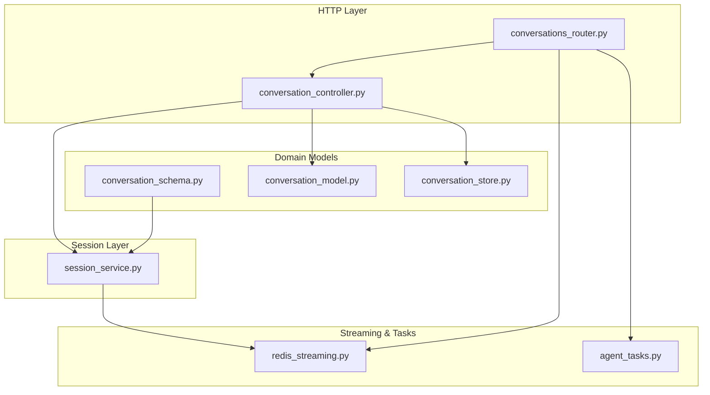
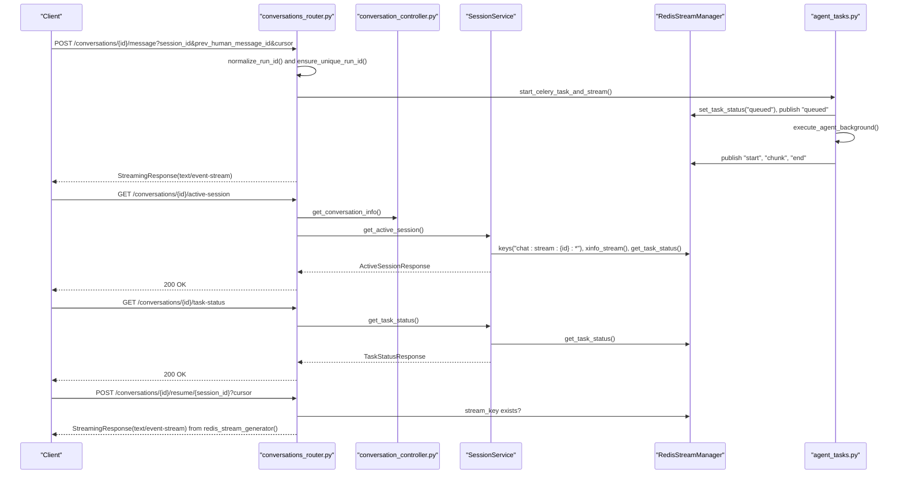
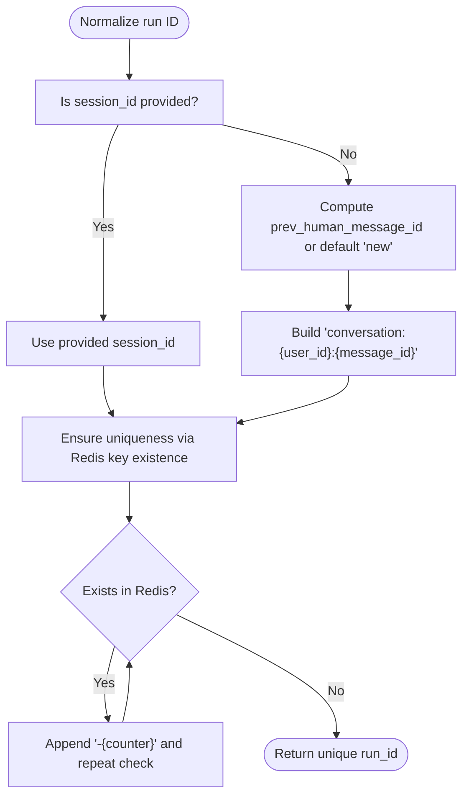
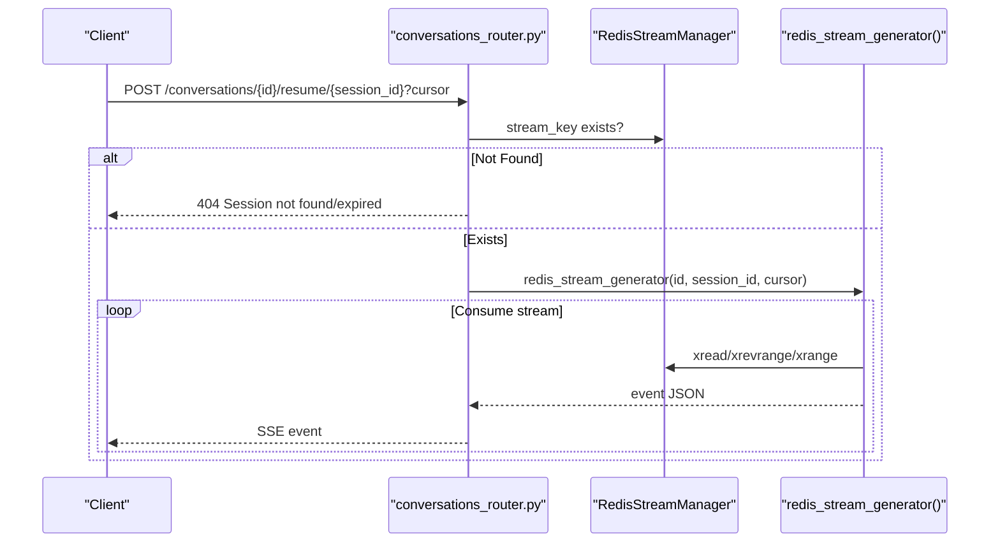
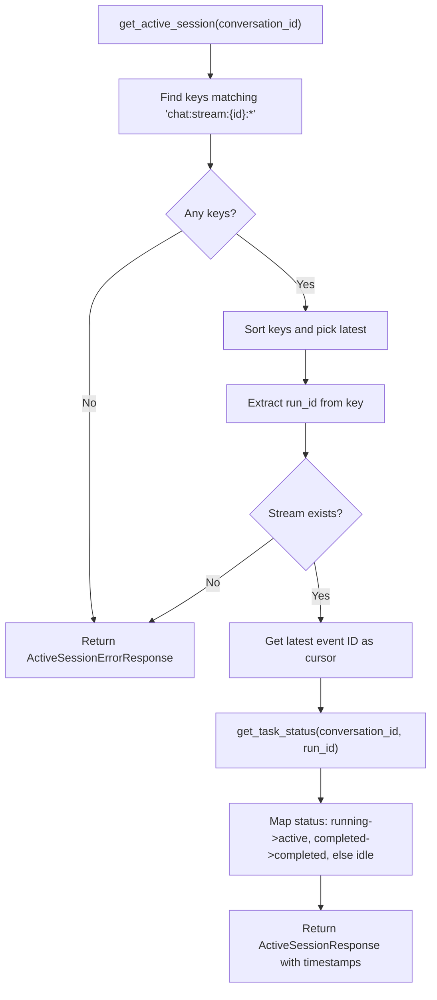
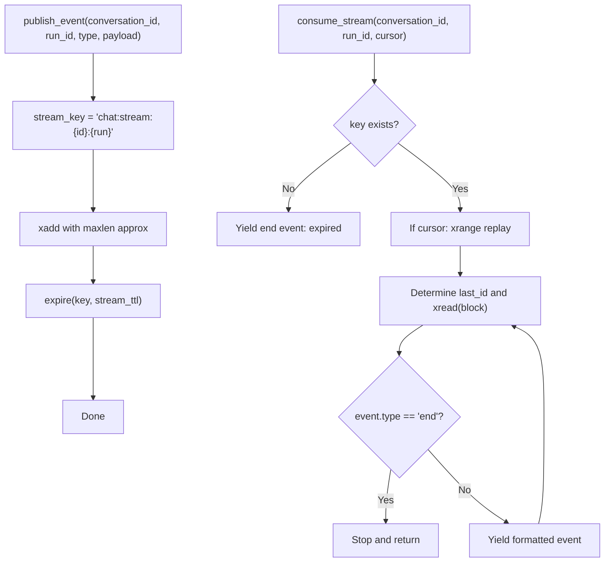
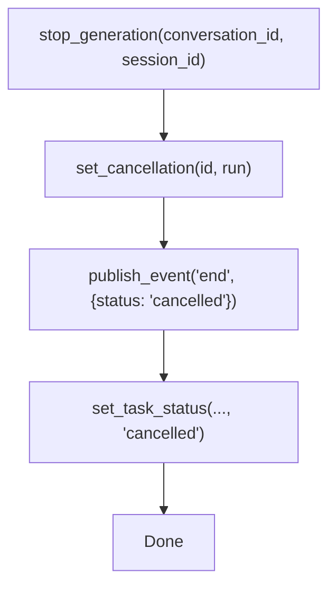
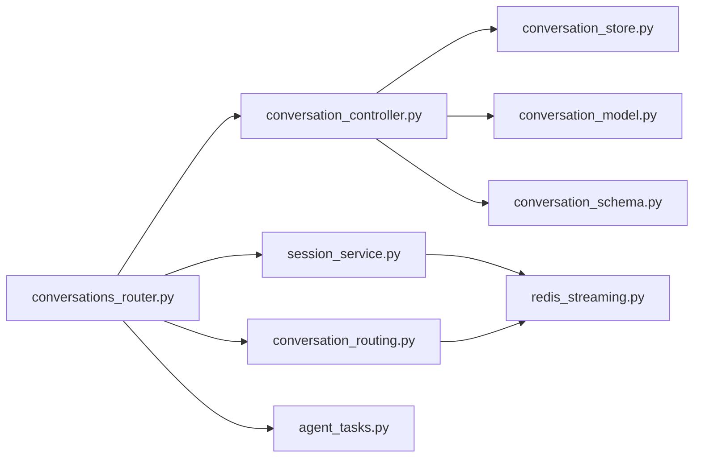

# Session Management

<cite>
**Referenced Files in This Document**
- [session_service.py](file://app/modules/conversations/session/session_service.py)
- [redis_streaming.py](file://app/modules/conversations/utils/redis_streaming.py)
- [conversations_router.py](file://app/modules/conversations/conversations_router.py)
- [conversation_routing.py](file://app/modules/conversations/utils/conversation_routing.py)
- [agent_tasks.py](file://app/celery/tasks/agent_tasks.py)
- [conversation_controller.py](file://app/modules/conversations/conversation/conversation_controller.py)
- [conversation_schema.py](file://app/modules/conversations/conversation/conversation_schema.py)
- [conversation_model.py](file://app/modules/conversations/conversation/conversation_model.py)
- [conversation_store.py](file://app/modules/conversations/conversation/conversation_store.py)
</cite>

## Table of Contents
1. [Introduction](#introduction)
2. [Project Structure](#project-structure)
3. [Core Components](#core-components)
4. [Architecture Overview](#architecture-overview)
5. [Detailed Component Analysis](#detailed-component-analysis)
6. [Dependency Analysis](#dependency-analysis)
7. [Performance Considerations](#performance-considerations)
8. [Troubleshooting Guide](#troubleshooting-guide)
9. [Conclusion](#conclusion)

## Introduction
This document explains the session management system for conversation sessions, focusing on the lifecycle and state persistence of streaming conversations. It covers how sessions are created deterministically, resumed with cursor positioning, tracked for status, and cleaned up. It also documents how the session service coordinates with Redis streaming, integrates with Celery tasks, and manages session identifiers. Concrete examples are drawn from the codebase to illustrate session creation with deterministic run IDs, session resumption with cursor positioning, session status monitoring, persistence patterns, expiration handling, and cleanup strategies.

## Project Structure
The session management system spans several modules:
- Router endpoints orchestrate session-related operations and delegate to services.
- Session service queries Redis to expose active session and task status.
- Redis streaming utilities manage event publishing, consumption, TTL, and cancellation.
- Celery tasks execute agent workflows and publish streaming events.
- Conversation controller and services coordinate access control and message persistence.

**Diagram sources**
- [conversations_router.py](file://app/modules/conversations/conversations_router.py#L45-L170)
- [conversation_controller.py](file://app/modules/conversations/conversation/conversation_controller.py#L33-L52)
- [session_service.py](file://app/modules/conversations/session/session_service.py#L15-L164)
- [redis_streaming.py](file://app/modules/conversations/utils/redis_streaming.py#L11-L248)
- [agent_tasks.py](file://app/celery/tasks/agent_tasks.py#L11-L247)
- [conversation_schema.py](file://app/modules/conversations/conversation/conversation_schema.py#L68-L93)
- [conversation_model.py](file://app/modules/conversations/conversation/conversation_model.py#L23-L60)
- [conversation_store.py](file://app/modules/conversations/conversation/conversation_store.py#L18-L119)

**Section sources**
- [conversations_router.py](file://app/modules/conversations/conversations_router.py#L45-L170)
- [session_service.py](file://app/modules/conversations/session/session_service.py#L15-L164)
- [redis_streaming.py](file://app/modules/conversations/utils/redis_streaming.py#L11-L248)
- [conversation_routing.py](file://app/modules/conversations/utils/conversation_routing.py#L23-L171)
- [agent_tasks.py](file://app/celery/tasks/agent_tasks.py#L11-L247)
- [conversation_controller.py](file://app/modules/conversations/conversation/conversation_controller.py#L33-L52)
- [conversation_schema.py](file://app/modules/conversations/conversation/conversation_schema.py#L68-L93)
- [conversation_model.py](file://app/modules/conversations/conversation/conversation_model.py#L23-L60)
- [conversation_store.py](file://app/modules/conversations/conversation/conversation_store.py#L18-L119)

## Core Components
- SessionService: Queries Redis to return active session info and task status for a conversation, including session ID, status, cursor, and timestamps.
- RedisStreamManager: Manages Redis streams for conversation sessions, including publishing events, consuming streams, TTL, cancellation, and task status keys.
- ConversationRouting utilities: Provide deterministic run ID normalization, uniqueness enforcement, and streaming generators for SSE responses.
- Celery agent tasks: Execute background generation and regeneration, publishing events to Redis streams and updating task status.
- Router endpoints: Expose session APIs (active session, task status, resume) and integrate with streaming utilities.

Key responsibilities:
- Session creation: Deterministic run ID generation and uniqueness enforcement.
- Session resumption: Cursor-based replay and live consumption.
- Status tracking: Task status via Redis keys and stream events.
- Cleanup: Publishing end events and clearing session state.

**Section sources**
- [session_service.py](file://app/modules/conversations/session/session_service.py#L15-L164)
- [redis_streaming.py](file://app/modules/conversations/utils/redis_streaming.py#L11-L248)
- [conversation_routing.py](file://app/modules/conversations/utils/conversation_routing.py#L23-L171)
- [agent_tasks.py](file://app/celery/tasks/agent_tasks.py#L11-L247)
- [conversations_router.py](file://app/modules/conversations/conversations_router.py#L460-L566)

## Architecture Overview
The session lifecycle integrates HTTP endpoints, session service, Redis streaming, and Celery tasks:

**Diagram sources**
- [conversations_router.py](file://app/modules/conversations/conversations_router.py#L160-L286)
- [conversation_routing.py](file://app/modules/conversations/utils/conversation_routing.py#L23-L171)
- [session_service.py](file://app/modules/conversations/session/session_service.py#L23-L164)
- [redis_streaming.py](file://app/modules/conversations/utils/redis_streaming.py#L21-L248)
- [agent_tasks.py](file://app/celery/tasks/agent_tasks.py#L11-L247)

## Detailed Component Analysis

### Session Creation and Deterministic Run IDs
- Deterministic run ID normalization: The run ID is derived from user scope and previous human message ID to ensure stable session identification across requests.
- Uniqueness enforcement: If a stream already exists for the computed run ID, a counter suffix is appended to ensure uniqueness.

Implementation highlights:
- Normalization function computes a deterministic run ID based on user and previous message context.
- Uniqueness function checks Redis existence and appends a counter until a free key is found.

**Diagram sources**
- [conversation_routing.py](file://app/modules/conversations/utils/conversation_routing.py#L23-L58)

**Section sources**
- [conversation_routing.py](file://app/modules/conversations/utils/conversation_routing.py#L23-L58)
- [conversations_router.py](file://app/modules/conversations/conversations_router.py#L265-L271)

### Session Resumption with Cursor Positioning
- Resume endpoint verifies access, checks stream existence, and starts streaming from a given cursor.
- Redis stream consumption supports replaying prior events and live consumption with blocking reads.

Implementation highlights:
- Resume validates session existence and returns an SSE stream starting from the provided cursor.
- Stream generator handles replay and live consumption, yielding formatted events until an end event.

**Diagram sources**
- [conversations_router.py](file://app/modules/conversations/conversations_router.py#L520-L566)
- [redis_streaming.py](file://app/modules/conversations/utils/redis_streaming.py#L64-L151)
- [conversation_routing.py](file://app/modules/conversations/utils/conversation_routing.py#L61-L105)

**Section sources**
- [conversations_router.py](file://app/modules/conversations/conversations_router.py#L520-L566)
- [redis_streaming.py](file://app/modules/conversations/utils/redis_streaming.py#L64-L151)
- [conversation_routing.py](file://app/modules/conversations/utils/conversation_routing.py#L61-L105)

### Session Status Tracking and Monitoring
- Active session retrieval: Finds the most recent active stream, extracts run ID, determines cursor from latest event, and maps task status to session status.
- Task status retrieval: Iterates active streams to find a valid task status and estimates completion time.

Implementation highlights:
- Active session maps task status to "active", "completed", or "idle".
- Task status endpoint returns whether the task is active and an estimated completion timestamp.

**Diagram sources**
- [session_service.py](file://app/modules/conversations/session/session_service.py#L23-L98)

**Section sources**
- [session_service.py](file://app/modules/conversations/session/session_service.py#L23-L164)

### Session Persistence Patterns and Expiration Handling
- Stream key naming: chat:stream:{conversation_id}:{run_id}.
- TTL and max length: Streams are capped by configured max length and refreshed with TTL on publish.
- Expiration detection: Consumers detect stream expiry and emit an end event with status "expired".

Implementation highlights:
- Publish refreshes TTL and enforces max length.
- Consumer loops check key existence and yield an end event upon expiry.

**Diagram sources**
- [redis_streaming.py](file://app/modules/conversations/utils/redis_streaming.py#L18-L62)
- [redis_streaming.py](file://app/modules/conversations/utils/redis_streaming.py#L64-L151)

**Section sources**
- [redis_streaming.py](file://app/modules/conversations/utils/redis_streaming.py#L18-L62)
- [redis_streaming.py](file://app/modules/conversations/utils/redis_streaming.py#L64-L151)

### Session Cleanup Strategies
- Controlled stop: Setting a cancellation key signals workers to abort generation and publish an "end" event with "cancelled".
- Clear session: Publishes an end event and sets task status to "cancelled" for cleanup.

Implementation highlights:
- Cancellation key is set with short TTL to signal workers.
- Clear session publishes end and updates task status.

**Diagram sources**
- [redis_streaming.py](file://app/modules/conversations/utils/redis_streaming.py#L177-L234)

**Section sources**
- [redis_streaming.py](file://app/modules/conversations/utils/redis_streaming.py#L177-L234)

### Relationship Between Sessions and Streaming Responses
- SSE streaming: Router endpoints return StreamingResponse using a generator that consumes Redis streams and yields JSON-encoded events.
- Event types: "queued", "start", "chunk", "end" are published by Celery tasks and consumed by clients.

Implementation highlights:
- Generator serializes bytes and formats events for client consumption.
- Router routes to streaming generator for both fresh and resumed sessions.

**Section sources**
- [conversation_routing.py](file://app/modules/conversations/utils/conversation_routing.py#L61-L105)
- [conversations_router.py](file://app/modules/conversations/conversations_router.py#L160-L286)

### Session Recovery Mechanisms and State Synchronization
- Recovery via resume: Clients can resume from a known cursor if the stream still exists.
- Health checks: Task status keys and queued events inform clients of task acceptance and progress.
- Cursor-based synchronization: Clients maintain a cursor to synchronize state across reconnections.

Implementation highlights:
- Resume validates existence and starts from cursor.
- Queued events and task status keys provide synchronization points.

**Section sources**
- [conversations_router.py](file://app/modules/conversations/conversations_router.py#L520-L566)
- [redis_streaming.py](file://app/modules/conversations/utils/redis_streaming.py#L194-L204)
- [conversation_routing.py](file://app/modules/conversations/utils/conversation_routing.py#L107-L171)

### Session Security, Isolation, and Resource Management
- Access control: Router endpoints verify conversation access before exposing session APIs.
- Resource isolation: Streams are namespaced per conversation and run ID; cancellation keys are scoped similarly.
- Resource management: TTL and max length cap memory usage; consumers detect expiry and stop.

Implementation highlights:
- Access verification in router endpoints.
- Scoped keys for streams and cancellation.
- TTL and max length enforcement.

**Section sources**
- [conversations_router.py](file://app/modules/conversations/conversations_router.py#L460-L566)
- [redis_streaming.py](file://app/modules/conversations/utils/redis_streaming.py#L18-L62)
- [redis_streaming.py](file://app/modules/conversations/utils/redis_streaming.py#L177-L204)

### Session Lifecycle Events, Error Handling, and Monitoring
- Lifecycle events: queued → start → chunk(s) → end (completed/error/cancelled).
- Error handling: Consumers yield structured end events with status and message; routers propagate 404 for missing sessions.
- Monitoring: Task status keys and timestamps enable frontend monitoring; logs capture task lifecycle.

Implementation highlights:
- Agent tasks publish lifecycle events and update task status.
- Router endpoints return appropriate HTTP statuses for error conditions.

**Section sources**
- [agent_tasks.py](file://app/celery/tasks/agent_tasks.py#L11-L247)
- [session_service.py](file://app/modules/conversations/session/session_service.py#L100-L164)
- [conversations_router.py](file://app/modules/conversations/conversations_router.py#L460-L566)

## Dependency Analysis
The session management system exhibits clear separation of concerns:
- Router depends on controller, session service, and streaming utilities.
- Session service depends on Redis streaming utilities.
- Celery tasks depend on Redis streaming utilities and conversation services.
- Conversation controller depends on stores and models.

**Diagram sources**
- [conversations_router.py](file://app/modules/conversations/conversations_router.py#L45-L170)
- [conversation_controller.py](file://app/modules/conversations/conversation/conversation_controller.py#L33-L52)
- [session_service.py](file://app/modules/conversations/session/session_service.py#L15-L164)
- [redis_streaming.py](file://app/modules/conversations/utils/redis_streaming.py#L11-L248)
- [conversation_routing.py](file://app/modules/conversations/utils/conversation_routing.py#L23-L171)
- [agent_tasks.py](file://app/celery/tasks/agent_tasks.py#L11-L247)
- [conversation_store.py](file://app/modules/conversations/conversation/conversation_store.py#L18-L119)
- [conversation_model.py](file://app/modules/conversations/conversation/conversation_model.py#L23-L60)
- [conversation_schema.py](file://app/modules/conversations/conversation/conversation_schema.py#L68-L93)

**Section sources**
- [conversations_router.py](file://app/modules/conversations/conversations_router.py#L45-L170)
- [session_service.py](file://app/modules/conversations/session/session_service.py#L15-L164)
- [redis_streaming.py](file://app/modules/conversations/utils/redis_streaming.py#L11-L248)
- [conversation_routing.py](file://app/modules/conversations/utils/conversation_routing.py#L23-L171)
- [agent_tasks.py](file://app/celery/tasks/agent_tasks.py#L11-L247)
- [conversation_controller.py](file://app/modules/conversations/conversation/conversation_controller.py#L33-L52)
- [conversation_store.py](file://app/modules/conversations/conversation/conversation_store.py#L18-L119)
- [conversation_model.py](file://app/modules/conversations/conversation/conversation_model.py#L23-L60)
- [conversation_schema.py](file://app/modules/conversations/conversation/conversation_schema.py#L68-L93)

## Performance Considerations
- Stream sizing: Max length and approximate trimming keep memory bounded; tune max_len and TTL for workload.
- Blocking reads: Consumers use blocking xread with timeouts to balance responsiveness and CPU usage.
- Cursor replay: Replay is efficient for small gaps; large gaps may increase latency.
- Task health checks: Queued status and TTL-based keys reduce stale state accumulation.
- Serialization overhead: JSON serialization of tool calls and payloads should be minimized; consider compact encodings if needed.

[No sources needed since this section provides general guidance]

## Troubleshooting Guide
Common issues and remedies:
- No active session found: Occurs when no matching stream keys exist or stream has expired; verify run ID and session existence.
- Stream creation timeout: Fresh requests wait for stream creation; if exceeded, an end event with timeout status is emitted.
- Stream expired: Consumers detect key absence and emit an end event with "expired"; resume only if the stream still exists.
- Task not found: Task status retrieval returns error when no valid task status is found; ensure task started and status key exists.
- Access denied: Router endpoints enforce access checks; verify user permissions for the conversation.

Operational checks:
- Confirm Redis connectivity and stream TTL/max length configuration.
- Validate run ID normalization and uniqueness logic.
- Inspect task status keys and event publishing in Celery tasks.

**Section sources**
- [session_service.py](file://app/modules/conversations/session/session_service.py#L94-L98)
- [redis_streaming.py](file://app/modules/conversations/utils/redis_streaming.py#L92-L112)
- [redis_streaming.py](file://app/modules/conversations/utils/redis_streaming.py#L113-L151)
- [conversations_router.py](file://app/modules/conversations/conversations_router.py#L472-L488)

## Conclusion
The session management system provides robust lifecycle control for conversation sessions using Redis streams and Celery tasks. It supports deterministic run ID creation, cursor-based resumption, accurate status tracking, and safe cleanup. The design balances performance with reliability through TTL and max length controls, structured event lifecycles, and clear separation between HTTP orchestration, session service, and streaming utilities.