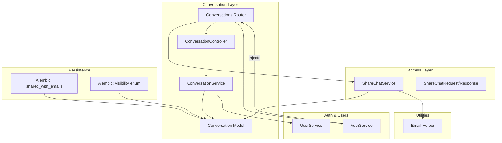
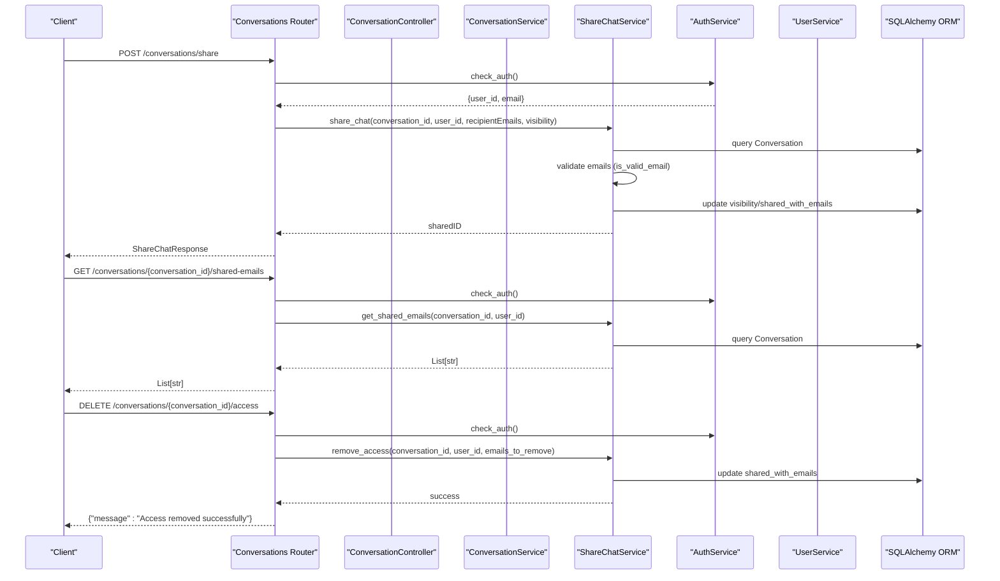
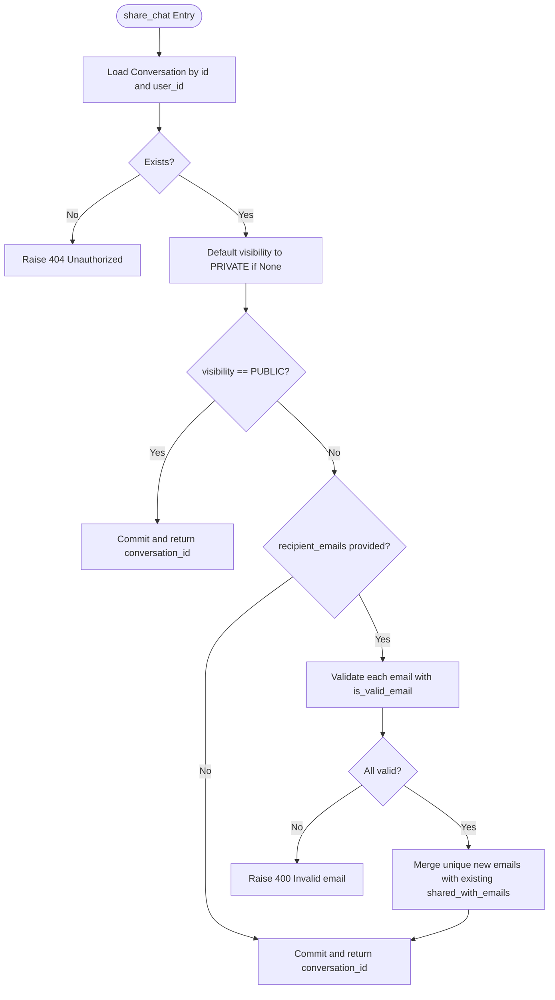
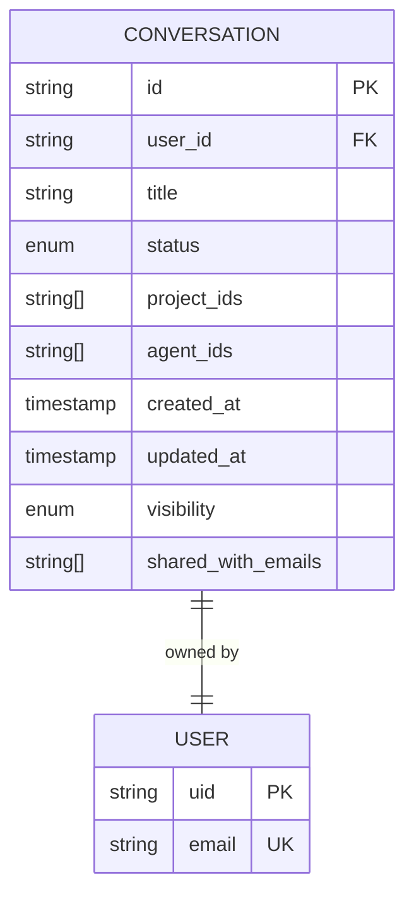
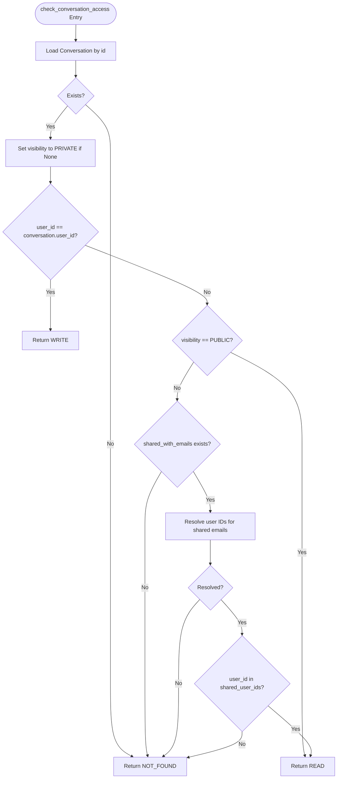
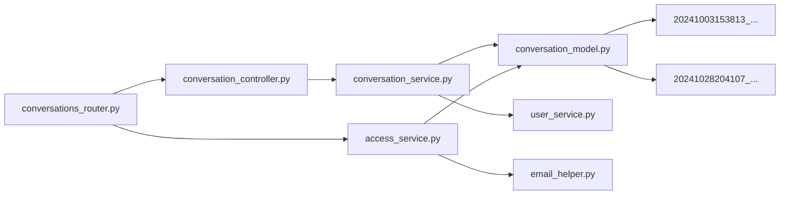

# Sharing & Access Control

<cite>
**Referenced Files in This Document**
- [access_service.py](file://app/modules/conversations/access/access_service.py)
- [access_schema.py](file://app/modules/conversations/access/access_schema.py)
- [conversation_model.py](file://app/modules/conversations/conversation/conversation_model.py)
- [conversation_schema.py](file://app/modules/conversations/conversation/conversation_schema.py)
- [conversation_service.py](file://app/modules/conversations/conversation/conversation_service.py)
- [conversations_router.py](file://app/modules/conversations/conversations_router.py)
- [conversation_controller.py](file://app/modules/conversations/conversation/conversation_controller.py)
- [email_helper.py](file://app/modules/utils/email_helper.py)
- [auth_service.py](file://app/modules/auth/auth_service.py)
- [user_service.py](file://app/modules/users/user_service.py)
- [20241003153813_827623103002_add_shared_with_email_to_the_.py](file://app/alembic/versions/20241003153813_827623103002_add_shared_with_email_to_the_.py)
- [20241028204107_684a330f9e9f_new_migration.py](file://app/alembic/versions/20241028204107_684a330f9e9f_new_migration.py)
</cite>

## Table of Contents
1. [Introduction](#introduction)
2. [Project Structure](#project-structure)
3. [Core Components](#core-components)
4. [Architecture Overview](#architecture-overview)
5. [Detailed Component Analysis](#detailed-component-analysis)
6. [Dependency Analysis](#dependency-analysis)
7. [Performance Considerations](#performance-considerations)
8. [Troubleshooting Guide](#troubleshooting-guide)
9. [Conclusion](#conclusion)
10. [Appendices](#appendices)

## Introduction
This document explains the sharing and access control system for conversations. It covers how conversations are shared via email invitations, how access permissions are enforced, and how collaborative access patterns are managed. It documents the access service’s responsibilities, the access schema definitions, validation rules, and the integration with authentication and user services. It also outlines workflows for sharing with email invitations, removing access, and retrieving shared conversation details, along with security considerations, access revocation, and collaborative state management.

## Project Structure
The sharing and access control system spans several modules:
- Access service and schemas define sharing operations and request/response contracts.
- Conversation model and service implement visibility and access checks.
- Router and controller orchestrate API endpoints and enforce authorization.
- Authentication service validates identities and injects user context.
- User service resolves email-based user identities for shared access.
- Email helper provides email validation utilities used during sharing.
- Alembic migrations define persistence for visibility and shared-with-emails.

**Diagram sources**
- [access_service.py](file://app/modules/conversations/access/access_service.py#L18-L133)
- [access_schema.py](file://app/modules/conversations/access/access_schema.py#L8-L25)
- [conversation_model.py](file://app/modules/conversations/conversation/conversation_model.py#L23-L60)
- [conversation_service.py](file://app/modules/conversations/conversation/conversation_service.py#L166-L214)
- [conversation_controller.py](file://app/modules/conversations/conversation/conversation_controller.py#L33-L51)
- [conversations_router.py](file://app/modules/conversations/conversations_router.py#L569-L621)
- [auth_service.py](file://app/modules/auth/auth_service.py#L48-L104)
- [user_service.py](file://app/modules/users/user_service.py#L19-L175)
- [email_helper.py](file://app/modules/utils/email_helper.py#L81-L84)
- [20241003153813_827623103002_add_shared_with_email_to_the_.py](file://app/alembic/versions/20241003153813_827623103002_add_shared_with_email_to_the_.py#L21-L27)
- [20241028204107_684a330f9e9f_new_migration.py](file://app/alembic/versions/20241028204107_684a330f9e9f_new_migration.py#L21-L29)

**Section sources**
- [access_service.py](file://app/modules/conversations/access/access_service.py#L18-L133)
- [access_schema.py](file://app/modules/conversations/access/access_schema.py#L8-L25)
- [conversation_model.py](file://app/modules/conversations/conversation/conversation_model.py#L23-L60)
- [conversation_service.py](file://app/modules/conversations/conversation/conversation_service.py#L166-L214)
- [conversation_controller.py](file://app/modules/conversations/conversation/conversation_controller.py#L33-L51)
- [conversations_router.py](file://app/modules/conversations/conversations_router.py#L569-L621)
- [auth_service.py](file://app/modules/auth/auth_service.py#L48-L104)
- [user_service.py](file://app/modules/users/user_service.py#L121-L166)
- [email_helper.py](file://app/modules/utils/email_helper.py#L81-L84)
- [20241003153813_827623103002_add_shared_with_email_to_the_.py](file://app/alembic/versions/20241003153813_827623103002_add_shared_with_email_to_the_.py#L21-L27)
- [20241028204107_684a330f9e9f_new_migration.py](file://app/alembic/versions/20241028204107_684a330f9e9f_new_migration.py#L21-L29)

## Core Components
- ShareChatService: Implements sharing operations, including setting visibility, validating emails, adding/removing shared recipients, and handling database errors.
- Access Schemas: Define request/response contracts for sharing and access removal.
- Conversation Model: Persists visibility and shared_with_emails arrays.
- ConversationService: Enforces access control by evaluating ownership, public visibility, and shared email membership.
- Conversations Router: Exposes endpoints for sharing, retrieving shared emails, and removing access.
- Authentication Service: Injects user context (user_id, email) into requests.
- User Service: Resolves user IDs from shared emails to enforce access.
- Email Helper: Provides email validation used during sharing.

Key responsibilities:
- Authorization: Only the conversation creator can share; shared users gain read-only access.
- Validation: Recipient emails are validated before updates.
- Persistence: Visibility and shared recipients are stored in the conversation record.
- Orchestration: Router delegates to service and controller layers.

**Section sources**
- [access_service.py](file://app/modules/conversations/access/access_service.py#L18-L133)
- [access_schema.py](file://app/modules/conversations/access/access_schema.py#L8-L25)
- [conversation_model.py](file://app/modules/conversations/conversation/conversation_model.py#L46-L47)
- [conversation_service.py](file://app/modules/conversations/conversation/conversation_service.py#L166-L214)
- [conversations_router.py](file://app/modules/conversations/conversations_router.py#L569-L621)
- [auth_service.py](file://app/modules/auth/auth_service.py#L48-L104)
- [user_service.py](file://app/modules/users/user_service.py#L153-L166)
- [email_helper.py](file://app/modules/utils/email_helper.py#L81-L84)

## Architecture Overview
The sharing and access control architecture follows a layered design:
- API Layer: FastAPI router exposes endpoints for sharing, retrieving shared emails, and removing access.
- Controller Layer: ConversationController coordinates with ConversationService for access checks and data retrieval.
- Service Layer: ConversationService enforces access rules; ShareChatService manages sharing mutations.
- Persistence Layer: SQLAlchemy models store visibility and shared recipients; Alembic migrations evolve schema.
- Identity Layer: AuthService authenticates requests and injects user context; UserService maps emails to user IDs.

**Diagram sources**
- [conversations_router.py](file://app/modules/conversations/conversations_router.py#L569-L621)
- [conversation_controller.py](file://app/modules/conversations/conversation/conversation_controller.py#L33-L51)
- [conversation_service.py](file://app/modules/conversations/conversation/conversation_service.py#L166-L214)
- [access_service.py](file://app/modules/conversations/access/access_service.py#L22-L133)
- [auth_service.py](file://app/modules/auth/auth_service.py#L48-L104)
- [user_service.py](file://app/modules/users/user_service.py#L153-L166)

## Detailed Component Analysis

### Access Service: ShareChatService
Responsibilities:
- Validate requester ownership of the conversation.
- Set visibility to PUBLIC or PRIVATE.
- For PRIVATE visibility, validate recipient emails and append unique emails to shared_with_emails.
- Retrieve shared emails for a conversation.
- Remove access for specified emails and enforce that at least one target has access.

Validation and error handling:
- Raises HTTPException for unauthorized access.
- Raises ShareChatServiceError for database integrity errors and other failures.
- Uses email_helper.is_valid_email for validation.

Operational flow for sharing:
- Load conversation by id and user_id.
- Default visibility to PRIVATE if unspecified.
- If PUBLIC, commit immediately.
- If PRIVATE, validate all emails, deduplicate with existing shared emails, and commit.

Removal flow:
- Load conversation by id and user_id.
- Ensure shared_with_emails exists.
- Verify intersection with requested removal emails.
- Update shared_with_emails by subtracting removal set and commit.

**Diagram sources**
- [access_service.py](file://app/modules/conversations/access/access_service.py#L22-L79)
- [email_helper.py](file://app/modules/utils/email_helper.py#L81-L84)

**Section sources**
- [access_service.py](file://app/modules/conversations/access/access_service.py#L18-L133)
- [email_helper.py](file://app/modules/utils/email_helper.py#L81-L84)

### Access Schema Definitions
- ShareChatRequest: Includes conversation_id, optional recipientEmails list, and visibility.
- ShareChatResponse: Returns a message and sharedID.
- SharedChatResponse: Wraps a chat dictionary payload.
- RemoveAccessRequest: Contains a list of emails to remove.

These schemas define the contract for sharing and access removal operations.

**Section sources**
- [access_schema.py](file://app/modules/conversations/access/access_schema.py#L8-L25)

### Conversation Model and Persistence
- Visibility enum: PRIVATE and PUBLIC.
- shared_with_emails: Array of strings storing invited email addresses.
- Alembic migrations:
  - Add shared_with_emails column.
  - Add visibility enum type and column.

**Diagram sources**
- [conversation_model.py](file://app/modules/conversations/conversation/conversation_model.py#L23-L60)
- [20241003153813_827623103002_add_shared_with_email_to_the_.py](file://app/alembic/versions/20241003153813_827623103002_add_shared_with_email_to_the_.py#L21-L27)
- [20241028204107_684a330f9e9f_new_migration.py](file://app/alembic/versions/20241028204107_684a330f9e9f_new_migration.py#L21-L29)

**Section sources**
- [conversation_model.py](file://app/modules/conversations/conversation/conversation_model.py#L18-L60)
- [20241003153813_827623103002_add_shared_with_email_to_the_.py](file://app/alembic/versions/20241003153813_827623103002_add_shared_with_email_to_the_.py#L21-L27)
- [20241028204107_684a330f9e9f_new_migration.py](file://app/alembic/versions/20241028204107_684a330f9e9f_new_migration.py#L21-L29)

### Access Control Logic in ConversationService
Access evaluation rules:
- If visibility is not set, default to PRIVATE.
- If user_id equals conversation.user_id, grant WRITE access.
- If visibility is PUBLIC, grant READ access.
- If visibility is PRIVATE and shared_with_emails exists, resolve user IDs for shared emails; if current user_id is present, grant READ access; otherwise NOT_FOUND.

**Diagram sources**
- [conversation_service.py](file://app/modules/conversations/conversation/conversation_service.py#L166-L214)
- [user_service.py](file://app/modules/users/user_service.py#L153-L166)

**Section sources**
- [conversation_service.py](file://app/modules/conversations/conversation/conversation_service.py#L166-L214)
- [user_service.py](file://app/modules/users/user_service.py#L153-L166)

### Router Endpoints and Workflows
Endpoints:
- POST /conversations/share: Shares a conversation by setting visibility and/or appending shared emails.
- GET /conversations/{conversation_id}/shared-emails: Retrieves shared emails for a conversation.
- DELETE /conversations/{conversation_id}/access: Removes access for specified emails.

Workflow orchestration:
- Router depends on AuthService.check_auth to inject user context.
- Router delegates to ShareChatService for sharing operations.
- Router delegates to ConversationController for info and messages endpoints that rely on access checks.

Concrete examples from codebase:
- Sharing with email invitations: POST /conversations/share with ShareChatRequest containing conversation_id, recipientEmails, and visibility.
- Access removal: DELETE /conversations/{conversation_id}/access with RemoveAccessRequest containing emails.
- Shared conversation retrieval: GET /conversations/{conversation_id}/shared-emails returns List[str].

**Section sources**
- [conversations_router.py](file://app/modules/conversations/conversations_router.py#L569-L621)
- [access_schema.py](file://app/modules/conversations/access/access_schema.py#L8-L25)
- [conversation_controller.py](file://app/modules/conversations/conversation/conversation_controller.py#L76-L99)

### Authentication Integration
- AuthService.check_auth verifies Firebase tokens and injects user_id and email into request state.
- Router endpoints depend on AuthService.check_auth to authorize operations.
- Logging middleware attaches request_id and user_id for observability.

**Section sources**
- [auth_service.py](file://app/modules/auth/auth_service.py#L48-L104)
- [conversations_router.py](file://app/modules/conversations/conversations_router.py#L569-L621)

### Collaborative Access Patterns and Permission Inheritance
- Ownership: Creator has WRITE access regardless of visibility.
- Public visibility: All users with access to the conversation have READ access.
- Shared emails: Only users whose email resolves to a stored user ID in shared_with_emails gain READ access.
- Permission inheritance: WRITE overrides READ; PUBLIC overrides PRIVATE for access determination.

**Section sources**
- [conversation_service.py](file://app/modules/conversations/conversation/conversation_service.py#L166-L214)
- [user_service.py](file://app/modules/users/user_service.py#L153-L166)

### Security Considerations
- Email validation: Recipient emails are validated before being added to shared_with_emails.
- Authorization: Only the conversation creator can initiate sharing; access removal requires ownership.
- Integrity: Database errors are caught and surfaced as ShareChatServiceError; transactions are rolled back on failure.
- Audit and tracing: Router and middleware attach request_id and user_id for logging and debugging.

**Section sources**
- [access_service.py](file://app/modules/conversations/access/access_service.py#L53-L57)
- [access_service.py](file://app/modules/conversations/access/access_service.py#L71-L78)
- [auth_service.py](file://app/modules/auth/auth_service.py#L48-L104)

## Dependency Analysis
The sharing and access control system exhibits clear separation of concerns:
- Router depends on AuthService for authentication and ShareChatService for sharing operations.
- Controller depends on ConversationService for access checks and data retrieval.
- ConversationService depends on Conversation model and UserService for email-to-user resolution.
- ShareChatService depends on Conversation model and email_helper for validation.
- Persistence migrations define the schema for visibility and shared_with_emails.

**Diagram sources**
- [conversations_router.py](file://app/modules/conversations/conversations_router.py#L569-L621)
- [access_service.py](file://app/modules/conversations/access/access_service.py#L18-L133)
- [conversation_controller.py](file://app/modules/conversations/conversation/conversation_controller.py#L33-L51)
- [conversation_service.py](file://app/modules/conversations/conversation/conversation_service.py#L166-L214)
- [conversation_model.py](file://app/modules/conversations/conversation/conversation_model.py#L23-L60)
- [user_service.py](file://app/modules/users/user_service.py#L153-L166)
- [email_helper.py](file://app/modules/utils/email_helper.py#L81-L84)
- [20241003153813_827623103002_add_shared_with_email_to_the_.py](file://app/alembic/versions/20241003153813_827623103002_add_shared_with_email_to_the_.py#L21-L27)
- [20241028204107_684a330f9e9f_new_migration.py](file://app/alembic/versions/20241028204107_684a330f9e9f_new_migration.py#L21-L29)

**Section sources**
- [conversations_router.py](file://app/modules/conversations/conversations_router.py#L569-L621)
- [access_service.py](file://app/modules/conversations/access/access_service.py#L18-L133)
- [conversation_controller.py](file://app/modules/conversations/conversation/conversation_controller.py#L33-L51)
- [conversation_service.py](file://app/modules/conversations/conversation/conversation_service.py#L166-L214)
- [conversation_model.py](file://app/modules/conversations/conversation/conversation_model.py#L23-L60)
- [user_service.py](file://app/modules/users/user_service.py#L153-L166)
- [email_helper.py](file://app/modules/utils/email_helper.py#L81-L84)
- [20241003153813_827623103002_add_shared_with_email_to_the_.py](file://app/alembic/versions/20241003153813_827623103002_add_shared_with_email_to_the_.py#L21-L27)
- [20241028204107_684a330f9e9f_new_migration.py](file://app/alembic/versions/20241028204107_684a330f9e9f_new_migration.py#L21-L29)

## Performance Considerations
- Email validation: Validation occurs per recipient; batch validations are O(n) with regex checks.
- Shared user resolution: UserService.get_user_ids_by_emails performs a single query for all shared emails.
- Database writes: Updates to shared_with_emails and visibility are committed atomically within transactions.
- Recommendations:
  - Limit the number of recipients per operation to reduce validation overhead.
  - Consider batching and deduplication at the caller level to minimize repeated validations.
  - Monitor query performance for large shared_with_emails arrays; consider indexing if needed.

[No sources needed since this section provides general guidance]

## Troubleshooting Guide
Common issues and resolutions:
- Unauthorized access: Ensure the requester is the conversation owner; otherwise, HTTPException is raised.
- Invalid email addresses: Validation fails if any email is malformed; fix the email format or remove invalid entries.
- No shared access to remove: If none of the requested emails are present, a ShareChatServiceError is raised.
- Database integrity errors: On IntegrityError, the transaction is rolled back and a ShareChatServiceError is raised.
- Access denied: ConversationService returns NOT_FOUND for non-existent conversations or insufficient access; callers should handle 401/403 accordingly.

**Section sources**
- [access_service.py](file://app/modules/conversations/access/access_service.py#L35-L37)
- [access_service.py](file://app/modules/conversations/access/access_service.py#L55-L57)
- [access_service.py](file://app/modules/conversations/access/access_service.py#L108-L118)
- [access_service.py](file://app/modules/conversations/access/access_service.py#L71-L78)
- [conversation_service.py](file://app/modules/conversations/conversation/conversation_service.py#L182-L186)

## Conclusion
The sharing and access control system provides a clear, extensible foundation for collaborative conversation management. It enforces strict ownership semantics, supports PUBLIC and PRIVATE visibility modes, and enables fine-grained access via email-based sharing. The design integrates authentication, user resolution, and persistence cleanly, with robust validation and error handling. Developers can extend the system by adding richer sharing policies, notifications, and audit trails while maintaining the current separation of concerns.

[No sources needed since this section summarizes without analyzing specific files]

## Appendices

### API Endpoints Summary
- POST /conversations/share
  - Purpose: Share a conversation by setting visibility and/or adding recipients.
  - Request: ShareChatRequest
  - Response: ShareChatResponse
- GET /conversations/{conversation_id}/shared-emails
  - Purpose: Retrieve shared emails for a conversation.
  - Response: List[str]
- DELETE /conversations/{conversation_id}/access
  - Purpose: Remove access for specified emails.
  - Request: RemoveAccessRequest
  - Response: {"message": "Access removed successfully"}

**Section sources**
- [conversations_router.py](file://app/modules/conversations/conversations_router.py#L569-L621)
- [access_schema.py](file://app/modules/conversations/access/access_schema.py#L8-L25)