# Component Relationships

<cite>
**Referenced Files in This Document**
- [app/main.py](file://app/main.py)
- [app/api/router.py](file://app/api/router.py)
- [app/modules/conversations/conversations_router.py](file://app/modules/conversations/conversations_router.py)
- [app/modules/conversations/conversation/conversation_controller.py](file://app/modules/conversations/conversation/conversation_controller.py)
- [app/modules/conversations/utils/conversation_routing.py](file://app/modules/conversations/utils/conversation_routing.py)
- [app/modules/parsing/graph_construction/parsing_controller.py](file://app/modules/parsing/graph_construction/parsing_controller.py)
- [app/modules/intelligence/agents/agents_controller.py](file://app/modules/intelligence/agents/agents_controller.py)
- [app/modules/users/user_service.py](file://app/modules/users/user_service.py)
- [app/core/database.py](file://app/core/database.py)
- [app/modules/utils/firebase_setup.py](file://app/modules/utils/firebase_setup.py)
- [app/celery/celery_app.py](file://app/celery/celery_app.py)
</cite>

## Table of Contents
1. [Introduction](#introduction)
2. [Project Structure](#project-structure)
3. [Core Components](#core-components)
4. [Architecture Overview](#architecture-overview)
5. [Detailed Component Analysis](#detailed-component-analysis)
6. [Dependency Analysis](#dependency-analysis)
7. [Performance Considerations](#performance-considerations)
8. [Troubleshooting Guide](#troubleshooting-guide)
9. [Conclusion](#conclusion)

## Introduction
This document explains how Potpie’s major system components interact and communicate. It focuses on:
- The MainApp class and its role in assembling the FastAPI application, middleware, routers, and startup initialization.
- How individual module routers relate to the centralized router system.
- Dependency injection patterns for services and database sessions via FastAPI Depends and SessionLocal.
- Inter-module communication patterns, especially between the API layer, controllers, services, and background tasks.
- Authentication integration with user management, intelligence engine coordination with parsing services, and streaming orchestration with background task processing.
- Middleware roles in request processing and integration points with Firebase and Sentry.

## Project Structure
Potpie follows a layered FastAPI architecture:
- Application bootstrap and assembly in MainApp.
- Centralized API router (app/api/router.py) for v2 endpoints.
- Feature-based routers under app/modules/* for v1 endpoints.
- Controllers mediating between routers and services.
- Services encapsulating business logic and interacting with stores and external systems.
- Celery worker orchestrating long-running tasks and streaming responses.
- Shared utilities for session/streaming and database session factories.

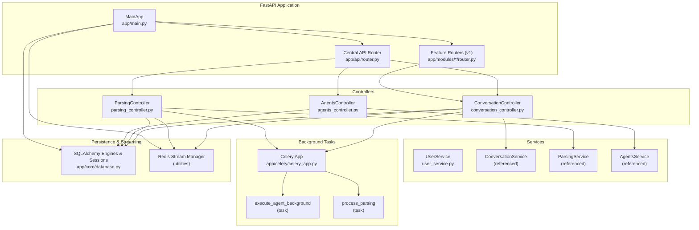

**Diagram sources**
- [app/main.py](file://app/main.py#L46-L211)
- [app/api/router.py](file://app/api/router.py#L48-L318)
- [app/modules/conversations/conversations_router.py](file://app/modules/conversations/conversations_router.py#L41-L622)
- [app/modules/conversations/conversation/conversation_controller.py](file://app/modules/conversations/conversation/conversation_controller.py#L33-L224)
- [app/modules/parsing/graph_construction/parsing_controller.py](file://app/modules/parsing/graph_construction/parsing_controller.py#L39-L384)
- [app/modules/intelligence/agents/agents_controller.py](file://app/modules/intelligence/agents/agents_controller.py#L13-L35)
- [app/core/database.py](file://app/core/database.py#L1-L117)
- [app/celery/celery_app.py](file://app/celery/celery_app.py#L1-L473)

**Section sources**
- [app/main.py](file://app/main.py#L46-L211)
- [app/api/router.py](file://app/api/router.py#L48-L318)

## Core Components
- MainApp: Initializes environment, Sentry, Phoenix tracing, CORS, logging middleware, registers routers, sets up database and seed data, and exposes the FastAPI app.
- Central API Router (v2): Provides unified endpoints for conversations, parsing, agents, search, integrations, and project operations, with API key-based authentication and usage checks.
- Feature Routers (v1): Legacy endpoints grouped by domain (e.g., conversations, media, usage).
- Controllers: Thin orchestration layers that validate inputs, enforce usage limits, and delegate to services.
- Services: Business logic providers (e.g., UserService, ConversationService, ParsingService, AgentsService).
- Database Session Management: SessionLocal for sync ORM, AsyncSessionLocal for async ORM, plus a special factory for Celery tasks.
- Celery Worker: Routes tasks to queues, configures tracing/logging, and executes background work.
- Streaming Utilities: Shared helpers for run/session IDs, Redis-backed streaming, and task orchestration.

**Section sources**
- [app/main.py](file://app/main.py#L46-L211)
- [app/api/router.py](file://app/api/router.py#L56-L318)
- [app/modules/conversations/conversations_router.py](file://app/modules/conversations/conversations_router.py#L41-L622)
- [app/modules/conversations/conversation/conversation_controller.py](file://app/modules/conversations/conversation/conversation_controller.py#L33-L224)
- [app/modules/parsing/graph_construction/parsing_controller.py](file://app/modules/parsing/graph_construction/parsing_controller.py#L39-L384)
- [app/modules/intelligence/agents/agents_controller.py](file://app/modules/intelligence/agents/agents_controller.py#L13-L35)
- [app/core/database.py](file://app/core/database.py#L1-L117)
- [app/celery/celery_app.py](file://app/celery/celery_app.py#L1-L473)

## Architecture Overview
The system is a FastAPI application with:
- A centralized router for v2 endpoints and modular routers for v1.
- Controllers depending on services and database sessions.
- Background tasks executed by Celery with Redis-backed streaming.
- Authentication integrated via API keys and Firebase for user identity.
- Observability via Sentry and Phoenix tracing.

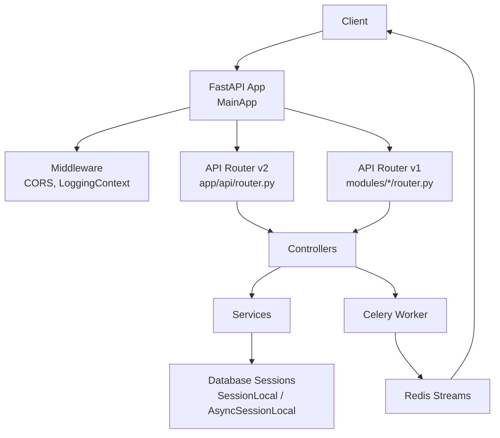

**Diagram sources**
- [app/main.py](file://app/main.py#L101-L129)
- [app/api/router.py](file://app/api/router.py#L48-L318)
- [app/modules/conversations/conversations_router.py](file://app/modules/conversations/conversations_router.py#L41-L622)
- [app/core/database.py](file://app/core/database.py#L1-L117)
- [app/celery/celery_app.py](file://app/celery/celery_app.py#L1-L473)

## Detailed Component Analysis

### MainApp and Router Assembly
- MainApp configures Sentry and Phoenix tracing, CORS, logging middleware, and includes all v1 and v2 routers under /api/v1 and /api/v2 prefixes.
- Startup initializes database tables, seeds data (Firebase in production or dummy user in development), and system prompts.

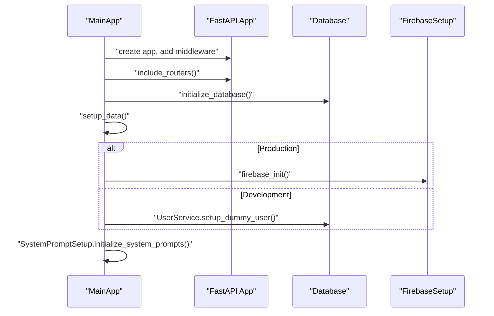

**Diagram sources**
- [app/main.py](file://app/main.py#L46-L211)
- [app/modules/utils/firebase_setup.py](file://app/modules/utils/firebase_setup.py#L12-L53)
- [app/core/database.py](file://app/core/database.py#L143-L146)
- [app/modules/users/user_service.py](file://app/modules/users/user_service.py#L91-L113)

**Section sources**
- [app/main.py](file://app/main.py#L46-L211)

### Central API Router (v2) and Controllers
- The v2 router defines endpoints for conversations, parsing, agents, search, and integrations.
- Authentication is enforced via a dependency that validates API keys and optionally admin secrets, returning user context.
- Controllers coordinate usage checks, session/streaming, and task orchestration.

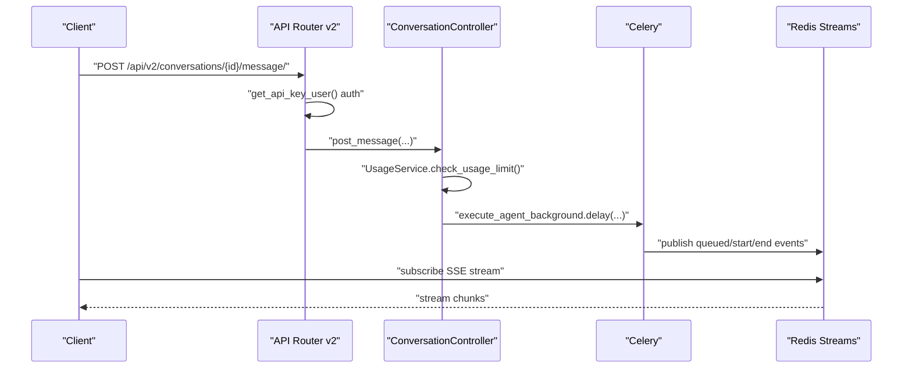

**Diagram sources**
- [app/api/router.py](file://app/api/router.py#L150-L218)
- [app/modules/conversations/conversation/conversation_controller.py](file://app/modules/conversations/conversation/conversation_controller.py#L106-L138)
- [app/modules/conversations/utils/conversation_routing.py](file://app/modules/conversations/utils/conversation_routing.py#L107-L171)

**Section sources**
- [app/api/router.py](file://app/api/router.py#L56-L318)
- [app/modules/conversations/conversation/conversation_controller.py](file://app/modules/conversations/conversation/conversation_controller.py#L33-L224)
- [app/modules/conversations/utils/conversation_routing.py](file://app/modules/conversations/utils/conversation_routing.py#L23-L324)

### Conversations Module: Controllers, Services, and Streaming
- The conversations router delegates to ConversationController, which composes ConversationService with ConversationStore and MessageStore.
- For streaming, it normalizes run/session IDs, starts Celery tasks, publishes queued events, and streams results via Redis.

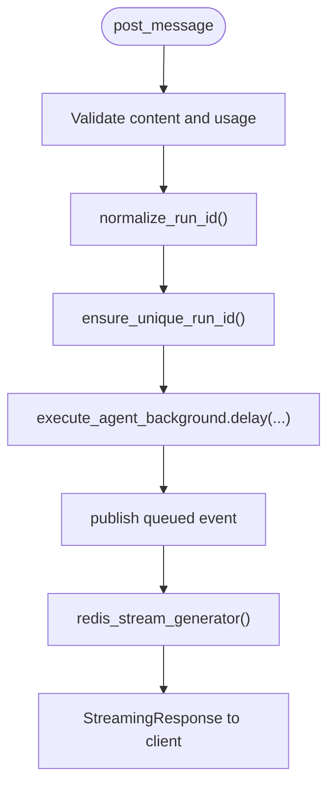

**Diagram sources**
- [app/modules/conversations/conversations_router.py](file://app/modules/conversations/conversations_router.py#L160-L287)
- [app/modules/conversations/utils/conversation_routing.py](file://app/modules/conversations/utils/conversation_routing.py#L23-L171)

**Section sources**
- [app/modules/conversations/conversations_router.py](file://app/modules/conversations/conversations_router.py#L41-L622)
- [app/modules/conversations/conversation/conversation_controller.py](file://app/modules/conversations/conversation/conversation_controller.py#L33-L224)
- [app/modules/conversations/utils/conversation_routing.py](file://app/modules/conversations/utils/conversation_routing.py#L23-L324)

### Parsing Module: Orchestration and Background Tasks
- ParsingController coordinates project registration, duplication for demos, and dispatches Celery tasks to process repositories.
- It updates statuses and sends analytics events.

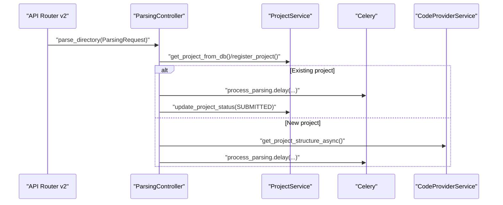

**Diagram sources**
- [app/api/router.py](file://app/api/router.py#L123-L148)
- [app/modules/parsing/graph_construction/parsing_controller.py](file://app/modules/parsing/graph_construction/parsing_controller.py#L40-L304)

**Section sources**
- [app/modules/parsing/graph_construction/parsing_controller.py](file://app/modules/parsing/graph_construction/parsing_controller.py#L39-L384)

### Intelligence Agents: Composition and Discovery
- AgentsController composes Providers, Prompts, and Tools to list available agents for a user.

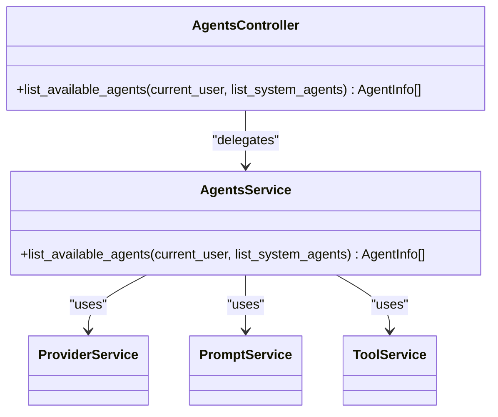

**Diagram sources**
- [app/modules/intelligence/agents/agents_controller.py](file://app/modules/intelligence/agents/agents_controller.py#L13-L35)

**Section sources**
- [app/modules/intelligence/agents/agents_controller.py](file://app/modules/intelligence/agents/agents_controller.py#L13-L35)

### Authentication and User Management
- API key authentication is enforced in the v2 router; it resolves user context via APIKeyService or UserService for admin secret flows.
- In development mode, a dummy user is provisioned; in production, Firebase is initialized for user identity.

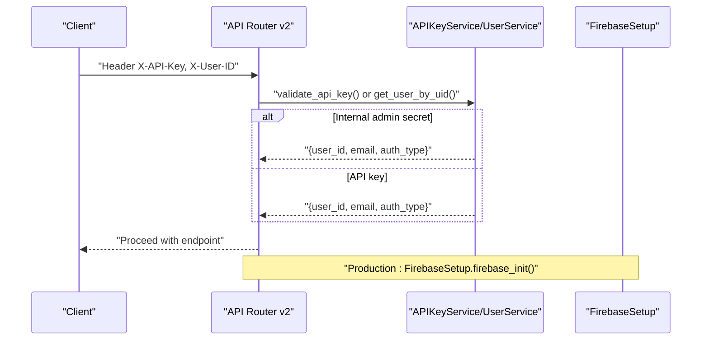

**Diagram sources**
- [app/api/router.py](file://app/api/router.py#L56-L88)
- [app/modules/users/user_service.py](file://app/modules/users/user_service.py#L91-L113)
- [app/modules/utils/firebase_setup.py](file://app/modules/utils/firebase_setup.py#L12-L53)

**Section sources**
- [app/api/router.py](file://app/api/router.py#L56-L88)
- [app/modules/users/user_service.py](file://app/modules/users/user_service.py#L91-L113)
- [app/modules/utils/firebase_setup.py](file://app/modules/utils/firebase_setup.py#L12-L53)

### Database Session Management and Dependency Injection
- SessionLocal provides synchronous ORM sessions; AsyncSessionLocal provides asynchronous sessions.
- get_db and get_async_db are FastAPI Depends that supply sessions to endpoints.
- Celery workers use a dedicated factory to avoid cross-task Future binding issues.

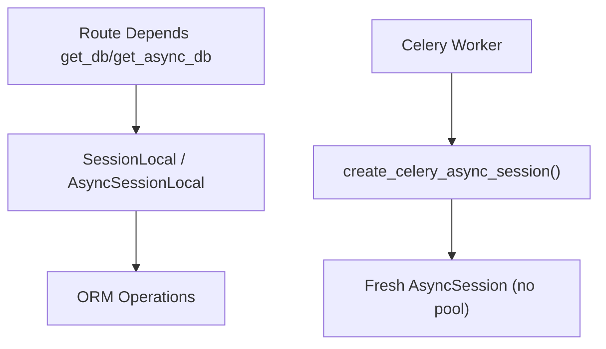

**Diagram sources**
- [app/core/database.py](file://app/core/database.py#L100-L117)

**Section sources**
- [app/core/database.py](file://app/core/database.py#L1-L117)

### Streaming System and Background Task Coordination
- Redis-backed streaming uses a shared manager to publish queued/start/end events and stream chunks to clients.
- Controllers normalize run/session IDs and ensure uniqueness to avoid collisions.
- Celery tasks publish events and close streams; clients can resume sessions via cursors.

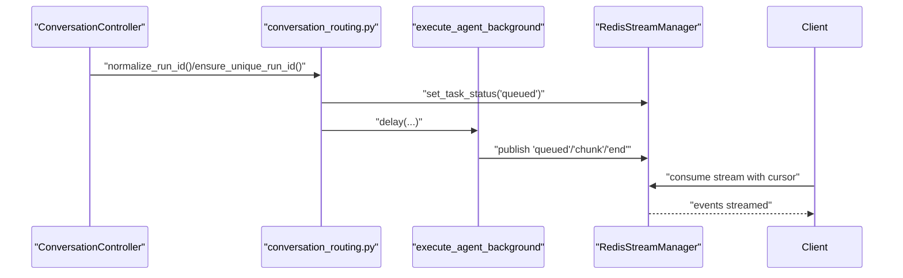

**Diagram sources**
- [app/modules/conversations/utils/conversation_routing.py](file://app/modules/conversations/utils/conversation_routing.py#L23-L171)

**Section sources**
- [app/modules/conversations/utils/conversation_routing.py](file://app/modules/conversations/utils/conversation_routing.py#L23-L324)

### Middleware and External Integrations
- LoggingContextMiddleware enriches logs with request-level context (request_id, path, user_id).
- Sentry is configured in production with FastAPI, Logging, and Stdlib integrations.
- Phoenix tracing is initialized for LLM observability in both app and Celery workers.

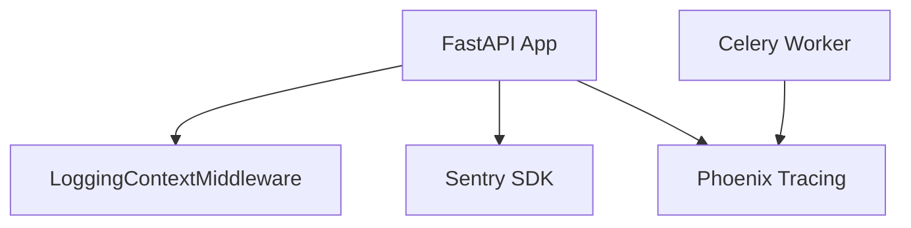

**Diagram sources**
- [app/main.py](file://app/main.py#L116-L129)
- [app/main.py](file://app/main.py#L64-L88)
- [app/main.py](file://app/main.py#L89-L99)
- [app/celery/celery_app.py](file://app/celery/celery_app.py#L132-L147)

**Section sources**
- [app/main.py](file://app/main.py#L101-L129)
- [app/main.py](file://app/main.py#L64-L99)
- [app/celery/celery_app.py](file://app/celery/celery_app.py#L132-L147)

## Dependency Analysis
- Coupling: Routers depend on controllers/services; controllers depend on services and database sessions; Celery tasks depend on services and Redis.
- Cohesion: Each module router encapsulates related endpoints; controllers encapsulate orchestration; services encapsulate domain logic.
- External dependencies: Firebase for user identity, Sentry for error reporting, Phoenix for LLM observability, Redis for streaming, PostgreSQL for persistence.

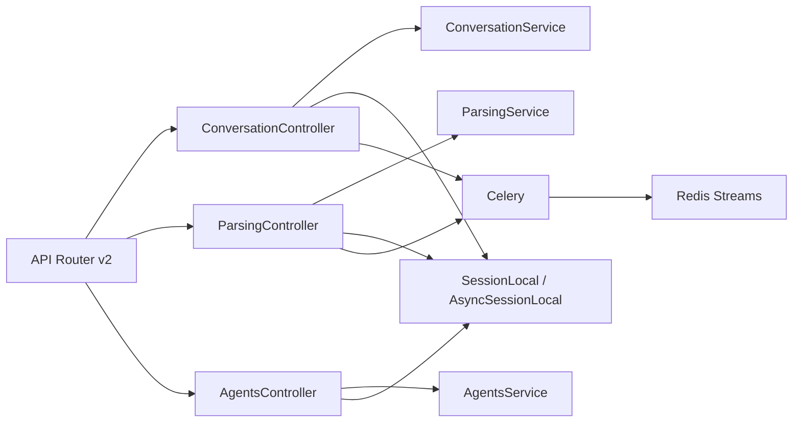

**Diagram sources**
- [app/api/router.py](file://app/api/router.py#L48-L318)
- [app/modules/conversations/conversation/conversation_controller.py](file://app/modules/conversations/conversation/conversation_controller.py#L33-L51)
- [app/modules/parsing/graph_construction/parsing_controller.py](file://app/modules/parsing/graph_construction/parsing_controller.py#L39-L54)
- [app/modules/intelligence/agents/agents_controller.py](file://app/modules/intelligence/agents/agents_controller.py#L13-L22)
- [app/core/database.py](file://app/core/database.py#L100-L117)
- [app/celery/celery_app.py](file://app/celery/celery_app.py#L1-L473)

**Section sources**
- [app/api/router.py](file://app/api/router.py#L48-L318)
- [app/modules/conversations/conversation/conversation_controller.py](file://app/modules/conversations/conversation/conversation_controller.py#L33-L51)
- [app/modules/parsing/graph_construction/parsing_controller.py](file://app/modules/parsing/graph_construction/parsing_controller.py#L39-L54)
- [app/modules/intelligence/agents/agents_controller.py](file://app/modules/intelligence/agents/agents_controller.py#L13-L22)
- [app/core/database.py](file://app/core/database.py#L100-L117)
- [app/celery/celery_app.py](file://app/celery/celery_app.py#L1-L473)

## Performance Considerations
- Database pooling: Synchronous and asynchronous engines use pooling with pre-ping and recycle settings; Celery uses a fresh connection factory to avoid Future binding issues.
- Streaming: Redis streams minimize latency and support resumable sessions; thread pools are used to collect non-streaming responses without blocking the event loop.
- Celery tuning: Prefetch multiplier, late acks, task time limits, and memory caps improve stability and throughput.
- Async safety: LiteLLM logging handlers are patched in Celery workers to prevent async handler creation and SIGTRAP errors.

[No sources needed since this section provides general guidance]

## Troubleshooting Guide
- Authentication failures: Verify API key presence and validity; confirm admin secret usage when targeting internal endpoints.
- Usage limits: Ensure UsageService.check_usage_limit passes before allowing conversation/message creation.
- Database connectivity: Check engine settings and pool configuration; verify async pre-ping behavior in Celery workers.
- Streaming issues: Confirm Redis availability and task status publishing; inspect queued/start/end events and cursors.
- Sentry/Firebase: Validate DSN and credentials; review initialization logs for non-fatal exceptions.

**Section sources**
- [app/api/router.py](file://app/api/router.py#L56-L88)
- [app/modules/conversations/conversations_router.py](file://app/modules/conversations/conversations_router.py#L188-L287)
- [app/core/database.py](file://app/core/database.py#L13-L52)
- [app/celery/celery_app.py](file://app/celery/celery_app.py#L150-L360)
- [app/modules/utils/firebase_setup.py](file://app/modules/utils/firebase_setup.py#L12-L53)

## Conclusion
Potpie’s architecture cleanly separates concerns across routers, controllers, services, and background tasks, with robust session management, streaming orchestration, and external integrations. MainApp centralizes assembly and initialization, while the v2 API router provides a unified surface for core operations. Controllers mediate between endpoints and services, and Celery workers handle long-running tasks with Redis-backed streaming. Authentication integrates with API keys and Firebase, and Sentry and Phoenix provide observability across the stack.