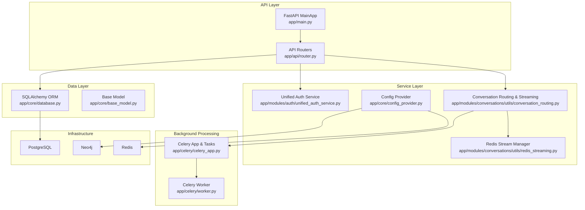
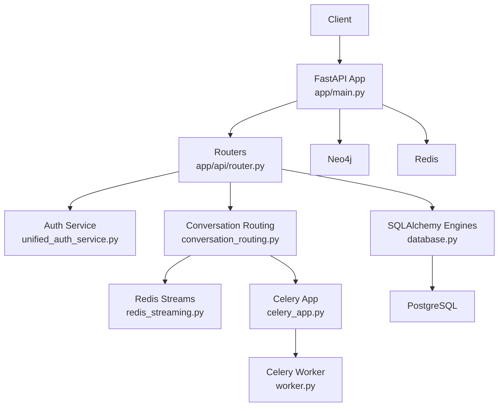
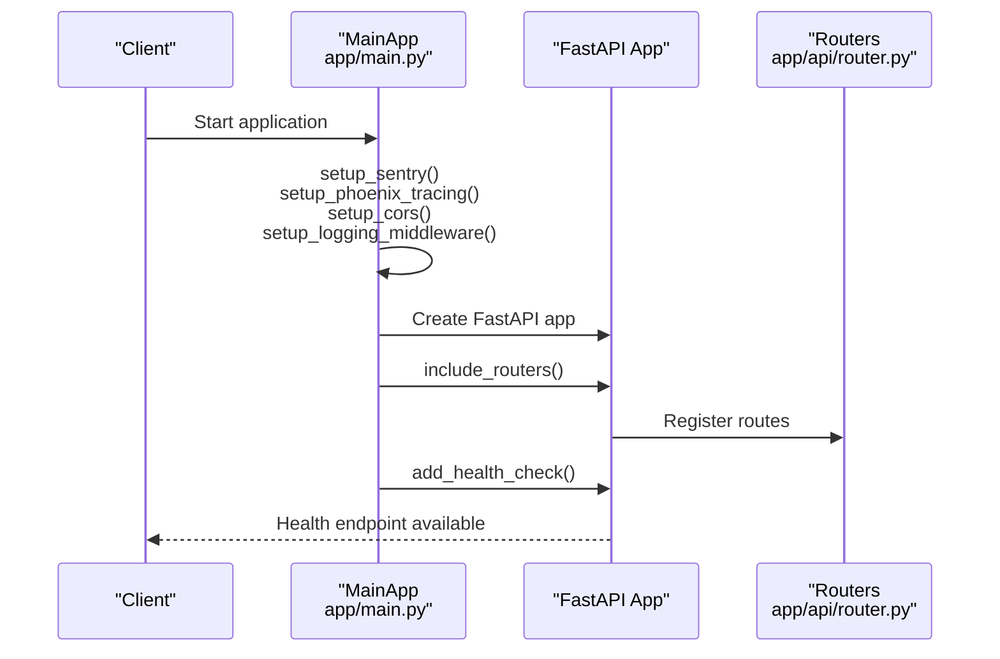
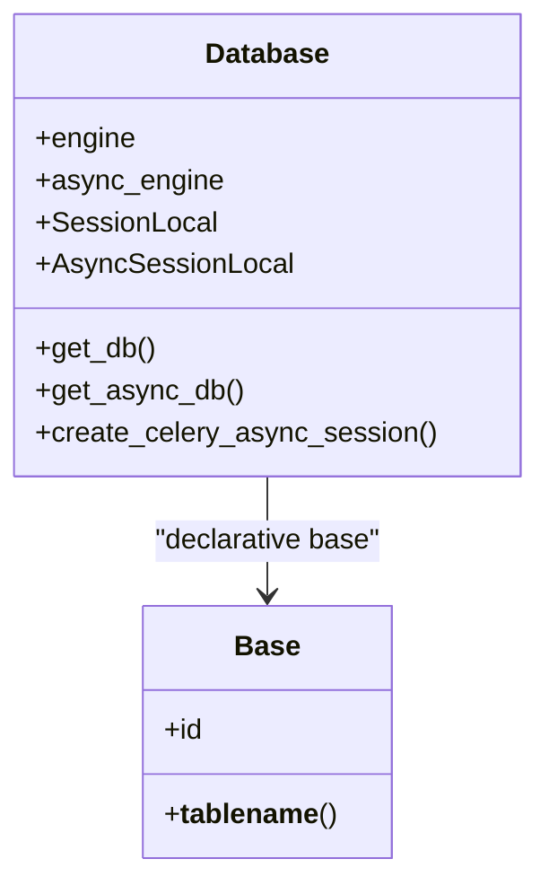
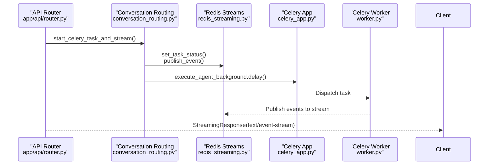
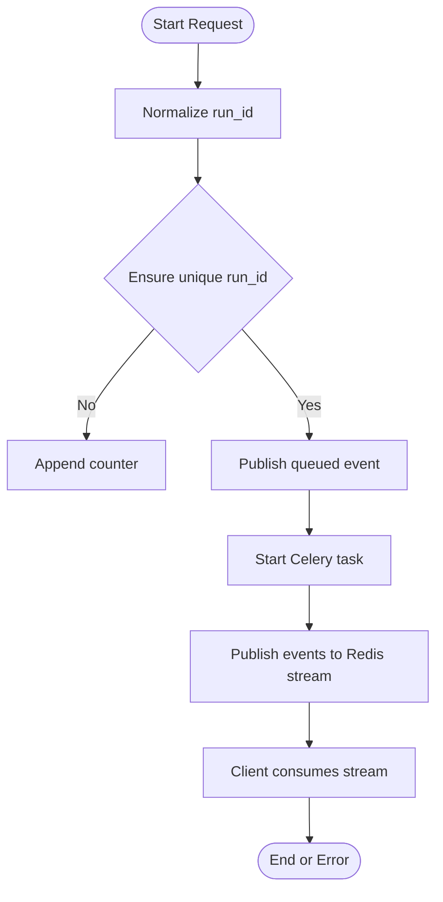
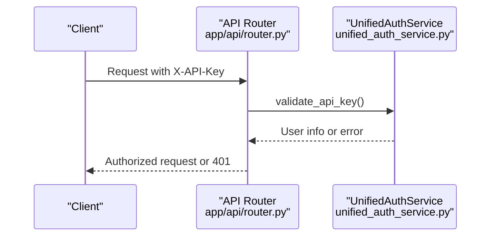
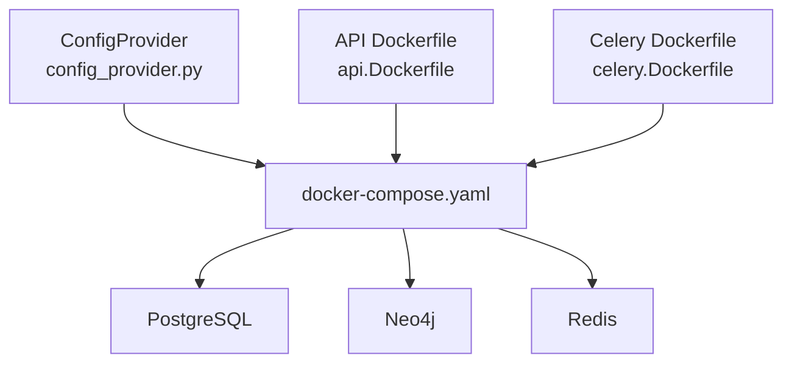
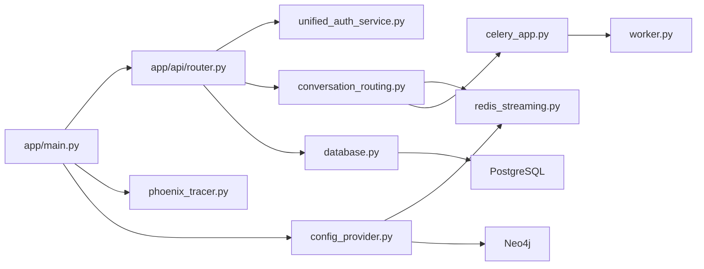
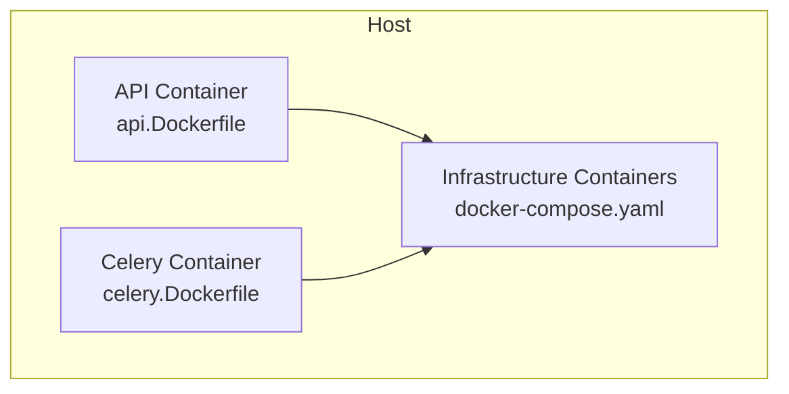

# Core Architecture

<cite>
**Referenced Files in This Document**
- [app/main.py](file://app/main.py)
- [app/api/router.py](file://app/api/router.py)
- [app/celery/__init__.py](file://app/celery/__init__.py)
- [app/celery/celery_app.py](file://app/celery/celery_app.py)
- [app/celery/worker.py](file://app/celery/worker.py)
- [app/core/database.py](file://app/core/database.py)
- [app/core/base_model.py](file://app/core/base_model.py)
- [app/modules/conversations/utils/redis_streaming.py](file://app/modules/conversations/utils/redis_streaming.py)
- [app/modules/conversations/utils/conversation_routing.py](file://app/modules/conversations/utils/conversation_routing.py)
- [app/modules/auth/unified_auth_service.py](file://app/modules/auth/unified_auth_service.py)
- [app/core/config_provider.py](file://app/core/config_provider.py)
- [app/modules/intelligence/tracing/phoenix_tracer.py](file://app/modules/intelligence/tracing/phoenix_tracer.py)
- [docker-compose.yaml](file://docker-compose.yaml)
- [deployment/prod/mom-api/api.Dockerfile](file://deployment/prod/mom-api/api.Dockerfile)
- [deployment/prod/celery/celery.Dockerfile](file://deployment/prod/celery/celery.Dockerfile)
</cite>

## Table of Contents
1. [Introduction](#introduction)
2. [Project Structure](#project-structure)
3. [Core Components](#core-components)
4. [Architecture Overview](#architecture-overview)
5. [Detailed Component Analysis](#detailed-component-analysis)
6. [Dependency Analysis](#dependency-analysis)
7. [Performance Considerations](#performance-considerations)
8. [Troubleshooting Guide](#troubleshooting-guide)
9. [Conclusion](#conclusion)
10. [Appendices](#appendices)

## Introduction
This document describes Potpie’s core system design with a focus on its microservices-based backend architecture. The system centers around a FastAPI application that orchestrates modular services, integrates a background job system powered by Celery, and manages persistence and streaming through PostgreSQL, Neo4j, and Redis. Cross-cutting concerns include authentication and authorization, monitoring, error handling, and observability. The deployment topology separates API and worker services, enabling scalable and maintainable operations.

## Project Structure
The repository follows a layered, feature-based organization:
- Application entrypoint initializes FastAPI, middleware, routers, and startup routines.
- Modular feature areas under app/modules encapsulate domain capabilities (authentication, conversations, intelligence, parsing, etc.).
- Background processing is implemented via Celery with dedicated queues and task registration.
- Data access uses SQLAlchemy ORM with both synchronous and asynchronous engines.
- Streaming and real-time updates leverage Redis streams keyed by conversation and run identifiers.
- Infrastructure is provisioned via Docker Compose for PostgreSQL, Neo4j, and Redis.

**Diagram sources**
- [app/main.py](file://app/main.py#L46-L217)
- [app/api/router.py](file://app/api/router.py#L1-L318)
- [app/celery/celery_app.py](file://app/celery/celery_app.py#L1-L473)
- [app/celery/worker.py](file://app/celery/worker.py#L1-L41)
- [app/core/database.py](file://app/core/database.py#L1-L117)
- [app/core/base_model.py](file://app/core/base_model.py#L1-L17)
- [app/modules/conversations/utils/conversation_routing.py](file://app/modules/conversations/utils/conversation_routing.py#L1-L324)
- [app/modules/conversations/utils/redis_streaming.py](file://app/modules/conversations/utils/redis_streaming.py#L1-L248)
- [app/core/config_provider.py](file://app/core/config_provider.py#L1-L246)
- [docker-compose.yaml](file://docker-compose.yaml#L1-L57)

**Section sources**
- [app/main.py](file://app/main.py#L46-L217)
- [app/api/router.py](file://app/api/router.py#L1-L318)
- [docker-compose.yaml](file://docker-compose.yaml#L1-L57)

## Core Components
- FastAPI application bootstrap and middleware pipeline:
  - CORS configuration, logging context middleware, Sentry integration, Phoenix tracing initialization, and health checks.
  - Dynamic router inclusion for modular endpoints.
- Database layer:
  - Synchronous and asynchronous SQLAlchemy engines with connection pooling and session factories.
  - Base declarative model class for ORM.
- Background processing:
  - Celery app configured with Redis broker/backend, task routing, and worker tuning.
  - Worker initialization and task registration.
- Streaming and real-time:
  - Redis-backed streaming for conversation events with TTL and max-length controls.
  - Shared routing utilities to orchestrate Celery tasks and SSE responses.
- Configuration and infrastructure:
  - Centralized configuration provider for Neo4j, Redis, and object storage.
  - Docker Compose services for PostgreSQL, Neo4j, and Redis.

**Section sources**
- [app/main.py](file://app/main.py#L46-L217)
- [app/core/database.py](file://app/core/database.py#L1-L117)
- [app/core/base_model.py](file://app/core/base_model.py#L1-L17)
- [app/celery/celery_app.py](file://app/celery/celery_app.py#L1-L473)
- [app/celery/worker.py](file://app/celery/worker.py#L1-L41)
- [app/modules/conversations/utils/redis_streaming.py](file://app/modules/conversations/utils/redis_streaming.py#L1-L248)
- [app/modules/conversations/utils/conversation_routing.py](file://app/modules/conversations/utils/conversation_routing.py#L1-L324)
- [app/core/config_provider.py](file://app/core/config_provider.py#L1-L246)

## Architecture Overview
The system employs a layered architecture with clear separation of concerns:
- Presentation and orchestration: FastAPI application and routers.
- Service orchestration: Unified authentication, conversation routing, and streaming coordination.
- Background processing: Celery tasks for long-running operations with Redis queues.
- Persistence: PostgreSQL for relational data, Neo4j for graph-based knowledge, and Redis for streaming and ephemeral state.
- Observability: Phoenix tracing for LLM monitoring and Sentry for error reporting.

**Diagram sources**
- [app/main.py](file://app/main.py#L46-L217)
- [app/api/router.py](file://app/api/router.py#L1-L318)
- [app/modules/auth/unified_auth_service.py](file://app/modules/auth/unified_auth_service.py#L1-L800)
- [app/modules/conversations/utils/conversation_routing.py](file://app/modules/conversations/utils/conversation_routing.py#L1-L324)
- [app/modules/conversations/utils/redis_streaming.py](file://app/modules/conversations/utils/redis_streaming.py#L1-L248)
- [app/celery/celery_app.py](file://app/celery/celery_app.py#L1-L473)
- [app/celery/worker.py](file://app/celery/worker.py#L1-L41)
- [app/core/database.py](file://app/core/database.py#L1-L117)
- [docker-compose.yaml](file://docker-compose.yaml#L1-L57)

## Detailed Component Analysis

### FastAPI Application Bootstrap
- Initializes environment, Sentry, and Phoenix tracing.
- Configures CORS and logging middleware.
- Includes modular routers and adds a health endpoint.
- Startup event creates database tables, seeds data in development, and initializes system prompts.

**Diagram sources**
- [app/main.py](file://app/main.py#L46-L217)
- [app/api/router.py](file://app/api/router.py#L1-L318)

**Section sources**
- [app/main.py](file://app/main.py#L46-L217)

### Database and ORM Layer
- Provides synchronous and asynchronous SQLAlchemy engines with connection pooling and pre-ping.
- Offers session factories for route dependencies and a special async session factory tailored for Celery workers to avoid cross-task Future binding issues.
- Declares a base ORM class for all models.

**Diagram sources**
- [app/core/database.py](file://app/core/database.py#L1-L117)
- [app/core/base_model.py](file://app/core/base_model.py#L1-L17)

**Section sources**
- [app/core/database.py](file://app/core/database.py#L1-L117)
- [app/core/base_model.py](file://app/core/base_model.py#L1-L17)

### Background Processing with Celery
- Celery app configured with Redis broker and backend, task routing, and worker tuning (prefetch, late acks, memory limits).
- LiteLLM is configured synchronously in workers to avoid async handler issues.
- Worker initialization registers tasks and starts the worker process.

**Diagram sources**
- [app/api/router.py](file://app/api/router.py#L140-L218)
- [app/modules/conversations/utils/conversation_routing.py](file://app/modules/conversations/utils/conversation_routing.py#L107-L171)
- [app/modules/conversations/utils/redis_streaming.py](file://app/modules/conversations/utils/redis_streaming.py#L21-L63)
- [app/celery/celery_app.py](file://app/celery/celery_app.py#L66-L129)
- [app/celery/worker.py](file://app/celery/worker.py#L16-L31)

**Section sources**
- [app/celery/celery_app.py](file://app/celery/celery_app.py#L1-L473)
- [app/celery/worker.py](file://app/celery/worker.py#L1-L41)
- [app/modules/conversations/utils/conversation_routing.py](file://app/modules/conversations/utils/conversation_routing.py#L1-L324)
- [app/modules/conversations/utils/redis_streaming.py](file://app/modules/conversations/utils/redis_streaming.py#L1-L248)

### Streaming and Real-Time Updates
- Redis stream manager publishes and consumes conversation events with TTL and max-length constraints.
- Supports reconnection via cursors and cancellation signaling.
- Conversation routing utilities coordinate task initiation, status updates, and SSE responses.

**Diagram sources**
- [app/modules/conversations/utils/conversation_routing.py](file://app/modules/conversations/utils/conversation_routing.py#L23-L58)
- [app/modules/conversations/utils/redis_streaming.py](file://app/modules/conversations/utils/redis_streaming.py#L21-L63)

**Section sources**
- [app/modules/conversations/utils/redis_streaming.py](file://app/modules/conversations/utils/redis_streaming.py#L1-L248)
- [app/modules/conversations/utils/conversation_routing.py](file://app/modules/conversations/utils/conversation_routing.py#L1-L324)

### Authentication and Authorization
- Unified authentication service supports multiple providers (Firebase, GitHub, SSO) and enforces single-user identity by email.
- Handles provider linking, token encryption/decryption, and audit logging.
- API routers enforce API key-based authentication for internal admin and external clients.

**Diagram sources**
- [app/api/router.py](file://app/api/router.py#L56-L87)
- [app/modules/auth/unified_auth_service.py](file://app/modules/auth/unified_auth_service.py#L1-L800)

**Section sources**
- [app/api/router.py](file://app/api/router.py#L56-L87)
- [app/modules/auth/unified_auth_service.py](file://app/modules/auth/unified_auth_service.py#L1-L800)

### Configuration and Infrastructure
- Config provider centralizes Neo4j, Redis, GitHub, and object storage configuration with auto-detection and overrides.
- Docker Compose provisions PostgreSQL, Neo4j, and Redis with health checks and persistent volumes.
- Production Dockerfiles use uv for dependency installation and Supervisor to manage processes.

**Diagram sources**
- [app/core/config_provider.py](file://app/core/config_provider.py#L1-L246)
- [docker-compose.yaml](file://docker-compose.yaml#L1-L57)
- [deployment/prod/mom-api/api.Dockerfile](file://deployment/prod/mom-api/api.Dockerfile#L1-L46)
- [deployment/prod/celery/celery.Dockerfile](file://deployment/prod/celery/celery.Dockerfile#L1-L46)

**Section sources**
- [app/core/config_provider.py](file://app/core/config_provider.py#L1-L246)
- [docker-compose.yaml](file://docker-compose.yaml#L1-L57)
- [deployment/prod/mom-api/api.Dockerfile](file://deployment/prod/mom-api/api.Dockerfile#L1-L46)
- [deployment/prod/celery/celery.Dockerfile](file://deployment/prod/celery/celery.Dockerfile#L1-L46)

## Dependency Analysis
- Application entrypoint depends on routers, database initialization, and startup routines.
- API routers depend on services (auth, conversations, parsing, etc.) and database sessions.
- Celery app depends on Redis and registers tasks for parsing and agent execution.
- Redis stream manager depends on configuration provider for connection details.
- Phoenix tracing is initialized early in the application lifecycle to instrument downstream components.

**Diagram sources**
- [app/main.py](file://app/main.py#L46-L217)
- [app/api/router.py](file://app/api/router.py#L1-L318)
- [app/modules/conversations/utils/conversation_routing.py](file://app/modules/conversations/utils/conversation_routing.py#L1-L324)
- [app/modules/conversations/utils/redis_streaming.py](file://app/modules/conversations/utils/redis_streaming.py#L1-L248)
- [app/celery/celery_app.py](file://app/celery/celery_app.py#L1-L473)
- [app/celery/worker.py](file://app/celery/worker.py#L1-L41)
- [app/core/database.py](file://app/core/database.py#L1-L117)
- [app/modules/intelligence/tracing/phoenix_tracer.py](file://app/modules/intelligence/tracing/phoenix_tracer.py#L71-L278)
- [app/core/config_provider.py](file://app/core/config_provider.py#L1-L246)

**Section sources**
- [app/main.py](file://app/main.py#L46-L217)
- [app/api/router.py](file://app/api/router.py#L1-L318)
- [app/celery/celery_app.py](file://app/celery/celery_app.py#L1-L473)

## Performance Considerations
- Database:
  - Connection pooling and pre-ping reduce stale connections; async sessions minimize contention.
  - Dedicated async session factory for Celery avoids cross-task Future binding issues.
- Background processing:
  - Worker prefetch multiplier and late acknowledgments improve fairness and reliability.
  - Memory limits and restart policies mitigate memory leaks.
- Streaming:
  - Redis stream TTL and max-length prevent unbounded growth.
  - Blocking reads with timeouts balance responsiveness and resource usage.
- Observability:
  - Phoenix tracing with sanitization and batch processors reduces overhead and handles network issues gracefully.

[No sources needed since this section provides general guidance]

## Troubleshooting Guide
- Redis connectivity:
  - Celery app logs ping attempts and sanitized Redis URLs; verify credentials and network accessibility.
- Phoenix tracing:
  - Health checks detect unreachable endpoints; ensure Phoenix is running and reachable.
- Celery worker stability:
  - Async handler cleanup and shutdown hooks address “Task was destroyed” warnings.
- Authentication:
  - API key validation raises explicit HTTP exceptions; confirm API key presence and validity.
- Database:
  - Startup routine initializes tables; verify environment variables and permissions.

**Section sources**
- [app/celery/celery_app.py](file://app/celery/celery_app.py#L67-L78)
- [app/modules/intelligence/tracing/phoenix_tracer.py](file://app/modules/intelligence/tracing/phoenix_tracer.py#L46-L69)
- [app/modules/auth/unified_auth_service.py](file://app/modules/auth/unified_auth_service.py#L1-L800)
- [app/main.py](file://app/main.py#L185-L207)

## Conclusion
Potpie’s architecture combines a modular FastAPI application, robust background processing via Celery, and a layered persistence model with PostgreSQL, Neo4j, and Redis. Cross-cutting concerns like authentication, monitoring, and error handling are integrated early in the lifecycle. The deployment topology separates API and worker services, enabling scalability and operational simplicity.

[No sources needed since this section summarizes without analyzing specific files]

## Appendices

### Deployment Topology
- API service: Runs the FastAPI application behind Supervisor and exposes ports for the app and monitoring.
- Celery service: Runs Celery workers and Flower for task monitoring.
- Infrastructure: PostgreSQL, Neo4j, and Redis managed via Docker Compose.

**Diagram sources**
- [deployment/prod/mom-api/api.Dockerfile](file://deployment/prod/mom-api/api.Dockerfile#L1-L46)
- [deployment/prod/celery/celery.Dockerfile](file://deployment/prod/celery/celery.Dockerfile#L1-L46)
- [docker-compose.yaml](file://docker-compose.yaml#L1-L57)