# Data Flow Architecture

<cite>
**Referenced Files in This Document**
- [app/main.py](file://app/main.py)
- [app/api/router.py](file://app/api/router.py)
- [app/modules/conversations/conversations_router.py](file://app/modules/conversations/conversations_router.py)
- [app/modules/conversations/utils/redis_streaming.py](file://app/modules/conversations/utils/redis_streaming.py)
- [app/celery/celery_app.py](file://app/celery/celery_app.py)
- [app/celery/tasks/agent_tasks.py](file://app/celery/tasks/agent_tasks.py)
- [app/celery/tasks/parsing_tasks.py](file://app/celery/tasks/parsing_tasks.py)
- [app/core/database.py](file://app/core/database.py)
- [app/core/config_provider.py](file://app/core/config_provider.py)
- [app/modules/parsing/graph_construction/parsing_controller.py](file://app/modules/parsing/graph_construction/parsing_controller.py)
- [app/modules/search/search_service.py](file://app/modules/search/search_service.py)
- [app/modules/media/media_service.py](file://app/modules/media/media_service.py)
- [app/modules/conversations/conversation/conversation_model.py](file://app/modules/conversations/conversation/conversation_model.py)
- [app/modules/parsing/models/inference_cache_model.py](file://app/modules/parsing/models/inference_cache_model.py)
</cite>

## Table of Contents
1. [Introduction](#introduction)
2. [Project Structure](#project-structure)
3. [Core Components](#core-components)
4. [Architecture Overview](#architecture-overview)
5. [Detailed Component Analysis](#detailed-component-analysis)
6. [Dependency Analysis](#dependency-analysis)
7. [Performance Considerations](#performance-considerations)
8. [Troubleshooting Guide](#troubleshooting-guide)
9. [Conclusion](#conclusion)
10. [Appendices](#appendices)

## Introduction
This document explains Potpie’s data flow architecture from API requests to database persistence, real-time streaming, background processing, and caching. It covers:
- Request lifecycle from FastAPI route handlers through authentication and validation to service-layer operations and database transactions
- Real-time conversation streaming via Redis and Celery workers
- Asynchronous processing pipeline for agent interactions and parsing tasks
- Data transformation patterns across layers
- Transaction management for database operations
- Event-driven architecture for background tasks
- Knowledge graph data flow from parsing services to Neo4j
- Media file handling pipeline and integration flows for external services

## Project Structure
Potpie follows a modular FastAPI application with dedicated modules for authentication, conversations, parsing, search, media, integrations, and intelligence. Celery workers handle background tasks, while Redis streams provide real-time updates. PostgreSQL persists structured data, and Neo4j stores knowledge graph data.

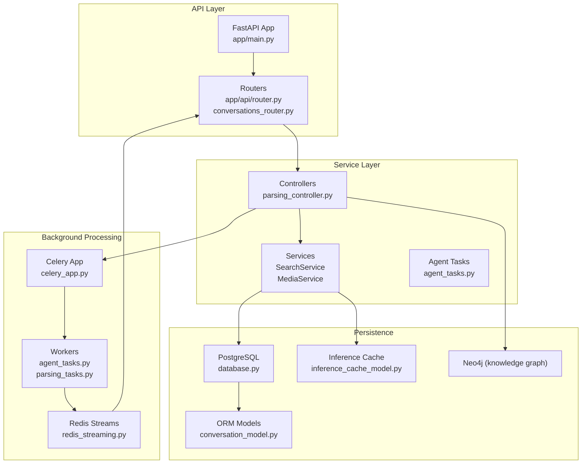

**Diagram sources**
- [app/main.py](file://app/main.py#L1-L217)
- [app/api/router.py](file://app/api/router.py#L1-L318)
- [app/modules/conversations/conversations_router.py](file://app/modules/conversations/conversations_router.py#L1-L622)
- [app/modules/conversations/utils/redis_streaming.py](file://app/modules/conversations/utils/redis_streaming.py#L1-L248)
- [app/celery/celery_app.py](file://app/celery/celery_app.py#L1-L473)
- [app/celery/tasks/agent_tasks.py](file://app/celery/tasks/agent_tasks.py#L1-L460)
- [app/celery/tasks/parsing_tasks.py](file://app/celery/tasks/parsing_tasks.py#L1-L58)
- [app/core/database.py](file://app/core/database.py#L1-L117)
- [app/modules/conversations/conversation/conversation_model.py](file://app/modules/conversations/conversation/conversation_model.py#L1-L60)
- [app/modules/parsing/models/inference_cache_model.py](file://app/modules/parsing/models/inference_cache_model.py#L1-L36)

**Section sources**
- [app/main.py](file://app/main.py#L1-L217)
- [app/api/router.py](file://app/api/router.py#L1-L318)
- [app/modules/conversations/conversations_router.py](file://app/modules/conversations/conversations_router.py#L1-L622)
- [app/core/database.py](file://app/core/database.py#L1-L117)

## Core Components
- FastAPI Application: Initializes CORS, logging, routers, and database on startup.
- Routers: Expose endpoints for conversations, parsing, search, media, integrations, and agents.
- Controllers: Coordinate business logic and orchestrate service operations.
- Services: Implement domain-specific operations (search, media, parsing).
- Celery App and Tasks: Execute long-running work asynchronously and publish streaming updates.
- Redis Stream Manager: Publishes and consumes streaming events for real-time UI updates.
- Database: SQLAlchemy engine/session factories and async session helpers for transactional operations.
- Models: ORM models for conversations, projects, and inference cache.
- Config Provider: Centralized configuration for Redis, Neo4j, storage providers, and streaming parameters.

**Section sources**
- [app/main.py](file://app/main.py#L46-L217)
- [app/api/router.py](file://app/api/router.py#L1-L318)
- [app/modules/conversations/conversations_router.py](file://app/modules/conversations/conversations_router.py#L1-L622)
- [app/modules/conversations/utils/redis_streaming.py](file://app/modules/conversations/utils/redis_streaming.py#L1-L248)
- [app/celery/celery_app.py](file://app/celery/celery_app.py#L1-L473)
- [app/core/database.py](file://app/core/database.py#L1-L117)
- [app/modules/conversations/conversation/conversation_model.py](file://app/modules/conversations/conversation/conversation_model.py#L1-L60)
- [app/modules/parsing/models/inference_cache_model.py](file://app/modules/parsing/models/inference_cache_model.py#L1-L36)
- [app/core/config_provider.py](file://app/core/config_provider.py#L1-L246)

## Architecture Overview
The system uses an event-driven architecture:
- API requests enter via FastAPI routers and depend on database sessions.
- Authentication and validation middleware enforce access and usage limits.
- Controllers delegate to services for business logic.
- Long-running operations are offloaded to Celery workers.
- Redis streams deliver incremental updates to clients.
- PostgreSQL persists structured data; Neo4j stores knowledge graph artifacts.
- Caching strategies (inference cache) accelerate repeated computations.

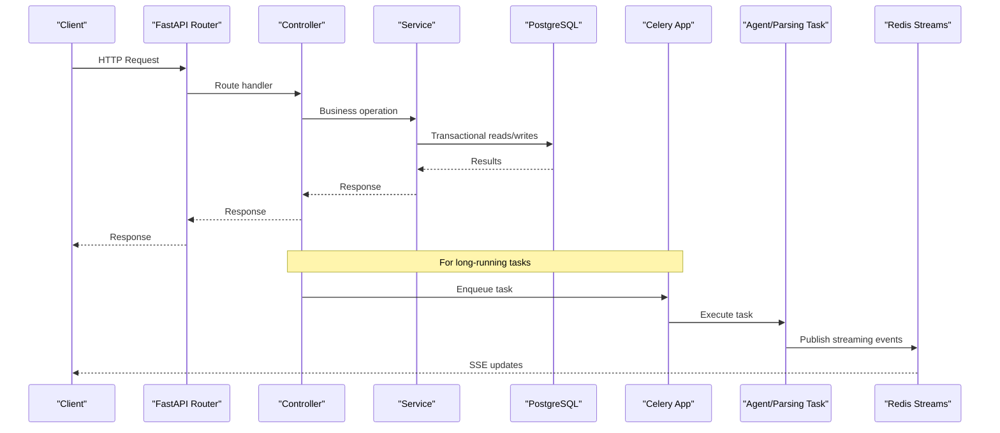

**Diagram sources**
- [app/api/router.py](file://app/api/router.py#L90-L218)
- [app/modules/conversations/conversations_router.py](file://app/modules/conversations/conversations_router.py#L160-L286)
- [app/celery/tasks/agent_tasks.py](file://app/celery/tasks/agent_tasks.py#L11-L25)
- [app/modules/conversations/utils/redis_streaming.py](file://app/modules/conversations/utils/redis_streaming.py#L21-L63)
- [app/core/database.py](file://app/core/database.py#L100-L116)

## Detailed Component Analysis

### Request Lifecycle: Authentication, Validation, and Service Layer
- Authentication and usage checks occur at the router level for both API v1 and v2 endpoints.
- Controllers instantiate service objects and perform validations before delegating to background tasks or immediate processing.
- Database sessions are injected via dependency functions to ensure proper transaction boundaries.

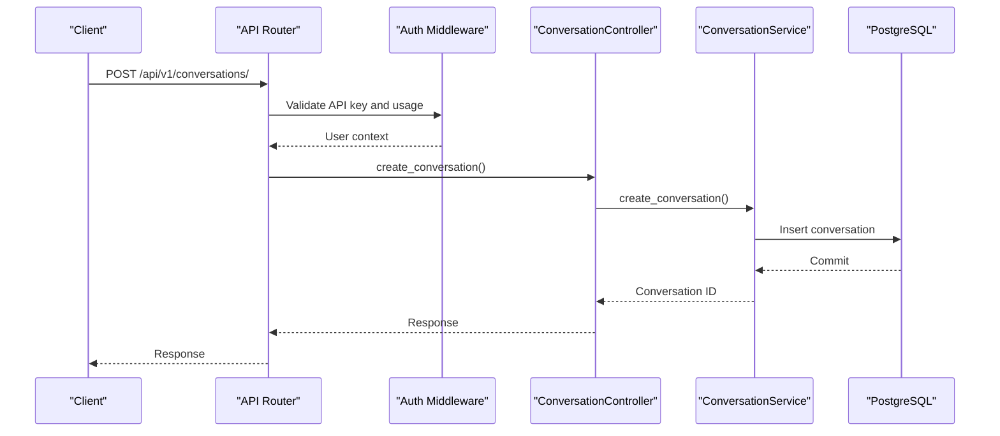

**Diagram sources**
- [app/api/router.py](file://app/api/router.py#L96-L121)
- [app/modules/conversations/conversations_router.py](file://app/modules/conversations/conversations_router.py#L82-L102)
- [app/core/database.py](file://app/core/database.py#L100-L116)

**Section sources**
- [app/api/router.py](file://app/api/router.py#L56-L88)
- [app/modules/conversations/conversations_router.py](file://app/modules/conversations/conversations_router.py#L82-L102)
- [app/core/database.py](file://app/core/database.py#L100-L116)

### Real-Time Conversations: Streaming with Redis and Celery
- Clients send messages via conversation endpoints with optional streaming.
- The system generates a deterministic run_id and starts a background Celery task.
- The worker publishes incremental events to Redis streams; clients consume via Server-Sent Events.
- Redis TTL and max-length controls ensure efficient stream lifecycle management.

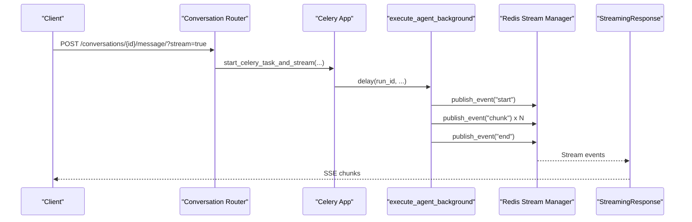

**Diagram sources**
- [app/modules/conversations/conversations_router.py](file://app/modules/conversations/conversations_router.py#L160-L286)
- [app/celery/tasks/agent_tasks.py](file://app/celery/tasks/agent_tasks.py#L11-L25)
- [app/modules/conversations/utils/redis_streaming.py](file://app/modules/conversations/utils/redis_streaming.py#L21-L63)

**Section sources**
- [app/modules/conversations/conversations_router.py](file://app/modules/conversations/conversations_router.py#L160-L286)
- [app/modules/conversations/utils/redis_streaming.py](file://app/modules/conversations/utils/redis_streaming.py#L1-L248)
- [app/celery/tasks/agent_tasks.py](file://app/celery/tasks/agent_tasks.py#L1-L460)

### Asynchronous Processing Pipeline: Agent and Regeneration Tasks
- Agent tasks execute conversation logic, persist messages, and stream incremental results.
- Regeneration tasks reuse prior attachments and node contexts to regenerate responses.
- Both use BaseTask’s async session and publish standardized events to Redis.

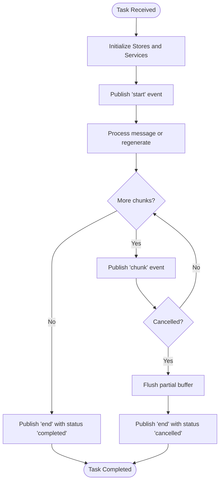

**Diagram sources**
- [app/celery/tasks/agent_tasks.py](file://app/celery/tasks/agent_tasks.py#L36-L246)
- [app/modules/conversations/utils/redis_streaming.py](file://app/modules/conversations/utils/redis_streaming.py#L21-L63)

**Section sources**
- [app/celery/tasks/agent_tasks.py](file://app/celery/tasks/agent_tasks.py#L1-L460)

### Database Transactions and Sessions
- Synchronous and asynchronous session factories manage transaction boundaries.
- Celery tasks use a fresh async session to avoid cross-task Future binding issues.
- Startup initializes database tables and seeds system prompts.

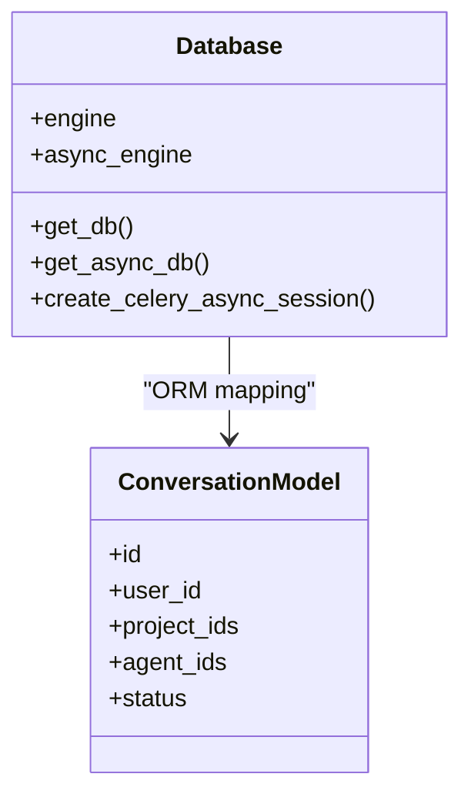

**Diagram sources**
- [app/core/database.py](file://app/core/database.py#L1-L117)
- [app/modules/conversations/conversation/conversation_model.py](file://app/modules/conversations/conversation/conversation_model.py#L1-L60)

**Section sources**
- [app/core/database.py](file://app/core/database.py#L1-L117)
- [app/modules/conversations/conversation/conversation_model.py](file://app/modules/conversations/conversation/conversation_model.py#L1-L60)

### Knowledge Graph Data Flow: Parsing to Neo4j
- ParsingController orchestrates repository parsing, project registration, and task submission.
- ParsingService performs graph construction; results are persisted and indexed.
- Neo4j is configured centrally via ConfigProvider; parsing tasks can integrate with Neo4j for graph updates.

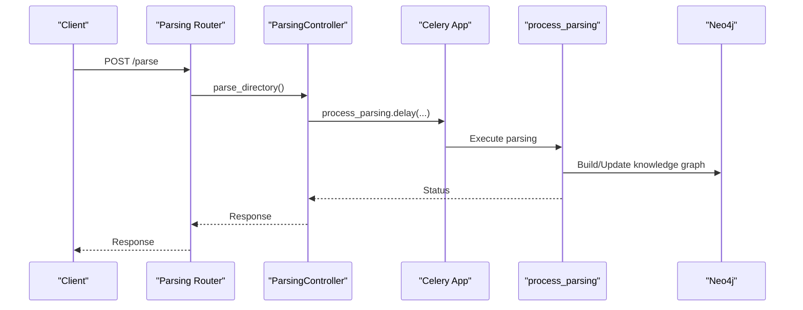

**Diagram sources**
- [app/api/router.py](file://app/api/router.py#L123-L147)
- [app/modules/parsing/graph_construction/parsing_controller.py](file://app/modules/parsing/graph_construction/parsing_controller.py#L42-L304)
- [app/celery/tasks/parsing_tasks.py](file://app/celery/tasks/parsing_tasks.py#L17-L54)
- [app/core/config_provider.py](file://app/core/config_provider.py#L69-L73)

**Section sources**
- [app/modules/parsing/graph_construction/parsing_controller.py](file://app/modules/parsing/graph_construction/parsing_controller.py#L1-L384)
- [app/celery/tasks/parsing_tasks.py](file://app/celery/tasks/parsing_tasks.py#L1-L58)
- [app/core/config_provider.py](file://app/core/config_provider.py#L1-L246)

### Media File Handling Pipeline
- MediaService validates, processes, and uploads images to configured object storage.
- Attachments are linked to messages; signed URLs enable controlled access.
- Multimodal support is toggled via configuration; validation ensures allowed types and sizes.

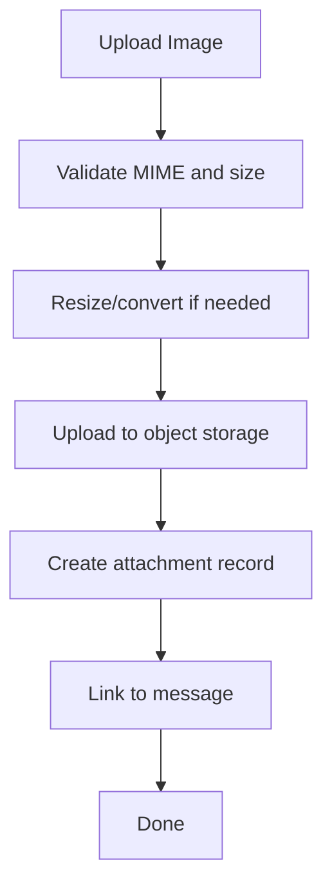

**Diagram sources**
- [app/modules/media/media_service.py](file://app/modules/media/media_service.py#L101-L185)

**Section sources**
- [app/modules/media/media_service.py](file://app/modules/media/media_service.py#L1-L686)

### Search and Caching Strategies
- SearchService queries a prebuilt codebase index and ranks results by relevance.
- InferenceCache model stores computed embeddings and metadata for reuse.
- ConfigProvider centralizes Redis and streaming parameters for consistent behavior.

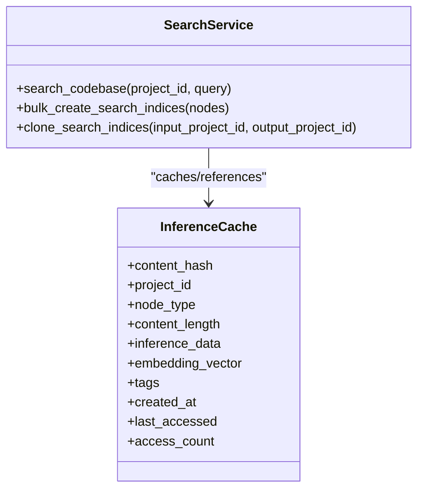

**Diagram sources**
- [app/modules/search/search_service.py](file://app/modules/search/search_service.py#L1-L147)
- [app/modules/parsing/models/inference_cache_model.py](file://app/modules/parsing/models/inference_cache_model.py#L1-L36)

**Section sources**
- [app/modules/search/search_service.py](file://app/modules/search/search_service.py#L1-L147)
- [app/modules/parsing/models/inference_cache_model.py](file://app/modules/parsing/models/inference_cache_model.py#L1-L36)
- [app/core/config_provider.py](file://app/core/config_provider.py#L208-L218)

## Dependency Analysis
The system exhibits clear separation of concerns:
- API routers depend on controllers and services
- Controllers depend on services and Celery for background tasks
- Celery tasks depend on Redis for streaming and database sessions for persistence
- Redis is used for eventing and session management
- Configuration provider centralizes environment-dependent settings

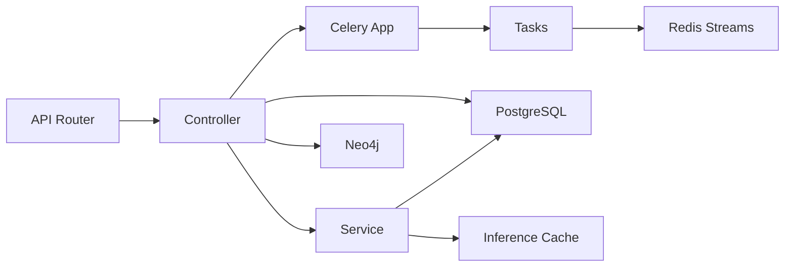

**Diagram sources**
- [app/api/router.py](file://app/api/router.py#L1-L318)
- [app/modules/conversations/conversations_router.py](file://app/modules/conversations/conversations_router.py#L1-L622)
- [app/celery/tasks/agent_tasks.py](file://app/celery/tasks/agent_tasks.py#L1-L460)
- [app/modules/conversations/utils/redis_streaming.py](file://app/modules/conversations/utils/redis_streaming.py#L1-L248)
- [app/core/database.py](file://app/core/database.py#L1-L117)
- [app/modules/parsing/models/inference_cache_model.py](file://app/modules/parsing/models/inference_cache_model.py#L1-L36)
- [app/core/config_provider.py](file://app/core/config_provider.py#L1-L246)

**Section sources**
- [app/api/router.py](file://app/api/router.py#L1-L318)
- [app/modules/conversations/conversations_router.py](file://app/modules/conversations/conversations_router.py#L1-L622)
- [app/celery/tasks/agent_tasks.py](file://app/celery/tasks/agent_tasks.py#L1-L460)
- [app/modules/conversations/utils/redis_streaming.py](file://app/modules/conversations/utils/redis_streaming.py#L1-L248)
- [app/core/database.py](file://app/core/database.py#L1-L117)
- [app/modules/parsing/models/inference_cache_model.py](file://app/modules/parsing/models/inference_cache_model.py#L1-L36)
- [app/core/config_provider.py](file://app/core/config_provider.py#L1-L246)

## Performance Considerations
- Asynchronous sessions: Use async session factories for non-blocking IO and avoid pooled connections in Celery workers to prevent Future binding issues.
- Redis streaming: Tune TTL and max-len to balance memory usage and replayability.
- Worker tuning: Prefetch multiplier, task acks late, and memory limits prevent resource exhaustion and improve reliability.
- Multimodal processing: Validate and resize images early to reduce downstream processing overhead.
- Search relevance: Weighting and similarity scoring should be benchmarked against corpus size and query patterns.

[No sources needed since this section provides general guidance]

## Troubleshooting Guide
- Redis connectivity: Celery app pings the Redis backend on startup; failures are logged with sanitized URLs.
- Worker shutdown: Celery cleans up pending async tasks and removes async handlers to avoid “Task was destroyed” warnings.
- Task cancellation: Redis cancellation keys allow clients to stop long-running generations; workers flush buffers before ending.
- Media upload errors: Rollback and cleanup ensure orphaned attachments are removed; signed URL generation falls back to direct endpoints.

**Section sources**
- [app/celery/celery_app.py](file://app/celery/celery_app.py#L70-L78)
- [app/celery/celery_app.py](file://app/celery/celery_app.py#L405-L453)
- [app/modules/conversations/utils/redis_streaming.py](file://app/modules/conversations/utils/redis_streaming.py#L177-L234)
- [app/modules/media/media_service.py](file://app/modules/media/media_service.py#L179-L185)

## Conclusion
Potpie’s architecture cleanly separates concerns across API, service, background processing, and persistence layers. Real-time streaming leverages Redis and Celery for responsive user experiences, while PostgreSQL and Neo4j provide robust data and knowledge graph storage. Carefully tuned sessions, worker configurations, and caching strategies ensure scalability and reliability.

[No sources needed since this section summarizes without analyzing specific files]

## Appendices

### Data Flow Diagrams

#### Conversation Creation and Streaming
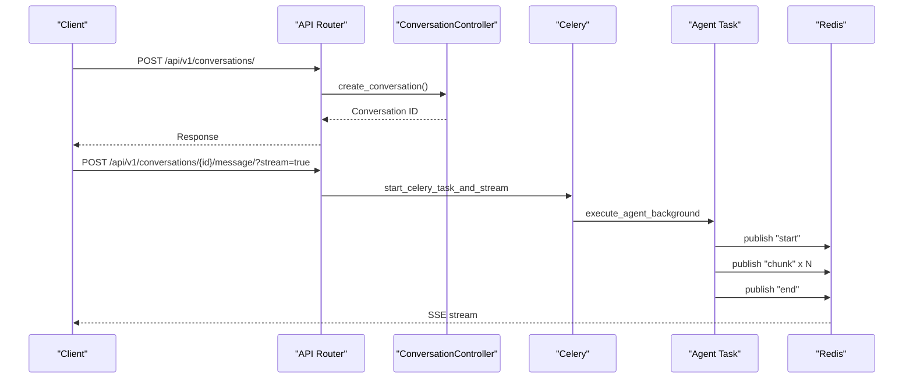

**Diagram sources**
- [app/api/router.py](file://app/api/router.py#L96-L121)
- [app/modules/conversations/conversations_router.py](file://app/modules/conversations/conversations_router.py#L160-L286)
- [app/celery/tasks/agent_tasks.py](file://app/celery/tasks/agent_tasks.py#L11-L25)
- [app/modules/conversations/utils/redis_streaming.py](file://app/modules/conversations/utils/redis_streaming.py#L21-L63)

#### Code Parsing Pipeline
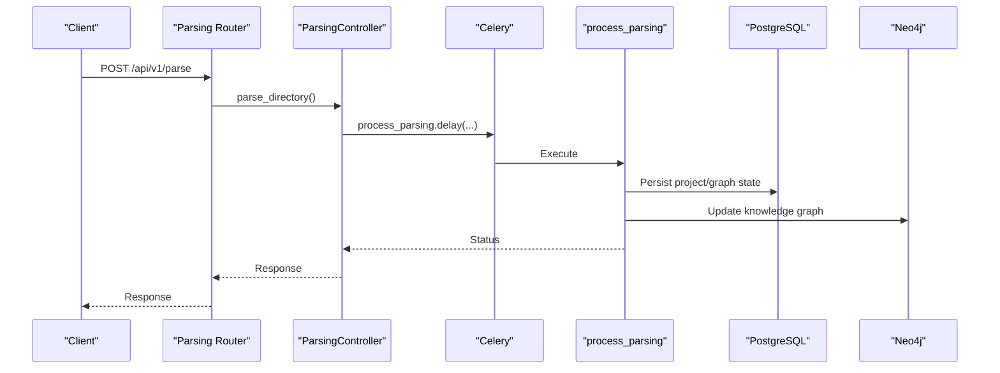

**Diagram sources**
- [app/api/router.py](file://app/api/router.py#L123-L147)
- [app/modules/parsing/graph_construction/parsing_controller.py](file://app/modules/parsing/graph_construction/parsing_controller.py#L42-L304)
- [app/celery/tasks/parsing_tasks.py](file://app/celery/tasks/parsing_tasks.py#L17-L54)

#### Agent Interaction and Regeneration
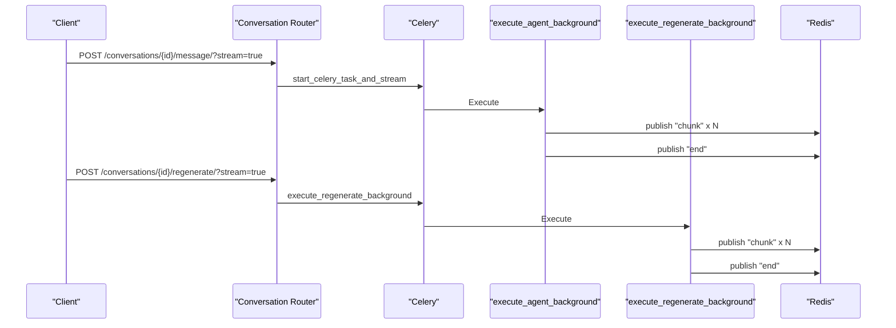

**Diagram sources**
- [app/modules/conversations/conversations_router.py](file://app/modules/conversations/conversations_router.py#L288-L417)
- [app/celery/tasks/agent_tasks.py](file://app/celery/tasks/agent_tasks.py#L249-L460)
- [app/modules/conversations/utils/redis_streaming.py](file://app/modules/conversations/utils/redis_streaming.py#L21-L63)