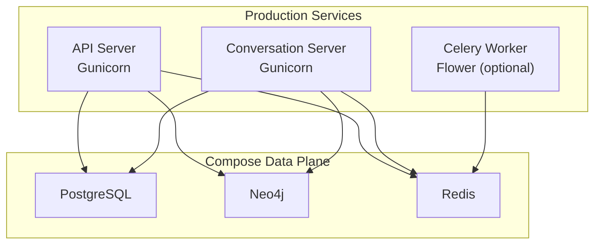
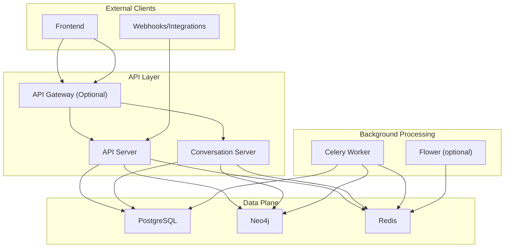
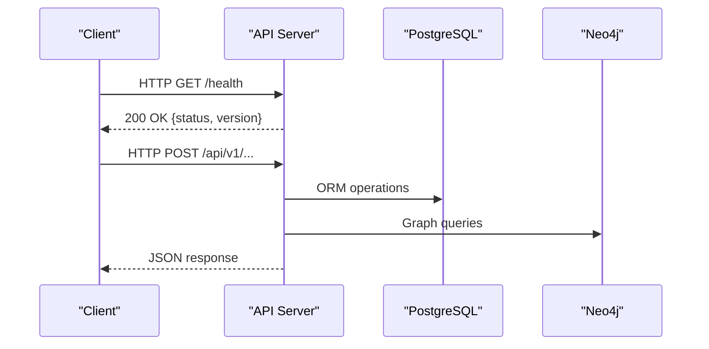
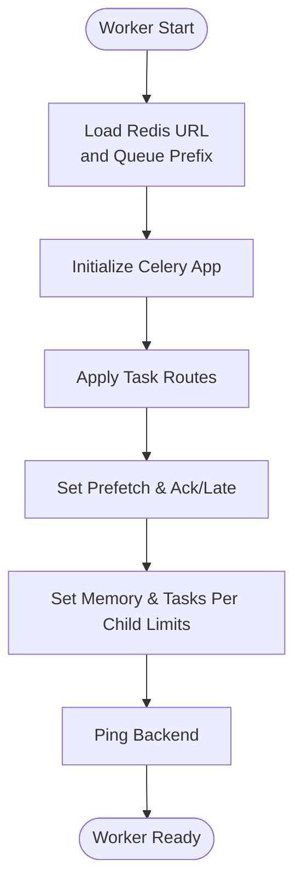
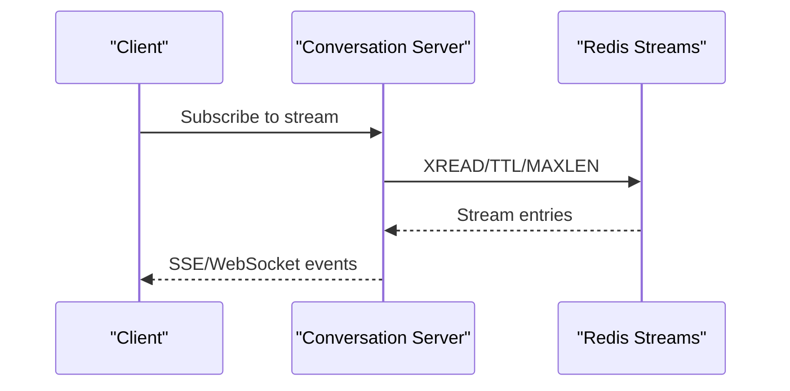
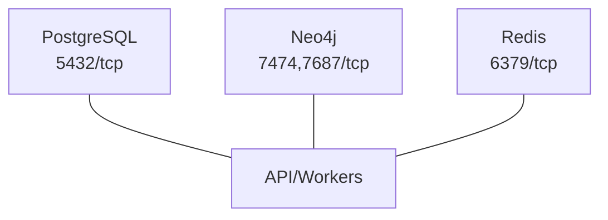
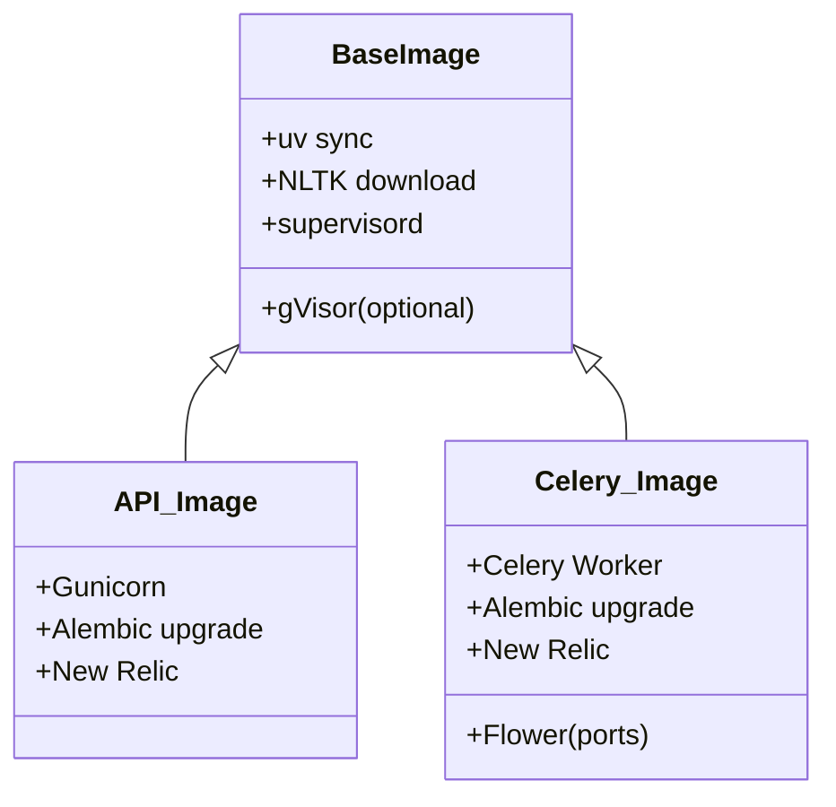
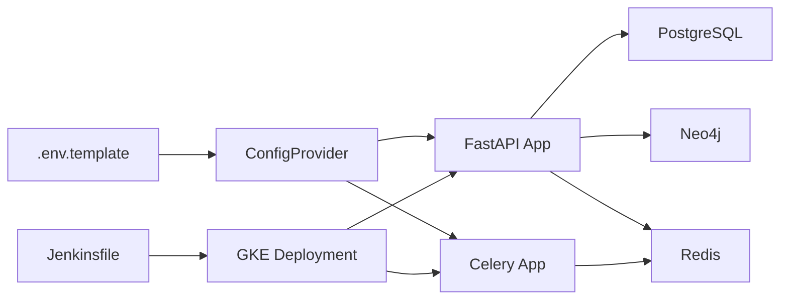

# Deployment Architecture

<cite>
**Referenced Files in This Document**
- [docker-compose.yaml](file://docker-compose.yaml)
- [dockerfile](file://dockerfile)
- [supervisord.conf](file://supervisord.conf)
- [deployment/prod/mom-api/api.Dockerfile](file://deployment/prod/mom-api/api.Dockerfile)
- [deployment/prod/convo-server/convo.Dockerfile](file://deployment/prod/convo-server/convo.Dockerfile)
- [deployment/prod/celery/celery.Dockerfile](file://deployment/prod/celery/celery.Dockerfile)
- [deployment/prod/mom-api/mom-api-supervisord.conf](file://deployment/prod/mom-api/mom-api-supervisord.conf)
- [deployment/prod/convo-server/convo-api-supervisord.conf](file://deployment/prod/convo-server/convo-api-supervisord.conf)
- [deployment/prod/celery/celery-api-supervisord.conf](file://deployment/prod/celery/celery-api-supervisord.conf)
- [app/main.py](file://app/main.py)
- [app/celery/celery_app.py](file://app/celery/celery_app.py)
- [app/celery/worker.py](file://app/celery/worker.py)
- [app/core/config_provider.py](file://app/core/config_provider.py)
- [.env.template](file://.env.template)
- [Jenkinsfile](file://Jenkinsfile)
</cite>

## Table of Contents
1. [Introduction](#introduction)
2. [Project Structure](#project-structure)
3. [Core Components](#core-components)
4. [Architecture Overview](#architecture-overview)
5. [Detailed Component Analysis](#detailed-component-analysis)
6. [Dependency Analysis](#dependency-analysis)
7. [Performance Considerations](#performance-considerations)
8. [Troubleshooting Guide](#troubleshooting-guide)
9. [Conclusion](#conclusion)
10. [Appendices](#appendices)

## Introduction
This document describes Potpie’s deployment architecture with a focus on containerized microservices and production-grade topology. It explains the multi-container Docker Compose setup, the roles of API servers, Celery workers, background processing, and streaming services. It also covers the deployment topology, scaling strategies, environment-specific configurations, infrastructure requirements, CI/CD integration, health checks, and monitoring.

## Project Structure
Potpie uses a layered structure:
- Application code under app/ implements the FastAPI application, Celery workers, and core services.
- Deployment artifacts under deployment/prod define per-service Dockerfiles and supervisord configurations for production.
- Top-level docker-compose.yaml defines the data plane (PostgreSQL, Neo4j, Redis) and network connectivity.
- CI/CD is orchestrated via Jenkinsfile to build, push, and roll out images to Kubernetes/GKE.

**Diagram sources**
- [docker-compose.yaml](file://docker-compose.yaml#L1-L57)
- [deployment/prod/mom-api/api.Dockerfile](file://deployment/prod/mom-api/api.Dockerfile#L1-L46)
- [deployment/prod/convo-server/convo.Dockerfile](file://deployment/prod/convo-server/convo.Dockerfile#L1-L43)
- [deployment/prod/celery/celery.Dockerfile](file://deployment/prod/celery/celery.Dockerfile#L1-L46)

**Section sources**
- [docker-compose.yaml](file://docker-compose.yaml#L1-L57)
- [dockerfile](file://dockerfile#L1-L50)
- [app/main.py](file://app/main.py#L1-L217)

## Core Components
- API Server: FastAPI application served by Gunicorn, exposing REST endpoints and health checks.
- Celery Worker: Background task processor consuming queues from Redis, with task routing and memory management.
- Conversation Streaming: Real-time streaming endpoints integrated with Redis streams and conversation services.
- Data Plane: PostgreSQL for relational persistence, Neo4j for graph storage, Redis for caching and task broker/streaming.
- Monitoring and Observability: Sentry for error tracking, Phoenix for LLM tracing, and New Relic instrumentation.

Key implementation anchors:
- Application entrypoint and routers: [app/main.py](file://app/main.py#L1-L217)
- Celery configuration and task routing: [app/celery/celery_app.py](file://app/celery/celery_app.py#L1-L473)
- Celery worker registration and startup: [app/celery/worker.py](file://app/celery/worker.py#L1-L41)
- Environment-driven configuration provider: [app/core/config_provider.py](file://app/core/config_provider.py#L1-L246)
- Environment template: [.env.template](file://.env.template#L1-L116)

**Section sources**
- [app/main.py](file://app/main.py#L147-L183)
- [app/celery/celery_app.py](file://app/celery/celery_app.py#L80-L129)
- [app/celery/worker.py](file://app/celery/worker.py#L17-L34)
- [app/core/config_provider.py](file://app/core/config_provider.py#L142-L152)
- [.env.template](file://.env.template#L1-L116)

## Architecture Overview
The deployment follows a containerized microservices model:
- API services (API and Conversation) run behind Gunicorn with health endpoints.
- Celery workers handle long-running tasks and integrate with Redis for queuing and visibility timeouts.
- Redis serves as the broker for Celery and the transport for streaming conversations.
- PostgreSQL stores relational data; Neo4j stores graph data for knowledge representation.
- Production images are built with dedicated Dockerfiles and supervised startup via supervisord.

**Diagram sources**
- [app/main.py](file://app/main.py#L173-L183)
- [app/celery/celery_app.py](file://app/celery/celery_app.py#L67-L129)
- [docker-compose.yaml](file://docker-compose.yaml#L1-L57)

## Detailed Component Analysis

### API Server (Gunicorn)
- Entrypoint initializes FastAPI, sets CORS, logging, and registers routers.
- Health endpoint exposed at /health with version metadata.
- Supervisord configuration runs Gunicorn with uvicorn workers and binds to 8001.

**Diagram sources**
- [app/main.py](file://app/main.py#L173-L183)
- [app/main.py](file://app/main.py#L147-L172)

**Section sources**
- [app/main.py](file://app/main.py#L147-L183)
- [deployment/prod/mom-api/mom-api-supervisord.conf](file://deployment/prod/mom-api/mom-api-supervisord.conf#L5-L13)
- [deployment/prod/convo-server/convo-api-supervisord.conf](file://deployment/prod/convo-server/convo-api-supervisord.conf#L5-L13)

### Celery Worker (Background Processing)
- Celery app configured with Redis broker/backend, task routes, and worker policies.
- Worker starts with concurrency and memory limits to prevent leaks.
- Phoenix tracing and LiteLLM synchronization adjustments for Celery.

**Diagram sources**
- [app/celery/celery_app.py](file://app/celery/celery_app.py#L23-L129)

**Section sources**
- [app/celery/celery_app.py](file://app/celery/celery_app.py#L67-L129)
- [app/celery/worker.py](file://app/celery/worker.py#L17-L34)
- [deployment/prod/celery/celery-api-supervisord.conf](file://deployment/prod/celery/celery-api-supervisord.conf#L5-L13)

### Conversation Streaming
- Redis stream TTL and max length configurable via environment.
- Stream prefix and media attachments handled by conversation services.
- Streaming endpoints integrate with Redis streams for real-time updates.

**Diagram sources**
- [app/core/config_provider.py](file://app/core/config_provider.py#L208-L218)

**Section sources**
- [app/core/config_provider.py](file://app/core/config_provider.py#L208-L218)

### Data Plane (PostgreSQL, Neo4j, Redis)
- PostgreSQL: relational data, healthchecked via pg_isready.
- Neo4j: graph data with APOC plugin enabled.
- Redis: broker/backend for Celery, caching, and streaming.

**Diagram sources**
- [docker-compose.yaml](file://docker-compose.yaml#L2-L35)

**Section sources**
- [docker-compose.yaml](file://docker-compose.yaml#L2-L35)

### Container Images and Supervision
- Base image builds with uv, NLTK data, and gVisor (optional).
- Production images use dedicated Dockerfiles and supervisord configs per service.
- API services run Gunicorn; Celery workers run Celery with Flower exposure.

**Diagram sources**
- [dockerfile](file://dockerfile#L1-L50)
- [deployment/prod/mom-api/api.Dockerfile](file://deployment/prod/mom-api/api.Dockerfile#L1-L46)
- [deployment/prod/celery/celery.Dockerfile](file://deployment/prod/celery/celery.Dockerfile#L1-L46)

**Section sources**
- [dockerfile](file://dockerfile#L1-L50)
- [deployment/prod/mom-api/api.Dockerfile](file://deployment/prod/mom-api/api.Dockerfile#L1-L46)
- [deployment/prod/convo-server/convo.Dockerfile](file://deployment/prod/convo-server/convo.Dockerfile#L1-L43)
- [deployment/prod/celery/celery.Dockerfile](file://deployment/prod/celery/celery.Dockerfile#L1-L46)

## Dependency Analysis
- Application depends on environment variables for databases, Neo4j, Redis, and external providers.
- Celery depends on Redis for broker/backend and task routing.
- API services depend on PostgreSQL and Neo4j for persistence and graph operations.
- CI/CD pipeline builds images and deploys to Kubernetes/GKE.

**Diagram sources**
- [.env.template](file://.env.template#L1-L116)
- [app/core/config_provider.py](file://app/core/config_provider.py#L142-L152)
- [app/main.py](file://app/main.py#L147-L172)
- [app/celery/celery_app.py](file://app/celery/celery_app.py#L23-L35)
- [Jenkinsfile](file://Jenkinsfile#L1-L167)

**Section sources**
- [.env.template](file://.env.template#L1-L116)
- [app/core/config_provider.py](file://app/core/config_provider.py#L142-L152)
- [app/main.py](file://app/main.py#L147-L172)
- [app/celery/celery_app.py](file://app/celery/celery_app.py#L23-L35)
- [Jenkinsfile](file://Jenkinsfile#L1-L167)

## Performance Considerations
- Celery worker tuning: prefetch multiplier, late acks, time limits, memory limits, and tasks-per-child to mitigate leaks.
- Redis visibility timeout and stream limits to manage long-running tasks and streaming throughput.
- Gunicorn worker count derived from CPU units for optimal concurrency.
- gVisor isolation for command execution where supported.

Recommendations:
- Monitor worker memory and restart cadence; adjust CELERY_WORKER_MAX_MEMORY_KB and worker_max_tasks_per_child based on workload.
- Tune Redis stream TTL and MAX_LEN for streaming workloads.
- Scale Gunicorn workers horizontally via replicas and vertical scaling via CPU/memory requests in Kubernetes.

**Section sources**
- [app/celery/celery_app.py](file://app/celery/celery_app.py#L107-L126)
- [app/core/config_provider.py](file://app/core/config_provider.py#L208-L218)
- [dockerfile](file://dockerfile#L26-L31)

## Troubleshooting Guide
Common issues and remedies:
- Redis connectivity: Verify REDIS credentials and URL construction; Celery logs sanitized URL for inspection.
- Database migrations: Alembic upgrade runs on service startup; ensure environment variables are loaded.
- Health checks: Use /health endpoint to confirm application readiness and version.
- Celery worker stability: Memory and task limits prevent leaks; monitor logs for async handler cleanup and LiteLLM configuration.
- CI/CD rollback: Jenkins pipeline rolls back on failure; verify pod status post-deploy.

**Section sources**
- [app/celery/celery_app.py](file://app/celery/celery_app.py#L37-L78)
- [deployment/prod/mom-api/mom-api-supervisord.conf](file://deployment/prod/mom-api/mom-api-supervisord.conf#L5-L13)
- [app/main.py](file://app/main.py#L173-L183)
- [Jenkinsfile](file://Jenkinsfile#L116-L130)

## Conclusion
Potpie’s deployment architecture leverages containerized microservices with clear separation of concerns: API servers for request handling, Celery workers for background processing, and Redis for queuing and streaming. The data plane integrates PostgreSQL and Neo4j for relational and graph storage respectively. The CI/CD pipeline automates building and deploying images to Kubernetes/GKE, while health checks, monitoring, and observability provide operational insights.

## Appendices

### Environment Variables Reference
- Database: POSTGRES_SERVER, NEO4J_URI, NEO4J_USERNAME, NEO4J_PASSWORD
- Redis: REDISHOST, REDISPORT, REDISUSER, REDISPASSWORD, BROKER_URL, CELERY_QUEUE_NAME
- Providers: OPENAI_API_KEY, ANTHROPIC_API_KEY, OPENROUTER_API_KEY, FIRECRAWL_API_KEY
- Storage: OBJECT_STORAGE_PROVIDER, GCS_PROJECT_ID, GCS_BUCKET_NAME, S3_BUCKET_NAME, AWS_REGION, AZURE_ACCOUNT_NAME
- Tracing: PHOENIX_ENABLED, PHOENIX_COLLECTOR_ENDPOINT, PHOENIX_PROJECT_NAME
- Development: isDevelopmentMode, ENV, CORS_ALLOWED_ORIGINS

**Section sources**
- [.env.template](file://.env.template#L1-L116)

### CI/CD Pipeline Overview
- Branch-based environment selection, Docker build/push, GKE authentication, manual approval gate, and rollback on failure.
- Image tagging uses Git commit short SHA; deployment updates the Kubernetes deployment and waits for rollout status.

**Section sources**
- [Jenkinsfile](file://Jenkinsfile#L1-L167)