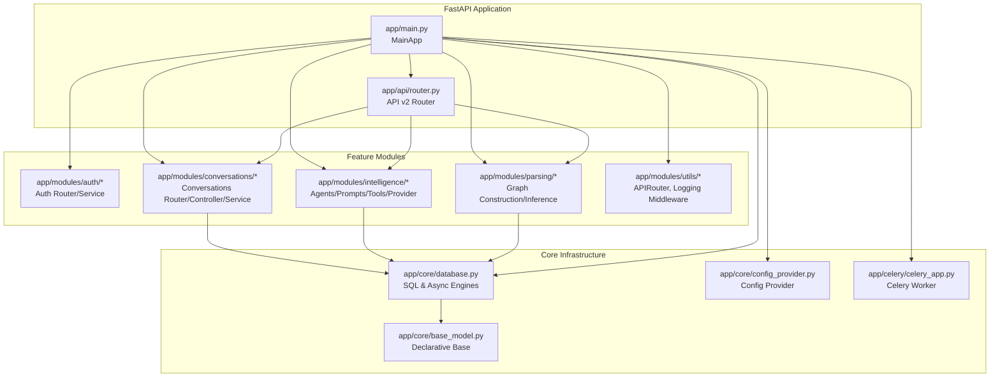
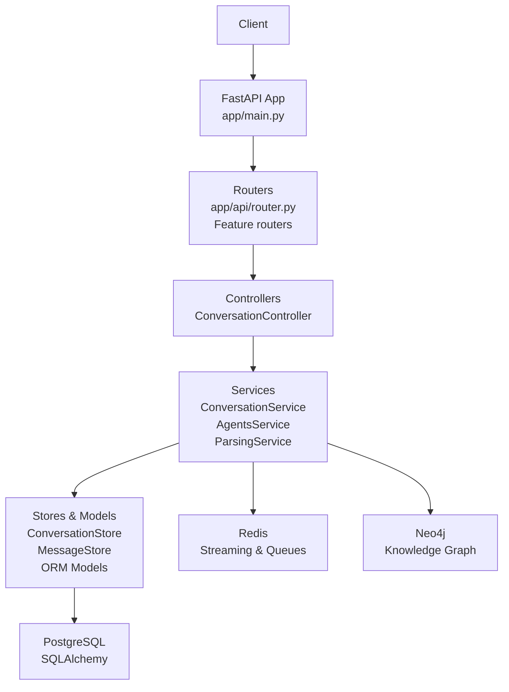
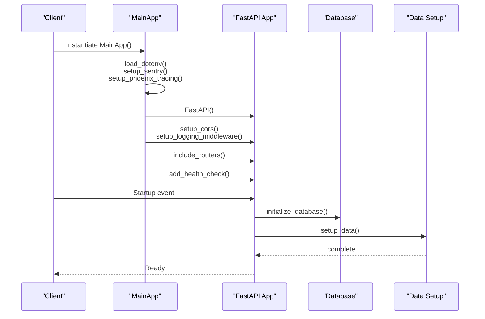
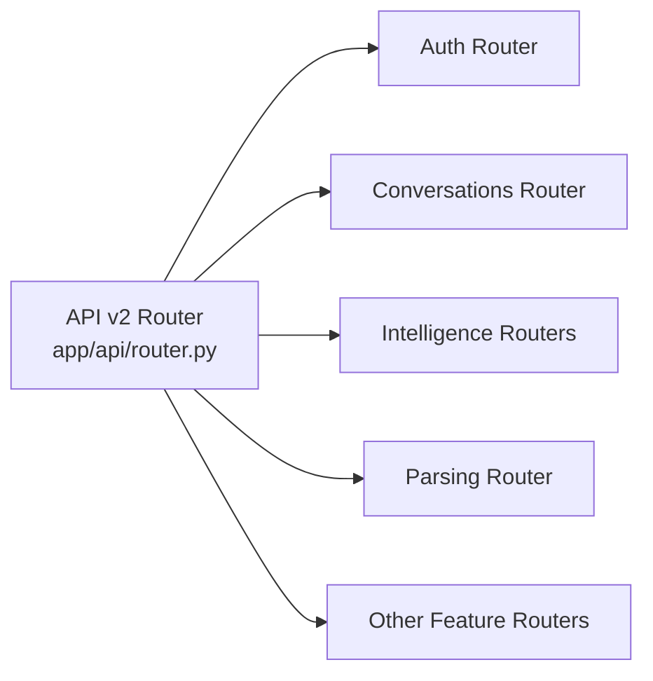
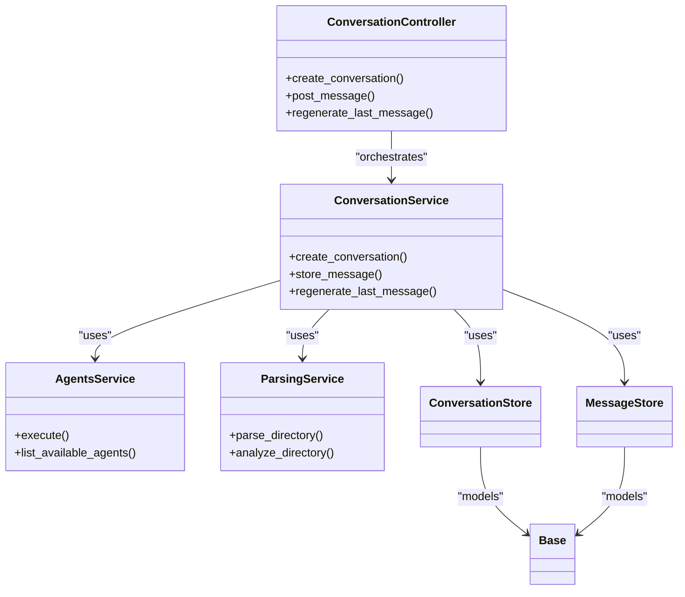
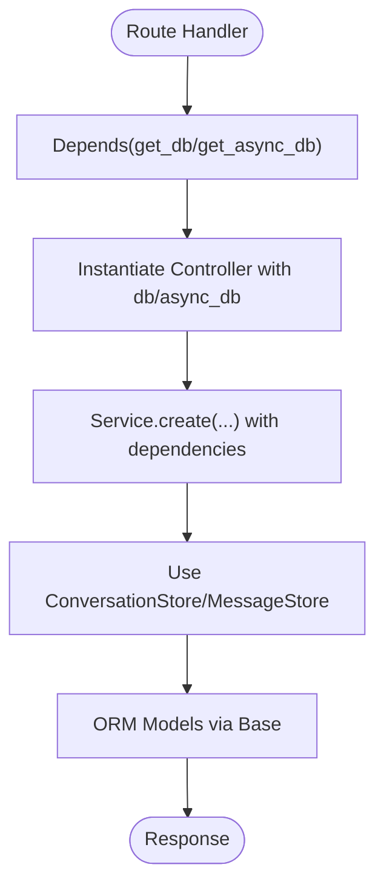
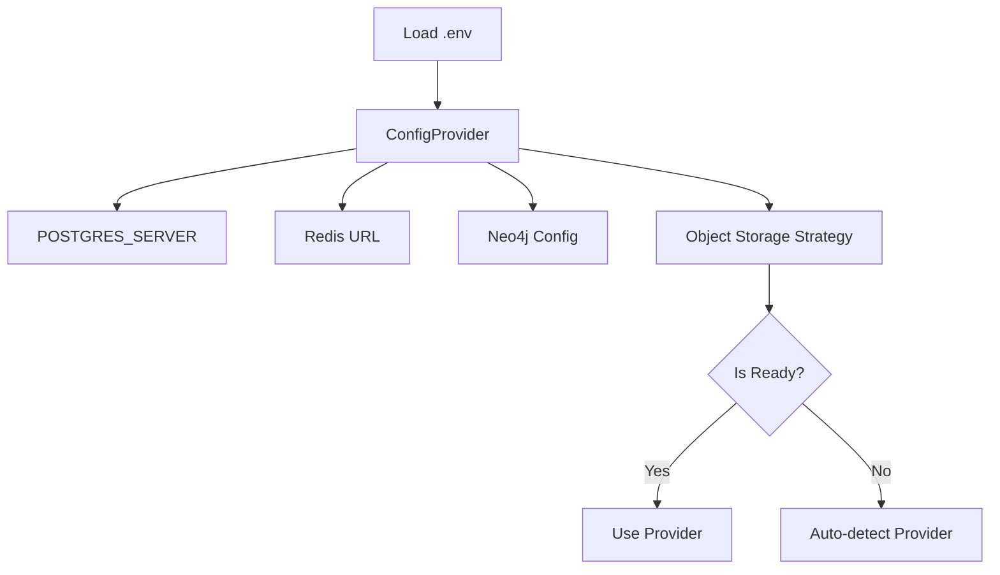
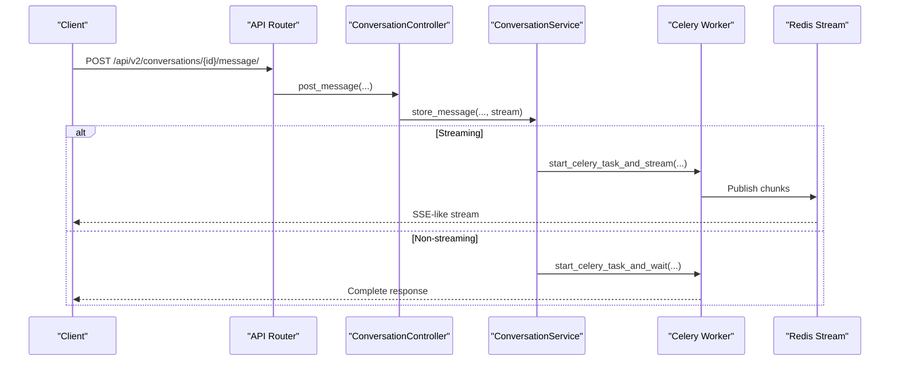
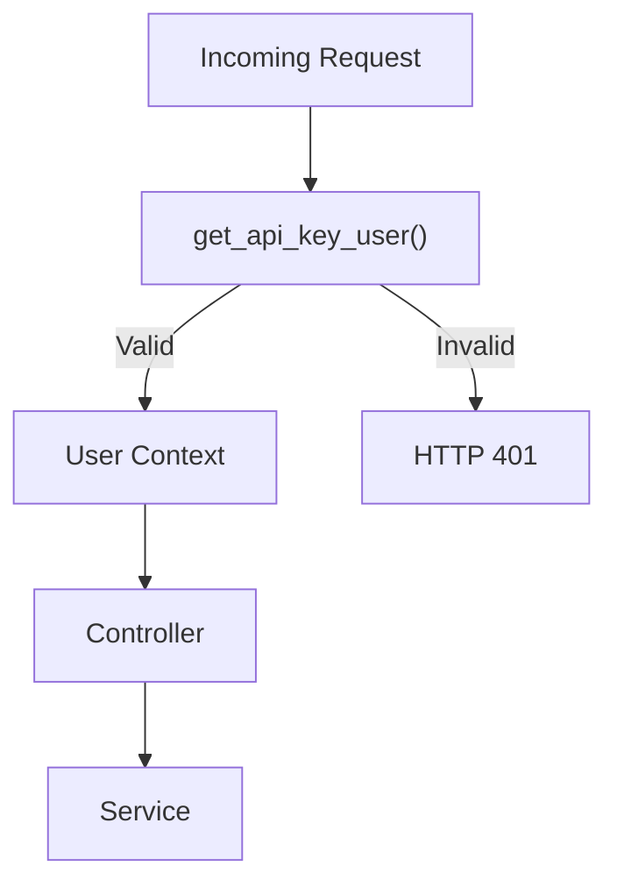
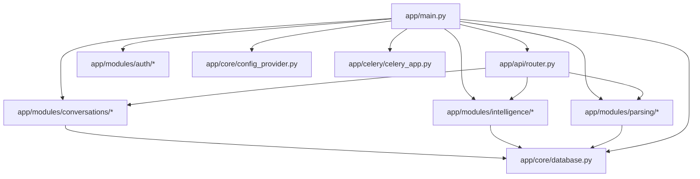

# System Design Overview

<cite>
**Referenced Files in This Document**
- [app/main.py](file://app/main.py)
- [app/api/router.py](file://app/api/router.py)
- [app/modules/utils/APIRouter.py](file://app/modules/utils/APIRouter.py)
- [app/core/database.py](file://app/core/database.py)
- [app/core/base_model.py](file://app/core/base_model.py)
- [app/core/config_provider.py](file://app/core/config_provider.py)
- [app/celery/celery_app.py](file://app/celery/celery_app.py)
- [app/modules/conversations/conversation/conversation_controller.py](file://app/modules/conversations/conversation/conversation_controller.py)
- [app/modules/conversations/conversation/conversation_service.py](file://app/modules/conversations/conversation/conversation_service.py)
- [app/modules/intelligence/agents/agents_service.py](file://app/modules/intelligence/agents/agents_service.py)
- [app/modules/parsing/graph_construction/parsing_service.py](file://app/modules/parsing/graph_construction/parsing_service.py)
- [app/modules/auth/auth_service.py](file://app/modules/auth/auth_service.py)
- [app/modules/utils/logging_middleware.py](file://app/modules/utils/logging_middleware.py)
</cite>

## Table of Contents
1. [Introduction](#introduction)
2. [Project Structure](#project-structure)
3. [Core Components](#core-components)
4. [Architecture Overview](#architecture-overview)
5. [Detailed Component Analysis](#detailed-component-analysis)
6. [Dependency Analysis](#dependency-analysis)
7. [Performance Considerations](#performance-considerations)
8. [Troubleshooting Guide](#troubleshooting-guide)
9. [Conclusion](#conclusion)

## Introduction
This document presents Potpie’s microservices-based backend architecture centered on a FastAPI application. The system emphasizes modular routers, layered architecture (presentation, business logic, data access), dependency injection, and robust configuration management. It leverages Celery for asynchronous task processing, Redis for streaming and caching, and integrates with Neo4j for knowledge graph operations. The design prioritizes maintainability, scalability, and observability through structured routing, centralized configuration, and middleware-driven logging.

## Project Structure
Potpie organizes functionality by feature areas under app/modules, each containing routers, controllers, services, stores, and schemas. A central FastAPI application composes modular routers and initializes infrastructure on startup. Supporting modules manage database engines, configuration providers, and logging middleware.

**Diagram sources**
- [app/main.py](file://app/main.py#L147-L171)
- [app/api/router.py](file://app/api/router.py#L48-L318)
- [app/core/database.py](file://app/core/database.py#L13-L52)
- [app/core/base_model.py](file://app/core/base_model.py#L8-L16)
- [app/core/config_provider.py](file://app/core/config_provider.py#L19-L246)
- [app/celery/celery_app.py](file://app/celery/celery_app.py#L67-L129)

**Section sources**
- [app/main.py](file://app/main.py#L147-L171)
- [app/api/router.py](file://app/api/router.py#L48-L318)
- [app/core/database.py](file://app/core/database.py#L13-L52)
- [app/core/base_model.py](file://app/core/base_model.py#L8-L16)
- [app/core/config_provider.py](file://app/core/config_provider.py#L19-L246)
- [app/celery/celery_app.py](file://app/celery/celery_app.py#L67-L129)

## Core Components
- FastAPI Application Bootstrap: Initializes environment, Sentry, Phoenix tracing, CORS, logging middleware, database, and registers modular routers.
- Modular Routers: Each feature area defines its own router with APIRoute decorator extension for trailing slash normalization.
- Controllers and Services: Presentation controllers orchestrate service layer operations; services encapsulate business logic and dependencies.
- Data Access: SQLAlchemy for synchronous ORM and asyncpg for asynchronous sessions; dependency injection via get_db/get_async_db.
- Configuration Management: Centralized provider for environment-backed settings and object storage strategies.
- Asynchronous Task Execution: Celery workers handle long-running tasks with Redis transport and task routing.

**Section sources**
- [app/main.py](file://app/main.py#L46-L211)
- [app/modules/utils/APIRouter.py](file://app/modules/utils/APIRouter.py#L7-L27)
- [app/modules/conversations/conversation/conversation_controller.py](file://app/modules/conversations/conversation/conversation_controller.py#L33-L51)
- [app/modules/conversations/conversation/conversation_service.py](file://app/modules/conversations/conversation/conversation_service.py#L73-L164)
- [app/core/database.py](file://app/core/database.py#L100-L116)
- [app/core/config_provider.py](file://app/core/config_provider.py#L19-L246)
- [app/celery/celery_app.py](file://app/celery/celery_app.py#L67-L129)

## Architecture Overview
The system follows a layered architecture:
- Presentation Layer: FastAPI routers and controllers expose endpoints and coordinate service calls.
- Business Logic Layer: Services encapsulate domain logic, orchestrate tools/providers, and manage cross-cutting concerns.
- Data Access Layer: Stores and models abstract persistence; SQLAlchemy and async sessions provide transactional boundaries.

**Diagram sources**
- [app/main.py](file://app/main.py#L147-L171)
- [app/api/router.py](file://app/api/router.py#L97-L318)
- [app/modules/conversations/conversation/conversation_controller.py](file://app/modules/conversations/conversation/conversation_controller.py#L33-L51)
- [app/modules/conversations/conversation/conversation_service.py](file://app/modules/conversations/conversation/conversation_service.py#L73-L164)
- [app/modules/intelligence/agents/agents_service.py](file://app/modules/intelligence/agents/agents_service.py#L47-L66)
- [app/modules/parsing/graph_construction/parsing_service.py](file://app/modules/parsing/graph_construction/parsing_service.py#L33-L60)
- [app/core/database.py](file://app/core/database.py#L13-L52)

## Detailed Component Analysis

### FastAPI Application Bootstrapping
- Environment and Observability: Loads .env, sets tokenization behavior, initializes Sentry and Phoenix tracing conditionally.
- Middleware: Adds CORS and a LoggingContextMiddleware that injects request_id, path, and user_id into logs.
- Database Initialization: Creates tables on startup and seeds development data or initializes Firebase in production.
- Router Registration: Includes modular routers under /api/v1 and /api/v2 prefixes with tags for grouping.
- Health Endpoint: Provides version information derived from Git.

**Diagram sources**
- [app/main.py](file://app/main.py#L46-L211)

**Section sources**
- [app/main.py](file://app/main.py#L46-L211)

### Modular Router-Based Organization
- API v2 Router: Centralized endpoint definitions for conversations, parsing, search, integrations, and more, with API key authentication and usage checks.
- Feature Routers: Each module defines its own router (e.g., auth, conversations, intelligence, parsing) and is included by MainApp.
- APIRoute Extension: Custom APIRouter normalizes trailing slashes to ensure consistent endpoint shapes.

**Diagram sources**
- [app/api/router.py](file://app/api/router.py#L48-L318)
- [app/modules/utils/APIRouter.py](file://app/modules/utils/APIRouter.py#L7-L27)
- [app/main.py](file://app/main.py#L147-L171)

**Section sources**
- [app/api/router.py](file://app/api/router.py#L48-L318)
- [app/modules/utils/APIRouter.py](file://app/modules/utils/APIRouter.py#L7-L27)
- [app/main.py](file://app/main.py#L147-L171)

### Layered Architecture and Separation of Concerns
- Presentation: Controllers translate HTTP requests into domain actions and delegate to services.
- Business Logic: Services encapsulate workflows, validate inputs, and coordinate tools/providers.
- Data Access: Stores and models abstract persistence; dependency injection supplies sessions.

**Diagram sources**
- [app/modules/conversations/conversation/conversation_controller.py](file://app/modules/conversations/conversation/conversation_controller.py#L33-L51)
- [app/modules/conversations/conversation/conversation_service.py](file://app/modules/conversations/conversation/conversation_service.py#L73-L164)
- [app/modules/intelligence/agents/agents_service.py](file://app/modules/intelligence/agents/agents_service.py#L47-L66)
- [app/modules/parsing/graph_construction/parsing_service.py](file://app/modules/parsing/graph_construction/parsing_service.py#L33-L60)
- [app/core/base_model.py](file://app/core/base_model.py#L8-L16)

**Section sources**
- [app/modules/conversations/conversation/conversation_controller.py](file://app/modules/conversations/conversation/conversation_controller.py#L33-L51)
- [app/modules/conversations/conversation/conversation_service.py](file://app/modules/conversations/conversation/conversation_service.py#L73-L164)
- [app/modules/intelligence/agents/agents_service.py](file://app/modules/intelligence/agents/agents_service.py#L47-L66)
- [app/modules/parsing/graph_construction/parsing_service.py](file://app/modules/parsing/graph_construction/parsing_service.py#L33-L60)
- [app/core/base_model.py](file://app/core/base_model.py#L8-L16)

### Dependency Injection Patterns
- Database Sessions: get_db for synchronous and get_async_db for asynchronous routes; dependency injection resolves sessions per request.
- Service Composition: Controllers construct services with required dependencies (stores, providers, services).
- Configuration: ConfigProvider centralizes environment-backed settings and strategies.

**Diagram sources**
- [app/api/router.py](file://app/api/router.py#L103-L105)
- [app/modules/conversations/conversation/conversation_controller.py](file://app/modules/conversations/conversation/conversation_controller.py#L33-L51)
- [app/modules/conversations/conversation/conversation_service.py](file://app/modules/conversations/conversation/conversation_service.py#L126-L164)
- [app/core/database.py](file://app/core/database.py#L100-L116)
- [app/core/base_model.py](file://app/core/base_model.py#L8-L16)

**Section sources**
- [app/api/router.py](file://app/api/router.py#L103-L105)
- [app/modules/conversations/conversation/conversation_controller.py](file://app/modules/conversations/conversation/conversation_controller.py#L33-L51)
- [app/modules/conversations/conversation/conversation_service.py](file://app/modules/conversations/conversation/conversation_service.py#L126-L164)
- [app/core/database.py](file://app/core/database.py#L100-L116)
- [app/core/base_model.py](file://app/core/base_model.py#L8-L16)

### Configuration Management
- Environment Variables: Loaded via dotenv; used to configure database URLs, Redis, Neo4j, object storage, and feature flags.
- Strategy Pattern: Object storage provider selection uses pluggable strategies with readiness checks.
- Global Overrides: Neo4j configuration can be overridden globally for library usage.

**Diagram sources**
- [app/core/config_provider.py](file://app/core/config_provider.py#L19-L246)

**Section sources**
- [app/core/config_provider.py](file://app/core/config_provider.py#L19-L246)

### Asynchronous Task Execution and Streaming
- Celery Workers: Redis transport, task routing, and worker lifecycle management; LiteLLM logging synchronization to avoid async handler issues.
- Streaming: Redis streams manage conversation streaming; controllers and services integrate with Celery tasks for both streaming and non-streaming responses.

**Diagram sources**
- [app/api/router.py](file://app/api/router.py#L150-L217)
- [app/modules/conversations/conversation/conversation_controller.py](file://app/modules/conversations/conversation/conversation_controller.py#L106-L131)
- [app/modules/conversations/conversation/conversation_service.py](file://app/modules/conversations/conversation/conversation_service.py#L544-L652)
- [app/celery/celery_app.py](file://app/celery/celery_app.py#L67-L129)

**Section sources**
- [app/api/router.py](file://app/api/router.py#L150-L217)
- [app/modules/conversations/conversation/conversation_controller.py](file://app/modules/conversations/conversation/conversation_controller.py#L106-L131)
- [app/modules/conversations/conversation/conversation_service.py](file://app/modules/conversations/conversation/conversation_service.py#L544-L652)
- [app/celery/celery_app.py](file://app/celery/celery_app.py#L67-L129)

### Authentication and Authorization
- API Key Validation: API v2 router validates X-API-Key and optionally INTERNAL_ADMIN_SECRET for administrative actions.
- Firebase Auth: Feature routers may rely on AuthService.check_auth to populate request.state.user for downstream authorization.
- Logging Context: LoggingContextMiddleware reads request.state.user to enrich logs with user_id.

**Diagram sources**
- [app/api/router.py](file://app/api/router.py#L56-L87)
- [app/modules/auth/auth_service.py](file://app/modules/auth/auth_service.py#L48-L104)
- [app/modules/utils/logging_middleware.py](file://app/modules/utils/logging_middleware.py#L33-L59)

**Section sources**
- [app/api/router.py](file://app/api/router.py#L56-L87)
- [app/modules/auth/auth_service.py](file://app/modules/auth/auth_service.py#L48-L104)
- [app/modules/utils/logging_middleware.py](file://app/modules/utils/logging_middleware.py#L33-L59)

## Dependency Analysis
- Coupling: Controllers depend on services; services depend on stores/providers; stores depend on ORM models.
- Cohesion: Each module encapsulates a bounded context (auth, conversations, intelligence, parsing).
- External Dependencies: PostgreSQL, Redis, Neo4j, Sentry, Phoenix, Celery, and LiteLLM.

**Diagram sources**
- [app/main.py](file://app/main.py#L147-L171)
- [app/api/router.py](file://app/api/router.py#L48-L318)
- [app/core/database.py](file://app/core/database.py#L13-L52)
- [app/core/config_provider.py](file://app/core/config_provider.py#L19-L246)
- [app/celery/celery_app.py](file://app/celery/celery_app.py#L67-L129)

**Section sources**
- [app/main.py](file://app/main.py#L147-L171)
- [app/api/router.py](file://app/api/router.py#L48-L318)
- [app/core/database.py](file://app/core/database.py#L13-L52)
- [app/core/config_provider.py](file://app/core/config_provider.py#L19-L246)
- [app/celery/celery_app.py](file://app/celery/celery_app.py#L67-L129)

## Performance Considerations
- Database Pooling: SQLAlchemy engine configured with pool_size, max_overflow, pool_timeout, and pool_recycle; async engine optimized for asyncpg with NullPool for Celery tasks.
- Async Sessions: AsyncSessionLocal reduces overhead for async routes; Celery workers use fresh connections to avoid Future binding issues.
- Redis Streaming: TTL and max length controls for streams; task routing optimizes worker distribution.
- LiteLLM Logging: Synchronous logging configuration in Celery workers to prevent async handler pitfalls.

[No sources needed since this section provides general guidance]

## Troubleshooting Guide
- Health Checks: Use /health to confirm application status and version.
- Logging Context: Ensure LoggingContextMiddleware is active to include request_id and user_id in logs.
- Database Connectivity: Verify POSTGRES_SERVER and pool settings; check echo flag for diagnostics.
- Redis Connectivity: Confirm Redis URL construction and ping results; mask credentials in logs.
- Sentry/Phoenix: Validate DSN and integrations; ensure environment-specific initialization.

**Section sources**
- [app/main.py](file://app/main.py#L173-L183)
- [app/modules/utils/logging_middleware.py](file://app/modules/utils/logging_middleware.py#L20-L59)
- [app/core/database.py](file://app/core/database.py#L13-L52)
- [app/celery/celery_app.py](file://app/celery/celery_app.py#L37-L78)

## Conclusion
Potpie’s backend leverages FastAPI’s performance and automatic documentation capabilities alongside a modular, layered architecture. The design separates presentation, business logic, and data access, enabling maintainability and scalability. Centralized configuration, dependency injection, and Celery-powered asynchronous processing form a robust foundation for microservices-style development across feature domains.