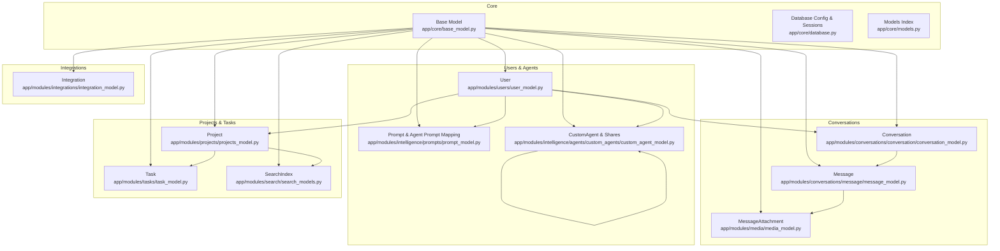
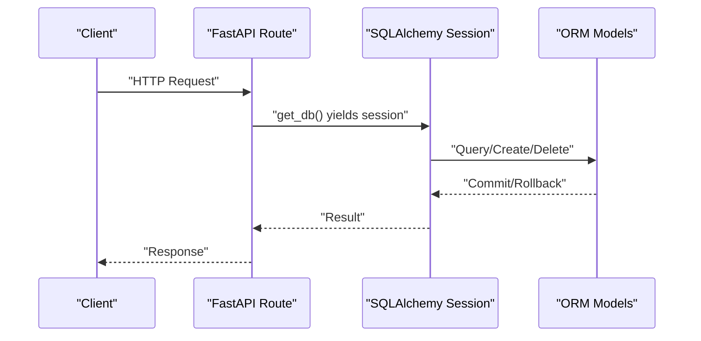
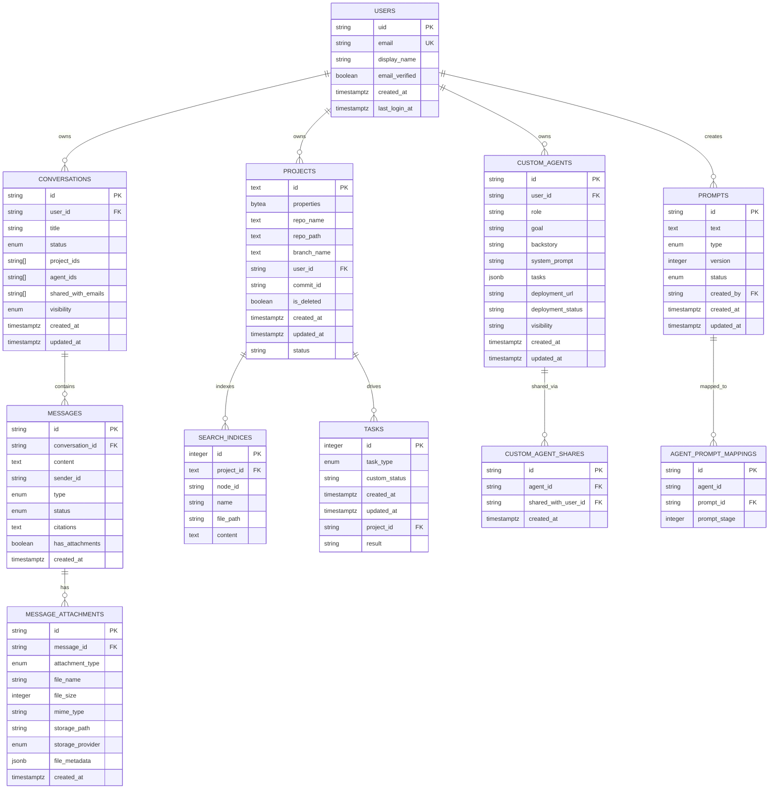
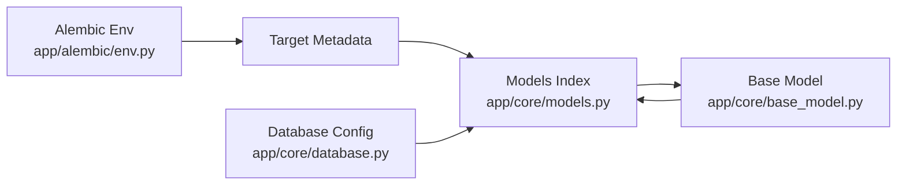

# Data Management

<cite>
**Referenced Files in This Document**
- [app/core/base_model.py](file://app/core/base_model.py)
- [app/core/models.py](file://app/core/models.py)
- [app/core/database.py](file://app/core/database.py)
- [app/alembic/env.py](file://app/alembic/env.py)
- [app/modules/conversations/conversation/conversation_model.py](file://app/modules/conversations/conversation/conversation_model.py)
- [app/modules/conversations/message/message_model.py](file://app/modules/conversations/message/message_model.py)
- [app/modules/users/user_model.py](file://app/modules/users/user_model.py)
- [app/modules/projects/projects_model.py](file://app/modules/projects/projects_model.py)
- [app/modules/integrations/integration_model.py](file://app/modules/integrations/integration_model.py)
- [app/modules/media/media_model.py](file://app/modules/media/media_model.py)
- [app/modules/intelligence/prompts/prompt_model.py](file://app/modules/intelligence/prompts/prompt_model.py)
- [app/modules/intelligence/agents/custom_agents/custom_agent_model.py](file://app/modules/intelligence/agents/custom_agents/custom_agent_model.py)
- [app/modules/search/search_models.py](file://app/modules/search/search_models.py)
- [app/modules/tasks/task_model.py](file://app/modules/tasks/task_model.py)
</cite>

## Table of Contents
1. [Introduction](#introduction)
2. [Project Structure](#project-structure)
3. [Core Components](#core-components)
4. [Architecture Overview](#architecture-overview)
5. [Detailed Component Analysis](#detailed-component-analysis)
6. [Dependency Analysis](#dependency-analysis)
7. [Performance Considerations](#performance-considerations)
8. [Troubleshooting Guide](#troubleshooting-guide)
9. [Conclusion](#conclusion)
10. [Appendices](#appendices)

## Introduction
This document describes Potpie’s data model and data management systems. It covers relational models for users, conversations, messages, projects, agents, integrations, media, prompts, tasks, and search indices; documents entity relationships, primary/foreign keys, indexes, and constraints; explains validation and business rules; outlines data lifecycle management; and details ORM usage with SQLAlchemy, database access patterns, migration and schema evolution via Alembic, and performance considerations. It also clarifies data relationships among conversations, messages, and parsed code data, and addresses security, access control, and privacy topics grounded in the schema.

## Project Structure
Potpie organizes data models under a layered architecture:
- Core ORM base and registry live in app/core.
- Domain models are grouped by feature area under app/modules.
- Migrations are managed by Alembic under app/alembic.
- Database configuration and session factories are centralized in app/core/database.py.

**Diagram sources**
- [app/core/base_model.py](file://app/core/base_model.py#L8-L17)
- [app/core/database.py](file://app/core/database.py#L95-L117)
- [app/core/models.py](file://app/core/models.py#L1-L26)
- [app/modules/conversations/conversation/conversation_model.py](file://app/modules/conversations/conversation/conversation_model.py#L23-L60)
- [app/modules/conversations/message/message_model.py](file://app/modules/conversations/message/message_model.py#L23-L65)
- [app/modules/media/media_model.py](file://app/modules/media/media_model.py#L24-L47)
- [app/modules/users/user_model.py](file://app/modules/users/user_model.py#L17-L59)
- [app/modules/intelligence/prompts/prompt_model.py](file://app/modules/intelligence/prompts/prompt_model.py#L22-L69)
- [app/modules/intelligence/agents/custom_agents/custom_agent_model.py](file://app/modules/intelligence/agents/custom_agents/custom_agent_model.py#L9-L61)
- [app/modules/projects/projects_model.py](file://app/modules/projects/projects_model.py#L21-L66)
- [app/modules/search/search_models.py](file://app/modules/search/search_models.py#L7-L18)
- [app/modules/tasks/task_model.py](file://app/modules/tasks/task_model.py#L17-L29)
- [app/modules/integrations/integration_model.py](file://app/modules/integrations/integration_model.py#L7-L44)

**Section sources**
- [app/core/base_model.py](file://app/core/base_model.py#L1-L17)
- [app/core/models.py](file://app/core/models.py#L1-L26)
- [app/core/database.py](file://app/core/database.py#L1-L117)
- [app/alembic/env.py](file://app/alembic/env.py#L1-L64)

## Core Components
- Base ORM class: Provides automatic table naming and a registry for declarative models.
- Centralized models index: Imports and exposes all domain models for Alembic and application usage.
- Database configuration: Defines synchronous and asynchronous engines, session factories, and special handling for Celery tasks.

Key characteristics:
- Automatic table naming derived from class names.
- Central Base class used by all relational models.
- Environment-driven database URLs and strict connection pooling for sync and async sessions.

**Section sources**
- [app/core/base_model.py](file://app/core/base_model.py#L8-L17)
- [app/core/models.py](file://app/core/models.py#L1-L26)
- [app/core/database.py](file://app/core/database.py#L13-L52)

## Architecture Overview
The data layer uses SQLAlchemy ORM with explicit foreign keys and relationships. Alembic manages schema evolution by comparing the target metadata against the database. Access patterns include:
- Sync ORM sessions for FastAPI routes.
- Async ORM sessions for async endpoints and background tasks.
- Special async session creation for Celery workers to avoid cross-task Future binding issues.

**Diagram sources**
- [app/core/database.py](file://app/core/database.py#L99-L117)

**Section sources**
- [app/core/database.py](file://app/core/database.py#L99-L117)
- [app/alembic/env.py](file://app/alembic/env.py#L40-L64)

## Detailed Component Analysis

### Users
- Purpose: Stores user identity, authentication linkage, organization metadata, and preferences.
- Fields and types:
  - uid (String, PK)
  - email (String, unique)
  - display_name (String)
  - email_verified (Boolean)
  - created_at, last_login_at (TIMESTAMP with timezone)
  - provider_info (JSONB), provider_username (String)
  - organization, organization_name (Strings)
- Relationships:
  - One-to-many with conversations, projects, prompts, custom_agents.
  - One-to-one with user preferences.
  - One-to-many with user auth providers (with cascade delete-orphan).
- Constraints and indexes:
  - Unique constraint on email.
  - Index on uid for fast lookup.
- Validation/business rules:
  - Legacy provider fields retained for backward compatibility.
  - Organization fields support SSO workflows.

**Section sources**
- [app/modules/users/user_model.py](file://app/modules/users/user_model.py#L17-L59)

### Conversations
- Purpose: Encapsulates chat threads per user, supports sharing and visibility.
- Fields and types:
  - id (String, PK)
  - user_id (String, FK to users.uid, CASCADE)
  - title (String)
  - status (Enum: active/archived/deleted)
  - project_ids (Array<String>)
  - agent_ids (Array<String>)
  - shared_with_emails (Array<String>)
  - visibility (Enum: private/public)
  - created_at, updated_at (TIMESTAMP with timezone)
- Relationships:
  - Back-populated user and messages.
  - Projects resolved via array join (viewonly).
- Constraints and indexes:
  - user_id FK with CASCADE.
  - Index on user_id and id.
- Validation/business rules:
  - Array fields for project and agent IDs enable flexible linking without normalized joins.
  - Visibility and shared emails support controlled sharing.

**Section sources**
- [app/modules/conversations/conversation/conversation_model.py](file://app/modules/conversations/conversation/conversation_model.py#L23-L60)

### Messages
- Purpose: Stores individual message entries within a conversation.
- Fields and types:
  - id (String, PK)
  - conversation_id (String, FK to conversations.id, CASCADE)
  - content (Text)
  - sender_id (String)
  - type (Enum: human/ai/system_generated)
  - status (Enum: active/archived/deleted)
  - citations (Text)
  - has_attachments (Boolean)
  - created_at (TIMESTAMP with timezone)
- Relationships:
  - Back-populated conversation.
  - One-to-many attachments (delete-orphan).
- Constraints and indexes:
  - FK conversation_id with CASCADE.
  - Index on conversation_id.
  - Check constraint ensuring sender_id presence for human messages and absence for AI/system-generated.
- Validation/business rules:
  - Sender ID nullability enforced by type.
  - Attachments flag indicates presence for downstream processing.

**Section sources**
- [app/modules/conversations/message/message_model.py](file://app/modules/conversations/message/message_model.py#L23-L65)

### Projects
- Purpose: Represents user-owned repositories and their lifecycle state.
- Fields and types:
  - id (Text, PK)
  - properties (BYTEA)
  - repo_name, repo_path, branch_name (Text)
  - user_id (String, FK to users.uid, CASCADE)
  - commit_id (String)
  - is_deleted (Boolean)
  - created_at, updated_at (TIMESTAMP with timezone)
  - status (String)
- Relationships:
  - Back-populated user.
  - One-to-many with search indices and tasks.
  - Hybrid property resolves conversations linked by project_ids.
- Constraints and indexes:
  - Composite FK on user_id.
  - Check constraint on status enum values.
- Validation/business rules:
  - Status constrained to a closed set indicating lifecycle stages.

**Section sources**
- [app/modules/projects/projects_model.py](file://app/modules/projects/projects_model.py#L21-L66)

### Integrations
- Purpose: Extensible storage for third-party service integrations.
- Fields and types:
  - integration_id (String, PK)
  - name (String)
  - integration_type (String)
  - status (String)
  - active (Boolean)
  - auth_data, scope_data, integration_metadata (JSONB)
  - unique_identifier (String)
  - created_by (String)
  - created_at, updated_at (TIMESTAMP with timezone)
- Notes:
  - JSONB fields enable evolving integration schemas without migrations.
  - Status and active flags manage lifecycle and availability.

**Section sources**
- [app/modules/integrations/integration_model.py](file://app/modules/integrations/integration_model.py#L7-L44)

### Media Attachments
- Purpose: Stores metadata for message attachments.
- Fields and types:
  - id (String, PK)
  - message_id (String, FK to messages.id, CASCADE)
  - attachment_type (Enum: image/video/audio/document)
  - file_name, mime_type (String)
  - file_size (Integer)
  - storage_path (String)
  - storage_provider (Enum: local/gcs/s3/azure)
  - file_metadata (JSONB)
  - created_at (TIMESTAMP with timezone)
- Relationships:
  - FK with CASCADE; relationship maintained in message model.
- Constraints and indexes:
  - FK message_id with CASCADE.
  - Index on message_id.

**Section sources**
- [app/modules/media/media_model.py](file://app/modules/media/media_model.py#L24-L47)

### Prompts and Agent Prompt Mappings
- Purpose: Manages prompt texts, versions, statuses, creators, and agent-stage mappings.
- Prompt model:
  - Fields: id, text (Text), type (Enum: system/human), version (Integer), status (Enum: active/inactive), created_by (FK to users.uid), timestamps.
  - Constraints: unique(text, version, created_by), positive version, timestamp ordering.
- AgentPromptMapping:
  - Fields: id, agent_id, prompt_id (FK to prompts.id, CASCADE), prompt_stage (Integer).
  - Constraint: unique(agent_id, prompt_stage).
- Relationships:
  - Creator back-populates to user.
  - Prompt back-populates to agent mappings.

**Section sources**
- [app/modules/intelligence/prompts/prompt_model.py](file://app/modules/intelligence/prompts/prompt_model.py#L22-L69)

### Custom Agents and Sharing
- Purpose: Stores agent definitions and sharing relationships.
- CustomAgent:
  - Fields: id, user_id (FK to users.uid), role/goal/backstory, system_prompt, tasks (JSONB), deployment info, visibility, timestamps.
  - Relationships: back-populated user and shares.
- CustomAgentShare:
  - Fields: id, agent_id (FK to custom_agents.id, CASCADE), shared_with_user_id (FK to users.uid, CASCADE), timestamps.
  - Relationships: back-populated agent and shared user.
- Constraints:
  - Composite FKs ensure referential integrity.

**Section sources**
- [app/modules/intelligence/agents/custom_agents/custom_agent_model.py](file://app/modules/intelligence/agents/custom_agents/custom_agent_model.py#L9-L61)

### Search Indices
- Purpose: Indexes parsed code and documentation for retrieval.
- Fields and types:
  - id (Integer, PK, indexed)
  - project_id (Text, FK to projects.id, indexed)
  - node_id, name, file_path (String, indexed)
  - content (Text)
- Relationships:
  - Back-populated project.

**Section sources**
- [app/modules/search/search_models.py](file://app/modules/search/search_models.py#L7-L18)

### Tasks
- Purpose: Tracks asynchronous processing tasks for codebase, file, and flow inference.
- Fields and types:
  - id (Integer, PK)
  - task_type (Enum), custom_status (String)
  - created_at, updated_at (DateTime)
  - project_id (String, FK to projects.id)
  - result (String)
- Relationships:
  - Back-populated project.

**Section sources**
- [app/modules/tasks/task_model.py](file://app/modules/tasks/task_model.py#L17-L29)

### Data Relationships Between Conversations, Messages, and Parsed Code Data
- Conversations link to Messages via conversation_id with CASCADE deletion.
- Messages link to MessageAttachments via message_id with CASCADE deletion.
- Projects link to SearchIndex via project_id; conversational context can be associated with project IDs stored in conversations.
- Tasks operate on projects and can drive updates to search indices and parsed code artifacts.

**Diagram sources**
- [app/modules/users/user_model.py](file://app/modules/users/user_model.py#L17-L59)
- [app/modules/conversations/conversation/conversation_model.py](file://app/modules/conversations/conversation/conversation_model.py#L23-L60)
- [app/modules/conversations/message/message_model.py](file://app/modules/conversations/message/message_model.py#L23-L65)
- [app/modules/media/media_model.py](file://app/modules/media/media_model.py#L24-L47)
- [app/modules/projects/projects_model.py](file://app/modules/projects/projects_model.py#L21-L66)
- [app/modules/search/search_models.py](file://app/modules/search/search_models.py#L7-L18)
- [app/modules/tasks/task_model.py](file://app/modules/tasks/task_model.py#L17-L29)
- [app/modules/intelligence/agents/custom_agents/custom_agent_model.py](file://app/modules/intelligence/agents/custom_agents/custom_agent_model.py#L9-L61)
- [app/modules/intelligence/prompts/prompt_model.py](file://app/modules/intelligence/prompts/prompt_model.py#L22-L69)

## Dependency Analysis
- Alembic target metadata is driven by the centralized models index, ensuring migrations reflect all domain models.
- The Base class centralizes table naming and registry, reducing duplication and ensuring consistency.
- Database configuration defines both sync and async engines and specialized session factories for Celery tasks.

**Diagram sources**
- [app/alembic/env.py](file://app/alembic/env.py#L10-L13)
- [app/core/models.py](file://app/core/models.py#L1-L26)
- [app/core/base_model.py](file://app/core/base_model.py#L8-L17)
- [app/core/database.py](file://app/core/database.py#L95-L117)

**Section sources**
- [app/alembic/env.py](file://app/alembic/env.py#L1-L64)
- [app/core/models.py](file://app/core/models.py#L1-L26)
- [app/core/base_model.py](file://app/core/base_model.py#L1-L17)
- [app/core/database.py](file://app/core/database.py#L1-L117)

## Performance Considerations
- Connection pooling and pre-ping:
  - Sync engine configured with pool_size, max_overflow, pool_timeout, pool_recycle, and pool_pre_ping enabled.
  - Async engine configured similarly; pre-ping disabled to avoid event loop issues in Celery workers.
- Session management:
  - Sync sessions via SessionLocal for FastAPI routes.
  - Async sessions via AsyncSessionLocal for async endpoints.
  - Special create_celery_async_session avoids pooled connections for Celery tasks.
- Indexing:
  - Explicit indexes on frequently filtered columns (e.g., conversations.user_id, messages.conversation_id, message_attachments.message_id, search_indices.project_id/node_id/name/file_path).
- Query patterns:
  - Use joined eager loading (selectinload) for relationships where appropriate to reduce N+1 queries.
  - Hybrid property on Project.conversations performs a query per access; consider caching or denormalization if performance becomes a concern.
- Data types:
  - JSONB and BYTEA for extensibility and binary payloads; ensure appropriate GIN/Gist indexes for search-heavy JSONB fields if needed.

**Section sources**
- [app/core/database.py](file://app/core/database.py#L13-L52)
- [app/core/database.py](file://app/core/database.py#L55-L92)
- [app/modules/conversations/conversation/conversation_model.py](file://app/modules/conversations/conversation/conversation_model.py#L27-L32)
- [app/modules/conversations/message/message_model.py](file://app/modules/conversations/message/message_model.py#L27-L32)
- [app/modules/media/media_model.py](file://app/modules/media/media_model.py#L28-L33)
- [app/modules/search/search_models.py](file://app/modules/search/search_models.py#L10-L15)
- [app/modules/projects/projects_model.py](file://app/modules/projects/projects_model.py#L53-L65)

## Troubleshooting Guide
- Migration filename timestamping:
  - Alembic prepends a timestamp to migration revision IDs during generation to ensure chronological ordering.
- Offline migrations:
  - Offline mode is explicitly disabled; always run migrations online against the configured database URL.
- Session lifecycle:
  - For Celery tasks, use create_celery_async_session to avoid cross-task Future binding issues caused by pooled connections.
- Constraint violations:
  - Check constraints on messages enforce sender_id validity per message type.
  - Check constraints on projects enforce status values.
  - Unique constraints on prompts and agent prompt mappings prevent duplicates.

**Section sources**
- [app/alembic/env.py](file://app/alembic/env.py#L30-L38)
- [app/alembic/env.py](file://app/alembic/env.py#L60-L64)
- [app/core/database.py](file://app/core/database.py#L55-L92)
- [app/modules/conversations/message/message_model.py](file://app/modules/conversations/message/message_model.py#L58-L64)
- [app/modules/projects/projects_model.py](file://app/modules/projects/projects_model.py#L40-L46)
- [app/modules/intelligence/prompts/prompt_model.py](file://app/modules/intelligence/prompts/prompt_model.py#L44-L50)
- [app/modules/intelligence/agents/custom_agents/custom_agent_model.py](file://app/modules/intelligence/agents/custom_agents/custom_agent_model.py#L66-L68)

## Conclusion
Potpie’s data model centers on a clean separation of concerns across users, conversations, messages, projects, agents, integrations, media, prompts, tasks, and search indices. The schema enforces referential integrity via explicit foreign keys and constraints, leverages JSONB and BYTEA for extensibility, and employs Alembic for robust schema evolution. SQLAlchemy ORM provides consistent access patterns, while careful indexing and session management support performance. Security and privacy are addressed through user ownership, optional sharing, and SSO-related fields in the user model.

## Appendices

### Data Lifecycle Management
- Conversations:
  - Created per user; archived or deleted via status transitions.
  - Messages cascade-delete with conversations.
- Projects:
  - Managed by users; lifecycle tracked by status; soft-deleted via is_deleted flag.
- Tasks:
  - Driven by project state; results stored for later retrieval.
- Integrations:
  - Active/inactive/status flags control availability and operational state.

**Section sources**
- [app/modules/conversations/conversation/conversation_model.py](file://app/modules/conversations/conversation/conversation_model.py#L12-L16)
- [app/modules/projects/projects_model.py](file://app/modules/projects/projects_model.py#L34-L38)
- [app/modules/tasks/task_model.py](file://app/modules/tasks/task_model.py#L21-L26)
- [app/modules/integrations/integration_model.py](file://app/modules/integrations/integration_model.py#L17-L19)

### Data Validation and Business Rules Summary
- Message sender_id vs. type:
  - Human messages require sender_id; AI/system messages must not have sender_id.
- Prompt versioning:
  - Unique prompt definition per text/version/creator; version must be positive; timestamps must be ordered.
- Project status:
  - Enforced to a fixed set of lifecycle values.

**Section sources**
- [app/modules/conversations/message/message_model.py](file://app/modules/conversations/message/message_model.py#L58-L64)
- [app/modules/intelligence/prompts/prompt_model.py](file://app/modules/intelligence/prompts/prompt_model.py#L44-L50)
- [app/modules/projects/projects_model.py](file://app/modules/projects/projects_model.py#L42-L46)

### Schema Evolution and Migration Strategies
- Target metadata:
  - Alembic compares against app/core/base_model.Base.metadata, which is populated by app/core/models.py.
- Timestamped revisions:
  - Automatic timestamp prepending ensures predictable ordering.
- Online-only migrations:
  - Offline mode is disabled; always run migrations against the live database.

**Section sources**
- [app/alembic/env.py](file://app/alembic/env.py#L10-L13)
- [app/alembic/env.py](file://app/alembic/env.py#L30-L38)
- [app/alembic/env.py](file://app/alembic/env.py#L60-L64)

### Access Control and Privacy
- Ownership:
  - Users own conversations, projects, prompts, and custom agents.
- Sharing:
  - Conversations support sharing via shared_with_emails and visibility controls.
  - Custom agents support sharing via CustomAgentShare records.
- SSO:
  - Organization and organization_name fields support SSO workflows; user auth providers are linked to users.

**Section sources**
- [app/modules/users/user_model.py](file://app/modules/users/user_model.py#L31-L34)
- [app/modules/users/user_model.py](file://app/modules/users/user_model.py#L43-L47)
- [app/modules/conversations/conversation/conversation_model.py](file://app/modules/conversations/conversation/conversation_model.py#L46-L47)
- [app/modules/intelligence/agents/custom_agents/custom_agent_model.py](file://app/modules/intelligence/agents/custom_agents/custom_agent_model.py#L33-L35)