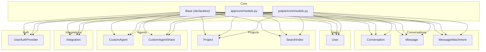
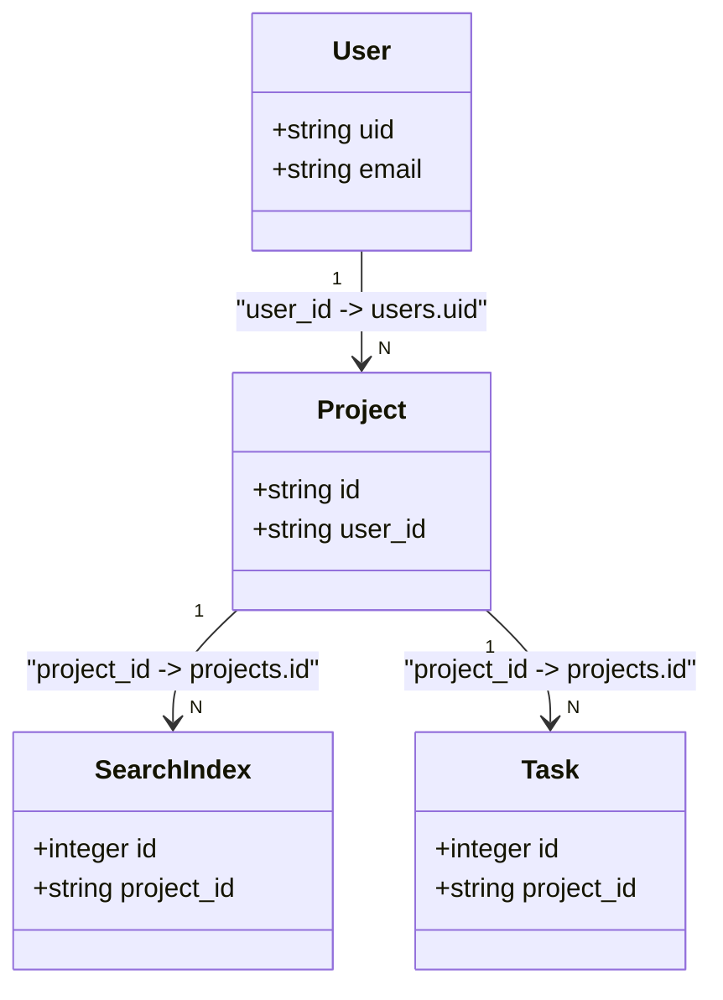
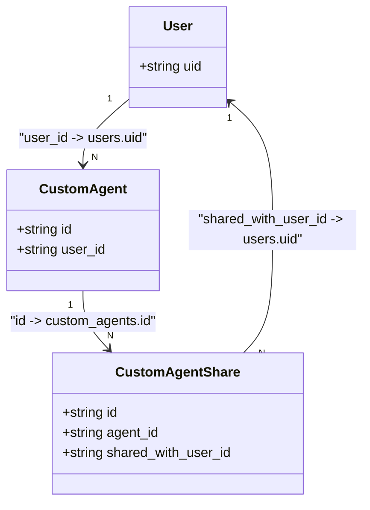
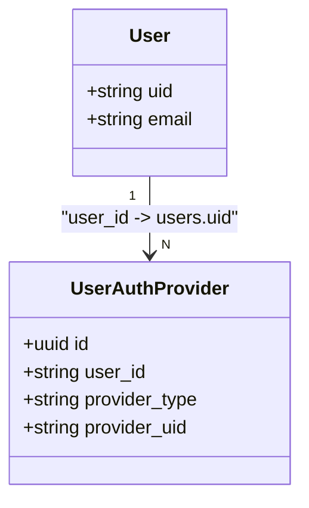
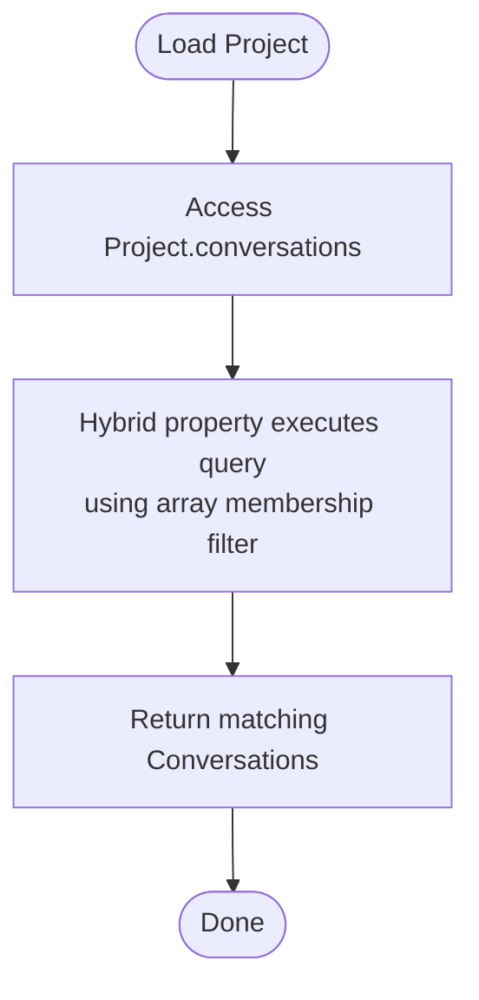
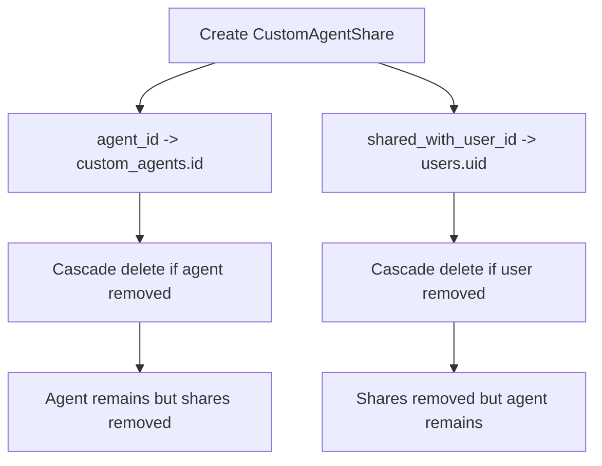
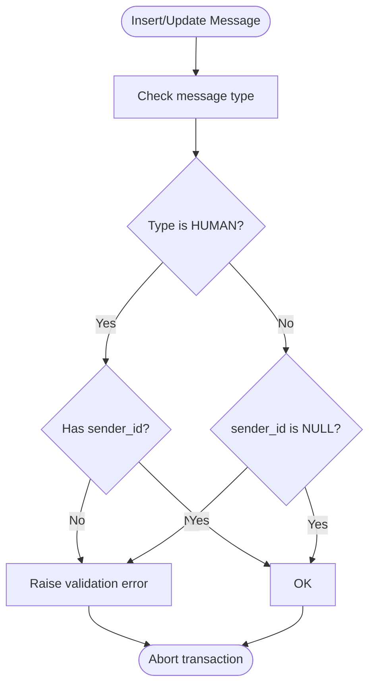
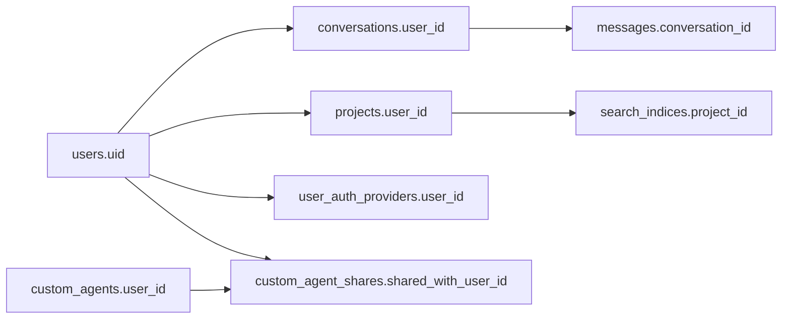

# Data Relationships & Associations

<cite>
**Referenced Files in This Document**
- [base_model.py](file://app/core/base_model.py)
- [models.py](file://app/core/models.py)
- [models.py](file://potpie/core/models.py)
- [conversation_model.py](file://app/modules/conversations/conversation/conversation_model.py)
- [message_model.py](file://app/modules/conversations/message/message_model.py)
- [user_model.py](file://app/modules/users/user_model.py)
- [projects_model.py](file://app/modules/projects/projects_model.py)
- [search_models.py](file://app/modules/search/search_models.py)
- [integration_model.py](file://app/modules/integrations/integration_model.py)
- [auth_provider_model.py](file://app/modules/auth/auth_provider_model.py)
- [custom_agent_model.py](file://app/modules/intelligence/agents/custom_agents/custom_agent_model.py)
- [media_model.py](file://app/modules/media/media_model.py)
- [20240813145447_56e7763c7d20_add_on_delete_cascade_to_message_.py](file://app/alembic/versions/20240813145447_56e7763c7d20_add_on_delete_cascade_to_message_.py)
- [20240820182032_d3f532773223_changes_for_implementation_of_.py](file://app/alembic/versions/20240820182032_d3f532773223_changes_for_implementation_of_.py)
- [20240828094302_48240c0ce09e_add_agent_id_support_in_conversation_.py](file://app/alembic/versions/20240828094302_48240c0ce09e_add_agent_id_support_in_conversation_.py)
- [20241003153813_827623103002_add_shared_with_email_to_the_.py](file://app/alembic/versions/20241003153813_827623103002_add_shared_with_email_to_the_.py)
- [20250310201406_97a740b07a50_custom_agent_sharing.py](file://app/alembic/versions/20250310201406_97a740b07a50_custom_agent_sharing.py)
- [database.py](file://app/core/database.py)
</cite>

## Table of Contents
1. [Introduction](#introduction)
2. [Project Structure](#project-structure)
3. [Core Components](#core-components)
4. [Architecture Overview](#architecture-overview)
5. [Detailed Component Analysis](#detailed-component-analysis)
6. [Dependency Analysis](#dependency-analysis)
7. [Performance Considerations](#performance-considerations)
8. [Troubleshooting Guide](#troubleshooting-guide)
9. [Conclusion](#conclusion)

## Introduction
This document explains Potpie’s data relationship patterns and association management across core domains: conversations and messages, users and projects, agents and prompts, and integrations and authentication providers. It covers foreign keys, cascade behaviors, referential integrity constraints, and complex relationships such as arrays, many-to-many via explicit junction tables, and polymorphic-like usage through array-backed joins. It also documents relationship loading strategies (lazy vs eager), performance implications, and validation mechanisms that maintain data consistency.

## Project Structure
Potpie organizes models under modular packages and exposes a consolidated registry for consumers. The SQLAlchemy declarative base is centralized, and models are imported into two registries:
- Application registry: app/core/models.py
- Library registry: potpie/core/models.py



**Diagram sources**
- [base_model.py](file://app/core/base_model.py#L8-L16)
- [models.py](file://app/core/models.py#L1-L26)
- [models.py](file://potpie/core/models.py#L11-L86)

**Section sources**
- [base_model.py](file://app/core/base_model.py#L8-L16)
- [models.py](file://app/core/models.py#L1-L26)
- [models.py](file://potpie/core/models.py#L11-L86)

## Core Components
- Declarative base: Centralized class registry enables consistent naming and automatic table naming.
- Model registry: Consolidated imports expose all models for consumers and migrations.
- Relationship patterns: One-to-one, one-to-many, many-to-many via explicit junction tables, and array-backed joins for many-to-many semantics.

Key characteristics:
- Automatic table names derived from class names.
- Back-populated relationships for bidirectional navigation.
- Cascade behaviors defined at the relationship and foreign key level.
- Validation constraints embedded in models and migrations.

**Section sources**
- [base_model.py](file://app/core/base_model.py#L8-L16)
- [models.py](file://app/core/models.py#L1-L26)
- [models.py](file://potpie/core/models.py#L11-L86)

## Architecture Overview
The data model centers around users, projects, conversations, messages, agents, integrations, and authentication providers. Relationships are defined with foreign keys and cascades to maintain referential integrity and simplify lifecycle management.

```mermaid
graph TB
usr["User (uid)"]
proj["Project (id)"]
conv["Conversation (id)"]
msg["Message (id)"]
ca["CustomAgent (id)"]
cas["CustomAgentShare (id)"]
uap["UserAuthProvider (id)"]
integ["Integration (integration_id)"]
idx["SearchIndex (id)"]
att["MessageAttachment (id)"]
usr <-- "1" -- "N" --> conv
conv <-- "1" -- "N" --> msg
msg <-- "1" -- "N" --> att
usr <-- "1" -- "N" --> proj
proj <-- "1" -- "N" --> idx
usr <-- "1" -- "N" --> ca
ca <-- "1" -- "N" --> cas
usr <-- "1" -- "N" --> uap
usr -. "array-backed join" .-> conv
proj -. "array-backed join" .-> conv
```

**Diagram sources**
- [user_model.py](file://app/modules/users/user_model.py#L35-L47)
- [conversation_model.py](file://app/modules/conversations/conversation/conversation_model.py#L48-L59)
- [message_model.py](file://app/modules/conversations/message/message_model.py#L54-L56)
- [projects_model.py](file://app/modules/projects/projects_model.py#L48-L51)
- [custom_agent_model.py](file://app/modules/intelligence/agents/custom_agents/custom_agent_model.py#L31-L39)
- [auth_provider_model.py](file://app/modules/auth/auth_provider_model.py#L74-L75)
- [integration_model.py](file://app/modules/integrations/integration_model.py#L1-L44)

## Detailed Component Analysis

### Conversations and Messages: One-to-One, One-to-Many, and Array-Backed Many-to-Many
- One-to-one: Conversation.user via foreign key on conversations.user_id to users.uid with cascade on delete.
- One-to-many: Conversation.messages with cascade “all, delete-orphan” ensuring child deletion when parent is deleted.
- Many-to-one: Message.conversation with cascade on delete to keep referential integrity.
- Array-backed many-to-many semantics: Conversation.project_ids is an array of project IDs; a hybrid property resolves related conversations from project IDs. This avoids a dedicated junction table while enabling many-to-many semantics.

```mermaid
classDiagram
class User {
+string uid
+string email
+string display_name
}
class Conversation {
+string id
+string user_id
+string[] project_ids
+string[] agent_ids
}
class Message {
+string id
+string conversation_id
}
class Project {
+string id
}
class MessageAttachment {
+string id
+string message_id
}
User "1" --> "N" Conversation : "user_id -> users.uid"
Conversation "1" --> "N" Message : "conversation_id -> conversations.id"
Message "1" --> "N" MessageAttachment : "message_id -> messages.id"
Project ||..|| Conversation : "array-backed join via project_ids"
```

**Diagram sources**
- [conversation_model.py](file://app/modules/conversations/conversation/conversation_model.py#L23-L59)
- [message_model.py](file://app/modules/conversations/message/message_model.py#L23-L56)
- [user_model.py](file://app/modules/users/user_model.py#L17-L47)
- [projects_model.py](file://app/modules/projects/projects_model.py#L21-L66)
- [media_model.py](file://app/modules/media/media_model.py#L24-L47)

**Section sources**
- [conversation_model.py](file://app/modules/conversations/conversation/conversation_model.py#L23-L59)
- [message_model.py](file://app/modules/conversations/message/message_model.py#L23-L65)
- [projects_model.py](file://app/modules/projects/projects_model.py#L53-L66)

### Users and Projects: One-to-One and One-to-Many
- One-to-one: User.preferences via a single related row.
- One-to-many: User.projects and User.conversations.
- Project.user via foreign key to users.uid with cascade on delete.
- Project.search_indices and Project.tasks represent additional one-to-many relationships.



**Diagram sources**
- [user_model.py](file://app/modules/users/user_model.py#L35-L47)
- [projects_model.py](file://app/modules/projects/projects_model.py#L21-L51)
- [search_models.py](file://app/modules/search/search_models.py#L7-L17)

**Section sources**
- [user_model.py](file://app/modules/users/user_model.py#L35-L47)
- [projects_model.py](file://app/modules/projects/projects_model.py#L21-L51)
- [search_models.py](file://app/modules/search/search_models.py#L7-L17)

### Agents and Prompts: One-to-One and Many-to-Many via Junction Table
- One-to-one: User.created_prompts via back_populates.
- Many-to-many: CustomAgent.shares to User via CustomAgentShare junction table with cascading deletes on both sides.
- Property-based association proxy: CustomAgent.shared_with_users aggregates users from shares.



**Diagram sources**
- [custom_agent_model.py](file://app/modules/intelligence/agents/custom_agents/custom_agent_model.py#L9-L61)

**Section sources**
- [custom_agent_model.py](file://app/modules/intelligence/agents/custom_agents/custom_agent_model.py#L9-L61)

### Integrations and Authentication Providers: One-to-Many and Referential Integrity
- Integrations: Independent entity with JSONB fields for extensibility; created_by references a user ID.
- Authentication providers: UserAuthProvider links multiple providers to a single user with cascading deletes; unique constraints prevent duplicates across provider type and provider UID.



**Diagram sources**
- [auth_provider_model.py](file://app/modules/auth/auth_provider_model.py#L25-L84)
- [user_model.py](file://app/modules/users/user_model.py#L35-L47)

**Section sources**
- [integration_model.py](file://app/modules/integrations/integration_model.py#L7-L44)
- [auth_provider_model.py](file://app/modules/auth/auth_provider_model.py#L25-L84)

### Relationship Loading Strategies: Lazy vs Eager
- Default lazy loading: Relationships are loaded on access (e.g., Conversation.projects defaults to select with lazy="select").
- Eager loading: selectinload can override default lazy behavior to reduce N+1 queries when fetching related collections.
- Hybrid property: Project.conversations uses a hybrid property with an explicit query to resolve conversations via array-backed join, avoiding ORM joins and enabling efficient filtering.



**Diagram sources**
- [projects_model.py](file://app/modules/projects/projects_model.py#L53-L66)

**Section sources**
- [conversation_model.py](file://app/modules/conversations/conversation/conversation_model.py#L54-L59)
- [projects_model.py](file://app/modules/projects/projects_model.py#L53-L66)

### Foreign Keys, Cascade Behaviors, and Referential Integrity
- Message.conversation_id: Foreign key to conversations.id with ON DELETE CASCADE.
- Conversation.user_id: Foreign key to users.uid with ON DELETE CASCADE.
- CustomAgentShare: Composite foreign keys to custom_agents.id and users.uid with ON DELETE CASCADE.
- Project.user_id: Foreign key to users.uid with ON DELETE CASCADE.
- Unique constraints: UserAuthProvider enforces uniqueness across user/provider pairs and provider UID/provider type combinations.

```mermaid
sequenceDiagram
participant U as "User"
participant C as "Conversation"
participant M as "Message"
participant CA as "CustomAgent"
participant CAS as "CustomAgentShare"
participant P as "Project"
U->>C : Create conversation (user_id -> users.uid)
C->>M : Create message (conversation_id -> conversations.id)
U->>P : Create project (user_id -> users.uid)
CA->>CAS : Create share (agent_id -> custom_agents.id,<br/>shared_with_user_id -> users.uid)
Note over U,C,M : ON DELETE CASCADE enforced by migrations
Note over U,P : ON DELETE CASCADE enforced by migrations
Note over CA,CAS : ON DELETE CASCADE enforced by junction table FKs
```

**Diagram sources**
- [20240813145447_56e7763c7d20_add_on_delete_cascade_to_message_.py](file://app/alembic/versions/20240813145447_56e7763c7d20_add_on_delete_cascade_to_message_.py#L20-L31)
- [20240820182032_d3f532773223_changes_for_implementation_of_.py](file://app/alembic/versions/20240820182032_d3f532773223_changes_for_implementation_of_.py#L35-L42)
- [20250310201406_97a740b07a50_custom_agent_sharing.py](file://app/alembic/versions/20250310201406_97a740b07a50_custom_agent_sharing.py#L23-L34)
- [custom_agent_model.py](file://app/modules/intelligence/agents/custom_agents/custom_agent_model.py#L50-L56)
- [projects_model.py](file://app/modules/projects/projects_model.py#L40-L46)

**Section sources**
- [20240813145447_56e7763c7d20_add_on_delete_cascade_to_message_.py](file://app/alembic/versions/20240813145447_56e7763c7d20_add_on_delete_cascade_to_message_.py#L20-L31)
- [20240820182032_d3f532773223_changes_for_implementation_of_.py](file://app/alembic/versions/20240820182032_d3f532773223_changes_for_implementation_of_.py#L35-L42)
- [custom_agent_model.py](file://app/modules/intelligence/agents/custom_agents/custom_agent_model.py#L50-L56)
- [projects_model.py](file://app/modules/projects/projects_model.py#L40-L46)

### Association Proxies and Backrefs
- Association proxy-like property: CustomAgent.shared_with_users aggregates users from CustomAgentShare entries.
- Backrefs: bidirectional relationships populated via back_populates on related attributes.
- Hybrid property: Project.conversations resolves related conversations via array membership, acting as a proxy for many-to-many semantics without a junction table.

**Section sources**
- [custom_agent_model.py](file://app/modules/intelligence/agents/custom_agents/custom_agent_model.py#L37-L39)
- [projects_model.py](file://app/modules/projects/projects_model.py#L53-L66)
- [conversation_model.py](file://app/modules/conversations/conversation/conversation_model.py#L48-L59)

### Complex Relationships: Sharing, Collaboration, and Permission Management
- Sharing: CustomAgentShare enables fine-grained sharing of agents among users with cascading deletes.
- Collaboration: Conversation.shared_with_emails supports public sharing via email lists.
- Permissions: Project ownership via user_id enforces access control; agent sharing via CustomAgentShare manages permissions.



**Diagram sources**
- [20250310201406_97a740b07a50_custom_agent_sharing.py](file://app/alembic/versions/20250310201406_97a740b07a50_custom_agent_sharing.py#L23-L34)
- [custom_agent_model.py](file://app/modules/intelligence/agents/custom_agents/custom_agent_model.py#L50-L60)

**Section sources**
- [20250310201406_97a740b07a50_custom_agent_sharing.py](file://app/alembic/versions/20250310201406_97a740b07a50_custom_agent_sharing.py#L23-L34)
- [conversation_model.py](file://app/modules/conversations/conversation/conversation_model.py#L46-L47)

### Relationship Validation and Data Consistency
- Message sender/type validation: A CHECK constraint ensures sender_id presence for human messages and absence for AI/system-generated messages.
- Project status validation: A CHECK constraint restricts project status to predefined values.
- Unique constraints: UserAuthProvider prevents duplicate provider mappings.



**Diagram sources**
- [message_model.py](file://app/modules/conversations/message/message_model.py#L58-L64)

**Section sources**
- [message_model.py](file://app/modules/conversations/message/message_model.py#L58-L64)
- [projects_model.py](file://app/modules/projects/projects_model.py#L42-L46)
- [auth_provider_model.py](file://app/modules/auth/auth_provider_model.py#L77-L80)

## Dependency Analysis
Relationships depend on foreign keys and cascades defined in migrations and models. The following diagram highlights key dependencies and their directionality.



**Diagram sources**
- [20240813145447_56e7763c7d20_add_on_delete_cascade_to_message_.py](file://app/alembic/versions/20240813145447_56e7763c7d20_add_on_delete_cascade_to_message_.py#L22-L30)
- [20240820182032_d3f532773223_changes_for_implementation_of_.py](file://app/alembic/versions/20240820182032_d3f532773223_changes_for_implementation_of_.py#L36-L42)
- [custom_agent_model.py](file://app/modules/intelligence/agents/custom_agents/custom_agent_model.py#L28-L56)
- [projects_model.py](file://app/modules/projects/projects_model.py#L29-L46)

**Section sources**
- [20240813145447_56e7763c7d20_add_on_delete_cascade_to_message_.py](file://app/alembic/versions/20240813145447_56e7763c7d20_add_on_delete_cascade_to_message_.py#L22-L30)
- [20240820182032_d3f532773223_changes_for_implementation_of_.py](file://app/alembic/versions/20240820182032_d3f532773223_changes_for_implementation_of_.py#L36-L42)
- [custom_agent_model.py](file://app/modules/intelligence/agents/custom_agents/custom_agent_model.py#L28-L56)
- [projects_model.py](file://app/modules/projects/projects_model.py#L29-L46)

## Performance Considerations
- Eager loading: Use selectinload for collections accessed frequently (e.g., Conversation.messages, User.projects) to avoid N+1 queries.
- Hybrid property: Project.conversations leverages array membership filtering to efficiently resolve many-to-many relationships without ORM joins.
- Indexing: Foreign keys and indexed columns (e.g., messages.conversation_id, conversations.user_id) improve join performance.
- Asynchronous sessions: AsyncSession usage reduces overhead in high-throughput scenarios.

[No sources needed since this section provides general guidance]

## Troubleshooting Guide
Common issues and resolutions:
- Integrity errors on delete: Ensure cascades are applied to foreign keys (e.g., messages.conversation_id, conversations.user_id, custom_agent_shares).
- Missing related data: Verify eager loading strategies (selectinload) for collections accessed in bulk.
- Validation failures: Confirm CHECK constraints for message sender/type and project status are satisfied before insert/update.
- Unique constraint violations: For UserAuthProvider, ensure unique combinations of user/provider type and provider UID are respected.

**Section sources**
- [20240813145447_56e7763c7d20_add_on_delete_cascade_to_message_.py](file://app/alembic/versions/20240813145447_56e7763c7d20_add_on_delete_cascade_to_message_.py#L22-L30)
- [20240820182032_d3f532773223_changes_for_implementation_of_.py](file://app/alembic/versions/20240820182032_d3f532773223_changes_for_implementation_of_.py#L36-L42)
- [message_model.py](file://app/modules/conversations/message/message_model.py#L58-L64)
- [auth_provider_model.py](file://app/modules/auth/auth_provider_model.py#L77-L80)

## Conclusion
Potpie’s data model employs robust foreign key relationships with cascading deletes to maintain referential integrity. It balances simplicity and flexibility by combining explicit junction tables for many-to-many relationships (e.g., CustomAgentShare) with array-backed joins for lightweight many-to-many semantics (e.g., Conversation.project_ids). Validation constraints and unique constraints further enforce data consistency. Proper use of eager loading and hybrid properties optimizes performance and simplifies complex queries across conversations, projects, agents, and authentication providers.