# Database Schema Design

<cite>
**Referenced Files in This Document**
- [base_model.py](file://app/core/base_model.py)
- [models.py](file://app/core/models.py)
- [user_model.py](file://app/modules/users/user_model.py)
- [conversation_model.py](file://app/modules/conversations/conversation/conversation_model.py)
- [message_model.py](file://app/modules/conversations/message/message_model.py)
- [projects_model.py](file://app/modules/projects/projects_model.py)
- [custom_agent_model.py](file://app/modules/intelligence/agents/custom_agents/custom_agent_model.py)
- [integration_model.py](file://app/modules/integrations/integration_model.py)
- [prompt_model.py](file://app/modules/intelligence/prompts/prompt_model.py)
- [media_model.py](file://app/modules/media/media_model.py)
- [task_model.py](file://app/modules/tasks/task_model.py)
- [user_preferences_model.py](file://app/modules/users/user_preferences_model.py)
- [auth_provider_model.py](file://app/modules/auth/auth_provider_model.py)
- [search_models.py](file://app/modules/search/search_models.py)
- [inference_cache_model.py](file://app/modules/parsing/models/inference_cache_model.py)
- [alembic env.py](file://app/alembic/env.py)
- [alembic script.py.mako](file://app/alembic/script.py.mako)
- [versions/20240812184546_6d16b920a3ec_initial_migration.py](file://app/alembic/versions/20240812184546_6d16b920a3ec_initial_migration.py)
- [versions/20240812190934_5ceb460ac3ef_adding_support_for_projects.py](file://app/alembic/versions/20240812190934_5ceb460ac3ef_adding_support_for_projects.py)
- [versions/20240812211350_bcc569077106_utc_timestamps_and_indexing.py](file://app/alembic/versions/20240812211350_bcc569077106_utc_timestamps_and_indexing.py)
- [versions/20240813145447_56e7763c7d20_add_on_delete_cascade_to_message_.py](file://app/alembic/versions/20240813145447_56e7763c7d20_add_on_delete_cascade_to_message_.py)
- [versions/20240820182032_d3f532773223_changes_for_implementation_of_.py](file://app/alembic/versions/20240820182032_d3f532773223_changes_for_implementation_of_.py)
- [versions/20240823164559_05069444feee_project_id_to_string_anddelete_col.py](file://app/alembic/versions/20240823164559_05069444feee_project_id_to_string_anddelete_col.py)
- [versions/20240826215938_3c7be0985b17_search_index.py](file://app/alembic/versions/20240826215938_3c7be0985b17_search_index.py)
- [versions/20240828094302_48240c0ce09e_add_agent_id_support_in_conversation_.py](file://app/alembic/versions/20240828094302_48240c0ce09e_add_agent_id_support_in_conversation_.py)
- [versions/20240902105155_6b44dc81d95d_prompt_tables.py](file://app/alembic/versions/20240902105155_6b44dc81d95d_prompt_tables.py)
- [versions/20240905144257_342902c88262_add_user_preferences_table.py](file://app/alembic/versions/20240905144257_342902c88262_add_user_preferences_table.py)
- [versions/20240927094023_fb0b353e69d0_support_for_citations_in_backend.py](file://app/alembic/versions/20240927094023_fb0b353e69d0_support_for_citations_in_backend.py)
- [versions/20241003153813_827623103002_add_shared_with_email_to_the_.py](file://app/alembic/versions/20241003153813_827623103002_add_shared_with_email_to_the_.py)
- [versions/20241020111943_262d870e9686_custom_agents.py](file://app/alembic/versions/20241020111943_262d870e9686_custom_agents.py)
- [versions/20241028204107_684a330f9e9f_new_migration.py](file://app/alembic/versions/20241028204107_684a330f9e9f_new_migration.py)
- [versions/20241127095409_625f792419e7_support_for_repo_path.py](file://app/alembic/versions/20241127095409_625f792419e7_support_for_repo_path.py)
- [versions/20250303164854_414f9ab20475_custom_agent_sharing.py](file://app/alembic/versions/20250303164854_414f9ab20475_custom_agent_sharing.py)
- [versions/20250310201406_97a740b07a50_custom_agent_sharing.py](file://app/alembic/versions/20250310201406_97a740b07a50_custom_agent_sharing.py)
- [versions/20250626135047_a7f9c1ec89e2_add_media_attachments_support.py](file://app/alembic/versions/20250626135047_a7f9c1ec89e2_add_media_attachments_support.py)
- [versions/20250626135404_ce87e879766b_add_message_attachments_table.py](file://app/alembic/versions/20250626135404_ce87e879766b_add_message_attachments_table.py)
- [versions/20250911184844_add_integrations_table.py](file://app/alembic/versions/20250911184844_add_integrations_table.py)
- [versions/20250923_add_inference_cache_table.py](file://app/alembic/versions/20250923_add_inference_cache_table.py)
- [versions/20250928_simple_global_cache.py](file://app/alembic/versions/20250928_simple_global_cache.py)
- [versions/20251202164905_07bea433f543_add_sso_auth_provider_tables.py](file://app/alembic/versions/20251202164905_07bea433f543_add_sso_auth_provider_tables.py)
- [versions/20251217190000_encrypt_user_auth_provider_tokens.py](file://app/alembic/versions/20251217190000_encrypt_user_auth_provider_tokens.py)
</cite>

## Table of Contents
1. [Introduction](#introduction)
2. [Project Structure](#project-structure)
3. [Core Components](#core-components)
4. [Architecture Overview](#architecture-overview)
5. [Detailed Component Analysis](#detailed-component-analysis)
6. [Dependency Analysis](#dependency-analysis)
7. [Performance Considerations](#performance-considerations)
8. [Troubleshooting Guide](#troubleshooting-guide)
9. [Conclusion](#conclusion)
10. [Appendices](#appendices)

## Introduction
This document describes Potpie’s relational data model and how it evolved through Alembic migrations. It focuses on core entities (Users, Conversations, Messages, Projects, CustomAgents, Integrations, Prompts, MediaAttachments, Tasks, UserPreferences, AuthProviders, SearchIndex, InferenceCache) and their relationships. It also documents constraints, indexing strategies, cascading rules, and migration-driven schema changes to help developers and operators maintain and extend the schema safely.

## Project Structure
Potpie uses SQLAlchemy declarative models with a shared Base class. Model registration is centralized so Alembic can introspect target metadata for migrations. Core models are imported into a single module to ensure all tables are included in schema generation and migrations.

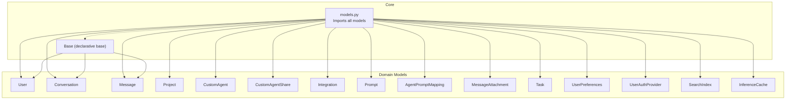

**Diagram sources**
- [base_model.py](file://app/core/base_model.py#L8-L16)
- [models.py](file://app/core/models.py#L1-L26)

**Section sources**
- [base_model.py](file://app/core/base_model.py#L1-L17)
- [models.py](file://app/core/models.py#L1-L26)

## Core Components
This section enumerates the core relational entities, their columns, data types, primary keys, foreign keys, and constraints. It also highlights relationships and indexes.

- Users
  - Primary key: uid (String)
  - Columns: email (String, unique), display_name (String), email_verified (Boolean), created_at (TIMESTAMP), last_login_at (TIMESTAMP), provider_info (JSONB), provider_username (String), organization (String), organization_name (String)
  - Relationships: projects, conversations, created_prompts, preferences, custom_agents, auth_providers (cascade delete-orphan)
  - Indexes: implicit on uid; email uniqueness enforced via unique constraint

- Conversations
  - Primary key: id (String)
  - Foreign keys: user_id -> users.uid (on delete CASCADE)
  - Columns: title (String), status (ENUM: active/archived/deleted), project_ids (ARRAY<String>), agent_ids (ARRAY<String>), created_at (TIMESTAMP), updated_at (TIMESTAMP), shared_with_emails (ARRAY<String>), visibility (ENUM: private/public)
  - Relationships: user, messages (cascade delete-orphan), projects (via array expression join)
  - Indexes: id, user_id

- Messages
  - Primary key: id (String)
  - Foreign keys: conversation_id -> conversations.id (on delete CASCADE)
  - Columns: content (Text), sender_id (String), type (ENUM: AI_GENERATED/HUMAN/SYSTEM_GENERATED), status (ENUM: ACTIVE/ARCHIVED/DELETED), created_at (TIMESTAMP), citations (Text), has_attachments (Boolean)
  - Constraints: check sender_id per type
  - Relationships: conversation, attachments
  - Indexes: conversation_id

- Projects
  - Primary key: id (Text)
  - Foreign keys: user_id -> users.uid (on delete CASCADE)
  - Columns: properties (BYTEA), repo_name (Text), repo_path (Text), branch_name (Text), commit_id (String), is_deleted (Boolean), created_at (TIMESTAMP), updated_at (TIMESTAMP), status (String)
  - Constraints: check status enum
  - Relationships: user, search_indices, tasks
  - Hybrid property: conversations (query via ANY match against conversation.project_ids)

- CustomAgents
  - Primary key: id (String)
  - Foreign keys: user_id -> users.uid
  - Columns: role (String), goal (String), backstory (String), system_prompt (String), tasks (JSONB), deployment_url (String), deployment_status (String), visibility (String), created_at (DateTime), updated_at (DateTime)
  - Relationships: user, shares (cascade delete-orphan)

- CustomAgentShares
  - Primary key: id (String)
  - Foreign keys: agent_id -> custom_agents.id (on delete CASCADE), shared_with_user_id -> users.uid (on delete CASCADE)
  - Columns: created_at (DateTime)
  - Relationships: agent, shared_with_user

- Integrations
  - Primary key: integration_id (String)
  - Columns: name (String), integration_type (String), status (String), active (Boolean), auth_data (JSONB), scope_data (JSONB), integration_metadata (JSONB), unique_identifier (String), created_by (String), created_at (TIMESTAMP), updated_at (TIMESTAMP)

- Prompts
  - Primary key: id (String)
  - Foreign keys: created_by -> users.uid
  - Columns: text (Text), type (ENUM: SYSTEM/HUMAN), version (Integer), status (ENUM: ACTIVE/INACTIVE), created_at (TIMESTAMP), updated_at (TIMESTAMP)
  - Constraints: unique(text, version, created_by), check(version > 0), check(created_at <= updated_at)
  - Relationships: creator

- AgentPromptMappings
  - Primary key: id (String)
  - Foreign keys: prompt_id -> prompts.id (on delete CASCADE)
  - Columns: agent_id (String), prompt_id (String), prompt_stage (Integer)
  - Constraints: unique(agent_id, prompt_stage)

- MessageAttachments
  - Primary key: id (String)
  - Foreign keys: message_id -> messages.id (on delete CASCADE)
  - Columns: filename (String), mime_type (String), size_bytes (Integer), created_at (TIMESTAMP)
  - Relationships: message

- Tasks
  - Primary key: id (String)
  - Foreign keys: project_id -> projects.id
  - Columns: name (String), status (String), created_at (TIMESTAMP), updated_at (TIMESTAMP)
  - Relationships: project

- UserPreferences
  - Primary key: user_id (String)
  - Foreign keys: user_id -> users.uid (on delete CASCADE)
  - Columns: preferences (JSONB), created_at (TIMESTAMP), updated_at (TIMESTAMP)
  - Relationships: user

- UserAuthProvider
  - Primary key: id (String)
  - Foreign keys: user_id -> users.uid (on delete CASCADE)
  - Columns: provider_type (String), provider_user_id (String), access_token (String), refresh_token (String), expires_at (TIMESTAMP), created_at (TIMESTAMP), updated_at (TIMESTAMP)
  - Relationships: user

- SearchIndex
  - Primary key: id (String)
  - Foreign keys: project_id -> projects.id
  - Columns: indexed_content (Text), metadata (JSONB), created_at (TIMESTAMP), updated_at (TIMESTAMP)
  - Relationships: project

- InferenceCache
  - Primary key: id (String)
  - Columns: key (String), value (JSONB), created_at (TIMESTAMP), updated_at (TIMESTAMP)
  - Columns: expires_at (TIMESTAMP)

**Section sources**
- [user_model.py](file://app/modules/users/user_model.py#L17-L59)
- [conversation_model.py](file://app/modules/conversations/conversation/conversation_model.py#L23-L60)
- [message_model.py](file://app/modules/conversations/message/message_model.py#L23-L65)
- [projects_model.py](file://app/modules/projects/projects_model.py#L21-L66)
- [custom_agent_model.py](file://app/modules/intelligence/agents/custom_agents/custom_agent_model.py#L9-L61)
- [integration_model.py](file://app/modules/integrations/integration_model.py#L7-L44)
- [prompt_model.py](file://app/modules/intelligence/prompts/prompt_model.py#L22-L69)
- [media_model.py](file://app/modules/media/media_model.py#L1-L200)
- [task_model.py](file://app/modules/tasks/task_model.py#L1-L200)
- [user_preferences_model.py](file://app/modules/users/user_preferences_model.py#L1-L200)
- [auth_provider_model.py](file://app/modules/auth/auth_provider_model.py#L1-L200)
- [search_models.py](file://app/modules/search/search_models.py#L1-L200)
- [inference_cache_model.py](file://app/modules/parsing/models/inference_cache_model.py#L1-L200)

## Architecture Overview
The schema follows a layered design:
- Base declarative class centralizes naming and registry.
- Domain models encapsulate business entities and relationships.
- Alembic manages schema evolution via versioned migrations.
- Centralized model import ensures migrations capture all tables.

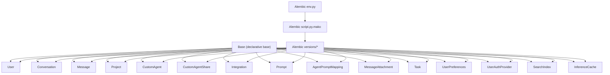

**Diagram sources**
- [base_model.py](file://app/core/base_model.py#L8-L16)
- [alembic env.py](file://app/alembic/env.py#L1-L200)
- [alembic script.py.mako](file://app/alembic/script.py.mako#L1-L200)
- [models.py](file://app/core/models.py#L1-L26)

## Detailed Component Analysis

### Entity Relationship Diagram
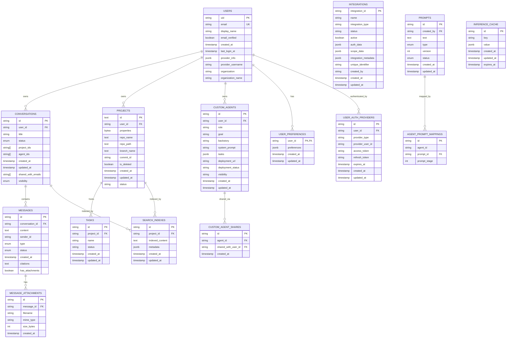

**Diagram sources**
- [user_model.py](file://app/modules/users/user_model.py#L17-L59)
- [conversation_model.py](file://app/modules/conversations/conversation/conversation_model.py#L23-L60)
- [message_model.py](file://app/modules/conversations/message/message_model.py#L23-L65)
- [projects_model.py](file://app/modules/projects/projects_model.py#L21-L66)
- [custom_agent_model.py](file://app/modules/intelligence/agents/custom_agents/custom_agent_model.py#L9-L61)
- [integration_model.py](file://app/modules/integrations/integration_model.py#L7-L44)
- [prompt_model.py](file://app/modules/intelligence/prompts/prompt_model.py#L22-L69)
- [media_model.py](file://app/modules/media/media_model.py#L1-L200)
- [task_model.py](file://app/modules/tasks/task_model.py#L1-L200)
- [user_preferences_model.py](file://app/modules/users/user_preferences_model.py#L1-L200)
- [auth_provider_model.py](file://app/modules/auth/auth_provider_model.py#L1-L200)
- [search_models.py](file://app/modules/search/search_models.py#L1-L200)
- [inference_cache_model.py](file://app/modules/parsing/models/inference_cache_model.py#L1-L200)

### Users and Conversations
- One-to-many: User -> Conversations (on delete CASCADE for user_id)
- Many-to-many-like via arrays: Conversations.project_ids and Projects.id enable filtering without explicit join tables
- Indexes: conversations.user_id and conversations.id improve lookup performance

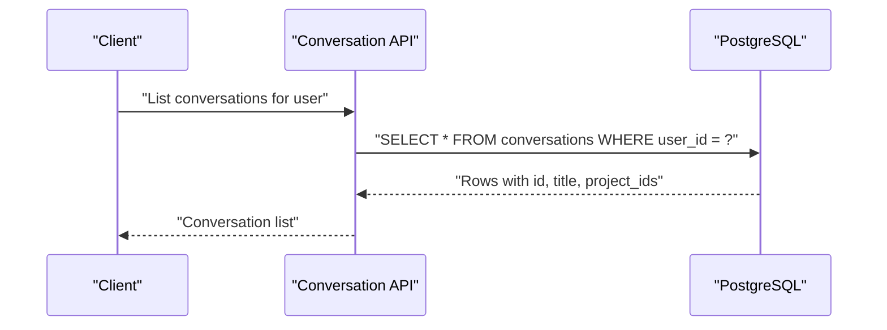

**Diagram sources**
- [conversation_model.py](file://app/modules/conversations/conversation/conversation_model.py#L23-L60)
- [user_model.py](file://app/modules/users/user_model.py#L17-L59)

**Section sources**
- [conversation_model.py](file://app/modules/conversations/conversation/conversation_model.py#L23-L60)
- [user_model.py](file://app/modules/users/user_model.py#L17-L59)

### Messages and Conversations
- One-to-many: Conversation -> Messages (on delete CASCADE for conversation_id)
- Sender validation via check constraint enforces sender_id presence for human messages and absence for AI/system-generated messages
- Indexes: messages.conversation_id

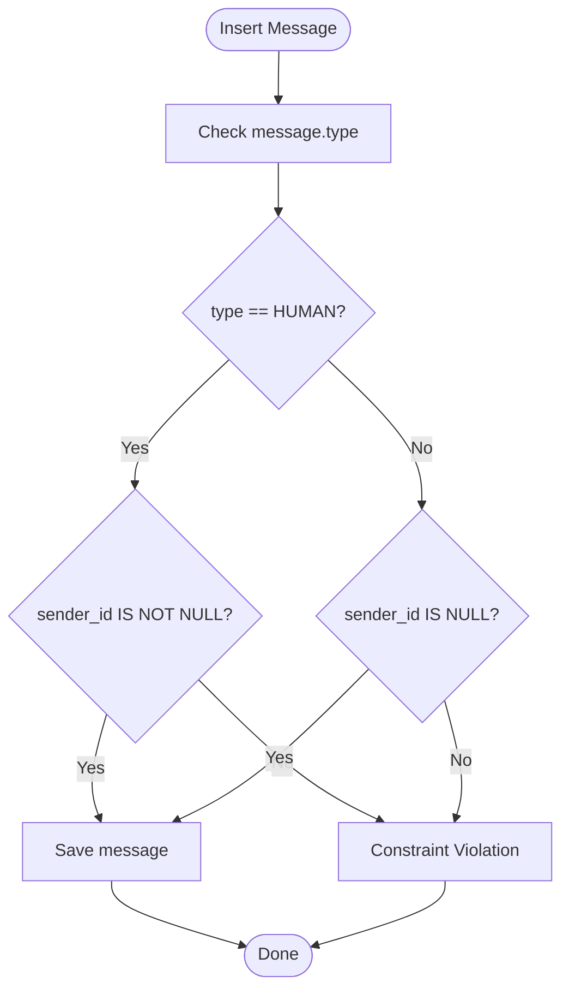

**Diagram sources**
- [message_model.py](file://app/modules/conversations/message/message_model.py#L58-L64)

**Section sources**
- [message_model.py](file://app/modules/conversations/message/message_model.py#L23-L65)

### Projects and Conversations
- One-to-many: User -> Projects (on delete CASCADE for user_id)
- Hybrid property on Project resolves conversations via ANY match against conversation.project_ids
- Indexes: projects.user_id and conversations.project_ids (array)

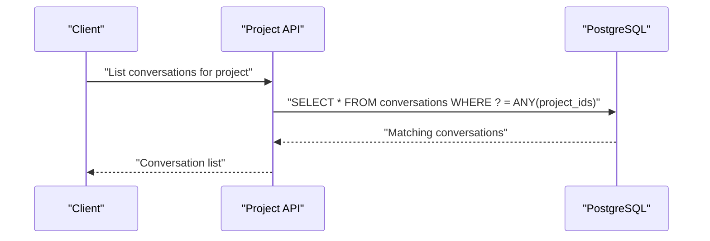

**Diagram sources**
- [projects_model.py](file://app/modules/projects/projects_model.py#L53-L66)
- [conversation_model.py](file://app/modules/conversations/conversation/conversation_model.py#L54-L59)

**Section sources**
- [projects_model.py](file://app/modules/projects/projects_model.py#L21-L66)
- [conversation_model.py](file://app/modules/conversations/conversation/conversation_model.py#L54-L59)

### Custom Agents and Sharing
- One-to-many: User -> CustomAgents
- Many-to-many-like via CustomAgentShare linking users to agents with cascade deletes
- Indexes: custom_agents.user_id; custom_agent_shares.agent_id, shared_with_user_id

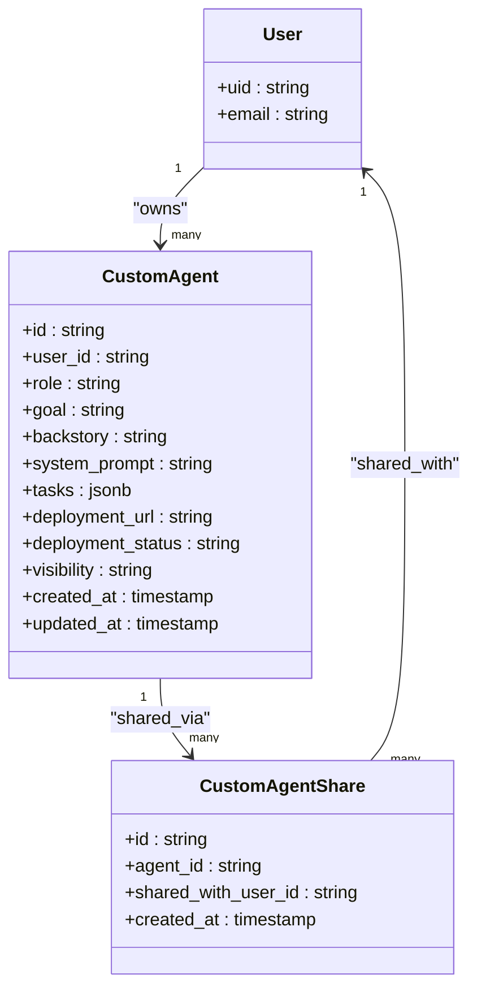

**Diagram sources**
- [custom_agent_model.py](file://app/modules/intelligence/agents/custom_agents/custom_agent_model.py#L9-L61)
- [user_model.py](file://app/modules/users/user_model.py#L17-L59)

**Section sources**
- [custom_agent_model.py](file://app/modules/intelligence/agents/custom_agents/custom_agent_model.py#L9-L61)
- [user_model.py](file://app/modules/users/user_model.py#L17-L59)

### Prompts and Agent Prompt Mappings
- One-to-many: User -> Prompts (created_by)
- Many-to-one: AgentPromptMappings -> Prompt (on delete CASCADE)
- Uniqueness: (agent_id, prompt_stage) ensures deterministic ordering per agent
- Uniqueness: (text, version, created_by) prevents duplicates

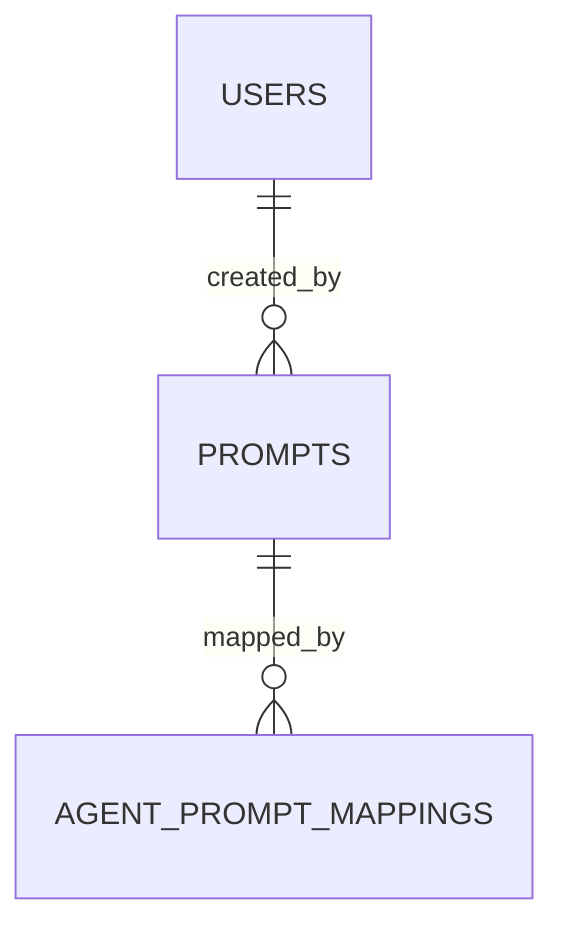

**Diagram sources**
- [prompt_model.py](file://app/modules/intelligence/prompts/prompt_model.py#L22-L69)

**Section sources**
- [prompt_model.py](file://app/modules/intelligence/prompts/prompt_model.py#L22-L69)

### Integrations
- Extensible JSON fields for auth_data, scope_data, integration_metadata
- Status lifecycle: active, inactive, pending, error
- Indexes: integration_id

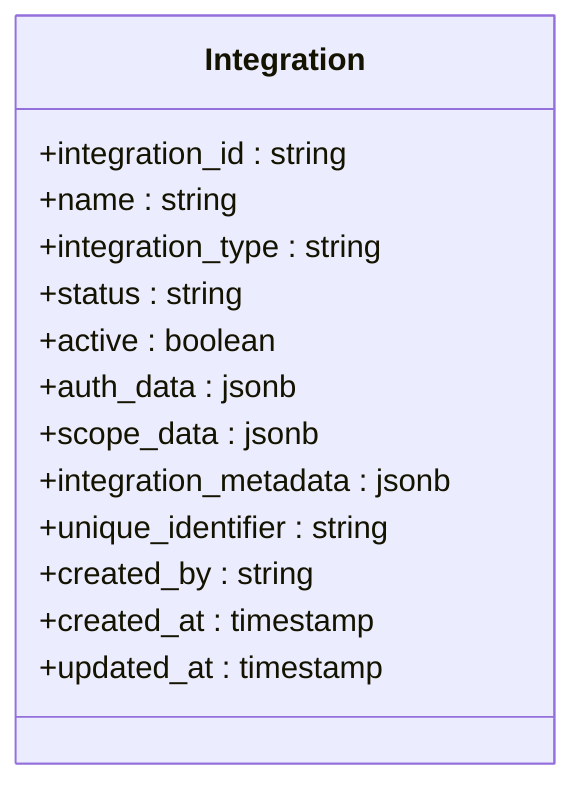

**Diagram sources**
- [integration_model.py](file://app/modules/integrations/integration_model.py#L7-L44)

**Section sources**
- [integration_model.py](file://app/modules/integrations/integration_model.py#L7-L44)

### Message Attachments
- One-to-many: Message -> MessageAttachments (on delete CASCADE)
- Indexes: message_attachments.message_id

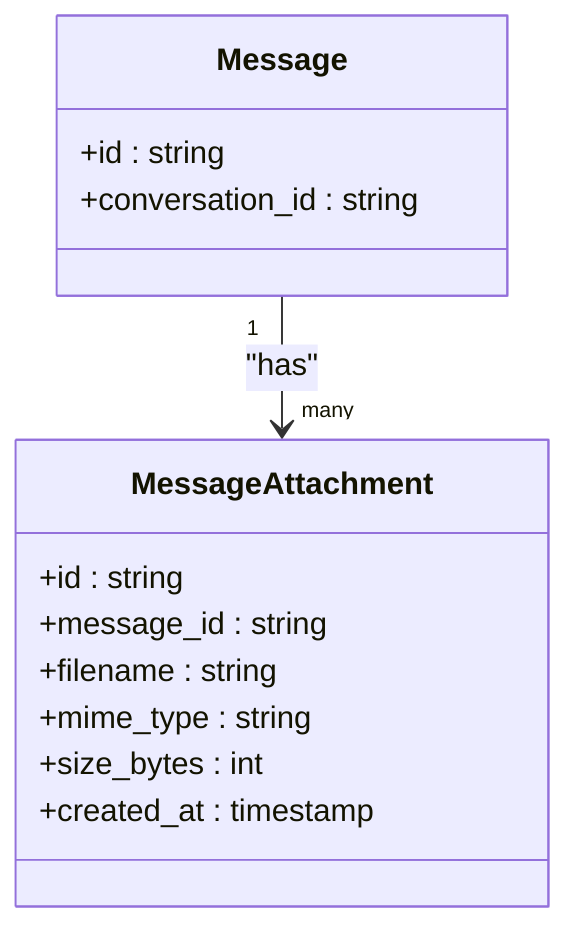

**Diagram sources**
- [message_model.py](file://app/modules/conversations/message/message_model.py#L55-L56)
- [media_model.py](file://app/modules/media/media_model.py#L1-L200)

**Section sources**
- [message_model.py](file://app/modules/conversations/message/message_model.py#L23-L65)
- [media_model.py](file://app/modules/media/media_model.py#L1-L200)

## Dependency Analysis
- Centralized imports in models.py ensure all tables are captured by Alembic migrations.
- Base class provides automatic table naming and registry for introspection.
- Foreign keys enforce referential integrity across domains (users, conversations, projects, prompts, agents, integrations).
- Cascading rules propagate deletions appropriately (e.g., user deletion cascades to owned records).

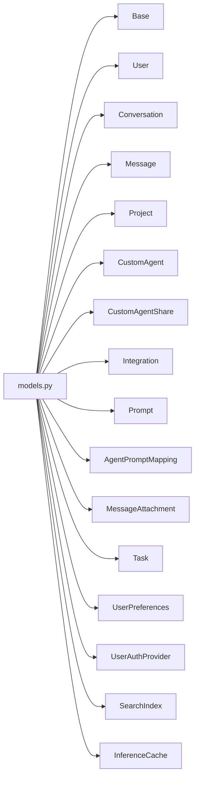

**Diagram sources**
- [models.py](file://app/core/models.py#L1-L26)
- [base_model.py](file://app/core/base_model.py#L8-L16)

**Section sources**
- [models.py](file://app/core/models.py#L1-L26)
- [base_model.py](file://app/core/base_model.py#L8-L16)

## Performance Considerations
- Indexes
  - conversations.user_id and conversations.id
  - messages.conversation_id
  - message_attachments.message_id
  - users.email (unique)
- Array fields
  - conversations.project_ids enables efficient filtering without joins; consider GIN index if frequently queried with ANY
- JSONB fields
  - Integrations’ JSONB columns support flexible schemas; avoid heavy indexing unless queried
- Timestamps
  - UTC timestamps with timezone improve consistency; ensure application logic aligns with timezone expectations
- Cascading deletes
  - Prevents orphaned records and simplifies cleanup; monitor for performance impact on large datasets

[No sources needed since this section provides general guidance]

## Troubleshooting Guide
- Constraint violations
  - Message sender/type constraint: ensure sender_id is present for human messages and absent for AI/system-generated messages
  - Prompt uniqueness: avoid inserting duplicate prompt texts with same version and creator
  - Project status enum: ensure status values conform to allowed set
- Orphaned records
  - Cascading deletes remove dependent rows; verify cascade rules when deleting users or projects
- Migration failures
  - Alembic env.py and script.mako define target metadata and migration generation; ensure models.py imports all models before running migrations

**Section sources**
- [message_model.py](file://app/modules/conversations/message/message_model.py#L58-L64)
- [prompt_model.py](file://app/modules/intelligence/prompts/prompt_model.py#L44-L50)
- [projects_model.py](file://app/modules/projects/projects_model.py#L40-L46)
- [alembic env.py](file://app/alembic/env.py#L1-L200)
- [alembic script.py.mako](file://app/alembic/script.py.mako#L1-L200)

## Conclusion
Potpie’s schema emphasizes flexibility and scalability while maintaining strong referential integrity. The use of JSONB for extensibility, arrays for many-to-many-like relationships, and cascading deletes supports evolving product needs. Alembic migrations track schema changes systematically, enabling safe upgrades and backward compatibility.

[No sources needed since this section summarizes without analyzing specific files]

## Appendices

### Evolution of the Schema Through Migrations
Below is a chronological summary of major schema changes and their rationales. These reflect the evolution captured in Alembic versions.

- Initial migration
  - Establishes core tables for users, conversations, messages, and basic relationships
  - Lays foundation for subsequent enhancements

- Adding support for projects
  - Introduces Projects table and links to Users
  - Enables repository-level organization and task management

- UTC timestamps and indexing
  - Standardizes timestamp handling with timezone-aware timestamps
  - Adds indexes on frequently queried columns

- Add on delete cascade to message user_id
  - Ensures referential integrity for message ownership
  - Prevents orphaned messages when users are deleted

- Changes for implementation of agent support in conversations
  - Adds agent_ids array to conversations for multi-agent orchestration
  - Prepares schema for agent-centric workflows

- Project id to string and delete column
  - Normalizes project identifiers and adds is_deleted flag
  - Improves data lifecycle management

- Search index
  - Adds SearchIndex table for project-level search capabilities
  - Supports knowledge graph and retrieval workflows

- Add agent id support in conversation
  - Reinforces agent association with conversations
  - Enables agent-specific analytics and routing

- Prompt tables
  - Introduces Prompts and AgentPromptMappings
  - Establishes prompt versioning and agent mapping

- Add user preferences table
  - Adds UserPreferences for user-specific settings
  - Supports personalization and feature flags

- Support for citations in backend
  - Adds citations field to messages
  - Enables attribution and provenance tracking

- Add shared_with_email to the conversation
  - Adds shared_with_emails array to conversations
  - Supports collaborative chat sharing

- Custom agents
  - Adds CustomAgent and CustomAgentShare tables
  - Enables agent creation, configuration, and sharing

- New migration
  - General maintenance and internal improvements

- Support for repo path
  - Adds repo_path to projects
  - Enhances repository metadata

- Custom agent sharing
  - Refines sharing mechanics and permissions
  - Improves collaboration workflows

- Add media attachments support
  - Introduces MessageAttachment table
  - Supports file uploads and media-rich conversations

- Add message attachments table
  - Formalizes attachment model
  - Separates concerns between message content and attachments

- Add integrations table
  - Adds Integrations table for external service connections
  - Supports OAuth and token-based integrations

- Add inference cache table
  - Adds InferenceCache for caching model outputs
  - Improves performance and reduces latency

- Simple global cache
  - Adds simple global cache table
  - Supports lightweight caching scenarios

- Add SSO auth provider tables
  - Adds UserAuthProvider for SSO integrations
  - Supports enterprise identity providers

- Encrypt user auth provider tokens
  - Adds encryption for sensitive auth tokens
  - Enhances security posture

**Section sources**
- [versions/20240812184546_6d16b920a3ec_initial_migration.py](file://app/alembic/versions/20240812184546_6d16b920a3ec_initial_migration.py#L1-L200)
- [versions/20240812190934_5ceb460ac3ef_adding_support_for_projects.py](file://app/alembic/versions/20240812190934_5ceb460ac3ef_adding_support_for_projects.py#L1-L200)
- [versions/20240812211350_bcc569077106_utc_timestamps_and_indexing.py](file://app/alembic/versions/20240812211350_bcc569077106_utc_timestamps_and_indexing.py#L1-L200)
- [versions/20240813145447_56e7763c7d20_add_on_delete_cascade_to_message_.py](file://app/alembic/versions/20240813145447_56e7763c7d20_add_on_delete_cascade_to_message_.py#L1-L200)
- [versions/20240820182032_d3f532773223_changes_for_implementation_of_.py](file://app/alembic/versions/20240820182032_d3f532773223_changes_for_implementation_of_.py#L1-L200)
- [versions/20240823164559_05069444feee_project_id_to_string_anddelete_col.py](file://app/alembic/versions/20240823164559_05069444feee_project_id_to_string_anddelete_col.py#L1-L200)
- [versions/20240826215938_3c7be0985b17_search_index.py](file://app/alembic/versions/20240826215938_3c7be0985b17_search_index.py#L1-L200)
- [versions/20240828094302_48240c0ce09e_add_agent_id_support_in_conversation_.py](file://app/alembic/versions/20240828094302_48240c0ce09e_add_agent_id_support_in_conversation_.py#L1-L200)
- [versions/20240902105155_6b44dc81d95d_prompt_tables.py](file://app/alembic/versions/20240902105155_6b44dc81d95d_prompt_tables.py#L1-L200)
- [versions/20240905144257_342902c88262_add_user_preferences_table.py](file://app/alembic/versions/20240905144257_342902c88262_add_user_preferences_table.py#L1-L200)
- [versions/20240927094023_fb0b353e69d0_support_for_citations_in_backend.py](file://app/alembic/versions/20240927094023_fb0b353e69d0_support_for_citations_in_backend.py#L1-L200)
- [versions/20241003153813_827623103002_add_shared_with_email_to_the_.py](file://app/alembic/versions/20241003153813_827623103002_add_shared_with_email_to_the_.py#L1-L200)
- [versions/20241020111943_262d870e9686_custom_agents.py](file://app/alembic/versions/20241020111943_262d870e9686_custom_agents.py#L1-L200)
- [versions/20241028204107_684a330f9e9f_new_migration.py](file://app/alembic/versions/20241028204107_684a330f9e9f_new_migration.py#L1-L200)
- [versions/20241127095409_625f792419e7_support_for_repo_path.py](file://app/alembic/versions/20241127095409_625f792419e7_support_for_repo_path.py#L1-L200)
- [versions/20250303164854_414f9ab20475_custom_agent_sharing.py](file://app/alembic/versions/20250303164854_414f9ab20475_custom_agent_sharing.py#L1-L200)
- [versions/20250310201406_97a740b07a50_custom_agent_sharing.py](file://app/alembic/versions/20250310201406_97a740b07a50_custom_agent_sharing.py#L1-L200)
- [versions/20250626135047_a7f9c1ec89e2_add_media_attachments_support.py](file://app/alembic/versions/20250626135047_a7f9c1ec89e2_add_media_attachments_support.py#L1-L200)
- [versions/20250626135404_ce87e879766b_add_message_attachments_table.py](file://app/alembic/versions/20250626135404_ce87e879766b_add_message_attachments_table.py#L1-L200)
- [versions/20250911184844_add_integrations_table.py](file://app/alembic/versions/20250911184844_add_integrations_table.py#L1-L200)
- [versions/20250923_add_inference_cache_table.py](file://app/alembic/versions/20250923_add_inference_cache_table.py#L1-L200)
- [versions/20250928_simple_global_cache.py](file://app/alembic/versions/20250928_simple_global_cache.py#L1-L200)
- [versions/20251202164905_07bea433f543_add_sso_auth_provider_tables.py](file://app/alembic/versions/20251202164905_07bea433f543_add_sso_auth_provider_tables.py#L1-L200)
- [versions/20251217190000_encrypt_user_auth_provider_tokens.py](file://app/alembic/versions/20251217190000_encrypt_user_auth_provider_tokens.py#L1-L200)