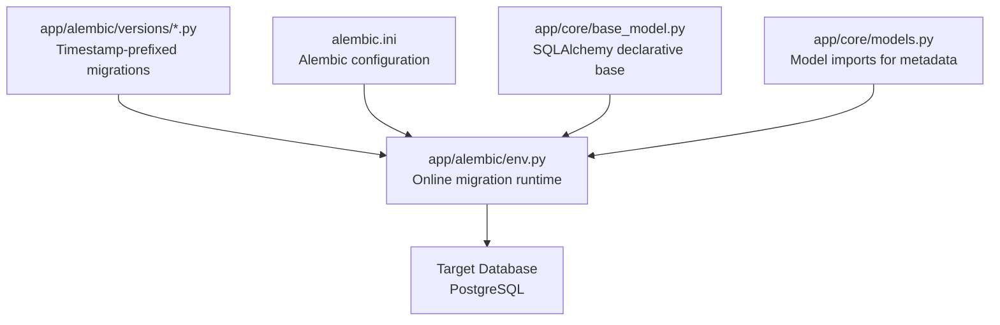
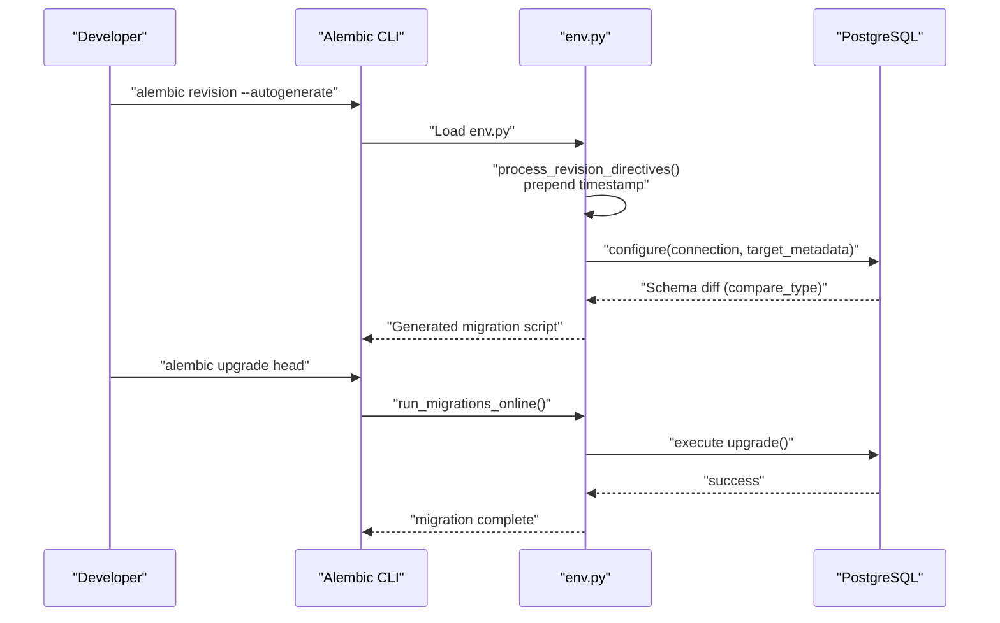
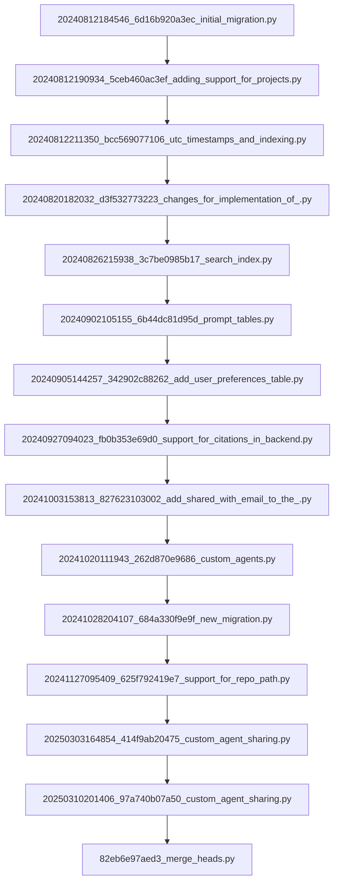
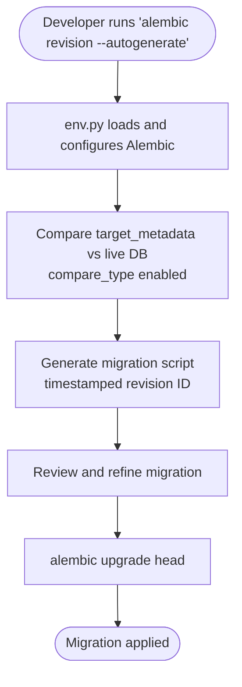
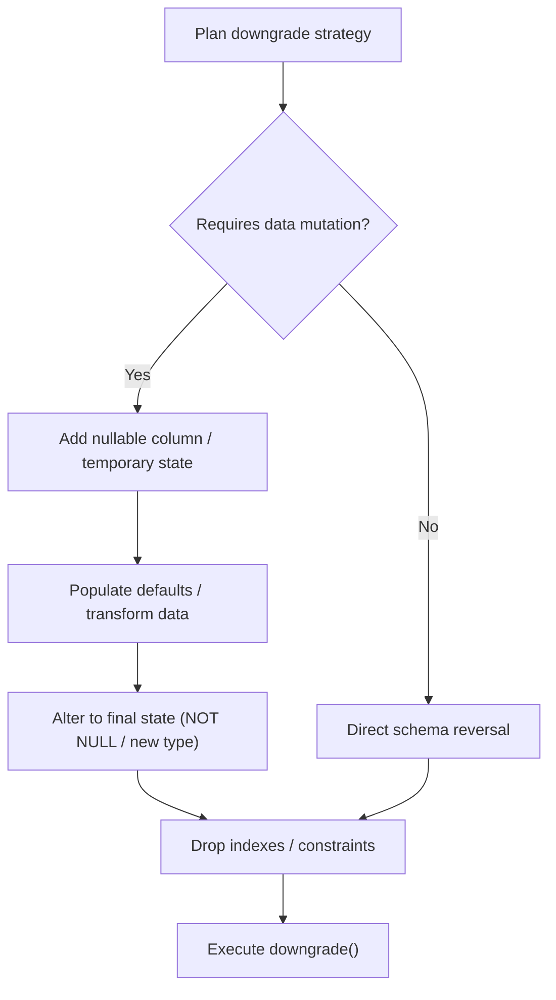
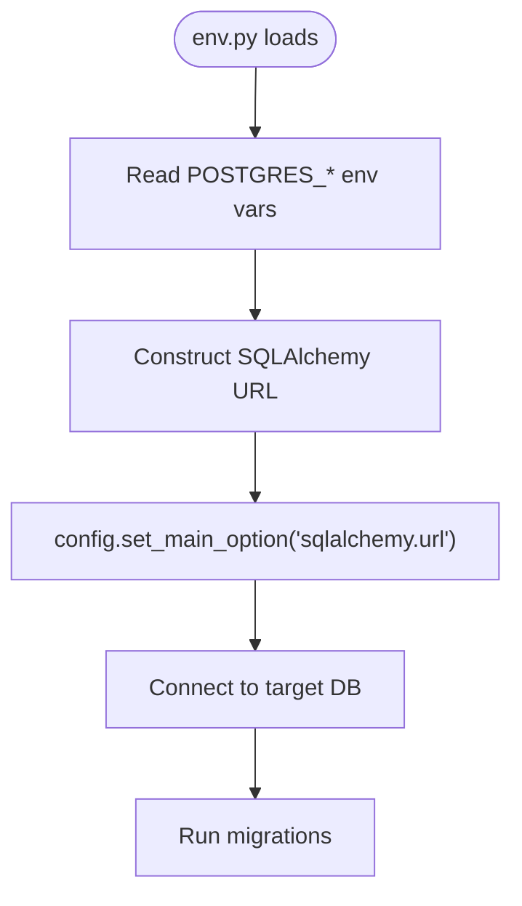
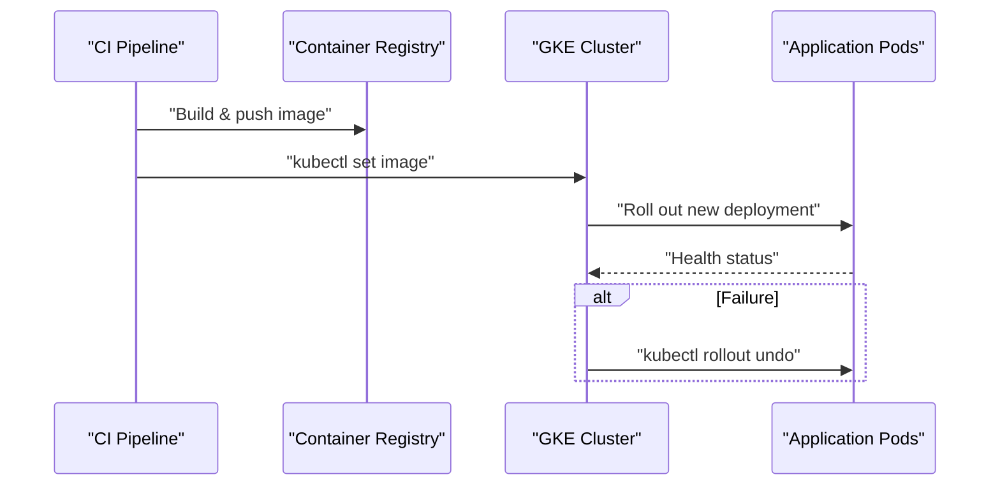
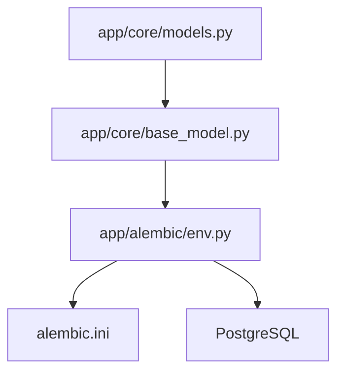

# Migration Management

<cite>
**Referenced Files in This Document**
- [env.py](file://app/alembic/env.py)
- [alembic.ini](file://alembic.ini)
- [script.py.mako](file://app/alembic/script.py.mako)
- [base_model.py](file://app/core/base_model.py)
- [models.py](file://app/core/models.py)
- [20240812184546_6d16b920a3ec_initial_migration.py](file://app/alembic/versions/20240812184546_6d16b920a3ec_initial_migration.py)
- [20240812190934_5ceb460ac3ef_adding_support_for_projects.py](file://app/alembic/versions/20240812190934_5ceb460ac3ef_adding_support_for_projects.py)
- [20240812211350_bcc569077106_utc_timestamps_and_indexing.py](file://app/alembic/versions/20240812211350_bcc569077106_utc_timestamps_and_indexing.py)
- [20240820182032_d3f532773223_changes_for_implementation_of_.py](file://app/alembic/versions/20240820182032_d3f532773223_changes_for_implementation_of_.py)
- [20240826215938_3c7be0985b17_search_index.py](file://app/alembic/versions/20240826215938_3c7be0985b17_search_index.py)
- [20240902105155_6b44dc81d95d_prompt_tables.py](file://app/alembic/versions/20240902105155_6b44dc81d95d_prompt_tables.py)
- [20240905144257_342902c88262_add_user_preferences_table.py](file://app/alembic/versions/20240905144257_342902c88262_add_user_preferences_table.py)
- [20240927094023_fb0b353e69d0_support_for_citations_in_backend.py](file://app/alembic/versions/20240927094023_fb0b353e69d0_support_for_citations_in_backend.py)
- [20241003153813_827623103002_add_shared_with_email_to_the_.py](file://app/alembic/versions/20241003153813_827623103002_add_shared_with_email_to_the_.py)
- [20241020111943_262d870e9686_custom_agents.py](file://app/alembic/versions/20241020111943_262d870e9686_custom_agents.py)
- [20241028204107_684a330f9e9f_new_migration.py](file://app/alembic/versions/20241028204107_684a330f9e9f_new_migration.py)
- [20241127095409_625f792419e7_support_for_repo_path.py](file://app/alembic/versions/20241127095409_625f792419e7_support_for_repo_path.py)
- [20250303164854_414f9ab20475_custom_agent_sharing.py](file://app/alembic/versions/20250303164854_414f9ab20475_custom_agent_sharing.py)
- [20250310201406_97a740b07a50_custom_agent_sharing.py](file://app/alembic/versions/20250310201406_97a740b07a50_custom_agent_sharing.py)
- [20250626135047_a7f9c1ec89e2_add_media_attachments_support.py](file://app/alembic/versions/20250626135047_a7f9c1ec89e2_add_media_attachments_support.py)
- [20250626135404_ce87e879766b_add_message_attachments_table.py](file://app/alembic/versions/20250626135404_ce87e879766b_add_message_attachments_table.py)
- [20250911184844_add_integrations_table.py](file://app/alembic/versions/20250911184844_add_integrations_table.py)
- [20250923_add_inference_cache_table.py](file://app/alembic/versions/20250923_add_inference_cache_table.py)
- [20250928_simple_global_cache.py](file://app/alembic/versions/20250928_simple_global_cache.py)
- [20251202164905_07bea433f543_add_sso_auth_provider_tables.py](file://app/alembic/versions/20251202164905_07bea433f543_add_sso_auth_provider_tables.py)
- [20251217190000_encrypt_user_auth_provider_tokens.py](file://app/alembic/versions/20251217190000_encrypt_user_auth_provider_tokens.py)
- [82eb6e97aed3_merge_heads.py](file://app/alembic/versions/82eb6e97aed3_merge_heads.py)
- [Jenkinsfile_API_Prod](file://deployment/prod/mom-api/Jenkinsfile_API_Prod)
- [Jenkinsfile](file://Jenkinsfile)
</cite>

## Table of Contents
1. [Introduction](#introduction)
2. [Project Structure](#project-structure)
3. [Core Components](#core-components)
4. [Architecture Overview](#architecture-overview)
5. [Detailed Component Analysis](#detailed-component-analysis)
6. [Dependency Analysis](#dependency-analysis)
7. [Performance Considerations](#performance-considerations)
8. [Troubleshooting Guide](#troubleshooting-guide)
9. [Conclusion](#conclusion)
10. [Appendices](#appendices)

## Introduction
This document provides comprehensive migration management guidance for Potpie’s Alembic-based database versioning system. It covers the migration workflow from development to production, including autogenerate processes and manual migration creation, migration file structure and revision IDs, dependency management, rollback strategies, data preservation techniques, environment-specific handling, testing procedures, deployment workflows, and best practices for maintaining migration history. It also documents the relationship between Alembic configuration and application deployment processes.

## Project Structure
Potpie organizes Alembic migrations under app/alembic with three primary areas:
- env.py: Alembic runtime environment, online mode configuration, and revision ID customization.
- versions/: Timestamp-prefixed migration scripts representing schema evolution.
- alembic.ini: Alembic configuration including script location, logging, and environment variable-driven database URL.

**Diagram sources**
- [env.py](file://app/alembic/env.py#L1-L64)
- [alembic.ini](file://alembic.ini#L1-L117)
- [base_model.py](file://app/core/base_model.py#L1-L17)
- [models.py](file://app/core/models.py#L1-L26)

**Section sources**
- [env.py](file://app/alembic/env.py#L1-L64)
- [alembic.ini](file://alembic.ini#L1-L117)
- [base_model.py](file://app/core/base_model.py#L1-L17)
- [models.py](file://app/core/models.py#L1-L26)

## Core Components
- Alembic Environment (env.py): Configures online-only migrations, loads environment variables, constructs the SQLAlchemy URL, and injects a revision directive hook to prepend timestamps to generated revision IDs. It sets the target metadata from the shared declarative base and enables type comparison for accurate diffs.
- Alembic Configuration (alembic.ini): Defines script_location, version locations, logging, and the SQLAlchemy URL template. It also supports optional post-write hooks and timezone settings.
- Migration Templates (script.py.mako): Provides a Mako template for generating new migration scripts with standardized headers, revision IDs, and upgrade/downgrade stubs.
- Model Metadata: The shared declarative Base and model imports feed Alembic’s target_metadata for autogenerate and diff capabilities.

Key behaviors:
- Online-only mode: Offline migrations are explicitly unsupported.
- Dynamic URL: The database URL is constructed from environment variables and injected into Alembic’s config.
- Timestamped revision IDs: A process_revision_directives hook ensures generated revisions include a timestamp prefix.
- Type-aware diffs: compare_type is enabled to detect type changes accurately.

**Section sources**
- [env.py](file://app/alembic/env.py#L1-L64)
- [alembic.ini](file://alembic.ini#L1-L117)
- [script.py.mako](file://app/alembic/script.py.mako#L1-L27)
- [base_model.py](file://app/core/base_model.py#L1-L17)
- [models.py](file://app/core/models.py#L1-L26)

## Architecture Overview
The migration lifecycle integrates application models, Alembic configuration, and deployment automation:

**Diagram sources**
- [env.py](file://app/alembic/env.py#L30-L63)
- [alembic.ini](file://alembic.ini#L63-L63)
- [script.py.mako](file://app/alembic/script.py.mako#L1-L27)

## Detailed Component Analysis

### Migration File Structure and Revision IDs
- Naming convention: Timestamp prefix followed by a short unique identifier. Examples include:
  - Initial migration: 20240812184546_6d16b920a3ec
  - Projects support: 20240812190934_5ceb460ac3ef
  - UTC timestamps and indexing: 20240812211350_bcc569077106
- Revision metadata: Each script defines revision, down_revision, branch_labels, and depends_on. Down revisions reference prior migrations to form a strict chain.
- Merge heads: A dedicated merge script consolidates divergent branches by setting multiple down_revisions.

**Diagram sources**
- [20240812184546_6d16b920a3ec_initial_migration.py](file://app/alembic/versions/20240812184546_6d16b920a3ec_initial_migration.py#L1-L46)
- [20240812190934_5ceb460ac3ef_adding_support_for_projects.py](file://app/alembic/versions/20240812190934_5ceb460ac3ef_adding_support_for_projects.py#L1-L53)
- [20240812211350_bcc569077106_utc_timestamps_and_indexing.py](file://app/alembic/versions/20240812211350_bcc569077106_utc_timestamps_and_indexing.py#L1-L113)
- [20240820182032_d3f532773223_changes_for_implementation_of_.py](file://app/alembic/versions/20240820182032_d3f532773223_changes_for_implementation_of_.py#L1-L133)
- [20240826215938_3c7be0985b17_search_index.py](file://app/alembic/versions/20240826215938_3c7be0985b17_search_index.py)
- [20240902105155_6b44dc81d95d_prompt_tables.py](file://app/alembic/versions/20240902105155_6b44dc81d95d_prompt_tables.py)
- [20240905144257_342902c88262_add_user_preferences_table.py](file://app/alembic/versions/20240905144257_342902c88262_add_user_preferences_table.py)
- [20240927094023_fb0b353e69d0_support_for_citations_in_backend.py](file://app/alembic/versions/20240927094023_fb0b353e69d0_support_for_citations_in_backend.py)
- [20241003153813_827623103002_add_shared_with_email_to_the_.py](file://app/alembic/versions/20241003153813_827623103002_add_shared_with_email_to_the_.py)
- [20241020111943_262d870e9686_custom_agents.py](file://app/alembic/versions/20241020111943_262d870e9686_custom_agents.py)
- [20241028204107_684a330f9e9f_new_migration.py](file://app/alembic/versions/20241028204107_684a330f9e9f_new_migration.py)
- [20241127095409_625f792419e7_support_for_repo_path.py](file://app/alembic/versions/20241127095409_625f792419e7_support_for_repo_path.py)
- [20250303164854_414f9ab20475_custom_agent_sharing.py](file://app/alembic/versions/20250303164854_414f9ab20475_custom_agent_sharing.py)
- [20250310201406_97a740b07a50_custom_agent_sharing.py](file://app/alembic/versions/20250310201406_97a740b07a50_custom_agent_sharing.py)
- [82eb6e97aed3_merge_heads.py](file://app/alembic/versions/82eb6e97aed3_merge_heads.py#L1-L28)

**Section sources**
- [20240812184546_6d16b920a3ec_initial_migration.py](file://app/alembic/versions/20240812184546_6d16b920a3ec_initial_migration.py#L1-L46)
- [20240812190934_5ceb460ac3ef_adding_support_for_projects.py](file://app/alembic/versions/20240812190934_5ceb460ac3ef_adding_support_for_projects.py#L1-L53)
- [20240812211350_bcc569077106_utc_timestamps_and_indexing.py](file://app/alembic/versions/20240812211350_bcc569077106_utc_timestamps_and_indexing.py#L1-L113)
- [20240820182032_d3f532773223_changes_for_implementation_of_.py](file://app/alembic/versions/20240820182032_d3f532773223_changes_for_implementation_of_.py#L1-L133)
- [20240826215938_3c7be0985b17_search_index.py](file://app/alembic/versions/20240826215938_3c7be0985b17_search_index.py)
- [20240902105155_6b44dc81d95d_prompt_tables.py](file://app/alembic/versions/20240902105155_6b44dc81d95d_prompt_tables.py)
- [20240905144257_342902c88262_add_user_preferences_table.py](file://app/alembic/versions/20240905144257_342902c88262_add_user_preferences_table.py)
- [20240927094023_fb0b353e69d0_support_for_citations_in_backend.py](file://app/alembic/versions/20240927094023_fb0b353e69d0_support_for_citations_in_backend.py)
- [20241003153813_827623103002_add_shared_with_email_to_the_.py](file://app/alembic/versions/20241003153813_827623103002_add_shared_with_email_to_the_.py)
- [20241020111943_262d870e9686_custom_agents.py](file://app/alembic/versions/20241020111943_262d870e9686_custom_agents.py)
- [20241028204107_684a330f9e9f_new_migration.py](file://app/alembic/versions/20241028204107_684a330f9e9f_new_migration.py)
- [20241127095409_625f792419e7_support_for_repo_path.py](file://app/alembic/versions/20241127095409_625f792419e7_support_for_repo_path.py)
- [20250303164854_414f9ab20475_custom_agent_sharing.py](file://app/alembic/versions/20250303164854_414f9ab20475_custom_agent_sharing.py)
- [20250310201406_97a740b07a50_custom_agent_sharing.py](file://app/alembic/versions/20250310201406_97a740b07a50_custom_agent_sharing.py)
- [82eb6e97aed3_merge_heads.py](file://app/alembic/versions/82eb6e97aed3_merge_heads.py#L1-L28)

### Autogenerate Workflow and Manual Migration Creation
- Autogenerate: Developers create a revision with --autogenerate. Alembic compares target_metadata against the live database, detects differences, and writes a new migration script. The env.py hook ensures the generated revision ID includes a timestamp prefix.
- Manual creation: For complex changes, developers can scaffold a new migration via the template and implement upgrade/downgrade logic manually.

**Diagram sources**
- [env.py](file://app/alembic/env.py#L30-L63)
- [script.py.mako](file://app/alembic/script.py.mako#L1-L27)

**Section sources**
- [env.py](file://app/alembic/env.py#L30-L63)
- [script.py.mako](file://app/alembic/script.py.mako#L1-L27)

### Rollback Strategies and Data Preservation
- Downgrade procedure: Each migration script implements a downgrade() function to reverse schema changes. Downgrades are executed in reverse order from the current head.
- Data preservation techniques:
  - Nullable intermediate columns: Add nullable columns first, populate defaults, then alter to NOT NULL.
  - Enum additions: Use ALTER TYPE to add values safely; commit after ALTER TYPE in PostgreSQL to ensure visibility.
  - Check constraints: Drop old constraints before altering logic, recreate with updated conditions.
  - Indexes: Drop indexes before heavy operations (e.g., altering columns) and recreate after.
- Example patterns:
  - Media attachments column: Add nullable column, set defaults, then alter to NOT NULL.
  - Message attachments table: Create table with foreign keys and indexes; drop enums in downgrade.
  - Enum extension: Add new enum value to existing type; revert by dropping new value and restoring defaults.

**Diagram sources**
- [20250626135047_a7f9c1ec89e2_add_media_attachments_support.py](file://app/alembic/versions/20250626135047_a7f9c1ec89e2_add_media_attachments_support.py#L1-L36)
- [20250626135404_ce87e879766b_add_message_attachments_table.py](file://app/alembic/versions/20250626135404_ce87e879766b_add_message_attachments_table.py#L1-L68)
- [20240820182032_d3f532773223_changes_for_implementation_of_.py](file://app/alembic/versions/20240820182032_d3f532773223_changes_for_implementation_of_.py#L1-L133)

**Section sources**
- [20250626135047_a7f9c1ec89e2_add_media_attachments_support.py](file://app/alembic/versions/20250626135047_a7f9c1ec89e2_add_media_attachments_support.py#L1-L36)
- [20250626135404_ce87e879766b_add_message_attachments_table.py](file://app/alembic/versions/20250626135404_ce87e879766b_add_message_attachments_table.py#L1-L68)
- [20240820182032_d3f532773223_changes_for_implementation_of_.py](file://app/alembic/versions/20240820182032_d3f532773223_changes_for_implementation_of_.py#L1-L133)

### Environment-Specific Migration Handling
- Dynamic database URL: The env.py constructs the SQLAlchemy URL from environment variables and injects it into Alembic’s config, enabling environment-specific connections.
- Environment separation: CI/CD pipelines can set environment variables to target distinct databases per environment (e.g., dev, staging, prod).

**Diagram sources**
- [env.py](file://app/alembic/env.py#L21-L25)

**Section sources**
- [env.py](file://app/alembic/env.py#L21-L25)

### Testing Procedures for Migrations
- Local testing: Apply migrations locally against a test database, run application tests, and verify data integrity.
- CI integration: Include migration checks in CI jobs to ensure migrations can be applied cleanly and that schema expectations match tests.
- Data validation: After applying migrations, run targeted queries to validate constraints, indexes, and enum values.

[No sources needed since this section provides general guidance]

### Deployment Workflows
- Kubernetes deployments: Jenkins pipelines build Docker images, push to a registry, authenticate with GKE, and deploy images to Kubernetes clusters. While not directly invoking Alembic, the deployment process should ensure migrations are applied before traffic switches.
- Rollback strategy: Jenkins pipelines include a rollback step using kubectl rollout undo to revert to the previous deployment if a failure occurs.

**Diagram sources**
- [Jenkinsfile_API_Prod](file://deployment/prod/mom-api/Jenkinsfile_API_Prod#L105-L130)
- [Jenkinsfile](file://Jenkinsfile#L107-L131)

**Section sources**
- [Jenkinsfile_API_Prod](file://deployment/prod/mom-api/Jenkinsfile_API_Prod#L1-L165)
- [Jenkinsfile](file://Jenkinsfile#L1-L167)

### Complex Migrations: Schema Changes, Data Transformations, Index Modifications
- Schema changes:
  - Adding foreign keys with ON DELETE CASCADE and dropping old constraints.
  - Altering columns to use timezone-aware timestamps.
  - Creating new tables with composite indexes and foreign keys.
- Data transformations:
  - Adding nullable columns, populating defaults, then enforcing NOT NULL.
  - Extending enums with new values and committing to propagate changes.
- Index modifications:
  - Creating indexes on frequently queried columns.
  - Dropping indexes before altering columns and recreating after.

Examples:
- Projects table: Adds foreign key constraints and indexes; later alters timestamp columns to timezone-aware.
- Messages table: Extends enum values, updates check constraints, and adds new columns with defaults.
- Media attachments: Introduces a new table with foreign keys and indexes; maintains backward compatibility by keeping the has_attachments column.

**Section sources**
- [20240812190934_5ceb460ac3ef_adding_support_for_projects.py](file://app/alembic/versions/20240812190934_5ceb460ac3ef_adding_support_for_projects.py#L1-L53)
- [20240812211350_bcc569077106_utc_timestamps_and_indexing.py](file://app/alembic/versions/20240812211350_bcc569077106_utc_timestamps_and_indexing.py#L1-L113)
- [20240820182032_d3f532773223_changes_for_implementation_of_.py](file://app/alembic/versions/20240820182032_d3f532773223_changes_for_implementation_of_.py#L1-L133)
- [20250626135047_a7f9c1ec89e2_add_media_attachments_support.py](file://app/alembic/versions/20250626135047_a7f9c1ec89e2_add_media_attachments_support.py#L1-L36)
- [20250626135404_ce87e879766b_add_message_attachments_table.py](file://app/alembic/versions/20250626135404_ce87e879766b_add_message_attachments_table.py#L1-L68)

### Migration Conflicts, Merge Strategies, and Maintaining History
- Merge heads: When concurrent development creates separate branches, Alembic supports merge revisions. The merge script consolidates multiple down_revisions into a single head.
- Best practices:
  - Keep migrations atomic and reversible.
  - Prefer additive changes (nullable columns, new tables) over destructive operations.
  - Use explicit dependency declarations (depends_on) when cross-module changes are involved.
  - Avoid manual edits to revision IDs; rely on the timestamped hook to maintain uniqueness.

**Section sources**
- [82eb6e97aed3_merge_heads.py](file://app/alembic/versions/82eb6e97aed3_merge_heads.py#L1-L28)

## Dependency Analysis
The Alembic runtime depends on:
- Application models: target_metadata is derived from the shared declarative Base and model imports.
- Environment configuration: env.py reads environment variables and injects the database URL.
- Alembic configuration: alembic.ini defines script_location and logging.

**Diagram sources**
- [models.py](file://app/core/models.py#L1-L26)
- [base_model.py](file://app/core/base_model.py#L1-L17)
- [env.py](file://app/alembic/env.py#L1-L64)
- [alembic.ini](file://alembic.ini#L1-L117)

**Section sources**
- [models.py](file://app/core/models.py#L1-L26)
- [base_model.py](file://app/core/base_model.py#L1-L17)
- [env.py](file://app/alembic/env.py#L1-L64)
- [alembic.ini](file://alembic.ini#L1-L117)

## Performance Considerations
- Index creation: Create indexes after bulk inserts or schema changes to minimize lock contention.
- Large table alterations: Break changes into smaller steps (add nullable column, populate, alter to NOT NULL) to reduce downtime.
- Type comparisons: Enabling compare_type helps avoid unnecessary migrations but can increase diff computation time on large schemas.
- Transaction boundaries: Alembic executes migrations in transactions; keep individual migrations focused to simplify rollbacks.

[No sources needed since this section provides general guidance]

## Troubleshooting Guide
Common issues and resolutions:
- Offline migrations not supported: The env.py explicitly raises an error in offline mode. Always run migrations online against a connected database.
- Revision ID conflicts: Timestamped revision IDs prevent collisions; if duplicates occur, verify the process_revision_directives hook is active.
- Enum value additions: When extending enums, ensure a COMMIT follows ALTER TYPE to propagate changes to subsequent operations.
- Foreign key constraint errors: Drop and recreate constraints with appropriate ON DELETE actions; verify referential integrity after changes.
- Index rebuild failures: Drop indexes before altering columns, then recreate after the alteration completes.

**Section sources**
- [env.py](file://app/alembic/env.py#L60-L63)
- [20240820182032_d3f532773223_changes_for_implementation_of_.py](file://app/alembic/versions/20240820182032_d3f532773223_changes_for_implementation_of_.py#L22-L34)

## Conclusion
Potpie’s Alembic-based migration system emphasizes online-only execution, timestamped revision IDs, and robust downgrade strategies. By leveraging environment-driven database URLs, careful schema and data transformations, and disciplined merge practices, teams can safely evolve the database schema across environments. Integrating migrations into CI/CD pipelines and validating changes with targeted tests ensures reliable deployments and maintainable migration history.

## Appendices
- Alembic configuration highlights:
  - script_location: app/alembic
  - version_locations: default to alembic/versions
  - logging: configured under [loggers], [handlers], [formatters]
  - post_write_hooks: optional formatting hooks

**Section sources**
- [alembic.ini](file://alembic.ini#L1-L117)