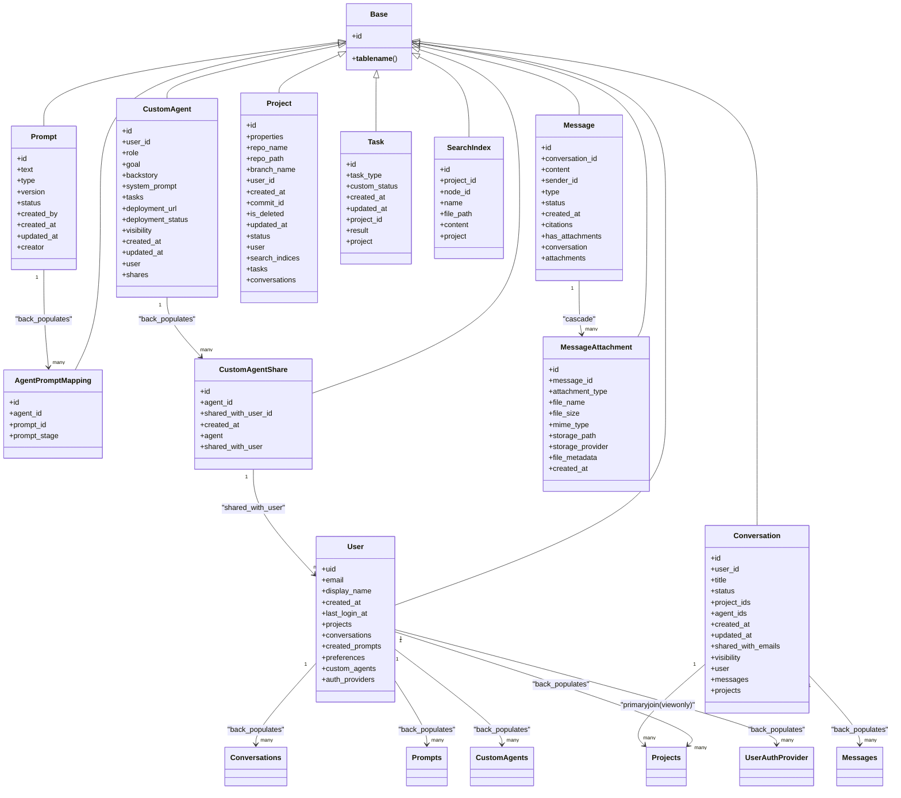
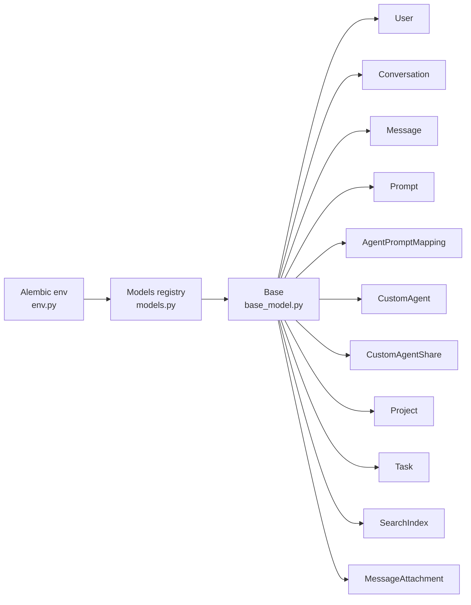

# ORM Models & SQLAlchemy Integration

<cite>
**Referenced Files in This Document**
- [base_model.py](file://app/core/base_model.py)
- [database.py](file://app/core/database.py)
- [models.py](file://app/core/models.py)
- [conversation_model.py](file://app/modules/conversations/conversation/conversation_model.py)
- [message_model.py](file://app/modules/conversations/message/message_model.py)
- [user_model.py](file://app/modules/users/user_model.py)
- [prompt_model.py](file://app/modules/intelligence/prompts/prompt_model.py)
- [custom_agent_model.py](file://app/modules/intelligence/agents/custom_agents/custom_agent_model.py)
- [media_model.py](file://app/modules/media/media_model.py)
- [projects_model.py](file://app/modules/projects/projects_model.py)
- [task_model.py](file://app/modules/tasks/task_model.py)
- [search_models.py](file://app/modules/search/search_models.py)
- [env.py](file://app/alembic/env.py)
- [20240812184546_6d16b920a3ec_initial_migration.py](file://app/alembic/versions/20240812184546_6d16b920a3ec_initial_migration.py)
- [20250303164854_414f9ab20475_custom_agent_sharing.py](file://app/alembic/versions/20250303164854_414f9ab20475_custom_agent_sharing.py)
- [test_models.py](file://app/modules/auth/tests/test_models.py)
</cite>

## Table of Contents
1. [Introduction](#introduction)
2. [Project Structure](#project-structure)
3. [Core Components](#core-components)
4. [Architecture Overview](#architecture-overview)
5. [Detailed Component Analysis](#detailed-component-analysis)
6. [Dependency Analysis](#dependency-analysis)
7. [Performance Considerations](#performance-considerations)
8. [Troubleshooting Guide](#troubleshooting-guide)
9. [Conclusion](#conclusion)
10. [Appendices](#appendices)

## Introduction
This document explains Potpie’s SQLAlchemy ORM model implementation with a focus on the Base class architecture, declarative model patterns, and relationship definitions. It covers inheritance patterns, shared functionality across entities, relationship types (one-to-many, many-to-many via association tables, and self-referencing patterns), validation and constraints, hybrid properties and computed-like behaviors, eager loading strategies, and performance optimization techniques. It also outlines lifecycle hooks, event handling, and audit trail patterns, along with testing strategies and mock implementations used in unit tests.

## Project Structure
Potpie organizes models around a shared Base class and exposes a consolidated registry for Alembic migrations. The core Base class is defined in a dedicated module, while the consolidated models registry aggregates all ORM entities for migration metadata.

```mermaid
graph TB
subgraph "Core"
BM["Base class<br/>app/core/base_model.py"]
DB["Database factories<br/>app/core/database.py"]
REG["Models registry<br/>app/core/models.py"]
end
subgraph "Conversations"
CONV["Conversation<br/>conversation_model.py"]
MSG["Message<br/>message_model.py"]
end
subgraph "Integrations"
INT["Integration<br/>integration_model.py"]
end
subgraph "Media"
ATT["MessageAttachment<br/>media_model.py"]
end
subgraph "Prompts"
PROMPT["Prompt<br/>prompt_model.py"]
end
subgraph "Agents"
CAGENT["CustomAgent<br/>custom_agent_model.py"]
SHARE["CustomAgentShare<br/>custom_agent_model.py"]
end
subgraph "Projects"
PJ["Project<br/>projects_model.py"]
end
subgraph "Tasks"
TK["Task<br/>task_model.py"]
end
subgraph "Search"
SI["SearchIndex<br/>search_models.py"]
end
subgraph "Auth"
U["User<br/>user_model.py"]
end
BM --> CONV
BM --> MSG
BM --> PROMPT
BM --> CAGENT
BM --> SHARE
BM --> PJ
BM --> TK
BM --> SI
BM --> ATT
BM --> U
REG --> CONV
REG --> MSG
REG --> PROMPT
REG --> CAGENT
REG --> SHARE
REG --> PJ
REG --> TK
REG --> SI
REG --> ATT
REG --> U
DB --> CONV
DB --> MSG
DB --> PROMPT
DB --> CAGENT
DB --> SHARE
DB --> PJ
DB --> TK
DB --> SI
DB --> ATT
DB --> U
```

**Diagram sources**
- [base_model.py](file://app/core/base_model.py#L8-L16)
- [database.py](file://app/core/database.py#L95-L96)
- [models.py](file://app/core/models.py#L1-L26)
- [conversation_model.py](file://app/modules/conversations/conversation/conversation_model.py#L23-L60)
- [message_model.py](file://app/modules/conversations/message/message_model.py#L23-L65)
- [user_model.py](file://app/modules/users/user_model.py#L17-L59)
- [prompt_model.py](file://app/modules/intelligence/prompts/prompt_model.py#L22-L69)
- [custom_agent_model.py](file://app/modules/intelligence/agents/custom_agents/custom_agent_model.py#L9-L61)
- [media_model.py](file://app/modules/media/media_model.py#L24-L47)
- [projects_model.py](file://app/modules/projects/projects_model.py#L21-L66)
- [task_model.py](file://app/modules/tasks/task_model.py#L17-L29)
- [search_models.py](file://app/modules/search/search_models.py#L7-L18)

**Section sources**
- [base_model.py](file://app/core/base_model.py#L1-L17)
- [database.py](file://app/core/database.py#L1-L117)
- [models.py](file://app/core/models.py#L1-L26)

## Core Components
- Base class architecture
  - A declarative Base is defined with automatic table naming and a class registry to centralize model discovery.
  - Automatic table naming ensures consistent naming derived from the class name.
- Database configuration
  - Synchronous and asynchronous engines configured with connection pooling, pre-ping, and explicit session factories.
  - Specialized async session creation for Celery workers avoids cross-task Future binding issues.
- Consolidated models registry
  - A single module re-exports all ORM classes to feed Alembic target metadata.

Key implementation references:
- Base class and automatic naming: [base_model.py](file://app/core/base_model.py#L8-L16)
- Engines and sessions: [database.py](file://app/core/database.py#L13-L52)
- Celery-specific async session: [database.py](file://app/core/database.py#L57-L92)
- Models registry: [models.py](file://app/core/models.py#L1-L26)

**Section sources**
- [base_model.py](file://app/core/base_model.py#L1-L17)
- [database.py](file://app/core/database.py#L1-L117)
- [models.py](file://app/core/models.py#L1-L26)

## Architecture Overview
The ORM architecture follows a centralized Base class with explicit relationships and constraints. Models are grouped by domain (users, conversations, prompts, agents, projects, tasks, search, media). Relationships are defined with back-populates and cascades where appropriate. Constraints and hybrid behaviors are used to enforce data integrity and expose computed-like attributes.

**Diagram sources**
- [base_model.py](file://app/core/base_model.py#L8-L16)
- [user_model.py](file://app/modules/users/user_model.py#L17-L59)
- [conversation_model.py](file://app/modules/conversations/conversation/conversation_model.py#L23-L60)
- [message_model.py](file://app/modules/conversations/message/message_model.py#L23-L65)
- [prompt_model.py](file://app/modules/intelligence/prompts/prompt_model.py#L22-L69)
- [custom_agent_model.py](file://app/modules/intelligence/agents/custom_agents/custom_agent_model.py#L9-L61)
- [projects_model.py](file://app/modules/projects/projects_model.py#L21-L66)
- [task_model.py](file://app/modules/tasks/task_model.py#L17-L29)
- [search_models.py](file://app/modules/search/search_models.py#L7-L18)
- [media_model.py](file://app/modules/media/media_model.py#L24-L47)

## Detailed Component Analysis

### Base Class and Declarative Patterns
- Automatic table naming: The Base class defines a declared attribute for __tablename__, ensuring consistent naming derived from the class name.
- Class registry: A registry is provided to support declarative instantiation and discovery.
- Centralized Base: While a separate Base is defined, the application also creates a global declarative Base for Alembic metadata in the database module.

Implementation references:
- Automatic naming: [base_model.py](file://app/core/base_model.py#L14-L16)
- Class registry: [base_model.py](file://app/core/base_model.py#L5-L6)
- Global Base for Alembic: [database.py](file://app/core/database.py#L95-L96)

**Section sources**
- [base_model.py](file://app/core/base_model.py#L1-L17)
- [database.py](file://app/core/database.py#L95-L96)

### Relationship Types and Definitions
- One-to-many relationships
  - User to Conversations, Projects, Prompts, CustomAgents, and Auth providers.
  - Conversation to Messages and Projects (viewonly).
  - Message to MessageAttachment (cascade).
  - Prompt to AgentPromptMapping.
  - CustomAgent to CustomAgentShare (cascade).
- Many-to-many via association tables
  - CustomAgentShare links CustomAgent to User via shared_with_user_id, forming a many-to-many relationship.
- Self-referencing patterns
  - No explicit self-referencing relationships were identified in the examined models.

Implementation references:
- User relationships: [user_model.py](file://app/modules/users/user_model.py#L35-L47)
- Conversation relationships: [conversation_model.py](file://app/modules/conversations/conversation/conversation_model.py#L48-L60)
- Message relationships: [message_model.py](file://app/modules/conversations/message/message_model.py#L54-L56)
- Prompt and mapping: [prompt_model.py](file://app/modules/intelligence/prompts/prompt_model.py#L52-L68)
- Custom agent and share: [custom_agent_model.py](file://app/modules/intelligence/agents/custom_agents/custom_agent_model.py#L31-L61)

**Section sources**
- [user_model.py](file://app/modules/users/user_model.py#L35-L47)
- [conversation_model.py](file://app/modules/conversations/conversation/conversation_model.py#L48-L60)
- [message_model.py](file://app/modules/conversations/message/message_model.py#L54-L56)
- [prompt_model.py](file://app/modules/intelligence/prompts/prompt_model.py#L52-L68)
- [custom_agent_model.py](file://app/modules/intelligence/agents/custom_agents/custom_agent_model.py#L31-L61)

### Model Validation and Constraints
- Database-level constraints
  - Check constraints on Message enforce sender_id validity per message type.
  - Unique constraints on Prompt ensure uniqueness of text/version/created_by combinations.
  - Check constraints on Project enforce allowed status values.
  - Foreign keys and cascades ensure referential integrity and cleanup behavior.
- Enum-backed columns
  - Enums are used for status, type, and visibility fields to constrain values at the database level.

Implementation references:
- Message check constraint: [message_model.py](file://app/modules/conversations/message/message_model.py#L58-L64)
- Prompt unique and check constraints: [prompt_model.py](file://app/modules/intelligence/prompts/prompt_model.py#L44-L50)
- Project check constraint and FKs: [projects_model.py](file://app/modules/projects/projects_model.py#L40-L46)

**Section sources**
- [message_model.py](file://app/modules/conversations/message/message_model.py#L58-L64)
- [prompt_model.py](file://app/modules/intelligence/prompts/prompt_model.py#L44-L50)
- [projects_model.py](file://app/modules/projects/projects_model.py#L40-L46)

### Hybrid Properties and Computed Columns
- Hybrid property on Project
  - A hybrid_property exposes a dynamic relationship to Conversations filtered by project_ids membership, encapsulating a query inside the model.
  - Uses a local session to fetch related conversations, demonstrating a computed-like behavior.

Implementation references:
- Project hybrid property: [projects_model.py](file://app/modules/projects/projects_model.py#L53-L65)

**Section sources**
- [projects_model.py](file://app/modules/projects/projects_model.py#L53-L65)

### Custom Data Types and JSON/JSONB Fields
- PostgreSQL JSONB fields
  - User provider_info and provider_username fields leverage JSONB for flexible provider metadata storage.
  - CustomAgent tasks field stores structured data as JSONB.
  - MessageAttachment file_metadata stores optional structured metadata.
- Binary and array fields
  - Project properties uses BYTEA for binary serialized data.
  - Conversation project_ids and agent_ids use arrays to store multiple identifiers.

Implementation references:
- JSONB fields: [user_model.py](file://app/modules/users/user_model.py#L27-L29), [custom_agent_model.py](file://app/modules/intelligence/agents/custom_agents/custom_agent_model.py#L18), [media_model.py](file://app/modules/media/media_model.py#L42)
- Arrays and BYTEA: [conversation_model.py](file://app/modules/conversations/conversation/conversation_model.py#L37-L38), [projects_model.py](file://app/modules/projects/projects_model.py#L25)

**Section sources**
- [user_model.py](file://app/modules/users/user_model.py#L27-L29)
- [custom_agent_model.py](file://app/modules/intelligence/agents/custom_agents/custom_agent_model.py#L18)
- [media_model.py](file://app/modules/media/media_model.py#L42)
- [conversation_model.py](file://app/modules/conversations/conversation/conversation_model.py#L37-L38)
- [projects_model.py](file://app/modules/projects/projects_model.py#L25)

### Eager Loading Strategies and Complex Queries
- Viewonly relationships and primaryjoin
  - Conversation.projects uses a primaryjoin with any_ to map to Conversation.project_ids without write-back to the array column, paired with viewonly to prevent unintended writes.
- Selectinload and lazy overrides
  - Conversation.projects sets lazy="select" by default, with comments indicating selectinload overrides for efficient bulk loading.
- Hybrid property query
  - Project.conversations uses a query inside a hybrid_property to compute related conversations, encapsulating a join/filter operation.

Implementation references:
- Conversation projects mapping: [conversation_model.py](file://app/modules/conversations/conversation/conversation_model.py#L54-L59)
- Project hybrid property: [projects_model.py](file://app/modules/projects/projects_model.py#L53-L65)

**Section sources**
- [conversation_model.py](file://app/modules/conversations/conversation/conversation_model.py#L54-L59)
- [projects_model.py](file://app/modules/projects/projects_model.py#L53-L65)

### Lifecycle Hooks, Event Handling, and Audit Trails
- Timestamps
  - Created and updated timestamps are populated via server_default and onupdate functions across multiple models.
- Audit trail patterns
  - Several models include audit-related fields and relationships (e.g., UserAuthProvider, AuthAuditLog in the auth module) indicating audit trail patterns are present elsewhere in the codebase.
- Cascade behaviors
  - Cascades on delete-orphan ensure child records are cleaned up when parents are removed, supporting audit-friendly data lifecycle management.

Implementation references:
- Timestamps and cascades: [conversation_model.py](file://app/modules/conversations/conversation/conversation_model.py#L39-L47), [message_model.py](file://app/modules/conversations/message/message_model.py#L50-L56), [user_model.py](file://app/modules/users/user_model.py#L43-L47)

**Section sources**
- [conversation_model.py](file://app/modules/conversations/conversation/conversation_model.py#L39-L47)
- [message_model.py](file://app/modules/conversations/message/message_model.py#L50-L56)
- [user_model.py](file://app/modules/users/user_model.py#L43-L47)

### Serialization and Deserialization Patterns
- Pydantic schemas accompany models for API serialization/deserialization (not shown in the referenced files).
- Model fields align with schema definitions to minimize conversion overhead.
- JSONB fields enable storing structured payloads without additional ORM complexity.

[No sources needed since this section provides general guidance]

### Migration Metadata and Alembic Integration
- Target metadata
  - Alembic env imports the consolidated models registry to populate target_metadata for schema generation.
- Migration examples
  - Initial migration establishes core tables.
  - Subsequent migrations evolve CustomAgent and related tables, including altering timestamps and adding visibility defaults.

Implementation references:
- Alembic env target metadata: [env.py](file://app/alembic/env.py)
- Models registry import: [models.py](file://app/core/models.py#L1-L26)
- Initial migration: [20240812184546_6d16b920a3ec_initial_migration.py](file://app/alembic/versions/20240812184546_6d16b920a3ec_initial_migration.py)
- Custom agent sharing migration: [20250303164854_414f9ab20475_custom_agent_sharing.py](file://app/alembic/versions/20250303164854_414f9ab20475_custom_agent_sharing.py)

**Section sources**
- [env.py](file://app/alembic/env.py)
- [models.py](file://app/core/models.py#L1-L26)
- [20240812184546_6d16b920a3ec_initial_migration.py](file://app/alembic/versions/20240812184546_6d16b920a3ec_initial_migration.py)
- [20250303164854_414f9ab20475_custom_agent_sharing.py](file://app/alembic/versions/20250303164854_414f9ab20475_custom_agent_sharing.py)

### Model Testing Strategies and Mock Implementations
- Unit tests for auth models demonstrate mocking of database sessions and relationships to isolate model behavior.
- Tests validate constraints, relationships, and basic CRUD flows without external dependencies.

Implementation references:
- Auth model tests: [test_models.py](file://app/modules/auth/tests/test_models.py)

**Section sources**
- [test_models.py](file://app/modules/auth/tests/test_models.py)

## Dependency Analysis
The models depend on the shared Base class and are organized by domain. Relationships define clear ownership and cascading behaviors. Alembic relies on the consolidated models registry for metadata.

**Diagram sources**
- [base_model.py](file://app/core/base_model.py#L8-L16)
- [models.py](file://app/core/models.py#L1-L26)
- [env.py](file://app/alembic/env.py)

**Section sources**
- [base_model.py](file://app/core/base_model.py#L8-L16)
- [models.py](file://app/core/models.py#L1-L26)
- [env.py](file://app/alembic/env.py)

## Performance Considerations
- Connection pooling and pre-ping
  - Synchronous engine configured with pool_size, max_overflow, pool_timeout, and pool_recycle to manage connections efficiently.
  - Async engine configured similarly; pre-ping disabled for Celery workers to avoid event loop issues.
- Fresh connections for Celery
  - Dedicated async session factory with NullPool prevents cross-task Future binding and improves reliability in long-running tasks.
- Eager loading
  - Use selectinload for bulk operations on relationships like Conversation.projects to reduce N+1 queries.
- Indexing
  - Several models define index=True on frequently filtered columns (e.g., message_id, project_id) to improve query performance.

[No sources needed since this section provides general guidance]

## Troubleshooting Guide
- Async session binding issues in Celery
  - Use the specialized async session factory that creates a fresh non-pooled connection per task.
- Constraint violations
  - Review check constraints on Message, Prompt, and Project to ensure data conforms to defined rules.
- Relationship anomalies
  - For viewonly relationships mapped to arrays, confirm primaryjoin logic and avoid write-back to the array column.

**Section sources**
- [database.py](file://app/core/database.py#L57-L92)
- [message_model.py](file://app/modules/conversations/message/message_model.py#L58-L64)
- [prompt_model.py](file://app/modules/intelligence/prompts/prompt_model.py#L44-L50)
- [projects_model.py](file://app/modules/projects/projects_model.py#L40-L46)
- [conversation_model.py](file://app/modules/conversations/conversation/conversation_model.py#L54-L59)

## Conclusion
Potpie’s SQLAlchemy ORM leverages a centralized Base class, consistent naming, and robust relationship definitions across domains. Constraints and hybrid properties enforce data integrity and expose computed-like behaviors. The application integrates Alembic via a consolidated models registry and employs performance-conscious patterns such as connection pooling, selective eager loading, and targeted indexing. Lifecycle hooks and cascades support clean data lifecycle management, while tests validate model behavior under controlled conditions.

[No sources needed since this section summarizes without analyzing specific files]

## Appendices
- Additional references for deeper exploration:
  - Database factories and async session management: [database.py](file://app/core/database.py#L13-L52)
  - Models registry for Alembic: [models.py](file://app/core/models.py#L1-L26)
  - Alembic env target metadata: [env.py](file://app/alembic/env.py)

[No sources needed since this section provides general guidance]