# Storage Strategies & Performance

<cite>
**Referenced Files in This Document**
- [storage_strategies.py](file://app/core/storage_strategies.py)
- [inference_cache_model.py](file://app/modules/parsing/models/inference_cache_model.py)
- [inference_cache_service.py](file://app/modules/parsing/services/inference_cache_service.py)
- [cache_cleanup_service.py](file://app/modules/parsing/services/cache_cleanup_service.py)
- [media_model.py](file://app/modules/media/media_model.py)
- [database.py](file://app/core/database.py)
- [base_store.py](file://app/core/base_store.py)
- [conversation_store.py](file://app/modules/conversations/conversation/conversation_store.py)
- [message_store.py](file://app/modules/conversations/message/message_store.py)
- [alembic/versions/20250923_add_inference_cache_table.py](file://app/alembic/versions/20250923_add_inference_cache_table.py)
- [alembic/versions/20250626135047_a7f9c1ec89e2_add_media_attachments_support.py](file://app/alembic/versions/20250626135047_a7f9c1ec89e2_add_media_attachments_support.py)
- [alembic/versions/20250626135404_ce87e879766b_add_message_attachments_table.py](file://app/alembic/versions/20250626135404_ce87e879766b_add_message_attachments_table.py)
- [alembic/versions/20240826215938_3c7be0985b17_search_index.py](file://app/alembic/versions/20240826215938_3c7be0985b17_search_index.py)
- [alembic/versions/20240812211350_bcc569077106_utc_timestamps_and_indexing.py](file://app/alembic/versions/20240812211350_bcc569077106_utc_timestamps_and_indexing.py)
- [alembic/versions/20240812184546_6d16b920a3ec_initial_migration.py](file://app/alembic/versions/20240812184546_6d16b920a3ec_initial_migration.py)
</cite>

## Table of Contents
1. [Introduction](#introduction)
2. [Project Structure](#project-structure)
3. [Core Components](#core-components)
4. [Architecture Overview](#architecture-overview)
5. [Detailed Component Analysis](#detailed-component-analysis)
6. [Dependency Analysis](#dependency-analysis)
7. [Performance Considerations](#performance-considerations)
8. [Troubleshooting Guide](#troubleshooting-guide)
9. [Conclusion](#conclusion)
10. [Appendices](#appendices)

## Introduction
This document explains Potpie’s hybrid storage strategy that combines a relational database (PostgreSQL) with specialized caching and file-based storage. It focuses on:
- Global inference cache persisted in PostgreSQL with periodic cleanup
- Media attachments stored with pluggable storage providers
- Conversation and message histories optimized for retrieval and archival
- Indexing and search infrastructure
- Performance tuning for graph queries and query optimization patterns
- Data partitioning, archiving, cleanup, scalability, backups, recovery, and retention

## Project Structure
Potpie organizes storage-related logic across:
- Core database and async session management
- Relational models for caching, media, and conversation/message history
- Services implementing cache read/write and cleanup
- Alembic migrations defining schema and indexes

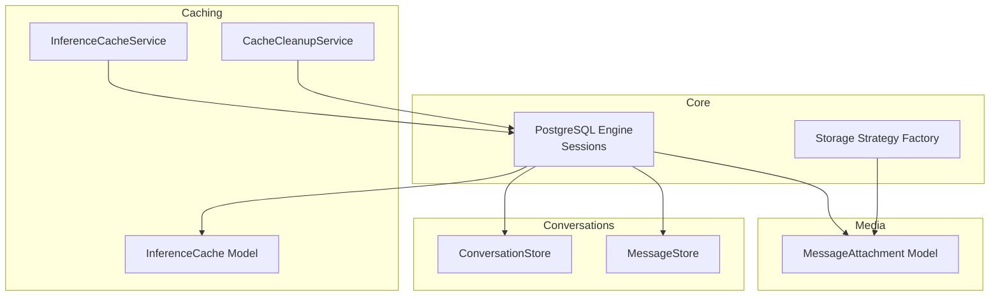

**Diagram sources**
- [database.py](file://app/core/database.py#L13-L52)
- [storage_strategies.py](file://app/core/storage_strategies.py#L22-L115)
- [inference_cache_model.py](file://app/modules/parsing/models/inference_cache_model.py#L16-L36)
- [inference_cache_service.py](file://app/modules/parsing/services/inference_cache_service.py#L10-L149)
- [cache_cleanup_service.py](file://app/modules/parsing/services/cache_cleanup_service.py#L11-L90)
- [media_model.py](file://app/modules/media/media_model.py#L24-L47)
- [conversation_store.py](file://app/modules/conversations/conversation/conversation_store.py#L18-L119)
- [message_store.py](file://app/modules/conversations/message/message_store.py#L8-L83)

**Section sources**
- [database.py](file://app/core/database.py#L1-L117)
- [storage_strategies.py](file://app/core/storage_strategies.py#L1-L115)
- [inference_cache_model.py](file://app/modules/parsing/models/inference_cache_model.py#L1-L36)
- [inference_cache_service.py](file://app/modules/parsing/services/inference_cache_service.py#L1-L149)
- [cache_cleanup_service.py](file://app/modules/parsing/services/cache_cleanup_service.py#L1-L90)
- [media_model.py](file://app/modules/media/media_model.py#L1-L47)
- [conversation_store.py](file://app/modules/conversations/conversation/conversation_store.py#L1-L119)
- [message_store.py](file://app/modules/conversations/message/message_store.py#L1-L83)

## Core Components
- PostgreSQL engine and async session factories with connection pooling and pre-ping for reliability
- Inference cache table with content hash, metadata, embeddings, and access tracking
- Cache service implementing read-through/upsert write and stats aggregation
- Cleanup service enforcing TTL and least-accessed eviction
- Media attachment table supporting multiple storage providers
- Conversation and message stores with async operations and pagination/sorting
- Storage strategy factory for cloud providers (S3/GCS/Azure) used by media layer

Key capabilities:
- Hybrid storage: relational for durable records, cache for hot inference results
- Pluggable storage backends for media assets
- Efficient retrieval patterns for conversations and messages
- Controlled lifecycle for cached inference data

**Section sources**
- [database.py](file://app/core/database.py#L13-L52)
- [inference_cache_model.py](file://app/modules/parsing/models/inference_cache_model.py#L16-L36)
- [inference_cache_service.py](file://app/modules/parsing/services/inference_cache_service.py#L10-L149)
- [cache_cleanup_service.py](file://app/modules/parsing/services/cache_cleanup_service.py#L11-L90)
- [media_model.py](file://app/modules/media/media_model.py#L24-L47)
- [conversation_store.py](file://app/modules/conversations/conversation/conversation_store.py#L18-L119)
- [message_store.py](file://app/modules/conversations/message/message_store.py#L8-L83)
- [storage_strategies.py](file://app/core/storage_strategies.py#L22-L115)

## Architecture Overview
The storage architecture integrates:
- PostgreSQL for persistent relational data (conversations, messages, caches, media)
- Inference cache as a dedicated table with access metrics and TTL controls
- Media attachments with storage provider descriptors for external object storage
- Async database sessions for scalable I/O in modern endpoints
- Base store pattern enabling both sync and async operations during migration

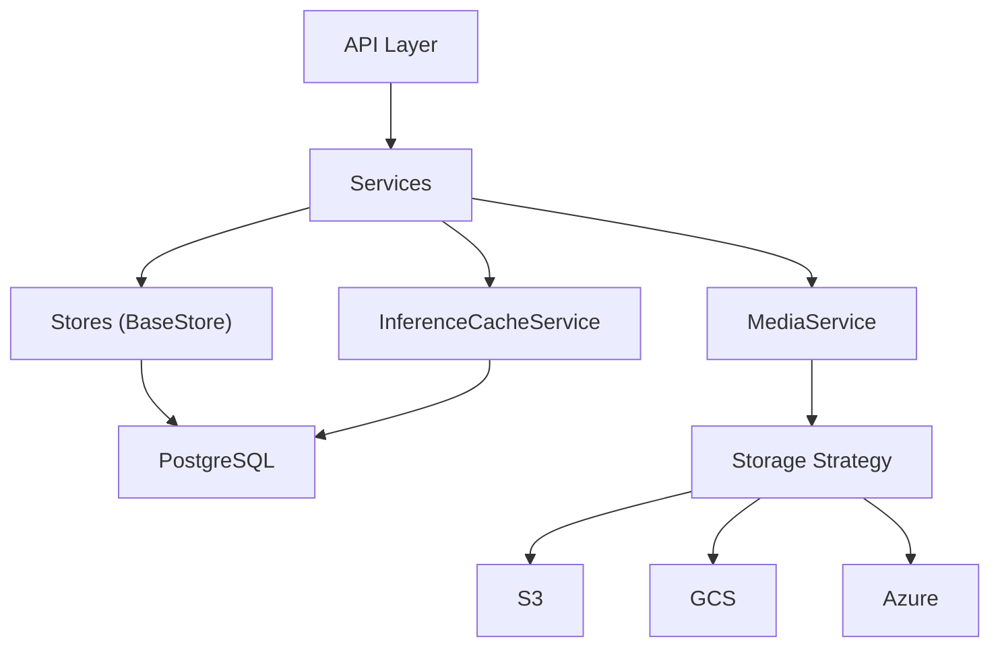

**Diagram sources**
- [base_store.py](file://app/core/base_store.py#L7-L16)
- [database.py](file://app/core/database.py#L13-L52)
- [inference_cache_service.py](file://app/modules/parsing/services/inference_cache_service.py#L10-L149)
- [storage_strategies.py](file://app/core/storage_strategies.py#L22-L115)

## Detailed Component Analysis

### Inference Cache: Data Model and Service
The inference cache persists LLM results keyed by content hash, with optional metadata and vector embeddings. Access tracking supports cleanup heuristics.

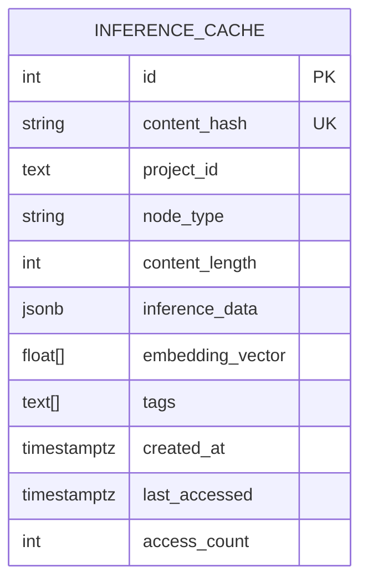

**Diagram sources**
- [inference_cache_model.py](file://app/modules/parsing/models/inference_cache_model.py#L16-L36)

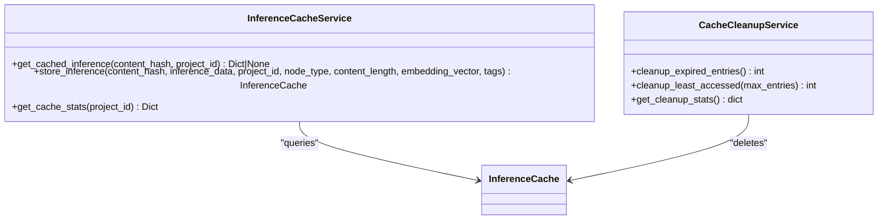

**Diagram sources**
- [inference_cache_service.py](file://app/modules/parsing/services/inference_cache_service.py#L10-L149)
- [cache_cleanup_service.py](file://app/modules/parsing/services/cache_cleanup_service.py#L11-L90)
- [inference_cache_model.py](file://app/modules/parsing/models/inference_cache_model.py#L16-L36)

Operational flow for cache lookup and storage:

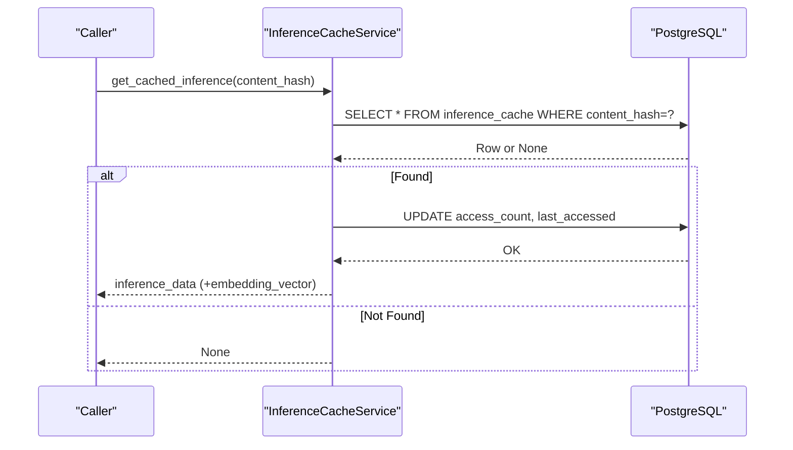

**Diagram sources**
- [inference_cache_service.py](file://app/modules/parsing/services/inference_cache_service.py#L14-L50)
- [inference_cache_model.py](file://app/modules/parsing/models/inference_cache_model.py#L16-L36)

Storage flow for upsert and race-condition handling:

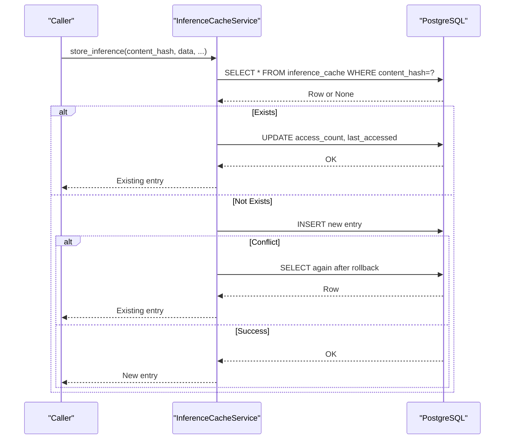

**Diagram sources**
- [inference_cache_service.py](file://app/modules/parsing/services/inference_cache_service.py#L52-L128)
- [inference_cache_model.py](file://app/modules/parsing/models/inference_cache_model.py#L16-L36)

Cleanup policy:

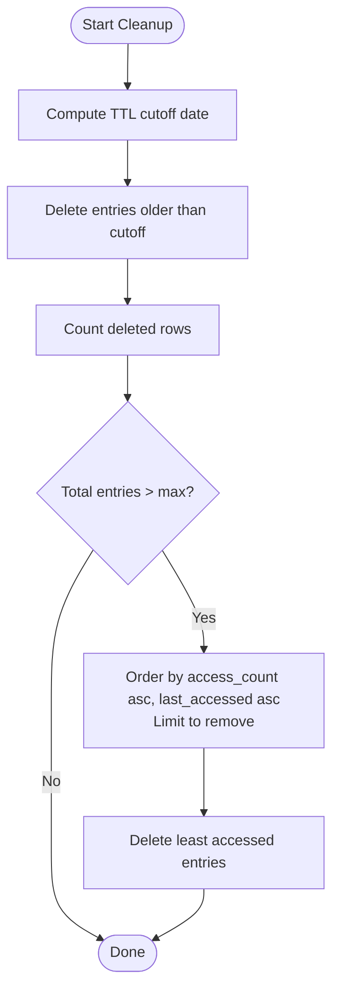

**Diagram sources**
- [cache_cleanup_service.py](file://app/modules/parsing/services/cache_cleanup_service.py#L30-L70)

**Section sources**
- [inference_cache_model.py](file://app/modules/parsing/models/inference_cache_model.py#L16-L36)
- [inference_cache_service.py](file://app/modules/parsing/services/inference_cache_service.py#L10-L149)
- [cache_cleanup_service.py](file://app/modules/parsing/services/cache_cleanup_service.py#L11-L90)

### Media Attachments: Storage Provider Strategy
Media metadata is stored relationally with a storage provider enumeration. The strategy factory provides provider descriptors for S3, GCS, and Azure-compatible APIs.

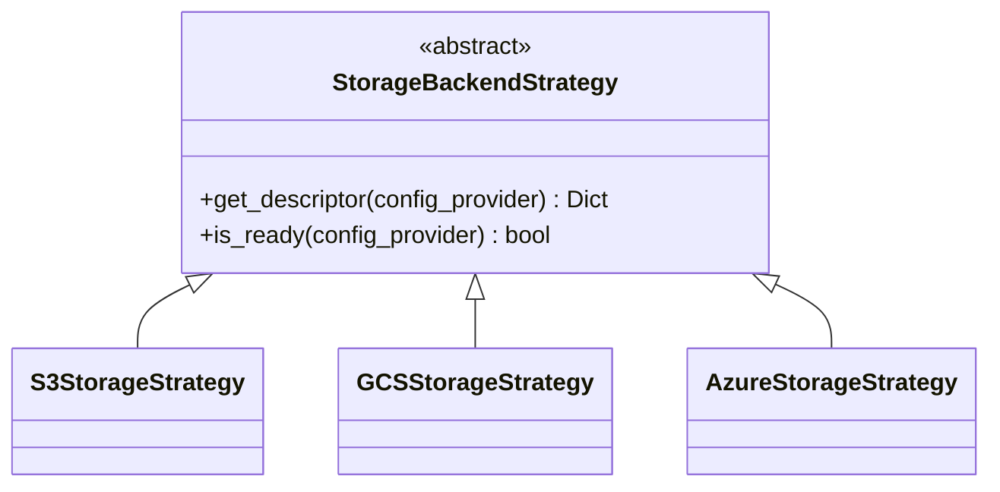

**Diagram sources**
- [storage_strategies.py](file://app/core/storage_strategies.py#L8-L115)

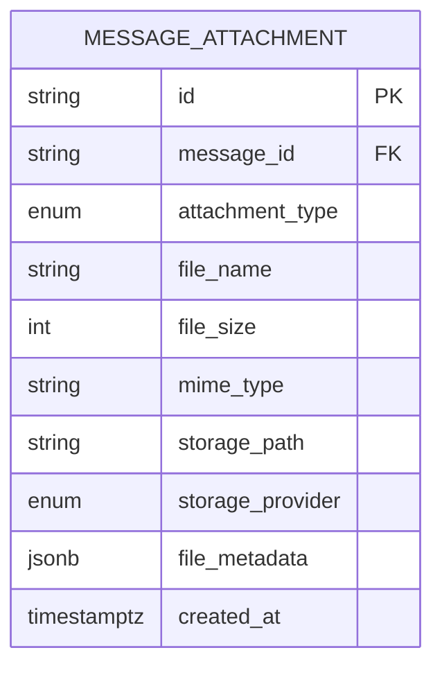

**Diagram sources**
- [media_model.py](file://app/modules/media/media_model.py#L24-L47)

**Section sources**
- [storage_strategies.py](file://app/core/storage_strategies.py#L22-L115)
- [media_model.py](file://app/modules/media/media_model.py#L10-L47)

### Conversations and Messages: Retrieval, Archival, and Pagination
Conversation and message stores encapsulate async operations for:
- Paginated and sorted retrieval of conversations per user
- Active message counts and latest human message queries
- Archival of messages after a timestamp
- Deletion hooks for cascading cleanup

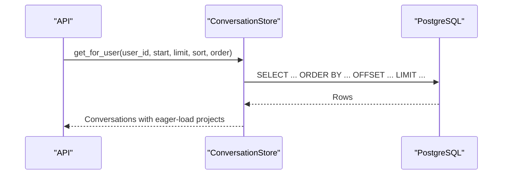

**Diagram sources**
- [conversation_store.py](file://app/modules/conversations/conversation/conversation_store.py#L67-L119)

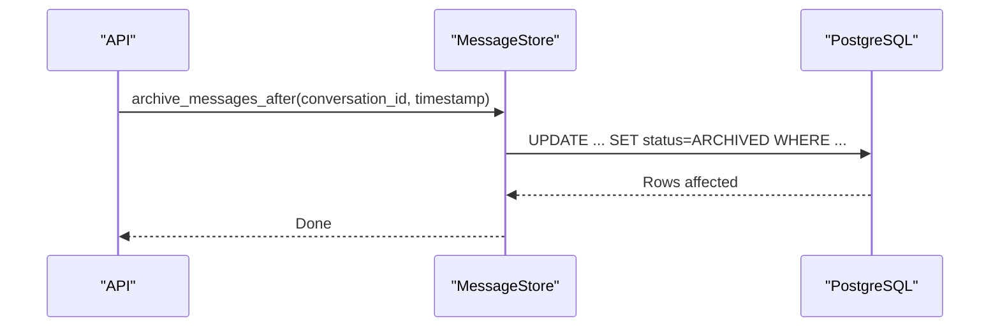

**Diagram sources**
- [message_store.py](file://app/modules/conversations/message/message_store.py#L49-L62)

**Section sources**
- [conversation_store.py](file://app/modules/conversations/conversation/conversation_store.py#L18-L119)
- [message_store.py](file://app/modules/conversations/message/message_store.py#L8-L83)

### Search Indexing and Graph Queries
Search indexes were introduced early in the schema evolution, with UTC timestamps and indexing included in later migrations. These support efficient text and metadata searches.

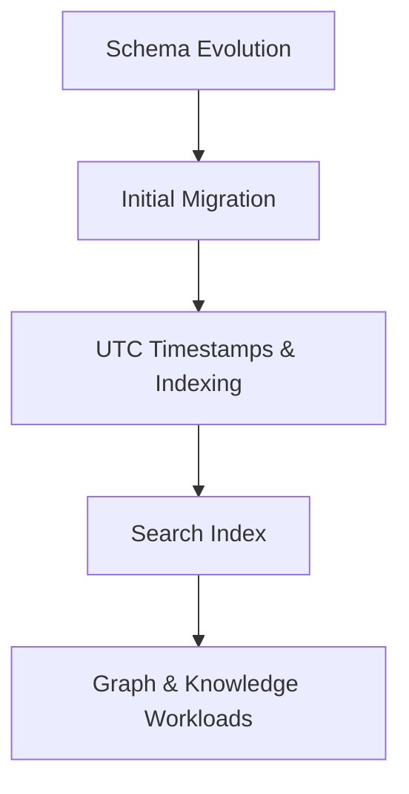

**Diagram sources**
- [alembic/versions/20240812184546_6d16b920a3ec_initial_migration.py](file://app/alembic/versions/20240812184546_6d16b920a3ec_initial_migration.py)
- [alembic/versions/20240812211350_bcc569077106_utc_timestamps_and_indexing.py](file://app/alembic/versions/20240812211350_bcc569077106_utc_timestamps_and_indexing.py)
- [alembic/versions/20240826215938_3c7be0985b17_search_index.py](file://app/alembic/versions/20240826215938_3c7be0985b17_search_index.py)

**Section sources**
- [alembic/versions/20240826215938_3c7be0985b17_search_index.py](file://app/alembic/versions/20240826215938_3c7be0985b17_search_index.py#L1-L200)
- [alembic/versions/20240812211350_bcc569077106_utc_timestamps_and_indexing.py](file://app/alembic/versions/20240812211350_bcc569077106_utc_timestamps_and_indexing.py#L1-L200)

## Dependency Analysis
- Stores depend on BaseStore for unified sync/async session handling
- Services depend on SQLAlchemy sessions for transactional operations
- Media models integrate with storage strategies for provider-specific descriptors
- Database configuration centralizes connection pooling and async session creation

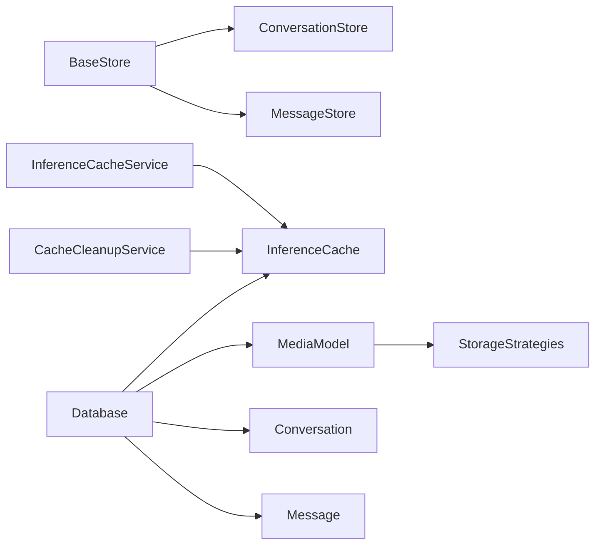

**Diagram sources**
- [base_store.py](file://app/core/base_store.py#L7-L16)
- [conversation_store.py](file://app/modules/conversations/conversation/conversation_store.py#L18-L119)
- [message_store.py](file://app/modules/conversations/message/message_store.py#L8-L83)
- [inference_cache_service.py](file://app/modules/parsing/services/inference_cache_service.py#L10-L149)
- [cache_cleanup_service.py](file://app/modules/parsing/services/cache_cleanup_service.py#L11-L90)
- [media_model.py](file://app/modules/media/media_model.py#L24-L47)
- [storage_strategies.py](file://app/core/storage_strategies.py#L22-L115)
- [database.py](file://app/core/database.py#L13-L52)

**Section sources**
- [base_store.py](file://app/core/base_store.py#L1-L16)
- [database.py](file://app/core/database.py#L1-L117)

## Performance Considerations
- Connection pooling and pre-ping reduce connection churn and stale connections
- Async sessions minimize blocking for I/O-bound operations
- Indexes on timestamps and foreign keys improve search and join performance
- Cache access counters and last_accessed enable least-accessed eviction
- TTL-based cleanup prevents unbounded growth of the inference cache
- Archival of messages reduces active dataset size for hot queries

Recommendations:
- Monitor cache hit ratio and adjust TTL and max entry thresholds
- Use pagination and selective eager loading to avoid large result sets
- Keep indexes aligned with query patterns; add composite indexes for frequent filters
- Consider partitioning large tables by time or tenant if growth warrants

**Section sources**
- [database.py](file://app/core/database.py#L13-L52)
- [cache_cleanup_service.py](file://app/modules/parsing/services/cache_cleanup_service.py#L14-L28)
- [alembic/versions/20240812211350_bcc569077106_utc_timestamps_and_indexing.py](file://app/alembic/versions/20240812211350_bcc569077106_utc_timestamps_and_indexing.py#L1-L200)

## Troubleshooting Guide
Common issues and remedies:
- Cache race conditions during insertion: handled by retry-on-conflict and re-fetch
- Invalid TTL configuration: fallback to default with warnings
- Async session binding across tasks: use fresh non-pooled sessions for Celery
- Store errors masked by generic exceptions: log and re-raise with context

Operational checks:
- Verify cache stats for anomaly detection
- Confirm cleanup runs and logs expected deletions
- Validate provider credentials for media storage backends

**Section sources**
- [inference_cache_service.py](file://app/modules/parsing/services/inference_cache_service.py#L113-L127)
- [cache_cleanup_service.py](file://app/modules/parsing/services/cache_cleanup_service.py#L15-L28)
- [database.py](file://app/core/database.py#L55-L92)

## Conclusion
Potpie’s storage strategy blends relational durability with targeted caching and externalized media storage. The design emphasizes:
- Predictable performance via connection pooling and async I/O
- Controlled lifecycle for cached inference data
- Flexible media storage through provider strategies
- Scalable retrieval patterns for conversations and messages
- Evolvable schema with indexing and migrations

## Appendices

### Schema and Migration Highlights
- Inference cache table added with unique content hash and access metrics
- Media attachments and message attachments tables for asset metadata
- Search index migration enabling robust search capabilities
- UTC timestamps and indexing improvements for performance

**Section sources**
- [alembic/versions/20250923_add_inference_cache_table.py](file://app/alembic/versions/20250923_add_inference_cache_table.py)
- [alembic/versions/20250626135047_a7f9c1ec89e2_add_media_attachments_support.py](file://app/alembic/versions/20250626135047_a7f9c1ec89e2_add_media_attachments_support.py)
- [alembic/versions/20250626135404_ce87e879766b_add_message_attachments_table.py](file://app/alembic/versions/20250626135404_ce87e879766b_add_message_attachments_table.py)
- [alembic/versions/20240826215938_3c7be0985b17_search_index.py](file://app/alembic/versions/20240826215938_3c7be0985b17_search_index.py)
- [alembic/versions/20240812211350_bcc569077106_utc_timestamps_and_indexing.py](file://app/alembic/versions/20240812211350_bcc569077106_utc_timestamps_and_indexing.py)
- [alembic/versions/20240812184546_6d16b920a3ec_initial_migration.py](file://app/alembic/versions/20240812184546_6d16b920a3ec_initial_migration.py)