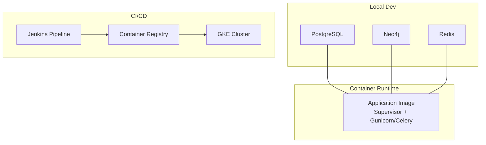
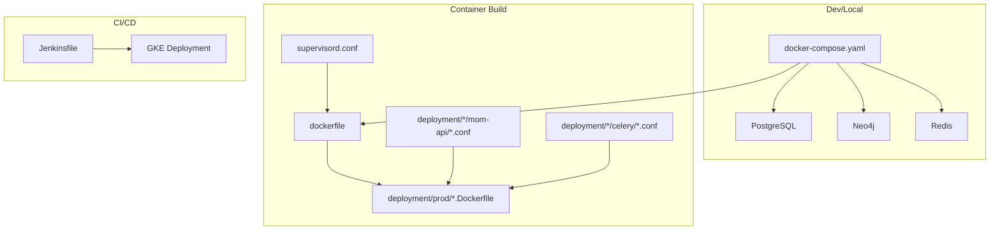
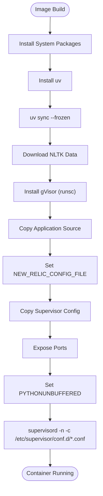
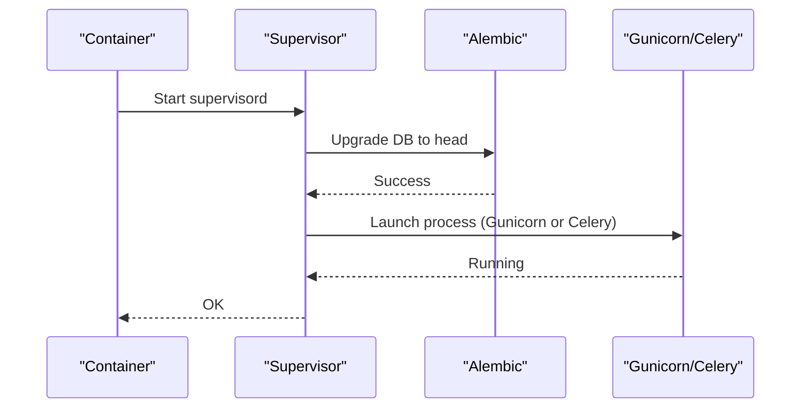
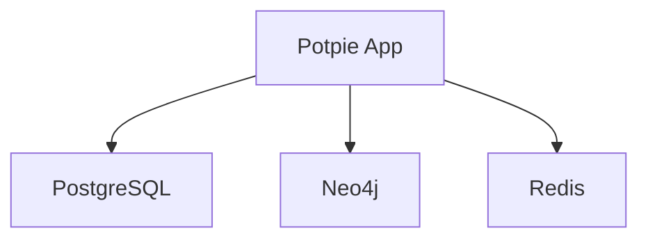
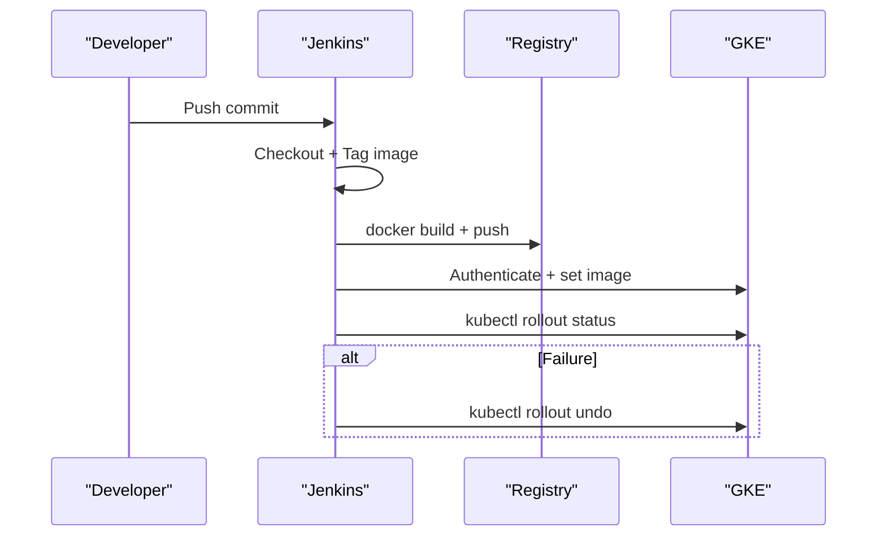
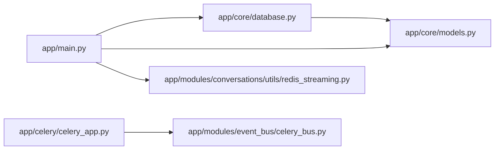

# Deployment & Operations

<cite>
**Referenced Files in This Document**
- [docker-compose.yaml](file://docker-compose.yaml)
- [dockerfile](file://dockerfile)
- [supervisord.conf](file://supervisord.conf)
- [.env.template](file://.env.template)
- [Jenkinsfile](file://Jenkinsfile)
- [deployment/prod/mom-api/api.Dockerfile](file://deployment/prod/mom-api/api.Dockerfile)
- [deployment/prod/convo-server/convo.Dockerfile](file://deployment/prod/convo-server/convo.Dockerfile)
- [deployment/prod/celery/celery.Dockerfile](file://deployment/prod/celery/celery.Dockerfile)
- [deployment/prod/mom-api/mom-api-supervisord.conf](file://deployment/prod/mom-api/mom-api-supervisord.conf)
- [deployment/prod/convo-server/convo-api-supervisord.conf](file://deployment/prod/convo-server/convo-api-supervisord.conf)
- [deployment/prod/celery/celery-api-supervisord.conf](file://deployment/prod/celery/celery-api-supervisord.conf)
- [deployment/stage/mom-api/api.Dockerfile](file://deployment/stage/mom-api/api.Dockerfile)
- [deployment/stage/mom-api/mom-api-supervisord.conf](file://deployment/stage/mom-api/mom-api-supervisord.conf)
- [deployment/stage/convo-server/convo-api-supervisord.conf](file://deployment/stage/convo-server/convo-api-supervisord.conf)
- [app/main.py](file://app/main.py)
- [app/celery/celery_app.py](file://app/celery/celery_app.py)
- [app/celery/worker.py](file://app/celery/worker.py)
- [app/core/database.py](file://app/core/database.py)
- [app/core/models.py](file://app/core/models.py)
- [app/core/base_model.py](file://app/core/base_model.py)
- [app/core/config_provider.py](file://app/core/config_provider.py)
- [app/utils/logger.py](file://app/utils/logger.py)
- [app/utils/logging_middleware.py](file://app/utils/logging_middleware.py)
- [app/utils/posthog_helper.py](file://app/utils/posthog_helper.py)
- [app/utils/email_helper.py](file://app/utils/email_helper.py)
- [app/modules/auth/auth_router.py](file://app/modules/auth/auth_router.py)
- [app/modules/code_provider/github/github_router.py](file://app/modules/code_provider/github/github_router.py)
- [app/modules/conversations/conversations_router.py](file://app/modules/conversations/conversations_router.py)
- [app/modules/integrations/integrations_router.py](file://app/modules/integrations/integrations_router.py)
- [app/modules/search/search_router.py](file://app/modules/search/search_router.py)
- [app/modules/media/media_router.py](file://app/modules/media/media_router.py)
- [app/modules/users/user_router.py](file://app/modules/users/user_router.py)
- [app/modules/tasks/task_service.py](file://app/modules/tasks/task_service.py)
- [app/modules/usage/usage_service.py](file://app/modules/usage/usage_service.py)
- [app/modules/parsing/graph_construction/parsing_router.py](file://app/modules/parsing/graph_construction/parsing_router.py)
- [app/modules/parsing/services/inference_cache_service.py](file://app/modules/parsing/services/inference_cache_service.py)
- [app/modules/intelligence/provider/provider_router.py](file://app/modules/intelligence/provider/provider_router.py)
- [app/modules/intelligence/tools/tool_router.py](file://app/modules/intelligence/tools/tool_router.py)
- [app/modules/event_bus/celery_bus.py](file://app/modules/event_bus/celery_bus.py)
- [app/modules/event_bus/tasks/event_tasks.py](file://app/modules/event_bus/tasks/event_tasks.py)
- [app/modules/event_bus/handlers/webhook_handler.py](file://app/modules/event_bus/handlers/webhook_handler.py)
- [app/modules/key_management/secret_manager.py](file://app/modules/key_management/secret_manager.py)
- [app/modules/key_management/secrets_schema.py](file://app/modules/key_management/secrets_schema.py)
- [app/modules/repo_manager/repo_manager.py](file://app/modules/repo_manager/repo_manager.py)
- [app/modules/repo_manager/repo_manager_interface.py](file://app/modules/repo_manager/repo_manager_interface.py)
- [app/modules/search/search_service.py](file://app/modules/search/search_service.py)
- [app/modules/search/search_models.py](file://app/modules/search/search_models.py)
- [app/modules/search/search_schema.py](file://app/modules/search/search_schema.py)
- [app/modules/media/media_service.py](file://app/modules/media/media_service.py)
- [app/modules/media/media_model.py](file://app/modules/media/media_model.py)
- [app/modules/media/media_schema.py](file://app/modules/media/media_schema.py)
- [app/modules/users/user_service.py](file://app/modules/users/user_service.py)
- [app/modules/users/user_model.py](file://app/modules/users/user_model.py)
- [app/modules/users/user_schema.py](file://app/modules/users/user_schema.py)
- [app/modules/conversations/conversation/conversation_service.py](file://app/modules/conversations/conversation/conversation_service.py)
- [app/modules/conversations/message/message_service.py](file://app/modules/conversations/message/message_service.py)
- [app/modules/conversations/session/session_service.py](file://app/modules/conversations/session/session_service.py)
- [app/modules/conversations/utils/redis_streaming.py](file://app/modules/conversations/utils/redis_streaming.py)
- [app/modules/conversations/access/access_service.py](file://app/modules/conversations/access/access_service.py)
- [app/modules/conversations/access/access_schema.py](file://app/modules/conversations/access/access_schema.py)
- [app/modules/intelligence/agents/agents_service.py](file://app/modules/intelligence/agents/agents_service.py)
- [app/modules/intelligence/prompts/prompt_service.py](file://app/modules/intelligence/prompts/prompt_service.py)
- [app/modules/intelligence/memory/chat_history_service.py](file://app/modules/intelligence/memory/chat_history_service.py)
- [app/modules/intelligence/tracing/phoenix_tracer.py](file://app/modules/intelligence/tracing/phoenix_tracer.py)
- [app/modules/integrations/integrations_service.py](file://app/modules/integrations/integrations_service.py)
- [app/modules/integrations/integration_model.py](file://app/modules/integrations/integration_model.py)
- [app/modules/integrations/atlassian_oauth_base.py](file://app/modules/integrations/atlassian_oauth_base.py)
- [app/modules/integrations/jira_oauth.py](file://app/modules/integrations/jira_oauth.py)
- [app/modules/integrations/confluence_oauth.py](file://app/modules/integrations/confluence_oauth.py)
- [app/modules/integrations/linear_oauth.py](file://app/modules/integrations/linear_oauth.py)
- [app/modules/integrations/sentry_oauth_v2.py](file://app/modules/integrations/sentry_oauth_v2.py)
- [app/modules/integrations/token_encryption.py](file://app/modules/integrations/token_encryption.py)
- [app/modules/integrations/integrations_schema.py](file://app/modules/integrations/integrations_schema.py)
- [app/modules/parsing/graph_construction/code_graph_service.py](file://app/modules/parsing/graph_construction/code_graph_service.py)
- [app/modules/parsing/graph_construction/parsing_service.py](file://app/modules/parsing/graph_construction/parsing_service.py)
- [app/modules/parsing/graph_construction/parsing_controller.py](file://app/modules/parsing/graph_construction/parsing_controller.py)
- [app/modules/parsing/graph_construction/parsing_schema.py](file://app/modules/parsing/graph_construction/parsing_schema.py)
- [app/modules/parsing/knowledge_graph/inference_service.py](file://app/modules/parsing/knowledge_graph/inference_service.py)
- [app/modules/parsing/knowledge_graph/inference_schema.py](file://app/modules/parsing/knowledge_graph/inference_schema.py)
- [app/modules/parsing/services/cache_cleanup_service.py](file://app/modules/parsing/services/cache_cleanup_service.py)
- [app/modules/parsing/tasks/cache_cleanup_tasks.py](file://app/modules/parsing/tasks/cache_cleanup_tasks.py)
- [app/modules/parsing/models/inference_cache_model.py](file://app/modules/parsing/models/inference_cache_model.py)
- [app/modules/parsing/utils/content_hash.py](file://app/modules/parsing/utils/content_hash.py)
- [app/modules/parsing/utils/encoding_detector.py](file://app/modules/parsing/utils/encoding_detector.py)
- [app/modules/parsing/utils/encoding_patch.py](file://app/modules/parsing/utils/encoding_patch.py)
- [app/modules/parsing/utils/repo_name_normalizer.py](file://app/modules/parsing/utils/repo_name_normalizer.py)
- [app/modules/parsing/utils/cache_diagnostics.py](file://app/modules/parsing/utils/cache_diagnostics.py)
- [app/modules/key_management/secret_manager.py](file://app/modules/key_management/secret_manager.py)
- [app/modules/key_management/secrets_schema.py](file://app/modules/key_management/secrets_schema.py)
- [app/modules/usage/usage_controller.py](file://app/modules/usage/usage_controller.py)
- [app/modules/usage/usage_router.py](file://app/modules/usage/usage_router.py)
- [app/modules/usage/usage_schema.py](file://app/modules/usage/usage_schema.py)
- [app/modules/tasks/task_model.py](file://app/modules/tasks/task_model.py)
- [app/modules/tasks/task_service.py](file://app/modules/tasks/task_service.py)
- [app/modules/users/user_controller.py](file://app/modules/users/user_controller.py)
- [app/modules/users/user_router.py](file://app/modules/users/user_router.py)
- [app/modules/users/user_schema.py](file://app/modules/users/user_schema.py)
- [app/modules/users/user_model.py](file://app/modules/users/user_model.py)
- [app/modules/media/media_controller.py](file://app/modules/media/media_controller.py)
- [app/modules/media/media_router.py](file://app/modules/media/media_router.py)
- [app/modules/media/media_schema.py](file://app/modules/media/media_schema.py)
- [app/modules/media/media_model.py](file://app/modules/media/media_model.py)
- [app/modules/search/search_controller.py](file://app/modules/search/search_controller.py)
- [app/modules/search/search_router.py](file://app/modules/search/search_router.py)
- [app/modules/search/search_schema.py](file://app/modules/search/search_schema.py)
- [app/modules/search/search_service.py](file://app/modules/search/search_service.py)
- [app/modules/search/search_models.py](file://app/modules/search/search_models.py)
- [app/modules/integrations/integrations_controller.py](file://app/modules/integrations/integrations_controller.py)
- [app/modules/integrations/integrations_router.py](file://app/modules/integrations/integrations_router.py)
- [app/modules/integrations/integrations_schema.py](file://app/modules/integrations/integrations_schema.py)
- [app/modules/integrations/integrations_service.py](file://app/modules/integrations/integrations_service.py)
- [app/modules/integrations/integration_model.py](file://app/modules/integrations/integration_model.py)
- [app/modules/integrations/atlassian_oauth_base.py](file://app/modules/integrations/atlassian_oauth_base.py)
- [app/modules/integrations/jira_oauth.py](file://app/modules/integrations/jira_oauth.py)
- [app/modules/integrations/confluence_oauth.py](file://app/modules/integrations/confluence_oauth.py)
- [app/modules/integrations/linear_oauth.py](file://app/modules/integrations/linear_oauth.py)
- [app/modules/integrations/sentry_oauth_v2.py](file://app/modules/integrations/sentry_oauth_v2.py)
- [app/modules/integrations/token_encryption.py](file://app/modules/integrations/token_encryption.py)
- [app/modules/intelligence/provider/provider_controller.py](file://app/modules/intelligence/provider/provider_controller.py)
- [app/modules/intelligence/provider/provider_router.py](file://app/modules/intelligence/provider/provider_router.py)
- [app/modules/intelligence/provider/provider_schema.py](file://app/modules/intelligence/provider/provider_schema.py)
- [app/modules/intelligence/provider/provider_service.py](file://app/modules/intelligence/provider/provider_service.py)
- [app/modules/intelligence/agents/agents_controller.py](file://app/modules/intelligence/agents/agents_controller.py)
- [app/modules/intelligence/agents/agents_router.py](file://app/modules/intelligence/agents/agents_router.py)
- [app/modules/intelligence/agents/agents_service.py](file://app/modules/intelligence/agents/agents_service.py)
- [app/modules/intelligence/prompts/prompt_controller.py](file://app/modules/intelligence/prompts/prompt_controller.py)
- [app/modules/intelligence/prompts/prompt_router.py](file://app/modules/intelligence/prompts/prompt_router.py)
- [app/modules/intelligence/prompts/prompt_schema.py](file://app/modules/intelligence/prompts/prompt_schema.py)
- [app/modules/intelligence/prompts/prompt_service.py](file://app/modules/intelligence/prompts/prompt_service.py)
- [app/modules/intelligence/memory/chat_history_service.py](file://app/modules/intelligence/memory/chat_history_service.py)
- [app/modules/intelligence/tracing/phoenix_tracer.py](file://app/modules/intelligence/tracing/phoenix_tracer.py)
- [app/modules/intelligence/tools/tool_controller.py](file://app/modules/intelligence/tools/tool_controller.py)
- [app/modules/intelligence/tools/tool_router.py](file://app/modules/intelligence/tools/tool_router.py)
- [app/modules/intelligence/tools/tool_schema.py](file://app/modules/intelligence/tools/tool_schema.py)
- [app/modules/intelligence/tools/tool_service.py](file://app/modules/intelligence/tools/tool_service.py)
- [app/modules/intelligence/tools/tool_utils.py](file://app/modules/intelligence/tools/tool_utils.py)
- [app/modules/intelligence/tools/change_detection/change_detection_tool.py](file://app/modules/intelligence/tools/change_detection/change_detection_tool.py)
- [app/modules/intelligence/tools/code_query_tools/bash_command_tool.py](file://app/modules/intelligence/tools/code_query_tools/bash_command_tool.py)
- [app/modules/intelligence/tools/code_query_tools/code_analysis.py](file://app/modules/intelligence/tools/code_query_tools/code_analysis.py)
- [app/modules/intelligence/tools/code_query_tools/get_code_file_structure.py](file://app/modules/intelligence/tools/code_query_tools/get_code_file_structure.py)
- [app/modules/intelligence/tools/code_query_tools/get_code_from_node_id_tool.py](file://app/modules/intelligence/tools/code_query_tools/get_code_from_node_id_tool.py)
- [app/modules/intelligence/tools/code_query_tools/get_code_from_multiple_node_ids_tool.py](file://app/modules/intelligence/tools/code_query_tools/get_code_from_multiple_node_ids_tool.py)
- [app/modules/intelligence/tools/code_query_tools/get_code_from_probable_node_name_tool.py](file://app/modules/intelligence/tools/code_query_tools/get_code_from_probable_node_name_tool.py)
- [app/modules/intelligence/tools/code_query_tools/get_node_neighbours_from_node_id_tool.py](file://app/modules/intelligence/tools/code_query_tools/get_node_neighbours_from_node_id_tool.py)
- [app/modules/intelligence/tools/code_query_tools/intelligent_code_graph_tool.py](file://app/modules/intelligence/tools/code_query_tools/intelligent_code_graph_tool.py)
- [app/modules/intelligence/tools/kg_based_tools/ask_knowledge_graph_queries_tool.py](file://app/modules/intelligence/tools/kg_based_tools/ask_knowledge_graph_queries_tool.py)
- [app/modules/intelligence/tools/kg_based_tools/get_nodes_from_tags_tool.py](file://app/modules/intelligence/tools/kg_based_tools/get_nodes_from_tags_tool.py)
- [app/modules/intelligence/tools/web_tools/code_provider_add_pr_comment.py](file://app/modules/intelligence/tools/web_tools/code_provider_add_pr_comment.py)
- [app/modules/intelligence/tools/web_tools/code_provider_create_branch.py](file://app/modules/intelligence/tools/web_tools/code_provider_create_branch.py)
- [app/modules/intelligence/tools/web_tools/code_provider_create_pr.py](file://app/modules/intelligence/tools/web_tools/code_provider_create_pr.py)
- [app/modules/intelligence/tools/web_tools/code_provider_tool.py](file://app/modules/intelligence/tools/web_tools/code_provider_tool.py)
- [app/modules/intelligence/tools/web_tools/code_provider_update_file.py](file://app/modules/intelligence/tools/web_tools/code_provider_update_file.py)
- [app/modules/intelligence/tools/web_tools/github_tool.py](file://app/modules/intelligence/tools/web_tools/github_tool.py)
- [app/modules/intelligence/tools/web_tools/web_search_tool.py](file://app/modules/intelligence/tools/web_tools/web_search_tool.py)
- [app/modules/intelligence/tools/web_tools/webpage_extractor_tool.py](file://app/modules/intelligence/tools/web_tools/webpage_extractor_tool.py)
- [app/modules/intelligence/tools/confluence_tools/add_confluence_comment_tool.py](file://app/modules/intelligence/tools/confluence_tools/add_confluence_comment_tool.py)
- [app/modules/intelligence/tools/confluence_tools/create_confluence_page_tool.py](file://app/modules/intelligence/tools/confluence_tools/create_confluence_page_tool.py)
- [app/modules/intelligence/tools/confluence_tools/get_confluence_page_tool.py](file://app/modules/intelligence/tools/confluence_tools/get_confluence_page_tool.py)
- [app/modules/intelligence/tools/confluence_tools/get_confluence_space_pages_tool.py](file://app/modules/intelligence/tools/confluence_tools/get_confluence_space_pages_tool.py)
- [app/modules/intelligence/tools/confluence_tools/get_confluence_spaces_tool.py](file://app/modules/intelligence/tools/confluence_tools/get_confluence_spaces_tool.py)
- [app/modules/intelligence/tools/confluence_tools/search_confluence_pages_tool.py](file://app/modules/intelligence/tools/confluence_tools/search_confluence_pages_tool.py)
- [app/modules/intelligence/tools/confluence_tools/update_confluence_page_tool.py](file://app/modules/intelligence/tools/confluence_tools/update_confluence_page_tool.py)
- [app/modules/intelligence/tools/jira_tools/add_jira_comment_tool.py](file://app/modules/intelligence/tools/jira_tools/add_jira_comment_tool.py)
- [app/modules/intelligence/tools/jira_tools/create_jira_issue_tool.py](file://app/modules/intelligence/tools/jira_tools/create_jira_issue_tool.py)
- [app/modules/intelligence/tools/jira_tools/get_jira_issue_tool.py](file://app/modules/intelligence/tools/jira_tools/get_jira_issue_tool.py)
- [app/modules/intelligence/tools/jira_tools/get_jira_project_details_tool.py](file://app/modules/intelligence/tools/jira_tools/get_jira_project_details_tool.py)
- [app/modules/intelligence/tools/jira_tools/get_jira_project_users_tool.py](file://app/modules/intelligence/tools/jira_tools/get_jira_project_users_tool.py)
- [app/modules/intelligence/tools/jira_tools/get_jira_projects_tool.py](file://app/modules/intelligence/tools/jira_tools/get_jira_projects_tool.py)
- [app/modules/intelligence/tools/jira_tools/link_jira_issues_tool.py](file://app/modules/intelligence/tools/jira_tools/link_jira_issues_tool.py)
- [app/modules/intelligence/tools/jira_tools/search_jira_issues_tool.py](file://app/modules/intelligence/tools/jira_tools/search_jira_issues_tool.py)
- [app/modules/intelligence/tools/jira_tools/transition_jira_issue_tool.py](file://app/modules/intelligence/tools/jira_tools/transition_jira_issue_tool.py)
- [app/modules/intelligence/tools/jira_tools/update_jira_issue_tool.py](file://app/modules/intelligence/tools/jira_tools/update_jira_issue_tool.py)
- [app/modules/intelligence/tools/linear_tools/get_linear_issue_tool.py](file://app/modules/intelligence/tools/linear_tools/get_linear_issue_tool.py)
- [app/modules/intelligence/tools/linear_tools/linear_client.py](file://app/modules/intelligence/tools/linear_tools/linear_client.py)
- [app/modules/intelligence/tools/linear_tools/update_linear_issue_tool.py](file://app/modules/intelligence/tools/linear_tools/update_linear_issue_tool.py)
- [app/modules/intelligence/tools/reasoning_manager.py](file://app/modules/intelligence/tools/reasoning_manager.py)
- [app/modules/intelligence/tools/requirement_verification_tool.py](file://app/modules/intelligence/tools/requirement_verification_tool.py)
- [app/modules/intelligence/tools/think_tool.py](file://app/modules/intelligence/tools/think_tool.py)
- [app/modules/intelligence/tools/todo_management_tool.py](file://app/modules/intelligence/tools/todo_management_tool.py)
- [app/modules/intelligence/tools/tool_router.py](file://app/modules/intelligence/tools/tool_router.py)
- [app/modules/intelligence/tools/tool_schema.py](file://app/modules/intelligence/tools/tool_schema.py)
- [app/modules/intelligence/tools/tool_service.py](file://app/modules/intelligence/tools/tool_service.py)
- [app/modules/intelligence/tools/tool_utils.py](file://app/modules/intelligence/tools/tool_utils.py)
- [app/modules/intelligence/tracing/phoenix_tracer.py](file://app/modules/intelligence/tracing/phoenix_tracer.py)
- [app/modules/intelligence/provider/anthropic_caching_model.py](file://app/modules/intelligence/provider/anthropic_caching_model.py)
- [app/modules/intelligence/provider/exceptions.py](file://app/modules/intelligence/provider/exceptions.py)
- [app/modules/intelligence/provider/llm_config.py](file://app/modules/intelligence/provider/llm_config.py)
- [app/modules/intelligence/provider/openrouter_gemini_model.py](file://app/modules/intelligence/provider/openrouter_gemini_model.py)
- [app/modules/intelligence/provider/provider_controller.py](file://app/modules/intelligence/provider/provider_controller.py)
- [app/modules/intelligence/provider/provider_router.py](file://app/modules/intelligence/provider/provider_router.py)
- [app/modules/intelligence/provider/provider_schema.py](file://app/modules/intelligence/provider/provider_schema.py)
- [app/modules/intelligence/provider/provider_service.py](file://app/modules/intelligence/provider/provider_service.py)
- [app/modules/intelligence/agents/chat_agents/auto_router_agent.py](file://app/modules/intelligence/agents/chat_agents/auto_router_agent.py)
- [app/modules/intelligence/agents/chat_agents/history_processor.py](file://app/modules/intelligence/agents/chat_agents/history_processor.py)
- [app/modules/intelligence/agents/chat_agents/stream_processor.py](file://app/modules/intelligence/agents/chat_agents/stream_processor.py)
- [app/modules/intelligence/agents/custom_agents/runtime_agent.py](file://app/modules/intelligence/agents/custom_agents/runtime_agent.py)
- [app/modules/intelligence/agents/custom_agents/custom_agent_controller.py](file://app/modules/intelligence/agents/custom_agents/custom_agent_controller.py)
- [app/modules/intelligence/agents/custom_agents/custom_agent_model.py](file://app/modules/intelligence/agents/custom_agents/custom_agent_model.py)
- [app/modules/intelligence/agents/custom_agents/custom_agent_router.py](file://app/modules/intelligence/agents/custom_agents/custom_agent_router.py)
- [app/modules/intelligence/agents/custom_agents/custom_agent_schema.py](file://app/modules/intelligence/agents/custom_agents/custom_agent_schema.py)
- [app/modules/intelligence/agents/custom_agents/custom_agents_service.py](file://app/modules/intelligence/agents/custom_agents/custom_agents_service.py)
- [app/modules/intelligence/agents/agents_controller.py](file://app/modules/intelligence/agents/agents_controller.py)
- [app/modules/intelligence/agents/agents_router.py](file://app/modules/intelligence/agents/agents_router.py)
- [app/modules/intelligence/agents/agents_service.py](file://app/modules/intelligence/agents/agents_service.py)
- [app/modules/intelligence/agents/chat_agent.py](file://app/modules/intelligence/agents/chat_agent.py)
- [app/modules/intelligence/agents/multi_agent_config.py](file://app/modules/intelligence/agents/multi_agent_config.py)
- [app/modules/intelligence/agents/chat_agents/multi_agent/delegation_manager.py](file://app/modules/intelligence/agents/chat_agents/multi_agent/delegation_manager.py)
- [app/modules/intelligence/agents/chat_agents/multi_agent/delegation_streamer.py](file://app/modules/intelligence/agents/chat_agents/multi_agent/delegation_streamer.py)
- [app/modules/intelligence/agents/chat_agents/multi_agent/execution_flows.py](file://app/modules/intelligence/agents/chat_agents/multi_agent/execution_flows.py)
- [app/modules/intelligence/agents/chat_agents/multi_agent/stream_processor.py](file://app/modules/intelligence/agents/chat_agents/multi_agent/stream_processor.py)
- [app/modules/intelligence/agents/chat_agents/multi_agent/utils/context_utils.py](file://app/modules/intelligence/agents/chat_agents/multi_agent/utils/context_utils.py)
- [app/modules/intelligence/agents/chat_agents/multi_agent/utils/delegation_utils.py](file://app/modules/intelligence/agents/chat_agents/multi_agent/utils/delegation_utils.py)
- [app/modules/intelligence/agents/chat_agents/multi_agent/utils/message_history_utils.py](file://app/modules/intelligence/agents/chat_agents/multi_agent/utils/message_history_utils.py)
- [app/modules/intelligence/agents/chat_agents/multi_agent/utils/multimodal_utils.py](file://app/modules/intelligence/agents/chat_agents/multi_agent/utils/multimodal_utils.py)
- [app/modules/intelligence/agents/chat_agents/multi_agent/utils/tool_call_stream_manager.py](file://app/modules/intelligence/agents/chat_agents/multi_agent/utils/tool_call_stream_manager.py)
- [app/modules/intelligence/agents/chat_agents/multi_agent/utils/tool_utils.py](file://app/modules/intelligence/agents/chat_agents/multi_agent/utils/tool_utils.py)
- [app/modules/intelligence/agents/chat_agents/system_agents/blast_radius_agent.py](file://app/modules/intelligence/agents/chat_agents/system_agents/blast_radius_agent.py)
- [app/modules/intelligence/agents/chat_agents/system_agents/code_gen_agent.py](file://app/modules/intelligence/agents/chat_agents/system_agents/code_gen_agent.py)
- [app/modules/intelligence/agents/chat_agents/system_agents/debug_agent.py](file://app/modules/intelligence/agents/chat_agents/system_agents/debug_agent.py)
- [app/modules/intelligence/agents/chat_agents/system_agents/general_purpose_agent.py](file://app/modules/intelligence/agents/chat_agents/system_agents/general_purpose_agent.py)
- [app/modules/intelligence/agents/chat_agents/system_agents/integration_test_agent.py](file://app/modules/intelligence/agents/chat_agents/system_agents/integration_test_agent.py)
- [app/modules/intelligence/agents/chat_agents/system_agents/low_level_design_agent.py](file://app/modules/intelligence/agents/chat_agents/system_agents/low_level_design_agent.py)
- [app/modules/intelligence/agents/chat_agents/system_agents/qna_agent.py](file://app/modules/intelligence/agents/chat_agents/system_agents/qna_agent.py)
- [app/modules/intelligence/agents/chat_agents/system_agents/sweb_debug_agent.py](file://app/modules/intelligence/agents/chat_agents/system_agents/sweb_debug_agent.py)
- [app/modules/intelligence/agents/chat_agents/system_agents/unit_test_agent.py](file://app/modules/intelligence/agents/chat_agents/system_agents/unit_test_agent.py)
- [app/modules/intelligence/agents/agent_config.py](file://app/modules/intelligence/agents/agent_config.py)
- [app/modules/intelligence/agents/agent_factory.py](file://app/modules/intelligence/agents/agent_factory.py)
- [app/modules/intelligence/agents/agent_instructions.py](file://app/modules/intelligence/agents/agent_instructions.py)
- [app/modules/intelligence/agents/supervisor_agent.py](file://app/modules/intelligence/agents/supervisor_agent.py)
- [app/modules/intelligence/agents/tool_helpers.py](file://app/modules/intelligence/agents/tool_helpers.py)
- [app/modules/intelligence/prompts/system_prompt_setup.py](file://app/modules/intelligence/prompts/system_prompt_setup.py)
- [app/modules/intelligence/tracing/phoenix_tracer.py](file://app/modules/intelligence/tracing/phoenix_tracer.py)
- [app/modules/intelligence/provider/provider_controller.py](file://app/modules/intelligence/provider/provider_controller.py)
- [app/modules/intelligence/provider/provider_router.py](file://app/modules/intelligence/provider/provider_router.py)
- [app/modules/intelligence/provider/provider_schema.py](file://app/modules/intelligence/provider/provider_schema.py)
- [app/modules/intelligence/provider/provider_service.py](file://app/modules/intelligence/provider/provider_service.py)
- [app/modules/intelligence/provider/llm_config.py](file://app/modules/intelligence/provider/llm_config.py)
- [app/modules/intelligence/provider/anthropic_caching_model.py](file://app/modules/intelligence/provider/anthropic_caching_model.py)
- [app/modules/intelligence/provider/openrouter_gemini_model.py](file://app/modules/intelligence/provider/openrouter_gemini_model.py)
- [app/modules/intelligence/provider/exceptions.py](file://app/modules/intelligence/provider/exceptions.py)
- [app/modules/intelligence/tools/tool_controller.py](file://app/modules/intelligence/tools/tool_controller.py)
- [app/modules/intelligence/tools/tool_router.py](file://app/modules/intelligence/tools/tool_router.py)
- [app/modules/intelligence/tools/tool_schema.py](file://app/modules/intelligence/tools/tool_schema.py)
- [app/modules/intelligence/tools/tool_service.py](file://app/modules/intelligence/tools/tool_service.py)
- [app/modules/intelligence/tools/tool_utils.py](file://app/modules/intelligence/tools/tool_utils.py)
- [app/modules/intelligence/tools/reasoning_manager.py](file://app/modules/intelligence/tools/reasoning_manager.py)
- [app/modules/intelligence/tools/requirement_verification_tool.py](file://app/modules/intelligence/tools/requirement_verification_tool.py)
- [app/modules/intelligence/tools/think_tool.py](file://app/modules/intelligence/tools/think_tool.py)
- [app/modules/intelligence/tools/todo_management_tool.py](file://app/modules/intelligence/tools/todo_management_tool.py)
- [app/modules/intelligence/tools/tool_router.py](file://app/modules/intelligence/tools/tool_router.py)
- [app/modules/intelligence/tools/tool_schema.py](file://app/modules/intelligence/tools/tool_schema.py)
- [app/modules/intelligence/tools/tool_service.py](file://app/modules/intelligence/tools/tool_service.py)
- [app/modules/intelligence/tools/tool_utils.py](file://app/modules/intelligence/tools/tool_utils.py)
- [app/modules/intelligence/tools/change_detection/change_detection_tool.py](file://app/modules/intelligence/tools/change_detection/change_detection_tool.py)
- [app/modules/intelligence/tools/code_query_tools/bash_command_tool.py](file://app/modules/intelligence/tools/code_query_tools/bash_command_tool.py)
- [app/modules/intelligence/tools/code_query_tools/code_analysis.py](file://app/modules/intelligence/tools/code_query_tools/code_analysis.py)
- [app/modules/intelligence/tools/code_query_tools/get_code_file_structure.py](file://app/modules/intelligence/tools/code_query_tools/get_code_file_structure.py)
- [app/modules/intelligence/tools/code_query_tools/get_code_from_node_id_tool.py](file://app/modules/intelligence/tools/code_query_tools/get_code_from_node_id_tool.py)
- [app/modules/intelligence/tools/code_query_tools/get_code_from_multiple_node_ids_tool.py](file://app/modules/intelligence/tools/code_query_tools/get_code_from_multiple_node_ids_tool.py)
- [app/modules/intelligence/tools/code_query_tools/get_code_from_probable_node_name_tool.py](file://app/modules/intelligence/tools/code_query_tools/get_code_from_probable_node_name_tool.py)
- [app/modules/intelligence/tools/code_query_tools/get_node_neighbours_from_node_id_tool.py](file://app/modules/intelligence/tools/code_query_tools/get_node_neighbours_from_node_id_tool.py)
- [app/modules/intelligence/tools/code_query_tools/intelligent_code_graph_tool.py](file://app/modules/intelligence/tools/code_query_tools/intelligent_code_graph_tool.py)
- [app/modules/intelligence/tools/kg_based_tools/ask_knowledge_graph_queries_tool.py](file://app/modules/intelligence/tools/kg_based_tools/ask_knowledge_graph_queries_tool.py)
- [app/modules/intelligence/tools/kg_based_tools/get_nodes_from_tags_tool.py](file://app/modules/intelligence/tools/kg_based_tools/get_nodes_from_tags_tool.py)
- [app/modules/intelligence/tools/web_tools/code_provider_add_pr_comment.py](file://app/modules/intelligence/tools/web_tools/code_provider_add_pr_comment.py)
- [app/modules/intelligence/tools/web_tools/code_provider_create_branch.py](file://app/modules/intelligence/tools/web_tools/code_provider_create_branch.py)
- [app/modules/intelligence/tools/web_tools/code_provider_create_pr.py](file://app/modules/intelligence/tools/web_tools/code_provider_create_pr.py)
- [app/modules/intelligence/tools/web_tools/code_provider_tool.py](file://app/modules/intelligence/tools/web_tools/code_provider_tool.py)
- [app/modules/intelligence/tools/web_tools/code_provider_update_file.py](file://app/modules/intelligence/tools/web_tools/code_provider_update_file.py)
- [app/modules/intelligence/tools/web_tools/github_tool.py](file://app/modules/intelligence/tools/web_tools/github_tool.py)
- [app/modules/intelligence/tools/web_tools/web_search_tool.py](file://app/modules/intelligence/tools/web_tools/web_search_tool.py)
- [app/modules/intelligence/tools/web_tools/webpage_extractor_tool.py](file://app/modules/intelligence/tools/web_tools/webpage_extractor_tool.py)
- [app/modules/intelligence/tools/confluence_tools/add_confluence_comment_tool.py](file://app/modules/intelligence/tools/confluence_tools/add_confluence_comment_tool.py)
- [app/modules/intelligence/tools/confluence_tools/create_confluence_page_tool.py](file://app/modules/intelligence/tools/confluence_tools/create_confluence_page_tool.py)
- [app/modules/intelligence/tools/confluence_tools/get_confluence_page_tool.py](file://app/modules/intelligence/tools/confluence_tools/get_confluence_page_tool.py)
- [app/modules/intelligence/tools/confluence_tools/get_confluence_space_pages_tool.py](file://app/modules/intelligence/tools/confluence_tools/get_confluence_space_pages_tool.py)
- [app/modules/intelligence/tools/confluence_tools/get_confluence_spaces_tool.py](file://app/modules/intelligence/tools/confluence_tools/get_confluence_spaces_tool.py)
- [app/modules/intelligence/tools/confluence_tools/search_confluence_pages_tool.py](file://app/modules/intelligence/tools/confluence_tools/search_confluence_pages_tool.py)
- [app/modules/intelligence/tools/confluence_tools/update_confluence_page_tool.py](file://app/modules/intelligence/tools/confluence_tools/update_confluence_page_tool.py)
- [app/modules/intelligence/tools/jira_tools/add_jira_comment_tool.py](file://app/modules/intelligence/tools/jira_tools/add_jira_comment_tool.py)
- [app/modules/intelligence/tools/jira_tools/create_jira_issue_tool.py](file://app/modules/intelligence/tools/jira_tools/create_jira_issue_tool.py)
- [app/modules/intelligence/tools/jira_tools/get_jira_issue_tool.py](file://app/modules/intelligence/tools/jira_tools/get_jira_issue_tool.py)
- [app/modules/intelligence/tools/jira_tools/get_jira_project_details_tool.py](file://app/modules/intelligence/tools/jira_tools/get_jira_project_details_tool.py)
- [app/modules/intelligence/tools/jira_tools/get_jira_project_users_tool.py](file://app/modules/intelligence/tools/jira_tools/get_jira_project_users_tool.py)
- [app/modules/intelligence/tools/jira_tools/get_jira_projects_tool.py](file://app/modules/intelligence/tools/jira_tools/get_jira_projects_tool.py)
- [app/modules/intelligence/tools/jira_tools/link_jira_issues_tool.py](file://app/modules/intelligence/tools/jira_tools/link_jira_issues_tool.py)
- [app/modules/intelligence/tools/jira_tools/search_jira_issues_tool.py](file://app/modules/intelligence/tools/jira_tools/search_jira_issues_tool.py)
- [app/modules/intelligence/tools/jira_tools/transition_jira_issue_tool.py](file://app/modules/intelligence/tools/jira_tools/transition_jira_issue_tool.py)
- [app/modules/intelligence/tools/jira_tools/update_jira_issue_tool.py](file://app/modules/intelligence/tools/jira_tools/update_jira_issue_tool.py)
- [app/modules/intelligence/tools/linear_tools/get_linear_issue_tool.py](file://app/modules/intelligence/tools/linear_tools/get_linear_issue_tool.py)
- [app/modules/intelligence/tools/linear_tools/linear_client.py](file://app/modules/intelligence/tools/linear_tools/linear_client.py)
- [app/modules/intelligence/tools/linear_tools/update_linear_issue_tool.py](file://app/modules/intelligence/tools/linear_tools/update_linear_issue_tool.py)
- [app/modules/intelligence/tracing/phoenix_tracer.py](file://app/modules/intelligence/tracing/phoenix_tracer.py)
- [app/modules/intelligence/provider/provider_controller.py](file://app/modules/intelligence/provider/provider_controller.py)
- [app/modules/intelligence/provider/provider_router.py](file://app/modules/intelligence/provider/provider_router.py)
- [app/modules/intelligence/provider/provider_schema.py](file://app/modules/intelligence/provider/provider_schema.py)
- [app/modules/intelligence/provider/provider_service.py](file://app/modules/intelligence/provider/provider_service.py)
- [app/modules/intelligence/provider/llm_config.py](file://app/modules/intelligence/provider/llm_config.py)
- [app/modules/intelligence/provider/anthropic_caching_model.py](file://app/modules/intelligence/provider/anthropic_caching_model.py)
- [app/modules/intelligence/provider/openrouter_gemini_model.py](file://app/modules/intelligence/provider/openrouter_gemini_model.py)
- [app/modules/intelligence/provider/exceptions.py](file://app/modules/intelligence/provider/exceptions.py)
- [app/modules/intelligence/agents/agents_controller.py](file://app/modules/intelligence/agents/agents_controller.py)
- [app/modules/intelligence/agents/agents_router.py](file://app/modules/intelligence/agents/agents_router.py)
- [app/modules/intelligence/agents/agents_service.py](file://app/modules/intelligence/agents/agents_service.py)
- [app/modules/intelligence/agents/agent_config.py](file://app/modules/intelligence/agents/agent_config.py)
- [app/modules/intelligence/agents/agent_factory.py](file://app/modules/intelligence/agents/agent_factory.py)
- [app/modules/intelligence/agents/agent_instructions.py](file://app/modules/intelligence/agents/agent_instructions.py)
- [app/modules/intelligence/agents/supervisor_agent.py](file://app/modules/intelligence/agents/supervisor_agent.py)
- [app/modules/intelligence/agents/tool_helpers.py](file://app/modules/intelligence/agents/tool_helpers.py)
- [app/modules/intelligence/agents/chat_agent.py](file://app/modules/intelligence/agents/chat_agent.py)
- [app/modules/intelligence/agents/multi_agent_config.py](file://app/modules/intelligence/agents/multi_agent_config.py)
- [app/modules/intelligence/agents/chat_agents/auto_router_agent.py](file://app/modules/intelligence/agents/chat_agents/auto_router_agent.py)
- [app/modules/intelligence/agents/chat_agents/history_processor.py](file://app/modules/intelligence/agents/chat_agents/history_processor.py)
- [app/modules/intelligence/agents/chat_agents/stream_processor.py](file://app/modules/intelligence/agents/chat_agents/stream_processor.py)
- [app/modules/intelligence/agents/custom_agents/runtime_agent.py](file://app/modules/intelligence/agents/custom_agents/runtime_agent.py)
- [app/modules/intelligence/agents/custom_agents/custom_agent_controller.py](file://app/modules/intelligence/agents/custom_agents/custom_agent_controller.py)
- [app/modules/intelligence/agents/custom_agents/custom_agent_model.py](file://app/modules/intelligence/agents/custom_agents/custom_agent_model.py)
- [app/modules/intelligence/agents/custom_agents/custom_agent_router.py](file://app/modules/intelligence/agents/custom_agents/custom_agent_router.py)
- [app/modules/intelligence/agents/custom_agents/custom_agent_schema.py](file://app/modules/intelligence/agents/custom_agents/custom_agent_schema.py)
- [app/modules/intelligence/agents/custom_agents/custom_agents_service.py](file://app/modules/intelligence/agents/custom_agents/custom_agents_service.py)
- [app/modules/intelligence/agents/chat_agents/multi_agent/delegation_manager.py](file://app/modules/intelligence/agents/chat_agents/multi_agent/delegation_manager.py)
- [app/modules/intelligence/agents/chat_agents/multi_agent/delegation_streamer.py](file://app/modules/intelligence/agents/chat_agents/multi_agent/delegation_streamer.py)
- [app/modules/intelligence/agents/chat_agents/multi_agent/execution_flows.py](file://app/modules/intelligence/agents/chat_agents/multi_agent/execution_flows.py)
- [app/modules/intelligence/agents/chat_agents/multi_agent/stream_processor.py](file://app/modules/intelligence/agents/chat_agents/multi_agent/stream_processor.py)
- [app/modules/intelligence/agents/chat_agents/multi_agent/utils/context_utils.py](file://app/modules/intelligence/agents/chat_agents/multi_agent/utils/context_utils.py)
- [app/modules/intelligence/agents/chat_agents/multi_agent/utils/delegation_utils.py](file://app/modules/intelligence/agents/chat_agents/multi_agent/utils/delegation_utils.py)
- [app/modules/intelligence/agents/chat_agents/multi_agent/utils/message_history_utils.py](file://app/modules/intelligence/agents/chat_agents/multi_agent/utils/message_history_utils.py)
- [app/modules/intelligence/agents/chat_agents/multi_agent/utils/multimodal_utils.py](file://app/modules/intelligence/agents/chat_agents/multi_agent/utils/multimodal_utils.py)
- [app/modules/intelligence/agents/chat_agents/multi_agent/utils/tool_call_stream_manager.py](file://app/modules/intelligence/agents/chat_agents/multi_agent/utils/tool_call_stream_manager.py)
- [app/modules/intelligence/agents/chat_agents/multi_agent/utils/tool_utils.py](file://app/modules/intelligence/agents/chat_agents/multi_agent/utils/tool_utils.py)
- [app/modules/intelligence/agents/chat_agents/system_agents/blast_radius_agent.py](file://app/modules/intelligence/agents/chat_agents/system_agents/blast_radius_agent.py)
- [app/modules/intelligence/agents/chat_agents/system_agents/code_gen_agent.py](file://app/modules/intelligence/agents/chat_agents/system_agents/code_gen_agent.py)
- [app/modules/intelligence/agents/chat_agents/system_agents/debug_agent.py](file://app/modules/intelligence/agents/chat_agents/system_agents/debug_agent.py)
- [app/modules/intelligence/agents/chat_agents/system_agents/general_purpose_agent.py](file://app/modules/intelligence/agents/chat_agents/system_agents/general_purpose_agent.py)
- [app/modules/intelligence/agents/chat_agents/system_agents/integration_test_agent.py](file://app/modules/intelligence/agents/chat_agents/system_agents/integration_test_agent.py)
- [app/modules/intelligence/agents/chat_agents/system_agents/low_level_design_agent.py](file://app/modules/intelligence/agents/chat_agents/system_agents/low_level_design_agent.py)
- [app/modules/intelligence/agents/chat_agents/system_agents/qna_agent.py](file://app/modules/intelligence/agents/chat_agents/system_agents/qna_agent.py)
- [app/modules/intelligence/agents/chat_agents/system_agents/sweb_debug_agent.py](file://app/modules/intelligence/agents/chat_agents/system_agents/sweb_debug_agent.py)
- [app/modules/intelligence/agents/chat_agents/system_agents/unit_test_agent.py](file://app/modules/intelligence/agents/chat_agents/system_agents/unit_test_agent.py)
- [app/modules/intelligence/prompts/system_prompt_setup.py](file://app/modules/intelligence/prompts/system_prompt_setup.py)
- [app/modules/intelligence/prompts/prompt_controller.py](file://app/modules/intelligence/prompts/prompt_controller.py)
- [app/modules/intelligence/prompts/prompt_router.py](file://app/modules/intelligence/prompts/prompt_router.py)
- [app/modules/intelligence/prompts/prompt_schema.py](file://app/modules/intelligence/prompts/prompt_schema.py)
- [app/modules/intelligence/prompts/prompt_service.py](file://app/modules/intelligence/prompts/prompt_service.py)
- [app/modules/intelligence/memory/chat_history_service.py](file://app/modules/intelligence/memory/chat_history_service.py)
- [app/modules/intelligence/tracing/phoenix_tracer.py](file://app/modules/intelligence/tracing/phoenix_tracer.py)
- [app/modules/integrations/integrations_controller.py](file://app/modules/integrations/integrations_controller.py)
- [app/modules/integrations/integrations_router.py](file://app/modules/integrations/integrations_router.py)
- [app/modules/integrations/integrations_schema.py](file://app/modules/integrations/integrations_schema.py)
- [app/modules/integrations/integrations_service.py](file://app/modules/integrations/integrations_service.py)
- [app/modules/integrations/integration_model.py](file://app/modules/integrations/integration_model.py)
- [app/modules/integrations/atlassian_oauth_base.py](file://app/modules/integrations/atlassian_oauth_base.py)
- [app/modules/integrations/jira_oauth.py](file://app/modules/integrations/jira_oauth.py)
- [app/modules/integrations/confluence_oauth.py](file://app/modules/integrations/confluence_oauth.py)
- [app/modules/integrations/linear_oauth.py](file://app/modules/integrations/linear_oauth.py)
- [app/modules/integrations/sentry_oauth_v2.py](file://app/modules/integrations/sentry_oauth_v2.py)
- [app/modules/integrations/token_encryption.py](file://app/modules/integrations/token_encryption.py)
- [app/modules/parsing/graph_construction/code_graph_service.py](file://app/modules/parsing/graph_construction/code_graph_service.py)
- [app/modules/parsing/graph_construction/parsing_service.py](file://app/modules/parsing/graph_construction/parsing_service.py)
- [app/modules/parsing/graph_construction/parsing_controller.py](file://app/modules/parsing/graph_construction/parsing_controller.py)
- [app/modules/parsing/graph_construction/parsing_schema.py](file://app/modules/parsing/graph_construction/parsing_schema.py)
- [app/modules/parsing/knowledge_graph/inference_service.py](file://app/modules/parsing/knowledge_graph/inference_service.py)
- [app/modules/parsing/knowledge_graph/inference_schema.py](file://app/modules/parsing/knowledge_graph/inference_schema.py)
- [app/modules/parsing/services/cache_cleanup_service.py](file://app/modules/parsing/services/cache_cleanup_service.py)
- [app/modules/parsing/tasks/cache_cleanup_tasks.py](file://app/modules/parsing/tasks/cache_cleanup_tasks.py)
- [app/modules/parsing/models/inference_cache_model.py](file://app/modules/parsing/models/inference_cache_model.py)
- [app/modules/parsing/utils/content_hash.py](file://app/modules/parsing/utils/content_hash.py)
- [app/modules/parsing/utils/encoding_detector.py](file://app/modules/parsing/utils/encoding_detector.py)
- [app/modules/parsing/utils/encoding_patch.py](file://app/modules/parsing/utils/encoding_patch.py)
- [app/modules/parsing/utils/repo_name_normalizer.py](file://app/modules/parsing/utils/repo_name_normalizer.py)
- [app/modules/parsing/utils/cache_diagnostics.py](file://app/modules/parsing/utils/cache_diagnostics.py)
- [app/modules/key_management/secret_manager.py](file://app/modules/key_management/secret_manager.py)
- [app/modules/key_management/secrets_schema.py](file://app/modules/key_management/secrets_schema.py)
- [app/modules/usage/usage_controller.py](file://app/modules/usage/usage_controller.py)
- [app/modules/usage/usage_router.py](file://app/modules/usage/usage_router.py)
- [app/modules/usage/usage_schema.py](file://app/modules/usage/usage_schema.py)
- [app/modules/tasks/task_model.py](file://app/modules/tasks/task_model.py)
- [app/modules/tasks/task_service.py](file://app/modules/tasks/task_service.py)
- [app/modules/users/user_controller.py](file://app/modules/users/user_controller.py)
- [app/modules/users/user_router.py](file://app/modules/users/user_router.py)
- [app/modules/users/user_schema.py](file://app/modules/users/user_schema.py)
- [app/modules/users/user_model.py](file://app/modules/users/user_model.py)
- [app/modules/media/media_controller.py](file://app/modules/media/media_controller.py)
- [app/modules/media/media_router.py](file://app/modules/media/media_router.py)
- [app/modules/media/media_schema.py](file://app/modules/media/media_schema.py)
- [app/modules/media/media_model.py](file://app/modules/media/media_model.py)
- [app/modules/search/search_controller.py](file://app/modules/search/search_controller.py)
- [app/modules/search/search_router.py](file://app/modules/search/search_router.py)
- [app/modules/search/search_schema.py](file://app/modules/search/search_schema.py)
- [app/modules/search/search_service.py](file://app/modules/search/search_service.py)
- [app/modules/search/search_models.py](file://app/modules/search/search_models.py)
- [app/modules/conversations/conversation/conversation_controller.py](file://app/modules/conversations/conversation/conversation_controller.py)
- [app/modules/conversations/conversation/conversation_service.py](file://app/modules/conversations/conversation/conversation_service.py)
- [app/modules/conversations/conversation/conversation_schema.py](file://app/modules/conversations/conversation/conversation_schema.py)
- [app/modules/conversations/conversation/conversation_store.py](file://app/modules/conversations/conversation/conversation_store.py)
- [app/modules/conversations/message/message_controller.py](file://app/modules/conversations/message/message_controller.py)
- [app/modules/conversations/message/message_service.py](file://app/modules/conversations/message/message_service.py)
- [app/modules/conversations/message/message_schema.py](file://app/modules/conversations/message/message_schema.py)
- [app/modules/conversations/message/message_store.py](file://app/modules/conversations/message/message_store.py)
- [app/modules/conversations/session/session_service.py](file://app/modules/conversations/session/session_service.py)
- [app/modules/conversations/utils/redis_streaming.py](file://app/modules/conversations/utils/redis_streaming.py)
- [app/modules/conversations/access/access_service.py](file://app/modules/conversations/access/access_service.py)
- [app/modules/conversations/access/access_schema.py](file://app/modules/conversations/access/access_schema.py)
- [app/modules/conversations/conversations_router.py](file://app/modules/conversations/conversations_router.py)
- [app/modules/auth/auth_router.py](file://app/modules/auth/auth_router.py)
- [app/modules/auth/auth_service.py](file://app/modules/auth/auth_service.py)
- [app/modules/auth/unified_auth_service.py](file://app/modules/auth/unified_auth_service.py)
- [app/modules/auth/auth_provider_model.py](file://app/modules/auth/auth_provider_model.py)
- [app/modules/auth/api_key_service.py](file://app/modules/auth/api_key_service.py)
- [app/modules/auth/sso_providers/google_provider.py](file://app/modules/auth/sso_providers/google_provider.py)
- [app/modules/auth/sso_providers/provider_registry.py](file://app/modules/auth/sso_providers/provider_registry.py)
- [app/modules/auth/sso_providers/base_provider.py](file://app/modules/auth/sso_providers/base_provider.py)
- [app/modules/code_provider/github/github_controller.py](file://app/modules/code_provider/github/github_controller.py)
- [app/modules/code_provider/github/github_provider.py](file://app/modules/code_provider/github/github_provider.py)
- [app/modules/code_provider/github/github_router.py](file://app/modules/code_provider/github/github_router.py)
- [app/modules/code_provider/github/github_service.py](file://app/modules/code_provider/github/github_service.py)
- [app/modules/code_provider/gitbucket/gitbucket_provider.py](file://app/modules/code_provider/gitbucket/gitbucket_provider.py)
- [app/modules/code_provider/local_repo/local_provider.py](file://app/modules/code_provider/local_repo/local_provider.py)
- [app/modules/code_provider/local_repo/local_repo_service.py](file://app/modules/code_provider/local_repo/local_repo_service.py)
- [app/modules/code_provider/code_provider_controller.py](file://app/modules/code_provider/code_provider_controller.py)
- [app/modules/code_provider/code_provider_service.py](file://app/modules/code_provider/code_provider_service.py)
- [app/modules/code_provider/git_safe.py](file://app/modules/code_provider/git_safe.py)
- [app/modules/code_provider/provider_factory.py](file://app/modules/code_provider/provider_factory.py)
- [app/modules/code_provider/repo_manager_wrapper.py](file://app/modules/code_provider/repo_manager_wrapper.py)
- [app/modules/code_provider/base/code_provider_interface.py](file://app/modules/code_provider/base/code_provider_interface.py)
- [app/modules/repo_manager/repo_manager.py](file://app/modules/repo_manager/repo_manager.py)
- [app/modules/repo_manager/repo_manager_interface.py](file://app/modules/repo_manager/repo_manager_interface.py)
- [app/modules/tasks/task_model.py](file://app/modules/tasks/task_model.py)
- [app/modules/tasks/task_service.py](file://app/modules/tasks/task_service.py)
- [app/modules/usage/usage_controller.py](file://app/modules/usage/usage_controller.py)
- [app/modules/usage/usage_router.py](file://app/modules/usage/usage_router.py)
- [app/modules/usage/usage_schema.py](file://app/modules/usage/usage_schema.py)
- [app/modules/usage/usage_service.py](file://app/modules/usage/usage_service.py)
- [app/modules/parsing/graph_construction/parsing_router.py](file://app/modules/parsing/graph_construction/parsing_router.py)
- [app/modules/parsing/graph_construction/parsing_service.py](file://app/modules/parsing/graph_construction/parsing_service.py)
- [app/modules/parsing/graph_construction/parsing_controller.py](file://app/modules/parsing/graph_construction/parsing_controller.py)
- [app/modules/parsing/graph_construction/parsing_schema.py](file://app/modules/parsing/graph_construction/parsing_schema.py)
- [app/modules/parsing/knowledge_graph/inference_service.py](file://app/modules/parsing/knowledge_graph/inference_service.py)
- [app/modules/parsing/knowledge_graph/inference_schema.py](file://app/modules/parsing/knowledge_graph/inference_schema.py)
- [app/modules/parsing/services/cache_cleanup_service.py](file://app/modules/parsing/services/cache_cleanup_service.py)
- [app/modules/parsing/tasks/cache_cleanup_tasks.py](file://app/modules/parsing/tasks/cache_cleanup_tasks.py)
- [app/modules/parsing/models/inference_cache_model.py](file://app/modules/parsing/models/inference_cache_model.py)
- [app/modules/parsing/utils/content_hash.py](file://app/modules/parsing/utils/content_hash.py)
- [app/modules/parsing/utils/encoding_detector.py](file://app/modules/parsing/utils/encoding_detector.py)
- [app/modules/parsing/utils/encoding_patch.py](file://app/modules/parsing/utils/encoding_patch.py)
- [app/modules/parsing/utils/repo_name_normalizer.py](file://app/modules/parsing/utils/repo_name_normalizer.py)
- [app/modules/parsing/utils/cache_diagnostics.py](file://app/modules/parsing/utils/cache_diagnostics.py)
- [app/modules/key_management/secret_manager.py](file://app/modules/key_management/secret_manager.py)
- [app/modules/key_management/secrets_schema.py](file://app/modules/key_management/secrets_schema.py)
- [app/modules/usage/usage_controller.py](file://app/modules/usage/usage_controller.py)
- [app/modules/usage/usage_router.py](file://app/modules/usage/usage_router.py)
- [app/modules/usage/usage_schema.py](file://app/modules/usage/usage_schema.py)
- [app/modules/usage/usage_service.py](file://app/modules/usage/usage_service.py)
- [app/modules/tasks/task_model.py](file://app/modules/tasks/task_model.py)
- [app/modules/tasks/task_service.py](file://app/modules/tasks/task_service.py)
- [app/modules/users/user_controller.py](file://app/modules/users/user_controller.py)
- [app/modules/users/user_router.py](file://app/modules/users/user_router.py)
- [app/modules/users/user_schema.py](file://app/modules/users/user_schema.py)
- [app/modules/users/user_model.py](file://app/modules/users/user_model.py)
- [app/modules/media/media_controller.py](file://app/modules/media/media_controller.py)
- [app/modules/media/media_router.py](file://app/modules/media/media_router.py)
- [app/modules/media/media_schema.py](file://app/modules/media/media_schema.py)
- [app/modules/media/media_model.py](file://app/modules/media/media_model.py)
- [app/modules/search/search_controller.py](file://app/modules/search/search_controller.py)
- [app/modules/search/search_router.py](file://app/modules/search/search_router.py)
- [app/modules/search/search_schema.py](file://app/modules/search/search_schema.py)
- [app/modules/search/search_service.py](file://app/modules/search/search_service.py)
- [app/modules/search/search_models.py](file://app/modules/search/search_models.py)
- [app/modules/conversations/conversation/conversation_controller.py](file://app/modules/conversations/conversation/conversation_controller.py)
- [app/modules/conversations/conversation/conversation_service.py](file://app/modules/conversations/conversation/conversation_service.py)
- [app/modules/conversations/conversation/conversation_schema.py](file://app/modules/conversations/conversation/conversation_schema.py)
- [app/modules/conversations/conversation/conversation_store.py](file://app/modules/conversations/conversation/conversation_store.py)
- [app/modules/conversations/message/message_controller.py](file://app/modules/conversations/message/message_controller.py)
- [app/modules/conversations/message/message_service.py](file://app/modules/conversations/message/message_service.py)
- [app/modules/conversations/message/message_schema.py](file://app/modules/conversations/message/message_schema.py)
- [app/modules/conversations/message/message_store.py](file://app/modules/conversations/message/message_store.py)
- [app/modules/conversations/session/session_service.py](file://app/modules/conversations/session/session_service.py)
- [app/modules/conversations/utils/redis_streaming.py](file://app/modules/conversations/utils/redis_streaming.py)
- [app/modules/conversations/access/access_service.py](file://app/modules/conversations/access/access_service.py)
- [app/modules/conversations/access/access_schema.py](file://app/modules/conversations/access/access_schema.py)
- [app/modules/conversations/conversations_router.py](file://app/modules/conversations/conversations_router.py)
- [app/modules/auth/auth_router.py](file://app/modules/auth/auth_router.py)
- [app/modules/auth/auth_service.py](file://app/modules/auth/auth_service.py)
- [app/modules/auth/unified_auth_service.py](file://app/modules/auth/unified_auth_service.py)
- [app/modules/auth/auth_provider_model.py](file://app/modules/auth/auth_provider_model.py)
- [app/modules/auth/api_key_service.py](file://app/modules/auth/api_key_service.py)
- [app/modules/auth/sso_providers/google_provider.py](file://app/modules/auth/sso_providers/google_provider.py)
- [app/modules/auth/sso_providers/provider_registry.py](file://app/modules/auth/sso_providers/provider_registry.py)
- [app/modules/auth/sso_providers/base_provider.py](file://app/modules/auth/sso_providers/base_provider.py)
- [app/modules/code_provider/github/github_controller.py](file://app/modules/code_provider/github/github_controller.py)
- [app/modules/code_provider/github/github_provider.py](file://app/modules/code_provider/github/github_provider.py)
- [app/modules/code_provider/github/github_router.py](file://app/modules/code_provider/github/github_router.py)
- [app/modules/code_provider/github/github_service.py](file://app/modules/code_provider/github/github_service.py)
- [app/modules/code_provider/gitbucket/gitbucket_provider.py](file://app/modules/code_provider/gitbucket/gitbucket_provider.py)
- [app/modules/code_provider/local_repo/local_provider.py](file://app/modules/code_provider/local_repo/local_provider.py)
- [app/modules/code_provider/local_repo/local_repo_service.py](file://app/modules/code_provider/local_repo/local_repo_service.py)
- [app/modules/code_provider/code_provider_controller.py](file://app/modules/code_provider/code_provider_controller.py)
- [app/modules/code_provider/code_provider_service.py](file://app/modules/code_provider/code_provider_service.py)
- [app/modules/code_provider/git_safe.py](file://app/modules/code_provider/git_safe.py)
- [app/modules/code_provider/provider_factory.py](file://app/modules/code_provider/provider_factory.py)
- [app/modules/code_provider/repo_manager_wrapper.py](file://app/modules/code_provider/repo_manager_wrapper.py)
- [app/modules/code_provider/base/code_provider_interface.py](file://app/modules/code_provider/base/code_provider_interface.py)
- [app/modules/repo_manager/repo_manager.py](file://app/modules/repo_manager/repo_manager.py)
- [app/modules/repo_manager/repo_manager_interface.py](file://app/modules/repo_manager/repo_manager_interface.py)
</cite>

## Table of Contents
1. [Introduction](#introduction)
2. [Project Structure](#project-structure)
3. [Core Components](#core-components)
4. [Architecture Overview](#architecture-overview)
5. [Detailed Component Analysis](#detailed-component-analysis)
6. [Dependency Analysis](#dependency-analysis)
7. [Performance Considerations](#performance-considerations)
8. [Troubleshooting Guide](#troubleshooting-guide)
9. [Conclusion](#conclusion)
10. [Appendices](#appendices)

## Introduction
This document provides comprehensive deployment and operations guidance for Potpie across development, staging, and production environments. It covers Docker configuration, container orchestration, CI/CD pipelines, environment setup, configuration management, infrastructure requirements for PostgreSQL, Neo4j, Redis, and other dependencies, as well as operational topics such as monitoring, logging, backup strategies, disaster recovery, scaling, and maintenance procedures.

## Project Structure
Potpie’s deployment assets are organized to support local development and production-grade containerized deployments:
- Local compose stack for dev dependencies (PostgreSQL, Neo4j, Redis)
- Single-container application image built with uv and Supervisor
- Production and staging variants with dedicated Dockerfiles and Supervisor configs
- CI/CD pipeline for building, pushing, and rolling out images to Kubernetes Engine



**Diagram sources**
- [docker-compose.yaml](file://docker-compose.yaml#L1-L57)
- [dockerfile](file://dockerfile#L1-L50)
- [supervisord.conf](file://supervisord.conf#L1-L25)
- [Jenkinsfile](file://Jenkinsfile#L1-L167)

**Section sources**
- [docker-compose.yaml](file://docker-compose.yaml#L1-L57)
- [dockerfile](file://dockerfile#L1-L50)
- [supervisord.conf](file://supervisord.conf#L1-L25)
- [Jenkinsfile](file://Jenkinsfile#L1-L167)

## Core Components
- Application container image: Python 3.11 slim with uv dependency management, NLTK data pre-downloaded, Supervisor managing Gunicorn and Celery processes, and New Relic instrumentation support.
- Local compose stack: PostgreSQL, Neo4j, and Redis with health checks and persistent volumes.
- Supervisor configurations: Unified dev config and environment-specific prod/stage configs for Gunicorn and Celery workers.
- Environment template: Centralized environment variables for LLM endpoints, storage providers, tracing, and provider integrations.

Key operational elements:
- Health checks for Postgres and Neo4j in compose
- Supervisor-managed process groups for long-running services
- Alembic migrations executed at startup in production configs
- New Relic integration via newrelic-admin wrapper when configuration is present

**Section sources**
- [dockerfile](file://dockerfile#L1-L50)
- [docker-compose.yaml](file://docker-compose.yaml#L1-L57)
- [supervisord.conf](file://supervisord.conf#L1-L25)
- [deployment/prod/mom-api/mom-api-supervisord.conf](file://deployment/prod/mom-api/mom-api-supervisord.conf#L1-L14)
- [deployment/prod/celery/celery-api-supervisord.conf](file://deployment/prod/celery/celery-api-supervisord.conf#L1-L14)
- [.env.template](file://.env.template#L1-L116)

## Architecture Overview
The deployment architecture combines a local development stack with production container images orchestrated by Kubernetes. The application exposes an API and runs background workers for asynchronous tasks.



**Diagram sources**
- [docker-compose.yaml](file://docker-compose.yaml#L1-L57)
- [dockerfile](file://dockerfile#L1-L50)
- [deployment/prod/mom-api/api.Dockerfile](file://deployment/prod/mom-api/api.Dockerfile#L1-L46)
- [deployment/prod/celery/celery.Dockerfile](file://deployment/prod/celery/celery.Dockerfile#L1-L46)
- [supervisord.conf](file://supervisord.conf#L1-L25)
- [deployment/prod/mom-api/mom-api-supervisord.conf](file://deployment/prod/mom-api/mom-api-supervisord.conf#L1-L14)
- [deployment/prod/celery/celery-api-supervisord.conf](file://deployment/prod/celery/celery-api-supervisord.conf#L1-L14)
- [Jenkinsfile](file://Jenkinsfile#L1-L167)

## Detailed Component Analysis

### Container Images and Startup
- Base image: Python 3.11 slim with uv for fast dependency installation.
- System packages: git, procps, supervisor, curl, wget, gnupg2, ca-certificates.
- NLTK data download during build for runtime convenience.
- gVisor installation via official APT repository for command isolation.
- Supervisor configuration mounts and process management for Gunicorn and Celery.
- Port exposure: 8001 for API, 5555 for Flower (in prod images).
- New Relic: optional instrumentation via newrelic-admin wrapper when configuration is present.



**Diagram sources**
- [dockerfile](file://dockerfile#L1-L50)

**Section sources**
- [dockerfile](file://dockerfile#L1-L50)
- [deployment/prod/mom-api/api.Dockerfile](file://deployment/prod/mom-api/api.Dockerfile#L1-L46)
- [deployment/prod/convo-server/convo.Dockerfile](file://deployment/prod/convo-server/convo.Dockerfile#L1-L43)
- [deployment/prod/celery/celery.Dockerfile](file://deployment/prod/celery/celery.Dockerfile#L1-L46)

### Supervisor Processes
- Dev: Runs both Gunicorn and Celery under Supervisor.
- Prod/Staging MOM API: Runs Gunicorn only; Alembic migrations applied at startup.
- Prod Celery: Runs Celery worker and Flower; Alembic migrations applied at startup.



**Diagram sources**
- [supervisord.conf](file://supervisord.conf#L1-L25)
- [deployment/prod/mom-api/mom-api-supervisord.conf](file://deployment/prod/mom-api/mom-api-supervisord.conf#L1-L14)
- [deployment/prod/celery/celery-api-supervisord.conf](file://deployment/prod/celery/celery-api-supervisord.conf#L1-L14)

**Section sources**
- [supervisord.conf](file://supervisord.conf#L1-L25)
- [deployment/prod/mom-api/mom-api-supervisord.conf](file://deployment/prod/mom-api/mom-api-supervisord.conf#L1-L14)
- [deployment/prod/convo-server/convo-api-supervisord.conf](file://deployment/prod/convo-server/convo-api-supervisord.conf#L1-L14)
- [deployment/prod/celery/celery-api-supervisord.conf](file://deployment/prod/celery/celery-api-supervisord.conf#L1-L14)

### Environment Setup and Configuration Management
- Environment template defines defaults for databases, Redis, LLM endpoints, storage providers, tracing, and provider integrations.
- Variables include database URIs, broker URLs, queue names, provider types, and optional OAuth tokens.
- Production configs source environment variables at startup and apply Alembic migrations.

Operational guidance:
- Copy .env.template to .env and override values per environment.
- For production, mount .env into containers or manage via Kubernetes Secrets and ConfigMaps.
- Ensure sensitive keys are stored in secure secret stores and referenced via environment variables.

**Section sources**
- [.env.template](file://.env.template#L1-L116)
- [deployment/prod/mom-api/mom-api-supervisord.conf](file://deployment/prod/mom-api/mom-api-supervisord.conf#L1-L14)
- [deployment/prod/celery/celery-api-supervisord.conf](file://deployment/prod/celery/celery-api-supervisord.conf#L1-L14)

### Infrastructure Requirements
- PostgreSQL: Used for relational persistence; health-checked in compose.
- Neo4j: Graph database with APOC plugin enabled; health-checked indirectly via application connectivity.
- Redis: Message broker/cache; health-checked indirectly via application connectivity.



**Diagram sources**
- [docker-compose.yaml](file://docker-compose.yaml#L1-L57)

**Section sources**
- [docker-compose.yaml](file://docker-compose.yaml#L1-L57)

### CI/CD Pipeline and Kubernetes Deployment
- Jenkins pipeline builds images tagged with Git commit SHA, pushes to registry, authenticates to GKE, prompts for confirmation, and performs a rollout.
- Rollback is supported via Kubernetes revision history.
- Namespace is configurable via pipeline parameters.



**Diagram sources**
- [Jenkinsfile](file://Jenkinsfile#L1-L167)

**Section sources**
- [Jenkinsfile](file://Jenkinsfile#L1-L167)

### API and Background Workers
- API entrypoint: Gunicorn with Uvicorn workers bound to 0.0.0.0:8001.
- Celery worker: Configured queues, concurrency, and memory limits; optionally instrumented with New Relic.
- Flower: Exposed in prod images for task monitoring.

```mermaid
classDiagram
class Gunicorn {
+bind 0.0.0.0 : 8001
+workers nproc
+timeout 1800
}
class Celery {
+queues ${CELERY_QUEUE_NAME}_process_repository,${CELERY_QUEUE_NAME}_agent_tasks
+concurrency 3
+memory limits
}
class Flower {
+port 5555
}
Gunicorn <.. Celery : "shared broker"
Flower <.. Celery : "monitoring"
```

**Diagram sources**
- [supervisord.conf](file://supervisord.conf#L1-L25)
- [deployment/prod/mom-api/mom-api-supervisord.conf](file://deployment/prod/mom-api/mom-api-supervisord.conf#L1-L14)
- [deployment/prod/celery/celery-api-supervisord.conf](file://deployment/prod/celery/celery-api-supervisord.conf#L1-L14)

**Section sources**
- [supervisord.conf](file://supervisord.conf#L1-L25)
- [deployment/prod/mom-api/mom-api-supervisord.conf](file://deployment/prod/mom-api/mom-api-supervisord.conf#L1-L14)
- [deployment/prod/celery/celery-api-supervisord.conf](file://deployment/prod/celery/celery-api-supervisord.conf#L1-L14)

## Dependency Analysis
- Internal dependencies: Application code relies on SQLAlchemy models, Redis streaming utilities, and Celery task infrastructure.
- External dependencies: PostgreSQL, Neo4j, Redis; optional LLM providers and storage backends configured via environment variables.



**Diagram sources**
- [app/main.py](file://app/main.py)
- [app/celery/celery_app.py](file://app/celery/celery_app.py)
- [app/core/database.py](file://app/core/database.py)
- [app/core/models.py](file://app/core/models.py)
- [app/modules/conversations/utils/redis_streaming.py](file://app/modules/conversations/utils/redis_streaming.py)
- [app/modules/event_bus/celery_bus.py](file://app/modules/event_bus/celery_bus.py)

**Section sources**
- [app/main.py](file://app/main.py)
- [app/celery/celery_app.py](file://app/celery/celery_app.py)
- [app/core/database.py](file://app/core/database.py)
- [app/core/models.py](file://app/core/models.py)
- [app/modules/conversations/utils/redis_streaming.py](file://app/modules/conversations/utils/redis_streaming.py)
- [app/modules/event_bus/celery_bus.py](file://app/modules/event_bus/celery_bus.py)

## Performance Considerations
- Concurrency tuning: Gunicorn workers equal to CPU count; Celery concurrency tuned per workload.
- Memory management: Celery max-memory-per-child and max-tasks-per-child configured to prevent leaks.
- Streaming and caching: Redis streaming for conversation events; inference cache and cache cleanup services for parsing.
- Observability: New Relic instrumentation; Phoenix tracing; PostHog analytics.

Best practices:
- Monitor queue depths and worker utilization; scale horizontally by adding worker replicas.
- Use connection pooling for PostgreSQL and limit concurrent Neo4j transactions.
- Enable compression and keep caches warm with periodic refresh jobs.

[No sources needed since this section provides general guidance]

## Troubleshooting Guide
Common issues and resolutions:
- Database migrations failing at startup: Ensure Alembic upgrade is executed before serving traffic in production configs.
- Health check failures: Verify database credentials and network connectivity in compose; confirm ports are exposed and not blocked.
- Celery worker not consuming tasks: Confirm broker URL and queue names match environment variables; check Redis connectivity.
- New Relic not reporting: Ensure newrelic.ini exists and is mounted; verify license key and application name.
- Phoenix tracing errors: Validate collector endpoint and project name; ensure tracing is enabled/disabled consistently.

Operational commands:
- View logs: Inspect Supervisor stdout/stderr logs for Gunicorn and Celery.
- Connectivity checks: Use psql, cypher-shell, and redis-cli from within the cluster or host to verify service reachability.
- Rollback: Use Kubernetes rollout undo to revert to the previous revision.

**Section sources**
- [deployment/prod/mom-api/mom-api-supervisord.conf](file://deployment/prod/mom-api/mom-api-supervisord.conf#L1-L14)
- [deployment/prod/celery/celery-api-supervisord.conf](file://deployment/prod/celery/celery-api-supervisord.conf#L1-L14)
- [docker-compose.yaml](file://docker-compose.yaml#L1-L57)
- [Jenkinsfile](file://Jenkinsfile#L1-L167)

## Conclusion
Potpie’s deployment model leverages a straightforward container image with Supervisor to orchestrate API and worker processes, complemented by a robust CI/CD pipeline for safe rollouts to Kubernetes. By centralizing configuration via environment variables, maintaining environment-specific Dockerfiles and Supervisor configs, and instrumenting services with observability tools, teams can operate Potpie reliably across development, staging, and production.

[No sources needed since this section summarizes without analyzing specific files]

## Appendices

### Deployment Topologies
- Development: docker-compose with local PostgreSQL, Neo4j, and Redis.
- Staging: Separate prod-like images with staging-specific Supervisor configs.
- Production: Optimized images with Alembic migrations, New Relic, and Flower.

**Section sources**
- [docker-compose.yaml](file://docker-compose.yaml#L1-L57)
- [deployment/prod/mom-api/api.Dockerfile](file://deployment/prod/mom-api/api.Dockerfile#L1-L46)
- [deployment/stage/mom-api/api.Dockerfile](file://deployment/stage/mom-api/api.Dockerfile#L1-L46)

### Backup and Disaster Recovery
- PostgreSQL: Back up volumes and/or use logical dumps; restore by replacing volume or importing dump.
- Neo4j: Back up data and logs volumes; restore by replacing volumes.
- Redis: Back up AOF/RDB snapshots; restore by replacing volume.
- Recommendations: Schedule periodic backups, test restoration procedures, and automate snapshotting.

[No sources needed since this section provides general guidance]

### Monitoring and Logging
- Application logs: Captured by Supervisor to stdout/stderr; forward to centralized logging systems.
- Metrics: New Relic for application performance; Prometheus/Grafana for infrastructure metrics.
- Tracing: Phoenix for distributed tracing; enable/disable via environment variables.
- Email and analytics: PostHog and email helpers for operational insights.

**Section sources**
- [supervisord.conf](file://supervisord.conf#L1-L25)
- [deployment/prod/mom-api/mom-api-supervisord.conf](file://deployment/prod/mom-api/mom-api-supervisord.conf#L1-L14)
- [app/utils/logging_middleware.py](file://app/utils/logging_middleware.py)
- [app/utils/logger.py](file://app/utils/logger.py)
- [app/utils/posthog_helper.py](file://app/utils/posthog_helper.py)
- [app/utils/email_helper.py](file://app/utils/email_helper.py)

### Scaling Procedures
- Horizontal scaling: Increase Gunicorn workers and Celery replicas; ensure broker capacity.
- Vertical scaling: Adjust resource requests/limits in Kubernetes manifests; monitor memory and CPU saturation.
- Queue scaling: Add dedicated queues for heavy workloads; balance load across queues.

[No sources needed since this section provides general guidance]

### Maintenance Procedures
- Updates: Build new images with updated dependencies, run migrations, and perform controlled rollouts.
- Rolling updates: Use Kubernetes deployments with rolling updates and readiness probes.
- Cleanup: Periodically prune old images, clear inference caches, and rotate secrets.

**Section sources**
- [Jenkinsfile](file://Jenkinsfile#L1-L167)
- [deployment/prod/mom-api/mom-api-supervisord.conf](file://deployment/prod/mom-api/mom-api-supervisord.conf#L1-L14)
- [app/modules/parsing/services/inference_cache_service.py](file://app/modules/parsing/services/inference_cache_service.py)
- [app/modules/parsing/tasks/cache_cleanup_tasks.py](file://app/modules/parsing/tasks/cache_cleanup_tasks.py)