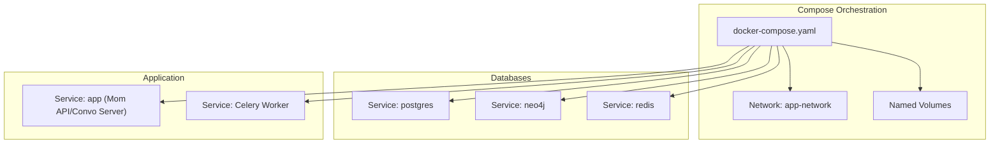
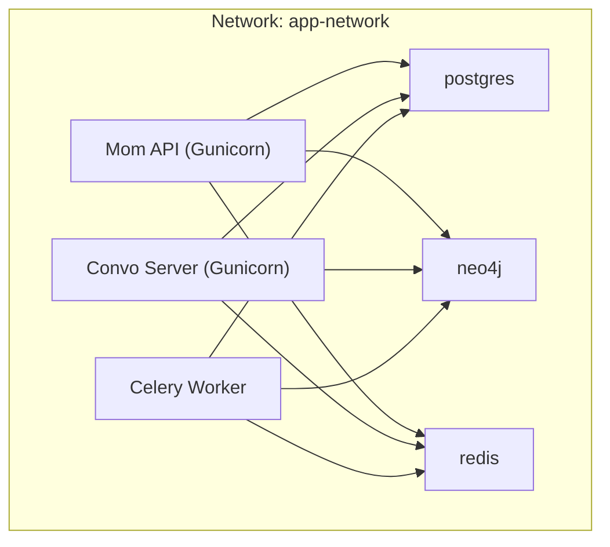
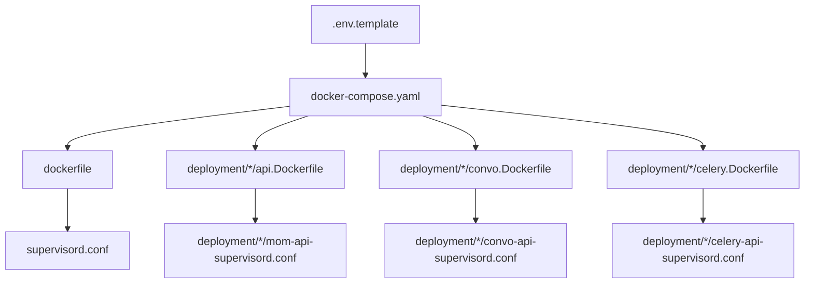
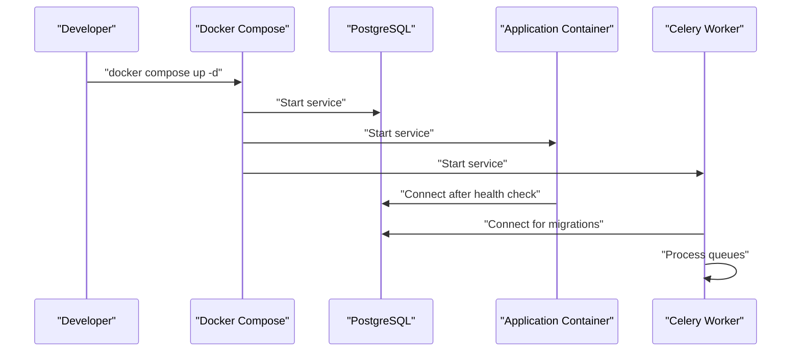

# Docker Configuration

<cite>
**Referenced Files in This Document**
- [docker-compose.yaml](file://docker-compose.yaml)
- [dockerfile](file://dockerfile)
- [.env.template](file://.env.template)
- [pyproject.toml](file://pyproject.toml)
- [requirements.txt](file://requirements.txt)
- [supervisord.conf](file://supervisord.conf)
- [deployment/prod/mom-api/mom-api-supervisord.conf](file://deployment/prod/mom-api/mom-api-supervisord.conf)
- [deployment/prod/convo-server/convo-api-supervisord.conf](file://deployment/prod/convo-server/convo-api-supervisord.conf)
- [deployment/prod/celery/celery-api-supervisord.conf](file://deployment/prod/celery/celery-api-supervisord.conf)
- [deployment/prod/mom-api/api.Dockerfile](file://deployment/prod/mom-api/api.Dockerfile)
- [deployment/prod/convo-server/convo.Dockerfile](file://deployment/prod/convo-server/convo.Dockerfile)
- [deployment/prod/celery/celery.Dockerfile](file://deployment/prod/celery/celery.Dockerfile)
- [start.sh](file://start.sh)
- [start_event_worker.sh](file://start_event_worker.sh)
- [start_event_listener.sh](file://start_event_listener.sh)
- [scripts/install_gvisor.py](file://scripts/install_gvisor.py)
</cite>

## Table of Contents
1. [Introduction](#introduction)
2. [Project Structure](#project-structure)
3. [Core Components](#core-components)
4. [Architecture Overview](#architecture-overview)
5. [Detailed Component Analysis](#detailed-component-analysis)
6. [Dependency Analysis](#dependency-analysis)
7. [Performance Considerations](#performance-considerations)
8. [Troubleshooting Guide](#troubleshooting-guide)
9. [Conclusion](#conclusion)
10. [Appendices](#appendices)

## Introduction
This document provides comprehensive Docker configuration guidance for Potpie, focusing on containerization setup and management. It covers Docker Compose orchestration for PostgreSQL, Neo4j, Redis, and application containers; environment variable configuration; volume mounting strategies; network setup; health checks; Dockerfile configuration and multi-stage build considerations; and operational best practices for development and production. The content balances conceptual explanations for beginners with technical details for experienced operators, aligning with the repository’s codebase and existing configuration artifacts.

## Project Structure
Potpie’s containerization assets are organized around:
- A top-level Docker Compose file defining services, volumes, and networks
- A base application Dockerfile using uv for dependency management and Supervisor for process orchestration
- Production-specific Dockerfiles and Supervisor configurations for Mom API, Convo Server, and Celery
- Environment templates and scripts supporting local startup and gVisor integration

**Diagram sources**
- [docker-compose.yaml](file://docker-compose.yaml#L1-L57)

**Section sources**
- [docker-compose.yaml](file://docker-compose.yaml#L1-L57)
- [dockerfile](file://dockerfile#L1-L50)
- [deployment/prod/mom-api/api.Dockerfile](file://deployment/prod/mom-api/api.Dockerfile#L1-L46)
- [deployment/prod/convo-server/convo.Dockerfile](file://deployment/prod/convo-server/convo.Dockerfile#L1-L43)
- [deployment/prod/celery/celery.Dockerfile](file://deployment/prod/celery/celery.Dockerfile#L1-L46)

## Core Components
This section documents the primary containerized components and their roles within the stack.

- PostgreSQL
  - Image: official postgres latest
  - Purpose: relational database for application data
  - Ports: host 5432 mapped to container 5432
  - Health check: uses pg_isready to verify readiness
  - Volumes: persistent data under /var/lib/postgresql
  - Network: attached to app-network

- Neo4j
  - Image: official neo4j latest
  - Purpose: graph database for knowledge graph and semantic relationships
  - Ports: browser 7474 and bolt 7687 exposed
  - Plugins: APOC enabled via environment variables
  - Volumes: data and logs persisted
  - Network: attached to app-network

- Redis
  - Image: official redis latest
  - Purpose: broker/cache for Celery and streaming
  - Ports: host 6379 mapped to container 6379
  - Volumes: persistence under /data
  - Network: attached to app-network

- Application Services
  - Mom API and Convo Server: served via Gunicorn behind uvicorn workers
  - Celery Worker: background task processing with queue configuration
  - Supervisor: manages Gunicorn and Celery processes within containers

**Section sources**
- [docker-compose.yaml](file://docker-compose.yaml#L2-L19)
- [docker-compose.yaml](file://docker-compose.yaml#L21-L36)
- [docker-compose.yaml](file://docker-compose.yaml#L38-L46)
- [supervisord.conf](file://supervisord.conf#L5-L24)
- [deployment/prod/mom-api/mom-api-supervisord.conf](file://deployment/prod/mom-api/mom-api-supervisord.conf#L5-L13)
- [deployment/prod/convo-server/convo-api-supervisord.conf](file://deployment/prod/convo-server/convo-api-supervisord.conf#L5-L13)
- [deployment/prod/celery/celery-api-supervisord.conf](file://deployment/prod/celery/celery-api-supervisord.conf#L5-L13)

## Architecture Overview
The system architecture centers on a shared network connecting application services to supporting databases and caches. Application containers embed Supervisor to run both Gunicorn and Celery, while production variants apply Alembic migrations and integrate New Relic instrumentation.

**Diagram sources**
- [docker-compose.yaml](file://docker-compose.yaml#L54-L56)
- [docker-compose.yaml](file://docker-compose.yaml#L13-L14)
- [docker-compose.yaml](file://docker-compose.yaml#L35-L36)
- [docker-compose.yaml](file://docker-compose.yaml#L45-L46)
- [supervisord.conf](file://supervisord.conf#L16-L24)
- [deployment/prod/mom-api/mom-api-supervisord.conf](file://deployment/prod/mom-api/mom-api-supervisord.conf#L6-L6)
- [deployment/prod/convo-server/convo-api-supervisord.conf](file://deployment/prod/convo-server/convo-api-supervisord.conf#L6-L6)
- [deployment/prod/celery/celery-api-supervisord.conf](file://deployment/prod/celery/celery-api-supervisord.conf#L6-L6)

## Detailed Component Analysis

### Docker Compose Orchestration
- Services
  - postgres: environment variables for user, password, and database; healthcheck configured; named volume for persistence
  - neo4j: APOC plugin and restricted procedures configured; browser and bolt ports exposed; separate data and logs volumes
  - redis: single-port exposure; data volume for persistence
- Networks
  - app-network bridge network enables service discovery by service name
- Volumes
  - Named volumes for each backend to persist data across container recreation

Operational notes:
- Use environment variables from the template to configure credentials and endpoints consistently across services.
- Health checks ensure dependent services are ready before application startup.

**Section sources**
- [docker-compose.yaml](file://docker-compose.yaml#L1-L57)

### Environment Variable Configuration
Key environment variables and their roles:
- Database connectivity
  - POSTGRES_SERVER: connection string for PostgreSQL
  - NEO4J_URI, NEO4J_USERNAME, NEO4J_PASSWORD: Neo4j credentials and URI
  - REDISHOST, REDISPORT, BROKER_URL: Redis connectivity and queue configuration
- Queue and concurrency
  - CELERY_QUEUE_NAME: determines queue names used by Celery
- Provider and storage
  - LLM_API_BASE, LLM_API_VERSION, and capability flags for model providers
  - Storage providers: GCS, S3, Azure; credentials and buckets
- Observability and telemetry
  - PHOENIX_* and related tracing variables
  - New Relic configuration via environment variable path

Best practices:
- Keep secrets out of images; mount secrets or use external secret managers.
- Use consistent naming and defaults aligned with the template.

**Section sources**
- [.env.template](file://.env.template#L5-L11)
- [.env.template](file://.env.template#L76-L81)
- [.env.template](file://.env.template#L40-L57)

### Volume Mounting Strategies
- Persistent volumes
  - postgres_data: stores PostgreSQL data directory
  - neo4j_data and neo4j_logs: separate data and logs for Neo4j
  - redis_data: stores Redis dump and transient data
- Recommendations
  - Use bind mounts for ephemeral logs or development; prefer named volumes for production durability.
  - Back up volumes regularly and test restore procedures.

**Section sources**
- [docker-compose.yaml](file://docker-compose.yaml#L48-L52)

### Network Setup
- Bridge network app-network
  - Enables DNS-based service discovery by service name
  - Isolates application traffic from host network
- Connectivity
  - Application containers resolve postgres, neo4j, and redis by service name
  - Ports exposed for local access when needed

**Section sources**
- [docker-compose.yaml](file://docker-compose.yaml#L54-L56)

### Health Checks
- PostgreSQL
  - Health check uses pg_isready to verify database availability
- Neo4j and Redis
  - No explicit healthchecks defined; rely on application-level readiness

Recommendations:
- Add health checks for Neo4j and Redis to improve Compose lifecycle management.
- Use Compose health status to gate application startup.

**Section sources**
- [docker-compose.yaml](file://docker-compose.yaml#L15-L19)

### Application Containerization (Base Dockerfile)
- Base image and tools
  - Python slim image with system packages and Supervisor
- Dependency management
  - uv used to install dependencies from pyproject.toml and uv.lock
- Virtual environment
  - .venv created and placed on PATH
- gVisor integration
  - Installs runsc via APT repository for command isolation
- Process supervision
  - Supervisor runs Gunicorn and Celery programs
- Exposure and entrypoint
  - Exposes application and Flower ports; runs Supervisor by default

Production variants:
- Mom API and Convo Server Dockerfiles mirror the base but include Alembic migrations and New Relic instrumentation in Supervisor commands.
- Celery Dockerfile adds Flower exposure and specialized Celery configuration.

**Section sources**
- [dockerfile](file://dockerfile#L1-L50)
- [deployment/prod/mom-api/api.Dockerfile](file://deployment/prod/mom-api/api.Dockerfile#L1-L46)
- [deployment/prod/convo-server/convo.Dockerfile](file://deployment/prod/convo-server/convo.Dockerfile#L1-L43)
- [deployment/prod/celery/celery.Dockerfile](file://deployment/prod/celery/celery.Dockerfile#L1-L46)
- [supervisord.conf](file://supervisord.conf#L5-L24)
- [deployment/prod/mom-api/mom-api-supervisord.conf](file://deployment/prod/mom-api/mom-api-supervisord.conf#L5-L13)
- [deployment/prod/convo-server/convo-api-supervisord.conf](file://deployment/prod/convo-server/convo-api-supervisord.conf#L5-L13)
- [deployment/prod/celery/celery-api-supervisord.conf](file://deployment/prod/celery/celery-api-supervisord.conf#L5-L13)

### Multi-stage Builds and Optimization
Current approach:
- Single-stage build using uv for fast dependency installation and a managed virtual environment
- Minimal base image with essential system packages and Supervisor

Optimization opportunities:
- Multi-stage build to reduce final image size:
  - Stage 1: build dependencies and artifacts
  - Stage 2: copy only runtime dependencies and application code into a minimal runtime image
- Layer caching:
  - Keep dependency metadata and lock files in early layers
- Security:
  - Pin uv version and use non-root user for runtime
  - Audit dependencies periodically

**Section sources**
- [dockerfile](file://dockerfile#L10-L21)
- [pyproject.toml](file://pyproject.toml#L7-L89)
- [requirements.txt](file://requirements.txt#L1-L279)

### Container Lifecycle and Startup Scripts
- Local startup
  - start.sh orchestrates Docker Compose, waits for PostgreSQL readiness, synchronizes dependencies, optionally installs gVisor, applies Alembic migrations, and starts Gunicorn and Celery
- Event worker and listener
  - Dedicated scripts to start Celery workers for event bus queues and a background listener for testing

Operational guidance:
- Use start.sh for local development to ensure prerequisites and migrations are applied before launching services.
- For production, rely on Supervisor-managed processes within containers.

**Section sources**
- [start.sh](file://start.sh#L16-L84)
- [start_event_worker.sh](file://start_event_worker.sh#L18-L25)
- [start_event_listener.sh](file://start_event_listener.sh#L18-L21)

### Security Considerations
- Secrets management
  - Store sensitive values in environment files or secret managers; avoid committing secrets to images or repositories
- Image hardening
  - Use minimal base images, pin versions, and scan images regularly
- Process isolation
  - gVisor integration is supported; ensure proper setup for Docker Desktop environments
- Network segmentation
  - Use dedicated networks and limit exposed ports

**Section sources**
- [dockerfile](file://dockerfile#L26-L31)
- [start.sh](file://start.sh#L50-L74)
- [scripts/install_gvisor.py](file://scripts/install_gvisor.py#L1-L25)

### Scaling Considerations
- Horizontal scaling
  - Run multiple replicas of application services behind a load balancer
  - Scale Celery workers based on queue throughput and CPU/memory capacity
- Resource allocation
  - Configure CPU and memory limits per service in Compose
  - Tune Gunicorn workers and Celery concurrency according to host capacity
- Persistence
  - Ensure volumes are resilient and backed up for stateful services

[No sources needed since this section provides general guidance]

## Dependency Analysis
This section maps the relationships among configuration artifacts and their impact on containerization.

**Diagram sources**
- [.env.template](file://.env.template#L1-L116)
- [docker-compose.yaml](file://docker-compose.yaml#L1-L57)
- [dockerfile](file://dockerfile#L1-L50)
- [deployment/prod/mom-api/api.Dockerfile](file://deployment/prod/mom-api/api.Dockerfile#L1-L46)
- [deployment/prod/convo-server/convo.Dockerfile](file://deployment/prod/convo-server/convo.Dockerfile#L1-L43)
- [deployment/prod/celery/celery.Dockerfile](file://deployment/prod/celery/celery.Dockerfile#L1-L46)
- [supervisord.conf](file://supervisord.conf#L1-L25)
- [deployment/prod/mom-api/mom-api-supervisord.conf](file://deployment/prod/mom-api/mom-api-supervisord.conf#L1-L14)
- [deployment/prod/convo-server/convo-api-supervisord.conf](file://deployment/prod/convo-server/convo-api-supervisord.conf#L1-L14)
- [deployment/prod/celery/celery-api-supervisord.conf](file://deployment/prod/celery/celery-api-supervisord.conf#L1-L14)

**Section sources**
- [docker-compose.yaml](file://docker-compose.yaml#L1-L57)
- [dockerfile](file://dockerfile#L1-L50)
- [supervisord.conf](file://supervisord.conf#L1-L25)

## Performance Considerations
- Image size and pull time
  - Use pinned base images and minimize layers
- Startup latency
  - Pre-warm dependencies with uv and manage migrations during container boot
- Throughput
  - Tune Gunicorn workers and Celery concurrency; monitor queue depths and processing times
- Resource limits
  - Set CPU and memory constraints per service; monitor utilization and adjust accordingly

[No sources needed since this section provides general guidance]

## Troubleshooting Guide
Common issues and resolutions:
- PostgreSQL not ready
  - Verify health check passes and credentials match the template
  - Confirm named volume is mounted and permissions are correct
- Neo4j plugin or procedure errors
  - Ensure APOC plugin and restricted procedures are configured as in the Compose file
- Redis connectivity problems
  - Check broker URL and port mapping; confirm queues exist and are reachable
- Migration failures
  - In production containers, Alembic migrations are executed by Supervisor; inspect logs for errors
- gVisor setup
  - On Docker Desktop, install runsc in the VM and configure Docker Engine runtime; verify installation via scripts

**Section sources**
- [docker-compose.yaml](file://docker-compose.yaml#L15-L19)
- [docker-compose.yaml](file://docker-compose.yaml#L24-L28)
- [deployment/prod/mom-api/mom-api-supervisord.conf](file://deployment/prod/mom-api/mom-api-supervisord.conf#L6-L6)
- [deployment/prod/convo-server/convo-api-supervisord.conf](file://deployment/prod/convo-server/convo-api-supervisord.conf#L6-L6)
- [deployment/prod/celery/celery-api-supervisord.conf](file://deployment/prod/celery/celery-api-supervisord.conf#L6-L6)
- [start.sh](file://start.sh#L50-L74)

## Conclusion
Potpie’s Docker configuration establishes a robust, reproducible environment for development and production. The Compose setup defines clear service boundaries, persistent volumes, and a shared network. The base Dockerfile and production variants leverage uv and Supervisor to streamline dependency management and process orchestration. By following the security, scaling, and troubleshooting recommendations herein, teams can operate Potpie reliably across environments.

[No sources needed since this section summarizes without analyzing specific files]

## Appendices

### Appendix A: Environment Variables Reference
- Database
  - POSTGRES_SERVER: PostgreSQL connection string
  - NEO4J_URI, NEO4J_USERNAME, NEO4J_PASSWORD: Neo4j credentials and URI
  - REDISHOST, REDISPORT, BROKER_URL: Redis connectivity
- Queues and workers
  - CELERY_QUEUE_NAME: queue suffixes used by Celery
- Providers and storage
  - LLM_API_BASE, LLM_API_VERSION, and capability flags
  - GCS/S3/Azure storage variables
- Observability
  - PHOENIX_* and New Relic configuration

**Section sources**
- [.env.template](file://.env.template#L5-L11)
- [.env.template](file://.env.template#L76-L81)
- [.env.template](file://.env.template#L40-L57)

### Appendix B: Service Orchestration Flow

**Diagram sources**
- [docker-compose.yaml](file://docker-compose.yaml#L1-L57)
- [supervisord.conf](file://supervisord.conf#L5-L24)