# Environment Setup

<cite>
**Referenced Files in This Document**
- [.env.template](file://.env.template)
- [docker-compose.yaml](file://docker-compose.yaml)
- [supervisord.conf](file://supervisord.conf)
- [start.sh](file://start.sh)
- [stop.sh](file://stop.sh)
- [pyproject.toml](file://pyproject.toml)
- [requirements.txt](file://requirements.txt)
- [app/core/config_provider.py](file://app/core/config_provider.py)
- [app/core/database.py](file://app/core/database.py)
- [app/main.py](file://app/main.py)
- [deployment/prod/mom-api/mom-api-supervisord.conf](file://deployment/prod/mom-api/mom-api-supervisord.conf)
- [deployment/prod/celery/celery-api-supervisord.conf](file://deployment/prod/celery/celery-api-supervisord.conf)
- [deployment/stage/mom-api/mom-api-supervisord.conf](file://deployment/stage/mom-api/mom-api-supervisord.conf)
- [scripts/setup_gvisor_docker.sh](file://scripts/setup_gvisor_docker.sh)
- [scripts/install_gvisor.py](file://scripts/install_gvisor.py)
- [README.md](file://README.md)
</cite>

## Table of Contents
1. [Introduction](#introduction)
2. [Project Structure](#project-structure)
3. [Core Components](#core-components)
4. [Architecture Overview](#architecture-overview)
5. [Detailed Component Analysis](#detailed-component-analysis)
6. [Dependency Analysis](#dependency-analysis)
7. [Performance Considerations](#performance-considerations)
8. [Troubleshooting Guide](#troubleshooting-guide)
9. [Conclusion](#conclusion)
10. [Appendices](#appendices)

## Introduction
This document explains how to prepare and operate the Potpie environment for both local development and production. It covers environment variable management, service initialization scripts, process supervision, database configuration, dependency installation, and service startup sequences. It also documents configuration templates, environment-specific overrides, secrets management, service discovery, inter-container communication, and health verification.

## Project Structure
The environment setup spans several layers:
- Environment variables: loaded from a template and applied via shell scripts and configuration providers.
- Infrastructure: orchestrated with Docker Compose for Postgres, Neo4j, and Redis.
- Application runtime: FastAPI app with Gunicorn, plus Celery workers.
- Process supervision: SupervisorD configurations for development and production.
- Dependencies: Managed via uv and pinned in requirements.txt/pyproject.toml.
- Optional sandboxing: gVisor installation for command isolation.

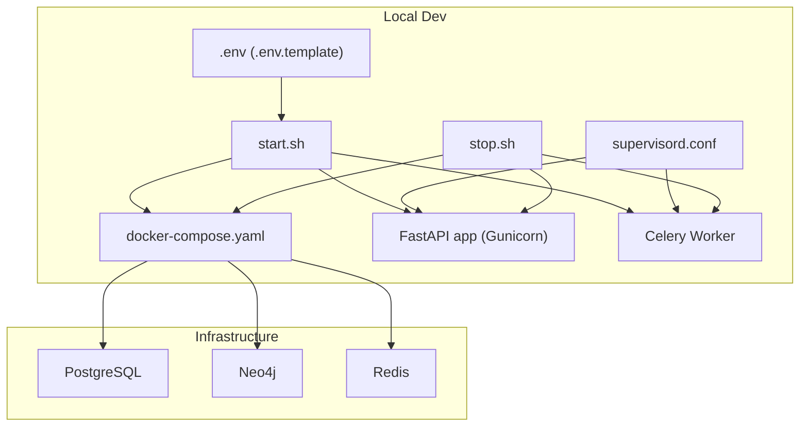

**Diagram sources**
- [.env.template](file://.env.template#L1-L116)
- [start.sh](file://start.sh#L1-L92)
- [stop.sh](file://stop.sh#L1-L16)
- [docker-compose.yaml](file://docker-compose.yaml#L1-L57)
- [supervisord.conf](file://supervisord.conf#L1-L25)

**Section sources**
- [.env.template](file://.env.template#L1-L116)
- [docker-compose.yaml](file://docker-compose.yaml#L1-L57)
- [start.sh](file://start.sh#L1-L92)
- [stop.sh](file://stop.sh#L1-L16)
- [supervisord.conf](file://supervisord.conf#L1-L25)

## Core Components
- Environment variables: Centralized in a template and consumed by the app and scripts. Variables include database URIs, broker URLs, provider credentials, and feature flags.
- Configuration provider: Loads environment variables and exposes typed getters for downstream modules.
- Database configuration: SQLAlchemy engine creation and async engine for route handlers and Celery tasks.
- Application entrypoint: FastAPI app with CORS, logging, Sentry, Phoenix tracing, and health checks.
- Process supervision: SupervisorD configs for development and production, ensuring migrations and process lifecycle.
- Infrastructure orchestration: Docker Compose services for Postgres, Neo4j, and Redis with health checks and persistent volumes.
- Dependency management: uv-managed virtual environments and pinned requirements.

**Section sources**
- [app/core/config_provider.py](file://app/core/config_provider.py#L1-L246)
- [app/core/database.py](file://app/core/database.py#L1-L117)
- [app/main.py](file://app/main.py#L1-L217)
- [pyproject.toml](file://pyproject.toml#L1-L112)
- [requirements.txt](file://requirements.txt#L1-L279)

## Architecture Overview
The environment supports two primary modes:
- Local development: start.sh provisions Docker Compose, applies migrations, and launches Gunicorn and Celery.
- Production/Stage: SupervisorD runs migrations and starts Gunicorn/Celery with New Relic instrumentation.

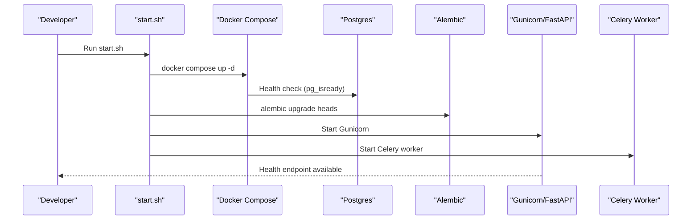

**Diagram sources**
- [start.sh](file://start.sh#L16-L84)
- [docker-compose.yaml](file://docker-compose.yaml#L15-L19)
- [app/main.py](file://app/main.py#L173-L183)

**Section sources**
- [start.sh](file://start.sh#L1-L92)
- [docker-compose.yaml](file://docker-compose.yaml#L1-L57)
- [app/main.py](file://app/main.py#L173-L183)

## Detailed Component Analysis

### Environment Variable Management
- Template and loading: The repository provides a template for environment variables. The app loads environment variables early in the process lifecycle.
- Provider pattern: A configuration provider centralizes environment access and provides computed values (e.g., Redis URL, multimodal detection).
- Overrides and flags: Feature flags control multimodal behavior and development mode enforcement.

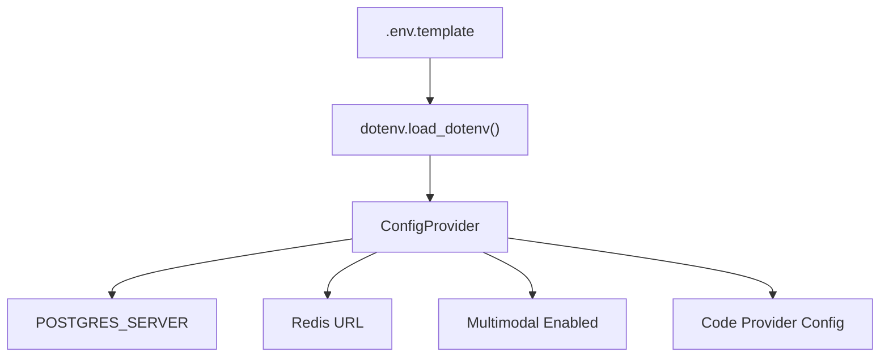

**Diagram sources**
- [.env.template](file://.env.template#L1-L116)
- [app/core/config_provider.py](file://app/core/config_provider.py#L12-L246)

**Section sources**
- [.env.template](file://.env.template#L1-L116)
- [app/core/config_provider.py](file://app/core/config_provider.py#L1-L246)

### Database Configuration
- Connection pools and engines: The database module constructs synchronous and asynchronous engines from the Postgres URI, with pooling and pre-ping enabled.
- Celery-specific sessions: Fresh connections are used in Celery tasks to avoid cross-task Future binding issues.
- Startup behavior: The main app initializes database tables and seeds development data conditionally.

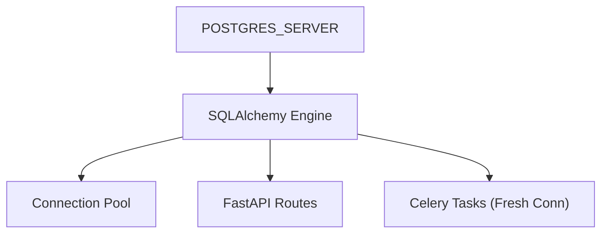

**Diagram sources**
- [app/core/database.py](file://app/core/database.py#L13-L92)
- [app/main.py](file://app/main.py#L143-L146)

**Section sources**
- [app/core/database.py](file://app/core/database.py#L1-L117)
- [app/main.py](file://app/main.py#L143-L146)

### Service Initialization Scripts
- start.sh orchestrates:
  - Docker Compose bring-up and Postgres readiness.
  - uv environment synchronization and optional gVisor installation.
  - Alembic migrations.
  - Gunicorn and Celery startup.
- stop.sh terminates processes and shuts down Docker Compose.

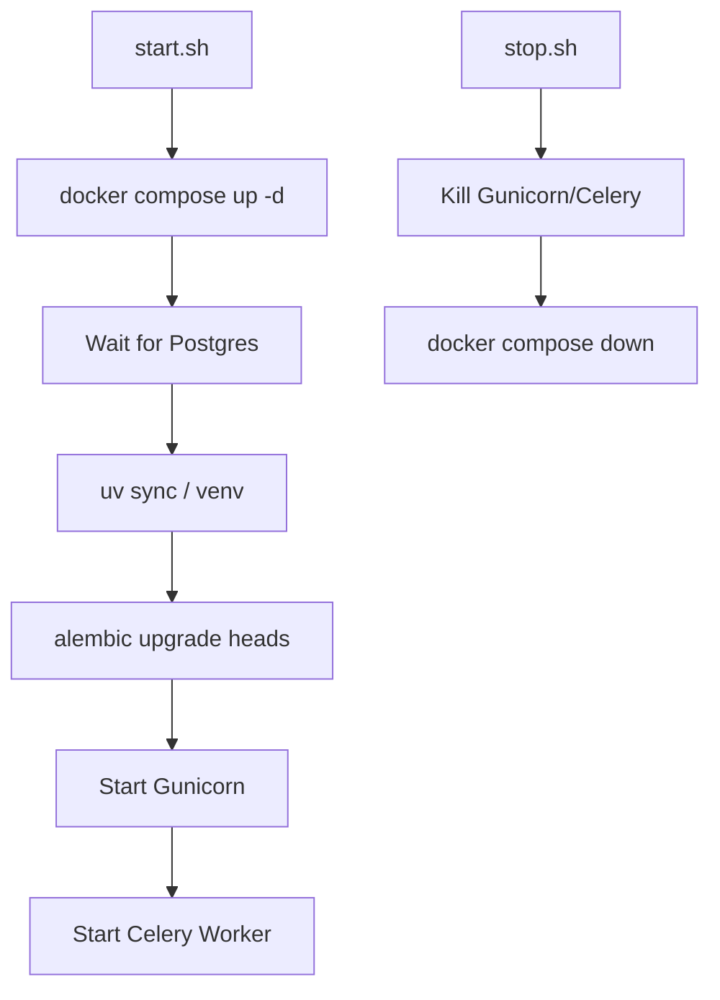

**Diagram sources**
- [start.sh](file://start.sh#L16-L92)
- [stop.sh](file://stop.sh#L1-L16)

**Section sources**
- [start.sh](file://start.sh#L1-L92)
- [stop.sh](file://stop.sh#L1-L16)

### Process Supervision Setup
- Development: supervisord.conf runs Gunicorn and Celery with environment injection and New Relic support.
- Production/Stage: Deployment-specific SupervisorD configs apply migrations and start services with concurrency tuning.

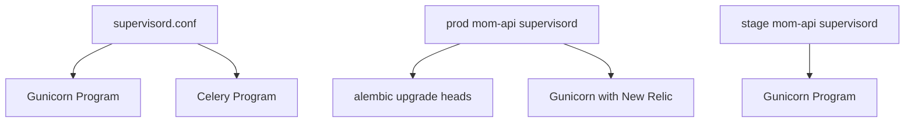

**Diagram sources**
- [supervisord.conf](file://supervisord.conf#L1-L25)
- [deployment/prod/mom-api/mom-api-supervisord.conf](file://deployment/prod/mom-api/mom-api-supervisord.conf#L1-L14)
- [deployment/stage/mom-api/mom-api-supervisord.conf](file://deployment/stage/mom-api/mom-api-supervisord.conf#L1-L14)

**Section sources**
- [supervisord.conf](file://supervisord.conf#L1-L25)
- [deployment/prod/mom-api/mom-api-supervisord.conf](file://deployment/prod/mom-api/mom-api-supervisord.conf#L1-L14)
- [deployment/prod/celery/celery-api-supervisord.conf](file://deployment/prod/celery/celery-api-supervisord.conf#L1-L14)
- [deployment/stage/mom-api/mom-api-supervisord.conf](file://deployment/stage/mom-api/mom-api-supervisord.conf#L1-L14)

### Infrastructure Orchestration
- docker-compose defines Postgres, Neo4j, and Redis with health checks, persisted volumes, and a shared network.
- Containers are addressable by service name within the network.

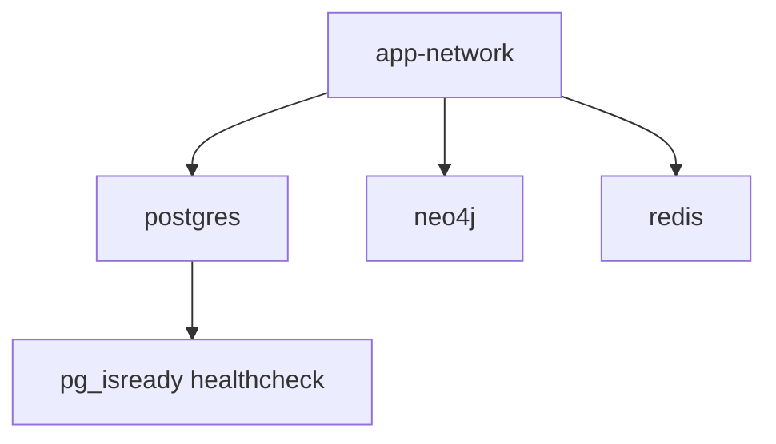

**Diagram sources**
- [docker-compose.yaml](file://docker-compose.yaml#L1-L57)

**Section sources**
- [docker-compose.yaml](file://docker-compose.yaml#L1-L57)

### Dependency Installation and Management
- uv is required for fast dependency synchronization and virtual environment management.
- Dependencies are declared in pyproject.toml and pinned in requirements.txt.
- Scripts support optional gVisor installation for sandboxing.

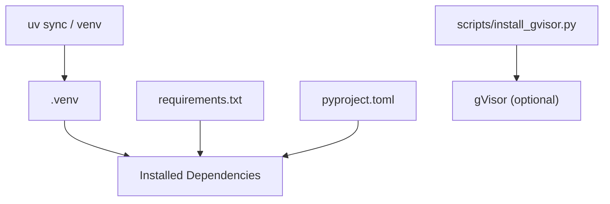

**Diagram sources**
- [start.sh](file://start.sh#L29-L48)
- [pyproject.toml](file://pyproject.toml#L1-L112)
- [requirements.txt](file://requirements.txt#L1-L279)
- [scripts/install_gvisor.py](file://scripts/install_gvisor.py#L1-L25)

**Section sources**
- [start.sh](file://start.sh#L29-L48)
- [pyproject.toml](file://pyproject.toml#L1-L112)
- [requirements.txt](file://requirements.txt#L1-L279)
- [scripts/install_gvisor.py](file://scripts/install_gvisor.py#L1-L25)

### Secrets Management
- Environment variables store secrets (database URIs, provider keys, OAuth credentials).
- The configuration provider exposes getters for sensitive values without hardcoding defaults.
- For production, external secret managers can back environment variables injected at runtime.

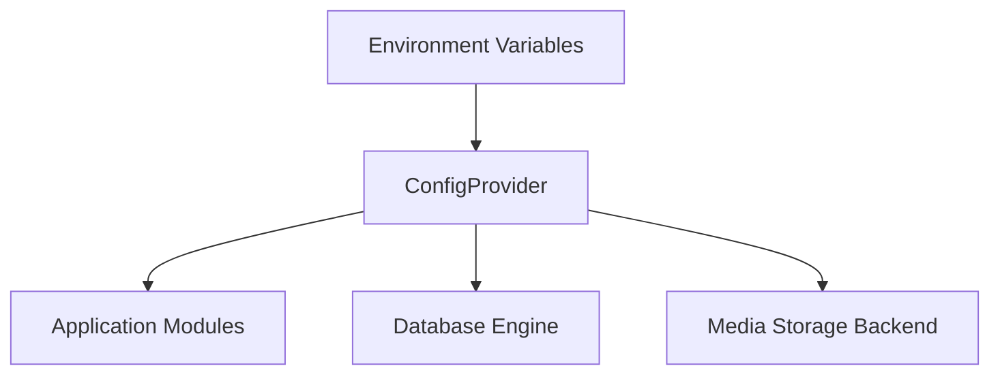

**Diagram sources**
- [.env.template](file://.env.template#L3-L116)
- [app/core/config_provider.py](file://app/core/config_provider.py#L19-L50)

**Section sources**
- [.env.template](file://.env.template#L3-L116)
- [app/core/config_provider.py](file://app/core/config_provider.py#L19-L50)

### Service Discovery and Inter-Container Communication
- Services communicate over the docker-compose network using service names as hostnames.
- The app reads database and broker URIs from environment variables, which are set consistently across scripts and configs.

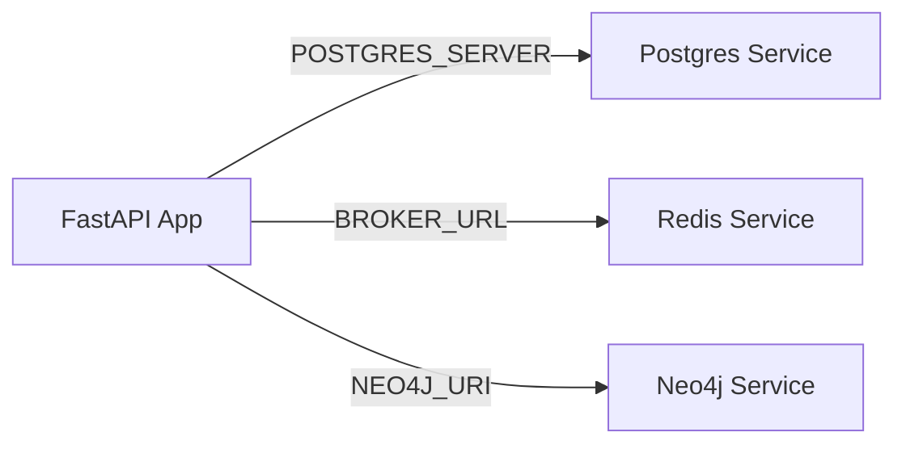

**Diagram sources**
- [app/core/database.py](file://app/core/database.py#L13-L21)
- [app/core/config_provider.py](file://app/core/config_provider.py#L142-L152)
- [docker-compose.yaml](file://docker-compose.yaml#L2-L35)

**Section sources**
- [app/core/database.py](file://app/core/database.py#L13-L21)
- [app/core/config_provider.py](file://app/core/config_provider.py#L142-L152)
- [docker-compose.yaml](file://docker-compose.yaml#L2-L35)

### Startup Sequences and Validation
- Local startup validates Postgres readiness, applies migrations, and starts services.
- Health endpoint confirms application status and version.

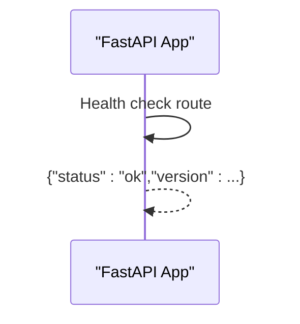

**Diagram sources**
- [app/main.py](file://app/main.py#L173-L183)

**Section sources**
- [start.sh](file://start.sh#L19-L24)
- [app/main.py](file://app/main.py#L173-L183)

## Dependency Analysis
- External systems: Postgres, Neo4j, Redis.
- Internal services: FastAPI app, Celery worker.
- Tools: uv, Docker Compose, Alembic, optional gVisor.

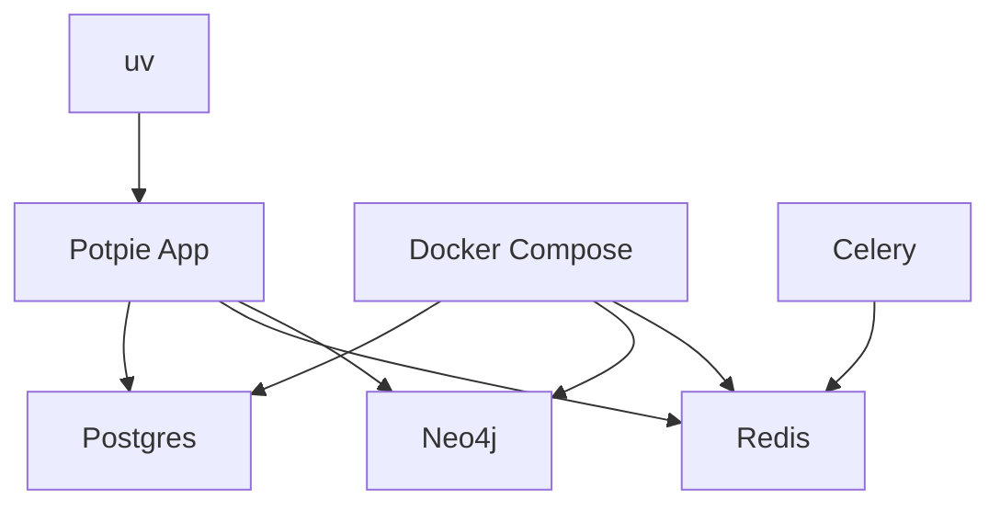

**Diagram sources**
- [start.sh](file://start.sh#L16-L92)
- [docker-compose.yaml](file://docker-compose.yaml#L1-L57)
- [app/core/database.py](file://app/core/database.py#L13-L21)

**Section sources**
- [start.sh](file://start.sh#L1-L92)
- [docker-compose.yaml](file://docker-compose.yaml#L1-L57)
- [app/core/database.py](file://app/core/database.py#L1-L117)

## Performance Considerations
- Connection pooling: SQLAlchemy engines use pooling and pre-ping to maintain healthy connections.
- Async sessions: Separate async engine/session for non-blocking operations; Celery uses fresh connections to avoid coroutine context issues.
- Concurrency: SupervisorD configs specify worker counts and task limits for production.

[No sources needed since this section provides general guidance]

## Troubleshooting Guide
Common environment setup issues and resolutions:
- Docker not running or Compose failing:
  - Ensure Docker is started and accessible.
  - Verify docker-compose health checks for Postgres.
- Postgres unready:
  - start.sh waits for pg_isready; confirm credentials and port mapping.
- uv not found:
  - Install uv and ensure it is on PATH.
- Migration failures:
  - Confirm POSTGRES_SERVER and run migrations within the managed environment.
- gVisor setup:
  - On macOS/Windows with Docker Desktop, follow the script’s guidance to configure Docker runtime and restart Docker Desktop.
- Stopping services:
  - Use stop.sh to terminate processes and shut down Compose cleanly.

**Section sources**
- [start.sh](file://start.sh#L19-L48)
- [stop.sh](file://stop.sh#L1-L16)
- [scripts/setup_gvisor_docker.sh](file://scripts/setup_gvisor_docker.sh#L23-L27)
- [scripts/setup_gvisor_docker.sh](file://scripts/setup_gvisor_docker.sh#L173-L189)

## Conclusion
Potpie’s environment setup combines a robust configuration provider, deterministic Docker Compose orchestration, uv-managed dependencies, and SupervisorD-driven process supervision. Following the steps outlined here ensures reliable local development and predictable production deployments with proper health checks and service coordination.

[No sources needed since this section summarizes without analyzing specific files]

## Appendices

### Environment Preparation Checklist
- Prepare .env from .env.template with required variables.
- Start Docker and run start.sh to provision infrastructure and launch services.
- Apply migrations and verify health endpoint.
- For production, deploy SupervisorD configs and ensure migrations run before starting services.

**Section sources**
- [.env.template](file://.env.template#L1-L116)
- [start.sh](file://start.sh#L1-L92)
- [app/main.py](file://app/main.py#L173-L183)

### Configuration Templates and Overrides
- Use .env.template as the authoritative source for environment variables.
- Override per-environment via deployment-specific SupervisorD commands and Docker Compose environment blocks.

**Section sources**
- [.env.template](file://.env.template#L1-L116)
- [docker-compose.yaml](file://docker-compose.yaml#L5-L8)
- [deployment/prod/mom-api/mom-api-supervisord.conf](file://deployment/prod/mom-api/mom-api-supervisord.conf#L6-L6)

### Service Coordination and Startup Procedures
- Local: start.sh coordinates Docker, migrations, and service startup.
- Production: SupervisorD ensures migrations run and services start with appropriate concurrency and monitoring.

**Section sources**
- [start.sh](file://start.sh#L16-L92)
- [supervisord.conf](file://supervisord.conf#L5-L24)
- [deployment/prod/mom-api/mom-api-supervisord.conf](file://deployment/prod/mom-api/mom-api-supervisord.conf#L6-L6)

### Health Verification
- Call the /health endpoint to confirm application status and version.

**Section sources**
- [app/main.py](file://app/main.py#L173-L183)